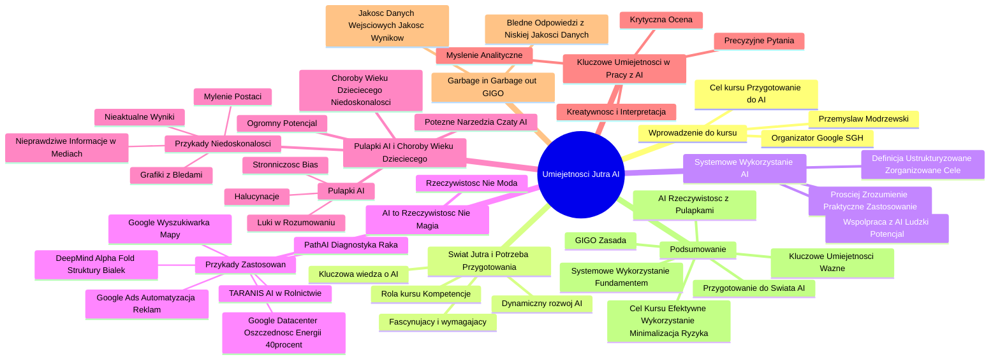

# Lekcje wideo - 1. Jak budować judgement

# 💡 Diagram

___

# 🗒️ Notatka

# Notatki i Podsumowanie Prezentacji Wideo: "Umiejętności Jutra AI"

## Wprowadzenie

Prezentacja wideo pt. "Umiejętności Jutra AI", zorganizowana przez Google i SGH, stanowi wprowadzenie do kursu poświęconego sztucznej inteligencji. Przemysław Modrzewski z Google CEE powitał uczestników, podkreślając kluczowe znaczenie umiejętności AI w kontekście nadchodzącego `świata jutra`. Celem kursu jest przygotowanie uczestników do efektywnego i systematycznego wykorzystania sztucznej inteligencji.

## Świat Jutra i Potrzeba Przygotowania

* **`Świat jutra`**: W kontekście dynamicznego rozwoju AI, określenie `świat jutra` nabiera realnego wymiaru.
* **Fascynujący, lecz wymagający:** Świat z wszechobecną AI niesie fascynujące możliwości, ale kluczowe jest odpowiednie przygotowanie.
* **Kluczowa wiedza:**  Zdobycie wiedzy o AI jest niezbędne do efektywnego funkcjonowania w nowej rzeczywistości.
* **Rola kursu:** Ten kurs ma wyposażyć uczestników w kompetencje niezbędne w tym nowym świecie.

## Systemowe Wykorzystanie AI

* **Definicja:** `Systemowe wykorzystanie AI` to **ustrukturyzowane i zorganizowane** podejście, polegające na użyciu AI w **logicznej sekwencji działań**, aby **szybciej i efektywniej osiągać jasno określone cele**.
* **Prościej:** To pełne zrozumienie i umiejętność praktycznego zastosowania narzędzi AI w różnych kontekstach – zarówno zawodowych, jak i osobistych – tak, aby AI wspomagała realizację zamierzonych celów.
* **Kluczowy aspekt:** Umiejętność współpracy z AI w sposób, który **maksymalizuje ludzki potencjał i talenty**.

## AI to Rzeczywistość, Nie Magia

* **AI to rzeczywistość, nie chwilowa moda:** Sztuczna inteligencja jest z nami od lat i znajduje szerokie zastosowanie w biznesie.
* **Przykłady zastosowań AI:**
    * **PathAI:** Wspomaganie diagnostyki raka i terapii poprzez uczenie maszynowe.
    * **DeepMind (Alpha Fold):** Przełomowe przewidywanie struktur białek, kluczowe w badaniach nad lekami i chorobami.
    * **TARANIS:** AI w rolnictwie 🧑‍🌾, identyfikująca choroby i szkodniki roślin na podstawie analizy zdjęć z dronów.
    * **Google Ads:** Automatyzacja kampanii reklamowych.
    * **Google:** Wykorzystanie AI w wyszukiwarce 🔍, Mapach Google 🗺️ i innych usługach.
    * **Oszczędność energii w Google Datacenter:** Dzięki uczeniu maszynowemu, Google zredukował zużycie energii na chłodzenie serwerów o imponujące **40%** ⚡.

## Zalety i Potencjalne Pułapki AI

* **AI – technologia o ogromnym potencjale:** AI potrafi zdziałać cuda, oferując niespotykane wcześniej korzyści, jak np. znaczące oszczędności energii.
* **Dostęp do potężnych narzędzi:** Czaty AI udostępniły ludzkości niezwykle potężne narzędzia.
* **"Choroby wieku dziecięcego" AI:**  Początki szerokiego wdrażania AI, podobnie jak w przypadku nowych technologii, wiążą się z pewnymi `niedoskonałościami`.

## Pułapki AI i "Choroby Wieku Dziecięcego" - Na Co Uważać?

* **Przykłady `niedoskonałości` AI:**
    * **Generowanie grafik z błędami:** np. nieprawidłowa liczba palców, łysiejące stopy.
    * **Publikowanie nieprawdziwych informacji** w mediach społecznościowych.
    * **Mylenie znanych postaci:** np. Shrek mylony z Monalizą.
    * **Udostępnianie nieaktualnych wyników:** np. relacjonowanie meczów, które się nie odbyły.
* **Subiektywne opinie:** Te niedoskonałości mogą prowadzić do negatywnej oceny AI, zwłaszcza w kontekście wygórowanych oczekiwań, kreowanych przez filmy science fiction 🎬.
* **`Pułapki` AI:**
    * **`Halucynacje`:** Generowanie błędnych lub zmyślonych informacji.
    * **`Stronniczość` (Bias):** AI uczy się na danych, które mogą zawierać uprzedzenia, np. faworyzowanie określonych grup w procesach rekrutacyjnych.
    * **`Luki w rozumowaniu`:** Problemy z interpretacją kontekstu, zdrowym rozsądkiem i oceną etyczną.

## Kluczowe Umiejętności w Pracy z AI

* **Kluczowe umiejętności w pracy z AI:**
    * **`Myślenie analityczne`**
    * **`Umiejętność zadawania precyzyjnych pytań`**
    * **`Krytyczna ocena wyników`**
    * **`Kreatywność i interpretacja danych`**

## Garbage in, Garbage out (GIGO)

* **Zasada `GIGO` (Garbage in, Garbage out):** Jakość danych wejściowych bezpośrednio przekłada się na jakość wyników.
* **Konsekwencja:** Nieprecyzyjne i niskiej jakości dane wejściowe prowadzą do błędnych odpowiedzi.

## Podsumowanie

Prezentacja stanowi wprowadzenie do kursu `Umiejętności Jutra AI`, akcentując kluczowe znaczenie przygotowania do `świata`, w którym sztuczna inteligencja odgrywa fundamentalną rolę. Definiuje `systemowe wykorzystanie AI` jako fundament efektywnego działania. Podkreśla, że AI to nie tylko rzeczywistość z szerokim spektrum zastosowań, ale również technologia z `chorobami wieku dziecięcego` i potencjalnymi `pułapkami`, wymagającymi ostrożności. Wskazuje na kluczowe umiejętności w pracy z AI, takie jak: `myślenie analityczne`, `umiejętność zadawania precyzyjnych pytań`, `krytyczna ocena` i `kreatywność`. Istotna jest również świadomość zasady `GIGO` – jakość danych wejściowych determinuje jakość otrzymywanych wyników. Kurs ma za zadanie nauczyć uczestników systematycznego i efektywnego wykorzystania AI, minimalizując ryzyko związane z jej `niedoskonałościami`.

___

# 🔉 Transcript
File: Lekcje wideo - 1. Jak budować judgement.mp4 
[00:00:00] Ekran: Białe tło z czarną pionową kreską po lewej stronie.
[00:00:01] Ekran: Napis "Umiejętności Jutra" w kolorze czarnym. Po prawej stronie napis "AI" w kolorach fioletowym, niebieskim i różowym.
[00:00:03] Ekran: Pod napisem "Umiejętności Jutra AI" znajdują się dwa mniejsze napisy: "Organizator Google" oraz "Partner edukacyjny SGH".
[00:00:05] Ekran: Mężczyzna siedzi przy biurku, za nim regał z książkami. Na biurku stoi laptop, kubek z napisem "You Tube" oraz roślina w doniczce.
[00:00:05] Witajcie.
[00:00:06] Ekran: Pod mężczyzną pojawia się napis "Przemysław Modrzewski Measurement & Growth Lead, CEE Google".
[00:00:06] Nawet nie wiecie jak się cieszę, że się spotykamy na tym wyjątkowym kursie.
[00:00:12] Szczerze gratuluję wam pozytywnego przyjęcia do naszego programu i mam nadzieję, że emocje już opadły po rekrutacji, bo przed nami jest bardzo intensywny czas teraz.
[00:00:21] Wszyscy właśnie wsiedliśmy do pociągu, który pędzi w kierunku tak zwanego świata jutra i tym razem naprawdę mimo, że jestem zawsze sceptyczny do takich górnolotnych stwierdzeń, ale określenie świat jutra wygląda w tym przypadku jak nieprzesadzone stwierdzenie.
[00:00:38] Ten nowy świat, świat ludzi, którzy będą wykorzystywać na co dzień sztuczną inteligencję w prawie każdym aspekcie życia, może być naprawdę fascynujący, ale jest jeden warunek podstawowy.
[00:00:53] Ludzie muszą najpierw posiadać odpowiednią wiedzę, żeby się do tego nowego świata odpowiednio przygotować.
[00:01:01] No i właśnie tak wygląda mi dzisiaj, że to my właśnie będziemy tymi ludźmi.
[00:01:06] Ale co mam na myśli mówiąc przygotować?
[00:01:09] Więc chodzi mi tutaj nie tylko o zrozumienie jak działa sztuczna inteligencja, czyli poznanie jej możliwości, ale chyba co najważniejsze, nauczenie się korzystania z niej w sposób systemowy.
[00:01:26] A co to znaczy dla nas systemowy?
[00:01:29] Ekran: Pojawia się biała plansza z napisem "Wykorzystanie systemowe - wykorzystanie AI w sposób ustrukturyzowany i zorganizowany z logiczną sekwencją działań, tak aby wszystko co robimy przybliżało nas szybciej i efektywniej do wcześniej jasno określonych celów".
[00:01:29] Systemowe wykorzystanie to wykorzystanie AI w sposób ustrukturyzowany i zorganizowany z logiczną sekwencją działań, tak aby wszystko co robimy przybliżało nas szybciej i efektywniej do wcześniej jasno określonych celów.
[00:01:45] Może trochę skomplikowana ta definicja, ale dla mnie to po prostu pełne zrozumienie i umiejętność zastosowania odpowiednich narzędzi AI w konkretnych miejscach w organizacji i naszych sytuacjach życiowych, aby sztuczna inteligencja spełniała nasze założone cele.
[00:02:04] No i jeszcze jedno, co także jest tutaj bardzo istotne.
[00:02:09] Musimy wiedzieć jak pracować z tą technologią w taki sposób, aby móc jak najefektywniej wykorzystać nasze naturalne ludzkie umiejętności i talenty, których maszyny nie mają i długo jeszcze mieć nie będą.
[00:02:23] No właśnie.
[00:02:24] AI to dziś synonim postępu, innowacji czy przyszłości, prawda?
[00:02:29] Słyszymy i oglądamy często filmiki o samojezdnych samochodach, wirtualnych asystentach, algorytmach, które diagnozują choroby lepiej niż lekarze.
[00:02:39] To wszystko brzmi niesamowicie, prawda?
[00:02:42] Ale czy AI tak naprawdę to jakaś nowa magia, nowa sezonowa moda?
[00:02:47] No absolutnie nie.
[00:02:49] W rzeczywistości sztuczna inteligencja jest z nami już no ładnych parę lat i wiele firm wykorzystuje tą technologię w bardzo zaawansowany sposób.
[00:03:00] Ekran: Pojawia się biała plansza z napisem "AI to rzeczywistość!". Pod spodem cztery przykłady: "PathAI - diagnostyka raka", "DeepMind - przewidywanie struktury białek", "TARANIS - AI w rolnictwie", "Google Ads - automatyzacja kampanii reklamowych".
[00:03:00] Mamy takie znane przykłady firm jak chociażby Path AI, firma, która wykorzystuje uczenie maszynowe do poprawy dokładności diagnozowania raka i opracowania nowych terapii.
[00:03:13] Na przykład firma Tarantis, która wykorzystuje AI do identyfikacji chorób i szkodników roślin na podstawie zdjęć z dronów, no co umożliwia szybką reakcję i minimalizację strat.
[00:03:25] Lub na przykład system Alpha Fold opracowany przez Deep Mind, który przewiduje struktury białek z dużą dokładnością, co ma przełomowe znaczenie dla badań nad lekami i chorobami.
[00:03:38] Z kolei my w Google też korzystamy szeroko z dobrodziejstw sztucznej inteligencji od paru lat.
[00:03:44] Na przykład do poprawy efektywności naszych produktów i usług, takich jak wyszukiwarka, mapy Google czy program reklamowy Google Ads, no i wiele innych.
[00:03:54] Dzięki chociażby uczeniu maszynowemu oszczędzamy też masę energii na zasilanie serwerów na całym świecie.
[00:04:02] To są oszczędności niespotykane nigdy wcześniej, dochodzące do 40 nawet procent w porównaniu do standardowych metod zarządzania energią.
[00:04:09] Jak widziałem wyniki tej optymalizacji, to naprawdę byłem pod ogromnym wrażeniem, bo wydawało się to praktycznie niemożliwe, no a jednak się wydarzyło.
[00:04:17] Więc AI to jest świetna technologia, która potrafi działać cuda, ale ma też ciemniejsze strony.
[00:04:24] Odkąd światu zostały zaprezentowane pierwsze tak zwane czaty AI, cała ludzkość otrzymała nagle dostęp do bardzo potężnego narzędzia, które nie zawsze działa jakby tego oczekiwali użytkownicy.
[00:04:38] Zwłaszcza ci, co wiedzę o tej technologii czerpali przede wszystkim z filmów Science Fiction.
[00:04:44] No prawdą jest też to, że trochę jest tak jak często określa się pewien okres przy okazji wypuszczania nowego modelu samochodu, czyli tak zwane choroby wieku dziecięcego.
[00:04:57] Ekran: Mężczyzna siedzi przy biurku, za nim regał z książkami. Na biurku stoi laptop, kubek z napisem "You Tube" oraz roślina w doniczce.
[00:04:57] To trochę też tak można powiedzieć o początkach szerokiego zastosowania sztucznej inteligencji przez miliony ludzi na całym świecie.
[00:05:08] Ekran: Mężczyzna siedzi przy biurku, za nim regał z książkami. Na biurku stoi laptop, kubek z napisem "You Tube" oraz roślina w doniczce.
[00:05:08] Każdy, kto choć trochę interesował się rozwojem i bieżącymi nowinkami ze sfery AI, słyszał albo widział przykłady niedoskonałości tej technologii, takie jak chociażby generowanie grafiki z ludźmi o siedmiu palcach i łyszami zamiast stóp, albo publikowanie radykalnych postów i totalnych głupot w mediach społecznościowych, mylenie Shireka z Monalizą czy dzielenie się wynikami meczów, które jeszcze się nie odbyły, tak i tak dalej i tak dalej.
[00:05:23] Takie przykłady mogły powodować tworzenie się pewnych subiektywnych opinii o sztucznej inteligencji w kontrze do naszych rozbujałych oczekiwań co do tej technologii na bazie właśnie fikcji lub filmów Science Fiction.
[00:05:53] Ekran: Mężczyzna siedzi przy biurku, za nim regał z książkami. Na biurku stoi laptop, kubek z napisem "You Tube" oraz roślina w doniczce.
[00:05:53] Ale musimy wiedzieć jak pracować z tą technologią w taki sposób, aby móc jak najefektywniej wykorzystać nasze naturalne ludzkie umiejętności i talenty, których maszyny nie mają i długo jeszcze mieć nie będą.
[00:06:00] Ekran: Pojawia się biała plansza z napisem "AI to rzeczywistość!". Pod spodem cztery przykłady: "PathAI - diagnostyka raka", "DeepMind - przewidywanie struktury białek", "TARANIS - AI w rolnictwie", "Google Ads - automatyzacja kampanii reklamowych".
[00:06:00] Mamy takie znane przykłady firm jak chociażby Path AI, firma, która wykorzystuje uczenie maszynowe do poprawy dokładności diagnozowania raka i opracowania nowych terapii.
[00:06:13] Na przykład firma Tarantis, która wykorzystuje AI do identyfikacji chorób i szkodników roślin na podstawie zdjęć z dronów, no co umożliwia szybką reakcję i minimalizację strat.
[00:06:25] Lub na przykład system Alpha Fold opracowany przez Deep Mind, który przewiduje struktury białek z dużą dokładnością, co ma przełomowe znaczenie dla badań nad lekami i chorobami.
[00:06:40] Z kolei my w Google też korzystamy szeroko z dobrodziejstw sztucznej inteligencji od paru lat.
[00:06:53] Ekran: Pojawia się biała plansza z napisem "Google Datacenter". Po prawej stronie wykres kołowy z wartością 40%. Pod spodem napis "Dzięki Machine Learning Google zdołał zmniejszyć zużycie energii na chłodzenie serwerów o 40%".
[00:06:53] Dzięki chociażby uczeniu maszynowemu oszczędzamy też masę energii na zasilanie serwerów na całym świecie.
[00:07:03] To są oszczędności niespotykane nigdy wcześniej, dochodzące do 40 nawet procent w porównaniu do standardowych metod zarządzania energią.
[00:07:09] Jak widziałem wyniki tej optymalizacji, to naprawdę byłem pod ogromnym wrażeniem, bo wydawało się to praktycznie niemożliwe, no a jednak się wydarzyło.
[00:07:17] Więc AI to jest świetna technologia, która potrafi działać cuda, ale ma też ciemniejsze strony.
[00:07:24] Odkąd światu zostały zaprezentowane pierwsze tak zwane czaty AI, cała ludzkość otrzymała nagle dostęp do bardzo potężnego narzędzia, które nie zawsze działa jakby tego oczekiwali użytkownicy.
[00:07:41] Ekran: Pojawia się biała plansza z napisem "Kluczowe umiejętności w pracy z AI". Pod spodem lista: "Analityczne myślenie", "Umiejętność zadawania właściwych pytań", "Krytyczna ocena wyników", "Kreatywność i umiejętność interpretacji danych".
[00:07:41] Zwłaszcza ci, co wiedzę o tej technologii czerpali przede wszystkim z filmów Science Fiction.
[00:07:52] Ekran: Mężczyzna siedzi przy biurku, za nim regał z książkami. Na biurku stoi laptop, kubek z napisem "You Tube" oraz roślina w doniczce.
[00:07:52] No prawdą jest też to, że trochę jest tak jak często określa się pewien okres przy okazji wypuszczania nowego modelu samochodu, czyli tak zwane choroby wieku dziecięcego.
[00:08:00] Ekran: Pojawia się biała plansza z napisem "Garbage in Garbage out". Pod spodem napis "Garbage in, Garbage out (GIGO). Jakość danych wejściowych wpływa na jakość wyników. Dane nieprecyzyjne i niskiej jakości dają błędne odpowiedzi".
[00:08:00] To trochę też tak można powiedzieć o początkach szerokiego zastosowania sztucznej inteligencji przez miliony ludzi na całym świecie.
[00:08:13] Ekran: Mężczyzna siedzi przy biurku, za nim regał z książkami. Na biurku stoi laptop, kubek z napisem "You Tube" oraz roślina w doniczce.
[00:08:13] Każdy, kto choć trochę interesował się rozwojem i bieżącymi nowinkami ze sfery AI, słyszał albo widział przykłady niedoskonałości tej technologii, takie jak chociażby generowanie grafiki z ludźmi o siedmiu palcach i łyszami zamiast stóp.
[00:08:23] Ekran: Pojawia się biała plansza z napisem "Pułapki AI - na co uważać?". Pod spodem lista: "Halucynacje - może generować błędne lub zmyślone informacje", "Stronniczość - AI uczy się na danych, które mogą zawierać uprzedzenia (np. faworyzacja jednej grupy w rekrutacji)", "Luki w rozumowaniu - problemy z interpretacją kontekstu, zdrowym rozsądkiem i oceną etyczną".
[00:08:23] Albo publikowanie radykalnych postów i totalnych głupot w mediach społecznościowych, mylenie Shireka z Monalizą czy dzielenie się wynikami meczów, które jeszcze się nie odbyły, tak i tak dalej i tak dalej.
[00:08:31] Takie przykłady mogły powodować tworzenie się pewnych subiektywnych opinii o sztucznej inteligencji w kontrze do naszych rozbujałych oczekiwań co do tej technologii na bazie właśnie fikcji lub filmów Science Fiction.
[00:08:41] Ekran: Mężczyzna siedzi przy biurku, za nim regał z książkami. Na biurku stoi laptop, kubek z napisem "You Tube" oraz roślina w doniczce.
[00:08:41] No prawdą jest też to, że trochę jest tak jak często określa się pewien okres przy okazji wypuszczania nowego modelu samochodu, czyli tak zwane choroby wieku dziecięcego.
[00:08:51] Ekran: Pojawia się biała plansza z napisem "Kluczowe umiejętności w pracy z AI". Pod spodem lista: "Analityczne myślenie", "Umiejętność zadawania właściwych pytań", "Krytyczna ocena wyników", "Kreatywność i umiejętność interpretacji danych".
[00:08:51] To trochę też tak można powiedzieć o początkach szerokiego zastosowania sztucznej inteligencji przez miliony ludzi na całym świecie.
[00:09:00] Ekran: Mężczyzna siedzi przy biurku, za nim regał z książkami. Na biurku stoi laptop, kubek z napisem "You Tube" oraz roślina w doniczce.
[00:09:00] Każdy, kto choć trochę interesował się rozwojem i bieżącymi nowinkami ze sfery AI, słyszał albo widział przykłady niedoskonałości tej technologii, takie jak chociażby generowanie grafiki z ludźmi o siedmiu palcach i łyszami zamiast stóp.
[00:09:15] Ekran: Pojawia się biała plansza z napisem "Google Datacenter". Po prawej stronie wykres kołowy z wartością 40%. Pod spodem napis "Dzięki Machine Learning Google zdołał zmniejszyć zużycie energii na chłodzenie serwerów o 40%".
[00:09:15] Dzięki chociażby uczeniu maszynowemu oszczędzamy też masę energii na zasilanie serwerów na całym świecie.
[00:09:23] To są oszczędności niespotykane nigdy wcześniej, dochodzące do 40 nawet procent w porównaniu do standardowych metod zarządzania energią.
[00:09:29] Jak widziałem wyniki tej optymalizacji, to naprawdę byłem pod ogromnym wrażeniem, bo wydawało się to praktycznie niemożliwe, no a jednak się wydarzyło.
[00:09:37] Więc AI to jest świetna technologia, która potrafi działać cuda, ale ma też ciemniejsze strony.
[00:09:44] Odkąd światu zostały zaprezentowane pierwsze tak zwane czaty AI, cała ludzkość otrzymała nagle dostęp do bardzo potężnego narzędzia, które nie zawsze działa jakby tego oczekiwali użytkownicy.
[01:00:00] Ekran: Pojawia się biała plansza z napisem "Kluczowe umiejętności w pracy z AI". Pod spodem lista: "Analityczne myślenie", "Umiejętność zadawania właściwych pytań", "Krytyczna ocena wyników", "Kreatywność i umiejętność interpretacji danych".
[01:00:00] Zwłaszcza ci, co wiedzę o tej technologii czerpali przede wszystkim z filmów Science Fiction.
[01:00:13] Ekran: Mężczyzna siedzi przy biurku, za nim regał z książkami. Na biurku stoi laptop, kubek z napisem "You Tube" oraz roślina w doniczce.
[01:00:13] No prawdą jest też to, że trochę jest tak jak często określa się pewien okres przy okazji wypuszczania nowego modelu samochodu, czyli tak zwane choroby wieku dziecięcego.
[01:00:27] Ekran: Pojawia się biała plansza z napisem "Garbage in Garbage out". Pod spodem napis "Garbage in, Garbage out (GIGO). Jakość danych wejściowych wpływa na jakość wyników. Dane nieprecyzyjne i niskiej jakości dają błędne odpowiedzi".
[01:00:27] To trochę też tak można powiedzieć o początkach szerokiego zastosowania sztucznej inteligencji przez miliony ludzi na całym świecie.
[01:00:41] Ekran: Mężczyzna siedzi przy biurku, za nim regał z książkami. Na biurku stoi laptop, kubek z napisem "You Tube" oraz roślina w doniczce.
[01:00:41] Każdy, kto choć trochę interesował się rozwojem i bieżącymi nowinkami ze sfery AI, słyszał albo widział przykłady niedoskonałości tej technologii, takie jak chociażby generowanie grafiki z ludźmi o siedmiu palcach i łyszami zamiast stóp.
[01:01:13] Ekran: Pojawia się biała plansza z napisem "Pułapki AI - na co uważać?". Pod spodem lista: "Halucynacje - może generować błędne lub zmyślone informacje", "Stronniczość - AI uczy się na danych, które mogą zawierać uprzedzenia (np. faworyzacja jednej grupy w rekrutacji)", "Luki w rozumowaniu - problemy z interpretacją kontekstu, zdrowym rozsądkiem i oceną etyczną".
[01:01:13] Albo publikowanie radykalnych postów i totalnych głupot w mediach społecznościowych, mylenie Shireka z Monalizą czy dzielenie się wynikami meczów, które jeszcze się nie odbyły, tak i tak dalej i tak dalej.
[01:01:27] Takie przykłady mogły powodować tworzenie się pewnych subiektywnych opinii o sztucznej inteligencji w kontrze do naszych rozbujałych oczekiwań co do tej technologii na bazie właśnie fikcji lub filmów Science Fiction.
[01:01:40] Ekran: Mężczyzna siedzi przy biurku, za nim regał z książkami. Na biurku stoi laptop, kubek z napisem "You Tube" oraz roślina w doniczce.
[01:01:40] No prawdą jest też to, że trochę jest tak jak często określa się pewien okres przy okazji wypuszczania nowego modelu samochodu, czyli tak zwane choroby wieku dziecięcego.
[01:01:54] Ekran: Pojawia się biała plansza z napisem "Kluczowe umiejętności w pracy z AI". Pod spodem lista: "Analityczne myślenie", "Umiejętność zadawania właściwych pytań", "Krytyczna ocena wyników", "Kreatywność i umiejętność interpretacji danych".
[01:01:54] To trochę też tak można powiedzieć o początkach szerokiego zastosowania sztucznej inteligencji przez miliony ludzi na całym świecie.
[01:02:08] Ekran: Mężczyzna siedzi przy biurku, za nim regał z książkami. Na biurku stoi laptop, kubek z napisem "You Tube" oraz roślina w doniczce.
[01:02:08] Każdy, kto choć trochę interesował się rozwojem i bieżącymi nowinkami ze sfery AI, słyszał albo widział przykłady niedoskonałości tej technologii, takie jak chociażby generowanie grafiki z ludźmi o siedmiu palcach i łyszami zamiast stóp.
[01:02:23] Ekran: Pojawia się biała plansza z napisem "Garbage in Garbage out". Pod spodem napis "Garbage in, Garbage out (GIGO). Jakość danych wejściowych wpływa na jakość wyników. Dane nieprecyzyjne i niskiej jakości dają błędne odpowiedzi".
[01:02:23] Albo publikowanie radykalnych postów i totalnych głupot w mediach społecznościowych, mylenie Shireka z Monalizą czy dzielenie się wynikami meczów, które jeszcze się nie odbyły, tak i tak dalej i tak dalej.
[01:02:37] Ekran: Mężczyzna siedzi przy biurku, za nim regał z książkami. Na biurku stoi laptop, kubek z napisem "You Tube" oraz roślina w doniczce.
[01:02:37] Takie przykłady mogły powodować tworzenie się pewnych subiektywnych opinii o sztucznej inteligencji w kontrze do naszych rozbujałych oczekiwań co do tej technologii na bazie właśnie fikcji lub filmów Science Fiction.
[01:02:53] Ekran: Pojawia się biała plansza z napisem "Pułapki AI - na co uważać?". Pod spodem lista: "Halucynacje - może generować błędne lub zmyślone informacje", "Stronniczość - AI uczy się na danych, które mogą zawierać uprzedzenia (np. faworyzacja jednej grupy w rekrutacji)", "Luki w rozumowaniu - problemy z interpretacją kontekstu, zdrowym rozsądkiem i oceną etyczną".
[01:02:53] A co to znaczy dla nas systemowy?
[01:02:59] Ekran: Mężczyzna siedzi przy biurku, za nim regał z książkami. Na biurku stoi laptop, kubek z napisem "You Tube" oraz roślina w doniczce.
[01:02:59] Systemowe wykorzystanie to wykorzystanie AI w sposób ustrukturyzowany i zorganizowany z logiczną sekwencją działań, tak aby wszystko co robimy przybliżało nas szybciej i efektywniej do wcześniej jasno określonych celów.
[01:03:16] Może trochę skomplikowana ta definicja, ale dla mnie to po prostu pełne zrozumienie i umiejętność zastosowania odpowiednich narzędzi AI w konkretnych miejscach w organizacji i naszych sytuacjach życiowych, aby sztuczna inteligencja spełniała nasze założone cele.
[01:03:36] Ekran: Mężczyzna siedzi przy biurku, za nim regał z książkami. Na biurku stoi laptop, kubek z napisem "You Tube" oraz roślina w doniczce.
[01:03:36] No i jeszcze jedno, co także jest tutaj bardzo istotne.
[01:03:40] Ekran: Pojawia się biała plansza z napisem "AI to rzeczywistość!". Pod spodem cztery przykłady: "PathAI - diagnostyka raka", "DeepMind - przewidywanie struktury białek", "TARANIS - AI w rolnictwie", "Google Ads - automatyzacja kampanii reklamowych".
[01:03:40] Mamy takie znane przykłady firm jak chociażby Path AI, firma, która wykorzystuje uczenie maszynowe do poprawy dokładności diagnozowania raka i opracowania nowych terapii.
[01:03:53] Na przykład firma Tarantis, która wykorzystuje AI do identyfikacji chorób i szkodników roślin na podstawie zdjęć z dronów, no co umożliwia szybką reakcję i minimalizację strat.
[01:03:54] Ekran: Pojawia się biała plansza z napisem "Google Datacenter". Po prawej stronie wykres kołowy z wartością 40%. Pod spodem napis "Dzięki Machine Learning Google zdołał zmniejszyć zużycie energii na chłodzenie serwerów o 40%".
[01:03:54] Dzięki chociażby uczeniu maszynowemu oszczędzamy też masę energii na zasilanie serwerów na całym świecie.
[01:04:09] To są oszczędności niespotykane nigdy wcześniej, dochodzące do 40 nawet procent w porównaniu do standardowych metod zarządzania energią.
[01:04:24] Jak widziałem wyniki tej optymalizacji, to naprawdę byłem pod ogromnym wrażeniem, bo wydawało się to praktycznie niemożliwe, no a jednak się wydarzyło.
[01:04:30] Ekran: Mężczyzna siedzi przy biurku, za nim regał z książkami. Na biurku stoi laptop, kubek z napisem "You Tube" oraz roślina w doniczce.
[01:04:30] Więc AI to jest świetna technologia, która potrafi działać cuda, ale ma też ciemniejsze strony.
[01:04:40] Odkąd światu zostały zaprezentowane pierwsze tak zwane czaty AI, cała ludzkość otrzymała nagle dostęp do bardzo potężnego narzędzia, które nie zawsze działa jakby tego oczekiwali użytkownicy.
[01:04:59] Ekran: Pojawia się biała plansza z napisem "Kluczowe umiejętności w pracy z AI". Pod spodem lista: "Analityczne myślenie", "Umiejętność zadawania właściwych pytań", "Krytyczna ocena wyników", "Kreatywność i umiejętność interpretacji danych".
[01:04:59] Zwłaszcza ci, co wiedzę o tej technologii czerpali przede wszystkim z filmów Science Fiction.
[01:05:15] Ekran: Mężczyzna siedzi przy biurku, za nim regał z książkami. Na biurku stoi laptop, kubek z napisem "You Tube" oraz roślina w doniczce.
[01:05:15] No prawdą jest też to, że trochę jest tak jak często określa się pewien okres przy okazji wypuszczania nowego modelu samochodu, czyli tak zwane choroby wieku dziecięcego.
[01:05:30] Ekran: Pojawia się biała plansza z napisem "Garbage in Garbage out". Pod spodem napis "Garbage in, Garbage out (GIGO). Jakość danych wejściowych wpływa na jakość wyników. Dane nieprecyzyjne i niskiej jakości dają błędne odpowiedzi".
[01:05:30] To trochę też tak można powiedzieć o początkach szerokiego zastosowania sztucznej inteligencji przez miliony ludzi na całym świecie.
[01:05:44] Ekran: Mężczyzna siedzi przy biurku, za nim regał z książkami. Na biurku stoi laptop, kubek z napisem "You Tube" oraz roślina w doniczce.
[01:05:44] Każdy, kto choć trochę interesował się rozwojem i bieżącymi nowinkami ze sfery AI, słyszał albo widział przykłady niedoskonałości tej technologii, takie jak chociażby generowanie grafiki z ludźmi o siedmiu palcach i łyszami zamiast stóp.
[01:06:12] Ekran: Pojawia się biała plansza z napisem "Pułapki AI - na co uważać?". Pod spodem lista: "Halucynacje - może generować błędne lub zmyślone informacje", "Stronniczość - AI uczy się na danych, które mogą zawierać uprzedzenia (np. faworyzacja jednej grupy w rekrutacji)", "Luki w rozumowaniu - problemy z interpretacją kontekstu, zdrowym rozsądkiem i oceną etyczną".
[01:06:12] Albo publikowanie radykalnych postów i totalnych głupot w mediach społecznościowych, mylenie Shireka z Monalizą czy dzielenie się wynikami meczów, które jeszcze się nie odbyły, tak i tak dalej i tak dalej.
[01:06:26] Ekran: Mężczyzna siedzi przy biurku, za nim regał z książkami. Na biurku stoi laptop, kubek z napisem "You Tube" oraz roślina w doniczce.
[01:06:26] Takie przykłady mogły powodować tworzenie się pewnych subiektywnych opinii o sztucznej inteligencji w kontrze do naszych rozbujałych oczekiwań co do tej technologii na bazie właśnie fikcji lub filmów Science Fiction.
[01:06:40] Ekran: Mężczyzna siedzi przy biurku, za nim regał z książkami. Na biurku stoi laptop, kubek z napisem "You Tube" oraz roślina w doniczce.
[01:06:40] No prawdą jest też to, że trochę jest tak jak często określa się pewien okres przy okazji wypuszczania nowego modelu samochodu, czyli tak zwane choroby wieku dziecięcego.
[01:06:53] Ekran: Pojawia się biała plansza z napisem "Kluczowe umiejętności w pracy z AI". Pod spodem lista: "Analityczne myślenie", "Umiejętność zadawania właściwych pytań", "Krytyczna ocena wyników", "Kreatywność i umiejętność interpretacji danych".
[01:06:53] To trochę też tak można powiedzieć o początkach szerokiego zastosowania sztucznej inteligencji przez miliony ludzi na całym świecie.
[01:07:07] Ekran: Mężczyzna siedzi przy biurku, za nim regał z książkami. Na biurku stoi laptop, kubek z napisem "You Tube" oraz roślina w doniczce.
[01:07:07] Każdy, kto choć trochę interesował się rozwojem i bieżącymi nowinkami ze sfery AI, słyszał albo widział przykłady niedoskonałości tej technologii, takie jak chociażby generowanie grafiki z ludźmi o siedmiu palcach i łyszami zamiast stóp.
[01:07:23] Ekran: Pojawia się biała plansza z napisem "Garbage in Garbage out". Pod spodem napis "Garbage in, Garbage out (GIGO). Jakość danych wejściowych wpływa na jakość wyników. Dane nieprecyzyjne i niskiej jakości dają błędne odpowiedzi".
[01:07:23] Albo publikowanie radykalnych postów i totalnych głupot w mediach społecznościowych, mylenie Shireka z Monalizą czy dzielenie się wynikami meczów, które jeszcze się nie odbyły, tak i tak dalej i tak dalej.
[01:07:36] Ekran: Mężczyzna siedzi przy biurku, za nim regał z książkami. Na biurku stoi laptop, kubek z napisem "You Tube" oraz roślina w doniczce.
[01:07:36] Takie przykłady mogły powodować tworzenie się pewnych subiektywnych opinii o sztucznej inteligencji w kontrze do naszych rozbujałych oczekiwań co do tej technologii na bazie właśnie fikcji lub filmów Science Fiction.
[01:07:51] Ekran: Pojawia się biała plansza z napisem "Pułapki AI - na co uważać?". Pod spodem lista: "Halucynacje - może generować błędne lub zmyślone informacje", "Stronniczość - AI uczy się na danych, które mogą zawierać uprzedzenia (np. faworyzacja jednej grupy w rekrutacji)", "Luki w rozumowaniu - problemy z interpretacją kontekstu, zdrowym rozsądkiem i oceną etyczną".

___
# 🏷️ Tags
#Umiejętności_Jutra_AI #sztuczna_inteligencja #AI #Google #SGH #Przemysław_Modrzewski #Google_CEE #świat_Jutra #systemowe_wykorzystanie_AI #definicja #cele #współpraca_z_AI #potencjał_ludzki #AI_to_rzeczywistość #PathAI #diagnostyka_raka #uczenie_maszynowe #DeepMind #AlphaFold #struktury_białek #badania_nad_lekami #TARANIS #rolnictwo #choroby_roślin #szkodniki_roślin #drony #Google_Ads #automatyzacja_kampanii_reklamowych #wyszukiwarka #Mapy_Google #oszczędność_energii #Google_Datacenter #czaty_AI #niedoskonałości_AI #choroby_wieku_dziecięcego #generowanie_grafik #nieprawdziwe_informacje #media_społecznościowe #mylenie_postaci #nieaktualne_wyniki #subiektywne_opinie #science_fiction #pułapki_AI #halucynacje #stronniczość #bias #luki_w_rozumowaniu #myślenie_analityczne #umiejętność_zadawania_precyzyjnych_pytań #krytyczna_ocena_wyników #kreatywność #interpretacja_danych #GIGO #Garbage_in_Garbage_out #jakość_danych
