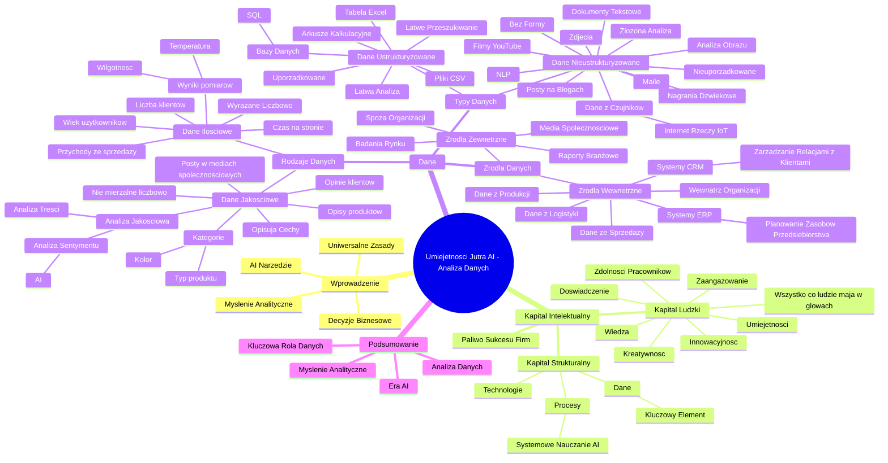

# Lekcje wideo - 2. O myśleniu analitycznym

# 💡 Diagram

___

# 🗒️ Notatka

# Notatki i Podsumowanie Lekcji "Umiejętności Jutra AI" - Analiza Danych 📊

## Wprowadzenie

Ta lekcja stanowi kontynuację kursu "Umiejętności Jutra AI" i koncentruje się na **myśleniu analitycznym** oraz **analizie danych** jako kluczowych kompetencjach w kontekście sztucznej inteligencji (AI) i biznesu. Przemysław Modrzewski z Google, prelegent, zaznacza, że AI to potężne narzędzie 🧰, które wymaga odpowiednich umiejętności. Myślenie analityczne jest fundamentem efektywnego wykorzystania AI i podejmowania racjonalnych decyzji biznesowych. Celem lekcji jest rozwinięcie tematu myślenia analitycznego oraz wprowadzenie zasad analizy danych, które mają zastosowanie zarówno w biznesie, jak i w życiu prywatnym.

## Kapitał Intelektualny - Paliwo Sukcesu Firm 🚀

* **Kapitał intelektualny jest paliwem sukcesu współczesnych firm.**
* Kapitał intelektualny składa się z dwóch głównych filarów:
    * **Kapitał Ludzki:**
        * Wiedza 🧠
        * Umiejętności 💪
        * Doświadczenie 💼
        * Kreatywność ✨
        * Innowacyjność 💡
        * Zaangażowanie 🙌
        * Zdolności pracowników organizacji
        * "Wszystko, co ludzie mają w głowach."
    * **Kapitał Strukturalny:**
        * Procesy (np. systemowe nauczanie AI)
        * Technologie 💻
        * **Dane** - kluczowy element kapitału strukturalnego 🔑

## Dane - Kluczowy Element Kapitału Intelektualnego 🔑

* Dane są **kluczowe dla kapitału intelektualnego i sukcesu firmy**.
* Zrozumienie podstawowych pojęć związanych z danymi jest istotne, ponieważ:
    * Różne rodzaje danych wymagają **odmiennych metod analizy**.
    * Różne źródła danych charakteryzują się **różnym poziomem wiarygodności i dostępności**.

### Rodzaje Danych

* **Dane Ilościowe (Quantitative):**
    * Dane, które można **wyrazić w formie liczbowej**.
    * Przykłady:
        * Przychody ze sprzedaży 💰
        * Liczba klientów 👥
        * Wiek użytkowników 👴
        * Czas spędzony na stronie internetowej ⏱️
        * Wyniki pomiarów (temperatura 🌡️, wilgotność 💧)

* **Dane Jakościowe (Qualitative):**
    * Dane opisujące **cechy i właściwości**, które nie są łatwo mierzalne liczbowo.
    * Przykłady:
        * Opinie klientów z ankiet 📝
        * Opisy produktów 🏷️
        * Treści postów w mediach społecznościowych 📱
        * Kategorie (kolor, typ produktu) 🌈
    * Analizowane za pomocą metod takich jak:
        * **Analiza treści**
        * **Analiza sentymentu** (omawiana w kontekście AI)

### Typy Danych

* **Dane Ustrukturyzowane (Structured):**
    * Dane **uporządkowane**, posiadające zdefiniowaną formę.
    * Przykład: **tabela w Excelu** (wiersze, kolumny) 📊.
    * Gdzie występują:
        * Bazy danych (np. **SQL**) 🗄️
        * Arkusze kalkulacyjne 🧮
        * Pliki **CSV**
    * Zalety: **łatwe przeszukiwanie i analiza**. 🔍

* **Dane Nieustrukturyzowane (Unstructured):**
    * Dane **bez określonej formy**, nieuporządkowane.
    * Przykłady:
        * Maile 📧
        * Dokumenty tekstowe 📄
        * Posty na blogach ✍️
        * Zdjęcia 🖼️
        * Filmy na YouTube ▶️
        * Nagrania dźwiękowe 🎤
        * Dane z czujników (Internet Rzeczy - IoT) 🌐
    * Analiza **bardziej złożona**, wymagająca zaawansowanych technik:
        * **Przetwarzanie Języka Naturalnego (NLP)**
        * **Analiza obrazu** 👁️

### Źródła Danych

* **Źródła Wewnętrzne (Internal):**
    * Dane pochodzące **z wnętrza organizacji**.
    * Przykłady:
        * Systemy **CRM** (Customer Relationship Management) - zarządzanie relacjami z klientami 🤝
        * Systemy **ERP** (Enterprise Resource Planning) - planowanie zasobów przedsiębiorstwa 🏢
        * Dane z produkcji 🏭
        * Dane z logistyki 🚚
        * Dane ze sprzedaży 🛒

* **Źródła Zewnętrzne (External):**
    * Dane pochodzące **spoza organizacji**.
    * Przykłady:
        * Badania rynku 📈
        * Raporty branżowe 📰
        * Media społecznościowe 📣

## Podsumowanie

Druga lekcja kursu "Umiejętności Jutra AI" koncentruje się na analizie danych i jej fundamentalnej roli w kontekście AI i biznesu. Prelegent podkreśla kluczowe znaczenie kapitału intelektualnego, a w szczególności danych jako elementu kapitału strukturalnego, dla sukcesu przedsiębiorstw. Wprowadza podział danych na ilościowe i jakościowe oraz ustrukturyzowane i nieustrukturyzowane, wyjaśniając charakterystykę i metody analizy każdego z typów. Dodatkowo omawia źródła danych, dzieląc je na wewnętrzne i zewnętrzne, i podaje przykłady systemów oraz miejsc pozyskiwania danych. Zrozumienie tych podstawowych pojęć jest niezbędne do efektywnego wykorzystania danych i rozwijania myślenia analitycznego, które stanowi kluczową umiejętność w erze AI. Lekcja ta stanowi fundament do dalszego zgłębiania tematyki analizy danych w kontekście sztucznej inteligencji i jej zastosowań biznesowych.

___

# 🔉 Transcript
File: Lekcje wideo - 2. O myśleniu analitycznym.mp4 
[00:00:00] Screen: Animacja tekstu "Umiejętności Jutra AI" z logotypami Google i SGH.
[00:00:05] Screen: Przemysław Modrzewski, Measurement & Growth Lead, CEE, Google siedzi przy biurku. Za nim regał z książkami. Na biurku laptop, kubek i mikrofon.
[00:00:05] Dzień dobry wszystkim.
[00:00:06] Cieszę się, że widzimy się na kolejnej lekcji naszego kursu.
[00:00:10] Na naszej pierwszej lekcji, którą mam nadzieję wszyscy pamiętacie, położyliśmy fundamenty pod całą naszą podróż po świecie AI.
[00:00:19] Mówiliśmy o tym, że AI to nie magia, a potężne narzędzie.
[00:00:23] I jak każde narzędzie wymaga ono odpowiednich umiejętności, żeby efektywnie z niego korzystać.
[00:00:29] Podkreślałem wtedy i chcę to też zrobić ponownie, że kluczową umiejętnością nie tylko w przypadku AI, ale ogólnie pojętego prowadzenia biznesu jest tak zwane analityczne myślenie.
[00:00:42] To właśnie ono pozwala nam zadawać właściwe pytania, krytycznie oceniać odpowiedzi, które uzyskujemy od AI i co najważniejsze podejmować mądre decyzje.
[00:00:53] Dziś rozwiniemy ten temat.
[00:00:55] Zajmiemy się nie tylko samym myśleniem analitycznym, ale też kluczowymi zasadami analizy danych.
[00:01:02] Pokażę wam jak wykorzystywać te zasady do podejmowania lepszych decyzji i do efektywnego osiągania celów.
[00:01:08] Oczywiście zasady te są dość uniwersalne.
[00:01:11] Można je stosować swobodnie zarówno w życiu prywatnym, jak i zawodowym.
[00:01:16] W tej lekcji będę się skupiał na kwestiach biznesowych, ale na pewno przekonacie się jak łatwo można przełożyć te rozważania na każdy aspekt życia.
[00:01:25] Gotowi?
[00:01:26] No to startujemy.
[00:01:27] Zacznijmy od wyjaśnienia sobie jednej fundamentalnej kwestii, bo jest to w tej chwili dla nas wszystkich super istotne.
[00:01:33] Co tak naprawdę jest tym paliwem, które staje się motorem sukcesu większości firm w naszych czasach?
[00:01:40] Odpowiedź jest jedna i jest to kapitał intelektualny.
[00:01:44] Screen: Kapitał intelektualny. Schemat blokowy z podziałem na kapitał finansowy i intelektualny, a ten drugi na kapitał ludzki i strukturalny.
[00:01:44] Kapitał intelektualny ma swoje filary, a a co się na nie składa?
[00:01:49] Przede wszystkim ludzie, ludzie w organizacji.
[00:01:52] Mam tu na myśli ich wiedzę, umiejętności, doświadczenie, kreatywność, innowacyjność, zaangażowanie i zdolności.
[00:01:59] Można powiedzieć, że to to wszystko co oni mają w głowach.
[00:02:03] Z kolei drugi filar, taki główny filar kapitału intelektualnego, to kwestie strukturalne, czyli procesy.
[00:02:09] Pamiętacie nasze podejście do systemowego nauczania AI, prawda?
[00:02:14] To właśnie to jest też proces.
[00:02:16] Dalej w tym strukturalnych kwestiach mamy takie rzeczy jak właśnie technologie.
[00:02:22] Na pewno wiecie teraz o czym co mam na myśli oraz uwaga dane.
[00:02:27] Screen: Rodzaje i źródła danych. Lista z podziałem na dane ilościowe i jakościowe oraz źródła wewnętrzne i zewnętrzne.
[00:02:27] Zanim przejdziemy dalej i wyjaśnimy dlaczego dane są aż tak kluczowe dla kapitału intelektualnego i sukcesu firmy, zatrzymajmy się na chwilę i uporządkujmy sobie takie podstawowe pojęcia, bo kiedy mówimy dane to tak naprawdę o czym właściwie konkretnie mówimy, co co tutaj mamy na myśli.
[00:02:48] Dane to nie jest jakiś jednolity byt.
[00:02:50] Możemy je podzielić na na przykład na różne rodzaje i możemy je też pozyskiwać z różnych źródeł.
[00:02:56] I tutaj rozumienie tego jest bardzo ważne.
[00:02:59] Dlaczego?
[00:03:00] Bo różne rodzaje danych wymagają różnych metod analizy, a różne źródła mają różny poziom wiarygodności i dostępności.
[00:03:08] Przyjrzyjmy się zatem najpierw tym rodzajem rodzajom danych.
[00:03:13] Możemy wyróżnić na przykład dane ilościowe.
[00:03:15] To dane, które można wyrazić liczbowo.
[00:03:19] A co to może na przykład być?
[00:03:20] No na przykład przychody ze sprzedaży albo liczba klientów, wiek użytkowników, czas spędzony na stronie, wyniki pomiarów takie jak temperatura czy wilgotność.
[00:03:32] To wszystko są dane ilościowe.
[00:03:33] Z kolei mamy też dane jakościowe.
[00:03:36] Te dane opisują cechy, właściwości, których nie da się łatwo zmierzyć liczbowo.
[00:03:41] Jakie to mogą być dane?
[00:03:42] No na przykład opinie klientów wyrażone w ankietach, opisy produktów, treści postów w mediach społecznościowych, różne kategorie jak kolor czy czy na przykład typ produktu.
[00:03:52] Warto dodać, że dane jakościowe są często analizowane za pomocą metod takich jak analiza treści czy analiza sentymentu.
[00:04:00] O tej ostatniej mówiliśmy przy okazji też omawiania AI.
[00:04:04] Jeśli mówimy o danych, to warto też dodać, że dzielą się one na różne typy.
[00:04:11] Główne z nich dzielą się na dane tak zwane ustrukturyzowane i nieustrukturyzowane.
[00:04:18] Wyobraźcie sobie tabelkę w Excelu, wiersze, kolumny, wszystko na swoim miejscu, prawda?
[00:04:24] To właśnie są dane ustrukturyzowane.
[00:04:26] Gdzie je spotkacie?
[00:04:27] No w bazach danych, takich jak SQL, w arkuszach kalkulacyjnych, w plikach CSV.
[00:04:33] A wiecie co jest w nich fajnego?
[00:04:35] No, że bardzo łatwo się je przeszukuje i analizuje.
[00:04:40] A właśnie dlatego, że są to dane uporządkowane.
[00:04:42] Z kolei dane nieustrukturyzowane to dane, które nie mają żadnej określonej formy.
[00:04:47] Co to może być?
[00:04:48] Pomyślcie o mailach, które piszecie albo o dokumentach tekstowych, o postach na blogu, o zdjęciach, o filmach na YouTubie albo o nagranych dźwiękach.
[00:05:00] Nawet dane z różnych czujników, na przykład z tych wszystkich takich urządzeń internetu rzeczy.
[00:05:06] To też dane nieustrukturyzowane.
[00:05:08] Widzicie tutaj jak duża jest różnorodność danych, prawda?
[00:05:12] Analiza takich danych nieustrukturyzowanych jest znacznie trudniejsza i tu często wymaga użycia zaawansowanych technik takich jak przetwarzanie języka naturalnego NLP czy analiza obrazu.
[00:05:26] Screen: Rodzaje i źródła danych. Lista z podziałem na dane ilościowe i jakościowe oraz źródła wewnętrzne i zewnętrzne.
[00:05:26] Dziś rozwinęmy ten temat.
[00:05:30] Screen: Czym jest analityczne myślenie? Lista z trzema punktami.
[00:05:30] To właśnie ono pozwala nam zadawać właściwe pytania, krytycznie oceniać odpowiedzi, które uzyskujemy od AI i co najważniejsze podejmować mądre decyzje.
[00:05:33] Dziś rozwiniemy ten temat.
[00:05:36] Screen: Czym jest analityczne myślenie? Lista z trzema punktami.
[00:05:36] Dziś rozwiniemy ten temat.
[00:05:39] Screen: Czym jest analityczne myślenie? Lista z trzema punktami.
[00:05:43] To właśnie ono pozwala nam zadawać właściwe pytania, krytycznie oceniać odpowiedzi, które uzyskujemy od AI i co najważniejsze podejmować mądre decyzje.
[00:05:49] Screen: Czym jest analityczne myślenie? Lista z trzema punktami.
[00:05:49] Dziś rozwiniemy ten temat.
[00:05:53] Screen: Czym jest analityczne myślenie? Lista z trzema punktami.
[00:05:55] To właśnie ono pozwala nam zadawać właściwe pytania, krytycznie oceniać odpowiedzi, które uzyskujemy od AI i co najważniejsze podejmować mądre decyzje.
[00:06:01] Screen: Czym jest analityczne myślenie? Lista z trzema punktami.
[00:06:01] Dziś rozwiniemy ten temat.
[00:06:05] Screen: Czym jest analityczne myślenie? Lista z trzema punktami.
[00:06:08] To właśnie ono pozwala nam zadawać właściwe pytania, krytycznie oceniać odpowiedzi, które uzyskujemy od AI i co najważniejsze podejmować mądre decyzje.
[00:06:15] Screen: Czym jest analityczne myślenie? Lista z trzema punktami.
[00:06:15] Dziś rozwiniemy ten temat.
[00:06:19] Screen: Kapitał intelektualny. Schemat blokowy z podziałem na kapitał finansowy i intelektualny, a ten drugi na kapitał ludzki i strukturalny.
[00:06:19] Kapitał intelektualny ma swoje filary, a a co się na nie składa?
[00:06:23] Screen: Rodzaje i źródła danych. Lista z podziałem na dane ilościowe i jakościowe oraz źródła wewnętrzne i zewnętrzne.
[00:06:23] Zanim przejdziemy dalej i wyjaśnimy dlaczego dane są aż tak kluczowe dla kapitału intelektualnego i sukcesu firmy, zatrzymajmy się na chwilę i uporządkujmy sobie takie podstawowe pojęcia, bo kiedy mówimy dane to tak naprawdę o czym właściwie konkretnie mówimy, co co tutaj mamy na myśli.
[00:06:49] Screen: Rodzaje i źródła danych. Lista z podziałem na dane ilościowe i jakościowe oraz źródła wewnętrzne i zewnętrzne.
[00:06:49] Zanim przejdziemy dalej i wyjaśnimy dlaczego dane są aż tak kluczowe dla kapitału intelektualnego i sukcesu firmy, zatrzymajmy się na chwilę i uporządkujmy sobie takie podstawowe pojęcia, bo kiedy mówimy dane to tak naprawdę o czym właściwie konkretnie mówimy, co co tutaj mamy na myśli.
[00:07:07] Screen: Dlaczego dane są ważne? Lista z pięcioma punktami.
[00:07:07] Odpowiedź jest jedna i jest to kapitał intelektualny.
[00:07:16] Screen: Dlaczego dane są ważne? Lista z pięcioma punktami.
[00:07:16] Kapitał intelektualny ma swoje filary, a a co się na nie składa?
[00:07:49] Screen: Kapitał intelektualny. Schemat blokowy z podziałem na kapitał finansowy i intelektualny, a ten drugi na kapitał ludzki i strukturalny.
[00:07:49] Przede wszystkim ludzie, ludzie w organizacji.
[00:07:54] Screen: Rodzaje i źródła danych. Lista z podziałem na dane ilościowe i jakościowe oraz źródła wewnętrzne i zewnętrzne.
[00:07:54] Mam tu na myśli ich wiedzę, umiejętności, doświadczenie, kreatywność, innowacyjność, zaangażowanie i zdolności.
[00:08:02] Screen: Rodzaje i źródła danych. Lista z podziałem na dane ilościowe i jakościowe oraz źródła wewnętrzne i zewnętrzne.
[00:08:02] Można powiedzieć, że to to wszystko co oni mają w głowach.
[00:08:05] Screen: Rodzaje i źródła danych. Lista z podziałem na dane ilościowe i jakościowe oraz źródła wewnętrzne i zewnętrzne.
[00:08:05] Z kolei drugi filar, taki główny filar kapitału intelektualnego, to kwestie strukturalne, czyli procesy.
[00:08:16] Screen: Rodzaje i źródła danych. Lista z podziałem na dane ilościowe i jakościowe oraz źródła wewnętrzne i zewnętrzne.
[00:08:16] Pamiętacie nasze podejście do systemowego nauczania AI, prawda?
[00:08:20] To właśnie to jest też proces.
[00:08:20] Screen: Rodzaje i źródła danych. Lista z podziałem na dane ilościowe i jakościowe oraz źródła wewnętrzne i zewnętrzne.
[00:08:20] Dalej w tym strukturalnych kwestiach mamy takie rzeczy jak właśnie technologie.
[00:08:24] Na pewno wiecie teraz o czym co mam na myśli oraz uwaga dane.
[00:08:27] Screen: Rodzaje i źródła danych. Lista z podziałem na dane ilościowe i jakościowe oraz źródła wewnętrzne i zewnętrzne.
[00:08:27] Zanim przejdziemy dalej i wyjaśnimy dlaczego dane są aż tak kluczowe dla kapitału intelektualnego i sukcesu firmy, zatrzymajmy się na chwilę i uporządkujmy sobie takie podstawowe pojęcia, bo kiedy mówimy dane to tak naprawdę o czym właściwie konkretnie mówimy, co co tutaj mamy na myśli.
[00:08:50] Screen: Kapitał intelektualny. Schemat blokowy z podziałem na kapitał finansowy i intelektualny, a ten drugi na kapitał ludzki i strukturalny.
[00:08:50] Dane to nie jest jakiś jednolity byt.
[00:08:53] Możemy je podzielić na na przykład na różne rodzaje i możemy je też pozyskiwać z różnych źródeł.
[00:08:59] I tutaj rozumienie tego jest bardzo ważne.
[00:09:01] Dlaczego?
[00:09:01] Bo różne rodzaje danych wymagają różnych metod analizy, a różne źródła mają różny poziom wiarygodności i dostępności.
[00:09:08] Screen: Czym jest analityczne myślenie? Lista z trzema punktami.
[00:09:08] Przyjrzyjmy się zatem najpierw tym rodzajem rodzajom danych.
[00:09:13] Screen: Rodzaje i źródła danych. Lista z podziałem na dane ilościowe i jakościowe oraz źródła wewnętrzne i zewnętrzne.
[00:09:13] Możemy wyróżnić na przykład dane ilościowe.
[00:09:15] To dane, które można wyrazić liczbowo.
[00:09:19] A co to może na przykład być?
[00:09:20] No na przykład przychody ze sprzedaży albo liczba klientów, wiek użytkowników, czas spędzony na stronie, wyniki pomiarów takie jak temperatura czy wilgotność.
[00:09:42] To wszystko są dane ilościowe.
[00:09:42] Z kolei mamy też dane jakościowe.
[00:09:49] Te dane opisują cechy, właściwości, których nie da się łatwo zmierzyć liczbowo.
[00:09:54] Jakie to mogą być dane?
[00:09:55] No na przykład opinie klientów wyrażone w ankietach, opisy produktów, treści postów w mediach społecznościowych, różne kategorie jak kolor czy czy na przykład typ produktu.
[00:10:07] Warto dodać, że dane jakościowe są często analizowane za pomocą metod takich jak analiza treści czy analiza sentymentu.
[00:10:16] O tej ostatniej mówiliśmy przy okazji też omawiania AI.
[00:10:20] Jeśli mówimy o danych, to warto też dodać, że dzielą się one na różne typy.
[00:10:29] Główne z nich dzielą się na dane tak zwane ustrukturyzowane i nieustrukturyzowane.
[00:10:39] Wyobraźcie sobie tabelkę w Excelu, wiersze, kolumny, wszystko na swoim miejscu, prawda?
[00:10:43] To właśnie są dane ustrukturyzowane.
[00:10:46] Gdzie je spotkacie?
[00:10:47] No w bazach danych, takich jak SQL, w arkuszach kalkulacyjnych, w plikach CSV.
[00:10:54] A wiecie co jest w nich fajnego?
[00:10:56] No, że bardzo łatwo się je przeszukuje i analizuje.
[00:11:02] A właśnie dlatego, że są to dane uporządkowane.
[00:11:04] Z kolei dane nieustrukturyzowane to dane, które nie mają żadnej określonej formy.
[00:11:10] Co to może być?
[00:11:11] Pomyślcie o mailach, które piszecie albo o dokumentach tekstowych, o postach na blogu, o zdjęciach, o filmach na YouTubie albo o nagranych dźwiękach.
[00:11:25] Nawet dane z różnych czujników, na przykład z tych wszystkich takich urządzeń internetu rzeczy.
[00:11:30] To też dane nieustrukturyzowane.
[00:11:33] Widzicie tutaj jak duża jest różnorodność danych, prawda?
[00:11:37] Analiza takich danych nieustrukturyzowanych jest znacznie trudniejsza i tu często wymaga użycia zaawansowanych technik takich jak przetwarzanie języka naturalnego NLP czy analiza obrazu.
[00:11:50] Screen: Rodzaje i źródła danych. Lista z podziałem na dane ilościowe i jakościowe oraz źródła wewnętrzne i zewnętrzne.
[00:11:50] O tej ostatniej mówiliśmy przy okazji też omawiania AI.
[00:11:54] Jeśli mówimy o danych, to warto też dodać, że dzielą się one na różne typy.
[00:12:01] Główne z nich dzielą się na dane źródła danych wewnętrzne i zewnętrzne.
[00:12:09] Źródła wewnętrzne to na przykład systemy CRM do zarządzania relacjami z klientami, systemy ERP do planowania zasobów przedsiębiorstwa, dane z produkcji, logistyki, sprzedaży.
[00:12:27] Źródła zewnętrzne to badania rynku, raporty branżowe, media społecznościowe.
[00:12:36] Screen: Rodzaje i źródła danych. Lista z podziałem na dane ilościowe i jakościowe oraz źródła wewnętrzne i zewnętrzne.
[00:12:36] Oczywiście zasady te są dość uniwersalne.
[00:12:40] Można je stosować swobodnie zarówno w życiu prywatnym, jak i zawodowym.
[00:12:44] W tej lekcji będę się skupiał na kwestiach biznesowych, ale na pewno przekonacie się jak łatwo można przełożyć te rozważania na każdy aspekt życia.
[00:12:55] Gotowi?
[00:12:56] No to startujemy.
[00:12:58] Zacznijmy od wyjaśnienia sobie jednej fundamentalnej kwestii, bo jest to w tej chwili dla nas wszystkich super istotne.
[00:13:04] Co tak naprawdę jest tym paliwem, które staje się motorem sukcesu większości firm w naszych czasach?
[00:13:10] Odpowiedź jest jedna i jest to kapitał intelektualny.
[00:13:14] Kapitał intelektualny ma swoje filary, a a co się na nie składa?
[00:13:19] Screen: Kapitał intelektualny. Schemat blokowy z podziałem na kapitał finansowy i intelektualny, a ten drugi na kapitał ludzki i strukturalny.
[00:13:19] Przede wszystkim ludzie, ludzie w organizacji.
[00:13:24] Mam tu na myśli ich wiedzę, umiejętności, doświadczenie, kreatywność, innowacyjność, zaangażowanie i zdolności.
[00:13:37] Można powiedzieć, że to to wszystko co oni mają w głowach.
[00:13:43] Z kolei drugi filar, taki główny filar kapitału intelektualnego, to kwestie strukturalne, czyli procesy.
[00:13:50] Pamiętacie nasze podejście do systemowego nauczania AI, prawda?
[00:13:55] To właśnie to jest też proces.
[00:13:57] Dalej w tym strukturalnych kwestiach mamy takie rzeczy jak właśnie technologie.
[00:14:05] Na pewno wiecie teraz o czym co mam na myśli oraz uwaga dane.
[00:14:15] Screen: Dlaczego dane są ważne? Lista z pięcioma punktami.
[00:14:15] Zanim przejdziemy dalej i wyjaśnimy dlaczego dane są aż tak kluczowe dla kapitału intelektualnego i sukcesu firmy, zatrzymajmy się na chwilę i uporządkujmy sobie takie podstawowe pojęcia, bo kiedy mówimy dane to tak naprawdę o czym właściwie konkretnie mówimy, co co tutaj mamy na myśli.
[00:14:43] Dane to nie jest jakiś jednolity byt.
[00:14:45] Możemy je podzielić na na przykład na różne rodzaje i możemy je też pozyskiwać z różnych źródeł.
[00:14:53] I tutaj rozumienie tego jest bardzo ważne.
[00:14:56] Dlaczego?
[00:14:57] Bo różne rodzaje danych wymagają różnych metod analizy, a różne źródła mają różny poziom wiarygodności i dostępności.
[00:15:08] Screen: Rodzaje i źródła danych. Lista z podziałem na dane ilościowe i jakościowe oraz źródła wewnętrzne i zewnętrzne.
[00:15:08] Przyjrzyjmy się zatem najpierw tym rodzajem rodzajom danych.
[00:15:13] Możemy wyróżnić na przykład dane ilościowe.
[00:15:15] To dane, które można wyrazić liczbowo.
[00:15:19] A co to może na przykład być?
[00:15:20] No na przykład przychody ze sprzedaży albo liczba klientów, wiek użytkowników, czas spędzony na stronie, wyniki pomiarów takie jak temperatura czy wilgotność.
[00:15:44] To wszystko są dane ilościowe.
[00:15:44] Z kolei mamy też dane jakościowe.
[00:15:49] Te dane opisują cechy, właściwości, których nie da się łatwo zmierzyć liczbowo.
[00:15:53] Jakie to mogą być dane?
[00:15:54] No na przykład opinie klientów wyrażone w ankietach, opisy produktów, treści postów w mediach społecznościowych, różne kategorie jak kolor czy czy na przykład typ produktu.
[00:16:14] Warto dodać, że dane jakościowe są często analizowane za pomocą metod takich jak analiza treści czy analiza sentymentu.
[00:16:27] O tej ostatniej mówiliśmy przy okazji też omawiania AI.
[00:16:31] Jeśli mówimy o danych, to warto też dodać, że dzielą się one na różne typy.
[00:16:38] Główne z nich dzielą się na dane tak zwane ustrukturyzowane i nieustrukturyzowane.
[00:16:48] Wyobraźcie sobie tabelkę w Excelu, wiersze, kolumny, wszystko na swoim miejscu, prawda?
[00:16:53] To właśnie są dane ustrukturyzowane.
[00:16:55] Gdzie je spotkacie?
[00:16:56] No w bazach danych, takich jak SQL, w arkuszach kalkulacyjnych, w plikach CSV.
[00:17:03] A wiecie co jest w nich fajnego?
[00:17:05] No, że bardzo łatwo się je przeszukuje i analizuje.
[00:17:10] A właśnie dlatego, że są to dane uporządkowane.
[00:17:12] Z kolei dane nieustrukturyzowane to dane, które nie mają żadnej określonej formy.
[00:17:17] Co to może być?
[00:17:18] Pomyślcie o mailach, które piszecie albo o dokumentach tekstowych, o postach na blogu, o zdjęciach, o filmach na YouTubie albo o nagranych dźwiękach.
[00:17:30] Nawet dane z różnych czujników, na przykład z tych wszystkich takich urządzeń internetu rzeczy.
[00:17:36] To też dane nieustrukturyzowane.
[00:17:38] Widzicie tutaj jak duża jest różnorodność danych, prawda?
[00:17:43] Analiza takich danych nieustrukturyzowanych jest znacznie trudniejsza i tu często wymaga użycia zaawansowanych technik takich jak przetwarzanie języka naturalnego NLP czy analiza obrazu.
[00:18:01] Screen: Kapitał intelektualny. Schemat blokowy z podziałem na kapitał finansowy i intelektualny, a ten drugi na kapitał ludzki i strukturalny.
[00:18:01] O tej ostatniej mówiliśmy przy okazji też omawiania AI.
[00:18:04] Jeśli mówimy o danych, to warto też dodać, że dzielą się one na różne typy.
[00:18:11] Główne z nich dzielą się na dane źródła danych wewnętrzne i zewnętrzne.
[00:18:19] Źródła wewnętrzne to na przykład systemy CRM do zarządzania relacjami z klientami, systemy ERP do planowania zasobów przedsiębiorstwa, dane z produkcji, logistyki, sprzedaży.
[00:18:36] Źródła zewnętrzne to badania rynku, raporty branżowe, media społecznościowe.
[00:18:48] Screen: Dlaczego dane są ważne? Lista z pięcioma punktami.
[00:18:48] Przyjrzyjmy się zatem najpierw tym rodzajem rodzajom danych.
[00:18:53] Możemy wyróżnić na przykład dane ilościowe.
[00:18:55] To dane, które można wyrazić liczbowo.
[00:19:00] A co to może na przykład być?
[00:19:01] No na przykład przychody ze sprzedaży albo liczba klientów, wiek użytkowników, czas spędzony na stronie, wyniki pomiarów takie jak temperatura czy wilgotność.
[00:19:23] To wszystko są dane ilościowe.
[00:19:23] Z kolei mamy też dane jakościowe.
[00:19:27] Te dane opisują cechy, właściwości, których nie da się łatwo zmierzyć liczbowo.
[00:19:31] Jakie to mogą być dane?
[00:19:32] No na przykład opinie klientów wyrażone w ankietach, opisy produktów, treści postów w mediach społecznościowych, różne kategorie jak kolor czy czy na przykład typ produktu.
[00:19:45] Warto dodać, że dane jakościowe są często analizowane za pomocą metod takich jak analiza treści czy analiza sentymentu.
[00:19:59] O tej ostatniej mówiliśmy przy okazji też omawiania AI.
[00:20:03] Screen: Czym jest analityczne myślenie? Lista z trzema punktami.
[00:20:03] Jeśli mówimy o danych, to warto też dodać, że dzielą się one na różne typy.
[00:20:10] Główne z nich dzielą się na dane tak zwane ustrukturyzowane i nieustrukturyzowane.
[00:20:19] Wyobraźcie sobie tabelkę w Excelu, wiersze, kolumny, wszystko na swoim miejscu, prawda?
[00:20:23] To właśnie są dane ustrukturyzowane.
[00:20:26] Gdzie je spotkacie?
[00:20:27] No w bazach danych, takich jak SQL, w arkuszach kalkulacyjnych, w plikach CSV.
[00:20:32] A wiecie co jest w nich fajnego?
[00:20:33] No, że bardzo łatwo się je przeszukuje i analizuje.
[00:20:38] A właśnie dlatego, że są to dane uporządkowane.
[00:20:42] Z kolei dane nieustrukturyzowane to dane, które nie mają żadnej określonej formy.
[00:20:47] Co to może być?
[00:20:48] Pomyślcie o mailach, które piszecie albo o dokumentach tekstowych, o postach na blogu, o zdjęciach, o filmach na YouTubie albo o nagranych dźwiękach.
[00:21:01] Nawet dane z różnych czujników, na przykład z tych wszystkich takich urządzeń internetu rzeczy.
[00:21:06] To też dane nieustrukturyzowane.
[00:21:08] Widzicie tutaj jak duża jest różnorodność danych, prawda?
[00:21:13] Analiza takich danych nieustrukturyzowanych jest znacznie trudniejsza i tu często wymaga użycia zaawansowanych technik takich jak przetwarzanie języka naturalnego NLP czy analiza obrazu.
[00:21:27] Screen: Kapitał intelektualny. Schemat blokowy z podziałem na kapitał finansowy i intelektualny, a ten drugi na kapitał ludzki i strukturalny.
[00:21:27] O tej ostatniej mówiliśmy przy okazji też omawiania AI.
[00:21:31] Screen: Rodzaje i źródła danych. Lista z podziałem na dane ilościowe i jakościowe oraz źródła wewnętrzne i zewnętrzne.
[00:21:31] Jeśli mówimy o danych, to warto też dodać, że dzielą się one na różne typy.
[00:21:39] Główne z nich dzielą się na dane źródła danych wewnętrzne i zewnętrzne.
[00:21:47] Źródła wewnętrzne to na przykład systemy CRM do zarządzania relacjami z klientami, systemy ERP do planowania zasobów przedsiębiorstwa, dane z produkcji, logistyki, sprzedaży.
[00:22:04] Źródła zewnętrzne to badania rynku, raporty branżowe, media społecznościowe.
[00:22:16] Screen: Dlaczego dane są ważne? Lista z pięcioma punktami.
[

___
# 🏷️ Tags
#Umiejętności_Jutra_AI #myślenie_analityczne #analiza_danych #AI #sztuczna_inteligencja #biznes #Przemysław_Modrzewski #Google #kapitał_intelektualny #kapitał_ludzki #wiedza #umiejętności #doświadczenie #kreatywność #innowacyjność #zaangażowanie #zdolności_pracowników #kapitał_strukturalny #procesy #technologie #dane #dane_ilościowe #quantitative_data #przychody_ze_sprzedaży #liczba_klientów #wiek_użytkowników #czas_na_stronie #wyniki_pomiarów #temperatura #wilgotność #dane_jakościowe #qualitative_data #opinie_klientów #opisy_produktów #treści_postów #media_społecznościowe #kategorie #kolor #typ_produktu #analiza_treści #analiza_sentymentu #dane_ustrukturyzowane #structured_data #tabela_w_Excelu #bazy_danych #SQL #arkusze_kalkulacyjne #pliki_CSV #dane_nieustrukturyzowane #unstructured_data #maile #dokumenty_tekstowe #posty_na_blogach #zdjęcia #filmy_na_YouTube #nagrania_dźwiękowe #dane_z_czujników #Internet_Rzeczy #IoT #przetwarzanie_języka_naturalnego #NLP #analiza_obrazu #źródła_danych #źródła_wewnętrzne #internal_data #systemy_CRM #Customer_Relationship_Management #systemy_ERP #Enterprise_Resource_Planning #dane_z_produkcji #dane_z_logistyki #dane_ze_sprzedaży #źródła_zewnętrzne #external_data #badania_rynku #raporty_branżowe
