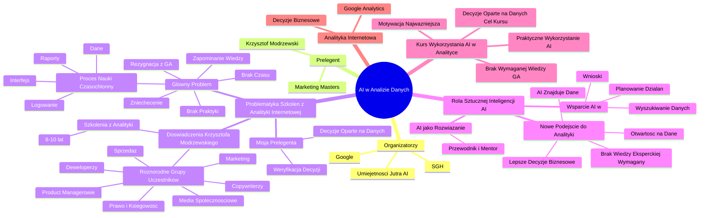

# Lekcje wideo - 1. Wstęp

# 💡 Diagram

___

# 🗒️ Notatka

# Notatki i Podsumowanie Prezentacji Wideo: AI w Analizie Danych

## Wprowadzenie

Prezentacja Krzysztofa Modrzewskiego z "Marketing Masters", w ramach inicjatywy "Umiejętności Jutra AI" (organizowanej przez Google i SGH), omawia wykorzystanie **sztucznej inteligencji** (`AI`) w **analityce internetowej**, ze szczególnym uwzględnieniem narzędzi takich jak `Google Analytics`.  Skupia się na wyzwaniach, przed którymi stają osoby uczące się **analityki internetowej**, i analizuje, jak `AI` może wspomóc w ich pokonaniu.

## Historia i Problematyka Szkoleń z Analityki Internetowej

### Doświadczenia Krzysztofa Modrzewskiego

*   Krzysztof Modrzewski od 8-10 lat prowadzi szkolenia i warsztaty z **analityki internetowej**, w tym z `Google Analytics`.
*   Zauważył, że w szkoleniach uczestniczą osoby z różnorodnych działów i stanowisk, nie tylko analitycy:
    *   Specjaliści ds. marketingu
    *   Specjaliści ds. sprzedaży
    *   `Copywriterzy`
    *   `Product Managerowie`
    *   `Deweloperzy` 💻
    *   Specjaliści ds. mediów społecznościowych 📱
    *   Pracownicy działów prawnych i księgowości 🧑‍💼
*   Większość uczestników jest delegowana na szkolenia przez pracodawców, a nie zgłasza się z własnej inicjatywy.

### Główny Problem: Brak Czasu 🕰️ i Zniechęcenie

*   Uczestnicy szkoleń są zazwyczaj bardzo obciążeni pracą i mają liczne obowiązki.
*   Nauka nowego narzędzia analitycznego, takiego jak `Google Analytics`, jest czasochłonna i wymaga praktyki:
    *   Logowanie do narzędzia
    *   Poruszanie się po złożonym interfejsie
    *   Zrozumienie danych
    *   Tworzenie raportów 📊
*   Proces nauki nie przynosi natychmiastowych efektów – nie da się opanować narzędzia w 1-2 dni.
*   Po szkoleniu uczestnicy wracają do swoich zadań, gdzie czekają na nich nagromadzone obowiązki.
*   Często dopiero po upływie tygodnia znajdują czas, aby samodzielnie zalogować się do `Google Analytics`.
*   Brak regularnej praktyki powoduje szybkie zapominanie wiedzy zdobytej na szkoleniu i w konsekwencji – zniechęcenie.
*   Efektem jest rezygnacja z aktywnego wykorzystywania `Google Analytics`.

### Misja Prelegenta

*   Misją Krzysztofa Modrzewskiego jest popularyzacja **decyzji opartych na danych** w codziennej pracy.
*   Jego celem jest umożliwienie każdemu weryfikacji trafności podejmowanych decyzji poprzez analizę raportów.

## Rola Sztucznej Inteligencji (`AI`)

### `AI` jako Rozwiązanie

*   Żyjemy w dynamicznie zmieniającej się rzeczywistości, w erze **sztucznej inteligencji** (`AI`).
*   `AI` może pełnić rolę przewodnika i mentora w dziedzinie **analityki internetowej**.
*   `AI` może wspierać w:
    *   Efektywnym wyszukiwaniu potrzebnych danych
    *   Formułowaniu trafnych wniosków
    *   Planowaniu działań w oparciu o analizę danych

### Nowe Podejście do Analityki

*   Dogłębna wiedza ekspercka z zakresu narzędzi analitycznych nie jest konieczna dla osób, które nie zajmują się **analityką** profesjonalnie.
*   `AI` umożliwia odnalezienie kluczowych danych nawet bez zaawansowanej znajomości narzędzi.
*   **Kluczowa jest otwartość na wykorzystanie danych i dążenie do podejmowania lepszych decyzji biznesowych.** 📈

### Zaproszenie na Kurs

*   Kurs kompleksowo prezentuje, jak praktycznie wykorzystać `AI` w **analityce**.
*   Wiedza z `Google Analytics` czy znajomość metryk nie jest wymagana.
*   Najważniejsza jest motywacja do podejmowania **decyzji opartych na danych**.

## Podsumowanie

Prezentacja Krzysztofa Modrzewskiego zwraca uwagę na trudności związane z nauką **analityki internetowej**, szczególnie dla osób, dla których nie jest to codzienne zajęcie i które są obciążone innymi obowiązkami. Głównym wyzwaniem jest brak czasu na praktyczne zastosowanie wiedzy i wynikające z tego szybkie zniechęcenie po szkoleniach. Rozwiązaniem tych problemów może być **sztuczna inteligencja**, pełniąca rolę przewodnika w analizie danych. `AI` umożliwia osobom bez specjalistycznej wiedzy analitycznej efektywne wykorzystanie danych do podejmowania lepszych **decyzji biznesowych**. Kurs, na który zaprasza prelegent, ma na celu praktyczne pokazanie, krok po kroku, jak wykorzystać `AI` w tym procesie, bez konieczności posiadania dogłębnej znajomości narzędzi analitycznych, takich jak `Google Analytics`.  Najistotniejsza jest chęć korzystania z danych i podejmowania świadomych decyzji.

___

# 🔉 Transcript
File: Lekcje wideo - 1. Wstęp.mp4 
[00:00:01] Ekran: Logo "Umiejętności Jutra AI". Poniżej napisy "Organizator: Google" i "Partner edukacyjny: SGH".
[00:00:04] Ekran: Mężczyzna siedzi za biurkiem, za nim regał z książkami i podświetlony napis "ON AIR".
[00:00:05] Ekran: Mężczyzna siedzi za biurkiem, za nim regał z książkami i podświetlony napis "ON AIR". Na dole ekranu pojawia się napis: "Krzysztof Modrzewski, Head of education, Marketing Masters".
[00:00:05] Krzysztof Modrzewski: Zanim przejdziemy do konkretów i nauki tego jak AI może pomóc nam w analizie danych, chciałbym podzielić się z tobą pewną historią, i to na dodatek prawdziwą historią.
[00:00:15] Krzysztof Modrzewski: Analityka internetowa leży w samym centrum moich zainteresowań i to jest to, czym najwięcej zajmuję się na co dzień w pracy.
[00:00:22] Krzysztof Modrzewski: No więc naturalnie bardzo się ucieszyłem, jak zostałem zaproszony do udziału w projekcie edukacyjnym, w którym mógłbym pokazać, jak z tej analityki efektywnie korzystać i to jeszcze przy wsparciu AI.
[00:00:33] Krzysztof Modrzewski: Brzmi super, zwłaszcza że sam na co dzień korzystam z wielu różnych narzędzi do analityki internetowej i różnych modeli sztucznej inteligencji.
[00:00:43] Krzysztof Modrzewski: Tylko po chwili okazało się, że mam pewną zagwozdkę, a mianowicie o czym właściwie mam opowiedzieć.
[00:00:50] Krzysztof Modrzewski: Zacząłem się zastanawiać, jak AI może faktycznie wesprzeć ciebie w korzystaniu z danych.
[00:00:57] Krzysztof Modrzewski: Z czym tak naprawdę możesz mieć problem?
[00:01:00] Krzysztof Modrzewski: Tak się składa, że szkolenia i warsztaty z analityki internetowej z wykorzystaniem Google Analytics prowadzę już chyba przynajmniej od ośmiu, a nawet może 10 lat.
[00:01:10] Krzysztof Modrzewski: Nie wiem, wiecie, już pamięć szwankuje.
[00:01:12] Krzysztof Modrzewski: W każdym razie chodzi mi o to, że zazwyczaj wygląda to tak, że na takie zajęcia przychodzą osoby piastujące bardzo różne stanowiska w swoich firmach, mające różne obowiązki, których praca wygląda zupełnie inaczej.
[00:01:24] Krzysztof Modrzewski: Są to na przykład specjaliści od marketingu, specjaliści od sprzedaży, copywriterzy, ale również menadżerowie produktu, deweloperzy, ludzie od social mediów, a nawet ludzie z działów prawnych lub księgowości.
[00:01:36] Krzysztof Modrzewski: A najmniej jest faktycznych analityków.
[00:01:39] Krzysztof Modrzewski: Dobra, do brzegu.
[00:01:41] Krzysztof Modrzewski: Przeważnie na takie szkolenia te osoby są wysyłane z firmy.
[00:01:44] Krzysztof Modrzewski: Bardzo rzadko jest to ich jakaś wewnętrzna decyzja.
[00:01:47] Krzysztof Modrzewski: Po prostu szef każe i trzeba się nauczyć korzystać z Google Analytics.
[00:01:51] Krzysztof Modrzewski: Ale nawet jeżeli mają gdzieś tą swoją własną motywację do nauki, to dalej pozostaje jeden, ale bardzo duży problem.
[00:01:58] Krzysztof Modrzewski: Te wszystkie osoby nie nudzą się w pracy.
[00:02:00] Krzysztof Modrzewski: Albo inaczej, mają mnóstwo zadań do wykonania i tak naprawdę cały ich dzień pracy jest już wypełniony wieloma różnymi obowiązkami.
[00:02:08] Krzysztof Modrzewski: A tutaj nagle przychodzą na szkolenie, gdzie ktoś opowiada im o zupełnie nowym narzędziu, do którego trzeba się logować, nauczyć skorzystać ze skomplikowanego interfejsu, zrozumieć dane, które tam są, wiedzieć jak tworzyć raporty.
[00:02:19] Krzysztof Modrzewski: To nie jest coś, czego można się nauczyć w jeden lub dwa dni.
[00:02:23] Krzysztof Modrzewski: To jest coś, co trzeba ćwiczyć poprzez jak najczęstsze korzystanie.
[00:02:27] Krzysztof Modrzewski: A rzeczywistość wygląda tak, że po takich zajęciach uczestnicy wracają do firmy, odgrzebują się z zaległych maili i zaległych zadań, później jeszcze nadchodzi weekend i okazuje się, że pierwszy raz samodzielnie logują się do Google Analytics po tygodniu.
[00:02:42] Krzysztof Modrzewski: No i oczywiście stwierdzają, że mało co pamiętają, zniechęcają się, bo nie mogą za bardzo nic tam znaleźć i na koniec wyłączają to i już nie wracają do tego tematu.
[00:02:51] Krzysztof Modrzewski: Niestety bardzo nad tym ubolewam, ponieważ gdzieś tam moją małą wewnętrzną misją jest to, aby każdy podejmował decyzję w swojej pracy oparte na danych i żeby każdy mógł zweryfikować, czy podjęte decyzje są poprawne i czy przynoszą oczekiwane rezultaty, właśnie poprzez analizę odpowiednich raportów.
[00:03:09] Krzysztof Modrzewski: Tak jak wspomniałem, rzeczywistość jest jednak inna.
[00:03:13] Krzysztof Modrzewski: Ale przecież ta rzeczywistość cały czas się zmienia i teraz żyjemy już w świecie ogarniętym przez AI.
[00:03:18] Krzysztof Modrzewski: I to może nam bardzo pomóc.
[00:03:21] Krzysztof Modrzewski: Jak?
[00:03:22] Krzysztof Modrzewski: Sztuczna inteligencja w tym wypadku może stać się naszym przewodnikiem, takim naszym nauczycielem w analityce internetowej.
[00:03:29] Krzysztof Modrzewski: Może nam pomóc znaleźć odpowiednie dane i wyciągnąć wnioski, a nawet zaplanować konkretne działania na podstawie naszych danych.
[00:03:37] Krzysztof Modrzewski: Jeżeli nie zajmujemy się analityką na co dzień, nie mamy w stanowisku słowa data, to przestańmy się wreszcie zadręczać nauką skomplikowanych narzędzi analitycznych.
[00:03:46] Krzysztof Modrzewski: Mamy inną robotę do wykonania, a niech AI pomoże nam znaleźć dane, których potrzebujemy.
[00:03:51] Krzysztof Modrzewski: Tak więc przystępując do tego kursu, nie musisz znać Google Analytics.
[00:03:56] Krzysztof Modrzewski: Nie musisz rozumieć, co oznaczają poszczególne nazwy metryk.
[00:04:00] Krzysztof Modrzewski: Ale musisz jednak chcieć zacząć korzystać z danych i chcieć podejmować lepsze decyzje biznesowe.
[00:04:06] Krzysztof Modrzewski: Jeżeli tutaj się zgadzamy, to zapraszam cię na kurs, gdzie pokażę ci wszystko krok po kroku, jak wykonać z pomocą sztucznej inteligencji.
[04:13:00] Ekran: Logo "Umiejętności Jutra AI". Poniżej napisy "Organizator: Google" i "Partner edukacyjny: SGH".
[04:16:00] [background music ends]

___
# 🏷️ Tags
#AI #sztuczna_inteligencja #analiza_danych #analityka_internetowa #Google_Analytics #Marketing_Masters #Umiejętności_Jutra_AI #Google #SGH #Krzysztof_Modrzewski #szkolenia #warsztaty #specjalista_ds_marketingu #specjalista_ds_sprzedaży #copywriter #Product_Manager #deweloper #specjalista_ds_mediów_społecznościowych #działy_prawne #księgowość #brak_czasu #zniechęcenie #raporty #decyzje_oparte_na_danych #dane #decyzje_biznesowe #kurs #metrika #praktyczne_wykorzystanie_AI #narzędzia_analityczne
