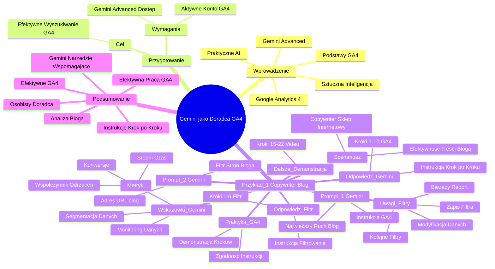

# Lekcje wideo - 2. Gemini przewodnikiem po GA4

# 💡 Diagram

___

# 🗒️ Notatka

# Notatki i Podsumowanie Wideo: Gemini jako Osobisty Doradca Google Analytics 4

## Wprowadzenie

Ten materiał wideo pokazuje, jak **sztuczna inteligencja**, a konkretnie **Gemini Advanced**, może pełnić rolę osobistego nauczyciela lub doradcy w zakresie **Google Analytics 4 (GA4)**. Prezentacja jest przeznaczona dla osób posiadających podstawową wiedzę o analityce internetowej i GA4, demonstrując praktyczne zastosowanie AI w konkretnych sytuacjach. Film ilustruje siedem przykładów użycia, z czego pierwszy przypadek omawiany jest szczegółowo.

## Przygotowanie do Pracy z Gemini i GA4

*   **Wymagania:**
    *   Dostęp do **Gemini Advanced** (wersja płatna).
    *   Aktywne konto **Google Analytics 4**.
*   **Cel:** Prezentacja możliwości Gemini we wspieraniu użytkowników GA4 w efektywnym wyszukiwaniu potrzebnych informacji.

## Przykład 1: Copywriter i Efektywność Treści Bloga

### Scenariusz

Copywriter pracujący w sklepie internetowym chce zweryfikować, które treści na blogu sklepu osiągają najlepsze wyniki, mierząc popularność artykułów liczbą odwiedzin.

### Prompt do Gemini (Krok 1)

> Pracuję jako copywriter w sklepie internetowym i tworzę treści na bloga. Potrzebuję zidentyfikować strony bloga, które generują największy ruch w **Google Analytics 4 (GA4)**. Proszę o szczegółową instrukcję, jak odnaleźć te dane.

### Odpowiedź Gemini - Instrukcja Krok po Kroku (Krok 2)

Gemini generuje precyzyjną instrukcję, opisującą krok po kroku, jak zlokalizować strony bloga z największą liczbą odwiedzin w GA4:

1.  **Zaloguj się** do swojego konta Google Analytics 4.
2.  W menu nawigacyjnym po lewej stronie przejdź do sekcji **„Raporty”**.
3.  W obszarze **„Cykl życia”** wybierz opcję **„Zaangażowanie”**.
4.  Kliknij **„Strony i ekrany”**.
5.  W tabeli, która pojawi się poniżej wykresu, zobaczysz listę stron i ekranów. Domyślnie są one posortowane według liczby wyświetleń.
6.  Zwróć szczególną uwagę na kolumnę **„Ścieżka strony i klasa ekranu”**. To w niej znajdziesz adresy URL stron bloga.
7.  Aby usprawnić analizę, skorzystaj z **filtra**. Kliknij przycisk **„Dodaj filtr”** znajdujący się nad tabelą.
8.  W wyświetlonym oknie **„Tworzenie filtra”**, z rozwijanego menu **„Wymiar”** wybierz **„Ścieżka strony i klasa ekranu”**.
9.  W polu **„Wartość filtra”** wprowadź charakterystyczny fragment adresu URL bloga, na przykład „blog” lub „artykuły”.
10. Zatwierdź filtr, klikając **„Zastosuj”**. Tabela zostanie zaktualizowana i pokaże wyłącznie strony bloga, posortowane według liczby wyświetleń.

#### Dodatkowe Wskazówki od Gemini

*   **Analizuj różnorodne metryki:** Oprócz liczby wyświetleń, warto również monitorować:
    *   **Średni czas zaangażowania:** Informuje, jak długo użytkownicy przebywają na stronie.
    *   **Współczynnik odrzuceń:** Pokazuje procent użytkowników, którzy opuszczają stronę po obejrzeniu tylko jednej podstrony.
    *   **Konwersje:**  Jeśli w GA4 skonfigurowano śledzenie celów, można analizować konwersje generowane przez poszczególne strony bloga.
*   **Segmentuj dane:** Przeprowadzaj analizę ruchu, uwzględniając różne źródła, takie jak ruch organiczny z wyszukiwarek, media społecznościowe, czy kampanie reklamowe.
*   **Regularnie monitoruj dane:** Systematycznie śledź trendy i identyfikuj obszary wymagające optymalizacji.

### Praktyczne Wykorzystanie Instrukcji Gemini w GA4 (Kroki 3-12 w materiale wideo)

Prezenter demonstruje kolejne kroki w interfejsie GA4, potwierdzając zgodność instrukcji Gemini z rzeczywistością:

*   Loguje się do GA4.
*   Przechodzi do sekcji **„Raporty”**.
*   Wybiera **„Cykl życia”** -> **„Zaangażowanie”**.
*   Klikając **„Strony i ekrany”**.
*   Zauważa, że domyślny raport zawiera dane dla wszystkich stron serwisu, nie tylko bloga.

### Prompt do Gemini (Krok 13) - Filtrowanie Stron Bloga

Prezenter formułuje zapytanie do Gemini dotyczące filtrowania raportu, aby wyświetlić statystyki wyłącznie dla stron bloga, zakładając, że adresy URL bloga zawierają fragment „/blog/”.

> W **Google Analytics 4 (GA4)**, jak mogę skutecznie wyfiltrować dane, aby wyświetlić statystyki tylko dla stron mojego bloga?  Wiem, że wszystkie adresy URL bloga zawierają „/blog/” w ścieżce URL, na przykład /blog/najlepsze-oferty-black-friday. Proszę o precyzyjną instrukcję, jak skonfigurować filtr w GA4, aby wyświetlić tylko te strony.

### Odpowiedź Gemini - Instrukcja Filtrowania (Krok 14)

Gemini dostarcza instrukcję filtrowania stron zawierających „/blog/” w adresie URL:

1.  Przejdź do raportu, w którym chcesz zastosować filtr (np. „Strony i ekrany”).
2.  Kliknij przycisk **„Dodaj filtr”** znajdujący się nad tabelą danych.
3.  W oknie **„Tworzenie filtra”** wybierz **„Wymiar”: „Ścieżka strony i klasa ekranu”**.
4.  W sekcji **„Operator filtra”** wybierz opcję **„zawiera”**.
5.  W polu **„Wartość filtra”** wpisz **„/blog”**.
6.  Zatwierdź filtr, klikając **„Zastosuj”**.

#### Istotne Uwagi od Gemini dotyczące Filtrów

*   Filtr działa wyłącznie w obrębie **bieżącego raportu**.
*   Filtr modyfikuje **wszystkie dane** prezentowane w raporcie.
*   Istnieje możliwość dodawania **kolejnych filtrów**, aby jeszcze bardziej zawęzić zakres danych.
*   Utworzony **filtr można zapisać** do ponownego wykorzystania w przyszłości.

### Dalsze Kroki Demonstracyjne (Kroki 15-22 w materiale wideo)

Prezenter jest przygotowany do praktycznego zastosowania instrukcji filtrowania w GA4, co zostanie zaprezentowane w dalszej części filmu (która nie została uwzględniona w tej notatce).

## Podsumowanie

Ten materiał przedstawia przykład praktycznego wykorzystania **Gemini Advanced** jako narzędzia wspomagającego efektywną pracę z **Google Analytics 4**. Pokazuje, jak za pomocą prostych zapytań (promptów) można uzyskać szczegółowe, krok po kroku instrukcje dotyczące nawigacji w GA4 i skutecznej analizy danych. Gemini działa tutaj jako osobisty doradca, ułatwiając użytkownikom, nawet tym z podstawową wiedzą, efektywne wykorzystanie potencjału GA4. Pierwszy z omówionych przykładów koncentruje się na wsparciu copywritera w analizie efektywności treści bloga poprzez identyfikację najpopularniejszych stron blogowych. Kolejne przykłady, wspomniane w materiale, ale nie opisane w tej notatce, mają na celu dalszą demonstrację szerokich możliwości Gemini w kontekście **Google Analytics 4**.

___

# 🔉 Transcript
File: Lekcje wideo - 2. Gemini przewodnikiem po GA4.mp4 
[00:00:05] Cześć.
[00:00:06] Jak już wiesz ze wstępu, chcę ci pokazać jak sztuczna inteligencja, w tym przypadku Gemini, może być twoim osobistym nauczycielem, albo twoim osobistym doradcą w korzystaniu z interfejsu Google Analytics 4 i znajdowaniu informacji jakich możesz potrzebować.
[00:00:21] Załóżmy więc, że nasza wiedza z zakresu analityki internetowej GA4 jest zupełnie podstawowa i sprawdźmy jak AI może nas wesprzeć w różnych, ale jakże prawdziwych sytuacjach.
[00:00:33] To co jedynie muszę przygotować, to otworzyć Gemini na komputerze w wersji Advanced oraz konto Google Analytics 4.
[00:00:40] To co?
[00:00:41] Zaczynajmy.
[00:00:43] Przygotowałem dla ciebie siedem różnych przykładów, więc przejdźmy teraz po kolei przez każdy z nich.
[00:00:49] Zacznijmy od prostego przykładu, jak copywriter pracujący w sklepie internetowym może sprawdzić jak skuteczne są treści, które do tego sklepu na przykład na stronę bloga dostarcza.
[00:01:00] (Ekran pokazuje stronę Gemini Advanced. Na górze po lewej stronie widnieje napis Gemini Advanced, a pod spodem 1.5 Pro. Na środku ekranu widnieje napis Cześć, Krzysztof. Na dole ekranu widnieje napis Zapytaj Gemini.)
[00:01:01] W tym przypadku poprosimy Gemini o to, żeby pomógł nam znaleźć odpowiednie informacje na koncie Google Analytics 4.
[00:01:07] Ja już mam tutaj wcześniej przygotowany prompt, który jest instrukcją dla Gemini co ma w tym przypadku zrobić.
[00:01:15] Oczywiście wszystkie prompty jakich będę używał podczas tej i następnych lekcji znajdziesz w materiałach dodatkowych do tego kursu.
[01:01:24] (Ekran pokazuje stronę Gemini Advanced. Na górze po lewej stronie widnieje napis Gemini Advanced, a pod spodem 1.5 Pro. Na środku ekranu widnieje napis Cześć, Krzysztof. Na dole ekranu widnieje napis Zapytaj Gemini. Pod napisem widnieje prompt: Pracuję jako copywriter w sklepie internetowym i zajmuję się tworzeniem treści na bloga. Potrzebuję zidentyfikować strony bloga z największą liczbą odwiedzin w Google Analytics 4 (GA4). Proszę o instrukcję krok po kroku, jak znaleźć te dane.)
[01:01:36] (Ekran pokazuje stronę Gemini Advanced. Na górze po lewej stronie widnieje napis Gemini Advanced, a pod spodem 1.5 Pro. Na środku ekranu widnieje napis: Pracuję jako copywriter w sklepie internetowym i zajmuję się tworzeniem treści na bloga. Potrzebuję zidentyfikować strony bloga z największą liczbą odwiedzin w Google Analytics 4 (GA4). Proszę o instrukcję krok po kroku, jak znaleźć te dane. Pod spodem widnieje odpowiedź Gemini: Jasne, z przyjemnością pomogę Ci zidentyfikować strony bloga z największą liczbą odwiedzin w Google Analytics 4. Oto instrukcja krok po kroku: 1. Zaloguj się do swojego konta Google Analytics 4. 2. Przejdź do sekcji "Raporty" w menu nawigacyjnym po lewej stronie. 3. W sekcji "Cykl życia" wybierz "Zaangażowanie". 4. Kliknij na "Strony i ekrany". 5. W tabeli poniżej wykresu zobaczysz listę stron i ekranów. Domyślnie są one posortowane według liczby wyświetleń. 6. Zwróć uwagę na kolumnę "Ścieżka strony i klasa ekranu". W tej kolumnie znajdziesz adresy URL swoich stron bloga. 7. Aby ułatwić sobie analizę, możesz skorzystać z filtra. Kliknij przycisk "Dodaj filtr" nad tabelą. 8. W oknie "Tworzenie filtra" wybierz z rozwijanego menu "Wymiar": "Ścieżka strony i klasa ekranu". 9. W polu "Wartość filtra" wpisz fragment adresu URL, który jest charakterystyczny dla Twojego bloga, np. "blog" lub "artykuły". To pozwoli Ci wyświetlić tylko strony bloga. 10. Kliknij "Zastosuj". Teraz tabela będzie zawierała tylko strony Twojego bloga, posortowane według liczby wyświetleń. Możesz kliknąć w nagłówek kolumny "Wyświetlenia", aby posortować strony od najczęściej do najrzadziej odwiedzanych. Dodatkowe wskazówki: Sprawdzaj inne metryki: Oprócz liczby wyświetleń, warto zwrócić uwagę na inne metryki, takie jak: Średni czas zaangażowania: Informuje, jak długo użytkownicy spędzają na danej stronie. Współczynnik odrzuceń: Wskazuje, jaki procent użytkowników opuszcza stronę po obejrzeniu tylko jednej podstrony. Konwersje: Jeśli masz skonfigurowane cele w GA4, możesz sprawdzić, ile konwersji generuje dana strona bloga. Segmentuj dane: Możesz segmentować dane, aby analizować ruch na blogu z różnych źródeł, np. z wyszukiwania organicznego, mediów społecznościowych lub kampanii reklamowych. Regularnie monitoruj dane: Analizuj dane o ruchu na blogu regularnie, aby śledzić trendy i identyfikować obszary do poprawy. Mam nadzieję, że ta instrukcja okaże się pomocna! Jeśli masz jakiekolwiek pytania, śmiało pytaj. Na dole ekranu widnieje napis Zapytaj Gemini.)
[01:01:41] Jasne, z przyjemnością pomogę Ci zidentyfikować strony bloga z największą liczbą odwiedzin w Google Analytics 4.
[01:01:46] Zaloguj się do swojego konta Google Analytics 4.
[01:01:49] (Ekran pokazuje stronę Google Analytics. Na górze po lewej stronie widnieje napis Analytics, a pod spodem adres strony internetowej. Na środku ekranu widnieje napis Strona główna. Pod spodem widnieją informacje o aktywnych użytkownikach, liczbie zdarzeń i aktywnych użytkownikach na minutę.)
[01:01:51] Uwaga, jestem zalogowany na sąsiedniej karcie.
[01:01:53] (Ekran pokazuje stronę Gemini Advanced. Na górze po lewej stronie widnieje napis Gemini Advanced, a pod spodem 1.5 Pro. Na środku ekranu widnieje napis: Jasne, z przyjemnością pomogę Ci zidentyfikować strony bloga z największą liczbą odwiedzin w Google Analytics 4. Oto instrukcja krok po kroku: 1. Zaloguj się do swojego konta Google Analytics 4. 2. Przejdź do sekcji "Raporty" w menu nawigacyjnym po lewej stronie. 3. W sekcji "Cykl życia" wybierz "Zaangażowanie". 4. Kliknij na "Strony i ekrany". 5. W tabeli poniżej wykresu zobaczysz listę stron i ekranów. Domyślnie są one posortowane według liczby wyświetleń. 6. Zwróć uwagę na kolumnę "Ścieżka strony i klasa ekranu". W tej kolumnie znajdziesz adresy URL swoich stron bloga. 7. Aby ułatwić sobie analizę, możesz skorzystać z filtra. Kliknij przycisk "Dodaj filtr" nad tabelą. 8. W oknie "Tworzenie filtra" wybierz z rozwijanego menu "Wymiar": "Ścieżka strony i klasa ekranu". 9. W polu "Wartość filtra" wpisz fragment adresu URL, który jest charakterystyczny dla Twojego bloga, np. "blog" lub "artykuły". To pozwoli Ci wyświetlić tylko strony bloga. 10. Kliknij "Zastosuj". Teraz tabela będzie zawierała tylko strony Twojego bloga, posortowane według liczby wyświetleń. Możesz kliknąć w nagłówek kolumny "Wyświetlenia", aby posortować strony od najczęściej do najrzadziej odwiedzanych. Dodatkowe wskazówki: Sprawdzaj inne metryki: Oprócz liczby wyświetleń, warto zwrócić uwagę na inne metryki, takie jak: Średni czas zaangażowania: Informuje, jak długo użytkownicy spędzają na danej stronie. Współczynnik odrzuceń: Wskazuje, jaki procent użytkowników opuszcza stronę po obejrzeniu tylko jednej podstrony. Konwersje: Jeśli masz skonfigurowane cele w GA4, możesz sprawdzić, ile konwersji generuje dana strona bloga. Segmentuj dane: Możesz segmentować dane, aby analizować ruch na blogu z różnych źródeł, np. z wyszukiwania organicznego, mediów społecznościowych lub kampanii reklamowych. Regularnie monitoruj dane: Analizuj dane o ruchu na blogu regularnie, aby śledzić trendy i identyfikować obszary do poprawy. Mam nadzieję, że ta instrukcja okaże się pomocna! Jeśli masz jakiekolwiek pytania, śmiało pytaj. Na dole ekranu widnieje napis Zapytaj Gemini.)
[01:01:53] Przejdź do sekcji raporty w menu nawigacyjnym po lewej stronie.
[01:01:56] (Ekran pokazuje stronę Google Analytics. Na górze po lewej stronie widnieje napis Analytics, a pod spodem menu: Przegląd raportów, W czasie rzeczywistym, Cykl życia, Zaangażowanie, Generowanie przychodu, Utrzymanie, Użytkownicy, Atrybuty użytkownika, Technologia, Biblioteka. Na środku ekranu widnieje napis Przegląd raportów. Pod spodem widnieją informacje o aktywnych użytkownikach, liczbie zdarzeń i aktywnych użytkownikach na minutę.)
[01:02:01] Mam menu nawigacyjne, widzę zakładkę raporty.
[01:02:01] (Ekran pokazuje stronę Gemini Advanced. Na górze po lewej stronie widnieje napis Gemini Advanced, a pod spodem 1.5 Pro. Na środku ekranu widnieje napis: Jasne, z przyjemnością pomogę Ci zidentyfikować strony bloga z największą liczbą odwiedzin w Google Analytics 4. Oto instrukcja krok po kroku: 1. Zaloguj się do swojego konta Google Analytics 4. 2. Przejdź do sekcji "Raporty" w menu nawigacyjnym po lewej stronie. 3. W sekcji "Cykl życia" wybierz "Zaangażowanie". 4. Kliknij na "Strony i ekrany". 5. W tabeli poniżej wykresu zobaczysz listę stron i ekranów. Domyślnie są one posortowane według liczby wyświetleń. 6. Zwróć uwagę na kolumnę "Ścieżka strony i klasa ekranu". W tej kolumnie znajdziesz adresy URL swoich stron bloga. 7. Aby ułatwić sobie analizę, możesz skorzystać z filtra. Kliknij przycisk "Dodaj filtr" nad tabelą. 8. W oknie "Tworzenie filtra" wybierz z rozwijanego menu "Wymiar": "Ścieżka strony i klasa ekranu". 9. W polu "Wartość filtra" wpisz fragment adresu URL, który jest charakterystyczny dla Twojego bloga, np. "blog" lub "artykuły". To pozwoli Ci wyświetlić tylko strony bloga. 10. Kliknij "Zastosuj". Teraz tabela będzie zawierała tylko strony Twojego bloga, posortowane według liczby wyświetleń. Możesz kliknąć w nagłówek kolumny "Wyświetlenia", aby posortować strony od najczęściej do najrzadziej odwiedzanych. Dodatkowe wskazówki: Sprawdzaj inne metryki: Oprócz liczby wyświetleń, warto zwrócić uwagę na inne metryki, takie jak: Średni czas zaangażowania: Informuje, jak długo użytkownicy spędzają na danej stronie. Współczynnik odrzuceń: Wskazuje, jaki procent użytkowników opuszcza stronę po obejrzeniu tylko jednej podstrony. Konwersje: Jeśli masz skonfigurowane cele w GA4, możesz sprawdzić, ile konwersji generuje dana strona bloga. Segmentuj dane: Możesz segmentować dane, aby analizować ruch na blogu z różnych źródeł, np. z wyszukiwania organicznego, mediów społecznościowych lub kampanii reklamowych. Regularnie monitoruj dane: Analizuj dane o ruchu na blogu regularnie, aby śledzić trendy i identyfikować obszary do poprawy. Mam nadzieję, że ta instrukcja okaże się pomocna! Jeśli masz jakiekolwiek pytania, śmiało pytaj. Na dole ekranu widnieje napis Zapytaj Gemini.)
[01:02:01] W sekcji cykl życia wybierz zaangażowanie.
[01:02:03] (Ekran pokazuje stronę Google Analytics. Na górze po lewej stronie widnieje napis Analytics, a pod spodem menu: Przegląd raportów, W czasie rzeczywistym, Cykl życia, Zaangażowanie, Generowanie przychodu, Utrzymanie, Użytkownicy, Atrybuty użytkownika, Technologia, Biblioteka. Na środku ekranu widnieje napis Przegląd raportów. Pod spodem widnieją informacje o aktywnych użytkownikach, liczbie zdarzeń i aktywnych użytkownikach na minutę.)
[01:02:04] Cykl życia, mam taką sekcję, szukam zakładki zaangażowanie.
[01:02:08] (Ekran pokazuje stronę Gemini Advanced. Na górze po lewej stronie widnieje napis Gemini Advanced, a pod spodem 1.5 Pro. Na środku ekranu widnieje napis: Jasne, z przyjemnością pomogę Ci zidentyfikować strony bloga z największą liczbą odwiedzin w Google Analytics 4. Oto instrukcja krok po kroku: 1. Zaloguj się do swojego konta Google Analytics 4. 2. Przejdź do sekcji "Raporty" w menu nawigacyjnym po lewej stronie. 3. W sekcji "Cykl życia" wybierz "Zaangażowanie". 4. Kliknij na "Strony i ekrany". 5. W tabeli poniżej wykresu zobaczysz listę stron i ekranów. Domyślnie są one posortowane według liczby wyświetleń. 6. Zwróć uwagę na kolumnę "Ścieżka strony i klasa ekranu". W tej kolumnie znajdziesz adresy URL swoich stron bloga. 7. Aby ułatwić sobie analizę, możesz skorzystać z filtra. Kliknij przycisk "Dodaj filtr" nad tabelą. 8. W oknie "Tworzenie filtra" wybierz z rozwijanego menu "Wymiar": "Ścieżka strony i klasa ekranu". 9. W polu "Wartość filtra" wpisz fragment adresu URL, który jest charakterystyczny dla Twojego bloga, np. "blog" lub "artykuły". To pozwoli Ci wyświetlić tylko strony bloga. 10. Kliknij "Zastosuj". Teraz tabela będzie zawierała tylko strony Twojego bloga, posortowane według liczby wyświetleń. Możesz kliknąć w nagłówek kolumny "Wyświetlenia", aby posortować strony od najczęściej do najrzadziej odwiedzanych. Dodatkowe wskazówki: Sprawdzaj inne metryki: Oprócz liczby wyświetleń, warto zwrócić uwagę na inne metryki, takie jak: Średni czas zaangażowania: Informuje, jak długo użytkownicy spędzają na danej stronie. Współczynnik odrzuceń: Wskazuje, jaki procent użytkowników opuszcza stronę po obejrzeniu tylko jednej podstrony. Konwersje: Jeśli masz skonfigurowane cele w GA4, możesz sprawdzić, ile konwersji generuje dana strona bloga. Segmentuj dane: Możesz segmentować dane, aby analizować ruch na blogu z różnych źródeł, np. z wyszukiwania organicznego, mediów społecznościowych lub kampanii reklamowych. Regularnie monitoruj dane: Analizuj dane o ruchu na blogu regularnie, aby śledzić trendy i identyfikować obszary do poprawy. Mam nadzieję, że ta instrukcja okaże się pomocna! Jeśli masz jakiekolwiek pytania, śmiało pytaj. Na dole ekranu widnieje napis Zapytaj Gemini.)
[01:02:08] Co dalej?
[01:02:09] Kliknij na strony i ekrany.
[01:02:10] (Ekran pokazuje stronę Google Analytics. Na górze po lewej stronie widnieje napis Analytics, a pod spodem menu: Przegląd raportów, W czasie rzeczywistym, Cykl życia, Zaangażowanie, Generowanie przychodu, Utrzymanie, Użytkownicy, Atrybuty użytkownika, Technologia, Biblioteka. W sekcji Zaangażowanie widnieją opcje: Przegląd, Zdarzenia, Strony i ekrany, Strona docelowa, Strumienie wideo. Na środku ekranu widnieje napis Strony i ekrany. Pod spodem widnieją informacje o ścieżce strony i klasie ekranu.)
[01:02:11] Strony i ekrany.
[01:02:13] I co tutaj mogę zobaczyć?
[01:02:14] Mogę zobaczyć raport tutaj stron.
[01:02:17] (Ekran pokazuje stronę Gemini Advanced. Na górze po lewej stronie widnieje napis Gemini Advanced, a pod spodem 1.5 Pro. Na środku ekranu widnieje napis: Jasne, z przyjemnością pomogę Ci zidentyfikować strony bloga z największą liczbą odwiedzin w Google Analytics 4. Oto instrukcja krok po kroku: 1. Zaloguj się do swojego konta Google Analytics 4. 2. Przejdź do sekcji "Raporty" w menu nawigacyjnym po lewej stronie. 3. W sekcji "Cykl życia" wybierz "Zaangażowanie". 4. Kliknij na "Strony i ekrany". 5. W tabeli poniżej wykresu zobaczysz listę stron i ekranów. Domyślnie są one posortowane według liczby wyświetleń. 6. Zwróć uwagę na kolumnę "Ścieżka strony i klasa ekranu". W tej kolumnie znajdziesz adresy URL swoich stron bloga. 7. Aby ułatwić sobie analizę, możesz skorzystać z filtra. Kliknij przycisk "Dodaj filtr" nad tabelą. 8. W oknie "Tworzenie filtra" wybierz z rozwijanego menu "Wymiar": "Ścieżka strony i klasa ekranu". 9. W polu "Wartość filtra" wpisz fragment adresu URL, który jest charakterystyczny dla Twojego bloga, np. "blog" lub "artykuły". To pozwoli Ci wyświetlić tylko strony bloga. 10. Kliknij "Zastosuj". Teraz tabela będzie zawierała tylko strony Twojego bloga, posortowane według liczby wyświetleń. Możesz kliknąć w nagłówek kolumny "Wyświetlenia", aby posortować strony od najczęściej do najrzadziej odwiedzanych. Dodatkowe wskazówki: Sprawdzaj inne metryki: Oprócz liczby wyświetleń, warto zwrócić uwagę na inne metryki, takie jak: Średni czas zaangażowania: Informuje, jak długo użytkownicy spędzają na danej stronie. Współczynnik odrzuceń: Wskazuje, jaki procent użytkowników opuszcza stronę po obejrzeniu tylko jednej podstrony. Konwersje: Jeśli masz skonfigurowane cele w GA4, możesz sprawdzić, ile konwersji generuje dana strona bloga. Segmentuj dane: Możesz segmentować dane, aby analizować ruch na blogu z różnych źródeł, np. z wyszukiwania organicznego, mediów społecznościowych lub kampanii reklamowych. Regularnie monitoruj dane: Analizuj dane o ruchu na blogu regularnie, aby śledzić trendy i identyfikować obszary do poprawy. Mam nadzieję, że ta instrukcja okaże się pomocna! Jeśli masz jakiekolwiek pytania, śmiało pytaj. Na dole ekranu widnieje napis Zapytaj Gemini.)
[01:02:18] W tabeli poniżej wykresu zobaczysz listę strony i ekranów.
[01:02:22] Domyślnie są one posortowane według liczby wyświetleń.
[01:02:25] Zwróć uwagę na kolumnę ścieżka strony i klasa ekranu.
[01:02:28] W tej kolumnie znajdziesz adresy URL swoich stron bloga.
[01:02:32] (Ekran pokazuje stronę Google Analytics. Na górze po lewej stronie widnieje napis Analytics, a pod spodem menu: Przegląd raportów, W czasie rzeczywistym, Cykl życia, Zaangażowanie, Generowanie przychodu, Utrzymanie, Użytkownicy, Atrybuty użytkownika, Technologia, Biblioteka. W sekcji Zaangażowanie widnieją opcje: Przegląd, Zdarzenia, Strony i ekrany, Strona docelowa, Strumienie wideo. Na środku ekranu widnieje napis Strony i ekrany. Pod spodem widnieją informacje o ścieżce strony i klasie ekranu.)
[01:02:32] Widzę, że tutaj są różne strony, nie tylko strony mojego bloga, tylko w ogóle strony mojego serwisu, więc mam logowanie, mam jeszcze jakieś panele i widzę, że gdzieś tutaj mam jakąś stronę bloga, ale mam też inne strony.
[01:02:47] A jednak interesuje mnie znalezienie konkretnych podstron w tym raporcie, czyli wyfiltrowanie tego raportu, żeby pokazywało mi tylko strony bloga.
[01:02:57] Tutaj Gemini od razu zasugerował mi instrukcje, jak mogę z takiego filtra skorzystać, jak mogę znaleźć konkretnie strony bloga.
[01:03:05] Dlaczego?
[01:03:06] No bo poprosiłem go o to w tym pierwszym zadaniu, gdzie tutaj podałem prośbę o zidentyfikowaniu stron bloga.
[01:03:12] Ale gdyby Gemini na przykład nie dał mi odpowiedniej instrukcji, to mam przygotowanego, mam przygotowaną oczywiście odpowiedni prompt, który wskaże Geminiowi co dokładnie potrzebuję.
[01:03:23] Na wszelki wypadek to sobie przygotowałem i zobaczmy jak Gemini poradzi sobie z tym zadaniem.
[01:03:29] (Ekran pokazuje stronę Gemini Advanced. Na górze po lewej stronie widnieje napis Gemini Advanced, a pod spodem 1.5 Pro. Na środku ekranu widnieje napis: W Google Analytics 4 (GA4), jak mogę wyfiltrować strony, aby wyświetlić statystyki tylko dla stron mojego bloga? Wiem, że wszystkie adresy URL bloga zawierają /blog/ w ścieżce URL, na przykład /blog/najlepsze-oferty-black-friday. Proszę o dokładną instrukcję, jak skonfigurować filtr w GA4, aby wyświetlić tylko te strony. Pod spodem widnieje odpowiedź Gemini: Świetnie, że znasz już fragment URL, wspólny dla wszystkich stron Twojego bloga! Ułatwi to filtrowanie danych w GA4. Oto instrukcja krok po kroku, jak skonfigurować filtr, aby wyświetlić statystyki tylko dla stron zawierających "/blog/" w adresie URL: 1. Przejdź do raportu, w którym chcesz zastosować filtr. Może to być raport "Strony i ekrany" (jak w poprzedniej instrukcji), ale filtr możesz zastosować również w innych raportach, np. "Aktywizacje" i "Cały ruch" lub "Zaangażowanie" > "Zdarzenia". 2. Kliknij przycisk "Dodaj filtr" nad tabelą z danymi. Znajduje się on zazwyczaj w prawym górnym rogu tabeli. 3. W oknie "Tworzenie filtra" wybierz z rozwijanego menu "Wymiar": "Ścieżka strony i klasa ekranu". 4. W sekcji "Operator filtra" wybierz "zawiera". 5. W polu "Wartość filtra" wpisz "/blog". 6. Kliknij "Zastosuj". Po zastosowaniu filtra tabela w raporcie będzie zawierała tylko dane dla stron, których adres URL zawiera "/blog/". Ważne uwagi: Ten filtr będzie działał tylko w ramach wybranego raportu. Jeśli chcesz zastosować ten sam filtr w innym raporcie, musisz go dodać oddzielnie. Filtr wpływa na wszystkie dane w raporcie. Upewnij się, że chcesz filtrować wszystkie dane w raporcie, a nie tylko wybrane elementy. Możesz dodać więcej filtrów. Jeśli chcesz zawęzić dane jeszcze bardziej, możesz dodać kolejne filtry, np. aby wyświetlić dane tylko dla określonego okresu lub źródła ruchu. Możesz zapisać filtr do późniejszego wykorzystania. Kliknij przycisk "Zapisz" w oknie "Tworzenie filtra", aby zapisać filtr i móc go łatwo zastosować w przyszłości. Mam nadzieję, że ta instrukcja jest jasna i pomoże Ci skutecznie filtrować dane w GA4. Jeśli masz jakiekolwiek pytania, śmiało pytaj. Na dole ekranu widnieje napis Zapytaj Gemini.)
[01:03:29] Z Google Analytics 4, jak mogę wyfiltrować strony, aby wyświetlić statystyki tylko dla stron mojego bloga?
[01:03:40] (Ekran pokazuje stronę Google Analytics. Na górze po lewej stronie widnieje napis Analytics, a pod spodem menu: Przegląd raportów, W czasie rzeczywistym, Cykl życia, Zaangażowanie, Generowanie przychodu, Utrzymanie, Użytkownicy, Atrybuty użytkownika, Technologia, Biblioteka. W sekcji Zaangażowanie widnieją opcje: Przegląd, Zdarzenia, Strony i ekrany, Strona docelowa, Strumienie wideo. Na środku ekranu widnieje napis Strony i ekrany. Pod spodem widnieją informacje o ścieżce strony i klasie ekranu.)
[01:03:40] (Ekran pokazuje stronę Gemini Advanced. Na górze po lewej stronie widnieje napis Gemini Advanced, a pod spodem 1.5 Pro. Na środku ekranu widnieje napis: W Google Analytics 4 (GA4), jak mogę wyfiltrować strony, aby wyświetlić statystyki tylko dla stron mojego bloga? Wiem, że wszystkie adresy URL bloga zawierają /blog/ w ścieżce URL, na przykład /blog/najlepsze-oferty-black-friday. Proszę o dokładną instrukcję, jak skonfigurować filtr w GA4, aby wyświetlić tylko te strony. Pod spodem widnieje odpowiedź Gemini: Świetnie, że znasz już fragment URL, wspólny dla wszystkich stron Twojego bloga! Ułatwi to filtrowanie danych w GA4. Oto instrukcja krok po kroku, jak skonfigurować filtr, aby wyświetlić statystyki tylko dla stron zawierających "/blog/" w adresie URL: 1. Przejdź do raportu, w którym chcesz zastosować filtr. Może to być raport "Strony i ekrany" (jak w poprzedniej instrukcji), ale filtr możesz zastosować również w innych raportach, np. "Aktywizacje" i "Cały ruch" lub "Zaangażowanie" > "Zdarzenia". 2. Kliknij przycisk "Dodaj filtr" nad tabelą z danymi. Znajduje się on zazwyczaj w prawym górnym rogu tabeli. 3. W oknie "Tworzenie filtra" wybierz z rozwijanego menu "Wymiar": "Ścieżka strony i klasa ekranu". 4. W sekcji "Operator filtra" wybierz "zawiera". 5. W polu "Wartość filtra" wpisz "/blog". 6. Kliknij "Zastosuj". Po zastosowaniu filtra tabela w raporcie będzie zawierała tylko dane dla stron, których adres URL zawiera "/blog/". Ważne uwagi: Ten filtr będzie działał tylko w ramach wybranego raportu. Jeśli chcesz zastosować ten sam filtr w innym raporcie, musisz go dodać oddzielnie. Filtr wpływa na wszystkie dane w raporcie. Upewnij się, że chcesz filtrować wszystkie dane w raporcie, a nie tylko wybrane elementy. Możesz dodać więcej filtrów. Jeśli chcesz zawęzić dane jeszcze bardziej, możesz dodać kolejne filtry, np. aby wyświetlić dane tylko dla określonego okresu lub źródła ruchu. Możesz zapisać filtr do późniejszego wykorzystania. Kliknij przycisk "Zapisz" w oknie "Tworzenie filtra", aby zapisać filtr i móc go łatwo zastosować w przyszłości. Mam nadzieję, że ta instrukcja jest jasna i pomoże Ci skutecznie filtrować dane w GA4. Jeśli masz jakiekolwiek pytania, śmiało pytaj. Na dole ekranu widnieje napis Zapytaj Gemini.)
[01:03:42] Świetnie, że znasz już fragment URL, wspólny dla wszystkich stron Twojego bloga!
[01:03:46] Przejdź do raportu, w którym chcesz zastosować filtr.
[01:03:50] Jestem w raporcie, w którym chcę zastosować filtr.
[01:03:53] (Ekran pokazuje stronę Gemini Advanced. Na górze po lewej stronie widnieje napis Gemini Advanced, a pod spodem 1.5 Pro. Na środku ekranu widnieje napis: W Google Analytics 4 (GA4), jak mogę wyfiltrować strony, aby wyświetlić statystyki tylko dla stron mojego bloga? Wiem, że wszystkie adresy URL bloga zawierają /blog/ w ścieżce URL, na przykład /blog/najlepsze-oferty-black-friday. Proszę o dokładną instrukcję, jak skonfigurować filtr w GA4, aby wyświetlić tylko te strony. Pod spodem widnieje odpowiedź Gemini: Świetnie, że znasz już fragment URL, wspólny dla wszystkich stron Twojego bloga! Ułatwi to filtrowanie danych w GA4. Oto instrukcja krok po kroku, jak skonfigurować filtr, aby wyświetlić statystyki tylko dla stron zawierających "/blog/" w adresie URL: 1. Przejdź do raportu, w którym chcesz zastosować filtr. Może to być raport "Strony i ekrany" (jak w poprzedniej instrukcji), ale filtr możesz zastosować również w innych raportach, np. "Aktywizacje" i "Cały ruch" lub "Zaangażowanie" > "Zdarzenia". 2. Kliknij przycisk "Dodaj filtr" nad tabelą z danymi. Znajduje się on zazwyczaj w prawym górnym rogu tabeli. 3. W oknie "Tworzenie filtra" wybierz z rozwijanego menu "Wymiar": "Ścieżka strony i klasa ekranu". 4. W sekcji "Operator filtra" wybierz "zawiera". 5. W polu "Wartość filtra" wpisz "/blog". 6. Kliknij "Zastosuj". Po zastosowaniu filtra tabela w raporcie będzie zawierała tylko dane dla stron, których adres URL zawiera "/blog/". Ważne uwagi: Ten filtr będzie działał tylko w ramach wybranego raportu. Jeśli chcesz zastosować ten sam filtr w innym raporcie, musisz go dodać oddzielnie. Filtr wpływa na wszystkie dane w raporcie. Upewnij się, że chcesz filtrować wszystkie dane w raporcie, a nie tylko wybrane elementy. Możesz dodać więcej filtrów. Jeśli chcesz zawęzić dane jeszcze bardziej, możesz dodać kolejne filtry, np. aby wyświetlić dane tylko dla określonego okresu lub źródła ruchu. Możesz zapisać filtr do późniejszego wykorzystania. Kliknij przycisk "Zapisz" w oknie "Tworzenie filtra", aby zapisać filtr i móc go łatwo zastosować w przyszłości. Mam nadzieję, że ta instrukcja jest jasna i pomoże Ci skutecznie filtrować dane w GA4. Jeśli masz jakiekolwiek pytania, śmiało pytaj. Na dole ekranu widnieje napis Zapytaj Gemini.)
[01:03:53] Kliknij przycisk dodaj filtr nad tabelą z danymi.
[01:03:56] (Ekran pokazuje stronę Google Analytics. Na górze po lewej stronie widnieje napis Analytics, a pod spodem menu: Przegląd raportów, W czasie rzeczywistym, Cykl życia, Zaangażowanie, Generowanie przychodu, Utrzymanie, Użytkownicy, Atrybuty użytkownika, Technologia, Biblioteka. W sekcji Zaangażowanie widnieją opcje: Przegląd, Zdarzenia, Strony i ekrany, Strona docelowa, Strumienie wideo. Na środku ekranu widnieje napis Strony i ekrany. Pod spodem widnieją informacje o ścieżce strony i klasie ekranu.)
[01:03:57] Mam tutaj filtry.
[01:03:59] Widzę, że szukam opcji dodaj filtr.
[01:04:02] O, widzę, że jest tutaj opcja dodaj filtr.
[01:04:04] Klikam dodaj filtr.
[01:04:05] (Ekran pokazuje stronę Google Analytics. Na górze po lewej stronie widnieje napis Analytics, a pod spodem menu: Przegląd raportów, W czasie rzeczywistym, Cykl życia, Zaangażowanie, Generowanie przychodu, Utrzymanie, Użytkownicy, Atrybuty użytkownika, Technologia, Biblioteka. W sekcji Zaangażowanie widnieją opcje: Przegląd, Zdarzenia, Strony i ekrany, Strona docelowa, Strumienie wideo. Na środku ekranu widnieje napis Strony i ekrany. Pod spodem widnieją informacje o ścieżce strony i klasie ekranu. Po prawej stronie ekranu

___
# 🏷️ Tags
#sztuczna_inteligencja #AI #Gemini_Advanced #Google_Analytics_4 #GA4 #analityka_internetowa #copywriter #sklep_internetowy #blog #efektywność_treści #ruch_na_stronie #odwiedziny #instrukcja_krok_po_kroku #raporty #cykl_życia #zaangażowanie #strony_i_ekrany #ścieżka_strony_i_klasa_ekranu #adres_URL #filtr #dodaj_filtr #tworzenie_filtra #wymiar #wartość_filtra #zastosuj #średni_czas_zaangażowania #współczynnik_odrzuceń #konwersje #segmentacja_danych #źródła_ruchu #monitorowanie_danych #optymalizacja #filtrowanie_danych #bieżący_raport #zapisywanie_filtra #prompt #osobisty_doradca
