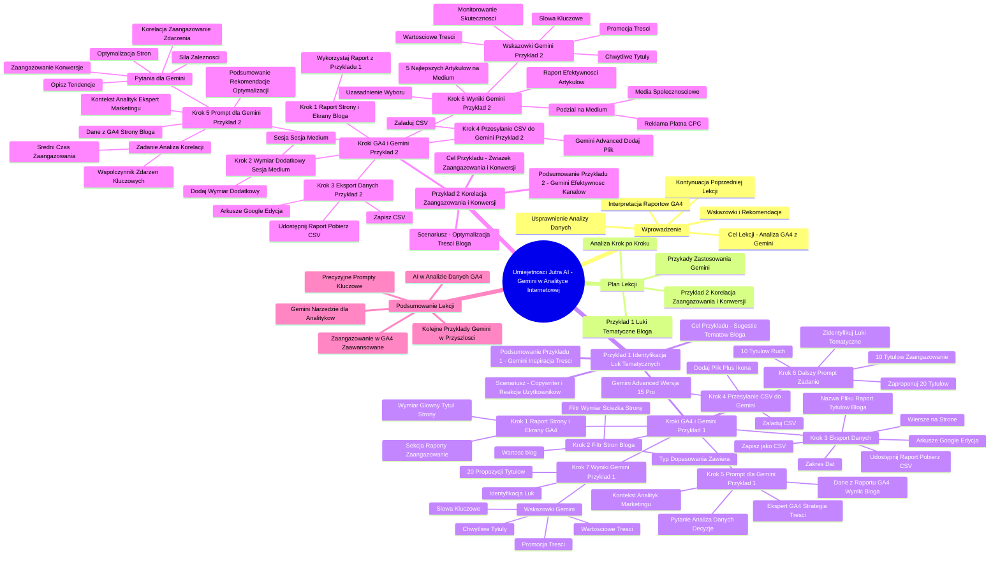

# Lekcje wideo - 3. Analiza danych GA4 z Gemini - strony

# 💡 Diagram



___

# 🗒️ Notatka


# Notatki i Podsumowanie Lekcji: "Umiejętności Jutra AI: Wykorzystanie Gemini w Analityce Internetowej" 🚀

## Wprowadzenie

Ta lekcja koncentruje się na praktycznym wykorzystaniu **Gemini** 🤖 (modelu AI) do interpretacji raportów w **Google Analytics 4 (GA4)**. Stanowi ona kontynuację poprzedniej lekcji, w której Gemini pełnił rolę prywatnego doradcy bezpośrednio w interfejsie GA4. Głównym celem jest zbadanie, czy Gemini może usprawnić analizę danych i interpretację raportów GA4, dostarczając cennych wskazówek i rekomendacji działań.

### Plan lekcji 📝

*   Przykłady zastosowania Gemini w analizie raportów GA4.
*   Szczegółowe omówienie procesu analizy krok po kroku.
*   **Przykład 1:** Interpretacja treści na stronie i identyfikacja luk tematycznych na blogu.
*   **Przykład 2:** Analiza korelacji między zaangażowaniem użytkowników a kluczowymi zdarzeniami (konwersjami).

## Przykład 1: Identyfikacja luk tematycznych na blogu 💡

**Cel:** Wykorzystanie Gemini do analizy istniejących treści bloga i wygenerowania sugestii nowych tematów, które mogą rezonować z użytkownikami.

**Scenariusz:** Copywriter pragnie zrozumieć reakcje użytkowników na treści bloga oraz zidentyfikować potencjalne braki tematyczne.

**Kroki w GA4 i Gemini:**

1.  **Dostęp do raportu "Strony i ekrany" w GA4:**
    *   Przejdź do sekcji: **Raporty** -> **Zaangażowanie** -> **Strony i ekrany**.
    *   Domyślnie raport wyświetla wymiar **Ścieżka strony i klasa ekranu**.
    *   Zmień wymiar główny na **Tytuł strony**, aby skupić się na analizie konkretnych tytułów artykułów.

2.  **Filtrowanie raportu do stron bloga:**
    *   Dodaj **filtr** w górnej części raportu.
    *   Wybierz **Wymiar:** Ścieżka strony i klasa ekranu.
    *   Ustaw **Typ dopasowania:** Zawiera.
    *   Wprowadź **Wartość:** `blog` (adresy URL bloga zaczynają się od `/blog/`).
    *   Kliknij **Zastosuj**.

3.  **Przygotowanie i eksport danych:**
    *   Rozszerz **zakres dat** w raporcie, aby Gemini miał dostęp do większej ilości danych.
    *   Zwiększ liczbę **wierszy na stronę** (np. do 50), aby pobrać więcej tytułów artykułów.
    *   Wybierz **Udostępnij raport** -> **Pobierz plik** -> **Eksportuj do Arkuszy Google**.
    *   W Arkuszach Google:
        *   Usuń **zbędne wiersze** (nagłówki, sumy).
        *   Zapisz plik jako **CSV (Wartości rozdzielane przecinkami)**.
        *   Nadaj plikowi nazwę, np. "Raport tytułów bloga".

4.  **Przesyłanie pliku CSV do Gemini Advanced:**
    *   W interfejsie Gemini Advanced (wersja 1.5 Pro), kliknij **ikonę plusa (+)** -> **Dodaj plik**.
    *   Załaduj zapisany plik CSV o nazwie "Raport tytułów bloga".

5.  **Prompt dla Gemini:**
    
    Jesteś doświadczonym analitykiem marketingu internetowego i ekspertem w dziedzinie Google Analytics.
    Twoja specjalizacja to wykorzystanie danych analitycznych do optymalizacji strategii treści.
    Przekazuję Ci dane z raportu GA4, prezentujące wyniki treści blogowych, w tym tytuły artykułów i ich kluczowe wskaźniki efektywności.
    Czy możesz przeanalizować te dane i pomóc mi w podjęciu decyzji strategicznych dotyczących treści?
    ```

6.  **Odpowiedź Gemini i dalsze instrukcje:**
    *   Gemini potwierdzi gotowość do analizy danych.
    *   **Dalszy prompt (konkretne zadanie):**
        ```
        Zidentyfikuj luki w naszej strategii treści, wskazując tematy, które mogą zainteresować naszych odbiorców, ale nie są jeszcze przez nas poruszane.
        Zaproponuj 20 nowych tytułów artykułów, które wypełnią te luki tematyczne.
        Podziel propozycje na dwie kategorie: 10 tytułów z potencjałem na wysoki ruch i 10 tytułów nastawionych na generowanie wysokiego zaangażowania.
        ```
    *   **Wyjaśnienie:** Prośba o 20 tytułów (zamiast np. 5) ma na celu pobudzenie kreatywności Gemini i uzyskanie szerszego spektrum propozycji.

7.  **Wyniki analizy Gemini:**
    *   Gemini analizuje dane i prezentuje **identyfikację luk w strategii treści** oraz **20 propozycji nowych tytułów artykułów**.
    *   Dodatkowe wskazówki od Gemini:
        *   Skoncentruj się na **słowach kluczowych**.
        *   Twórz **chwytliwe tytuły**.
        *   Dostarczaj **wartościowe treści**.
        *   **Promuj** swoje treści.

**Podsumowanie przykładu 1:** Gemini, analizując dane z GA4, efektywnie wspiera identyfikację luk w treści bloga i generowanie nowych tematów artykułów, stając się cennym źródłem inspiracji dla twórców treści.

## Przykład 2: Korelacja między zaangażowaniem a kluczowymi zdarzeniami 📈

**Cel:** Zbadanie, czy istnieje związek między wyższym poziomem zaangażowania użytkowników na blogu (mierzonym czasem zaangażowania) a częstszym występowaniem kluczowych zdarzeń (konwersji).

**Scenariusz:**  Chęć weryfikacji, czy optymalizacja treści bloga pod kątem zaangażowania jest uzasadniona, przy założeniu, że zaangażowani użytkownicy są bardziej skłonni do konwersji.

**Kroki w GA4 i Gemini:**

1.  **Raport "Strony i ekrany" dla bloga (jak w przykładzie 1):**
    *   Wykorzystaj ten sam raport "Strony i ekrany", przefiltrowany do bloga i z wymiarem głównym ustawionym na "Tytuł strony".

2.  **Dodanie wymiaru dodatkowego "Sesja - medium":**
    *   W raporcie dodaj **wymiar dodatkowy** -> **Sesja** -> **Sesja - medium**.
    *   Umożliwi to analizę zaangażowania i konwersji w kontekście źródła ruchu (np. organiczne wyniki wyszukiwania, płatne reklamy, media społecznościowe).

3.  **Przygotowanie i eksport danych:**
    *   Wybierz **Udostępnij raport** -> **Pobierz plik** -> **Eksportuj do Arkuszy Google**.
    *   W Arkuszach Google:
        *   Usuń **niepotrzebne wiersze**.
        *   Zapisz plik w formacie **CSV**.

4.  **Przesyłanie pliku CSV do Gemini Advanced:**
    *   Załaduj plik CSV do Gemini, korzystając z opcji **plusik (+) -> Dodaj plik**.

5.  **Prompt dla Gemini (szczegółowy):**
    ```
    Działasz jako doświadczony analityk i ekspert marketingu cyfrowego, specjalizujący się w tworzeniu rekomendacji opartych na danych.
    Przekazuję Ci dane z Google Analytics 4, zawierające informacje o stronach docelowych mojego bloga.
    Twoim zadaniem jest analiza korelacji między dwoma kluczowymi wskaźnikami:
    - Średni czas zaangażowania na sesję.
    - Współczynnik kluczowych zdarzeń w sesji (wyrażony w procentach).
    Odpowiedz na poniższe pytania:
    - Czy dostrzegasz wyraźną korelację między dłuższym czasem zaangażowania a wyższym współczynnikiem kluczowych zdarzeń w sesji?
    - Opisz zaobserwowaną tendencję.
    - Czy dłuższy czas zaangażowania zazwyczaj przekłada się na wyższy współczynnik konwersji?
    - Jeśli tak, określ siłę tej zależności.
    - W miarę możliwości, zasugeruj, które strony warto poddać optymalizacji w celu poprawy obu wskaźników.
    Przedstaw swoje wnioski w formie zwięzłego podsumowania, zawierającego konkretne rekomendacje dotyczące optymalizacji bloga.
    ```
    *   **Podkreślenie:** Precyzyjny i szczegółowy prompt jest kluczowy dla uzyskania wartościowych i adekwatnych odpowiedzi od Gemini. Nieprecyzyjne zapytania mogą prowadzić do błędnych lub niepożądanych rezultatów.

6.  **Wyniki analizy Gemini:**
    *   Gemini analizuje dane i dostarcza raport efektywności artykułów bloga, z podziałem na **reklamę płatną (Medium CPC)** i **media społecznościowe (Medium post referral lub paid social)**.
    *   Dla każdej kategorii medium, Gemini identyfikuje **pięć najlepiej performujących artykułów**, bazując na wskaźnikach zaangażowania i liczbie wyświetleń.
    *   Dla każdego wyróżnionego artykułu, Gemini przedstawia **uzasadnienie** wyboru, odwołując się do konkretnych wskaźników (czas zaangażowania, zdarzenia kluczowe).
    *   Dodatkowe wskazówki od Gemini (powtórzone z przykładu 1):
        *   Zwróć uwagę na **słowa kluczowe**.
        *   Twórz **chwytliwe tytuły**.
        *   Dostarczaj **wartościowe treści**.
        *   **Promuj** swoje treści.
        *   **Regularnie monitoruj** skuteczność treści i dostosowuj strategię.

**Podsumowanie przykładu 2:** Gemini pomaga zidentyfikować najbardziej efektywne artykuły bloga w różnych kanałach dystrybucji (reklama płatna vs. media społecznościowe) na podstawie danych o zaangażowaniu i konwersjach. Umożliwia to lepsze dopasowanie treści do kanałów i optymalizację strategii marketingowej.

## Podsumowanie lekcji 🎓

Lekcja ta demonstruje praktyczne zastosowanie **Gemini** w analizie danych z **Google Analytics 4** w kontekście bloga. Przedstawiono dwa konkretne przykłady:

1.  **Identyfikacja luk w treści i generowanie nowych tematów:** Gemini wspiera proces tworzenia pomysłów na nowe artykuły blogowe poprzez analizę popularności istniejących treści.
2.  **Analiza korelacji zaangażowania i konwersji:** Gemini pomaga zrozumieć, które artykuły i kanały dystrybucji przyciągają najbardziej zaangażowanych i wartościowych użytkowników, co umożliwia optymalizację strategii treści i promocji.

**Kluczowe wnioski:**

*   **Gemini stanowi cenne narzędzie** dla analityków internetowych i marketerów w interpretacji danych GA4.
*   **Precyzyjne i szczegółowe prompty są niezbędne** do uzyskania wartościowych wyników z Gemini.
*   **Analiza danych z GA4 z wykorzystaniem AI** dostarcza praktycznych wskazówek do optymalizacji treści i strategii marketingowej.
*   **Pomiar zaangażowania w GA4** jest bardziej zaawansowany i wiarygodny w porównaniu do poprzednich wersji Analytics.
*   Lekcja zapowiada **kolejne przykłady wykorzystania Gemini** w analizie contentu w przyszłych materiałach.
```

___

# 🔉 Transcript
File: Lekcje wideo - 3. Analiza danych GA4 z Gemini - strony.mp4<br>
[00:00:00] Ekran: Białe tło.
[00:00:02] Ekran: Na białym tle pojawia się napis "Umiejętności Jutra AI". Poniżej napis "Organizator Google" i "Partner edukacyjny SGH".
[00:00:05] Krzysztof Modrzewski: Witam cię w kolejnej lekcji z wykorzystania AI w analityce internetowej.
[00:00:09] Krzysztof Modrzewski: W poprzedniej lekcji wykorzystaliśmy Gemini jako prywatnego doradcę podczas korzystania z interfejsu Google Analytics 4.
[00:00:15] Krzysztof Modrzewski: Myślę, że dla niedoświadczonych osób była to całkiem przydatna lekcja.
[00:00:19] Krzysztof Modrzewski: Przejdźmy jednak dalej.
[00:00:21] Krzysztof Modrzewski: Skoro Gemini zna i rozumie działanie GA4, to może będzie w stanie pomóc nam w lepszej interpretacji raportów.
[00:00:28] Krzysztof Modrzewski: Oczywiście, nie żebym wątpił w swoją mądrość i co to to nie.
[00:00:31] Krzysztof Modrzewski: Jednak, jak to się ładnie mówi, co dwie głowy to nie jedna.
[00:00:34] Krzysztof Modrzewski: Nawet jeżeli ta druga głowa jest sztuczna.
[00:00:38] Krzysztof Modrzewski: Może właśnie dzięki takim analizom inaczej spojrzymy na nasze dane.
[00:00:42] Krzysztof Modrzewski: Może uzyskamy jakieś cenne wskazówki, może AI zaproponuje inne możliwości interpretacji i też zasugeruje jakieś konkretne działania na podstawie naszych danych.
[00:00:51] Krzysztof Modrzewski: Tego właśnie przekonamy się w tej i w kilku następnych lekcjach.
[00:00:55] Krzysztof Modrzewski: Przygotowałem bowiem dla ciebie różne przypadki zastosowania Gemini w analizowaniu raportów dostępnych właśnie w Google Analytics 4.
[01:03] Krzysztof Modrzewski: Przez wszystko przeprowadzę cię krok po kroku, ale jeżeli będzie coś dla ciebie niezrozumiałe, to daj mi znać, chętnie pomogę.
[01:10] Krzysztof Modrzewski: A tymczasem przejdźmy do naszego pierwszego przykładu.
[01:13] Krzysztof Modrzewski: Na początku zajmijmy się tym, jak Gemini pomoże nam w interpretacji naszych treści na stronie.
[01:20] Krzysztof Modrzewski: Na przykład, jak byśmy byli copywriterem i chcielibyśmy się czegoś więcej dowiedzieć o tym, jak użytkownicy reagują na to, co na naszej stronie umieszczamy, jeżeli chodzi o na przykład o treść naszego bloga.
[01:32] Krzysztof Modrzewski: To, przejdźmy w takim razie do interfejsu.
[01:34] Krzysztof Modrzewski: Ja skorzystam sobie z myszki, żeby było mi łatwiej tutaj z tego naszego Gemini jak korzystać.
[01:40] Krzysztof Modrzewski: Jak widzisz, mam otwarty Gemini Advanced i mam również otwarte moje konto Google Analytics 4.
[01:48] Krzysztof Modrzewski: I teraz chciałbym się dowiedzieć w pierwszym przykładzie, który przygotowałem, czy są jakieś tematy na moim blogu, których mi brakuje.
[01:57] Krzysztof Modrzewski: Więc niech Gemini zrobi taką analizę.
[01:59] Krzysztof Modrzewski: Niech przejrzy materiały jakie są i niech spojrzy jakie jest zainteresowanie moich materiałów i niech zaproponuje mi w takim razie tematy, które, których potencjalnie na moim blogu brakuje.
[02:10] Krzysztof Modrzewski: Żeby jednak do tego przejść, najpierw muszę dostarczyć Gemini odpowiednich, odpowiedniego wkładu danych.
[02:18] Krzysztof Modrzewski: W tym celu na koncie Google Analytics 4 przechodzę do zakładki raporty i szukam tutaj raportu właśnie stron, tytułów mojego bloga.
[02:27] Krzysztof Modrzewski: Przechodzę więc do sekcji zaangażowanie strony i ekrany.
[02:32] Krzysztof Modrzewski: Już wiesz z poprzedniej lekcji, że jeżeli nie wiesz gdzie znaleźć jakieś elementy czy raporty czy dane w Google Analytics 4, to też możesz o to zapytać po prostu Gemini, żeby ci pomógł.
[02:43] Krzysztof Modrzewski: No dobra.
[02:44] Krzysztof Modrzewski: Jestem w raporcie strony i ekrany, ścieżki strony i klasa ekranu.
[02:49] Krzysztof Modrzewski: No i teraz po prostu muszę ten raport odpowiednio przygotować, pobrać i dostarczyć do Gemini.
[02:56] Krzysztof Modrzewski: Najpierw jednak zwiększę zakres dat, żeby system po prostu miał więcej informacji o ruchu na moim blogu.
[03:04] Krzysztof Modrzewski: I wybieram jako wymiar nie ścieżka strony, a tytuł strony, żeby mieć konkretne tytuły pod stron w moim serwisie.
[03:11] Krzysztof Modrzewski: Tylko w tym przypadku od razu widzę wszystkie strony mojej witryny, a chcę się skupić na tym, żeby Gemini przeanalizował tytuły stron mojego bloga.
[03:21] Krzysztof Modrzewski: W tym celu muszę dodać filtr, czyli klikam tutaj dodaj filtr na górze tego interfejsu i po prawej stronie pojawiła mi się opcja właśnie tworzenie filtra.
[03:30] Krzysztof Modrzewski: Wybieram na początku wymiar, przez który chcę to przefiltrować.
[03:34] Krzysztof Modrzewski: W tym przypadku będzie to ścieżka strony i klasa ekranu, typ dopasowania zawiera.
[03:40] Krzysztof Modrzewski: No i tutaj wpisuję, że zawiera blog.
[03:42] Krzysztof Modrzewski: No i robię zastosuj.
[03:44] Krzysztof Modrzewski: Dlaczego tak?
[03:45] Krzysztof Modrzewski: Ponieważ wszystkie strony mojego bloga mają wcześniej przedrostek blog.
[03:50] Krzysztof Modrzewski: Tak jest tytuł strony ukośnik blog ukośnik i dopiero tytuł artykułu.
[03:55] Krzysztof Modrzewski: No i widzę, że faktycznie udało mi się to przefiltrować.
[03:57] Krzysztof Modrzewski: Widzę tytuły moich artykułów.
[04:00] Krzysztof Modrzewski: Pięć wyzwań i pięć rozwiązań dla osób poszukujących pracy.
[04:03] Krzysztof Modrzewski: Kluczowe kompetencje analityka danych i tak dalej i tak dalej.
[04:10] Krzysztof Modrzewski: No to teraz powinienem taki raport pobrać.
[04:11] Krzysztof Modrzewski: Od razu dam tutaj więcej wierszy na stronę, żeby było więcej informacji.
[04:17] Krzysztof Modrzewski: I taki raport muszę pobrać.
[04:18] Krzysztof Modrzewski: W tym celu na górze po prawej stronie nad wykresem mam taką opcję udostępnij raport i opcję pobierz plik.
[04:26] Krzysztof Modrzewski: Mogę pobrać plik CSV, ale dużo prostszą i chyba lepszą opcją będzie wyeksportowanie tego pliku do arkuszy Google.
[04:33] Krzysztof Modrzewski: Dlaczego?
[04:34] Krzysztof Modrzewski: Bo łatwiej będzie nam ten plik później przygotować, bo musimy go odpowiednio tutaj oczywiście obrobić do tego zanim on zostanie załadowany do Gemini.
[04:51] Krzysztof Modrzewski: Usuwam niepotrzebne wiersze tutaj, które są na początku.
[04:56] Krzysztof Modrzewski: Mam tutaj wszystkie informacje już, które są potrzebne i nazywam odpowiednio ten raport.
[05:05] Krzysztof Modrzewski: Raport tytułów bloga.
[05:07] Krzysztof Modrzewski: Biorę plik, pobierz wartość rozdzielana przecinkami.
[05:15] Krzysztof Modrzewski: Zapisuję go.
[05:18] Krzysztof Modrzewski: I teraz mogę przejść do Gemini i jak korzystam w tej chwili z Gemini Advanced w wersji 1.5 Pro, to mam taki plusik i mogę tutaj dodać plik.
[05:27] Krzysztof Modrzewski: Mogę dodać właśnie raport, który pobrałem.
[05:40] Krzysztof Modrzewski: Jak już mam załadowany plik, to mogę napisać prompt.
[05:40] Krzysztof Modrzewski: Prompt już mam wcześniej przygotowany, żeby tutaj nie stukać w klawiaturę i nie pisać go na żywo, ale omówmy go sobie.
[05:46] Krzysztof Modrzewski: Jesteś analitykiem marketingu internetowego i ekspertem w wykorzystaniu danych Google Analytics.
[05:51] Krzysztof Modrzewski: To jest pewien kontekst, który tutaj mu nadaję.
[05:53] Krzysztof Modrzewski: Do podejmowania decyzji dotyczących strategii treści.
[05:55] Krzysztof Modrzewski: Przekazuję ci dane z raportu GA4, który pokazuje wyniki treści na blogu, w tym tytuły artykułów i ich wskaźniki skuteczności.
[06:04] Krzysztof Modrzewski: Czy jesteś w stanie zrealizować dla mnie zadanie dotyczące tych danych?
[06:07] Krzysztof Modrzewski: Pytam się go, czy odpowiednio rozpoznaje ten plik i czy jest w stanie przeczytać informacje zawarte w tym pliku, zanim dam mu jakieś następne zadanie.
[06:15] Krzysztof Modrzewski: Klikam prześlij.
[06:16] Krzysztof Modrzewski: No i teraz czekamy co tutaj system mi odpowie.
[06:22] Krzysztof Modrzewski: Widzimy, że analiza jest zakończona.
[06:24] Krzysztof Modrzewski: Tak, z przyjemnością pomogę ci w analizie danych GA4, wykorzystam moją wiedzę w zakresie marketingu internetowego, aby pomóc ci w podejmowaniu decyzji dotyczących strategii treści.
[06:30] Krzysztof Modrzewski: Prześlij mi dane, a następnie powiedz, jakie konkretne zadania chcesz zrealizować, im więcej szczegółów mi przekażesz, tym lepiej będę mógł ci pomóc.
[06:34] Krzysztof Modrzewski: Na przykład, czy chcesz zidentyfikować najskuteczniejsze artykuły na blogu?
[06:37] Krzysztof Modrzewski: Dowiedzieć się, jakie tematy generują największe zaangażowanie?
[06:40] Krzysztof Modrzewski: Zrozumieć, jakie źródła ruchu są najbardziej wartościowe dla twojego bloga?
[06:43] Krzysztof Modrzewski: Opracować rekomendacje dotyczące przyszłych treści?
[06:45] Krzysztof Modrzewski: Jestem do twojej dyspozycji i chętnie pomogę ci w osiągnięciu twoich celów marketingowych.
[06:50] Krzysztof Modrzewski: Wskaż luki w strategii treści, czyli tematy, które mogłyby zainteresować odbiorców, ale nie są poruszane.
[06:51] Krzysztof Modrzewski: Zaproponuj 20 nowych tytułów artykułów, które wypełnią te luki.
[06:54] Krzysztof Modrzewski: 10 tytułów, które prawdopodobnie wygenerują duży ruch oraz 10 tytułów, które prawdopodobnie wygenerują wysokie zaangażowanie.
[07:06] Krzysztof Modrzewski: To jest to, między innymi, żeby prosić Gemini o więcej informacji, bo wtedy musi wykazać się on większą kreatywnością, bo gdybym poprosił go o 10 nowych tytułów tylko albo pięć, no to dałby mi jakieś takie najprostsze tytuły, a dzięki temu, że proszę go o 20 albo gdybym poprosił go o więcej o 30, 40, to zmuszam go do większej kreatywności i do lepszego podania mi więcej różnych przykładów, z których ja już później oczywiście wybiorę to, co mnie najbardziej interesuje.
[07:22] Krzysztof Modrzewski: No i zobaczmy teraz co mi wygeneruje.
[07:27] Krzysztof Modrzewski: Widzimy, że analiza jest zakończona.
[07:29] Krzysztof Modrzewski: Gemini zapoznał się z moimi danymi.
[07:31] Krzysztof Modrzewski: Na podstawie analizy danych zaproponuję 20 nowych tytułów artykułów, które wypełnią luki w twojej strategii treści.
[07:36] Krzysztof Modrzewski: Luki w strategii treści i propozycje nowych tytułów artykułów.
[07:40] Krzysztof Modrzewski: No i mam tutaj właśnie luki w strategii treści.
[07:44] Krzysztof Modrzewski: No i przedstawia mi 20 propozycji tytułów artykułów, które wypełnią te luki.
[07:50] Krzysztof Modrzewski: I oprócz tego jeszcze Gemini mi zaproponował mi dodatkowe wskazówki.
[07:52] Krzysztof Modrzewski: Zwróć uwagę na słowa kluczowe, używaj słów kluczowych, które są popularne w twojej grupie docelowej.
[07:55] Krzysztof Modrzewski: Twórz chwytliwe tytuły, tytuł powinien być intrygujący i zachęcający do kliknięcia.
[07:58] Krzysztof Modrzewski: Dostarczaj wartościowe treści.
[08:00] Krzysztof Modrzewski: Promuj swoje treści.
[08:01] Krzysztof Modrzewski: No i tak właśnie mam.
[08:02] Krzysztof Modrzewski: Dzięki temu mam już analizę tego, czego prawdopodobnie brakuje na moim blogu na podstawie danych z mojego bloga.
[08:07] Krzysztof Modrzewski: No i mając już takie przykłady, mogę na przykład teraz cofnąć się do kursu o content marketingu i tam wykorzystać to, co tutaj wygenerował mi na podstawie moich danych z Google Analytics po to, żeby stworzyć razem z Gemini już wartościowe artykuły, które jeszcze dzisiaj będę mógł wrzucić na stronę mojego bloga.
[09:01] Krzysztof Modrzewski: Ale to nie jedyny przykład wykorzystania Gemini do analizy contentu na stronie internetowej, więc przejdźmy dalej.
[09:06] Krzysztof Modrzewski: Bardzo wiele osób, które korzystają z Google Analytics 4, bierze pod uwagę taką metrykę jak zaangażowanie na stronie.
[09:13] Krzysztof Modrzewski: I faktycznie w Google Analytics 4 to dla takich dinozaurów z analityki, ten czas czy w ogóle to zaangażowanie jest mierzone dużo lepiej niż w poprzednich edycjach Analytics, gdzie było z tym trochę problemów, ale w GA4 możemy faktycznie z tej metryki korzystać i na tych danych się opierać w różnego rodzaju naszych analizach.
[09:35] Krzysztof Modrzewski: Sprawdźmy w związku z tym, czy większe zaangażowanie na naszym blogu wiąże się z większą ilością kluczowych zdarzeń w Analytics.
[09:41] Krzysztof Modrzewski: Czy to, że ktoś dłużej jest zaangażowany w bloga, będzie świadczyło o tym, że później na przykład dokonuje więcej konwersji i ogólnie jest lepszym użytkownikiem.
[09:50] Krzysztof Modrzewski: Zobaczmy to właśnie na przykładzie naszych danych po to, żeby wiedzieć, czy w moich analizach i w mojej optymalizacji opierać się na współczynniku zaangażowania.
[10:02] Krzysztof Modrzewski: W tym celu jestem w tej chwili na w raporcie strony i ekrany tytuł strony i klasa ekranu.
[10:09] Krzysztof Modrzewski: Dalej mam wyfiltrowane wszystkie moje artykuły mojego bloga.
[10:15] Krzysztof Modrzewski: I teraz dodam sobie dodatkowy wymiar, mianowicie źródło medium.
[10:18] Krzysztof Modrzewski: Tak?
[10:19] Krzysztof Modrzewski: Chcę wiedzieć skąd moi przychodzą moi użytkownicy, a konkretnie podam samo medium, bo to już będzie dla mnie określało skąd ten użytkownik przyszedł.
[10:28] Krzysztof Modrzewski: To może być reklama płatna, mogą być działania w social media płatne, mogą być wejścia organiczne, bezpośrednie czy też z innych social mediów działań.
[10:32] Krzysztof Modrzewski: I taki raport już rozbity z dodatkowym wymiarem sesja medium też muszę oczywiście odpowiednio pobrać i przygotować do wklejenia do Gemini.
[10:41] Krzysztof Modrzewski: Więc udostępniam raport, robię pobierz plik, wyeksportuj dane do arkuszy Google i znowu ponawiam cały ten proces w związku z usuwaniem niepotrzebnych wierszy i później zapisanie tego pliku do formatu CSV po to, żeby można było wgrać tutaj do Gemini.
[11:10] Krzysztof Modrzewski: Jak już mam gotowy plik, to muszę go tutaj załadować do mojego czata, czyli robię plusik, załaduj plik.
[11:13] Krzysztof Modrzewski: Wybieram plik CSV i wklejam tutaj wcześniej przygotowany prompt i teraz uwaga, chciałem go omówić, ponieważ promptowanie jest kluczowe w tym przypadku.
[11:40] Krzysztof Modrzewski: I chcę na to zwrócić szczególną uwagę, ponieważ wielokrotnie już mi się zdarzało, że zarówno Gemini i inne różnego rodzaju czaty czy systemy element dawały mi złe wyniki albo nie takie wyniki jakie chciałem, ponieważ tworzyłem niepoprawne prompty.
[11:50] Krzysztof Modrzewski: Prompt powinien być długi, powinien być dokładny, powinien zawierać dokładne instrukcje.
[11:59] Krzysztof Modrzewski: Bo dzięki temu możemy spodziewać się dobrego wyniku, dlatego oczywiście wszystkie prompty, z których korzystamy podczas naszego kursu będą dostępne w materiałach dodatkowych, więc zawsze możesz z nich sobie skorzystać na przykład później do stworzenia swoich własnych promptów.
[12:10] Krzysztof Modrzewski: W każdym razie, wracając do tego, o co będę teraz prosił Gemini.
[12:14] Krzysztof Modrzewski: Jesteś analitykiem i ekspertem do spraw marketingu cyfrowego, który tworzy rekomendacje oparte na danych.
[12:19] Krzysztof Modrzewski: Przekazuję ci dane z GA4, zawierające dane o stronach docelowych mojego bloga.
[12:21] Krzysztof Modrzewski: Twoje zadanie to przeanalizowanie korelacji między dwoma wskaźnikami.
[12:23] Krzysztof Modrzewski: Średni czas zaangażowania na sesję.
[12:25] Krzysztof Modrzewski: Współczynnik kluczowych zdarzeń w sesji (w procentach).
[12:27] Krzysztof Modrzewski: Odpowiedz na następujące pytania.
[12:30] Krzysztof Modrzewski: Czy istnieje zauważalna korelacja między dłuższym czasem zaangażowania a wyższym współczynnikiem kluczowych zdarzeń w sesji?
[12:35] Krzysztof Modrzewski: Opisz tendencję.
[12:36] Krzysztof Modrzewski: Czy dłuższy czas zaangażowania zazwyczaj prowadzi do wyższego współczynnika konwersji?
[12:39] Krzysztof Modrzewski: Jeśli tak, to jak silna jest ta zależność?
[12:41] Krzysztof Modrzewski: Jeżeli to możliwe, zasugeruj, które strony warto zoptymalizować, aby poprawić oba wskaźniki.
[12:46] Krzysztof Modrzewski: Przedstaw swoje wnioski w formie podsumowania wraz z konkretnymi rekomendacjami dla optymalizacji bloga.
[12:50] Krzysztof Modrzewski: Bardzo długi prompt, ale z dokładną instrukcją.
[12:53] Krzysztof Modrzewski: No i zobaczmy jak sobie z tym poradzi.
[12:56] Krzysztof Modrzewski: Czekamy na analizę.
[12:57] Krzysztof Modrzewski: Analiza zakończona.
[12:59] Krzysztof Modrzewski: Zobaczmy co otrzymaliśmy.
[13:00] Krzysztof Modrzewski: Zapoznałem się z twoimi danymi.
[13:03] Krzysztof Modrzewski: W kolejnym kroku przeanalizowałem dane, aby określić efektywność artykułów w kategoriach reklama płatna i media społecznościowe.
[13:06] Krzysztof Modrzewski: Następnie zidentyfikuję pięć najczęstszych artykułów dla każdej kategorii, biorąc pod uwagę wskaźniki zaangażowania i liczbę wyświetleń.
[13:11] Krzysztof Modrzewski: Teraz przeanalizuję dane dla artykułów promowanych w mediach społecznościowych, aby określić, które z nich generują największe zaangażowanie i liczbę wyświetleń.
[13:14] Krzysztof Modrzewski: Raport skuteczności artykułów na blogu.
[13:15] Krzysztof Modrzewski: Reklama płatna Medium CPC.
[13:16] Krzysztof Modrzewski: Na podstawie analizy danych pięć artykułów, które najlepiej sprawdzają się w reklamach płatnych to.
[13:20] Krzysztof Modrzewski: Pięć wyzwań i pięć rozwiązań dla osób poszukujących pracy lub zaczynających karierę w marketingu.
[13:23] Krzysztof Modrzewski: Ten artykuł ma najwyższą liczbę wyświetleń aktywnych użytkowników oraz zdarzeń kluczowych.
[13:26] Krzysztof Modrzewski: Średni czas zaangażowania jest zadowalający.
[13:28] Krzysztof Modrzewski: Wszystkie te wskaźniki sugerują, że artykuł jest interesujący dla odbiorców i warto go promować.
[13:32] Krzysztof Modrzewski: Co to jest Performance Marketing?
[13:34] Krzysztof Modrzewski: Artykuł ten charakteryzuje się wysokim średnim czasem zaangażowania i generuje znaczną liczbę zdarzeń, co wskazuje na jego wartość dla odbiorców.
[13:37] Krzysztof Modrzewski: Kluczowe kompetencje analityka danych.
[13:39] Krzysztof Modrzewski: Pomimo mniejszej liczby wyświetleń, artykuł ten ma wysoki współczynnik zaangażowania, co sugeruje, że trafił do zaangażowanej grupy odbiorców.
[13:41] Krzysztof Modrzewski: Skuteczny plan marketingu online darmowy szablon.
[13:42] Krzysztof Modrzewski: Artykuł ten ma na stosunkowo wysoki średni czas zaangażowania i generuje znaczną liczbę zdarzeń.
[13:45] Krzysztof Modrzewski: T-shape w Performance Marketing.
[13:46] Krzysztof Modrzewski: Trzy kluczowe sylwetki.
[13:47] Krzysztof Modrzewski: Mimo niewielkiej liczby wyświetleń, artykuł ten ma najwyższy średni czas zaangażowania, co sugeruje, że jest on bardzo interesujący dla osób, które go przeczytały.
[13:51] Krzysztof Modrzewski: Uzasadnienie.
[13:52] Krzysztof Modrzewski: Wybierając artykuły do reklam płatnych, skupiłem się na wskaźnikach zaangażowania, takich jak średni czas zaangażowania, liczba zdarzeń i liczba zdarzeń kluczowych.
[13:57] Krzysztof Modrzewski: Artykuły o wysokim zaangażowaniu mają większe szanse na konwersję, co jest kluczowe w przypadku reklam płatnych.
[14:00] Krzysztof Modrzewski: Media społecznościowe Medium post referral lub paid social.
[14:03] Krzysztof Modrzewski: Na podstawie analizy danych pięć artykułów, które najlepiej sprawdzają się w promowaniu w mediach społecznościowych to.
[14:11] Krzysztof Modrzewski: Twoja historia sukcesu w marketingu podziel się swoimi doświadczeniami.
[14:13] Krzysztof Modrzewski: Największe wyzwania w marketingu internetowym jak je pokonać?
[14:16] Krzysztof Modrzewski: Kreatywne pomysły na kampanie marketingowe w mediach społecznościowych.
[14:19] Krzysztof Modrzewski: Jak budować zaangażowaną społeczność wokół swojej marki?
[14:22] Krzysztof Modrzewski: Błędy w marketingu internetowym o czym warto pamiętać?
[14:25] Krzysztof Modrzewski: Przyszłość marketingu internetowego trendy i prognozy.
[14:27] Krzysztof Modrzewski: Jak wykorzystać sztuczną inteligencję w marketingu?
[14:30] Krzysztof Modrzewski: Marketing w czasach kryzysu jak dostosować strategię?
[14:33] Krzysztof Modrzewski: Case study jak firma X osiągnęła sukces dzięki marketingowi internetowemu.
[14:36] Krzysztof Modrzewski: Debata czy influencer marketing jest etyczny?
[14:40] Krzysztof Modrzewski: Dodatkowe wskazówki.
[14:41] Krzysztof Modrzewski: Zwróć uwagę na słowa kluczowe.
[14:42] Krzysztof Modrzewski: Używaj słów kluczowych, które są popularne w twojej grupie docelowej.
[14:44] Krzysztof Modrzewski: Twórz chwytliwe tytuły.
[14:45] Krzysztof Modrzewski: Dostarczaj wartościowe treści.
[14:48] Krzysztof Modrzewski: Promuj swoje treści.
[14:50] Krzysztof Modrzewski: Pamiętaj, że analiza danych to proces ciągły.
[14:51] Krzysztof Modrzewski: Regularnie monitoruj, skuteczność swoich treści i dostosowuj strategię do zmieniających się potrzeb odbiorców.
[15:03] Krzysztof Modrzewski: Ale to jeszcze nie wszystko co przygotowałem, więc przejdźmy dalej.
[15:06] Krzysztof Modrzewski: Bardzo wiele osób, które korzystają z Google Analytics 4, bierze pod uwagę taką metrykę jak zaangażowanie na stronie.
[15:13] Krzysztof Modrzewski: I faktycznie w Google Analytics 4 to dla takich dinozaurów z analityki, ten czas czy w ogóle to zaangażowanie jest mierzone dużo lepiej niż w poprzednich edycjach Analytics, gdzie było z tym trochę problemów, ale w GA4 możemy faktycznie z tej metryki korzystać i na tych danych się opierać.
[15:35] Krzysztof Modrzewski: Sprawdźmy w związku z tym, czy większe zaangażowanie na naszym blogu wiąże się z większą ilością kluczowych zdarzeń w Analytics.
[15:44] Krzysztof Modrzewski: Czy to, że ktoś dłużej jest zaangażowany w bloga, będzie świadczyło o tym, że później na przykład dokonuje więcej konwersji i ogólnie jest lepszym użytkownikiem.
[15:53] Krzysztof Modrzewski: Zobaczmy to właśnie na przykładzie naszych danych po to, żeby lepiej wiedzieć, gdzie dane media dystrybuować i jakie artykuły pisać do jakich właśnie źródeł.
[16:02] Krzysztof Modrzewski: W tym celu jestem w tej chwili na w raporcie strony i ekrany, ścieżki strony i klasa ekranu.
[16:09] Krzysztof Modrzewski: Dalej mam wyfiltrowane wszystkie moje artykuły mojego bloga.
[16:12] Krzysztof Modrzewski: I teraz dodam sobie dodatkowy wymiar, mianowicie źródło medium, tak?
[16:18] Krzysztof Modrzewski: Chcę wiedzieć skąd moi przychodzą moi użytkownicy, a konkretnie podam samo medium, bo to już będzie dla mnie określało skąd ten użytkownik przyszedł.
[16:28] Krzysztof Modrzewski: To może być reklama płatna, mogą być działania w social media płatne, mogą być wejścia organiczne, bezpośrednie czy też z innych social mediów działań.

___
# 🏷️ Tags
#Gemini #AI #Google_Analytics_4 #GA4 #analityka_internetowa #analiza_danych #interpretacja_raportów #umiejętności_jutra_AI #doradca_AI #optymalizacja_danych #rekomendacje_AI #blog #luk_tematyczne #copywriter #treść_bloga #reakcje_użytkowników #braki_tematyczne #raport_strony_i_ekrany #ścieżka_strony_i_klasa_ekranu #tytuł_strony #filtr_GA4 #wymiar_GA4 #typ_dopasowania #wartość_filtra #zakres_dat #wiersze_na_stronę #udostępnij_raport #pobierz_plik #eksport_do_arkuszy_Google #arkusze_Google #CSV #wartości_rozdzielane_przecinkami #Raport_tytułów_bloga #Gemini_Advanced #wersja_1.5_Pro #prompt #analyst_marketingu_internetowego #ekspert_Google_Analytics #optymalizacja_strategii_treści #wskaźniki_efektywności #decyzje_strategiczne #identyfikacja_luk #odbiorcy #tytuły_artykułów #wysoki_ruch #wysokie_zaangażowanie #słowa_kluczowe #chwytliwe_tytuły #wartościowe_treści #promocja_treści #korelacja #zaangażowanie_użytkowników #kluczowe_zdarzenia #konwersje #czas_zaangażowania #optymalizacja_treści #wymiar_dodatkowy #sesja_medium #źródło_ruchu #reklama_płatna #media_społecznościowe #szczegółowy_prompt #rekomendacje_oparte_na_danych #strony_docelowe #średni_czas_zaangażowania_na_sesję #współczynnik_kluczowych_zdarzeń_w_sesji #tendencja #zależność #optymalizacja_stron #wnioski #podsumowanie #raport_efektywności_artykułów #reklama_płatna_CPC #medium_CPC #media_społecznościowe_referral #medium_post_referral #paid_social #najlepiej_performujące_artykuły #liczba_wyświetleń #uzasadnienie_wyboru #regularny_monitoring #skuteczność_treści #strategia_marketingowa #narzędzie_AI #precyzyjne_prompty #pomiar_zaangażowania #content_marketing
