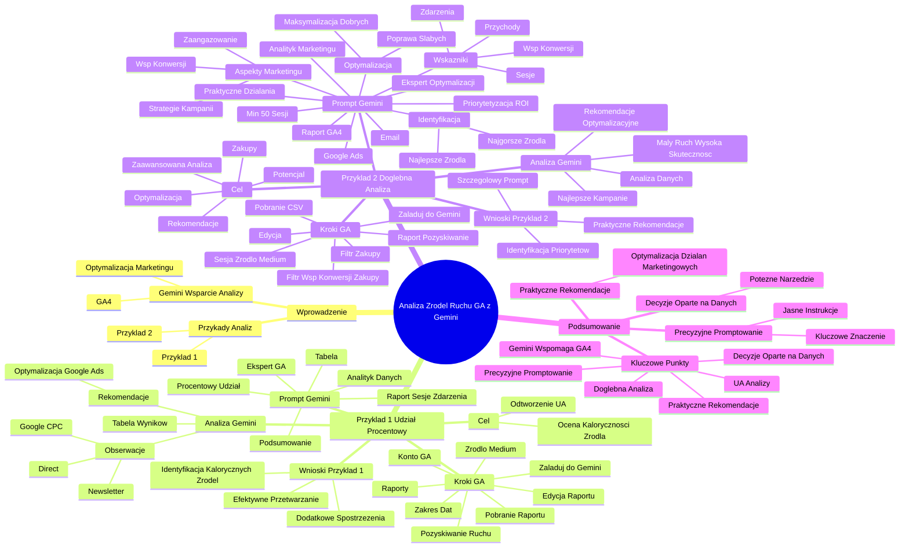

# Lekcje wideo - 4. Analiza danych GA4 z Gemini - źródła ruchu

# 💡 Diagram



___

# 🗒️ Notatka


# Notatki i Podsumowanie: Analiza Źródeł Ruchu w Google Analytics z Pomocą Gemini 🤖

## Wprowadzenie

Niniejsze podsumowanie dotyczy wykorzystania narzędzia `Gemini` do analizy źródeł ruchu w `Google Analytics`, mającej na celu optymalizację działań marketingowych. Przedstawiono dwa przykłady analiz, które ilustrują, w jaki sposób `Gemini` może wspierać analityków i marketerów w interpretacji danych z `Google Analytics 4`.

## Przykład 1: Procentowy Udział Źródeł Ruchu (Wzorowany na Universal Analytics)

### Cel

Odtworzenie analizy znanej z `Universal Analytics`, gdzie przy każdej metryce prezentowany był procentowy udział w całości. Ułatwiało to szybką ocenę "kaloryczności" źródła ruchu, czyli jego zdolności do generowania konwersji w stosunku do ogólnego ruchu.

### Kroki w Google Analytics

1.  **Konto Google Analytics:** Zaloguj się na konto `Google Analytics` (przykład na `Google Merchandise Store`).
2.  **Raporty:** Przejdź do zakładki "Raporty".
3.  **Pozyskiwanie Ruchu:** Wybierz raport "Pozyskiwanie ruchu" w sekcji "Pozyskanie".
4.  **Wymiar Źródło/Medium:** Zmień wymiar główny z domyślnej "Grupy kanałów" na "Sesja źródło/medium", aby uzyskać szczegółowe dane.
5.  **Zakres Dat:** Ustaw dłuższy zakres dat, by zgromadzić więcej danych.
6.  **Pobranie Raportu:** Pobierz przygotowany raport.
7.  **Edycja Raportu:** Usuń zbędne wiersze z pobranego pliku (np. wiersze podsumowań).
8.  **Załadowanie do Gemini:** Prześlij edytowany plik CSV do `Gemini`.

### Prompt dla Gemini


Jesteś analitykiem danych i ekspertem w analizie wyników z Google Analytics. Przekazuję Ci raport dotyczący sesji i kluczowych zdarzeń z wymiarem "źródło/medium". Twoje zadanie: Przedstaw wynik w nowej tabeli, która pokaże procentowy udział każdego źródła/medium w całkowitej liczbie sesji oraz procentowy udział w całkowitej liczbie kluczowych zdarzeń (key events). Obliczenia mają być dokładne i sumować się do 100% dla każdej kategorii (sesje i kluczowe zdarzenia). Zaprezentuj wyniki w czytelnej tabeli i podsumuj najważniejsze obserwacje.
```

### Analiza i Wyniki Gemini

*   **Tabela Wyników:** `Gemini` utworzył tabelę z kolumnami: "źródło/medium", "% wszystkich sesji", "% kluczowych zdarzeń".
*   **Przykładowe Obserwacje:**
    *   **Ruch Bezpośredni (direct):** 67% całkowitego ruchu, ale tylko 55% kluczowych zdarzeń.
    *   **Google CPC:** 3% całkowitego ruchu i 2.5% kluczowych zdarzeń - **wymaga optymalizacji** 📈.
    *   **Newsletter:** Niewielki ruch, lecz wysoki procent kluczowych zdarzeń (**"kaloryczne" źródło** 🔥).
*   **Podsumowanie i Rekomendacje Gemini:**
    *   Zwrócenie uwagi na źródło/medium generujące 2.6% sesji i aż 9.5% kluczowych zdarzeń (wcześniej niezauważone).
    *   Rekomendacja analizy i optymalizacji kampanii `Google Ads` (`Google CPC`) ze względu na niską skuteczność.

### Kluczowe Wnioski z Przykładu 1

*   `Gemini` szybko i efektywnie przetworzył dane i wygenerował tabelę z procentowymi udziałami.
*   Ułatwiło to błyskawiczną identyfikację źródeł ruchu, które są "kaloryczne" oraz tych, które wymagają poprawy.
*   `Gemini` dostarczył dodatkowych spostrzeżeń, które analityk mógłby początkowo przeoczyć.

## Przykład 2: Dogłębna Analiza Źródeł Ruchu i Optymalizacja

### Cel

Wykorzystanie `Gemini` do bardziej zaawansowanej analizy źródeł ruchu, mającej na celu identyfikację obszarów do ulepszenia, źródeł o wysokim potencjale oraz rekomendacji optymalizacyjnych. Skupienie się na **zakupach** 🛒 jako kluczowym zdarzeniu.

### Kroki w Google Analytics

1.  **Raport Pozyskiwanie Ruchu:** Ponownie raport "Pozyskiwanie ruchu" -> "Sesja źródło/medium".
2.  **Filtr Kluczowych Zdarzeń:** Ustaw filtr, aby raport uwzględniał tylko **"zakupy" (purchase)** jako kluczowe zdarzenia.
3.  **Filtr Współczynnika Konwersji:** Ustaw filtr na współczynnik konwersji również dla **"zakupów"**.
4.  **Pobranie Raportu (CSV):** Pobierz raport w formacie CSV, rozdzielanym przecinkami.
5.  **Edycja Raportu:** Usuń niepotrzebne wiersze.
6.  **Załadowanie do Gemini:** Prześlij plik do `Gemini`.

### Prompt dla Gemini (Bardzo Szczegółowy)

```
Jesteś analitykiem marketingu cyfrowego i ekspertem w optymalizacji kampanii. Otrzymujesz raport z Google Analytics 4 dotyczący źródeł ruchu i ich wyników, zawierający dane o sesjach, kluczowych zdarzeniach, współczynnikach konwersji oraz przychodach. Twoje zadanie: Przeanalizuj dane z raportu, uwzględniając wszystkie dostępne wskaźniki, takie jak: liczba sesji, współczynnik kluczowych zdarzeń, łączne przychody. Zidentyfikuj: najlepiej i najsłabiej działające źródła ruchu. Zaproponuj konkretne działania optymalizacyjne w zakresie: Poprawy wyników słabo działających źródeł ruchu. Maksymalizacji wyników w najlepszych źródłach. Uwzględnij różne aspekty marketingu, takie jak: Zmiana strategii kampanii (np. email 📧, paid 💸, organic 🌱). Zwiększenie zaangażowania użytkowników. Optymalizacja współczynnika kluczowych zdarzeń. Priorytetyzacja działań: Określ, które działania mają najwyższy potencjał ROI (zwrot z inwestycji) na podstawie danych z raportu. Przedstaw swoje wyniki w punktach wraz z krótkim uzasadnieniem każdej rekomendacji. Skup się na praktycznych i możliwych do wdrożenia działaniach. Pamiętaj o szczególnym zwróceniu uwagi na działania reklamowe w Google Ads (google / cpc) oraz na działania email. Nie bierz pod uwagę źródeł ruchu z ilością sesji mniejszą niż 50.
```

### Analiza i Wyniki Gemini

*   **Analiza Danych:** `Gemini` przeanalizował dane, pomimo początkowych trudności z przetwarzaniem.
*   **Identyfikacja Najlepszych Kampanii:** `Gemini` wygenerował listę 5 najlepiej prosperujących kampanii pod względem skuteczności.
*   **Identyfikacja Kampanii o Małym Ruchu i Wysokiej Skuteczności:** Wskazanie kampanii, które generują niewielki ruch, ale cechują się wysoką konwersją (zakupami).
*   **Rekomendacje Optymalizacyjne:** `Gemini` zaproponował konkretne rekomendacje optymalizacyjne dla różnych źródeł ruchu, uwzględniając różnorodne aspekty marketingu.

### Kluczowe Wnioski z Przykładu 2

*   **Szczegółowy Prompt = Szczegółowe Wyniki:** Rozbudowany i precyzyjny prompt umożliwił `Gemini` przeprowadzenie dogłębnej analizy i wygenerowanie praktycznych rekomendacji.
*   **Identyfikacja Priorytetów:** `Gemini` pomógł określić kampanie, które wymagają natychmiastowej interwencji (optymalizacja `Google Ads`) oraz te, które mają wysoki potencjał do dalszego rozwoju (kampanie "kaloryczne" z małym ruchem).
*   **Praktyczne Rekomendacje:** `Gemini` dostarczył rekomendacje, które są konkretne, praktyczne i łatwe do wdrożenia w działaniach marketingowych.

## Podsumowanie

Podsumowując, narzędzie `Gemini` stanowi cenne wsparcie w analizie danych z `Google Analytics 4` w kontekście źródeł ruchu. Zaprezentowane przykłady demonstrują, że `Gemini` efektywnie wspomaga analityków i marketerów zarówno w podstawowych analizach (procentowy udział), jak i w bardziej zaawansowanych zadaniach optymalizacyjnych.  **Kluczowe znaczenie precyzyjnego promptowania** jest fundamentalne dla uzyskania wartościowych wyników – jasne i szczegółowe instrukcje kierują analizę `Gemini` w pożądanym kierunku. W rezultacie, `Gemini` staje się potężnym narzędziem wspomagającym podejmowanie decyzji marketingowych opartych na danych.

**Główne Punkty:**

*   `Gemini` wspomaga analizę danych `Google Analytics 4`.
*   Umożliwia odtworzenie analiz znanych z `Universal Analytics` (procentowy udział).
*   Pozwala na przeprowadzenie dogłębnej analizy źródeł ruchu i optymalizacji kampanii.
*   **Precyzyjne promptowanie** jest kluczowe dla uzyskania wartościowych wyników.
*   `Gemini` dostarcza **praktyczne rekomendacje** optymalizacyjne.
*   Narzędzie wspiera **podejmowanie decyzji marketingowych opartych na danych** 📊.
```

___

# 🔉 Transcript
File: Lekcje wideo - 4. Analiza danych GA4 z Gemini - źródła ruchu.mp4<br>
[00:00:05] Skoro omówiliśmy już analizę kontentu na naszej stronie, to teraz zobaczmy jak Gemini pomoże nam w analizie naszych źródeł ruchu i co nam może zaproponować w przypadku optymalizacji naszych działań marketingowych albo jak może nam w tym pomóc.
[00:00:17] Pierwszy przykład, jakim się zajmiemy, to analiza, którą wykonywałem zawsze w przypadku Universal Analytics, czyli poprzedniej wersji Google Analytics 3, a mianowicie w tamtym interfejsie była zawsze informacja przy każdej metryce, jaki to jest procent całości.
[00:00:34] Dzięki temu, na przykład w analizie źródeł ruchu, łatwo można było sprawdzić, czy dane źródło medium jest powiedzmy kaloryczne.
[00:00:41] Co to oznacza?
[00:00:42] Że więcej, że odpowiada za większy procent tutaj konwersji, w tym przypadku kluczowych zdarzeń, niż jest generalnie za procent całego ruchu na stronie.
[00:00:55] To znaczy, że przychodzą na tą stronę z tego źródła użytkownicy, którzy chętnie dokonują konwersji, w tym przypadku kluczowych zdarzeń i to jest dobre źródło ruchu, gdzie tego ruchu powinniśmy mieć dużo więcej i po prostu dzięki takiej dodatkowej metryce informacji procentowej, jaki to jest procent całości, łatwo było nam to określić i można było rzucić okiem na taki raport i od razu wykonać taką analizę.
[00:01:22] To poprośmy teraz Gemini, żeby pomógł nam przygotować taki raport, żebyśmy później mogli na te dane spojrzeć właśnie w taki trochę stary, nazwijmy to w cudzysłowiu sposób, który przyspiesza i ułatwia analizę.
[00:01:35] Znowu, muszę najpierw przygotować dane do wsadowe tutaj do Gemini.
[00:01:38] (Ekran przedstawia stronę główną Google Analytics dla sklepu internetowego Google Merchandise Store. Na stronie widoczne są różne wykresy i statystyki dotyczące aktywności użytkowników, kluczowych zdarzeń, aktywności użytkowników w czasie rzeczywistym, a także informacje o krajach, z których pochodzą użytkownicy. W dolnej części strony znajdują się dodatkowe raporty i propozycje dla użytkownika.)
[00:01:39] Jestem teraz na koncie Google Analytics w przypadku sklepu internetowego Google Merchandise Store.
[00:01:43] Przechodzę w takim razie do zakładki raporty.
[00:01:44] (Ekran przedstawia menu nawigacyjne Google Analytics z opcjami: Przegląd raportów, Eksplorowanie i Reklamy.)
[00:01:46] I tutaj mam raport pozyskanie i wchodzę w w raport pozyskiwanie ruchu, bo chcę wiedzieć z jakich kampanii z jakich źródeł tutaj moi użytkownicy przychodzą.
[00:01:58] No i widzę jakie mam grupę kanałów.
[00:02:01] W tym przypadku nie interesuje mnie już pogrupowane kanały, ale bezpośrednio źródło medium, więc zmieniam tutaj wymiar na sesja źródło medium.
[00:02:08] Dzięki temu mam te dane bardziej rozbite, takie dokładne.
[00:02:15] Zmieniam zakres dat, żeby tutaj mieć więcej informacji.
[00:02:21] O.
[00:02:21] I teraz tak przygotowany raport mogę pobrać, usunąć niepotrzebne informacje, niepotrzebne na przykład wiersze, które się tam znajdują i załadować do Gemini i dać mu instrukcję, co ma z tym konkretnie zrobić.
[00:02:35] To co, zajmiemy się tym.
[00:02:39] Przesyłam więc plik.
[00:02:42] I piszę odpowiedni prompt.
[00:02:44] (Ekran przedstawia okno Gemini Advanced z wpisanym promptem: "Jesteś analitykiem danych i ekspertem w analizie wyników z Google Analytics. Przekazuję Ci raport dotyczący sesji i kluczowych zdarzeń z wymiarem "źródło/medium". Twoje zadanie: Przedstaw wynik w nowej tabeli, która pokaże, jaki procent wszystkich sesji pochodzi z każdego źródła/medium. Jaki procent wszystkich kluczowych zdarzeń (key events) pochodzi z każdego źródła/medium. Obliczenia mają być dokładne i sumować się do 100% dla każdej kategorii (sesje i kluczowe zdarzenia). Przedstaw swoje wyniki w czytelnej tabeli i podsumuj najważniejsze obserwacje.")
[00:02:44] Jesteś analitykiem danych i ekspertem w analizie wyników z Google Analytics.
[00:02:47] Przekazuję ci raport dotyczący sesji i kluczowych zdarzeń z wymiarem źródło medium.
[00:02:51] Oto twoje zadanie.
[00:02:52] Przedstaw wyniki w nowej tabeli, która pokaże jaki procent wszystkich sesji pochodzi z każdego źródła medium, jaki procent wszystkich kluczowych zdarzeń, key events pochodzi z każdego źródła medium.
[00:03:02] Obliczenia mają być dokładne i sumować się do 100% dla każdej kategorii.
[00:03:06] Przedstaw swoje wyniki w czytelnej tabeli i podsumuj najważniejsze obserwacje.
[00:03:09] Zobaczmy, czy Gemini sobie z tym poradzi.
[00:03:11] (Ekran przedstawia analizę wykonaną przez Gemini Advanced. Analiza zawiera tabelę z danymi, podsumowanie i rekomendacje.)
[00:03:12] Udało się, analiza zakończona.
[00:03:13] Zapoznałem się z danymi w pliku i przygotował tabelę tutaj do analizy i od razu widzę jakie mam źródło medium, jaki procent całości wszystkich sesji pochodzi z danego źródła i jaki procent kluczowych zdarzeń pochodzi z danego źródła.
[00:03:28] I teraz łatwo mogę sobie to przeanalizować.
[00:03:31] Na przykład, że z wejść bezpośrednich 60 pochodzi z 67% mojego całego ruchu, a niecałe powiedzmy 55% kluczowych zdarzeń.
[00:03:40] Kolejna przykład z Google CPC widzę, że mam tylko 3% mojego całego ruchu i tak naprawdę 2,5% moich kluczowych zdarzeń, więc ewidentnie od razu nad kampaniami Google CPC powinienem popracować.
[00:03:56] Widzę, że też wysyłam na przykład newsletter, który ma nieduży ruch, ale ten ruch jest bardzo kaloryczny, jak mówiłem na wstępie, bo no jest dużo większy procent kluczowych zdarzeń, niż jest procent jakby ruchu, który z danego źródła pochodzi.
[00:04:10] No i dzięki temu mogę bardzo taką szybko taką analizę sobie tutaj wykonać.
[00:04:14] Dodatkowo dostałem jeszcze podsumowanie z uwagami, że na przykład na uwagę zasługuje również źródło medium takie i takie, które generuje 2,6% sesji i 9,5% kluczowych zdarzeń, tak?
[00:04:26] O, na przykład to, czyli od razu Gemini zwrócił uwagę na coś, na czego ja nie zaobserwowałem na przykład patrząc się na tą tabelkę, tak na pierwszy rzut oka.
[00:04:35] Więc bardzo się cieszę, że takie rekomendacje tutaj w podsumowaniu też się znalazły.
[00:04:39] No oprócz tego dodał też rekomendacje, co powinienem zrobić.
[00:04:43] Na przykład warto przeanalizować skuteczność kampanii Google Ads i zoptymalizować ją w celu zwiększenia liczby sesji i kluczowych zdarzeń, bo jest ich po prostu bardzo mało.
[00:04:51] No i dzięki temu wiem jak działać, wiem co robić i dostałem bardzo fajną analizę na podstawie zwykłego prostego raportu z ciekawymi wnioskami i rekomendacjami.
[00:05:04] Ale to oczywiście nie wszystko, przejdźmy do kolejnego przykładu.
[00:05:07] W kolejnym przykładzie chciałbym wykorzystać Gemini do analizy moich źródeł ruchu, żeby dowiedzieć się, czy są jakieś może źródła, na którymi powinienem szczególnie popracować albo czy jest coś, co wymaga poprawy albo co działa dobrze i gdzie powinienem skupić moją uwagę, żeby osiągać jeszcze lepsze rezultaty.
[00:05:26] W tym celu pobierzemy sobie raport źródeł ruchu po to, żeby go załadować do Gemini i poprosić go o odpowiednią analizę.
[00:05:37] Wchodzę więc do konta Google Analytics, jestem w zakładce raporty pozyskiwanie sesja źródło medium.
[00:05:42] Mam tutaj moje wszystkie źródła.
[00:05:45] Jedna ważna rzecz, w kluczowych zdarzeniach chcę, żeby skupił się na zakupach, czyli wybieram tylko purchase i na współczynnikach też tylko purchase, żeby Gemini miał informacje nie o wszystkie kluczowych zdarzeniach również takie jak na przykład dodanie do koszyka, ale żeby tylko skupił się na zakupach, czyli naszym najważniejszym najważniejszej konwersji, najważniejszym zdarzeniu.
[00:06:06] I taki raport jak sobie pobiorę, to oczywiście mogę załadować tutaj do Gemini z odpowiednią instrukcją.
[00:06:12] Przypominam, usuwamy niepotrzebne wiersze, żeby Gemini tutaj nie miał komplikacji z interpretacją tego co dostanie, zapisujemy jako CSV rozdzielany przecinkami i możemy właśnie tutaj teraz zadziałać.
[00:06:26] Dodaję więc plik do Gemini.
[00:06:31] I odpowiednią instrukcję.
[00:06:33] (Ekran przedstawia okno Gemini Advanced z wpisanym promptem: "Jesteś analitykiem marketingu cyfrowego i ekspertem w optymalizacji kampanii. Otrzymujesz raport z Google Analytics 4 dotyczący źródeł ruchu i ich wyników, zawierający dane o sesjach, kluczowych zdarzeniach, współczynnikach konwersji oraz przychodach. Twoje zadanie: Przeanalizuj dane z raportu, uwzględniając wszystkie dostępne wskaźniki, takie jak: liczba sesji, współczynnik kluczowych zdarzeń, łączne przychody. Zidentyfikuj: najlepieji najsłabiej działające źródła ruchu. Zaproponuj konkretne działania optymalizacyjne w zakresie: Poprawy wyników słabo działających źródeł ruchu. Maksymalizacji wyników w najlepszych źródeł. Uwzględnij różne aspekty marketingu, takie jak: Zmiana strategii kampanii (np. email, paid, organic). Zwiększenie zaangażowania użytkowników. Optymalizacja współczynnika kluczowych zdarzeń. Priorytetyzacja działań: Określ, które działania mają najwyższy potencjał ROI (zwrot z inwestycji) na podstawie danych z raportu. Przedstaw swoje wyniki w punktach w wraz z krótkim uzasadnieniem każdej rekomendacji. Skup się na praktycznych i możliwych do wdrożenia działaniach. Pamiętaj o szczególnym zwróceniu uwagi na działania reklamowe w Google Ads (google / cpc) oraz na działania email. Nie bierz pod uwagę źródeł ruchu z ilością sesji mniejszą niż 50.")
[00:06:33] która jak widzisz jest bardzo długa, bo tak jak powiedziałem promptowanie jest kluczem do skutecznych i dobrych odpowiedzi.
[00:06:43] Jesteś analitykiem danych, przekazuję ci raport i tutaj jest napisane co ten raport zawiera i jakie jest zadanie.
[00:06:53] Przeanalizuj wszystkie dane i wypisz najlepszy top 5 najlepszych kampanii, które osiągnęły najlepsze wyniki w takich metrykach, top 5 najgorszych kampanii w tych samych kategoriach.
[00:07:06] Zidentyfikuj kampanie, które miały uwaga mało ruchu, czyli niewielką liczbę sesji, ale były bardzo skuteczne pod względem metryk kluczowe zdarzenia.
[00:07:16] Filtruj wyniki, nie uwzględniaj kampanii, które miały mniej niż 10 sesji.
[00:07:20] Przedstaw swoje wnioski w przejrzystej formie i zaproponuj rekomendacje na podstawie analizy.
[00:07:22] Znowu długi prompt, ale bardzo dokładny.
[00:07:23] Zobaczymy w takim razie co Gemini tutaj przygotował.
[00:07:24] (Ekran przedstawia analizę wykonaną przez Gemini Advanced. Analiza zawiera tabelę z danymi, podsumowanie i rekomendacje.)
[00:07:24] Tu jest cała informacja jak analizował plik.
[00:07:56] Zwrócę jedną uwagę, że na przykład miał pewne problemy, tak?
[00:07:57] Wystąpił błąd podczas przetwarzania danych, ale poradził sobie z tym.
[00:08:03] Mam tu wszystko opisane, co dokładnie zrobił.
[00:08:04] No i mam tutaj pięć najlepszych moich kampanii, które są według tej analizy.
[00:08:10] To co jest jeszcze jest istotne, to mam kampanie z małym ruchem, ale wysoką skutecznością i też mogę się od razu wiem, którym kampaniom powinienem się przyjrzeć i co jakie prace spriorytetyzować w moich działaniach marketingowych.
[00:15:14] (Ekran przedstawia logo Umiejętności Jutra AI, organizator Google, partner edukacyjny SGH.)

___
# 🏷️ Tags
#google_analytics #gemini #analiza_danych #źródła_ruchu #optymalizacja_marketingowa #universal_analytics #google_analytics_4 #procentowy_udział #sesja_źródło/medium #kluczowe_zdarzenia #key_events #ruch_bezpośredni #direct #google_cpc #newsletter #google_ads #zakupy #purchase #współczynnik_konwersji #marketing_cyfrowy #kampanie_reklamowe #email #paid #organic #roi #prompt #promptowanie #decyzje_marketingowe #dane #raporty #pozyskiwanie_ruchu #sklep_internetowy #google_merchandise_store #analiza #wnioski #rekomendacje #tabela #dane_csv #ekspert #analityk_danych #metryki #konwersje #zaangażowanie_użytkowników #strategia_kampanii #priorytetyzacja_działań #działania_reklamowe #skuteczność_kampanii #optymalizacja #wartościowe_wyniki #praktyczne_rekomendacje #wsparcie_decyzji #analiza_źródeł_ruchu #kaloryczne_źródło #współczynnik_kluczowych_zdarzeń #przychody #liczba_sesji #najlepsze_kampanie #najgorsze_kampanie #mały_ruch #wysoka_skuteczność #interwencja #rozwój #działania_marketingowe #narzędzie_wspomagające #precyzyjne_promptowanie #wartościowe_wyniki #praktyczne_rekomendacje #podejmowanie_decyzji_opartych_na_danych
