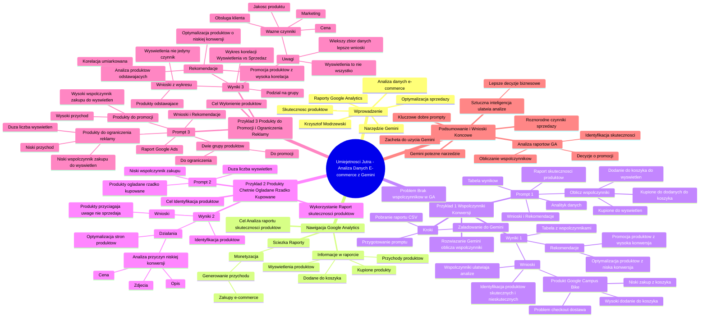

# Lekcje wideo - 5. Analiza danych GA4 z Gemini - e-commerce

# 💡 Diagram

___

# 🗒️ Notatka

# Notatki z prezentacji "Umiejętności Jutra" - Analiza danych e-commerce z wykorzystaniem Gemini

## Wprowadzenie

Prezentacja omawia wykorzystanie narzędzia **Gemini** do analizy danych e-commerce, w szczególności raportów skuteczności produktów z **Google Analytics**. Krzysztof Modrzewski demonstruje, jak **Gemini** może usprawnić proces analizy danych i dostarczyć cennych wniosków 💡 dotyczących optymalizacji sprzedaży internetowej.

## Nawigacja w Google Analytics

* **Cel:** Analiza raportu skuteczności produktów w **Google Analytics**.
* **Ścieżka w Google Analytics:**
    * Zakładka "Raporty" 📊
    * Sekcja "Monetyzacja" 💰
    * Raporty -> "Generowanie przychodu" -> "Zakupy e-commerce" 🛒
* Raport ten zawiera informacje o:
    * Wyświetleniach produktów 👀
    * Produktach dodanych do koszyka 🛍️
    * Kupionych produktach ✅
    * Przychodach z produktów 💸

## Przykład 1: Obliczanie współczynników konwersji

* **Problem:** Raport w **Google Analytics** nie prezentuje bezpośrednio współczynników konwersji (np. stosunku dodania do koszyka do wyświetleń, stosunku zakupu do dodania do koszyka).
* **Rozwiązanie:** Wykorzystanie **Gemini** do obliczenia tych współczynników na podstawie danych z raportu.
* **Kroki:**
    1. Pobranie raportu "Skuteczności produktów" z **Google Analytics** jako pliku CSV.
    2. Załadowanie pliku CSV do **Gemini**.
    3. Przygotowanie **promptu** dla **Gemini**.

### Prompt dla Gemini (Przykład 1)

> Jesteś analitykiem danych 🧑‍💻, a ja przekazuję Ci raport skuteczności produktów. Raport zawiera: nazwę produktu, wyświetlone produkty, produkty dodane do koszyka, kupione produkty. Twoje zadanie:
>
> Oblicz następujące współczynniki dla każdego produktu:
> * Stosunek dodania do koszyka do wyświetlonych produktów (w procentach).
> * Stosunek kupionych produktów do dodanych do koszyka (w procentach).
> * Stosunek kupionych produktów do wyświetlonych produktów (w procentach).
>
> Przedstaw wyniki w nowej tabeli, która zawiera:
> * Nazwę produktu
> * Wyświetlone produkty
> * Produkty dodane do koszyka
> * Kupione produkty
> * Obliczone współczynniki (w formacie procentowym).
>
> Zadbaj o czytelność danych i dokładność obliczeń. Na końcu zaproponuj wnioski i rekomendacje, które produkty warto promować, a które mogą wymagać optymalizacji.

### Wyniki i wnioski (Przykład 1)

* **Gemini** przetwarza dane i oblicza żądane współczynniki konwersji.
* **Wynik:** Nowa tabela z dodatkowymi kolumnami, prezentująca obliczone współczynniki w procentach.
* **Wnioski:**
    * Współczynniki konwersji ułatwiają analizę skuteczności produktów.
    * Możliwość szybkiej identyfikacji produktów z wysokim i niskim współczynnikiem dodania do koszyka oraz zakupu.
    * Przykład: Produkt "`Google Campus Bike`" - wysoki współczynnik dodania do koszyka (82%), ale niski współczynnik zakupu z koszyka (15%) - potencjalny problem z procesem checkout lub kosztami dostawy. 🚚
* **Rekomendacje Gemini:**
    * Produkty z wysoką konwersją (naklejki, długopisy) - rekomendacja promocji. 🔥
    * Produkty o niskiej konwersji - wymagają optymalizacji. 🛠️

## Przykład 2: Identyfikacja produktów chętnie oglądanych, ale rzadko kupowanych

* **Cel:** Znalezienie produktów, które generują dużą liczbę wyświetleń, ale charakteryzują się niskim współczynnikiem zakupu.
* **Wykorzystanie:** Ponownie raport "Skuteczności produktów".
* **Prompt dla Gemini (Przykład 2):** (Prompt w transkrypcie jest powtórzony, ale zadanie jest inne, więc należy skupić się na opisie zadania)

> Zidentyfikuj produkty chętnie oglądane, ale rzadko kupowane. Są to produkty z dużą liczbą wyświetleń i niskim współczynnikiem zakupów do wyświetleń.

### Wyniki i wnioski (Przykład 2)

* **Gemini** analizuje dane w celu identyfikacji produktów z dużą liczbą wyświetleń i niską konwersją.
* **Wnioski:** Identyfikacja produktów, które przyciągają uwagę 👀, ale nie przekładają się na sprzedaż 📉.
* **Działania:** Optymalizacja stron produktów, analiza przyczyn niskiej konwersji (cena 🏷️, opis 📝, zdjęcia 🖼️, etc.).

## Przykład 3: Identyfikacja produktów do promocji i ograniczenia reklamy

* **Cel:** Wyłonienie produktów, które warto intensywniej promować oraz tych, których promocję warto ograniczyć, biorąc pod uwagę przychód i współczynnik konwersji.
* **Dodatkowe informacje w prompcie:** Raport dotyczy danych z **Google Ads**.
* **Prompt dla Gemini (Przykład 3):**

> Jesteś analitykiem danych 🧑‍💻, a ja przekazuję Ci raport skuteczności produktów dotyczący ruchu z **Google Ads**. Twoje zadanie:
>
> **Identyfikacja produktów do intensywniejszej reklamy:**
> * Zidentyfikuj produkty, które charakteryzują się **wysokim współczynnikiem zakupów do wyświetleń** i **generują wysoki przychód**.
> * Te produkty są dobrze dopasowane do działań reklamowych i warto je promować intensywniej. 🔥
>
> **Identyfikacja produktów do ograniczenia reklamy:**
> * Zidentyfikuj produkty, które mają **dużą liczbę wyświetleń**, ale **niski współczynnik zakupów do wyświetleń** oraz **niski przychód**.
> * Te produkty generują niskie wyniki w relacji do ekspozycji i warto ograniczyć ich promocję. 🚫
>
> Przedstaw wyniki w dwóch grupach:
> * Produkty, które warto bardziej promować.
> * Produkty, które warto ograniczyć.
>
> Wnioski i rekomendacje: Sformułuj wnioski dla każdej grupy i zaproponuj działania optymalizacyjne dla produktów z każdej kategorii.

### Wyniki i wnioski (Przykład 3)

* **Gemini** analizuje dane i dzieli produkty na dwie grupy: do promocji i do ograniczenia reklamy.
* **Dodatkowo:** **Gemini** generuje wykres korelacji 📈 między wyświetleniami a sprzedażą.
* **Wnioski z wykresu korelacji:**
    * Istnieje dodatnia, ale umiarkowana korelacja między wyświetleniami a sprzedażą.
    * Wyświetlenia nie są jedynym czynnikiem wpływającym na sprzedaż.
    * Niektóre produkty odstają od linii trendu - wysoka sprzedaż przy małej liczbie wyświetleń (wysoka konwersja) lub niska sprzedaż przy dużej liczbie wyświetleń (niska konwersja).
* **Rekomendacje Gemini:**
    * Produkty z wysoką korelacją - rekomendacja kontynuacji promocji. ✅
    * Produkty odstające od linii trendu - dalsza analiza przyczyn sukcesu/porażki. 🤔
    * Produkty o wysokiej konwersji - zbadać i zastosować wnioski do innych produktów. 💡
    * Produkty o niskiej konwersji - zidentyfikować problemy i wdrożyć działania naprawcze. 🛠️
* **Ogólne uwagi:**
    * Wyświetlenia to tylko jeden z czynników wpływających na sprzedaż.
    * Ważne są również: cena, jakość produktu, obsługa klienta 🧑‍💼, marketing. 📢
    * Im większy zbiór danych w analizie, tym precyzyjniejsze wnioski. 🎯

## Podsumowanie i wnioski końcowe

* **Gemini** to potężne narzędzie do analizy danych e-commerce, które może znacząco usprawnić i przyspieszyć proces analizy. 🚀
* **Dobrze przygotowane prompty** są kluczowe dla uzyskania wartościowych wyników z **Gemini**. 🔑
* Analiza raportów skuteczności produktów z **Google Analytics** za pomocą **Gemini** umożliwia:
    * Obliczanie współczynników konwersji.
    * Identyfikację produktów o zróżnicowanej skuteczności.
    * Podejmowanie świadomych decyzji dotyczących promocji i optymalizacji oferty. ✅
* Istotne jest uwzględnienie różnorodnych czynników wpływających na sprzedaż, nie tylko wyświetleń. ☝️
* Zachęcamy do wykorzystania **Gemini** i podobnych promptów w analizie danych e-commerce. 👍
* Materiały dodatkowe zawierają przykłady promptów. 📚

Prezentacja demonstruje, jak **sztuczna inteligencja** 🤖 może być wykorzystana do **ułatwienia i przyspieszenia analizy danych**, wspierając podejmowanie lepszych decyzji biznesowych w e-commerce. 💼

___

# 🔉 Transcript
File: Lekcje wideo - 5. Analiza danych GA4 z Gemini - e-commerce.mp4 
[00:00:00] Ekran: Białe tło z czarną pionową kreską po lewej stronie.
[00:00:01] Ekran: Napis "Umiejętności" w górnym rzędzie i "Jutra" w dolnym rzędzie.
[00:00:02] Ekran: Napis "Umiejętności Jutra" z logiem "AI" po prawej stronie.
[00:00:03] Ekran: Napis "Umiejętności AI Jutra" z logiem "Google" i "SGH" w dolnym rzędzie.
[00:00:05] Krzysztof Modrzewski: Przeanalizowaliśmy już raport stron w naszym serwisie, raport źródłowy ruchu, to teraz przejdźmy do raportów e-commerceowych, w tym przypadku raport skuteczności naszych produktów.
[00:00:15] Ekran: Dashboard Google Analytics.
[00:00:15] Krzysztof Modrzewski: W tym celu przejdźmy do w naszym koncie Google Analytics, przejdźmy sobie w zakładce raporty do sekcji monetyzacja.
[00:00:24] Krzysztof Modrzewski: Tutaj rozwinę raporty.
[00:00:26] Krzysztof Modrzewski: Konkretnie generowanie przychodu, zakupy e-commerce.
[00:00:29] Krzysztof Modrzewski: I w tej zakładce znajdę informacje właśnie o skuteczności naszych produktów.
[00:00:35] Krzysztof Modrzewski: Czyli ile było wyświetleń, produktów dodanych do koszyka, ile było kupionych i jakie są przychody z produktów.
[00:00:40] Krzysztof Modrzewski: I taki raport jak pobierzemy do naszego spreadsheeta, a później pobierzemy jako plik CSV, możemy go załadować do Gemini i poprosić go o różne zadania.
[00:00:52] Krzysztof Modrzewski: Pierwszym zadaniem, które chcę, żeby Gemini dla mnie wykonał, to jest rozbudowanie tego raportu o informacje, które z mojej perspektywy są niezbędne do analizy skuteczności produktów czy kategorii lub marek w naszym sklepie internetowym, a mianowicie o obliczenie współczynników pomiędzy wyświetlonymi produktami a produktami dodanymi do koszyka i kupionymi produktami.
[00:01:13] Krzysztof Modrzewski: Współczynników, które na przykład w poprzednim Analyticsie, czyli Universal Analyticsie były dostępne tutaj w raporcie i pewnie w Google Analytics 4 też kiedyś tu się pojawią.
[00:01:23] Krzysztof Modrzewski: Obecnie na swoim koncie ich nie mam, więc chciałbym, żeby Gemini przygotował mi taką analizę i pokazał mi jak jest jakie jest właśnie współczynnik te współczynniki dla poszczególnych produktów.
[00:01:35] Krzysztof Modrzewski: Po pobraniu więc takiego raportu, przechodzę sobie do Gemini, dodaję plik, raport skuteczności produktów i przygotowany oczywiście wkreślę odpowiednią prompt, prompt, który uwaga, znowu nie jest taki krótki.
[00:01:50] Krzysztof Modrzewski: Mam nadzieję, że już łapiesz o co chodzi z tym schemacie przygotowania promptów, z których tutaj korzystam, dzięki czemu Gemini daje mi odpowiednie wyniki.
[00:01:58] Krzysztof Modrzewski: Znowu na początek pewien kontekst i informacje o tym, co znajduje się w raporcie czy w pliku, który przekazuję.
[00:02:05] Krzysztof Modrzewski: Czyli jesteś analitykiem danych, przekazuję ci raport skuteczności produktów i co ten raport zawiera, jakie jest twoje zadanie.
[00:02:13] Krzysztof Modrzewski: Oblicz następujące współczynniki dla każdego produktu: dodanie do koszyka w stosunku do wyświetlonych produktów w procentach, kupionych produktów w stosunku do dodanych do koszyka, kupionych produktów w stosunku do wyświetlonych produktów.
[00:02:25] Krzysztof Modrzewski: Przedstaw wyniki w nowej tabeli, która zawiera nazwę produktu, wyświetlone produkty, produkty dodane do koszyka, kupione produkty i wymienione współczynniki w formacie procentowym.
[00:02:37] Krzysztof Modrzewski: Zadbaj o to, aby dane były czytelne, a obliczenia dokładne, bo chcę, żeby na tym się skupił.
[00:02:42] Krzysztof Modrzewski: Na końcu zaproponuj wyniki i rekomendacje, które produkty warto promować, a które mogą wymagać optymalizacji.
[00:02:48] Krzysztof Modrzewski: Zobaczymy jak Gemini sobie z tym zadaniem poradzi.
[00:02:52] Krzysztof Modrzewski: Analiza zakończona.
[00:02:54] Krzysztof Modrzewski: Gemini zauważył, że kolumna przychody z produktu zawiera dane tekstowe, które nie będą potrzebne do dalszej analizy, więc się nie korzysta.
[00:03:01] Krzysztof Modrzewski: W kolejnym kroku informuje mnie, co tutaj dokładnie wylicza i przedstawia mi wyniki.
[00:03:06] Krzysztof Modrzewski: Co mam tutaj w wynikach?
[00:03:07] Krzysztof Modrzewski: Mam nazwę moich produktów.
[00:03:10] Krzysztof Modrzewski: Widzę ile było wyświetleń.
[00:03:12] Krzysztof Modrzewski: Ile było produktów danego koszyka, ile kupionych, jaki jest procent dodania do koszyka, procent kupionych do dodania do koszyka i procent kupionych do wyświetlonych produktów.
[00:03:23] Krzysztof Modrzewski: Czyli dużo łatwiej mi teraz wykonać analizę skuteczności moich produktów, ponieważ nie opieram się już na takich liczbach mało czytelnych, no bo co to znaczy 8851 do 7200, jaki jest stosunek, tak?
[00:03:38] Krzysztof Modrzewski: Jakby czasami na pierwszy rzut oka patrząc na liczby, ciężko jest to określić, a tutaj mając te procenty bardzo łatwo mogę stwierdzić, jaki jest procent dodania do koszyka.
[00:03:49] Krzysztof Modrzewski: Tutaj na przykład widzę, że jest bardzo duży, tak, bo w tym produkcie akurat Google Campus Bike 82% z wyświetlonych produktów akurat dodane do koszyka, czyli prawie każdy, kto wchodził na na ten produkt dodawał go do koszyka.
[00:04:02] Krzysztof Modrzewski: Później, ale tylko 15% z tych, którzy go dodali do koszyka, następnie go kupili, więc w związku z tym być może powinienem popracować nad tym checkoutem.
[00:04:13] Krzysztof Modrzewski: Dlaczego osoby dodają go do koszyka, a później nie kupują?
[00:04:16] Krzysztof Modrzewski: Być może jest za droga dostawa, no bo to jest jakiś rower, więc może ktoś dodaje do koszyka, żeby sprawdzić właśnie jakie będą koszty dostawy do miejsca, w którym przebywa.
[00:04:25] Krzysztof Modrzewski: I tak dalej i tak dalej.
[00:04:26] Krzysztof Modrzewski: Właśnie mając te współczynniki dużo łatwiej dokonać mi wielu ciekawych analiz.
[00:04:30] Krzysztof Modrzewski: A zobaczmy jakie rekomendacje tutaj pokazał mi Gemini.
[00:04:34] Krzysztof Modrzewski: Produkty takie jak naklejki, długopisy i Google długopis, tak, Yellow Pen charakteryzuje się bardzo wysoką konwersją, warto je promować.
[00:04:42] Krzysztof Modrzewski: Produkty wymagające optymalizacji, tak?
[00:04:47] Krzysztof Modrzewski: O niskiej konwersji i jakieś jeszcze dodatkowo ogólne uwagi.
[00:04:50] Krzysztof Modrzewski: Dla mnie najważniejszy był ten raport współczynników i tutaj Gemini sobie z tym dobrze poradził.
[00:04:55] Krzysztof Modrzewski: Zawsze warto też wziąć pod uwagę dodatkowe rekomendacje, jeżeli akurat uznamy je za optymalne.
[00:05:01] Krzysztof Modrzewski: To był taki pierwszy przykład.
[00:05:03] Krzysztof Modrzewski: Przejdźmy w takim razie do kolejnych analiz, bo trochę ich pod kątem e-commerce przygotowałem.
[00:05:09] Krzysztof Modrzewski: Korzystając z tych samych danych na temat skuteczności produktów, chciałbym teraz przeanalizować, znaleźć produkty, które są chętnie oglądane, ale rzadko kupowane.
[00:05:18] Krzysztof Modrzewski: Niech Gemini mi w tym pomoże.
[00:05:20] Krzysztof Modrzewski: Dodaję więc odpowiedni raport i przygotowany prompt.
[00:05:26] Krzysztof Modrzewski: Który budowę ma bardzo podobną, ale inne zadanie, zidentyfikuj produkty chętnie oglądane, ale rzadko kupowane.
[00:05:30] Krzysztof Modrzewski: I są to produkty z dużą liczbą wyświetleń.
[00:05:33] Krzysztof Modrzewski: Mam nadzieję, że już łapiesz o co chodzi z tym schemacie przygotowania promptów, z których tutaj korzystam, dzięki czemu Gemini daje mi odpowiednie wyniki.
[00:05:37] Krzysztof Modrzewski: Znowu na początek pewien kontekst i informacje o tym, co znajduje się w raporcie, czy w pliku, który przekazuję.
[00:06:05] Krzysztof Modrzewski: Czyli jesteś analitykiem danych, przekazuję ci raport skuteczności produktów i co ten raport zawiera i jakie jest twoje zadanie.
[00:06:13] Krzysztof Modrzewski: Oblicz następujące współczynniki dla każdego produktu: dodanie do koszyka w stosunku do wyświetlonych produktów w procentach, kupionych produktów w stosunku do dodanych do koszyka, kupionych produktów w stosunku do wyświetlonych produktów.
[00:06:25] Krzysztof Modrzewski: Przedstaw wyniki w nowej tabeli, która zawiera nazwę produktu, wyświetlone produkty, produkty dodane do koszyka, kupione produkty i wymienione współczynniki po tej formacie procentowym.
[00:06:37] Krzysztof Modrzewski: Zadbaj o to, aby dane były czytelne, a obliczenia dokładne.
[00:06:40] Krzysztof Modrzewski: Bo chcę, żeby na tym się skupił.
[00:06:42] Krzysztof Modrzewski: Na końcu zaproponuj wyniki i rekomendacje, które produkty warto promować, a które mogą wymagać optymalizacji.
[00:06:48] Krzysztof Modrzewski: Zobaczymy jak Gemini sobie z tym zadaniem poradzi.
[00:06:52] Krzysztof Modrzewski: Analiza zakończona.
[00:06:54] Krzysztof Modrzewski: Gemini zauważył, że kolumna przychody z produktu zawiera dane tekstowe, które nie będą potrzebne do dalszej analizy, więc się nie korzysta.
[00:07:01] Krzysztof Modrzewski: W kolejnym kroku informuje mnie, co tutaj dokładnie wylicza i przedstawia mi wyniki.
[00:07:06] Krzysztof Modrzewski: Co mam tutaj w wynikach?
[00:07:07] Krzysztof Modrzewski: Mam nazwę moich produktów.
[00:07:10] Krzysztof Modrzewski: Widzę ile było wyświetleń.
[00:07:12] Krzysztof Modrzewski: Ile było produktów danego koszyka, ile kupionych, jaki jest procent dodania do koszyka.
[00:07:31] Krzysztof Modrzewski: Czyli dużo łatwiej mi teraz wykonać analizę skuteczności moich produktów, ponieważ nie opieram się już na takich liczbach mało czytelnych, no bo co to znaczy 8851 do 7200, jaki jest stosunek, tak?
[00:07:38] Krzysztof Modrzewski: Jakby czasami na pierwszy rzut oka patrząc na liczby, ciężko jest to określić, a tutaj mając te procenty bardzo łatwo mogę stwierdzić, jaki jest procent dodania do koszyka.
[00:08:00] Krzysztof Modrzewski: I to był taki pierwszy przykład.
[00:08:03] Krzysztof Modrzewski: Przejdźmy w takim razie do kolejnych analiz, bo trochę ich pod kątem e-commerce przygotowałem.
[00:08:09] Krzysztof Modrzewski: Korzystając z tych samych danych na temat skuteczności produktów, chciałbym teraz przeanalizować, znaleźć produkty, które są chętnie oglądane, ale rzadko kupowane.
[00:08:18] Krzysztof Modrzewski: Niech Gemini mi w tym pomoże.
[00:08:20] Krzysztof Modrzewski: Dodaję więc odpowiedni raport, raport skuteczności produktów i przygotowany prompt, który ma bardzo podobny kontekst, ale inne zadanie, zidentyfikowanie tego raportu.
[00:08:46] Krzysztof Modrzewski: Znowu w dzięki sztucznej inteligencji ułatwiam sobie pracę, przyspieszam sobie zadanie, w związku i nie muszę sam zastanawiać się nad krokami, które powinienem podjąć.
[00:08:57] Krzysztof Modrzewski: Oczywiście decyzja należy do mnie, co wykonam, ale dostaję podpowiedź, z której mogę skorzystać.
[00:09:05] Krzysztof Modrzewski: Przejdźmy do innej analizy, trochę odwrotnej, bardzo podobnej, ale spójrzmy na nasze produkty pod drugim kątem.
[00:09:13] Krzysztof Modrzewski: Znowu będę korzystał z tych samych danych, czyli jeden dobrze przygotowany raport wystarcza mi do wielu różnych analiz.
[00:09:19] Krzysztof Modrzewski: Tym razem chciałbym zidentyfikować produkty, które są chętnie kupowane, czyli mają wysoki współczynnik zakupów do wyświetleń czy do dodań do koszyka, ale też dużo na nich zarabiam, dzięki czemu powinienem je mocniej promować w moich działaniach marketingowych, bo mam z nich duży przychód, mogę więcej wydać na ich reklamę, a ze względu na to, że jest wysoka sprzedawalność tych produktów, wysoki współczynnik konwersji, no to jest szansa, że więcej użytkowników nawet droższych od razu kupi ten produkt, a że dużo na nim zarabiam, to to się będzie ogólnie opłacało.
[00:09:30] Krzysztof Modrzewski: Zróbmy taką analizę z Gemini.
[00:09:37] Krzysztof Modrzewski: Klikam plusik, dodaję plik, dodaję oczywiście przygotowany raport skuteczności moich produktów i wklejam przygotowany prompt.
[00:10:03] Krzysztof Modrzewski: Co tutaj mam w prompcie?
[00:10:05] Krzysztof Modrzewski: Początek bardzo podobny, tym razem tylko dodaję informację, że jest to raport skuteczności produktów dotyczący ruchu z Google Ads.
[00:10:14] Krzysztof Modrzewski: I jakie jest zadanie?
[00:10:15] Krzysztof Modrzewski: Identyfikacja produktów do intensywniejszej reklamy, zidentyfikuj produkty, które mają wysoki współczynnik zakupów do wyświetleń i generują wysoki przychód.
[00:10:25] Krzysztof Modrzewski: Te produkty są dobrze dopasowane do działań reklamowych i warto je promować bardziej intensywnie.
[00:10:30] Krzysztof Modrzewski: Identyfikacja produktów do ograniczenia reklamy, zidentyfikuj produkty, które mają dużą liczbę wyświetleń, ale niski współczynnik zakupów do wyświetleń oraz niski przychód.
[00:10:38] Krzysztof Modrzewski: Te produkty generują niskie wyniki w relacji do ekspozycji i warto ograniczyć ich promocję.
[00:10:43] Krzysztof Modrzewski: Przedstaw to w dwóch grupach produkty, które warto bardziej promować i produkty, które warto ograniczyć.
[00:10:48] Krzysztof Modrzewski: Wnioski i rekomendacje, podaj wnioski dla każdej grupy i zaproponuj działania optymalizacyjne dla produktów z każdej kategorii.
[00:10:57] Krzysztof Modrzewski: Zobaczmy jak sobie z tym Gemini poradzi.
[00:11:00] Krzysztof Modrzewski: Analiza zakończona.
[00:11:03] Krzysztof Modrzewski: Co ciekawe, tym razem dostaliśmy informacje o tym, co zrobił Gemini po angielsku, ale że jest to po prostu podsumowanie to co udało się zrobić, mi to nie przeszkadza.
[00:11:21] Krzysztof Modrzewski: Ważne jest to, że dostałem na końcu odpowiedni wykres, korelacji między wyświetleniami a sprzedażą.
[00:11:27] Krzysztof Modrzewski: No i co tutaj widzę?
[00:11:29] Krzysztof Modrzewski: Widzę, że ta korelacja chyba nie jest zbyt duża dla poszczególnych produktów.
[00:11:33] Krzysztof Modrzewski: Oczywiście najeżdżając na konkretną kropkę, mogę sobie zobaczyć właśnie jaka jest korelacja tych dwóch wskaźników dla każdego mojego produktu.
[00:11:41] Krzysztof Modrzewski: A dodatkowo mam tutaj pewne wnioski.
[00:11:43] Krzysztof Modrzewski: Istnieje dodatnia korelacja między liczbą wyświetleń a liczbą sprzedanych produktów, co oznacza, że im więcej wyświetleń ma produkt, tym więcej jest sprzedawanych.
[00:11:50] Krzysztof Modrzewski: Siła korelacji jest umiarkowana, co sugeruje, że wyświetlenia nie są jedynym czynnikiem wpływającym na sprzedaż.
[00:11:57] Krzysztof Modrzewski: Istnieją produkty, które mocno odstają od linii trendu.
[00:12:00] Krzysztof Modrzewski: Niektóre produkty mają wysoką sprzedaż pomimo małej liczby wyświetleń, co może wskazywać na wysoką konwersję lub skuteczne kampanie marketingowe.
[00:12:06] Krzysztof Modrzewski: Inne produkty mają niską sprzedaż pomimo dużej liczby wyświetleń.
[00:12:10] Krzysztof Modrzewski: No i dostaję też pewne rekomendacje.
[00:12:14] Krzysztof Modrzewski: Produkty z wysoką korelacją powinny być nadal promowane w celu zwiększenia sprzedaży.
[00:12:19] Krzysztof Modrzewski: Produkty, które odstają od linii trendu, powinny zostać poddane dalszej analizie w celu zidentyfikowania przyczyn ich sukcesu lub porażki.
[00:12:26] Krzysztof Modrzewski: W przypadku produktów o wysokiej konwersji należy zbadać i zastosować te wnioski do innych produktów.
[00:12:31] Krzysztof Modrzewski: W przypadku produktów o niskiej konwersji należy zidentyfikować problemy i wdrożyć działania naprawcze.
[00:12:34] Krzysztof Modrzewski: Należy pamiętać, że wyświetlenia są tylko jednym z wielu czynników wpływających na sprzedaż.
[00:12:40] Krzysztof Modrzewski: Skuteczna strategia e-commerce powinna uwzględniać również inne ważne aspekty, takie jak cena, jakość produktu, obsługa klienta i marketing.
[00:12:45] Krzysztof Modrzewski: Pamiętaj, że im więcej danych zostanie uwzględnionych w analizie, tym bardziej precyzyjne będą wnioski i rekomendacje.
[00:12:50] Krzysztof Modrzewski: Warto rozważyć dodatkowe analizy danych lub sporządzić raport w innym formacie.
[00:12:57] Krzysztof Modrzewski: I tak przeszliśmy przez różne przykłady wykorzystania Gemini w analizie naszych produktów w sklepie internetowym.
[00:13:03] Krzysztof Modrzewski: Mam nadzieję, że było to dla ciebie inspirujące i że sam sama chętnie takie podobne analizy wykonasz.
[00:13:08] Krzysztof Modrzewski: Zachęcam cię do skorzystania z podobnych lub nawet tych samych promptów, z których ja korzystałem.
[00:13:14] Krzysztof Modrzewski: Oczywiście wszystko masz dostępne w materiałach dodatkowych, ale to nie ostatni przykład, który przygotowałem, jeśli chodzi o analizę danych z Google Analyticsa.
[00:13:21] Krzysztof Modrzewski: Przejdźmy jeszcze do jednej ostatniej rzeczy.

___
# 🏷️ Tags
#Gemini #e-commerce #analiza_danych #Google_Analytics #raport_skuteczności_produktów #Krzysztof_Modrzewski #optymalizacja_sprzedaży #nawigacja #raporty #monetyzacja #generowanie_przychodu #zakupy_e-commerce #wyświetlenia_produktów #produkty_dodane_do_koszyka #kupione_produkty #przychody_z_produktów #współczynniki_konwersji #plik_CSV #prompt #analityk_danych #stosunek_dodania_do_koszyka #stosunek_zakupu_do_dodania_do_koszyka #stosunek_zakupu_do_wyświetleń #czytelność_danych #dokładność_obliczeń #wnioski #rekomendacje #promocja_produktów #optymalizacja_produktów #Google_Campus_Bike #proces_checkout #koszty_dostawy #naklejki #długopisy #wysoka_konwersja #niska_konwersja #chętnie_oglądane_produkty #rzadko_kupowane_produkty #duża_liczba_wyświetleń #niski_współczynnik_zakupu #optymalizacja_stron_produktów #cena #opis #zdjęcia #identyfikacja_produktów #ograniczenie_reklamy #Google_Ads #wysoki_współczynnik_zakupów #wysoki_przychód #intensywniejsza_reklama #duża_liczba_wyświetleń #niski_współczynnik_zakupów #wykres_korelacji #korelacja_wyświetleń_sprzedaży #dodatnia_korelacja #umiarkowana_korelacja #linia_trendu #cena_produktu #jakość_produktu #obsługa_klienta #marketing #zbiór_danych #decyzje_biznesowe #sztuczna_inteligencja #ułatwienie_analizy_danych #przyspieszenie_analizy_danych #Universal_Analytics #skuteczność_produktów #checkout #ruch_z_Google_Ads
