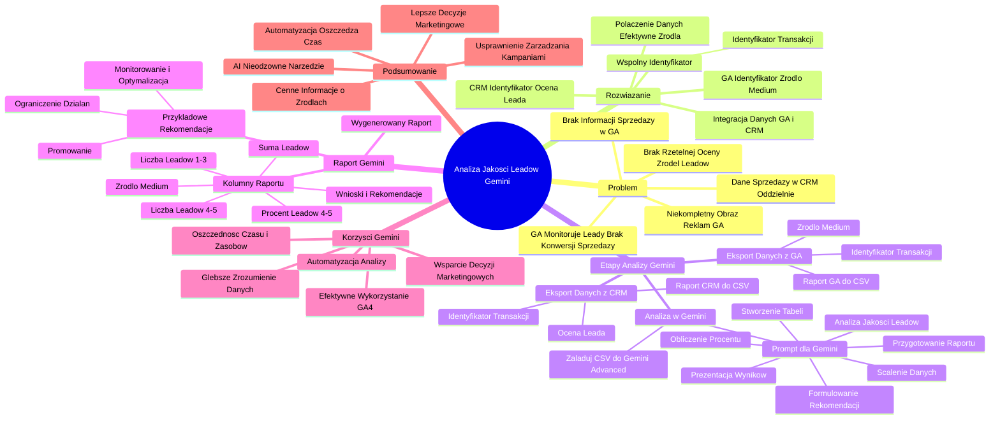

# Lekcje wideo - 6. Analiza danych GA4 z Gemini - leady

# 💡 Diagram

___

# 🗒️ Notatka

# Notatki i Podsumowanie: Analiza Jakości Leadów z Wykorzystaniem Gemini

## Wprowadzenie
Ten materiał demonstruje, jak efektywnie wykorzystać narzędzie Gemini do analizy jakości leadów pozyskanych ze strony internetowej. Proces ten łączy dane z Google Analytics i CRM, umożliwiając dogłębne zrozumienie skuteczności działań marketingowych. Kluczowym celem jest powiązanie informacji o źródłach pozyskania leadów z ich rzeczywistą jakością, ocenianą przez dział sprzedaży.

## Problem: Niekompletny Obraz Skuteczności Reklam w Google Analytics
- Google Analytics monitoruje generowanie leadów, na przykład poprzez rejestrację wysłanych formularzy, ale nie śledzi ich dalszej konwersji w sprzedaż, która jest rejestrowana w systemie CRM.
- W Google Analytics widzimy źródło pozyskania leada, lecz brakuje informacji, czy ten lead przekształcił się w sprzedaż.
- Dane dotyczące sprzedaży są przechowywane w CRM, oddzielnie od danych o źródłach leadów z Google Analytics.
- **Kluczowy problem: Brak możliwości rzetelnej oceny, które źródła leadów generują wartościowych klientów.**

## Rozwiązanie: Integracja Danych z Google Analytics i CRM
- **Podstawa rozwiązania:** Wykorzystanie wspólnego identyfikatora, takiego jak `Identyfikator transakcji` lub `Identyfikator leada`, aby skutecznie powiązać dane z Google Analytics i CRM.
- **Koncepcja działania:**
    - W Google Analytics, w momencie wysłania formularza, rejestrowany jest `Identyfikator transakcji`.
    - Do tego identyfikatora w Google Analytics przypisywane jest `Źródło / medium` sesji.
    - Dział sprzedaży w CRM uzupełnia ten sam `Identyfikator transakcji` o ocenę jakości leada (np. w skali 1-5) po nawiązaniu kontaktu z klientem.
- **Zamierzony efekt:** Połączenie danych o źródle leada z jego oceną jakości, co pozwala na identyfikację najbardziej efektywnych źródeł marketingowych generujących wartościowe leady.

## Etapy Analizy z Użyciem Gemini
1. **Eksport Danych z Google Analytics:**
    - Pobierz raport z Google Analytics zawierający następujące dane:
        - `Identyfikator transakcji`
        - `Źródło / medium`
    - Raport ten zazwyczaj znajduje się w zakładce "Generowanie przychodu" -> "Transakcje" (nazwa zakładki może się różnić w zależności od konfiguracji GA4).
    - Wyeksportuj dane do pliku CSV.

2. **Eksport Danych z CRM:**
    - Pobierz raport z CRM zawierający:
        - `Identyfikator transakcji`
        - `Ocena leada` (np. w skali 1-5)
    - Wyeksportuj dane do pliku CSV.

3. **Analiza Danych w Gemini:**
    - Załaduj oba wyeksportowane pliki CSV do Gemini Advanced.
    - **Instrukcja (Prompt) dla Gemini:**
        > Przekazuję Ci dane w dwóch arkuszach. Arkusz o nazwie `ocena` zawiera identyfikator transakcji oraz ocenę leadów w skali od 1 do 5. Arkusz `źródło` zawiera identyfikator transakcji i źródło medium ruchu. Twoje zadanie obejmuje:\n
        > 1. **Scalenie danych:** Połącz dane z obu arkuszy na podstawie wspólnego `Identyfikatora transakcji`.\n
        > 2. **Stworzenie kompletnej tabeli:** Utwórz tabelę zawierającą kolumny: `ID transakcji`, `Ocenę leadu`, `Źródło / medium`.\n
        > 3. **Analizę jakości leadów:** Zidentyfikuj, które `Źródła / medium` generują leady wysokiej jakości (oceny 4 i 5) oraz leady niższej jakości (oceny 1, 2, 3).\n
        > 4. **Przygotowanie podsumowania w raporcie:** Dla każdego `Źródła / medium` przedstaw:\n
        >     - Liczbę leadów z oceną 4 lub 5.\n
        >     - Liczbę leadów z oceną 1, 2 lub 3.\n
        > 5. **Obliczenie udziału procentowego:** Wylicz procentowy udział dobrych leadów (oceny 4 i 5) w całkowitej liczbie leadów dla każdego `Źródła / medium`.\n
        > 6. **Prezentację wyników w tabeli.**\n
        > 7. **Sformułowanie rekomendacji.**\n

4. **Raport Wygenerowany przez Gemini:**
    - Wygenerowana tabela powinna zawierać następujące kolumny:\n
        - `Źródło / medium`\n
        - `Liczba leadów 4-5`\n
        - `Liczba leadów 1-3`\n
        - `Suma` (wszystkich leadów)\n
        - `Procent leadów 4-5`\n
        - `Wnioski i rekomendacje`\n
    - Przykładowe rekomendacje:\n
        - **Promowanie:** Intensyfikuj działania dla źródeł generujących wysoki procent dobrych leadów.\n
        - **Monitorowanie i Optymalizacja:** Utrzymuj i optymalizuj źródła z umiarkowanym procentem dobrych leadów.\n
        - **Ograniczenie działań:** Zredukuj inwestycje w źródła generujące niski procent dobrych leadów.\n

## Korzyści z Wykorzystania Gemini
- **Automatyzacja procesu analizy:** Gemini umożliwia szybkie łączenie i analizowanie danych, co manualnie (np. w Excelu, Pythonie) byłoby czasochłonne i skomplikowane.
- **Oszczędność czasu i zasobów:** Eliminuje potrzebę tworzenia skomplikowanych makr, skryptów programistycznych czy dedykowanego programowania.
- **Dogłębne zrozumienie danych:** Umożliwia uzyskanie klarownego obrazu efektywności poszczególnych źródeł leadów.
- **Wsparcie w podejmowaniu decyzji marketingowych:** Raport wygenerowany przez Gemini dostarcza konkretnych rekomendacji dla działu marketingu, wspomagając optymalizację kampanii.
- **Efektywne wykorzystanie danych z Google Analytics 4:** Gemini pomaga w pełniejszym wykorzystaniu potencjału danych z GA4.

## Podsumowanie
Wykorzystanie Gemini do analizy jakości leadów znacząco usprawnia zarządzanie kampaniami marketingowymi. Poprzez integrację danych z Google Analytics i CRM, Gemini dostarcza cennych informacji o źródłach leadów generujących najbardziej wartościowych klientów. Automatyzacja analizy oszczędza czas i zasoby, a jasne rekomendacje ułatwiają podejmowanie lepszych decyzji marketingowych. Narzędzia AI, takie jak Gemini, stają się nieodzowne w skutecznym zrozumieniu i optymalizacji działań marketingowych opartych na danych.

___

# 🔉 Transcript
File: Lekcje wideo - 6. Analiza danych GA4 z Gemini - leady.mp4 
[00:00:05] Na koniec tego kursu chciałem przetestować jeszcze, jak Gemini poradzi sobie z dość trudnym zadaniem, jednak bardzo istotnym z punktu widzenia firm, które zbierają leady.
[00:00:16] Czyli informacje kontaktowe ze stron internetowych.
[00:00:21] Na stronie internetowej jest formularz, użytkownik zgłasza ten formularz, wysyła go i my dostajemy na końcu jako właśnie takiej witryny właśnie tak zwanego leada z informacją użytkowniku, ale później na przykład nasz dział call center albo nasz dział sprzedaży kontaktuje się już z takim użytkownikiem, w tym przypadku potencjalnym klientem niż poza internetem i dokonuje sprzedaży.
[00:00:46] Problem w tym jest taki, że w Google Analytics nie mamy przez to informacji o skuteczności naszych działań reklamowych, ponieważ widzimy oczywiście, że z danego na przykład źródła czy z danej kampanii był lead złożony, ale finalnie nie wiemy, czy on zakończył się sprzedażą czy nie, bo te dane są już w naszym CRM-ie gdzieś indziej.
[00:01:04] Jeżeli jednak mamy ten sam identyfikator w naszym koncie Google Analytics, na przykład identyfikator, nazwijmy to leada, tak?
[00:01:12] Taki identyfikator transakcji wysłania formularza i później nasz dział sprzedaży do tego identyfikatora dopisze na przykład ocenę od jednego do pięciu, jak skuteczna była rozmowa później z klientem i czy on dokonał zamówienia czy zakupu naszej oferty czy nie, to możemy te dane połączyć po to, żeby mieć lepszy obraz sytuacji i lepiej wiedzieć o tym gdzie powinniśmy nasze kampanie promować.
[00:01:40] Coś takiego możemy zrobić również z pomocą sztucznej inteligencji.
[00:01:44] Konkretnie potrzebuję jakby dwóch rzeczy.
[00:01:47] (Na ekranie widoczny arkusz kalkulacyjny. W kolumnie A znajduje się "Identyfikator transakcji", a w kolumnie B "Źródło / medium". Wiersze zawierają dane, np. "240733000033" i "direct / (none)". Na dole arkusza widoczny napis "Arkusz 554 554 501...")
[00:02:04] Potrzebuję raportu źródła leadów, czyli potrzebuję mój identyfikator transakcji albo identyfikator mojego leada, coś co pozwala mi zidentyfikować, że użytkownik wykonał kluczowe zdarzenie u mnie na stronie, jak jest wysłanie formularza i ten identyfikator musi być unikalny i do niego dopisuję sobie źródło medium i takie informacje mogę mieć w Google Analytics.
[00:02:05] (Na ekranie widoczny Google Analytics. Po lewej stronie znajduje się menu, a po prawej strona główna z różnymi wykresami i danymi statystycznymi. Na górze widoczny napis "Konwersje Analytics są teraz nazywane kluczowymi zdarzeniami". W menu po lewej stronie zaznaczona zakładka "Strona główna".)
[00:02:07] Na przykład, jeżeli bym wykorzystał właśnie identyfikator transakcji przy wysyłaniu formularza, to taką informację mógłbym nawet znaleźć w zakładce tutaj generowanie przychodu, transakcje, mam identyfikator transakcji i do mojego identyfikatora mogę dopisać wtedy tutaj na przykład właśnie sesja źródło medium i taki raport sobie pobrać.
[00:02:28] I następnie, jeżeli ten identyfikatory są przekazywane w formularzu do mojego działu sprzedaży, to mój dział sprzedaży może stworzyć raport oceny leadów, gdzie na przykład daję już konkretną wartość pieniężną, ile zarobiłem na danym lidzie, albo czy on się powiódł tak lub nie, lub na przykład tak jak w tym przypadku ocenę wartości wartości danego leada od jednego do pięciu.
[00:02:35] (Na ekranie ponownie widoczny arkusz kalkulacyjny. W kolumnie A znajduje się "Identyfikator transakcji", a w kolumnie B "Ocena". Wiersze zawierają dane, np. "240733000033" i "4". Na dole arkusza widoczny napis "Arkusz 99".)
[00:02:51] No i teraz jak mam te dwa raporty, ręcznie ta analiza mogłaby być problematyczna, trzeba dobrze, trzeba byłoby dobrze znać tutaj makra jeśli chodzi o Excela albo appskrypty albo w ogóle tutaj może w ogóle zastosować programowanie w Pythonie, żeby te dane sobie połączyć.
[00:03:09] W każdym razie dla większości osób byłoby to czasochłonne.
[00:03:13] Czy skomplikowane?
[00:03:14] Myślę, że też.
[00:03:15] Zobaczmy jak Gemini może sobie, może nam pomóc właśnie w takiej analizie.
[00:03:19] (Na ekranie widoczny Gemini Advanced. Na środku ekranu widoczny napis "Cześć, Krzysztof". Na dole ekranu widoczny napis "Zapytaj Gemini".)
[00:03:20] W tym przypadku mam przygotowane te dwa raporty oddzielnie w dwóch różnych arkuszach, pobrałem je do pliku CSV i mogę tutaj te dwa pliki dodać po to, żeby mieć właśnie ocenę skuteczności i od źródła medium moich leadów i następnie dać odpowiednią instrukcję, która znowu wcale nie jest taka krótka.
[00:03:38] Najpierw jest pewien kontekst, otrzymujesz dane w dwóch arkuszach, arkusz ocena z oceną w nazwie zawiera identyfikator transakcji i ocenę leadów w skali od jednego do pięciu, arkusz z źródło w nazwie zawiera identyfikator transakcji oraz źródło medium ruchu i twoje zadanie.
[00:03:56] Łączenie danych, połącz oba arkusze na podstawie wspólnego identyfikatora transakcji, utwórz kompletną tabelę zawierającą ID transakcji, ocenę leadu oraz źródło medium, analiza jakości leadów.
[00:04:07] Sprawdź, które źródła medium generują najlepsze leady, czyli oceny 4 i 5 i gorsze leady oceny 1 2 3.
[00:04:14] Podsumowanie w raporcie dla każdego źródła medium podaj liczbę leadów o ocenie 4 lub 5, lub 1 2 lub 3.
[00:04:20] Oblicz procentowy udział dobrych leadów oceny 4 i 5 w stosunku do wszystkich leadów dla danego źródła medium.
[00:04:24] Przedstaw wyniki w tabeli.
[00:04:26] Podaj mi rekomendacje.
[00:04:28] No to jest myślę, że wyzwanie dla naszego systemu.
[00:04:32] Zobaczmy jak sobie z tym poradzi.
[00:04:34] (Na ekranie widoczny raport z analizy jakości leadów. W tabeli znajdują się kolumny: Źródło / medium, Liczba leadów 4-5, Liczba leadów 1-3, Suma, Procent leadów 4-5, Wnioski i rekomendacje. Wiersze zawierają dane, np. "poczta.wp.pl / referral" i "100%". Poniżej tabeli widoczne wnioski i rekomendacje.)
[00:04:34] Analiza zakończona.
[00:04:36] Podsumowanie dostałem tutaj, co wykonał po angielsku, ale już sam raport po polsku, więc tutaj nie mam, nie ma problemu.
[00:04:43] Raport z analizy jakości leadów.
[00:04:44] Mam po kolei różne źródła, które są, ilość leadów w ocenie 4 i 5, ilość leadów w ocenie 1 3, sumę wszystkich leadów, procent leadów w ocenie tej lepszej i wnioski i rekomendacje.
[00:04:57] Promować albo monitorować i optymalizować albo wręcz ograniczyć działania.
[00:05:03] Gotowa tabela.
[00:05:04] Wysyłam taką tabelę do działu marketingu i wiemy jakie działania marketingowe należy podjąć albo którym źródłom się przyjrzeć bliżej, jeżeli chodzi o skuteczność naszych leadów.
[00:05:15] Stworzenie takiej tabeli ręcznie byłoby na pewno czasochłonne i znowu myślę, że skomplikowane.
[00:05:22] Dodatkowo dostałem jeszcze wnioski, dostałem jeszcze rekomendacje, ale samą tabelą i połączeniem danych jestem już usatysfakcjonowany i zadowolony z tej z tego co tutaj otrzymałem i to do tego również właśnie możemy Gemini wykorzystać do lepszego zrozumienia naszych danych Google Analytics 4.
[00:05:44] (Na ekranie widoczne logo "Umiejętności Jutra AI".)

___
# 🏷️ Tags
#lead_generation #google_analytics #crm #gemini #analiza_danych #jakość_leadów #identyfikator_transakcji #źródło_medium #dane_marketingowe #skuteczność_reklam #konwersja #sprzedaż #integracja_danych #raportowanie #automatyzacja_analizy #oszczędność_czasu #optymalizacja_kampanii #decyzje_marketingowe #sztuczna_inteligencja #ai #google_analytics_4 #ga4 #formularz_kontaktowy #dział_sprzedaży #ocena_leada #wartość_leada #rekomendacje #excel #python #makra #appskrypty #arkusz_kalkulacyjny #plik_csv #promowanie #monitorowanie #ograniczenie_działań #analiza_efektywności #kampanie_marketingowe #zarządzanie_kampaniami #klienci #potencjalni_klienci #dane_google_analytics #wspólny_identyfikator #identyfikator_leada #generowanie_przychodu #transakcje #sesja_źródło_medium #raport_źródeł_leadów #ocena_skuteczności #wnioski #umiejętności_jutra_ai
