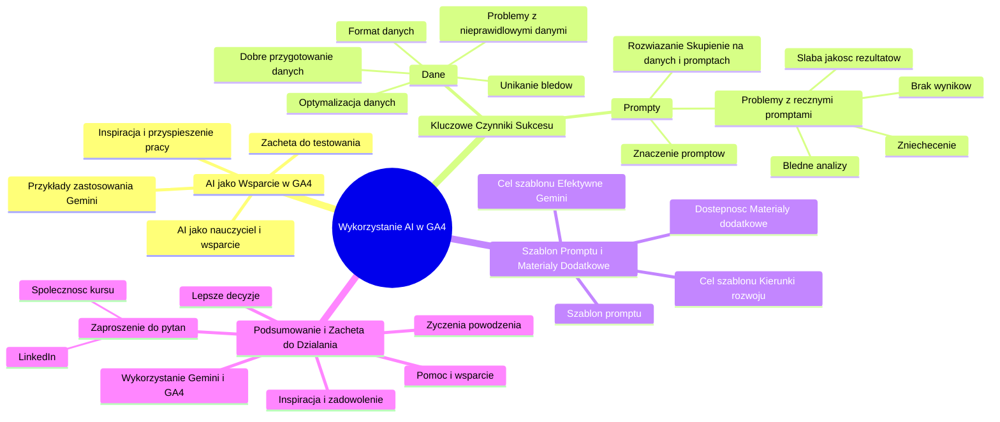

# Lekcje wideo - 7. Podsumowanie

# 💡 Diagram

___

# 🗒️ Notatka

# Notatki i Podsumowanie Kursu "Wykorzystanie AI w Google Analytics 4"

## Wprowadzenie

Niniejszy dokument zawiera notatki i podsumowanie kursu "Wykorzystanie AI w Google Analytics 4" poświęconego analizie danych za pomocą sztucznej inteligencji (AI) w Google Analytics 4 (GA4). Kurs wyjaśnia, w jaki sposób AI, a konkretnie model `Gemini`, może wspomóc użytkowników GA4 w zrozumieniu danych, usprawnieniu pracy i identyfikacji nowych możliwości działania. Podkreślono kluczową rolę odpowiedniego przygotowania danych i tworzenia efektywnych `promptów`, co jest niezbędne do pełnego wykorzystania potencjału AI w analizie danych analitycznych.

## Główne Punkty Kursu

### 1. AI jako Wsparcie w Google Analytics 4 🤖

- **AI jako nauczyciel i wsparcie:** Sztuczna inteligencja może pomagać w nawigacji po interfejsie GA4, znajdowaniu danych i ich interpretacji.
- **Przykłady zastosowania:** Kurs demonstruje praktyczne przykłady wykorzystania AI (`Gemini`) do analizy danych wyeksportowanych z Google Analytics 4.
- **Inspiracja i przyspieszenie pracy:** Celem kursu jest zainspirowanie użytkowników do korzystania z AI, pokazując, jak może ona przyspieszyć analizę i wskazać nowe, interesujące kierunki działań.
- **Zachęta do testowania:** Kurs zachęca do przetestowania opisanych metod na własnych danych GA4.

### 2. Kluczowe Czynniki Sukcesu: Dane i Prompty 🔑

- **Znaczenie dobrego przygotowania danych:**
    - **Format danych:** Właściwy format pliku z danymi jest kluczowy dla poprawnego działania AI.
    - **Unikanie błędów:** Dane powinny być wolne od błędów i dobrze sformatowane.
    - **Optymalizacja danych:** Im lepiej przygotowane dane, tym lepsze wyniki analizy.
    - **Problemy z nieprawidłowymi danymi:** Nieprawidłowo sformatowane dane, zawierające błędy, mogą utrudniać pracę AI, prowadząc do błędnych analiz lub ich braku.

- **Znaczenie Promptów:**
    - **Podstawa skutecznej analizy:** Dobrze napisany `prompt` jest fundamentem uzyskania wartościowych wyników z AI.
    - **Problemy z 'ręcznymi' promptami:** `Prompty` pisane 'z głowy', bez kontekstu i jasnego określenia zadania, mogą prowadzić do:
        - Braku wyników.
        - Błędnych analiz.
        - Słabej jakości rezultatów.
    - **Potencjalne zniechęcenie:** Początkowe trudności z AI w analityce, wynikające z nieodpowiedniego podejścia do danych i `promptów`, mogą zniechęcać.
    - **Rozwiązanie: Skupienie na danych i promptach:** Poprawa jakości danych i `promptów` znacząco podnosi jakość analiz.

### 3. Szablon Promptu i Materiały Dodatkowe 📄

- **Szablon promptu:** Kurs oferuje szablon/schemat tworzenia efektywnych `promptów`.
    - **Dostępność:** Szablon jest dostępny w materiałach dodatkowych do kursu.
    - **Cel szablonu:** Ułatwienie efektywnego wykorzystania `Gemini` do analizy danych GA4 i identyfikacji kierunków rozwoju.

### 4. Podsumowanie i Zachęta do Dalszego Działania 👍

- **Inspiracja i zadowolenie:** Wyrażenie nadziei, że kurs był inspirujący i spotkał się z pozytywnym odbiorem uczestników.
- **Zaproszenie do pytań:** Zachęta do zadawania pytań w społeczności kursu lub bezpośrednio przez LinkedIn.
- **Pomoc i wsparcie:** Oferta pomocy i wsparcia w dalszym wykorzystaniu AI w analizie danych GA4.
- **Wykorzystanie Gemini i GA4:** Zachęta do wykorzystania `Gemini` w analizie danych GA4 w celu podejmowania lepszych decyzji.
- **Życzenia powodzenia:** Życzenia powodzenia w dalszej pracy z AI i danymi.

## Podsumowanie Kursu

Kurs "Wykorzystanie AI w Google Analytics 4" prezentuje praktyczne zastosowanie sztucznej inteligencji, w szczególności modelu `Gemini`, w analizie danych z Google Analytics 4. Podkreśla, że AI stanowi cenne narzędzie wspierające analityków w szybszym i efektywniejszym zrozumieniu danych oraz identyfikacji kluczowych wniosków. Kluczowym przesłaniem kursu jest zwrócenie uwagi na dwa fundamentalne aspekty skutecznej analizy z wykorzystaniem AI: **jakość przygotowanych danych** i **umiejętność formułowania odpowiednich promptów**. Kurs przestrzega przed zniechęceniem na początku, wynikającym z potencjalnych trudności w uzyskaniu satysfakcjonujących wyników, i podkreśla, że skupienie się na doskonaleniu tych dwóch elementów – danych i `promptów` – jest kluczem do sukcesu i pełnego wykorzystania potencjału AI w analityce internetowej. Udostępniony szablon `promptu` ma na celu ułatwienie uczestnikom kursu praktycznego zastosowania wiedzy i osiągnięcia lepszych rezultatów w analizie danych GA4 za pomocą `Gemini`. Kurs kończy się zachętą do testowania, zadawania pytań i dalszego rozwoju umiejętności w obszarze AI i analityki.

___

# 🔉 Transcript
File: Lekcje wideo - 7. Podsumowanie.mp4 
[00:00:05] No i tak doszliśmy do końca naszego kursu wykorzystania AI w Google Analytics 4, jeżeli chodzi o analizę naszych danych.
[00:00:11] Zaczęliśmy od tego, że AI może być naszym nauczycielem i wsparciem w korzystaniu z interfejsu i znajdywaniu odpowiednich danych, czy w rozumieniu tych danych i przeszliśmy później przez przykłady zastosowania analizy już pobranych danych z Google Analytics i załadowania je do Gemini i sprawdzenia jakie wyniki otrzymamy.
[00:00:30] Mam nadzieję, że było to dla ciebie inspirujące i pokazałem ci, że faktycznie warto w różnych przypadkach tutaj korzystać z pomocy sztucznej inteligencji, bo można nam to zdecydowanie przyspieszyć pracę, wskazać jakieś ciekawe kierunki działania, które, do których być może sami byśmy tak szybko nie doszli.
[00:00:47] Przetestuj to u siebie.
[00:00:49] Zwrócę tylko na koniec jedną uwagę.
[00:00:51] Bardzo ważne jest dobre pisanie promptów i dobre przygotowanie tego pliku z danymi.
[00:00:56] Dlaczego?
[00:00:57] Ponieważ już wielokrotnie zdarzyło mi się, że jeżeli wrzucałem pliki w złym formacie albo z błędami, albo źle sformatowane, to system po prostu sobie z tym nie radził.
[00:01:07] Albo sam musiał bardzo mocno pracować nad optymalizacją tego pliku, co nie zawsze mu dobrze wychodziło.
[00:01:14] Więc im lepiej te dane przygotujemy, tym lepszy wynik później otrzymamy.
[00:01:18] A jeśli chodzi o prompty, to jest podstawa.
[00:01:20] Wszystko sprowadza się na końcu do odpowiedniego promptu.
[00:01:23] Jeżeli pisałem prompty z palca, ręcznie, tak z głowy, tak po prostu, bez żadnego schematu, typu a tak na rzuć mi to i to i to, nie podając mu kontekstu, nie pisząc jakie, co znajduje się w pliku, jakie są twoje zadanie, czego oczekuje i tak dalej i tak dalej, to potrafiłem albo w ogóle nie otrzymać wyników, otrzymać błędne analizy, otrzymać słabej jakości rezultaty.
[00:01:46] I powiem ci szczerze, że wielokrotnie na początku przy korzystaniu AI w analityce byłem zniechęcony.
[00:01:57] Zniechęcony i już wielokrotnie uważałem, że w ogóle AI mi nie pomoże w analizie.
[00:02:02] To jest bez sensu, to nie ma nic ciekawego.
[00:02:04] Jakby ta analiza stała się bez sensu.
[00:02:06] Dlaczego?
[00:02:07] Bo źle przygotowałem dane, źle pisałem prompty.
[00:02:09] Jak się na tym skupiłem, jak zacząłem dbać o te dwie rzeczy, voila, mogłeś, mogłaś zobaczyć przykłady tych analiz właśnie podczas tego kursu.
[00:02:19] Uważam, że to było inspirujące i szczerze zapisałem, mam zapisany taki schemat, szablon tworzenia takiego promptu, który również tutaj w materiałach dodatkowych udostępniam, który dzięki któremu faktycznie w tym przypadku Gemini pomaga mi w lepszym zrozumieniu moich danych Google Analytics 4 i znajdywaniu tych ciekawych kierunków rozwoju.
[00:02:39] Jeszcze raz.
[00:02:40] Mam nadzieję, że to było dla ciebie inspirujące, że ci się podobało.
[00:02:42] Jeżeli masz jakieś pytania, to śmiało, możesz pytać w naszej społeczności, możesz też pisać konkretnie do mnie, na przykład na LinkedInie.
[00:02:48] Chętnie ci pomogę.
[00:02:49] Dawaj znać, a tymczasem życzę ci powodzenia i cóż, korzystaj z Gemini w z twoimi danymi z Google Analytics 4 i podejmuj lepsze decyzje na podstawie twoich danych.
[00:03:02] Powodzenia.
[00:03:03] Trzymam za ciebie kciuki, a tymczasem do zobaczenia.
[00:03:06] Dzięki.
[00:03:07] Cześć.
[00:03:08] (Na ekranie wyświetla się logo Umiejętności Jutra AI, organizator Google, partner edukacyjny SGH.)

___
# 🏷️ Tags
#AI #Google_Analytics_4 #GA4 #Gemini #analiza_danych #sztuczna_inteligencja #prompt #prompty #przygotowanie_danych #format_danych #błędy_w_danych #optymalizacja_danych #szablon_promptu #efektywna_analiza #wsparcie_AI #inspiracja #przyspieszenie_pracy #testowanie #dane_analityczne #interfejs_GA4 #rozumienie_danych #LinkedIn #społeczność_kursu #decyzje_biznesowe #kierunki_rozwoju #Umiejętności_Jutra_AI #SGH #kurs_AI #analityka_internetowa #efektywność #wartościowe_wyniki #kontekst_promptu #zadanie_promptu #oczekiwania_promptu #rezultaty_analizy #jakość_danych #wykorzystanie_AI #praktyczne_zastosowanie #kluczowe_wnioski #doskonalenie_danych #doskonalenie_promptów #sukces_w_analityce #wiedza_praktyczna #dalszy_rozwój #wsparcie #pomoc
