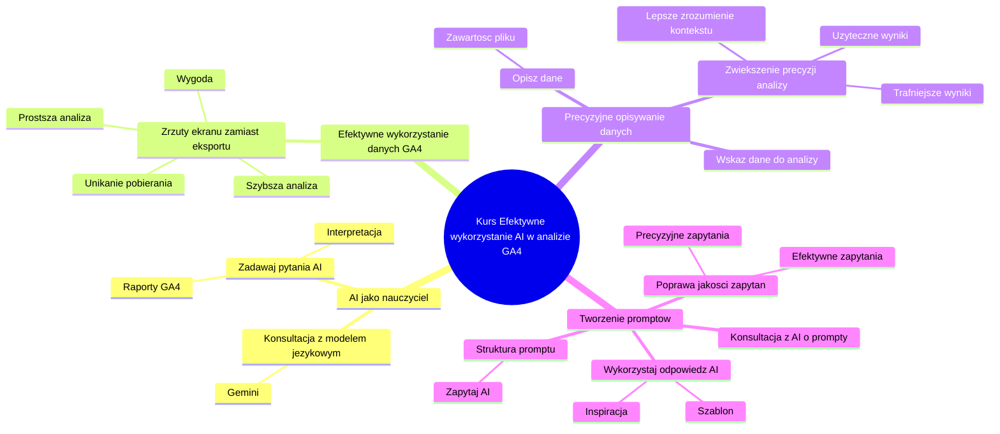

# podsumowanie

# 💡 Diagram

___

# 🗒️ Notatka

# Podsumowanie kursu: Notatki i streszczenie

Ten dokument zawiera szczegółowe notatki i kompleksowe streszczenie kluczowych informacji z kursu, opracowane na podstawie transkryptu. Jego celem jest przedstawienie jasnego i zorganizowanego podsumowania, które ułatwi zrozumienie najważniejszych koncepcji i praktycznych wskazówek.

## Wprowadzenie

Poniższe notatki i streszczenie kursu zostały przygotowane, aby ułatwić Ci zrozumienie i zapamiętanie kluczowych informacji przedstawionych w poszczególnych lekcjach. Zebrane punkty pomogą w praktycznym zastosowaniu zdobytej wiedzy w Twoich projektach.

## Kluczowe tematy i wskazówki z kursu

### AI jako Twój nauczyciel 🧑‍🏫

- **Wykorzystaj AI do nauki:** Jeśli masz trudności ze zrozumieniem raportów z `Google Analytics 4`, **skonsultuj się z dużym modelem językowym**, takim jak `Gemini`.
- **Zadawaj pytania AI:** Nie wahaj się zadawać pytań dotyczących aspektów raportów `GA4`, które są dla Ciebie niejasne. AI może skutecznie pomóc w ich interpretacji.

### Efektywne wykorzystanie danych z Google Analytics 4

- **Zrzuty ekranu zamiast pobierania danych:** **Nie musisz eksportować danych do analizy przez AI.** Często wystarczające jest wykonanie zrzutu ekranu raportu i dodanie go do promptu.
- **Szybkość i wygoda:** Zrzuty ekranu umożliwiają **szybszą i prostszą analizę danych** bez konieczności czasochłonnego pobierania i przygotowywania plików. ⏱️

### Precyzyjne opisywanie danych dla AI

- **Opisz przesyłane dane:** Kiedy przesyłasz plik z danymi do analizy, **zawsze staraj się dokładnie opisać, co zawiera plik.**
- **Wskazuj, które dane mają być analizowane:** Jasno określ, **jakie konkretne dane model AI ma wykorzystać** do analizy i realizacji Twojego zapytania (promptu).
- **Zwiększenie precyzji analizy:** Dokładny opis danych **pomaga AI lepiej zrozumieć kontekst** i dostarczyć bardziej trafne i użyteczne wyniki analizy. ✅

### Tworzenie skutecznych promptów 📝

- **Konsultacja z AI w sprawie promptów:** Jeśli nie jesteś pewien, jak poprawnie sformułować prompt, **skorzystaj z pomocy AI.**
- **Zapytaj AI o strukturę promptu:** Zadaj AI pytanie w stylu: \"Jak powinien być zbudowany prompt, którego zadaniem będzie...\".
- **Wykorzystaj odpowiedź AI:** **Wykorzystaj wskazówki otrzymane od AI** jako szablon lub inspirację do stworzenia własnego promptu w kolejnej interakcji.
- **Poprawa jakości zapytań:** Konsultowanie się z AI w kwestii promptów **pomaga w tworzeniu bardziej efektywnych i precyzyjnych zapytań.** 🚀

## Podsumowanie

Kurs kładzie nacisk na efektywne wykorzystanie sztucznej inteligencji (AI) jako narzędzia wspomagającego analizę danych z `Google Analytics 4`. Kluczowe aspekty obejmują wykorzystanie AI jako wsparcia w nauce, stosowanie zrzutów ekranu zamiast eksportowania danych, dokładne opisywanie danych przekazywanych do AI oraz konsultowanie się z AI w celu tworzenia skutecznych promptów. Pamiętanie o tych wskazówkach pozwoli na szybsze i bardziej efektywne wdrażanie zdobytej wiedzy w praktyce.

___

# 🔉 Transcript
File: podsumowanie.png 
**Podsumowanie kursu**

Poniżej znajdziesz kluczowe informacje i wskazówki z poszczególnych lekcji kursu. Zebraliśmy najważniejsze punkty, które pomogą Ci zrozumieć omawiane tematy oraz zastosować je w praktyce. Dzięki temu podsumowaniu łatwiej zapamiętasz główne zasady i szybciej wdrożysz zdobytą wiedzę w swoich projektach.

**AI twoim nauczycielem**

Pamiętaj, że jeżeli czegoś nie rozumiesz odnośnie raportów z Google Analytics 4 to zawsze możesz zadać o to pytanie do dużego modelu językowego (np. Gemini).

**Wykorzystanie zrzutów ekranu**

Nie musisz pobierać danych do raportu do analizy AI. Często wystarczy, że zrobisz zrzut ekranu i dodasz go do swojego promptu.

**Opisywanie danych**

Przesyłając plik z danymi staraj się opisać jakie dane zawiera i jakie dane model ma wykorzystać do analizy i realizacji twojego promptu.

**Tworzenie promptów**

Jeżeli nie wiesz jak napisać prompt skonsultuj się z AI i zapytaj jak powinien wyglądać prompt, którego zadaniem będzie.. i wykorzystaj otrzymaną odpowiedź w kolejnej konwersacji.

___
# 🏷️ Tags
#podsumowanie_kursu #notatki #streszczenie #AI #sztuczna_inteligencja #uczenie_się #Google_Analytics_4 #GA4 #raporty #duże_modele_językowe #Gemini #zrzuty_ekranu #analiza_danych #eksport_danych #prompt #prompt_engineering #tworzenie_promptów #efektywność #wskazówki #praktyka #wdrażanie_wiedzy #konwersacja #dane #opisywanie_danych
