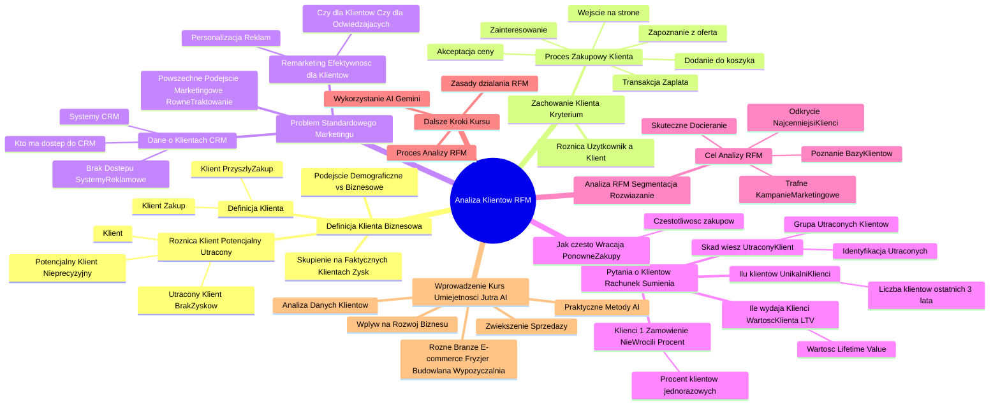

# Lekcje wideo - 1. Wstęp

# 💡 Diagram

___

# 🗒️ Notatka

# Analiza Klientów z Wykorzystaniem Metody RFM - Notatki i Podsumowanie 📝

## Wprowadzenie 🚀

Ten kurs "Umiejętności Jutra AI", organizowany przez Google we współpracy z SGH, wprowadza w **tajniki analizy danych klientów**. Kurs koncentruje się na danych, które realnie wpływają na rozwój biznesu, niezależnie od branży - od e-commerce 🛒, przez salony fryzjerskie 💇‍♀️, firmy budowlane 🏗️, aż po wypożyczalnie samochodów 🚗. Główny cel to nauczyć, jak lepiej zrozumieć klientów i wykorzystać tę wiedzę do zwiększenia sprzedaży 📈, stosując praktyczne metody z użyciem **sztucznej inteligencji (AI)** 🤖.

## Kim Jest Twój Klient? Definicja Biznesowa 🎯

### Podejście Demograficzne vs. Biznesowe 📊

Tradycyjne podejście do klienta często opiera się na danych demograficznych (wiek 👴, płeć 👩‍🦰, zainteresowania ⚽). Jednak z biznesowego punktu widzenia, kluczowe jest spojrzenie na klienta przez pryzmat jego interakcji z firmą.

### Definicja Klienta w Kontekście Biznesowym 💼

*   **Klient to osoba, która dokonała zakupu.** To podstawowe kryterium, które odróżnia klienta od potencjalnego użytkownika.
*   **Klient to osoba, która prawdopodobnie dokona zakupu w przyszłości.** Istnieje oczekiwanie na dalszą relację i transakcje.

### Różnica Między Klientem, Potencjalnym Klientem i Utraconym Klientem ⚠️

*   **Klient:** Osoba, która już dokonała zakupu i od której oczekuje się kolejnych transakcji.
*   **Potencjalny Klient:** Określenie często nadużywane i nieprecyzyjne. To osoba, na której firma jeszcze nie zarobiła, a przyszły zysk jest niepewny. Przykłady: osoba w określonym wieku, użytkownik strony, subskrybent newslettera 📧.
*   **Utracony Klient:** Osoba, od której nie oczekuje się już zysków w przyszłości.

### Skupienie na Faktycznych Klientach 🔍

Kurs zachęca do koncentracji na klientach, którzy już generują zysk i od których oczekuje się dalszych korzyści.

## Zachowanie Klienta - Kluczowe Kryterium 🔑

### Proces Zakupowy Klienta 🛍️

Klient to osoba, która przeszła przez cały proces zakupowy:

*   Wszedł na stronę internetową 🌐.
*   Zapoznał się z ofertą.
*   Wykazał zainteresowanie.
*   Zaakceptował cenę 🏷️.
*   Dodał produkt do koszyka 🛒.
*   **Dokonał transakcji (zapłacił) 💳.**

Taki klient obdarzył firmę zaufaniem i jest już z nią zaznajomiony.

### Różnica Między Użytkownikiem a Klientem 👤

Istnieje istotna różnica między zwykłym użytkownikiem strony (potencjalnym klientem) a faktycznym klientem, który sfinalizował zakup.

## Problem Standardowego Traktowania Klientów w Marketingu 📢

### Powszechne Podejście Marketingowe 📣

Często klienci są traktowani na równi z pozostałymi użytkownikami, szczególnie w działaniach marketingowych.

### Remarketing - Czy Jest Skuteczny dla Klientów? 🤔

**Remarketing** jest popularną strategią, ale pojawiają się pytania o jego efektywność w odniesieniu do klientów:

*   Czy **remarketing** jest kierowany do klientów, czy tylko do osób odwiedzających stronę?
*   Czy reklamy są spersonalizowane i dopasowane do klientów, czy są to ogólne komunikaty produktowe?

### Dane o Klientach w Systemach CRM 🗂️

*   Dane o klientach są gromadzone w systemach **CRM** (Customer Relationship Management).
*   Systemy reklamowe często nie mają dostępu do tych danych lub dane są niekompletne/zduplikowane.
*   **Kluczowe pytanie:** Kto w firmie ma dostęp do danych **CRM** i jak te dane są wykorzystywane?

## Pytania o Klientów - Rachunek Sumienia ❓

Kurs stawia serię pytań, które mają skłonić do refleksji nad wiedzą firmy o swoich klientach:

*   **Ilu właściwie masz klientów?** (Unikalnych osób, nie zamówień).
    *   Ile osób (np. Marek, Kasia) dokonało zakupów w ciągu ostatnich 3 lat?
*   **Ilu masz klientów, którzy złożyli tylko 1 zamówienie i już nie wrócili? Jaki to % całości?**
    *   Jaki procent klientów dokonał jednorazowego zakupu i nie powrócił?
*   **Ile wydają u Ciebie Twoi klienci?** 💰
    *   Jaka jest **wartość klienta (Lifetime Value - LTV)**?
*   **Jak często Twoi klienci do Ciebie wracają? Co ile robią ponowne zakupy?** 🕰️
    *   Jak często klienci wracają i dokonują kolejnych zakupów (np. raz na miesiąc)?
*   **Skąd wiesz, że klient już nie jest Twoim klientem?** 💔
    *   Jak zidentyfikować klientów, którzy już nie wrócą?
    *   Jak duża jest grupa utraconych klientów?

## Analiza RFM (Segmentacja RFM) - Rozwiązanie ✅

### Cel Analizy RFM 🎯

**Analiza RFM** (Recency, Frequency, Monetary Value) powstała, aby odpowiedzieć na powyższe pytania i pomóc:

*   **Odkryć, którzy klienci są najcenniejsi.** 💎
*   **Skuteczniej docierać do klientów.** 🎯
*   **Poznać bazę klientów.** 👥
*   **Prowadzić bardziej trafne kampanie marketingowe.** 🚀

### Dalsze Kroki w Kursie 👣

Kolejne lekcje kursu przedstawią:

*   Zasady działania metody **RFM**.
*   Proces przeprowadzenia analizy **RFM** krok po kroku.
*   Wykorzystanie **sztucznej inteligencji Gemini** do analizy **RFM**.

## Podsumowanie 📝

Kurs "Umiejętności Jutra AI" wprowadza w problematykę analizy danych klientów, akcentując biznesowe podejście do definicji klienta. Podkreśla różnice między klientem, potencjalnym klientem i klientem utraconym, zachęcając do skupienia się na faktycznych klientach generujących zysk. Kurs zwraca uwagę na problem standardowego podejścia do klientów w marketingu i podkreśla istotę wykorzystania danych **CRM**. Prezentuje koncepcję **analizy RFM** jako narzędzia do lepszego zrozumienia klientów, identyfikacji najcenniejszych grup i efektywniejszego targetowania marketingowego. Następne lekcje skupią się na praktycznym zastosowaniu metody **RFM** z wykorzystaniem **sztucznej inteligencji**.

___

# 🔉 Transcript
File: Lekcje wideo - 1. Wstęp.mp4 
OK, here is the transcription of the video in Polish, following the instructions:

[00:00:00] (Biały ekran)
[00:00:01] (Na ekranie pojawia się napis "Umiejętności Jutra AI". Poniżej napisy "Organizator: Google" oraz "Partner edukacyjny: SGH")
[00:00:05] Cześć.
[00:00:06] (Na ekranie pojawia się napis "Krzysztof Modrzewski, Head of education, Marketing Masters")
[00:00:06] Witaj w kursie, w którym wspólnie zgłębimy tajniki analizy danych.
[00:00:10] Ale nie będziemy analizować jakichkolwiek danych.
[00:00:13] Skupimy się na tych, które mają bezpośredni wpływ na rozwój twojego biznesu.
[00:00:18] Czyli danych twoich klientów.
[00:00:20] (Na ekranie pojawia się napis "Analiza klientów z wykorzystaniem metody RFM")
[00:00:20] Jeżeli słysząc klient pomyślałeś, pomyślałaś, że ten kurs dotyczy tylko sklepów internetowych, to mam teraz dla ciebie akurat dobrą wiadomość.
[00:00:29] To podejście działa dla każdego, kto ma klientów.
[00:00:33] Bez względu na to, czy prowadzisz salon fryzjerski, firmę budowlaną, wynajmujesz auta, czy może właśnie sprzedajesz produkty online.
[00:00:42] W tym kursie znajdziesz konkretne wskazówki, które pomogą ci lepiej zrozumieć swoich klientów i w związku z tym zwiększyć sprzedaż.
[00:00:50] Co ważne, nie skończymy tylko na teorii.
[00:00:53] Pokażę ci krok po kroku, jak zastosować te metody w praktyce, korzystając ze sztucznej inteligencji.
[00:00:59] Mam nadzieję, że jesteś gotowy, gotowa i będziesz z wielkim zainteresowaniem oglądać dalej.
[00:01:05] To co, zaczynamy?
[00:01:07] A zacznijmy od bardzo prostego, ale trochę podstępliwego pytania.
[00:01:11] Kim jest twój klient?
[00:01:13] Co to właściwie znaczy, że ktoś jest twoim klientem?
[00:01:16] Podejrzewam, że pierwsze co mogło ci przyjść do głowy, to różne cechy twoich klientów, takie jak na przykład wiek, płeć, zainteresowanie, ale może też jakie ma problemy, wyzwania i tym podobne.
[00:01:25] Ale zauważ, że część z tych danych to są głównie dane na przykład demograficzne i uwaga, to mnie zupełnie nie interesuje.
[00:01:32] Rozmawiając o klientach, musimy spojrzeć na to bardziej, powiedzmy, biznesowo.
[00:01:36] To, że kogoś nazywasz swoim klientem, implikuje dwie bardzo ważne informacje.
[00:01:40] Po pierwsze, że taki użytkownik zrobił już u ciebie zakupy, skorzystał z twojej oferty, czyli uwaga, został twoim klientem.
[00:01:48] I dwa, że jest duże prawdopodobieństwo, że zrobi zakupy w przyszłości, prawda?
[00:01:52] Jeżeli już nigdy nie miałby zamiaru zrobić u ciebie żadnych zakupów, to czy nazwałabyś, nazwałbyś go swoim klientem?
[00:01:59] Pewnie nie, raczej może byłym klientem, utraconym klientem, ale nie klientem.
[00:02:04] Często też słyszę takie określenie jak potencjalny klient, ale w moim przekonaniu jest ono nadużywane.
[00:02:09] No bo kto to właściwie jest ten potencjalny klient?
[00:02:12] Kobieta w wieku 30 plus mieszkająca w dużym mieście?
[00:02:15] Użytkownik, który był na twojej stronie i widział trzy produkty, ktoś zapisany na newsletter?
[00:02:19] Definicji moglibyśmy tu pewnie mnożyć i mnożyć, ale jedno jest pewne, jest to ktoś, na kim jeszcze nic nie zarobiliśmy.
[00:02:25] Okej, może zarobimy w przyszłości, ale nie mamy co do tego żadnej pewności.
[00:02:30] Z kolei ten utracony klient to ktoś, na kim raczej już nic nie zarobimy, skoro zakładamy, że ta osoba u nas nie zrobi zakupów, przynajmniej w najbliższej przyszłości.
[00:02:39] Skupmy się więc na klientach.
[00:02:42] Osobach, na których już zarobiliśmy i oczekujemy, że zarobimy jeszcze więcej.
[00:02:47] Co możemy powiedzieć o naszym kliencie?
[00:02:50] Znowu, nie mam na myśli cech demograficznych, ponieważ w obecnych czasach teoretycznie każdy może zostać naszym klientem i moglibyśmy takich różnych person tworzyć wiele dla naszego biznesu, ale skupmy się w tym przypadku na zachowaniu.
[00:03:04] Klient to taka osoba, która weszła na naszą stronę internetową, zobaczyła nasz produkt, zobaczyła naszą ofertę, zainteresowała się nią, zaakceptowała cenę, dodała produkt do koszyka i na końcu dokonała transakcji, czyli przekazała nam swoje pieniądze.
[00:03:18] Chyba możemy powiedzieć, że taki użytkownik to jest ktoś, kto przeszedł cały proces zakupowy, zaufał nam, już nas zna.
[00:03:27] Jest więc zdecydowana różnica pomiędzy zwykłym użytkownikiem, jakby ktoś powiedział może potencjalnym klientem, a faktycznym klientem.
[00:03:36] To teraz pytanie, dlaczego tych klientów zazwyczaj traktuje się dokładnie tak samo, zwłaszcza pod względem marketingowym, jak każdego innego użytkownika.
[00:03:45] Okej, dobra, dobra, już słyszę część podniesionych głosów.
[00:03:49] Przecież robimy remarketing.
[00:03:50] Okej, ale do kogo go robicie?
[00:03:53] Do tych, co byli na stronie, oglądali u was garnki, więc później przez miesiąc będziecie mi świecić reklamy garnków?
[00:03:59] Do klientów?
[00:04:01] Ale jak do klientów, to co im reklamujecie?
[00:04:04] Słuchajcie, dobrze wiem, jak to wygląda w praktyce, a może raczej powinienem powiedzieć nie wygląda.
[00:04:08] Przecież większość kampanii dzieje się teraz automatycznie.
[00:04:11] To system wybiera komu i gdzie jaką reklamę ma wyświetlić, więc skąd właśnie ten system ma mieć te informacje z waszej strony internetowej?
[00:04:20] Przecież w systemach reklamowych albo nie ma bardzo wielu danych, albo są one niepełne, albo na przykład zmultiplikowane, albo albo coś, albo coś, mógłbym tu jeszcze pewnie wymieniać.
[00:04:31] A dane o waszych klientach gdzie są?
[00:04:34] No w waszych systemach CRM, czyli w systemach Customer Relationship Management.
[00:04:39] W systemach do zarządzania relacji z klientami.
[00:04:41] I teraz pytanie, kto właściwie w waszej firmie, w twojej firmie ma dostęp do takich danych?
[00:04:47] Ktoś ma, prawda?
[00:04:48] No dobrze, to jak z tych danych korzystać?
[00:04:52] Co ty w ogóle wiesz o swoich klientach?
[00:04:55] Zadam ci teraz kilka pytań i spróbuj zrobić sobie taki rachunek sumienia, nawet odpowiedz na to po prostu w głowie.
[00:05:02] (Na ekranie pojawia się napis "Ilu właściwie masz klientów?")
[00:05:02] Ilu właściwie masz klientów?
[00:05:04] Nie ile było zamówień, ilu było użytkowników, ilu masz klientów.
[00:05:10] Ile takich Marków, Kaś, Ań, Karolów zrobiło u ciebie zakupy w ciągu ostatnich trzech lat?
[00:05:16] Konkretna liczba.
[00:05:17] Znasz tą liczbę?
[00:05:19] (Na ekranie pojawia się napis "Ile masz takich klientów, którzy zrobili tylko 1 zamówienie i już nigdy nie wrócili? Jaki to % całości?")
[00:05:20] Ile masz takich klientów, którzy zrobili, uwaga, tylko jedno zamówienie i już nigdy nie wrócili.
[00:05:25] Ile to jest procent całości?
[00:05:28] Jak wielu klientów już nigdy do ciebie nie wróciło?
[00:05:32] Czy wiesz to?
[00:05:33] (Na ekranie pojawia się napis "Ile wydają u Ciebie Twoi klienci?")
[00:05:33] Ile wydają u ciebie klienci?
[00:05:35] Jaka jest ich wartość, czyli jakie jest to ich dobrze już takie znane określenie Lifetime Value.
[00:05:41] Zdajesz sobie z tego sprawę?
[00:05:43] (Na ekranie pojawia się napis "Jak często Twoi klienci do Ciebie wracają? Co ile robią ponowne zakupy?")
[00:05:43] Jak często twoi klienci do ciebie wracają?
[00:05:47] Co ile robią ponowne zakupy?
[00:05:49] Raz na miesiąc, częściej, może rzadziej.
[00:05:52] Znowu, wiesz, znasz tą informację?
[00:05:55] (Na ekranie pojawia się napis "Skąd wiesz, że klient już nie jest Twoim klientem?")
[00:05:55] No i na koniec ostatnie pytanie, skąd wiesz, że klient już nie jest twoim klientem?
[00:06:01] Ilu tych klientów, którzy zrobili kiedyś u ciebie zakupy, już nigdy do ciebie nie wróci.
[00:06:06] Jak to określić i później w ogóle jak duża jest ta grupa?
[00:06:10] Aby znaleźć odpowiedzi na te i wiele innych pytań, powstała analiza RFM.
[00:06:16] Znana również pod inną nazwą segmentacja RFM.
[00:06:20] Jest to podejście, które pozwala odkryć, którzy klienci są dla ciebie najcenniejsi i jak skuteczniej do nich docierać.
[00:06:27] Jeżeli chcesz dowiedzieć się, co kryje się za tym pojęciem, chcesz lepiej poznać swoją bazę klientów i prowadzić bardziej trafione kampanie marketingowe, to zapraszam cię do kolejnych lekcji.
[00:06:37] Pokażę ci nie tylko jak działa ta metoda, ale też jak łatwo przeprowadzić taką analizę krok po kroku, wykorzystując sztuczną inteligencję Gemini.
[00:06:47] To co?
[00:06:48] Do zobaczenia.
[00:06:49] (Na ekranie pojawia się napis "Umiejętności Jutra AI". Poniżej napisy "Organizator: Google" oraz "Partner edukacyjny: SGH")
[00:06:51] (Biały ekran)

Hope this helps!

___
# 🏷️ Tags
#analiza_danych #dane_klientów #rozwój_biznesu #e-commerce #salony_fryzjerskie #firmy_budowlane #wypożyczalnie_samochodów #zwiększenie_sprzedaży #sztuczna_inteligencja #AI #podejście_demograficzne #podejście_biznesowe #definicja_klienta #potencjalny_klient #utracony_klient #proces_zakupowy #użytkownik_vs_klient #standardowe_traktowanie_klientów #marketing #remarketing #systemy_CRM #Customer_Relationship_Management #rachunek_sumienia #liczba_klientów #jednorazowe_zamówienie #wartość_klienta #Lifetime_Value #LTV #częstotliwość_zakupów #analiza_RFM #segmentacja_RFM #Recency #Frequency #Monetary_Value #cenni_klienci #kampanie_marketingowe #sztuczna_inteligencja_Gemini #targetowanie_marketingowe #umiejętności_Jutra_AI #Google #SGH #Krzysztof_Modrzewski #Marketing_Masters
