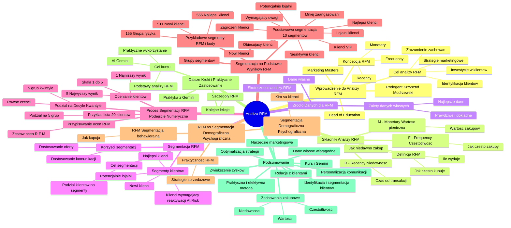

# Lekcje wideo - 2. Omówienie metody RFM

# 💡 Diagram

___

# 🗒️ Notatka

# Analiza RFM - Notatki i Podsumowanie 📝

## Wprowadzenie do Analizy RFM

* **Prelegent:** Krzysztof Modrzewski, Head of Education w Marketing Masters.
* **Temat:** Koncepcja analizy RFM (`Recency`, `Frequency`, `Monetary`).
* **Cel analizy RFM:**
    * Identyfikacja najcenniejszych klientów 💎.
    * Lepsze zrozumienie zachowań klientów 🤔.
    * Wprowadzenie zmian w strategiach i działaniach marketingowych 🎯.
    * Określenie, w których klientów warto inwestować 💰, których pielęgnować 🌱, a o których można „zapomnieć” ⛔.

## Składniki Analizy RFM

* **RFM** składa się z trzech kluczowych wskaźników, które odzwierciedlają zachowania klientów:
    * **R - Recency (Niedawność):**
        * Czas, który upłynął od ostatniej transakcji klienta ⏱️.
    * **F - Frequency (Częstotliwość):**
        * Jak często klienci dokonują zakupów 🛒.
    * **M - Monetary (Wartość pieniężna):**
        * Wartość zakupów dokonanych przez klienta 💸.

> **RFM** to metoda, która bada, jak **niedawno** klient dokonał zakupu, jak **często** kupuje i **ile** wydaje na zakupy.

## Źródło Danych dla RFM

* **Dane własne:** Analiza RFM opiera się na danych pochodzących z własnej bazy danych firmy 🗄️.
* **Zalety danych własnych:**
    * **Prawdziwe i dokładne:** Dane transakcyjne są rzetelne i nie są zakłócane przez pliki `cookie`, zgody marketingowe itp. ✅
    * **Najlepsze dostępne dane:**  Oferują dokładne informacje o transakcjach klientów 👍.
* **Skuteczność analizy RFM:** Dzięki wiarygodnym danym analiza RFM jest skuteczną i wartościową metodą dla biznesu 🚀.

## Segmentacja RFM

* **Cel segmentacji:** Podział klientów na segmenty, które różnią się poziomem zaangażowania i wartością dla firmy 📊.
* **Podział klientów na segmenty na podstawie analizy RFM:**
    * **Najlepsi klienci:** Regularnie kupują i wydają najwięcej 👑.
    * **Nowi klienci:** Osoby, które dopiero dokonały swojego pierwszego zakupu 👋.
    * **Klienci wymagający reaktywacji (At Risk):** Klienci, którzy byli kiedyś aktywni, ale od dłuższego czasu nie dokonują zakupów ⚠️.
    * **Potencjalnie lojalni klienci:** Często kupują, ale ich wydatki nie osiągnęły jeszcze najwyższego poziomu ⭐.
* **Korzyści z segmentacji RFM:** Umożliwia dostosowanie komunikacji i oferty do konkretnych grup klientów (np. rabaty dla klientów do reaktywacji, nagrody dla lojalnych) 🎁.

## Proces Segmentacji RFM - Podejście Numeryczne

* **Ocenianie klientów:** Każdy klient otrzymuje ocenę w skali **1 do 5** dla każdego wskaźnika RFM (`Recency`, `Frequency`, `Monetary`) 🔢.
    * **1:** Najniższy wynik (najmniej korzystny) 👎.
    * **5:** Najwyższy wynik (najbardziej korzystny) 👍.
* **Podział na Decyle lub Kwantyle:** Dane są dzielone na równe części (np. na 5 grup - kwintyle) ➗.
* **Przykład:** Lista 20 klientów dla wskaźnika `Recency`:
    * Dane uporządkowane od najstarszej do najnowszej transakcji 🗓️.
    * Podział na 5 grup, po 4 klientów każda.
    * Grupa 1 (najstarsze transakcje) - ocena 1.
    * Grupa 5 (najnowsze transakcje) - ocena 5.
* **Przypisywanie ocen:** Każdy klient otrzymuje zestaw trzech ocen (R, F, M), np. R5, F4, M3 📌.

## Segmentacja na Podstawie Wyników RFM

* **Grupy segmentów:** Klienci są grupowani w segmenty, które odzwierciedlają ich zachowania zakupowe 🛍️.
* **Przykładowe segmenty RFM i kody:**
    * **555 - Najlepsi klienci:** Kupują często, niedawno i wydają najwięcej 🏆.
    * **511 - Nowi klienci:** Niedawny duży zakup, ale brak regularności 🆕.
    * **155 - Grupa ryzyka:** Kiedyś wydawali dużo, ale dawno nie kupowali 🚩.
* **Podstawowa segmentacja RFM wyróżnia 10 segmentów (przykłady):**
    * Najlepsi klienci
    * Lojalni klienci
    * Potencjalnie lojalni
    * Nowi klienci
    * Obiecujący klienci
    * Klienci wymagający uwagi
    * Zagrożeni klienci
    * Nieaktywni klienci
    * Mniej zaangażowani
    * Klienci VIP 🌟

## RFM vs. Segmentacja Demograficzna/Psychograficzna

* **RFM - Segmentacja behawioralna:** Klasyfikacja klientów na podstawie **zachowań zakupowych** (jak kupują) 🛒.
* **Segmentacja demograficzna/psychograficzna:** Koncentruje się na tym, **kim są** klienci 👤.
* **Praktyczność RFM:** Bardziej praktyczne podejście w strategiach marketingowych ukierunkowanych na sprzedaż 👍.

## Dalsze Kroki i Praktyczne Zastosowanie

* **Kolejne lekcje:** Szczegółowe omówienie każdego obszaru RFM (`Recency`, `Frequency`, `Monetary`) 📚.
* **Praktyka z Gemini:** Wykorzystanie narzędzia Gemini do analizy RFM 🤖.
* **Cel kursu:** Zrozumienie podstaw analizy RFM i praktyczne wykorzystanie wiedzy bez skomplikowanych narzędzi analitycznych, z pomocą AI Gemini 💡.

## Podsumowanie

Analiza RFM to potężne narzędzie marketingowe 🚀, które umożliwia firmom identyfikację i segmentację klientów w oparciu o ich zachowania zakupowe – **niedawność, częstotliwość i wartość** ich transakcji. Dzięki temu podejściu firmy mogą skuteczniej personalizować komunikację marketingową, optymalizować strategie sprzedażowe i budować trwalsze relacje z klientami 🤝, co w efekcie przekłada się na zwiększenie zysków 📈. Analiza RFM bazuje na **własnych, wiarygodnych danych transakcyjnych**, co czyni ją bardzo praktyczną i efektywną metodą segmentacji w porównaniu do segmentacji demograficznej czy psychograficznej. Kurs zapowiada dalsze, szczegółowe zgłębianie tematu oraz praktyczne zastosowanie analizy RFM z wykorzystaniem sztucznej inteligencji Gemini.

___

# 🔉 Transcript
File: Lekcje wideo - 2. Omówienie metody RFM.mp4 
[00:00:05] Cześć.
[00:00:05] (Ekran: Krzysztof Modrzewski, Head of education, Marketing Masters)
[00:00:05] Chciałbym wprowadzić cię teraz w koncepcję analizy RFM, czyli metodę analizy pomagającej identyfikować najcenniejszych klientów, ale nie tylko, ponieważ ta metoda pozwala również na lepsze zrozumienie zachowań biznesowych naszych wszystkich klientów.
[00:00:20] Dzięki temu możemy zupełnie inaczej spojrzeć na nasz biznes, jak również zmienić strategię i działania marketingowe.
[00:00:27] RFM może nam pomóc określić, w których klientów warto inwestować, których należy pielęgnować, a którzy mają trochę takie mniejsze znaczenie dla wyników firmy i może lepiej byłoby o nich zapomnieć.
[00:00:42] (Ekran: Analiza RFM, Monetary, Recency, Frequency)
[00:00:42] RFM składa się z trzech elementów i każdy z nich odzwierciedla kluczowy aspekt zachowania naszych klientów.
[00:00:49] Na początku mamy R.
[00:00:51] Jest to skrót od Recency.
[00:00:52] Po polsku można by było to przetłumaczyć na niedawność, naprawdę, tak podają to słowniki, ale jakoś to do mnie nie przemawia, więc zostańmy może przy tym angielskim nazewnictwie.
[00:01:02] W każdym razie Recency pokazuje nam ile czasu minęło od ostatniej transakcji danego klienta.
[00:01:08] Jest to pierwszy wskaźnik.
[00:01:10] Drugi wskaźnik to F od Frequency.
[00:01:13] Tym razem już po polsku mamy lepsze określenie częstotliwość, ale dla porządku będę się trzymał angielskiego nazewnictwa.
[00:01:19] Frequency pokazuje jak często klienci robią u nas zakupy.
[00:01:24] A trzeci element tej układanki to M od Monetary.
[00:01:28] Dobra, już mogę sobie darować polskie tłumaczenie.
[00:01:31] Monetary pokazuje jaka jest wartość zakupów naszych klientów w kasie.
[00:01:37] (Ekran: RFM to metoda, która bada jak niedawno klient dokonał zakupu, jak często kupuje i ile wydaje na zakupy.)
[00:01:37] Innymi słowy RFM to metoda, która bada jak niedawno klient dokonał u nas zakupu, jak często kupuje i ile wydaje.
[00:01:45] Co ważne, RFM opiera się na danych, które już masz w swojej bazie.
[00:01:50] To znaczy dwie rzeczy.
[00:01:52] Po pierwsze, korzystasz ze swoich danych.
[00:01:55] Należą one do ciebie i znajdują się w twojej bazie danych.
[00:01:58] Po drugie, są to dane w 100% prawdziwe.
[00:02:02] Żadne ciasteczka, konsenty, skrypty nie psują nam tych informacji, ponieważ jeżeli użytkownik staje się naszym klientem, to musi mieć, to my musimy mieć dokładne informacje o całej transakcji.
[00:02:12] Są to więc jakby najlepsze dostępne dane.
[00:02:15] Dlatego analiza RFM jest tak skuteczna i tak ważna dla każdego biznesu.
[00:02:20] (Ekran: Przykładowe segmenty RFM, Najlepsi klienci, Nowi klienci, Klienci wymagający reaktywacji, Potencjalni lojalni klienci)
[00:02:20] Nie wiem czy zwróciłeś, zwróciłaś uwagę, że w poprzedniej lekcji wspomniałem o analizie RFM, ale również o segmentacji RFM.
[00:02:28] To czym jest analiza już wiesz, ale o co chodzi właściwie z tą segmentacją?
[00:02:34] Z jednej strony dzięki analizie RFM możemy znacznie więcej dowiedzieć się o zachowaniach zakupowych naszych klientów.
[00:02:40] Ale tak naprawdę jej głównym celem jest podział klientów na segmenty, uwaga, o różnych poziomach zaangażowania i wartości dla firmy.
[00:02:49] Na podstawie wyników analizy RFM możemy pogrupować klientów na różne segmenty.
[00:02:55] Na przykład najlepsi klienci, czyli tacy, którzy kupują regularnie i wydają najwięcej, nowi klienci, czyli osoby, które dopiero dokonały na przykład swojego pierwszego zakupu, klienci wymagający reaktywacji, po angielsku jak ładna nazwa at risk, czyli tacy, którzy kiedyś byli aktywni, ale od dłuższego czasu już nie zrobili u nas żadnych zakupów.
[00:03:14] Mamy też na przykład potencjalnych, potencjalnie lojalnych klientów, czyli to są osoby, które mają duży potencjał, które często kupują, ale jeszcze nie osiągnęły takiego najwyższego poziomu wydatków.
[00:03:26] No i właśnie dzięki segmentacji RFM możemy dostosować komunikację do tych różnych grup odbiorców, czy grup klientów i oferować na przykład rabaty klientom wymagającym reaktywacji lub nagradzać lojalnych klientów za ich zaangażowanie.
[00:03:41] A jak segmentuje się dane w analizie RFM?
[00:03:44] Bo uwaga, wcale to nie jest takie oczywiste.
[00:03:46] (Ekran: Segmentacja RFM, Każdy klient otrzymuje ocenę w skali od 1 do 5 dla każdej z trzech analizowanych cech. Przy czym 1 to najniższy wynik (najmniej korzystny), a 5 to wynik najwyższy, najbardziej korzystny.)
[00:03:46] Aby móc podzielić klientów na segmenty stosuje się podejście numeryczne.
[00:03:51] Każdy klient otrzymuje ocenę w skali od jednego do pięciu dla każdej z tych trzech analizowanych cech, czyli wspomnianych wcześniej Recency, Frequency i Monetary.
[00:04:01] Przy czym jeden to najniższy wynik, najmniej korzystny, a pięć to wynik najwyższy, najbardziej korzystny.
[00:04:07] I teraz uwaga.
[00:04:08] Proces ten przebiega poprzez podział na decyle lub kwantyle.
[00:04:11] To oznacza, że dane są dzielone na równe części, na przykład pięć grup dla każdej cechy.
[00:04:17] Spójrzmy na przykład, będzie to bardziej czytelne.
[00:04:19] (Ekran: Data, ID klienta, Kwantyl)
[00:04:19] Wyobraźmy sobie, że masz listę 20 klientów.
[00:04:20] Wartości dla Recency są uporządkowane od naj starszej transakcji do najnowszej.
[00:04:57] Jeżeli podzielisz ich na pięć równych grup, czyli każda po pięć osób, to w grupie pierwszej będą ci co zrobili transakcje najdawniej i dostaną wynik jeden, a w grupie piątej będą ci co zrobili transakcje niedawno i dostaną wynik pięć, czyli wynik najlepszy.
[00:05:13] To samo robisz dla Frequency i dla Monetary, a następnie każdemu klientowi przypisujesz trójkę wyników.
[00:05:20] Na przykład będzie to R5, F4 i M3.
[00:05:24] (Ekran: ID klienta, Recency, Frequency, Monetary)
[00:05:24] I teraz już przechodząc do samej segmentacji.
[00:05:27] Po przypisaniu tych wartości dla każdej cechy, klienci są grupowani na segmenty, które odzwierciedlają ich zachowania zakupowe.
[00:05:36] Tych segmentów może być bardzo dużo.
[00:05:40] Kilka już sobie wymieniliśmy, ale teraz spójrzmy jak to wygląda numerycznie.
[00:05:42] (Ekran: Przykładowe segmenty RFM, 555 Najlepsi klienci, 511 Nowi klienci, 155 Grupa ryzyka)
[00:05:42] 555 to najlepsi klienci, kupują często, niedawno i wydają najwięcej.
[00:05:48] 511 to nowi klienci, niedawno dokonali dużego zakupu, ale jeszcze nie stali się regularnymi klientami.
[00:05:54] A z kolei 155 to klienci w grupie ryzyka.
[05:57] Kiedyś wydawali dużo, ale już dawno nie dokonali żadnego zakupu.
[06:02] (Ekran: Podstawowa segmentacja RFM wyróżnia 10 segmentów: Najlepsi klienci, Lojalni klienci, Potencjalnie lojalni, Nowi klienci, Obiecujący klienci, Potrzebują uwagi, Zagrożeni klienci, Nieaktywni klienci, Mniej zaangażowani, Klient VIP)
[06:02] Zauważ, że w przeciwieństwie do segmentacji demograficznej lub psychograficznej, analiza RFM klasyfikuje klientów na podstawie zachowań zakupowych, koncentrując się na tym jak kupują, a nie kim są.
[06:14] Dzięki temu jest podejściem najbardziej praktycznym w strategiach marketingowych ukierunkowanych na sprzedaż.
[06:23] Okej.
[06:24] Wiemy już co to jest RFM i co teraz?
[06:27] W kolejnych lekcjach dokładnie omówimy każdy z tych trzech obszarów.
[06:31] Najpierw zajmiemy się teorią, a następnie przejdziemy do komputera, do praktyki, gdzie pokażę ci jak za pomocą Gemini przeprowadzić analizę RFM i jak wyciągać kluczowe wnioski, które pomogą ci zwiększyć zyski w twojej firmie.
[06:44] Nie martw się.
[06:46] Nie będziemy zagłębiać się we wszystkie jakieś techniczne aspekty tej metody, bo można by pewnie o tym mówić godzinami.
[06:53] W tym kursie skupimy się na podstawach, które pozwolą ci zrozumieć jak działa RFM i co najważniejsze, jak wykorzystać tę wiedzę w praktyce bez jakiś skomplikowanych narzędzi analitycznych, korzystając tak naprawdę prawie wyłącznie z pomocy sztucznej inteligencji Gemini.
[07:09] To co?
[07:10] Przejdźmy do praktyki.
[07:11] Zaczynajmy.
[07:12] (Ekran: Umiejętności Jutra AI, Organizator Google, Partner edukacyjny SGH)

___
# 🏷️ Tags
#analiza_RFM #RFM #recency #frequency #monetary #segmentacja_RFM #klienci #segmentacja_klientow #zachowania_zakupowe #dane_wlasne #baza_danych #strategia_marketingowa #dzialania_marketingowe #wartosc_klienta #lojalnosc_klienta #reaktywacja_klienta #segmenty_klientow #najlepsi_klienci #nowi_klienci #klienci_zagrozeni #potencjalnie_lojalni_klienci #ocena_klientow #skala_1_do_5 #decyle #kwantyle #segmentacja_numeryczna #segmentacja_behawioralna #segmentacja_demograficzna #segmentacja_psychograficzna #gemini #sztuczna_inteligencja #AI #marketing_masters #krzysztof_modrzewski #analiza_danych #transakcje #zakupy #wiedza_praktyczna #personalizacja_komunikacji #optymalizacja_sprzedazy #relacje_z_klientami #zwiekszenie_zyskow #wiarygodne_dane #narzedzia_analityczne #kurs_RFM #at_risk #klienci_vip
