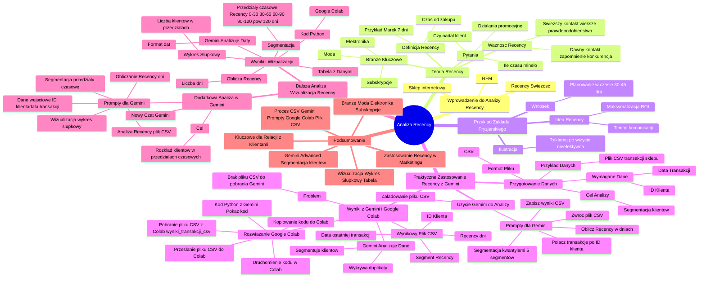

# Lekcje wideo - 3. Recency

# 💡 Diagram

___

# 🗒️ Notatka

# Analiza Recency z wykorzystaniem Gemini - Notatki i Podsumowanie

## Wprowadzenie do Analizy Recency

* **RFM** - Model analizy klientów (Recency, Frequency, Monetary Value).
* Film skupia się na pierwszym elemencie **Recency** (Świeżość).
* Analiza świeżości klientów dla sklepu internetowego.

## Teoria Recency

* **Definicja Recency:** Czas, który upłynął od ostatnich zakupów klienta w sklepie.
    * Przykład: Marek złożył zamówienie 7 dni temu, jego Recency = 7 dni.
* **Ważność Recency:**
    * Im świeższy kontakt z klientem, tym większe prawdopodobieństwo kolejnych zakupów.
    * Klient, który dawno nie dokonał zakupu, może zapomnieć o sklepie lub przejść do konkurencji.
* **Branże, w których Recency jest kluczowe:**
    * Moda 👗
    * Elektronika 📱
    * Subskrypcje 🔄
* **Pytania, które warto sobie zadać:**
    * Ile czasu 🕰️ minęło od ostatniego zakupu klienta?
    * Czy klient jest nadal moim klientem?
    * Czy potrzebne są działania promocyjne? 📢

## Przykład Zakładu Fryzjerskiego 💇‍♂️

* **Ilustracja:** Reklama strzyżenia włosów wysłana zaraz po wizycie klienta jest nieefektywna.
* **Wniosek:** Działania marketingowe powinny być zaplanowane w czasie, np. za 30-45 dni, kiedy klient ponownie będzie potrzebował usługi.
* **Idea Recency:** Maksymalizacja zwrotu z inwestycji marketingowych poprzez odpowiednie **timing** komunikacji.

## Praktyczne Zastosowanie Recency z Gemini 🤖

### Przygotowanie Danych

* **Wymagane dane:**
    * ID Klienta
    * Data Transakcji
* **Format pliku:** `CSV` 📁
* **Przykład danych:** Plik `CSV` z transakcjami sklepu internetowego (ID transakcji, Data transakcji, ID klienta, Produkty).
* **Cel analizy:** Segmentacja klientów na podstawie `Recency`.

### Użycie Gemini do Analizy

1. **Załadowanie pliku `CSV` do Gemini Advanced.**
2. **Prompty dla Gemini:**
    * "Połącz transakcje tego samego klienta po kolumnie ID klienta, zachowując datę najnowszej transakcji danego klienta."
    * "Oblicz wartość `recency` jako liczbę dni od daty ostatniej transakcji do daty dzisiejszej. Wartość powinna być podana jako liczba całkowita, bez jednostek czasowych."
    * "Przypisz każdy rekord do jednego z pięciu segmentów `recency` zgodnie z kwantylami."
        * Segment 5: Klienci o najwyższej **recency** (najbardziej aktualni).
        * Segment 1: Klienci o najniższej **recency** (najmniej aktualni).
    * "Zapisz wyniki w nowym pliku `CSV`, dodając dwie kolumny: `recency` oraz `recency segment`."
    * "Zwróć plik wynikowy w formacie `CSV`."

### Wyniki z Gemini i Google Colab 🧑‍💻

* **Gemini analizuje dane:**
    * Wykrywa duplikaty transakcji dla klientów i przypisuje najnowszą datę.
    * Segmentuje klientów na 5 segmentów `Recency` za pomocą kwantyli.
* **Problem:** Gemini Advanced w momencie nagrania nie generuje plików `CSV` do pobrania.
* **Rozwiązanie:** Wykorzystanie kodu Python wygenerowanego przez Gemini w Google Colab.
    * **"Pokaż kod"** w Gemini - dostęp do kodu Python użytego do analizy.
    * **Skopiowanie kodu** i wklejenie do Google Colab (colab.research.google.com).
    * **Przesłanie pliku `CSV`** z danymi do Google Colab.
    * **Uruchomienie kodu w Google Colab.**
    * **Pobranie pliku `CSV` z wynikami** (`wyniki_transakcji.csv`) z Google Colab.
* **Wynikowy plik `CSV`:** Zawiera ID klienta, Datę ostatniej transakcji, `Recency` (dni), Segment `Recency`.

## Dalsza Analiza i Wizualizacja Recency 📊

### Dodatkowa Analiza w Gemini

* **Cel:** Zrozumienie rozkładu klientów w różnych przedziałach czasowych `Recency`.
* **Nowy czat w Gemini:** Załadowanie pliku `CSV` z wynikami z Google Colab.
* **Prompty dla Gemini:**
    * "Przeprowadź analizę `recency` dla danych zawartych w przesłanym pliku `CSV`."
    * "Dane wejściowe: plik `CSV` zawiera kolumny ID klienta oraz data ostatniej transakcji klienta."
    * "Obliczanie `recency`. Oblicz liczbę dni od daty ostatniej transakcji do dzisiejszej daty. Wynik podaj jako liczbę całkowitą, bez jednostek czasowych (dni, godzin itp.)."
    * "Segmentacja według przedziałów czasowych. Podziel klientów na przedziały według liczby dni od ostatniej transakcji: 0-30 dni, 30-60 dni, 60-90 dni, 90-120 dni i powyżej 120 dni."
    * "Wizualizacja. Wygeneruj wykres słupkowy przedstawiający liczbę klientów w każdej z tych kategorii. Oznacz oś X: przedziały dni. Oś Y: liczba klientów. Dodaj tytuł wykresu: Rozkład klientów według `recency`."

### Wyniki i Wizualizacja

* **Gemini analizuje daty:** Sprawdza format dat i ewentualnie przekształca.
* **Oblicza Recency:** Liczba dni od daty transakcji do dzisiaj.
* **Segmentacja:** Dzieli klientów na przedziały czasowe `Recency` (0-30, 30-60, 60-90, 90-120, >120 dni).
* **Wykres słupkowy:** Generuje wykres przedstawiający liczbę klientów w każdym przedziale `Recency`.
* **Tabela z danymi:** Dodatkowo prezentuje tabelę z liczbą klientów w każdym przedziale.
* **Kod Python:** Ponownie dostępny kod Python do ewentualnego użycia w Google Colab w celu uzyskania danych w formie pliku.

## Podsumowanie

Film przedstawia praktyczne zastosowanie analizy **Recency** w marketingu, demonstrując, jak narzędzie **Gemini Advanced** może być wykorzystane do segmentacji klientów na podstawie świeżości ich ostatnich zakupów 🛒. Proces obejmuje przygotowanie danych w formacie **CSV**, załadowanie ich do Gemini, sformułowanie odpowiednich **promptów** do analizy i segmentacji, oraz wykorzystanie **Google Colab** do uzyskania wyników w formacie pliku `CSV`, gdy Gemini bezpośrednio nie oferuje takiej opcji. Dodatkowo, pokazano, jak Gemini może wygenerować **wykres słupkowy** 📊 i **tabelę** wizualizujące rozkład klientów według przedziałów czasowych `Recency`, co ułatwia dalszą interpretację danych i planowanie działań marketingowych 📢. Analiza **Recency** jest kluczowa dla firm, które chcą budować i utrzymywać długotrwałe relacje z klientami, szczególnie w branżach takich jak moda 👗, elektronika 📱 i subskrypcje 🔄.

___

# 🔉 Transcript
File: Lekcje wideo - 3. Recency.mp4 
[00:00:00] (Biały ekran)
[00:00:01] (Logo "Umiejętności Jutra AI". Pod spodem "Organizator: Google", "Partner edukacyjny: SGH")
[00:00:05] Cześć.
[00:00:06] (Krzysztof Modrzewski, Head of education, Marketing Masters)
[00:00:06] Omówiliśmy pokrótce czym jest RFM.
[00:00:09] Teraz przyjrzyjmy się pierwszemu elementowi, czyli recency i zróbmy analizę świeżości naszych klientów, bo w sumie to byłoby takie najlepsze tłumaczenie i zróbmy to dla przykładowego sklepu internetowego.
[00:00:22] Zanim przejdziemy tak do praktyki, jeszcze chwila teorii.
[00:00:26] Recency to nic innego jak informacja, ile czasu minęło od ostatnich zakupów danego klienta w naszym sklepie.
[00:00:32] Jeżeli Marek złożył zamówienie 7 dni temu, to jego recency wynosiłoby 7 dni, po prostu.
[00:00:40] Być może możesz się zastanawiać, dlaczego recency jest w ogóle ważna i to na dodatek jest na pierwszym miejscu tak popularnej metody analizy.
[00:00:49] A jeżeli nie, to i tak ci wyjaśnię.
[00:00:51] Chodzi o to, że klient, z którym mamy świeższy kontakt, z większym prawdopodobieństwem zrobi u nas kolejne zakupy, niż klient, z którym już od dawna nie mamy żadnego kontaktu.
[00:01:01] Zgodzisz się ze mną, co?
[00:01:03] Jeżeli wyślesz email z promocją, to kto zareaguje z większym prawdopodobieństwem?
[00:01:09] Ktoś, kto ostatni raz zakupy zrobił 60 dni temu, czy 320 dni temu?
[00:01:15] Ten, nazwijmy to, mniej świeży klient, może już nas w ogóle nie pamiętać, albo może już przeszedł do naszej do naszej konkurencji.
[00:01:24] Oczywiście, nie tyczy się to każdego biznesu.
[00:01:26] Kupując lodówkę czy samochód, raczej jesteśmy klientem jednorazowym, ponieważ kiedy przyjdzie nam znowu dokonać podobnego zakupu, to nasze poszukiwania zaczniemy gdzieś tam od początku, ale dla wielu sklepów stała relacja z klientem jest ważna i należy o nią szczególnie dbać.
[00:01:42] W wielu branżach, takich jak moda, elektronika czy subskrypcje, recency jest kluczowe dla strategii utrzymywania klientów.
[00:01:50] Dlatego powinniśmy zadać sobie pytanie: ile czasu minęło od ostatniego zakupu mojego klienta?
[00:01:57] Czy jest on w ogóle jeszcze moim klientem?
[00:02:00] Czy już powinienem zareagować działaniami promocyjnymi?
[00:02:03] Zastanów się, tak dla siebie.
[00:02:06] Twoich myśli i tak nikt nie słyszy.
[00:02:08] Czy kiedykolwiek zadałeś sobie takie pytanie?
[00:02:11] Co?
[00:02:12] Jeszcze jedno.
[00:02:13] Wyobraź sobie, że prowadzisz zakład fryzjerski.
[00:02:15] Przychodzi do ciebie klient, jest strzyżony i po jakimś, nie wiem, godzinie czy może dwóch, zadowolony wychodzi.
[00:02:21] Kiedy wrócisz do niego z reklamą strzyżenia?
[00:02:24] Od razu?
[00:02:25] Za 15 minut, za godzinę?
[00:02:27] Raczej nie.
[00:02:28] Właśnie ma ostrżone i ułożone włosy i raczej w ciągu najbliższego czasu nie będzie potrzebował kolejnego obcinania.
[00:02:35] Nawet jeżeli dostałby kupon promocyjny.
[00:02:37] Takie działanie marketingowe będą nazwijmy to tymi pieniędzmi wyrzuconymi w błoto, jak to się mówi.
[00:02:44] Raczej powinniśmy zaplanować jakieś działania może za 30, może za 45 dni, kiedy nasz klient będzie znowu potrzebował strzyżenia i będzie się rozglądać za miejscem, gdzie może pójść.
[00:02:54] Widzisz o co chodzi?
[00:02:56] To jest właśnie idea, która stoi za recency i za strategią maksymalizacji zwrotu z inwestycji.
[00:03:03] Przejdźmy teraz do praktyki i zobaczmy jak Gemini może nam pomóc w analizie recency.
[00:03:08] (Ekran: Arkusz kalkulacyjny z danymi transakcji)
[00:03:08] Oczywiście, żeby zacząć taką analizę, najpierw musimy mieć odpowiednie dane.
[00:03:13] (Ekran: Arkusz kalkulacyjny z danymi transakcji sklepu internetowego)
[00:03:13] I to co chciałem teraz pokazać, to jest taki plik z mojego sklepu internetowego.
[00:03:20] To jest oczywiście przykładowy plik, który sobie wygenerowałem, gdzie mam informacje o ID transakcji, mam informacje, mam informacje o dacie transakcji, ID klienta i produktach, jakie w danym zamówieniu zakupił.
[00:03:34] I tutaj przykładowo mam akurat 1000 transakcji, które sobie wyciągnąłem z takiego przykładowego sklepu internetowego i chciałbym, żeby Gemini dokonał mi teraz analizy.
[00:03:45] Żeby móc takiej analizy dokonać, no to w takim recency, w tym przypadku, no to potrzebuję informacje przede wszystkim ID klienta, no i datę, prawda?
[00:03:53] Żeby wiedzieć kiedy dana transakcja została złożona, bo muszę powiedzieć Gemini, żeby obliczył jak dawno to ta dana transakcja była, a później oczywiście mi tych klientów posegmentował.
[00:04:07] Więc jak mam przygotowany taki plik w formacie CSV, to jest ważne, to musi być format CSV, no to mogę teraz przejść do do Gemini i poprosić go o przygotowanie takiej analizy.
[00:04:19] (Ekran: Gemini Advanced, "Cześć, Krzysztof", "Zapytaj Gemini")
[00:04:29] Tylko najpierw muszę załadować plik.
[00:04:31] Dodaję mój plik z transakcjami i tutaj wklejam mój prompt.
[00:04:36] Teraz o co proszę Gemini?
[00:04:39] Połącz transakcje tego samego klienta po kolumnie ID klienta, zachowując datę najnowszej transakcji danego klienta.
[00:04:45] Bardzo istotne zdanie.
[00:04:46] Dlaczego?
[00:04:47] Ponieważ zależy mi na tym, żeby zobaczyć ile czasu minęło od ostatniej transakcji danego klienta.
[00:04:52] Jeżeli wyciągnąłem 1000 transakcji i dany klient zrobił tam na przykład cztery transakcje, no to muszę znaleźć tą jego najświeższą transakcję, żeby wiedzieć ile czasu od niej minęło.
[00:05:00] Poprzednie transakcje już mnie nie interesują, dlatego to jest to pierwsze zadanie, jakie daję Gemini.
[00:05:08] Dalej proszę go o to: oblicz wartość recency jako liczbę dni od daty ostatniej transakcji do daty dzisiejszej.
[00:05:16] Wartość powinna być podana jako liczba całkowita, bez jednostek czasowych, no: dni, minuty.
[00:05:20] Przypisz każdy rekord do jednego z pięciu segmentów recency zgodnie z kwantylami.
[00:05:24] Segment 5: Najbardziej aktualni klienci.
[00:05:26] Segment 1: Najmniej aktualni klienci.
[00:05:28] Zapisz wyniki w nowym pliku CSV, dodając dwie kolumny: recency oraz recency segment.
[00:05:32] Zwróć plik wynikowy w formacie CSV.
[00:05:33] No i takie zadanie tutaj do Gemini właśnie przesyłam.
[00:05:57] (Ekran: Gemini analizuje dane)
[00:06:01] (Ekran: Gemini - analiza zakończona)
[00:06:01] Analiza jest zakończona.
[00:06:02] Co zrobił Gemini?
[00:06:03] Sprawdził ile jest transakcji i klientów i sprawdził, że jest 949 klientów i 1000 transakcji, czyli miałem 51 zduplikowanych transakcji i to po prostu wykrył i odpowiednio pousuwał te przypisał najnowsze transakcje do tych klientów, którzy zrobili więcej niż jedną transakcję.
[00:06:23] Następnie pogrupował właśnie użytkowników i na podstawie wartości recency podzielił klientów na pięć segmentów za pomocą kwantyli i przypisał wyniki w nowym pliku CSV.
[00:06:32] Plik wynikowy zapisano w wyniki transakcji CSV.
[00:06:34] Jak widzisz, nie mam tutaj możliwości pobrania w tej chwili tego pliku CSV, bo wygląda to tak, że w tej chwili Gemini Advanced nie ma możliwości generowania takich plików CSV do pobrania.
[00:06:53] Być może kiedy ty to oglądasz, Gemini już ma taką możliwość i dostaniesz tutaj już gotowy link do pobrania takiego właśnie pliku CSV z wynikami.
[00:07:04] Jeżeli jednak takiej czegoś takiego nie ma, to pokażę ci jak bardzo łatwo rozwiązać ten problem, żeby dany plik zdobyć.
[00:07:13] Zwróć uwagę na to, że mamy tutaj taką opcję jak pokaż kod.
[00:07:16] (Ekran: Gemini - kod w Pythonie)
[00:07:17] To jest nic innego jak kod, który wykonało Gemini, żeby zrealizować dane zadanie.
[00:07:23] Tylko ten kod jest w różnych takich w kilku sekcjach podany, a ja bym chciał mieć, żeby to cały ten cały kod Pythona, powiedzmy, był w jednym pliku.
[00:07:35] Dlatego teraz poproszę tutaj Gemini, żeby podsumował mi ten użyty kod i tak, żebym mógł go skopiować i wkleić w Google Colab.
[00:07:57] (Ekran: Gemini - kod w Pythonie)
[00:07:57] Google Colab to jest takie zewnętrzne narzędzie od Google, gdzie właśnie mogę wywoływać różnego rodzaju skrypty i otrzymać od razu tutaj gotowe wyniki.
[08:06] (Ekran: Gemini - kod w Pythonie)
[08:06] Dostałem od Gemini wynik pełnego skryptu.
[08:10] Dostałem też instrukcję jak użyć go w Google Colab.
[08:13] Utwórz nowy notebook w Google Colab, wklej powyższy kod do komórki kodu.
[08:16] Upewnij się, że plik CSV transakcje sklepu internetowego CSV jest dostępny w twoim środowisku Google Colab.
[08:21] Możesz go przesłać, korzystając z panelu plików po lewej stronie.
[08:22] Uruchom komórkę kodu.
[08:23] Po uruchomieniu kodu plik wynikowy wyniki transakcji CSV zostanie zapisany w twoim środowisku Google Colab.
[08:29] Możesz go pobrać na swój komputer, korzystając z panelu plików.
[08:30] (Ekran: Google Colab)
[08:30] To jest ten wynik, który otrzymałem.
[08:39] Mam ID klienta, mam datę ostatniej transakcji, mam wynik ile dni minęło od ostatniej transakcji i widzę do którego segmentu dany klient został przypisany, jeżeli chodzi o recency.
[08:50] Czyli mam gotową analizę, którą na przykład mógłbym wykorzystać do jakiejś swojej dalszej analizy, albo już w działaniach marketingowych i powybierać sobie na przykład użytkowników, którzy są w segmencie, nie wiem, jednym, drugim, trzecim, czwartym, piątym i zrobić do nich konkretne działania marketingowe, ale Okej, mam już te wyniki, mam przygotowane segmenty do wykorzystania w działaniach marketingowych.
[00:09:14] Chciałbym jednak się czegoś więcej dowiedzieć o swoich klientach.
[00:09:19] To przejdźmy do Gemini i zobaczmy czy możemy tutaj wykonać jeszcze taką jakby dodatkową analizę związaną z moimi klientami.
[00:09:37] A mianowicie chciałbym teraz zobaczyć ilu mam klientów, którzy dokonali transakcji w ciągu ostatnich 30 dni, między 30-60 dni, 60-90 dni, 90-120 i ponad 120 dni temu.
[00:10:52] W tym celu otwieram w ogóle z nowy czat, przesyłam ten plik, który pobrałem i który wygenerowałem za pomocą Google Colab.
[00:10:59] No i daję tutaj taki prompt.
[00:11:02] Przeprowadź analizę recency dla danych zawartych w przesłanym pliku CSV.
[00:11:05] Dane wejściowe: plik CSV zawiera kolumny ID klienta oraz data, data ostatniej transakcji klienta.
[00:11:11] Obliczanie recency.
[00:11:12] Oblicz liczbę dni od daty ostatniej transakcji data do dzisiejszej daty.
[00:11:16] Wynik podaj jako liczbę całkowitą, bez jednostek czasowych dni, hours itp.
[00:11:20] Segmentacja według przedziałów czasowych.
[00:11:23] Podziel klientów na przedziały według liczby dni od ostatniej transakcji 0-30 dni, 30-60 dni, 60-90 dni, 90-120 dni i powyżej 120 dni.
[00:11:31] Wizualizacja.
[00:11:32] Wygeneruj wykres słupkowy przedstawiający liczbę klientów w każdej z tych kategorii.
[00:11:36] Oznacz oś X: przedziały dni.
[00:11:38] Oś Y: liczba klientów.
[00:11:40] Dodaj tytuł wykresu: rozkład klientów według recency.
[00:11:43] (Ekran: Gemini analizuje dane)
[00:11:43] Analiza zakończona.
[00:11:44] Co zrobił Gemini?
[00:11:44] Sprawdził, zanim przejdę do obliczenia wartości recency, muszę sprawdzić wartości w kolumnie data i upewnić się, że zawiera ona daty w formacie umożliwiającym obliczenia.
[00:11:51] Sprawdzę wartości w kolumnie data, aby określić czy to daty i czy mogę na nich przeprowadzić obliczenia.
[00:11:55] Być może będę musiał przekształcić je do odpowiedniego formatu.
[00:11:58] Następnie obliczę liczbę dni, które upłynęły od każdej daty w kolumnie data do dnia dzisiejszego.
[00:12:04] Jeśli w danych znajdują się dni z przyszłości, to potraktuję je tak, jakby były z przeszłości.
[00:12:08] Na przykład data 2025-02-15 potraktuję tak, jakby to była data 2024-02-15.
[00:12:12] Teraz obliczę ile dni minęło od każdej daty w kolumnie data do dnia dzisiejszego i zapiszę wynik w kolumnie recency.
[00:12:18] Następnie podzielę klientów na kategorie w zależności od wartości w kolumnie recency.
[00:12:22] Stworzę wykres słupkowy, aby przedstawić liczbę klientów w każdej kategorii recency.
[00:12:26] Osie zostaną oznaczone w następujący sposób: oś X: przedziały dni.
[00:12:29] Oś Y: liczba klientów.
[00:12:31] Dodam również tytuł: rozkład klientów według recency.
[00:12:34] (Ekran: Wykres słupkowy "Rozkład klientów według recency")
[00:12:34] Wykres słupkowy przedstawiający rozkład klientów według recency został wygenerowany.
[00:12:39] Dodatkowo tabela przedstawiająca liczbę klientów w każdej kategorii recency jest pokazana poniżej.
[00:12:42] Przedziały dni, liczba klientów.
[00:12:44] 0-30 dni, 61.
[00:12:46] 30-60 dni, 94.
[00:12:48] 60-90 dni, 70.
[00:12:50] 90-120 dni, 74.
[00:12:52] Powyżej 120 dni, 650.
[00:12:54] (Ekran: Gemini - kod w Pythonie)
[00:12:54] A teraz, co ja robię?
[00:12:55] Kopiuję ten kod, który tutaj jest.
[00:12:58] Przechodzę do właśnie Google Colab.
[00:13:02] to jest po prostu colab.research.google.com, link znajdziesz oczywiście w w materiałach do tej lekcji, ale po prostu możesz wpisać Google Colab i też to znajdziesz.
[00:13:10] No i tutaj oczywiście teraz mogę już tutaj wkleić ten kod, ale najpierw muszę się upewnić, że ten plik, z którego korzystam, będzie tutaj dostępny.
[00:13:18] Klikam więc teraz taki ten znaczek po lewej stronie folderu i dodaję nowy plik.
[00:13:23] Tutaj przesyłam nowy plik i przesyłam właśnie ten plik, który kazałem Geminiowi tutaj przeanalizować, czyli transakcje sklepu internetowego.
[00:13:51] Jak ten plik już tutaj jest, wystarczy, że tutaj wkleję ten mój cały kod i uruchomię tutaj tym przyciskiem, tym kółeczkiem wywołanie tego całego kodu.
[00:14:00] No i ten kod się tutaj wywołał i dostałem wynik tutaj w postaci pliku wyniki transakcji CSV.
[00:14:13] I teraz mogę taki plik pobrać do siebie na komputer, zapisać i zobaczyć jaki jest tamtego rezultat.
[00:14:38] (Ekran: Arkusz kalkulacyjny z danymi transakcji sklepu internetowego)
[00:14:39] To jest ten wynik, który otrzymałem.
[00:14:41] Mam ID klienta, mam datę, recency, recency segment.
[00:14:44] (Ekran: Krzysztof Modrzewski)
[00:14:44] Czyli mam

___
# 🏷️ Tags
#RFM #recency #analiza_recency #segmentacja_klientów #sklep_internetowy #dane_klientów #zachowania_klientów #analiza_danych #data_transakcji #ID_klienta #częstotliwość #wartość_monetarna #klienci #marketing #promocje #zakupy #e-commerce #biznes #model_RFM #Gemini #Gemini_Advanced #Google_Colab #CSV #plik_CSV #prompt #prompty #kod_python #python #wizualizacja_danych #wykres_słupkowy #segmenty_recency #kwantyle #działania_promocyjne #utrzymanie_klienta #moda #elektronika #subskrypcje #zakład_fryzjerski #strzyżenie #inwestycje_marketingowe #timing #analiza #segmentacja #przedziały_czasowe #rozkład_klientów #długotrwałe_relacje #AI #sztuczna_inteligencja #analiza_marketingowa #customer_segmentation
