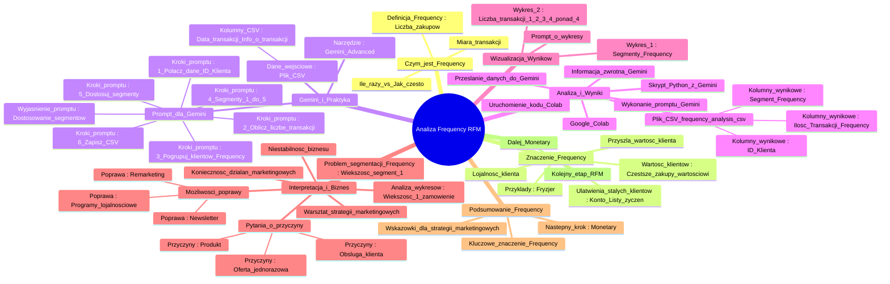

# Lekcje wideo - 4. Frequency

# 💡 Diagram

___

# 🗒️ Notatka

# Notatki i Podsumowanie Transkrypcji Wideo: Analiza `Frequency` w Modelu RFM

## Wprowadzenie do Analizy `Frequency`

Ten film edukacyjny dotyczy analizy **Frequency**, czyli **częstotliwości**, która stanowi drugi element modelu **RFM** (Recency, Frequency, Monetary) w marketingu. Materiał wideo jest częścią serii \"Umiejętności Jutra AI\" organizowanej przez Google i SGH. Krzysztof Modrzewski z Marketing Masters, prezentujący zagadnienie, wyjaśnia koncepcję `Frequency` i demonstruje jej praktyczne zastosowanie z wykorzystaniem narzędzia Gemini oraz Google Colab.

## Czym jest `Frequency`?

- **`Frequency`** (częstotliwość) w kontekście sklepu internetowego określa **liczbę zakupów** dokonanych przez klientów w danym sklepie.
- Określenie \"ile razy\" jest bardziej precyzyjne niż \"jak często\".
- Jest to miara liczby transakcji zrealizowanych przez klienta.

## Dlaczego `Frequency` jest Ważne?

- **Klienci dokonujący częstszych zakupów są bardziej wartościowi.** 💎
- Założenie: Klient, który zrealizował więcej transakcji, z większym prawdopodobieństwem dokona kolejnych zakupów w przyszłości.
- **Lojalność Klienta:** Większa liczba zakupów sugeruje wyższy poziom lojalności i zadowolenia klienta z oferty, obsługi klienta i innych aspektów.
- **Ułatwienia dla Stałych Klientów:** Klienci posiadający konto, listy życzeń oraz zapisane dane doświadczają uproszczonego procesu zakupowego, co motywuje ich do ponownych zakupów.
- **Przykłady poza e-commerce:** Analogicznie, klient regularnie korzystający z usług fryzjera jest bardziej przewidywalny i wartościowy. 💇‍♂️
- **Przyszła Wartość Klienta:** Im częściej klient korzysta z oferty, tym większa staje się jego wartość w perspektywie długoterminowej. 📈

## Praktyczne Zastosowanie `Frequency` z Gemini

- **Narzędzie:** Do analizy danych transakcyjnych wykorzystywane jest Gemini Advanced.
- **Dane Wejściowe:** Plik CSV zawierający dane transakcyjne klientów (wymagane kolumny: data transakcji i informacje o transakcji).
- **Prompt dla Gemini:** Specjalnie przygotowany prompt służy do przeprowadzenia analizy `Frequency` przez Gemini.

### Treść Promptu Użytego w Gemini:

> Przeanalizuj dostarczone dane transakcyjne ze sklepu internetowego w celu przeprowadzenia analizy **Frequency** z modelu **RFM** i zapisz wyniki do pliku CSV.
>
> **Kroki do wykonania:**
> 1. Połącz dane na podstawie kolumny **ID Klienta**.
> 2. Oblicz liczbę transakcji dla każdego klienta, aby wyznaczyć wskaźnik **Frequency**.
> 3. Pogrupuj klientów według liczby transakcji, identyfikując unikalne wartości **Frequency**.
> 4. Przypisz klientom segmenty od 1 do 5 na podstawie liczby unikalnych wartości **Frequency**, gdzie:
>    - 1 oznacza klientów z najmniejszą liczbą transakcji (najniższy segment),
>    - 5 oznacza klientów z największą liczbą transakcji (najwyższy segment).
> 5. **W przypadku, gdy liczba unikalnych wartości Frequency jest mniejsza niż 5, dostosuj liczbę segmentów do dostępnej liczby grup.** *(Punkt kluczowy)*
> 6. Zapisz wyniki w pliku CSV zawierającym kolumny:
>    - ID Klienta
>    - Ilość Transakcji
>    - Segment Frequency (od 1 do maksymalnie 5)

- **Wyjaśnienie Promptu:**
    - Prompt instruuje Gemini, jak przeprowadzić analizę `Frequency` na danych transakcyjnych.
    - Kluczowy punkt 5: Dostosowanie liczby segmentów w sytuacji, gdy liczba unikalnych wartości `Frequency` jest mniejsza niż 5. Przykładowo, jeśli klienci dokonali maksymalnie 4 zamówień, segmentacja powinna obejmować 4 segmenty, a nie 5.

## Realizacja Analizy i Otrzymanie Wyników

- **Przesłanie Danych do Gemini:** Plik CSV z danymi transakcyjnymi zostaje przesłany do Gemini.
- **Wykonanie Promptu przez Gemini:** Gemini analizuje dane zgodnie z instrukcjami zawartymi w prompcie.
- **Informacja Zwrotna z Gemini:** Gemini potwierdza pomyślne przeprowadzenie analizy i zapisanie wyników w pliku.
- **Pobranie Wyników:** Bezpośrednie pobranie pliku CSV z Gemini nie jest możliwe w prezentowanym materiale wideo.
- **Skrypt Python z Gemini:** Gemini generuje kod w języku Python do przeprowadzenia analizy.
- **Google Colab:** Wygenerowany kod Python jest kopiowany i wklejany do środowiska Google Colab.
- **Uruchomienie Kodu w Colab:** Kod Python jest uruchamiany w Colab, po wcześniejszym załadowaniu pliku z danymi transakcyjnymi.
- **Plik CSV \"frequency_analysis.csv\":**  Rezultatem działania skryptu jest plik CSV zawierający:
    - ID Klienta
    - Ilość Transakcji (`Frequency`)
    - Segment `Frequency` (od 1 do maksymalnie 5)

## Wizualizacja Wyników za Pomocą Wykresów w Gemini

- **Prompt o Wykresy:** Po przeprowadzeniu analizy `Frequency`, do Gemini wysyłany jest kolejny prompt z prośbą o graficzne przedstawienie wyników w formie wykresów. 📊
- **Dwa Wykresy:** Gemini generuje dwa typy wykresów:
    1. **Liczba klientów w każdym segmencie `Frequency`.**
    2. **Liczba klientów, którzy dokonali dokładnie 1, 2, 3, 4 oraz więcej niż 4 transakcje.**

## Interpretacja Wykresów i Implikacje Biznesowe

- **Analiza Wykresów:** Wykresy ukazują, że zdecydowana większość klientów (ponad 90%) złożyła tylko jedno zamówienie.
- **Niestabilność Biznesu:**  Wysoki odsetek klientów jednorazowych sygnalizuje potencjalną niestabilność biznesu, wskazując, że klienci nie wracają po kolejne zakupy. ⚠️
- **Pytania o Przyczyny:** Należy zadać kluczowe pytania:
    - Dlaczego klienci nie dokonują ponownych zakupów? 🤔
    - Czy problem leży w jakości obsługi klienta? 📞
    - Czy oferowany produkt jest problematyczny? 📦
    - Czy oferta jest postrzegana jako jednorazowa, nawet jeśli sklep dysponuje szerokim asortymentem?
- **Konieczność Działań Marketingowych:**  Istnieje pilna potrzeba wdrożenia działań marketingowych mających na celu wzmocnienie lojalności klientów i zachęcenie ich do powrotu. 📣
- **Warsztat Strategii Marketingowych:** Wyniki analizy `Frequency` mogą stanowić fundament dla kompleksowego warsztatu poświęconego opracowaniu strategii marketingowych. 💡
- **Problem z Segmentacją `Frequency`:** W analizowanym przykładzie segmentacja `Frequency` nie jest optymalna, ponieważ przeważająca część klientów ma na koncie tylko jeden zakup (segment 1), co utrudnia dalszą, pogłębioną analizę RFM.
- **Możliwości Poprawy:** Sugerowane kierunki działań marketingowych:
    - Remarketing
    - Newsletter 📧
    - Programy lojalnościowe 🏆

## Podsumowanie Analizy `Frequency`

- **Kluczowe Znaczenie `Frequency`:** Analiza `Frequency` jest fundamentalna dla zrozumienia zachowań klientów i oceny kondycji biznesu.
- **Wskazówki dla Strategii Marketingowych:**  Dostarcza cennych wskazówek, które mogą być wykorzystane do ukierunkowania działań marketingowych mających na celu zwiększenie wartości klientów i motywowanie ich do ponownych zakupów.
- **Następny Krok - `Monetary`:** Kolejnym etapem w ramach analizy RFM jest **Monetary**, czyli analiza wartości finansowej generowanej przez klientów. 💰

## Koniec Części o `Frequency`

Materiał wideo przechodzi do omówienia trzeciego elementu modelu RFM - **Monetary**.

---

**Podsumowanie:**

Film edukacyjny \"Umiejętności Jutra AI\" omawia analizę **`Frequency`** w modelu **RFM**. **`Frequency`** jest definiowana jako liczba transakcji dokonanych przez klienta i stanowi istotny wskaźnik lojalności oraz przyszłej wartości klienta. Praktyczna demonstracja analizy `Frequency` jest realizowana z użyciem narzędzi **Gemini Advanced** i **Google Colab**. Wykorzystywany jest specjalny prompt dla Gemini, który instruuje narzędzie, jak przeprowadzić analizę i segmentację klientów w oparciu o liczbę transakcji. Wyniki analizy są prezentowane w pliku CSV i wizualizowane za pomocą wykresów. Analiza przykładowych danych ujawnia problem niskiej częstotliwości zakupów, co wskazuje na potencjalną niestabilność biznesu i potrzebę wdrożenia działań marketingowych ukierunkowanych na zwiększenie lojalności klientów. Film podkreśla istotę analizy `Frequency` dla zrozumienia zachowań klientów i efektywnego planowania strategii marketingowych. Następnym krokiem w analizie RFM jest moduł **`Monetary`**.

___

# 🔉 Transcript
File: Lekcje wideo - 4. Frequency.mp4 
[00:00:01] (Na ekranie pojawia się napis "Umiejętności Jutra AI". Poniżej napisy "Organizator Google" oraz "Partner edukacyjny SGH".)
[00:00:05] Cześć.
[00:00:06] (Na ekranie pojawia się napis "Krzysztof Modrzewski Head of education Marketing Masters".)
[00:00:06] Wiesz już czym jest recency.
[00:00:08] Teraz zajmiemy się frequency, czyli po polsku częstotliwością.
[00:00:12] Czyli w przykładzie naszego sklepu internetowego, to jak często nasi klienci dokonali u nas zakupów.
[00:00:18] Albo
[00:00:19] W sumie może lepszym określeniem zamiast jak często, będzie tutaj ile razy.
[00:00:24] Tak, tak, zdecydowanie.
[00:00:25] Ile razy dany użytkownik dokonał już u nas zakupu.
[00:00:28] Dlaczego to takie ważne?
[00:00:30] Jeżeli zgodziliśmy się, że świeższy klient jest klientem, który z większym prawdopodobieństwem zrobił u nas zakupy,
[00:00:37] to możemy też się zgodzić, że ktoś, kto częściej, czyli więcej razy dokonał u nas zakupu, z większym prawdopodobieństwem dokona u nas kolejnych zakupów, niż ktoś, kto złożył tylko jedno zamówienie.
[00:00:48] Jeżeli ktoś już cztery razy kupił coś u nas, to oznacza, że nasz sklep mu się podoba, mamy dobrą ofertę, mamy dobrą obsługę klienta.
[00:00:56] I być może jeszcze ten klient w ogóle ma u nas swoje konto, ma swoje jakieś listy życzeń, nie musi też wpisywać danych podczas procesu zakupowego.
[00:01:03] Ogólnie jest mu łatwiej niż komuś, kto dokonuje swojej pierwszej transakcji.
[00:01:07] Mam nadzieję, że tutaj możemy się zgodzić.
[00:01:11] Ale działa to nie tylko w sklepach internetowych.
[00:01:15] Fryzjer, do którego klient przyszedł już pięć razy w ciągu kilku miesięcy, może spodziewać się, że ta osoba niedługo pojawi się ponownie, w przeciwieństwie do klienta, który przyszedł właśnie po raz pierwszy.
[00:01:26] Tak właśnie działa frequency.
[00:01:28] Im ktoś więcej razy skorzystał z naszej oferty, tym jest bardziej lojalnym klientem i ma dla nas większą wartość w przyszłości.
[00:01:38] (Na ekranie pojawia się okno przeglądarki z Gemini Advanced. W oknie napis "Cześć, Krzysztof!")
[00:01:38] Dobra.
[00:01:40] Koniec tej teorii, wystarczy.
[00:01:42] Przejdźmy znowu do praktyki i kolejnych analiz z Gemini.
[00:01:47] Przechodząc do praktyki związanej z sprawdzaniem frequency,
[00:01:51] jestem w Geminiu i znowu ładuję ten sam plik z moimi klientami.
[00:01:57] Oczywiście ten plik oprócz daty transakcji musi zawierać również informacje o tym, że była transakcja, po to żeby Gemini wiedział ile dany klient wykonał u nas transakcji.
[00:02:08] Przesyłam więc jeszcze raz ten plik mój z transakcjami i wklejam teraz tutaj prompt, który ma wskazać Geminiowi o obliczenie tutaj frequency.
[00:02:23] No to co?
[00:02:24] Zobaczmy co tutaj mamy w naszym prompcie.
[00:02:26] (Na ekranie pojawia się treść promptu: "Przeanalizuj dostarczone dane transakcyjne ze sklepu internetowego, aby przeprowadzić analizę Frequency z modelu RFM i zapisz wyniki w pliku CSV. Trzy kroki do wykonania: 1. Połącz dane po kolumnie ID Klienta. 2. Policz liczbę transakcji dokonanych przez każdego Klienta, aby obliczyć wskaźnik Frequency. 3. Pogrupuj Klientów na podstawie liczby transakcji, sprawdzając unikalne wartości Frequency. 4. Na podstawie liczby unikalnych wartości Frequency przypisz Klientom segmenty od 1 do 5, gdzie: - 1 oznacza Klientów z najmniejszą liczbą transakcji (najgorszy segment), - 5 oznacza Klientów z największą liczbą transakcji (najlepszy segment). 5. Jeśli liczba unikalnych wartości Frequency jest mniejsza niż 5, dostosuj liczbę segmentów do dostępnej liczby grup. 6. Wyniki zapisz w pliku CSV zawierającym następujące kolumny: - ID Klienta - Ilość Transakcji - Segment Frequency (od 1 do maksymalnie 5)".)
[00:02:26] Przeanalizuj dostarczone dane transakcyjne sklepu ze sklepu internetowego, aby przeprowadzić analizę frequency i kroki do wykonania.
[00:02:35] to jest ważne zapisz wyniki w pliku CSV.
[00:02:37] Połącz dane w kolumnie ID klienta.
[00:02:41] Połącz liczbę transakcji dokonanych przez każdego klienta, aby obliczyć wskaźnik frequency.
[00:02:46] Pogrupuj klientów na podstawie liczby transakcji, sprawdzając unikalne wartości frequency.
[00:02:51] Na podstawie liczby unikalnych wartości frequency przypisz klientom segment od jednego do pięć, gdzie jeden oznacza klientów z najmniejszą liczbą transakcji, a pięć oznacza klientów z największą liczbą transakcji.
[00:03:03] I teraz bardzo ważna uwaga.
[00:03:03] Punkt piąty szczególnie istotny.
[00:03:05] Jeżeli liczba unikalnych wartości frequency jest mniejsza niż pięć, unikalnych, czyli nie mamy klientów, którzy zrobili 1, 2, 3, 4, 5 albo ileś tam więcej zamówień, w każdym razie nie da się ich podzielić na pięć grup pod względem ilości transakcji, dostosuj liczbę segmentów do dostępnej liczby grup.
[00:03:21] Zapisz wyniki w pliku CSV zawierającym następne kolumny: ID klienta, ilość transakcji, segment frequency od jeden do maksymalnie pięciu.
[00:03:29] Chodzi o to, że jeżeli mamy na przykład, że większość naszych klientów zrobiło jedno zamówienie, 2, 3, 4, ale na przykład nikt nie dokonał piątego zamówienia, no to nie ma ich dzielić na pięć grup, a na cztery.
[00:03:42] To jest bardzo istotne.
[00:03:43] Dzięki temu możemy otrzymać odpowiedni wynik.
[00:03:45] To co?
[00:03:47] Znowu analizujemy i czekamy na wynik.
[00:03:50] Analiza skończona, w jednym zdaniu, pomyślnie przeprowadzona analiza frequency i zapisano wyniki w pliku frequency analysis.
[00:03:57] Podobnie jak w przypadku recency, nie mam w tej chwili możliwości pobrania tego pliku CSV.
[00:04:01] Być może już w twoim modelu Gemini jest to możliwe.
[00:04:05] Jeżeli nie, to robimy dokładnie to samo co zrobiliśmy w poprzednim recency, żeby skopiować ten kod i wkleić do Colabu.
[00:04:17] W tym przypadku, jak widzisz, odkryłem kod, ten kod jest w jednej części, więc już nie muszę prosić Gemini o połączenie mi tych kilku fragmentów w jeden.
[00:04:27] Kopiuję go, przechodzę do mojego Colabu.
[00:04:32] Już ten plik transakcje sklepu internetowego jest tu załadowany, więc nie muszę go z powrotem ładować.
[00:04:36] Wklejam ten skrypt Pythona.
[00:04:41] Klikam Play i chwilę czekam na to, aż otrzymam wynik w postaci pliku frequency analysis.csv.
[00:04:51] Jak widzisz ten plik się tutaj pojawił.
[00:04:53] Pobieram go więc na komputer i zaraz pokażę ci jak on wygląda.
[00:04:58] (Na ekranie pojawia się arkusz kalkulacyjny z danymi. Kolumny: ID Klienta, Ilość Transakcji, Segment Frequency.)
[00:04:59] Jak widzisz, mam plik, gdzie mam ID mojego klienta, mam ile transakcji wykonał dany klient i mam w którym segmencie frequency on się tutaj znajduje.
[00:05:09] Czyli otrzymałem informacje, które przydadzą mi się teraz do dodatkowej analizy albo do działań marketingowych.
[00:05:15] Z tej samej konwersacji proszę teraz przedstaw wyniki w dwóch wykresach.
[00:05:20] Pierwszy wykres liczba klientów w poszczególnych segmentach frequency.
[00:05:23] Drugi wykres liczba klientów, którzy dokonali dokładnie 1, 2, 3, 4 oraz ponad cztery transakcje.
[00:05:26] (Na ekranie pojawia się okno przeglądarki z Gemini Advanced. W oknie napis "Przedstaw teraz wyniki w dwóch wykresach: - Pierwszy wykres liczba klientów w poszczególnych segmentach Frequency. - Drugi wykres liczba klientów, którzy dokonali dokładnie 1, 2, 3, 4 oraz ponad 4 transakcji".)
[00:05:26] Czekamy na wynik w postaci dwóch wykresów.
[00:05:47] (Na ekranie pojawiają się dwa wykresy. Pierwszy: Liczba klientów w zależności od liczby transakcji. Drugi: Liczba klientów w poszczególnych segmentach Frequency.)
[00:05:47] Analiza zakończona.
[00:05:48] W pierwszym wykresie mamy informacje ile klientów dokonało ile transakcji i widzę, że zdecydowana większość ponad 90% moich klientów dokonało tylko jednego zamówienia.
[06:02] To znowu pokazuje stabilność mojego biznesu, to znaczy, że klienci nie wracają do do tego sklepu internetowego, nie robią drugiego, trzeciego i następnych zamówień.
[06:11] Użytkowników, którzy zrobili tam dwa zamówienia jest bardzo niewielu.
[06:14] Trzech, trzy tam w ogóle dwóch klientów, a cztery i pięć zamówień już nie wykonał nikt.
[06:20] To znaczy, że klienci dokonują jednorazowych zakupów i nie wracają.
[06:24] No i teraz znowu pytanie dlaczego?
[06:25] Dlaczego nie wracają moi klienci do sklepu?
[06:28] Czy coś jest nie tak w obsłudze klienta?
[06:30] Czy coś było nie tak z produktem?
[06:32] Czy sprzedaję produkt jednorazowy, chociaż nie ma czegoś takiego jak, znaczy może są produkty jednorazowe, ale oferta nie jest jednorazowa.
[06:38] Sklep internetowy nie jest jednorazowy.
[06:40] Zawsze klient może do ciebie wrócić po coś innego.
[06:44] Nawet jak sprzedajesz samochód, zlewozmywak czy coś innego, to to nie jest klient jednorazowy.
[06:48] Zawsze można mu coś dosprzedać, zachęcać go do częstszego powrotu.
[06:53] Tu jest z tej strony problem, to pokazuje jakby, że ten biznes jest bardzo niestabilny i klienci nie wracają.
[07:00] Mamy tylko świeżych klientów no i znaczy jednorazowych klientów i to jest duży problem, więc należałoby ewidentnie wykonać jakieś działania marketingowe i znowu ten jeden wykres daje mi możliwość przeprowadzenia tak naprawdę całodniowego warsztatu na temat strategii marketingowych związanych z na prawo tego stanu rzeczy, bo coś jest tutaj zdecydowanie nie tak.
[07:24] No i widzę też, że mam tak nawet dwa segmenty frequency mi tutaj zrobił trzy segmenty mi zrobił Gemini, więc tu jeszcze mam jakieś takie podsumowanie i to jest problematyczne, tak, zwłaszcza jeżeli chodzi o późniejszą analizę RFM, bo F ewidentnie po prostu nie działa, no wszyscy mają jedynkę zamiast dwójki, trójki, czwórki czy najbardziej ważnej piątki.
[07:50] W związku z tym coś trzeba z tym fantem podziałać, ale mam nadzieję, że tobie taka analiza się udała, że wygląda ten u ciebie ten te wykresy zdecydowanie lepiej niż u mnie, ale mam nadzieję, że daje ci to też różnego nowe wskazówki jak działania marketingowe może podjąć, żeby zmaksymalizować wartość twoich klientów, zachęcić ich do powrotu i zobaczyć jak to wygląda w twoim przypadku.
[08:15] Na przykład można powiedzieć też taka jeszcze jedna rzecz, że nie ma tutaj żadnych działań remarketingowych do zachęcających użytkowników do powrotu.
[08:23] Nie wiem, nie ma newslettera, nie ma ludzie się nie zapisują, bo ewidentnie tutaj po prostu nikt nie dokonuje drugiej transakcji.
[08:32] Jak widzisz frequency to bardzo ważna analiza, która może nam bardzo dużo powiedzieć o naszych klientach i naszym biznesie.
[08:39] Ale to nie koniec, przejdźmy teraz do trzeciej części, czyli monetary, gdzie sprawdzi omówimy sobie trochę o porozmawiamy trochę o wartości naszych klientów i też sobie tutaj trochę poanalizujemy.
[08:51] (Na ekranie pojawia się napis "Umiejętności Jutra AI". Poniżej napisy "Organizator Google" oraz "Partner edukacyjny SGH".)

___
# 🏷️ Tags
#RFM #recency #frequency #monetary #analiza_RFM #model_RFM #częstotliwość #liczba_zakupów #klienci #wartość_klienta #lojalność_klienta #transakcje #sklep_internetowy #e-commerce #Gemini #Gemini_Advanced #Google_Colab #prompt #dane_transakcyjne #ID_Klienta #ilość_transakcji #segment_Frequency #CSV #plik_CSV #Python #skrypt_Python #wykresy #wizualizacja_danych #segmentacja_klientów #niestabilność_biznesu #działania_marketingowe #remarketing #newsletter #programy_lojalnościowe #wartość_finansowa #Marketing_Masters #Krzysztof_Modrzewski #Umiejętności_Jutra_AI #Google #SGH #analiza_danych #AI #sztuczna_inteligencja #lojalny_klient #wartościowy_klient #przyszła_wartość_klienta #customer_lifetime_value #CLV #customer_retention #retencja_klienta #customer_service #obsługa_klienta #customer_experience #doświadczenie_klienta #customer_satisfaction #satysfakcja_klienta #customer_engagement #zaangażowanie_klienta #customer_loyalty #lojalność_klienta #customer_value #wartość_klienta #customer_segmentation #segmentacja_klientów #customer_analytics #analityka_klientów #customer_insights #wnioski_o_klientach #customer_behavior #zachowanie_klientów #customer_journey #ścieżka_klienta #customer_relationship_management #CRM #zarządzanie_relacjami_z_klientami #marketing #strategia_marketingowa #marketing_strategy #marketing_plan #plan_marketingowy #marketing_campaign #kampania_marketingowa #marketing_automation #automatyzacja_marketingu #marketing_analytics #analityka_marketingowa #marketing_insights #wnioski_marketingowe #marketing_performance #wyniki_marketingowe #marketing_roi #zwrot_z_inwestycji_marketingowych #marketing_effectiveness #efektywność_marketingowa #marketing_optimization #optymalizacja_marketingowa #marketing_innovation #innowacje_marketingowe #marketing_trends #trendy_marketingowe #marketing_best_practices #najlepsze_praktyki_marketingowe #marketing_tips #porady_marketingowe #marketing_advice #doradztwo_marketingowe #marketing_consulting #konsulting_marketingowy #marketing_training #szkolenia_marketingowe #marketing_education #edukacja_marketingowa #marketing_resources #zasoby_marketingowe #marketing_tools #narzędzia_marketingowe #marketing_technology #technologia_marketingowa #marketing_software #oprogramowanie_marketingowe
