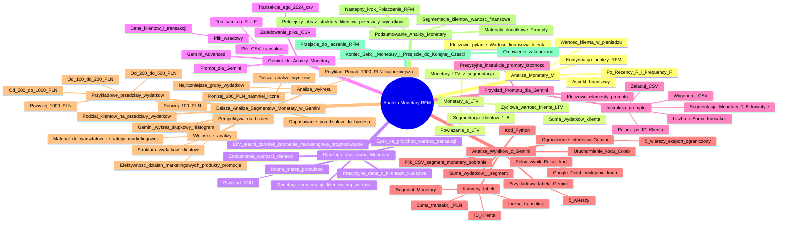

# Lekcje wideo - 5. Monetary

# 💡 Diagram

___

# 🗒️ Notatka

# Analiza Monetary w Modelu RFM - Szczegółowe Notatki i Podsumowanie

## Wprowadzenie do Analizy Monetary (M) 💰

* Kontynuacja omawiania analizy RFM.
* Po omówieniu **Recency (R)** i **Frequency (F)**, skupiamy się teraz na **Monetary (M)**.
* **Monetary** dotyczy aspektu finansowego - wartości klienta wyrażonej w pieniądzu.
* Kluczowe pytanie: **Jaką wartość finansową reprezentuje każdy klient?**

## Pojęcie Monetary a Lifetime Value (LTV) ♾️

* **Monetary** jest ściśle powiązane z **Lifetime Value (LTV)**, czyli **życiową wartością klienta**.
* **Życiowa wartość klienta (LTV)**: całkowita suma pieniędzy wydana przez klienta w historii jego zakupów w danej firmie.
* **Monetary** można traktować jako **LTV z uwzględnieniem segmentacji**.
* W analizie monetary klienci są oceniani pod względem wartości i **segmentowani** od najmniej do najbardziej wartościowych (np. segmenty 1-5).

## Dlaczego Warto Analizować Monetary? 🤔

* **Kluczowe jest zrozumienie wartości klientów dla firmy.**
* Klient generujący większy **zysk** (np. 2300 zł) jest cenniejszy niż klient z mniejszym zyskiem (np. 500 zł).
* **Należy zwrócić uwagę na różnicę między zyskiem a przychodem/wartością transakcji.** Różne produkty charakteryzują się różną marżą.
* Przykład: Zysk z drogiego sprzętu AGD może być niższy niż zysk z większej sprzedaży tańszych produktów.
* **LTV** jest bardziej przydatne do określania średniego zarobku na grupie klientów, co ułatwia dopasowanie kampanii marketingowych i prognozowanie.
* **Monetary** koncentruje się bardziej na **segmentacji klientów** według ich wartości, a nie na konkretnych wartościach LTV.
* Zarówno w przypadku LTV, jak i Monetary, **kluczowe są precyzyjne dane o klientach.**

## Praktyczne Wykorzystanie Gemini do Analizy Monetary 🤖

* Wykorzystanie **Gemini Advanced** do przeprowadzenia analizy danych.
* Zastosowanie tego samego **pliku CSV z transakcjami**, który był użyty w analizie Recency i Frequency.
* Plik wsadowy zawiera dane dotyczące klientów i ich transakcji.
* **Załadowanie pliku CSV** (\"Transakcje_ego_2024.csv\") do Gemini.
* Stworzenie **promptu** dla Gemini w celu wykonania analizy monetary.

### Przykład Promptu dla Gemini 💬

* **Instrukcja dla Gemini (prompt):**
    > \"Załaduj plik CSV z danymi transakcji. Połącz dane na podstawie kolumny \"ID Klienta\", tak aby każdy wiersz reprezentował unikalnego klienta. Dla każdego klienta oblicz liczbę dokonanych transakcji oraz sumaryczną kwotę transakcji, korzystając z kolumny \"Kwota całkowita (PLN)\". Następnie przeprowadź segmentację Monetary w modelu RFM:
    > 1. Oblicz sumę transakcji dla każdego klienta.
    > 2. Przypisz klientów do segmentów Monetary od 1 do 5, gdzie 1 oznacza klientów o najniższych wydatkach, a 5 klientów o najwyższych wydatkach. Wykorzystaj kwantyle do podziału danych.
    > 3. Wygeneruj plik CSV zawierający kolumny: \"ID klienta\", \"Liczba transakcji\", \"Suma transakcji (PLN)\", \"Segment Monetary\". Zapisz wynik jako plik CSV.\"

* **Kluczowe elementy promptu:**
    * Załadowanie pliku CSV.
    * Połączenie danych po \"ID Klienta\" (identyfikacja unikalnych klientów).
    * Obliczenie liczby transakcji i sumy transakcji dla każdego klienta.
    * Segmentacja Monetary (1-5) w oparciu o kwantyle.
    * Wygenerowanie pliku CSV z wynikami.
* **Istotność precyzyjnych instrukcji (promptów) dla Gemini.** Dokładne instrukcje gwarantują uzyskanie oczekiwanych rezultatów.

## Analiza Wyników z Gemini 📊

* Gemini prezentuje **przykładową tabelę z wynikami** w interfejsie (ograniczoną do 5 wierszy w tym przykładzie).
* Tabela zawiera kolumny: \"ID Klienta\", \"Suma transakcji (PLN)\", \"Liczba transakcji\", \"Segment Monetary\".
* Widoczna jest **suma wydatków klienta** oraz przypisany **segment Monetary**.
* **Ograniczenie interfejsu Gemini:** Wyświetlanych jest tylko 5 wierszy, a eksport do arkuszy kalkulacyjnych ogranicza się do widocznych danych.
* Aby uzyskać **pełny wynik**, należy skorzystać z opcji **\"Pokaż kod\"**.
* **Skopiowanie kodu Python** z Gemini.
* Przejście do **Google Colab** i wklejenie skopiowanego kodu (dodanie nowej komórki kodu - \"+ Kod\").
* Uruchomienie kodu w Colab (przycisk \"Play\" ▶️).
* Wynik: **plik CSV \"segment_monetary\"** gotowy do pobrania na komputer.

## Dalsza Analiza Segmentów Monetary w Gemini 🔍

* Po segmentacji, można zlecić Gemini **dalszą analizę wyników**.
* Przykład analizy: **podział klientów na przedziały wydatków.**
* **Przykładowe przedziały wydatków:**
    * Poniżej 100 PLN
    * Od 100 do 200 PLN
    * Od 200 do 500 PLN
    * Od 500 do 1000 PLN
    * Powyżej 1000 PLN
* **Kluczowe jest dopasowanie przedziałów do specyfiki biznesu i cen oferowanych produktów.** (Inne przedziały będą odpowiednie dla sklepu z zeszytami, a inne dla sklepu z laptopami).
* Gemini generuje **wykres słupkowy** (histogram) prezentujący liczbę klientów w każdym przedziale wydatków.
* **Analiza wykresu:**
    * Identyfikacja najliczniejszych grup klientów pod względem wydatków.
    * W przykładzie: najliczniejszą grupę stanowią klienci wydający **ponad 1000 zł**.
    * Najmniej liczna grupa: klienci wydający **poniżej 100 zł**.
* **Wnioski z analizy:**
    * Uzyskanie informacji o strukturze wydatków klientów.
    * Materiał do **warsztatów i modyfikacji strategii marketingowej.**
    * Refleksja nad efektywnością działań marketingowych, oferowanymi produktami i promocjami.
    * Wykres umożliwia **spojrzenie na codzienne działania i biznes z innej perspektywy.**

## Podsumowanie Analizy Monetary 📝

* Analiza Monetary umożliwia **segmentację klientów** na podstawie ich wartości finansowej.
* Dodatkowa analiza przedziałów wydatków zapewnia **pełniejszy obraz struktury klientów.**
* **Materiały dodatkowe:** Prompty użyte w analizie zostaną udostępnione do wykorzystania i adaptacji.
* **Następny krok:** Połączenie analiz **Recency, Frequency i Monetary (RFM)** w celu uzyskania kompleksowego profilu klienta.

## Koniec Sekcji Monetary i Przejście do Kolejnej Części ➡️

* Omówienie analizy Monetary zostało zakończone.
* Przejście do sekcji poświęconej łączeniu wszystkich trzech elementów RFM (Recency, Frequency, Monetary).

---

**Podsumowanie:**

Analiza Monetary w modelu RFM koncentruje się na finansowej wartości klienta, mierzonej całkowitą sumą jego wydatków (LTV). Umożliwia segmentację klientów od najmniej do najbardziej wartościowych, co jest kluczowe dla skutecznego marketingu i strategii biznesowej. Wykorzystanie narzędzi AI, takich jak Gemini, usprawnia analizę danych transakcyjnych i segmentację klientów. Dalsza analiza segmentów monetary, na przykład poprzez podział na przedziały wydatków, dostarcza cennych informacji o strukturze klientów i ich zachowaniach zakupowych, wspierając podejmowanie lepszych decyzji biznesowych. Po analizie Recency, Frequency i Monetary, kolejnym etapem jest połączenie tych trzech wymiarów RFM w celu stworzenia kompleksowego profilu klienta.

___

# 🔉 Transcript
File: Lekcje wideo - 5. Monetary.mp4 
[00:00:05] Już prawie kończymy podstawowe omówienie analizy RFM.
[00:00:09] Znasz już R, czyli recency i F, czyli frequency.
[00:00:12] Teraz porozmawiajmy o pieniądzach, czyli o tym co się, co się naprawdę liczy, czyli M od monetary.
[00:00:18] Ideą analizy monetary jest znalezienie odpowiedzi na to, ile jest wart każdy twój klient.
[00:00:25] Podejrzewam, że spotkałeś czy spotkałaś się już z określeniem Lifetime Value.
[00:00:30] Po polsku życiowa wartość klienta.
[00:00:32] Jest to informacja, ile w sumie w swojej całej historii wydał u ciebie dany klient podczas swoich wszystkich zakupów.
[00:00:39] I monetary to właściwie, można powiedzieć, to samo co LTV.
[00:00:44] Tylko z tą dodatkową segmentacją, o której już opowiadałem wcześniej.
[00:00:48] W przypadku analizy właśnie monetary, sprawdzamy wartość każdego klienta i układamy ich od najmniej wartościowych do tych najbardziej wartościowych i przypisujemy im wartości, na przykład od jednego do pięć.
[00:01:01] No dobra.
[00:01:02] To jeszcze zadam głupie pytanie, chociaż osobiście wychodzę z założenia, że nie ma głupich pytań, to dlaczego warto to wiedzieć?
[00:01:08] Przecież to jasne, że ważniejszy jest dla nas klient, z którym na którym już historycznie zarobiliśmy na przykład 2300 zł, niż ten, na którym zarobiliśmy tylko 500 zł.
[00:01:19] I oczywiście mam tutaj na myśli zysk, a nie przychód, czy wartość transakcji, ponieważ no różne produkty mają różną ocenę i różną marżę.
[00:01:26] Przecież słyszałem o tym, że czasami nawet na sprzęcie AGD za kilka tysięcy możemy mieć mniejszy zysk niż na czymś za kilkaset złotych.
[00:01:35] To jeszcze na koniec może zwrócę uwagę, że w badaniu czy sprawdzaniu LTV bardziej zależy nam na sprawdzeniu ile średnio zarabiamy na danej grupie użytkowników, żeby móc lepiej dopasować kampanie marketingowe i robić lepsze predykcje, a w monetary bardziej nam chyba bardziej istotny jest segment, a nie konkretne wartości.
[00:01:56] Ale i tak do obu rodzajów analiz potrzebujemy mieć dokładne informacje o naszym kliencie i właśnie tym zajmiemy się teraz z Gemini.
[00:02:05] Zapraszam.
[00:02:06] (Ekran przedstawia stronę Gemini Advanced. Na górze widnieje napis "Cześć, Krzysztof". Poniżej znajduje się pole do wpisywania tekstu "Zapytaj Gemini".)
[00:02:06] W przypadku monetary, podobnie jak w recency i frequency, korzystam z tego samego pliku transakcji, bo to jest plik wsadowy o moich klientach i o tym jakie transakcje wykonali, więc dodaję tutaj ten plik do Gemini.
[00:02:22] (Użytkownik dodaje plik "Transakcje_ego_2024.csv".)
[00:02:23] W pliku CSV, no i piszę prompt po to, żeby Gemini mógł przeanalizować właśnie monetary.
[00:02:29] (Użytkownik wpisuje następujący tekst: "Załaduj plik CSV z danymi transakcji. Połącz dane po kolumnie "ID Klienta", aby każdy wiersz reprezentował unikalnego klienta. Dla każdego klienta podaj liczbę dokonanych transakcji oraz sumaryczną kwotę transakcji, korzystając z kolumny "Kwota całkowita (PLN)". Następnie wykonaj segmentację Monetary według modelu RFM: 1. Policz sumę transakcji dla każdego klienta. 2. Przydziel klientów do segmentów Monetary od 1 do 5, gdzie 1 oznacza klientów o najniższych wydatkach, a 5 klientów o najwyższych wydatkach. Użyj kwantyli do podziału danych. 3. Wygeneruj plik CSV zawierający kolumny: "ID klienta", "Liczba transakcji", "Suma transakcji (PLN)", "Segment Monetary". Zapisz wynik jako plik CSV.")
[00:02:29] Załaduj plik CSV z danymi transakcji, połącz dane po kolumnie ID klienta, aby każdy wiersz reprezentował unikalnego klienta.
[00:02:36] Dla każdego klienta podaj liczbę dokonanych transakcji oraz sumaryczną kwotę transakcji, korzystając z kolumny kwota całkowita.
[00:02:43] Po prostu dokładnie tłumaczę mu co ma zrobić.
[00:02:45] Następnie wykonaj segmentację monetary według modelu RFM.
[00:02:49] Policz sumę transakcji dla każdego klienta.
[00:02:51] Przydziel klientów do segmentów monetary od 1 do 5, gdzie 1 oznacza klientów o najniższych wydatkach, a 5 klientów o najwyższych wydatkach.
[00:02:58] Użyj kwantyli do płycia uwalnych.
[00:03:01] Wygeneruj plik CSV zawierający kolumnę ID klienta, liczba transakcji, suma transakcji i segment monetary.
[00:03:07] (Użytkownik klika przycisk "Prześlij".)
[00:03:08] Przesyłam do analizy.
[00:03:10] Jak widzisz, bardzo istotne jest to, żeby podawać dokładne instrukcje, co system ma zrobić i bo ponieważ wtedy możemy się spodziewać dokładnie wyniku jakiego oczekujemy.
[00:03:21] (Ekran przedstawia tabelę z wynikami analizy. Tabela zawiera kolumny: "ID Klienta", "Suma transakcji (PLN)", "Liczba transakcji", "Segment Monetary".)
[00:03:21] Mamy zakończoną analizę.
[00:03:24] Nie dostałem tutaj od razu przykładowo takie pięć wierszy tej analizy, gdzie mam ID klienta, mam sumę transakcji, liczbę transakcji i segment monetary.
[00:03:36] Więc widzę ile dany klient u mnie wydał.
[00:03:40] Znowu, tutaj mam tylko pięć i eksport do arkuszy eksportuje mi to co dokładnie tutaj widzę, czyli tylko pięć wartości.
[00:03:46] Jeżeli chcę dostać pełen wynik, to robię podobnie jak w przypadku recency i frequency.
[00:03:51] (Użytkownik klika przycisk "Pokaż kod".)
[00:03:52] Sprawdzam czy jest to w jednym nazwiemy to w jednym zadaniu, tak.
[00:03:58] (Użytkownik klika prawym przyciskiem myszy na kod i wybiera opcję "Kopiuj".)
[00:04:00] Kopiuję sobie ten kod tutaj prawym przyciskiem, przechodzę do mojego Colaba.
[00:04:04] Tutaj chciałbym wpisać ten nowy kod.
[00:04:06] Jeżeli nie mam takiej opcji, to klikam sobie tutaj przycisk plus kod.
[00:04:11] Klikam, wklejam.
[00:04:13] Klikam play i za chwilę dostanę tutaj wynik w postaci pliku o nazwie segment monetary i taki plik również mogę pobrać sobie na komputer do wykorzystania w przyszłych analizach.
[00:04:28] Ale wróćmy do Gemini, bo tutaj już sobie omówiliśmy, dostaliśmy taki przykład tego jak ta tabelka wygląda, to teraz poprośmy Gemini o analizę tego tych wyników.
[00:04:40] A mianowicie chodzi mi o to, żeby teraz trochę więcej się dowiedzieć o moich klientach, bo okej, podział na segmenty to jedno, ale chciałbym taką po prostu prostą analizę wykonać i dowiedzieć się ilu klientów wydało mniej niż 100 zł, ile wydało od 100 do 200, od 200 do 500, od 500 do 1000 i ponad 1000.
[00:04:56] Oczywiście jest to zależne od produktów jakie sprzedaję.
[05:00] Jeżeli sprzedajesz tanie produkty, nie wiem, masz sklep z zeszytami, piórnikami, kredkami, no to wiadomo, że to nie będą tysiące złotych, ale jak sprzedajesz komputery, laptopy czy jakieś inne drogie urządzenia, no to wtedy większość będzie wydawała ponad 5000, tak?
[05:16] No bo powiedzmy, że tam trzy od trzech do 10000, no bo taki będzie przedział zakupów, więc to dobrze sobie dopasować do swojego biznesu.
[05:24] W tym przypadku wybrałem takie wartości i proszę Gemini o dokonanie analizy.
[00:05:33] Oczywiście wszystkie prompty będą dostępne w materiałach dodatkowych, więc bez problemu możesz to przerobić do swoich potrzeb.
[00:05:41] (Ekran przedstawia wykres słupkowy. Oś X: "Przedział wydatków", Oś Y: "Liczba klientów". Słupki przedstawiają liczbę klientów w poszczególnych przedziałach wydatków: "Mniej niż 100 PLN", "Od 100 do 200 PLN", "Od 200 do 500 PLN", "Od 500 do 1000 PLN", "Ponad 1000 PLN".)
[00:05:41] Analiza się udała.
[00:05:42] No i co tutaj mamy?
[00:05:43] Widzimy dokładnie ilu klientów wydało u mnie ile pieniędzy.
[00:05:47] Widzę, że najwięcej klientów wydało ponad 1000 zł, to jest ta grupa największa grupa.
[00:05:52] Trochę mniejsza to jest między 500 a 1000, a najmniej to są ci co wydaje poniżej 100 zł, czyli mimo, że mam klientów jednorazowych, dawno nie zrobili zakupów, ale ci co już całe to wydają dużo, tak?
[00:06:04] Ponad 1000 zł, ale znowu, być może wynika to z produktów jakie sprzedaję i teraz znowu pytanie jaką mam marżowość na tych produktach i czy to się opłaca czy nie.
[00:06:12] Aczkolwiek taki wykres dużo mówi o moich klientach i pokazuje mi jak to wygląda w moim biznesie i znowu coś takiego dałoby mi mnóstwo materiału na przeprowadzenie warsztatów i dostosowanie strategii marketingowej, zastanowienie się czy to co robimy robimy dobrze, ile wydajemy na tych klientów, ile wydajemy na poszczególne działania marketingowe, jakie mamy produkty, jakie dajemy promocje.
[00:06:36] To taki jeden wykres pozwala nam zupełnie inaczej spojrzeć na naszą codzienną pracę.
[00:06:44] Jak widzisz, to tyle, jeżeli chodzi o analizę monetary, bo mamy podział na segmenty, to na czym najbardziej zależało, plus dodatkowo jeszcze widzimy jak to wygląda w przypadku takiej prostej analizy tego ile wydają nasi klienci.
[00:06:57] Więc teraz przejdźmy do sekcji, gdzie połączymy sobie te właśnie trzy elementy, czyli recency, frequency, monetary i dowiemy się czegoś więcej o naszych klientach w tych trzech obszarach naraz.
[00:07:11] Zapraszam.
[00:07:13] (Ekran powitalny.)

___
# 🏷️ Tags
#analiza_monetary #RFM #Recency #Frequency #Monetary #LTV #życiowa_wartość_klienta #segmentacja #zysk #przychód #wartość_transakcji #dane_o_klientach #Gemini #Gemini_Advanced #plik_CSV #transakcje #ID_Klienta #Kwota_całkowita_PLN #prompt #kwantyle #segment_Monetary #kod_Python #Google_Colab #segment_monetary_CSV #przedziały_wydatków #histogram #strategia_marketingowa #profil_klienta #dane_transakcyjne #zachowania_zakupowe #decyzje_biznesowe #kampanie_marketingowe
