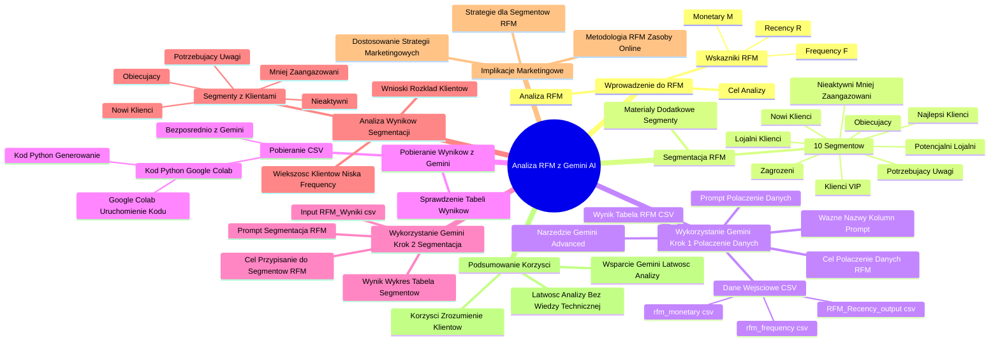

# Lekcje wideo - 6. Analiza segmentów

# 💡 Diagram

___

# 🗒️ Notatka

# Notatki i Podsumowanie Wideo: Umiejętności Jutra AI - Analiza RFM z Gemini

## Wprowadzenie

Ten dokument zawiera szczegółowe notatki i podsumowanie wideo „Umiejętności Jutra AI”, zorganizowanego przez Google i SGH. Wideo prezentuje praktyczne zastosowanie narzędzia `Gemini AI` do przeprowadzenia **analizy RFM** (Recency, Frequency, Monetary) danych klientów. Celem analizy jest segmentacja i lepsze zrozumienie zachowań zakupowych klientów. Krzysztof Modrzewski z Marketing Masters demonstruje krok po kroku, jak wykorzystać Gemini do automatyzacji analizy RFM, co przekłada się na efektywniejsze działania marketingowe.

## Notatki Szczegółowe

### 1. Wprowadzenie do Analizy RFM ([00:00:05] - [00:00:50])

* **Analiza RFM** (Recency, Frequency, Monetary) to metoda segmentacji klientów oparta na ich zachowaniach zakupowych.
* **Krzysztof Modrzewski** z Marketing Masters przedstawia analizę RFM jako narzędzie do lepszego poznania klientów.
* **Trzy kluczowe wskaźniki RFM:**
    * **Recency (R):** Czas od ostatniej transakcji klienta. ⏱️
        * Skala 1-5: 5 – bardzo niedawno, 1 – bardzo dawno.
    * **Frequency (F):** Częstotliwość transakcji klienta. 🔄
        * Skala 1-5: 5 – bardzo często, 1 – bardzo rzadko.
    * **Monetary (M):** Wartość wydatków klienta. 💰
        * Skala 1-5: 5 – bardzo duże wydatki, 1 – bardzo małe wydatki.
* **Cel analizy RFM:** Segmentacja klientów na grupy, aby precyzyjniej dopasować działania marketingowe. 🎯

### 2. Segmentacja RFM ([00:00:50] - [00:01:12])

* **Podstawowa segmentacja RFM wyróżnia 10 segmentów:**
    * Najlepsi klienci 🏆
    * Lojalni klienci 💖
    * Potencjalni lojalni
    * Nowi klienci 🆕
    * Obiecujący
    * Potrzebujący uwagi ⚠️
    * Zagrożeni ❗
    * Nieaktywni i mniej zaangażowani
    * Klienci VIP 💎
* **Materiały dodatkowe:** Szczegółowa charakterystyka segmentów zostanie udostępniona w materiałach dodatkowych. 📄

### 3. Wykorzystanie Gemini do Analizy RFM - Krok 1: Połączenie Danych ([00:01:21] - [00:02:57])

* **Cel:** Wykorzystanie Gemini do przypisania wartości R, F i M każdemu klientowi oraz podsumowania rozkładu klientów w segmentach.
* **Narzędzie:** `Gemini Advanced`.
* **Krok 1:** Połączenie danych z trzech plików CSV (`rfm_monetary.csv`, `rfm_frequency.csv`, `RFM_Recency_output.csv`) zawierających wyniki analizy Recency, Frequency i Monetary. łączenie danych 🔗
* **Prompt dla Gemini:**
    > Załaduj trzy pliki: `rfm_monetary.csv`, `rfm_frequency.csv`, `RFM_Recency_output.csv`. Każdy z plików zawiera dane RFM dla klientów z kolumną `ID Klienta`. Połącz dane z tych plików po kolumnie `ID Klienta` i wygeneruj pełne wartości RFM dla każdego unikalnego klienta według następujących zasad:
    > * Recency: Pobierz wartość z pola `Recency Segment` w pliku `RFM_Recency_output.csv`.
    > * Frequency: Pobierz wartość z pola `Segment Frequency` w pliku `rfm_frequency.csv`.
    > * Monetary: Pobierz wartość z pola `Segment Monetary` w pliku `rfm_monetary.csv`.
    > Wyniki przedstaw w formie tabeli z kolumnami: `ID Klienta`, `Recency`, `Frequency`, `Monetary`. W przypadku brakujących wartości oznacz je jako `Brak danych`. Na końcu wygeneruj plik CSV o nazwie `RFM_Wyniki.csv` zawierający tę tabelę.
* **Ważne:** Precyzyjne określenie nazw kolumn w plikach CSV w prompcie, aby Gemini poprawnie zidentyfikował dane. 🔑
* **Wynik:** Gemini generuje tabelę z połączonymi danymi RFM i opcjonalnie plik CSV (`RFM_Wyniki.csv`) do pobrania. ✅

### 4. Pobieranie Wyników z Gemini ([00:02:57] - [00:04:03])

* **Sprawdzenie wyników:** Gemini prezentuje przykładową tabelę z ID klienta i wartościami R, F, M. 👀
* **Pobieranie pliku CSV:** ⬇️
    * Jeśli Gemini od razu wygeneruje plik do pobrania – idealnie. 👍
    * Jeśli nie, należy poprosić o kod (Python) i wykorzystać `Google Colab`.
* **Kod Python:** Gemini generuje kod Python do połączenia danych i zapisania do pliku CSV. 🐍
* **Google Colab:** Kod Python jest kopiowany do Google Colab, pliki CSV są dodawane do Colaba, a kod jest uruchamiany w celu wygenerowania pliku `RFM_Wyniki.csv`. 💻

### 5. Wykorzystanie Gemini do Analizy RFM - Krok 2: Przypisanie do Segmentów ([00:04:13] - [00:05:25])

* **Cel:** Przypisanie klientów do konkretnych segmentów RFM przez Gemini. 🎯
* **Input:** Plik `RFM_Wyniki.csv` (wygenerowany w kroku 1). 📥
* **Prompt dla Gemini:** (Prompt nie został w pełni pokazany, ale zawierał informacje o segmentach i zasadach przypisywania na podstawie wartości R, F, M). Prompt definiuje 10 segmentów RFM i reguły przypisania klientów do tych segmentów w oparciu o wartości Recency, Frequency i Monetary. ⚙️
* **Wynik:** Gemini generuje wykres słupkowy i tabelę przedstawiającą liczbę klientów w poszczególnych segmentach RFM. 📊

### 6. Analiza Wyników Segmentacji ([00:05:25] - [00:06:19])

* **Rezultat analizy:** Większość klientów nie została przypisana do żadnego z 10 segmentów, ponieważ ich wartość Frequency (F) przeważnie wynosi 1. 🧐
* **Segmenty z klientami:** Klienci mniej zaangażowani, nieaktywni, nowi klienci, obiecujący, potrzebujący uwagi. 👥
* **Wnioski:** Analiza ukazuje rzeczywisty rozkład klientów i ujawnia, że większość klientów charakteryzuje się niską częstotliwością zakupów. 💡

### 7. Implikacje Marketingowe i Dalsze Działania ([00:06:19] - [00:07:00])

* **Dostosowanie strategii marketingowych:** Analiza RFM umożliwia personalizację działań marketingowych w zależności od segmentu klienta. 🛍️
* **Strategie marketingowe dla segmentów RFM:** W Internecie dostępne są liczne materiały i sprawdzone strategie marketingowe dla każdego segmentu RFM (np. postępowanie z najlepszymi klientami, klientami zagrożonymi, potencjalnie lojalnymi, etc.). 🌐
* **Metodologia RFM:** Jest powszechnie znana i ceniona, dostępnych jest wiele zasobów online. 📚

### 8. Podsumowanie i Korzyści z Wykorzystania Gemini ([00:07:00] - [00:07:10])

* **Wsparcie Gemini:** Ułatwia przeprowadzenie analizy RFM na własnych danych. 🚀
* **Korzyści:** Lepsze zrozumienie klientów i skuteczniejsze dopasowanie działań marketingowych. 👍
* **Łatwość analizy:** Gemini umożliwia przeprowadzenie analizy RFM bez specjalistycznej wiedzy technicznej. ✨

## Podsumowanie

Wideo „Umiejętności Jutra AI” demonstruje praktyczne zastosowanie narzędzia **`Gemini AI`** do przeprowadzenia **analizy RFM** danych klientów. Krzysztof Modrzewski krok po kroku pokazuje, jak za pomocą **`Gemini Advanced`** można połączyć dane z różnych plików CSV, przypisać wartości **Recency, Frequency, Monetary (RFM)** klientom, a następnie dokonać segmentacji klientów na ich podstawie. Prezentacja ilustruje wykorzystanie **promptów** w Gemini do instrukcji łączenia danych i segmentacji, a także użycie **`Google Colab`** do pobrania wyników w formacie pliku CSV, w sytuacji gdy Gemini bezpośrednio nie oferuje opcji pobrania pliku.

Analiza RFM pozwala na identyfikację różnorodnych segmentów klientów, takich jak najlepsi, lojalni, zagrożeni, czy nieaktywni. W zaprezentowanym przykładzie, analiza ujawniła, że większość klientów charakteryzuje się niską częstotliwością zakupów i nie kwalifikuje się do typowych segmentów RFM, co dostarcza istotnych informacji dla dalszych działań marketingowych. Dzięki Gemini, analiza RFM staje się przystępna i łatwa w realizacji, umożliwiając firmom lepsze zrozumienie swoich klientów oraz efektywniejsze planowanie strategii marketingowych, dostosowanych do konkretnych segmentów. Metodologia RFM jest szeroko stosowana i udokumentowana, a Gemini znacząco upraszcza jej praktyczne wdrożenie.

___

# 🔉 Transcript
File: Lekcje wideo - 6. Analiza segmentów.mp4 
[00:00:00] Ekran: Białe tło z pionową czarną kreską po lewej stronie.
[00:00:01] Ekran: Napis "Umiejętności" w kolorze czarnym, poniżej napis "Jutra" również w kolorze czarnym.
[00:00:02] Ekran: Po prawej stronie napisu pojawia się logo "AI" w kolorach fioletowo-niebieskich.
[00:00:03] Ekran: Pod napisem "Umiejętności Jutra AI" pojawiają się napisy "Organizator Google" i "Partner edukacyjny SGH".
[00:00:05] Krzysztof Modrzewski: Zrobiliśmy poszczególne analizy RFM.
[00:00:07] Ekran: Pod spodem pojawia się pasek z napisem "Krzysztof Modrzewski" oraz "Head of education + Marketing Masters".
[00:00:07] Krzysztof Modrzewski: Z jednej strony dzięki temu wiesz już ile dni minęło do ostatniej transakcji twoich klientów, wiesz ile transakcji wykonali i wiesz ile na nich zarobiłeś, zarobiłaś.
[00:00:17] Krzysztof Modrzewski: Ale oprócz tego każdemu użytkownikowi w tych trzech obszarach przypisaliśmy wartość od jeden do pięć w celu właśnie późniejszej segmentacji.
[00:00:26] Krzysztof Modrzewski: Przypominam, że w recency 5 to bardzo niedawno, a jeden bardzo, bardzo dawno.
[00:00:31] Krzysztof Modrzewski: Frequency 5 to bardzo często, a jeden bardzo rzadko, bardzo mało.
[00:00:36] Krzysztof Modrzewski: A w monetary 5 to bardzo duże wydatki i jeden bardzo małe wydatki.
[00:00:41] Krzysztof Modrzewski: I teraz jak już mamy te wartości to możemy przejść do samej segmentacji RFM i sprawdzić ilu mamy klientów w poszczególnych grupach.
[00:00:50] Krzysztof Modrzewski: Taka podstawowa, taka podstawowa, podstawowa segmentacja RFM wyróżnia 10 segmentów.
[00:00:56] Krzysztof Modrzewski: Najlepsi klienci, lojalni klienci, potencjalni, potencjalnie lojalni, nowi klienci, obiecujący, potrzebujący uwagi, zagrożeni, nieaktywni i mniej zaangażowani oraz na samym końcu klienci VIP.
[00:01:12] Krzysztof Modrzewski: Nie będę tutaj omawiał konkretne charakterystyki każdego z tych segmentów, ale w materiałach dodatkowych przygotuję dokładną rozpiskę, która mam nadzieję, że ci się przyda.
[00:01:21] Krzysztof Modrzewski: A wracając do tematu, skoro mamy już te wartości, wiemy jakie są segmenty, to niech teraz Gemini zrobi nam analizę i przypisze każdemu klientowi wartość R, F i M, a następnie podsumuje nam jaki mamy rozkład klientów w tych poszczególnych segmentach.
[00:01:38] Krzysztof Modrzewski: To co?
[00:01:39] Krzysztof Modrzewski: Ciekawy, ciekawa?
[00:01:41] Krzysztof Modrzewski: Przejdźmy do działania.
[00:01:42] Ekran: Po prawej stronie pojawia się okno z Gemini Advanced. Na ekranie widnieje napis "Cześć, Krzysztof".
[00:01:42] Krzysztof Modrzewski: Teraz wykorzystamy Gemini do zrobienia takiej pełnej analizy segmentów trzech jakby krokach, w dwóch krokach tak naprawdę.
[00:01:49] Krzysztof Modrzewski: W pierwszym kroku prosimy, żeby nam połączył wszystkie dane w jednym pliku, żebyśmy mieli ID klienta i informacje jaki jest jego wynik w recency, jaki jest jego wynik w frequency i jaki jest jego wynik w monetary w tych wartościach liczbowych, które sobie zrobiliśmy.
[00:02:03] Krzysztof Modrzewski: W tym celu dodaję te trzy wygenerowane analizy, które wygenerowałem w poprzednich krokach, czyli w recency frequency monetary.
[00:02:11] Krzysztof Modrzewski: Dodaję te trzy pliki CSV no i piszę odpowiedniego prompta po to, żeby Gemini wykonał to zadanie.
[00:02:17] Ekran: Pojawia się okno z napisem "Załaduj trzy pliki: rfm_monetary.csv, rfm_frequency.csv, RFM_Recency_output.csv. Każdy z plików zawiera dane RFM dla klientów z kolumną ID Klienta. Połącz dane z tych plików po kolumnie ID Klienta i wygeneruj pełne wartości RFM dla każdego unikalnego klienta według następujących zasad: Recency: Pobierz wartość z pola Recency Segment w pliku RFM_Recency_output.csv. Frequency: Pobierz wartość z pola Segment Frequency w pliku rfm_frequency.csv. Monetary: Pobierz wartość z pola Segment Monetary w pliku rfm_monetary.csv. Wyniki przedstaw w formie tabeli z kolumnami: ID Klienta, Recency, Frequency, Monetary. W przypadku brakujących wartości oznacz je jako Brak danych. Na końcu wygeneruj plik CSV o nazwie RFM_Wyniki.csv zawierający tę tabelę."
[00:02:54] Krzysztof Modrzewski: No i tutaj co jest ważne, ja mu podałem konkretną, konkretne pole, konkretną kolumnę z której ma wziąć wartość z każdym pliku, żeby nie miał wątpliwości i żeby to wszystko było okej, no bo tam są różne różne wartości w tych plikach.
[02:03:00] Krzysztof Modrzewski: No i poprosiłem na końcu wynik przedstaw w formie tabeli z kolumnami ID klienta, recency frequency monetary w przypadku brakujących wartości oznacz jako brak danych na końcu wygeneruj plik CSV zawierający tą tabelę.
[00:02:54] Krzysztof Modrzewski: Prześlijmy to do analizy.
[00:02:56] Ekran: Trwa analiza.
[00:02:57] Ekran: Po lewej stronie widnieją nazwy plików: rfm_monetary.csv, rfm_frequency.csv, RFM_Recency_output.csv. Poniżej napis "Analiza zakończona". Poniżej znajduje się tabela z danymi: ID Klienta, Recency, Frequency, Monetary. Pod tabelą napis "Eksportuj do Arkuszy".
[00:02:57] Ekran: Poniżej znajduje się wykres słupkowy: Liczba klientów w segmentach RFM.
[00:02:57] Ekran: Poniżej znajduje się tabela z danymi: Segment, Liczba klientów.
[00:02:57] Krzysztof Modrzewski: Analiza zakończona.
[00:02:58] Krzysztof Modrzewski: Dostaliśmy przykładową tabelę z wynikami, takie pięć wartości, gdzie mam ID klienta i mamy wynik w recency frequency monetary danego klienta.
[00:03:06] Krzysztof Modrzewski: Jeżeli twój Gemini wygenerował ci od razu plik do pobrania, to super, jeżeli nie robimy to samo co w poprzednich krokach, czyli pokaż kod.
[00:03:13] Ekran: Pojawia się kod w języku Python.
[00:03:13] Krzysztof Modrzewski: Sprawdzamy czy ten kod składa się z jednego czy z kilku części.
[00:03:17] Krzysztof Modrzewski: Jeżeli składa się z kilku części, w tym przypadku z dwóch, to dla pewności poproszę tutaj Gemini, żeby przygotował mi pełny kod Pythona do skopiowania i wklejenia do Google Colab.
[00:03:28] Ekran: Trwa analiza.
[00:03:34] Ekran: Pojawia się kod w języku Python.
[00:03:39] Krzysztof Modrzewski: Udało się, kopiuję ten kod.
[00:03:40] Ekran: Przechodzi do Google Colab.
[00:03:40] Ekran: Po lewej stronie widnieją nazwy plików: sample_data, Transakcje_Sklepu_Internetowego.csv, Frequency_analysis.csv, rfm_segment_monetary.csv, sesje_transakcji.csv.
[00:03:40] Ekran: Po prawej stronie widnieje kod w języku Python.
[00:03:40] Krzysztof Modrzewski: Przechodzę do Colabu, klikam plusik nowy kod, wklejam tutaj ten ten kod.
[00:03:47] Krzysztof Modrzewski: Upewniam się, że te pliki są tutaj dodane w Colabie, klikam play po to, żeby on z tych plików po prostu mógł skorzystać.
[00:03:55] Krzysztof Modrzewski: No i czekam na wyniki stworzenia pliku, który będzie się nazywał RFM_Wyniki.
[00:04:03] Ekran: Po lewej stronie pojawia się plik RFM_Wyniki.csv.
[00:04:03] Krzysztof Modrzewski: RFM wyniki mam, mogę to pobrać na komputer i wykorzystać do różnego rodzaju dalszych analiz czy działań marketingowych.
[00:04:13] Krzysztof Modrzewski: Tutaj dostałem już przykład jak ta tabelka wygląda, więc już nie będę ci pokazywał w pliku CSV, ale to jeszcze nie koniec, bo mamy już zrobioną analizę, to teraz chciałbym, żeby Gemini przypisał mi użytkowników do konkretnych segmentów, o tych segmentach mówiłem przed chwilą w tej części bardziej teoretycznej zanim tutaj przeszliśmy i to samo chciałbym, żeby zrobił mi tutaj Gemini.
[00:04:43] Krzysztof Modrzewski: Więc wklejam przygotowany prompt i załaduję od razu ten plik z tą analizą RFM wykonaną przed chwilą, gdzie mam ID klienta i te wartości.
[00:04:52] Krzysztof Modrzewski: No i w tym prompcie informuję Gemini do jakich segmentów chciałbym, żeby przypisał użytkowników według jakich zasad i to jest te 10 segmentów, o których mówiłem wcześniej, tych najpopularniejszych i zasady na podstawie tych trzech atrybutów jak użytkowników ma przypisać.
[00:05:10] Krzysztof Modrzewski: Oczywiście w RFM tych segmentów może być dużo więcej, w internecie możesz znaleźć dużo dokładniejsze tutaj analizy, aczkolwiek oczywiście ten prompt jest dla ciebie do wykorzystania w materiałach.
[00:05:19] Krzysztof Modrzewski: W każdym razie teraz robię prześlij i zobaczymy ilu użytkowników mam w których segmentach.
[00:05:24] Ekran: Trwa analiza.
[00:05:25] Ekran: Pojawia się wykres słupkowy: Liczba klientów w segmentach RFM.
[00:05:25] Ekran: Poniżej znajduje się tabela z danymi: Segment, Liczba klientów.
[00:05:25] Krzysztof Modrzewski: Analiza zakończona.
[00:05:26] Krzysztof Modrzewski: No i co się okazało?
[00:05:27] Krzysztof Modrzewski: Okazało się, że głównie mam przypisanych użytkowników do segmentu, którego, który nie istnieje, który jest pusty, którego nie ma, ponieważ po prostu ze względu na frequency, które u wszystkich jest jeden w zdecydowanej większości i dlatego oni mi tutaj wypadli jakby z tej z tych zasad przypisania do segmentów.
[00:05:53] Krzysztof Modrzewski: Mam, widzę, że mam użytkowników klientów mniej zaangażowanych, nieaktywnych, mam trochę nowych klientów, mam tutaj klientów obiecujących, potrzebujący uwagi.
[00:06:03] Krzysztof Modrzewski: No to jest ciekawe, tutaj właśnie mam rozpiskę ilu klientów mam w poszczególnych tych segmentach i widzę, że po prostu w innych segmentach nie mam żadnego klienta, a większość moich użytkowników moich klientów w ogóle nie wpadło do żadnego z tych segmentów według zasad, które miałem tutaj rozpisane.
[00:06:19] Krzysztof Modrzewski: Więc to też pokazuje jaki mam rozkład klientów, dane nie kłamią i teraz na podstawie tego mogę podjąć kolejne nowe działania marketingowe.
[00:06:30] Krzysztof Modrzewski: W twoim przypadku, jeżeli masz rozkład tych klientów na różne segmenty, to tak naprawdę do każdego z tych segmentów, czy to najlepszych klientów, czy w zagrożeniu czy at risk czy potencjalnie lojalnych i tak dalej, to do każdego z tych segmentów tak naprawdę w internecie możesz znaleźć strategie marketingowe do działania, jak z daną grupą klientów się obchodzić, ponieważ metodologia działania RFM jest bardzo szeroka, bardzo znana i bardzo ważna i dużo materiałów w internecie na ten temat tej metodologii jest.
[00:07:00] Krzysztof Modrzewski: Teraz dzięki właśnie wsparciu Gemini taką analizę możesz wykonać na podstawie swoich własnych danych, dzięki temu poznasz lepiej swoich klientów i dopasować działania marketingowe.
[00:07:10] Krzysztof Modrzewski: To co?
[00:07:10] Krzysztof Modrzewski: Myślę, że w tym przypadku to było na tyle i możemy przejść do bardzo krótkiego podsumowania.
[00:07:16] Ekran: Napis "Umiejętności" w kolorze czarnym, poniżej napis "Jutra" również w kolorze czarnym.
[00:07:17] Ekran: Po prawej stronie napisu pojawia się logo "AI" w kolorach fioletowo-niebieskich.
[00:07:17] Ekran: Pod napisem "Umiejętności Jutra AI" pojawiają się napisy "Organizator Google" i "Partner edukacyjny SGH".
[00:07:19] Ekran: Białe tło.

___
# 🏷️ Tags
#AI #Umiejętności_Jutra_AI #Google #SGH #Gemini #Gemini_AI #Gemini_Advanced #analiza_RFM #RFM #Recency #Frequency #Monetary #segmentacja_klientów #zachowania_zakupowe #Krzysztof_Modrzewski #Marketing_Masters #dane_klientów #segmenty_RFM #najlepsi_klienci #lojalni_klienci #potencjalni_lojalni #nowi_klienci #obiecujący #potrzebujący_uwagi #zagrożeni #nieaktywni #mniej_zaangażowani #klienci_VIP #działania_marketingowe #personalizacja_marketingu #strategie_marketingowe #ID_Klienta #plik_CSV #Google_Colab #Python #prompt #łączenie_danych #brak_danych #rozklad_klientow #częstotliwość_zakupów #wiedza_techniczna
