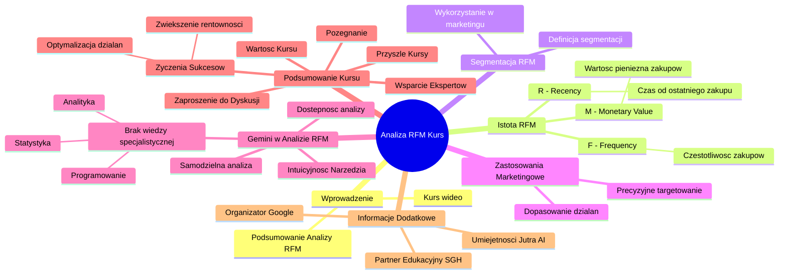

# Lekcje wideo - 7. Podsumowanie

# 💡 Diagram

___

# 🗒️ Notatka

# Podsumowanie i Notatki z Analizy RFM

## Wprowadzenie

Ten kurs wideo 📹 omawia analizę **RFM** (`Recency`, `Frequency`, `Monetary Value`) i jej zastosowanie w marketingu. Wyjaśnia, czym jest analiza **RFM**, definiuje elementy `R`, `F` i `M`, oraz demonstruje, jak segmentacja **RFM** wspiera działania marketingowe. Kurs prezentuje również, jak wykorzystać narzędzie `Gemini` do samodzielnego przeprowadzenia analizy **RFM**, nawet bez specjalistycznej wiedzy z zakresu analityki, statystyki czy programowania.

## Kluczowe Aspekty Kursu RFM

- **Podsumowanie Analizy RFM:** Kurs stanowi esencję wiedzy i podsumowanie zagadnień związanych z analizą **RFM**.
- **Istota RFM:** Wyjaśnienie koncepcji **RFM** i jej składowych:
    - **R (Recency - Czas od ostatniego zakupu):** Określa, jak dawno klient dokonał ostatniej transakcji 🛒.
    - **F (Frequency - Częstotliwość zakupów):** Mierzy, jak często klient robi zakupy 🛍️.
    - **M (Monetary Value - Wartość pieniężna zakupów):** Informuje, ile pieniędzy klient wydał na zakupy 💰.
- **Segmentacja RFM:** Kurs tłumaczy, na czym polega segmentacja klientów w oparciu o analizę **RFM** i jak efektywnie wykorzystać ją w strategiach marketingowych.
- **Praktyczne Zastosowania Marketingowe:** Prezentacja, w jaki sposób segmentacja **RFM** umożliwia precyzyjniejsze dopasowanie działań marketingowych do zróżnicowanych grup klientów.

## Wykorzystanie Gemini w Analizie RFM

- **Samodzielna Analiza RFM z Gemini:** Kurs pokazuje, jak narzędzie `Gemini` umożliwia samodzielne przeprowadzenie analizy **RFM**.
- **Dostępność Analizy RFM:** Podkreślenie, że do przeprowadzenia analizy **RFM** za pomocą `Gemini` nie jest wymagana zaawansowana wiedza z dziedzin takich jak:
    - Analityka
    - Statystyka
    - Programowanie 💻
- **Gemini - Narzędzie Dostępne i Intuicyjne:** Zwrócenie uwagi na to, że `Gemini` jest narzędziem łatwo dostępnym i prostym w obsłudze, oferującym wsparcie w procesie analizy **RFM**.

## Podsumowanie Kursu i Kolejne Kroki

- **Wartość Kursu:** Wyrażenie przekonania, że kurs okazał się wartościowy i wzbogacił wiedzę uczestników.
- **Zaproszenie do Dyskusji:** Zachęta do zadawania pytań i kontaktu w przypadku wątpliwości dotyczących analizy **RFM**.
- **Wsparcie Ekspertów:** Zapewnienie o gotowości zespołu do udzielenia pomocy w zakresie analizy **RFM**.
- **Życzenia Sukcesów w Analizie:** Życzenia owocnych analiz i efektywnego wykorzystania zdobytej wiedzy w celu:
    - Optymalizacji działań marketingowych.
    - Zwiększenia rentowności przedsiębiorstwa 📈.
- **Zapowiedź Przyszłych Kursów:** Wyrażenie nadziei na ponowne spotkanie podczas kolejnych szkoleń.
- **Pożegnanie:**  "Do zobaczenia!" 👋 -  nieformalne zakończenie kursu.

## Informacje Dodatkowe

- **Umiejętności Jutra AI:** Nazwa inicjatywy edukacyjnej.
- **Organizator: Google:**  `Google` jako organizator projektu.
- **Partner Edukacyjny: SGH:**  `Szkoła Główna Handlowa` w Warszawie jako partner edukacyjny.

## Podsumowanie Końcowe

Kurs skutecznie wprowadza w tematykę analizy **RFM** i jej praktyczne zastosowania w marketingu. Kluczowe jest zaprezentowanie narzędzia `Gemini` jako przystępnego i prostego sposobu na samodzielne przeprowadzenie tej analizy, nawet dla osób bez specjalistycznej wiedzy technicznej. Kurs motywuje do wykorzystania analizy **RFM** w celu usprawnienia strategii marketingowych i podniesienia zysków firmy.

___

# 🔉 Transcript
File: Lekcje wideo - 7. Podsumowanie.mp4 
[00:00:05] I tak już doszliśmy do końca analizy RFM.
[00:00:08] Mam nadzieję, że dzięki temu całemu kursowi wiesz już czym jest RFM, na czym polegają poszczególne analizy R, F i M i na czym polega segmentacja RFM i jak możesz to wykorzystać marketingowo.
[00:00:22] Pokazałem ci również jak za pomocą Gemini możesz samodzielnie zrobić sobie takie analizy już teraz.
[00:00:29] Nie mając wiedzy z zakresu analityki, nie mając wiedzy z zakresu statystyki, nie znając programowania, właśnie wszystko możemy do tego wszystkiego wykorzystać Gemini i uzyskać potrzebną pomoc.
[00:00:44] Mam nadzieję, że ten kurs ci się przydał.
[00:00:46] Przypominam, że jeżeli masz jakiekolwiek pytania w tym obszarze, to śmiało możesz nam dawać znać.
[00:00:52] Chętnie pomożemy razem z całym zespołem, a tymczasem życzę ci udanych analiz i tak naprawdę wykorzystaniu tej nowej wiedzy o twoich klientach do lepszego dopasowania działań marketingowych i na końcu większych zysków w twojej firmie.
[00:01:08] To co?
[00:01:09] Mam nadzieję, że widzimy się w innym kursie.
[00:01:11] W takim razie ja się nie żegnam i mówię do zobaczenia.
[00:01:14] (Ekran: Umiejętności Jutra AI. Organizator: Google. Partner edukacyjny: SGH)

___
# 🏷️ Tags
#RFM_analysis #RFM #Recency #Frequency #Monetary_Value #segmentacja_RFM #marketing #Gemini #analityka #statystyka #programowanie #kurs #szkolenie #optymalizacja_marketingu #rentowność #Umiejętności_Jutra_AI #Google #SGH #Szkoła_Główna_Handlowa #klienci #analiza_klientów #działania_marketingowe #zyski #wiedza #wiedza_o_klientach #wsparcie_ekspertów #pytania #odpowiedzi #pomoc #zespół #transakcje #zakupy #wartość_pieniężna #strategie_marketingowe #narzędzie_Gemini #samodzielna_analiza #dostępność_analizy #intuicyjne_narzędzie
