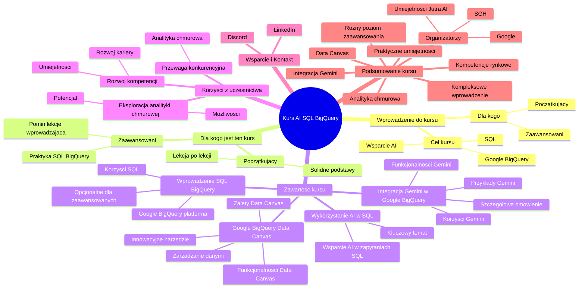

# Lekcje wideo - 1. Wstęp

# 💡 Diagram

___

# 🗒️ Notatka

# Kurs: Wykorzystanie `AI` w `SQL` i `Google BigQuery` - Szczegółowe Notatki i Podsumowanie

## Wprowadzenie do Kursu

Kurs ma na celu nauczenie uczestników, jak efektywnie wykorzystać **wsparcie `AI`** w kontekście **pisania zapytań `SQL`** oraz pracy z narzędziem **`Google BigQuery`**. Jest on skierowany zarówno do **osób początkujących**, które nie miały dotychczas styczności z `SQL`-em i `Google BigQuery`, jak i **doświadczonych użytkowników**, pragnących poznać nowe możliwości, jakie `AI` oferuje w tych obszarach.

## Dla Kogo Jest Ten Kurs?

* **Początkujący:** Osoby bez doświadczenia w pisaniu zapytań `SQL` i korzystaniu z `Google BigQuery`.  Zaleca się realizację kursu lekcja po lekcji, aby zbudować solidne podstawy.
* **Zaawansowani:** Użytkownicy z praktyką w `SQL` i `Google BigQuery`, którzy logowali się do platformy i tworzyli zapytania. Mogą oni pominąć lekcję wprowadzającą, skupiającą się na argumentacji, dlaczego warto uczyć się `SQL`-a.

## Zawartość Kursu

Kurs obejmuje następujące kluczowe zagadnienia:

1. **Wprowadzenie do `SQL` i `Google BigQuery` (lekcja opcjonalna dla zaawansowanych):**
    - Omówienie korzyści płynących z nauki `SQL`-a i jego praktycznych zastosowań.
    - Prezentacja platformy `Google BigQuery`.

2. **Wykorzystanie Sztucznej Inteligencji w Nauce `SQL`-a i Pisaniu Zapytań `SQL`:**
    - **Kluczowy temat kursu.**
    - Praktyczne zastosowanie `AI` jako wsparcia w procesie tworzenia zapytań `SQL`.

3. **Integracja `Gemini` w `Google BigQuery`:**
    - Szczegółowe omówienie integracji **`Gemini`** bezpośrednio z **`Google BigQuery`**.
    - Demonstracja funkcjonalności integracji.
    - Praktyczne przykłady i korzyści z wykorzystania `Gemini` w `BigQuery`.

4. **`Google BigQuery Data Canvas`:**
    - Prezentacja **`Google BigQuery Data Canvas`** - innowacyjnego narzędzia usprawniającego zarządzanie zbiorami danych w `Google BigQuery`.
    - Charakterystyka funkcjonalności i zalet `Data Canvas`.

## Korzyści z Uczestnictwa w Kursie

* **Przewaga Konkurencyjna:** Zdobądź umiejętności, które zapewnią Twojej organizacji znaczącą przewagę konkurencyjną w dynamicznie rozwijającym się obszarze analityki chmurowej ☁️.
* **Rozwój Kompetencji:** Poszerz swoje kompetencje, zyskując cenne umiejętności przydatne w obecnej pracy i kluczowe dla rozwoju kariery zawodowej 🚀.
* **Eksploracja Analityki Chmurowej:** Odkryj i wykorzystaj pełen potencjał analitycznych rozwiązań chmurowych, otwierając nowe możliwości dla Twojej organizacji i rozwoju zawodowego 🔭.

## Wsparcie i Kontakt

* **Discord i LinkedIn:**  Możliwość zadawania pytań i uzyskiwania wsparcia zarówno na platformie Discord, jak i poprzez bezpośredni kontakt z prowadzącym kurs na LinkedIn.

## Podsumowanie Kursu

Ten kurs oferuje kompleksowe wprowadzenie do efektywnego wykorzystania sztucznej inteligencji w pracy z `SQL`-em i `Google BigQuery`.  Został on zaprojektowany z myślą o uczestnikach o różnym poziomie zaawansowania – od osób początkujących po doświadczonych użytkowników. W trakcie kursu uczestnicy zdobędą praktyczne umiejętności w zakresie tworzenia zapytań `SQL` z wykorzystaniem `AI`, poznają możliwości integracji `Gemini` w `Google BigQuery` oraz zapoznają się z nowym narzędziem `Google BigQuery Data Canvas`. Kurs akcentuje istotną rolę analityki chmurowej i umożliwia zdobycie kompetencji cenionych na rynku pracy, co przełoży się na rozwój kariery i wzmocnienie pozycji konkurencyjnej. Organizatorami kursu są **Umiejętności Jutra `AI`** (Google) oraz partner edukacyjny **SGH**.

___

# 🔉 Transcript
File: Lekcje wideo - 1. Wstęp.mp4 
[00:00:05] Cześć.
[00:00:05] Witam cię w kursie, w którym będziemy się uczyć jak wykorzystać wsparcie AI w tematach takich jak pisanie zapytań SQL i korzystanie z narzędzia Google BigQuery.
[00:00:17] Jeżeli nie wiesz nic o SQL-u, nigdy nie pisałeś, pisałaś zapytań SQL, nigdy nie korzystałeś czy korzystałaś z Google BigQuery, to zachęcam cię do przejścia wszystkich lekcji po kolei.
[00:00:29] Jednak jeżeli masz już doświadczenie w tych obszarach, logowałeś, logowałaś się do Google BigQuery, tworzyłeś czy tworzyłaś jakieś zapytania SQL, to następną lekcję, tą bezpośrednią, możesz pominąć, bo w niej tak naprawdę będziemy się zastanawiać, czy w ogóle warto uczyć się SQL-a i do czego może ci się to przydać.
[00:00:46] Tak samo jeżeli chodzi o Google BigQuery.
[00:00:48] W kolejnych lekcjach będziemy zajmować się tym, jak możemy wykorzystać sztuczną inteligencję do nauki SQL-a i do wsparcia w pisaniu właśnie zapytań SQL.
[00:00:58] Myślę, że to warto wiedzieć.
[01:00:03] Dalej przejdziemy do omówienia integracji Gemini bezpośrednio w Google BigQuery.
[01:05:00] Pokażę jak ona działa, jak można z niej wykorzystać i do czego nam się może przydać, a na końcu omówimy sobie czym jest Google BigQuery Data Canvas, czyli takie, nazwijmy to, nowe rozwiązanie, które jeszcze ułatwia nam zarządzanie naszymi zbiorami danych w hurtowni danych jaką jest Google BigQuery.
[01:22:07] Mam nadzieję, że ta lekcja będzie dla ciebie interesująca, że nauczysz się czegoś nowego i zachęcę cię do eksplorowania właśnie tych analitycznych obszarów chmurowych, bo to może być nową przewagą konkurencyjną w twojej organizacji, albo możesz dzięki temu zdobyć nowe kompetencje, które przydadzą ci się albo w obecnej pracy, albo w rozwoju twojej kariery.
[01:43:54] Mam nadzieję, że cię zachęciłem.
[01:45:18] To co?
[01:45:57] Zapraszam w takim razie do kursu i życzę miłej zabawy, a jeszcze tylko powiem na końcu, że jeżeli w trakcie swojego kursu będziesz mieć jakiekolwiek pytania, to śmiało możesz zadawać je na Discordzie albo bezpośrednio łapać na LinkedInie, gdzie też staram się tej pomocy udzielać.
[01:59:35] To co?
[01:59:50] Nie przedłużając, zaczynajmy.
[02:01:55] (Na ekranie wyświetla się logo "Umiejętności Jutra AI" z informacją o organizatorze - Google oraz partnerze edukacyjnym - SGH.)

___
# 🏷️ Tags
#kurs #AI #SQL #Google_BigQuery #wsparcie_AI #zapytania_SQL #osoby_początkujące #użytkownicy_zaawansowani #Gemini #Google_BigQuery_Data_Canvas #analityka_chmurowa #przewaga_konkurencyjna #rozwój_kompetencji #Discord #LinkedIn #Umiejętności_Jutra_AI #SGH #nauka_SQL #integracja_Gemini #zarządzanie_danymi #hurtownia_danych #kariera_zawodowa
