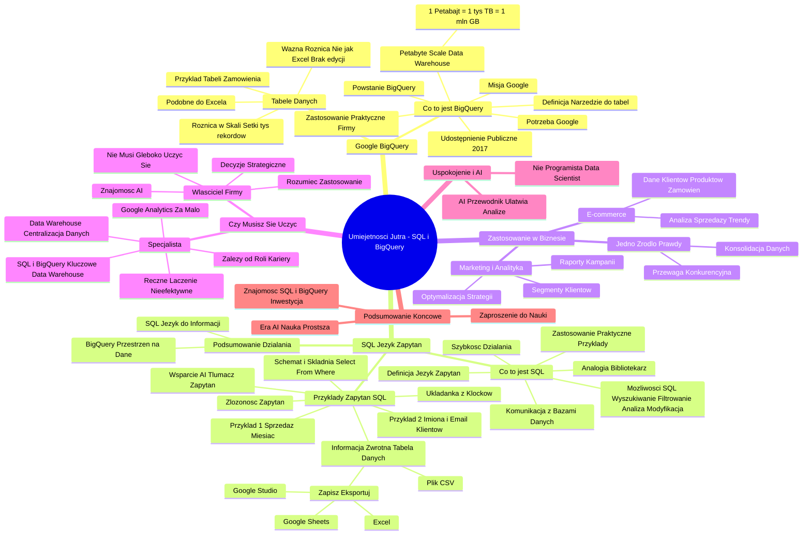

# Lekcje wideo - 2. Czy potrzebuję SQL i Google BigQuery

# 💡 Diagram



___

# 🗒️ Notatka


# Notatki i Podsumowanie: Umiejętności Jutra - SQL i Google BigQuery

## Wprowadzenie

Ten kurs wprowadza w świat **SQL** i **Google BigQuery**. Jego celem jest wyjaśnienie, czym są te technologie, dlaczego warto je poznać oraz jak można je efektywnie wykorzystać w biznesie, zwłaszcza w kontekście sztucznej inteligencji 🤖.

## Co to jest Google BigQuery?

* Misja Google 🎯: Uporządkowanie światowych zasobów informacji, by stały się powszechnie dostępne i użyteczne.
* Potrzeba Google 🔍: Analiza ogromnych zbiorów danych z różnorodnych usług (Wyszukiwarka Google, YouTube, Google Maps, Gmail, etc.).
* Powstanie Google BigQuery 💡: Technologia stworzona do przechowywania i analizowania danych o ogromnej skali.
* Definicja 📚: Narzędzie do efektywnego zarządzania zbiorami tabel danych o zróżnicowanej wielkości.
* `Petabyte scale Data Warehouse` 🗄️: Hurtownia danych skalowalna do petabajtów.
    * 1 Petabajt = 1 tys. Terabajtów = 1 mln GB 🤯 - Imponująca pojemność danych!
* Udostępnienie publiczne (2017) 🌐: Google BigQuery udostępniono jako produkt na platformie chmurowej Google Cloud, umożliwiając firmom przechowywanie i analizowanie danych.
* Praktyczne zastosowanie 💼: Umożliwia firmom wykorzystanie zaawansowanej technologii analizy danych na dużą skalę.

## Tabele Danych w Google BigQuery

* Podobieństwo do arkuszy kalkulacyjnych (Excel) 📊: Tabele danych w BigQuery przypominają arkusze kalkulacyjne, zorganizowane w kolumny i wiersze.
* Przykład tabeli 🛒: Informacje o zamówieniach w sklepie internetowym (np. `Wiersz`, `date_start`, `clicks`, `impressions`, `spend`, `conversions`, `new_campaign_name`).
* Różnica w skali 🚀: Tabele w BigQuery mogą efektywnie obsługiwać setki tysięcy rekordów, zapewniając szybki dostęp do informacji.
* Ważna różnica ⚠️: Tabele w BigQuery nie działają jak tradycyjne arkusze kalkulacyjne – nie umożliwiają bezpośredniego wpisywania danych, zaznaczania komórek czy używania standardowych funkcji.

## Język SQL (Structured Query Language)

* Komunikacja z bazą danych 🗣️: **SQL** to język służący do komunikacji z bazami danych, w tym z Google BigQuery.
* Analogia do bibliotekarza 🧑‍ librarians: **SQL** działa jak "bibliotekarz" w ogromnej bibliotece danych, pomagając w odnajdywaniu potrzebnych informacji.
* Definicja techniczna ⚙️: Język zapytań przeznaczony do pracy z bazami danych.
* Możliwości SQL ✨: Umożliwia wyszukiwanie, filtrowanie, analizowanie, a także dodawanie i modyfikowanie danych.
* Praktyczne zastosowanie ❓: Umożliwia zadawanie danych pytań, na przykład:
    * Pokaż wszystkich klientów, którzy złożyli zamówienia w zeszłym miesiącu.
    * Znajdź produkty, które najlepiej sprzedają się w weekendy.
    * Sprawdź, które kampanie marketingowe przyniosły najwięcej konwersji.
* Szybkość działania ⚡: Odpowiedzi na zapytania **SQL** otrzymywane są niemal natychmiastowo.

## Praktyczne Przykłady Zapytań SQL

* Schemat i składnia 📝: Zapytania **SQL** wykorzystują określone polecenia, takie jak: `select`, `from`, `where`, `group by`, `order by`.
* Przykład 1: Sprzedaż z ostatniego miesiąca:
    sql
    select * from orders where date BETWEEN 'data_początkowa' AND 'data_końcowa'
    ```
* Przykład 2: Imiona i adresy email klientów:
    ```sql
    select name, email from customers
    ```
* Układanka z klocków 🧩: **SQL** przypomina budowanie zapytań z prostych, logicznych elementów.
* Informacja zwrotna 📤: Wynikiem zapytania **SQL** jest tabela danych, którą można:
    * Zapisać.
    * Eksportować do narzędzi (Google Studio, Google Sheets, Excel).
    * Pobrać do pliku CSV.
* Złożoność zapytań 🎛️: Zapytania mogą być proste lub bardzo zaawansowane, np. poprzez łączenie danych z różnych tabel.
* Wsparcie AI 🤖: Sztuczna inteligencja pomaga w tworzeniu nawet bardzo skomplikowanych zapytań **SQL**.
    * Osobisty tłumacz 🗣️: AI działa jak osobisty tłumacz, przekształcając pytania biznesowe na język baz danych.

## Podsumowanie Działania Google BigQuery i SQL

* **Google BigQuery** 🗄️: Przestrzeń do przechowywania tabel z danymi.
* **SQL** 🗣️: Język umożliwiający wydobywanie informacji z tabel przechowywanych w BigQuery.

## Zastosowanie BigQuery i SQL w Biznesie

* **E-commerce** 🛍️:
    * Przechowywanie danych o klientach, produktach, zamówieniach.
    * Analiza sprzedaży, zachowań klientów, stanów magazynowych, trendów.
* **Marketing i Analityka** 📈:
    * Tworzenie szczegółowych raportów o kampaniach.
    * Analiza segmentów klientów.
    * Optymalizacja strategii.
* `Jedno źródło prawdy` 💯: Konsolidacja danych z różnych platform (Google Ads, Meta, TikTok) w jednym miejscu – BigQuery – eliminuje potrzebę ręcznego łączenia danych i buduje przewagę konkurencyjną.

## Czy Musisz Się Uczyć SQL i BigQuery?

* Właściciel firmy 🧑‍💼:
    * Nie musi dogłębnie uczyć się **SQL** ani **BigQuery**.
    * Powinien jednak rozumieć, do czego służą te narzędzia i jak mogą wspierać rozwój biznesu.
    * Decyzje strategiczne 🎯: Właściciel podejmuje kluczowe decyzje dotyczące kierunku rozwoju firmy, zatrudnienia i rozwiązywania problemów.
    * Znajomość nowoczesnych rozwiązań (AI) 💡: Warto być świadomym nowoczesnych rozwiązań, zwłaszcza tych opartych na AI.
* Specjalista (Marketing, Analityka) 🧑‍💻:
    * Wiele zależy od roli i ścieżki kariery.
    * Google Analytics to często za mało 📉: Samo Google Analytics może okazać się niewystarczające w przypadku dużych zbiorów danych.
    * Ręczne łączenie danych (Excel) – nieefektywne ❌: Ręczne łączenie danych z różnych źródeł jest nieefektywne i narażone na błędy.
    * **SQL** i **BigQuery** – kluczowe umiejętności 🔑: Szczególnie istotne przy budowie własnej hurtowni danych (`Data Warehouse`).
    * `Data Warehouse` 🗄️: Umożliwia centralizację danych, tworzenie `jednego źródła prawdy` i przekształcanie danych w działania przynoszące realne rezultaty.

## Uspokojenie i Rola AI

* Nie musisz być programistą ani `Data Scientist` 😊: Dzięki AI, droga do analizy danych staje się prostsza i bardziej dostępna.
* AI jako przewodnik 🧭: AI pełni rolę przewodnika, pomagając efektywnie i bez zbędnych komplikacji osiągnąć zamierzone rezultaty.

## Podsumowanie Końcowe

* Znajomość **SQL** i **Google BigQuery** 🚀: Inwestycja w rozwój osobisty i przyszłość firmy.
* Era AI 🤖: Nauka **SQL** i **BigQuery** staje się prostsza niż kiedykolwiek, dzięki wsparciu sztucznej inteligencji.
* Zaproszenie do dalszej nauki 🤝: Odkryj, jak AI może wspomóc naukę i efektywne wykorzystanie **SQL** i **Google BigQuery**.

## Podsumowanie

Ten materiał wprowadza w świat **SQL** i **Google BigQuery**, wyjaśniając istotę tych technologii i korzyści, jakie oferują biznesowi. **Google BigQuery** to potężna, chmurowa hurtownia danych, idealna do przechowywania i analizy ogromnych zbiorów informacji. **SQL** to język zapytań, umożliwiający interakcję z danymi, ich filtrowanie, analizę i wydobywanie cennych wniosków. Podkreślono, że znajomość tych narzędzi, szczególnie w erze sztucznej inteligencji, jest kluczowa dla rozwoju zarówno firm, jak i specjalistów – właścicieli firm, marketerów i analityków. Zachęcamy do dalszej nauki i eksploracji możliwości, jakie sztuczna inteligencja oferuje w kontekście **SQL** i **Google BigQuery**.
```

___

# 🔉 Transcript
File: Lekcje wideo - 2. Czy potrzebuję SQL i Google BigQuery.mp4<br>
OK. Here is the transcription of the video in Polish, following the instructions:

[00:00:00] Screen: Białe tło.
[00:00:01] Screen: Napis "Umiejętności Jutra" z logiem AI. Pod spodem "Organizator Google" i "Partner edukacyjny SGH".
[00:00:05] Cześć.
[00:00:06] Jak pewnie się domyślasz, chociażby po samej nazwie tego kursu, będzie on dotyczył SQL i Google BigQuery.
[00:00:14] Jeżeli jeszcze nie miałeś, miałaś z nim doświadczenia, to możesz się zastanawiać, czy w ogóle warto się tego uczyć, czy jest mi to potrzebne, czy faktycznie ci się to do czegoś przyda.
[00:00:24] No cóż, odpowiedzmy sobie na te pytania i rozwiejmy wszelkie wątpliwości.
[00:00:30] Ale, zanim do tego przejdziemy, to musimy wyjaśnić sobie, co to jest to Google BigQuery i SQL.
[00:00:36] Zacznijmy od tego pierwszego.
[00:00:38] Firma Google, której misją jest uporządkowanie światowych zasobów informacji tak, by stały się powszechnie dostępne i użyteczne dla każdego, już dawno, dawno temu potrzebowała na swoje potrzeby analizować bardzo, bardzo duże zbiory danych ze wszystkich usług jakie posiadają, tak jak wyszukiwarka Google, YouTube, Google Maps, Gmail, wiele innych.
[00:00:58] W tym celu powstała właśnie technologia nazwana Google BigQuery, która potrafi przechowywać i analizować dane o olbrzymich rozmiarach.
[00:01:06] Innymi słowy, można by powiedzieć, że jest to takie narzędzie do zarządzania zbiorem tabel danych o bardzo różnych wielkościach.
[00:01:14] Screen: "1 Petabajt = 1 Tys. Terabajtów = 1 mln GB"
[00:01:14] Często spotykana komunikacja o Google BigQuery to w ogóle brzmi Petabyte scale Data Warehouse, czyli hurtownia danych skalująca się do rozmiarów petabajtów.
[00:01:22] Dla przypomnienia, jeden petabajt to 1000 terabajtów, czyli 1 milion gigabajtów.
[00:01:30] Dużo, co nie?
[00:01:32] Jako że rozwiązanie to sprawdziło się do wewnętrznych analiz w Google, to w 2017 roku Google BigQuery zostało udostępnione jako produkt do przechowywania i analizowania zbiorów danych na właśnie takiej rozwijającej się platformie chmurowej Google Cloud.
[00:01:47] Dzięki temu każda firma sama mogła z tej technologii skorzystać.
[00:01:52] No dobrze, a jak to wygląda w praktyce, bo na razie to tak sobie gadamy i gadamy.
[00:01:56] Screen: Tabela z danymi. Kolumny: Wiersz, date_start, clicks, impressions, spend, conversions, new_campaign_name.
[00:01:56] Jeżeli chodzi o tabele danych, to przypominają one to co możesz znać z tradycyjnych arkuszy kalkulacyjnych, na przykład Excela.
[00:02:04] Zobacz.
[00:02:05] Tak właśnie może wyglądać przykładowa tabela z informacjami o zamówieniach w sklepie online.
[00:02:10] Przypomina to zwykłą tabelkę, ma kolumny, nagłówki, wiersze.
[00:02:14] W przeciwieństwie jednak do popularnych arkuszy, z których pewnie na co dzień korzystasz, ta tabela może mieć setki tysięcy rekordów i co ważne, dalej być użyteczna i dawać możliwość szybkiego dostępu do informacji.
[00:02:25] To ważne.
[00:02:27] I tutaj przechodzimy do tematu SQL.
[00:02:29] Te tabele w Google BigQuery niestety nie działają tak jak właśnie wspomniany wcześniej zwykły arkusz kalkulacyjny.
[00:02:36] Nie możemy tak po prostu wpisać tam danych, na przykład zaznaczyć komórki czy wpisać jakieś funkcji.
[00:02:42] Z taką bazą danych komunikujemy się za pomocą języka, albo raczej sformułowań SQL, czyli Structured Query Language.
[00:02:51] Wyobraź sobie, że masz ogromną bibliotekę pełną książek, to nasze dane, ale nie masz pojęcia, gdzie co leży.
[00:02:58] SQL w takim wypadku będzie pełnił rolę bibliotekarza, kogoś, kto pomoże ci znaleźć dokładnie te informacje, których potrzebujesz.
[00:03:06] A mówiąc bardziej technicznie, SQL to język zapytań używany do pracy z bazami danych.
[00:03:11] Dzięki niemu możesz wyszukiwać, filtrować, analizować, dodawać lub w ogóle też modyfikować dane przechowywane właśnie w twoich bazach.
[00:03:19] Może to brzmi trochę strasznie, ale spokojnie, nie ma się czego bać.
[00:03:23] W praktyce to po prostu sposób na zadawanie pytań twoim danym.
[00:03:28] Na przykład, pokaż mi wszystkich klientów, którzy zrobili zamówienia w zeszłym miesiącu.
[00:03:33] Znajdź produkty, które sprzedają się najlepiej w weekendy.
[00:03:37] Sprawdź, które kampanie marketingowe przyniosły najwięcej konwersji.
[00:03:41] Dzięki SQL nie musisz przeglądać tych danych ręcznie.
[00:03:44] Wystarczy, że napiszesz właśnie takie jedno zapytanie, a odpowiedź dostaniesz prawie natychmiast.
[00:03:51] Dobrze.
[00:03:52] A jak to wygląda w praktyce, tak bardziej w praktyce?
[00:03:56] Tworząc takie zapytania do bazy, używamy przyjętego schematu i konkretnych, bardzo konkretnych formuł, takich poleceń, na przykład select, from, where, group by, order by i jeszcze kilka innych.
[00:04:09] Spójrz na prosty przykład.
[00:04:11] Załóżmy, że chcesz sprawdzić sprzedaż z ostatniego miesiąca.
[00:04:15] W SQL napisałbyś, napisałabyś coś takiego: select gwiazdka from orders where date, tu podajemy datę, and date i tu dajemy datę końcową.
[00:04:26] Albo jakbyś potrzebował, potrzebowała imiona i adresy email klientów z bazy danych, to zapytanie mogłoby wyglądać tak: select name, email from customers.
[00:04:36] Widzisz?
[00:04:37] To jak taka układanka z klocków.
[00:04:40] Mówisz bazie, wybierz wszystkie zamówienia ze stycznia 2025 roku.
[00:04:46] Proste.
[00:04:47] Tutaj mam tylko jeszcze chyba dwie uwagi.
[00:04:49] Po pierwsze, po wykonaniu takiego zapytania otrzymujemy informację zwrotną zawsze w postaci tabeli, ale takiej tabeli, którą już możemy swobodnie wykorzystać, na przykład zapisać, wyeksportować do innych narzędzi, na przykład Google Studio, Google Sheets, Excel, pobrać w ogóle do pliku CSV.
[00:05:06] A druga kwestia dotyczy tego, że to co pokazałem przed chwilą, ten przykład, to było bardzo proste zapytanie, ale mogą być też zapytania dużo bardziej złożone.
[00:05:16] Na przykład, kiedy chcesz połączyć dane o klientach z ich zamówieniami i z kampaniami marketingowymi, to kod tego zapytania będzie zdecydowanie, zdecydowanie dłuższy, ale spokojnie.
[00:05:27] Nie martw się.
[00:05:28] To właśnie tutaj wkracza sztuczna inteligencja, która pomoże ci tworzyć nawet najbardziej skomplikowane zapytania.
[00:05:34] Tak jak posiadanie takiego osobistego tłumacza, który zamienia twoje biznesowe pytania na język baz danych.
[00:05:42] Podsumowując, w takich żołnierskich słowach, Google BigQuery to miejsce na nasze tabele z danymi.
[00:05:50] Możemy wyciągać informacje z tych tabel za pomocą języka SQL.
[00:05:54] To skoro już to wiemy, to teraz być może zastanawiasz się, do czego możesz właściwie wykorzystać BigQuery SQL w swoim biznesie.
[00:06:03] Cóż, jakby to powiedzieć, lista jest najbardziej długa.
[00:06:07] Chociażby przykładowo, w firmach e-commerce w Google BigQuery możesz przechowywać dane o swoich klientach, o produktach, zamówieniach i na podstawie tych wszystkich danych robić analizę sprzedaży, śledzić zachowania klientów, monitorować stany magazynowe, sprawdzać trendy i wiele, wiele więcej.
[00:06:23] Z kolei w marketingu i analityce, mając wszystkie dane w jednym miejscu, jakim jest właśnie Google BigQuery, możesz tworzyć szczegółowe raporty o kampaniach, analizie segmentów klientów czy w optymalizacji strategii.
[00:06:37] Wyobraź sobie, że zamiast logowania się do wielu kont Google Ads, do kilku kont Meta, do TikToka, pobieranie informacji do arkuszy i później ręcznego łączenia, wszystkie dane masz zebrane i gotowe do wykorzystania właśnie w jednym miejscu.
[00:06:52] Budujesz sobie tak zwane jedno źródło prawdy.
[00:06:56] To jest przewaga konkurencyjna, o którą warto się postarać już teraz.
[00:06:59] Odpowiedzmy sobie w końcu w takim razie na pytanie, czy musisz się właściwie tego uczyć, bo o to zapytałem na początku.
[00:07:07] Jeżeli bierzesz udział w tym programie, to prawdopodobnie albo jesteś specjalistą, specjalistką w firmie działającej w internecie, albo jej właścicielem, właścicielką.
[00:07:16] W tym drugim przypadku sprawa jest prostsza.
[00:07:19] Nie.
[00:07:20] Nie musisz uczyć się SQL, ani poznawać wszystkich zakamarków Google BigQuery, ale, ale uwaga, bo mamy tutaj bardzo ważne ale, musisz wiedzieć do czego te narzędzia służą i jak mogą pomóc w rozwoju twojego biznesu.
[00:07:31] Dlaczego?
[00:07:32] Ponieważ to ty, ty podejmujesz decyzję o kierunku rozwoju firmy, także o zatrudnieniu odpowiednich ludzi czy rozwiązaniu kluczowych problemów.
[00:07:41] Nawet jeżeli sam czy sama nie będziesz na co dzień pracować z danymi, warto znać nowoczesne rozwiązania, zwłaszcza te w tej chwili wspierane przez AI.
[00:07:50] Jeżeli natomiast jesteś specjalistą czy specjalistką, wszystko zależy od tego czym się zajmujesz i w jakim kierunku chcesz się dalej rozwijać.
[00:07:57] Jeżeli pracujesz w marketingu lub analityce, szybko zauważysz, że samo Google Analytics już nie wystarczy.
[00:08:04] Wyciąganie raportów z wielu różnych narzędzi, przyklejanie danych ręcznie do Excela staje się, po pierwsze, nieefektywne, zwłaszcza, szczególnie kiedy zarządzasz dużymi zbiorami danych, no i łatwo popełnić jakiś błąd.
[00:08:16] Ale właśnie tutaj wkraczają SQL i BigQuery.
[00:08:19] Szczególnie, jeżeli rozważasz stworzenie własnej hurtowni danych, czyli własnego Data Warehouse.
[00:08:25] Takie rozwiązanie, czyli właśnie ten Data Warehouse pozwoli ci zebrać wszystkie dane w jednym miejscu, zbudować to jedno źródło prawdy i przekształcić twoje dane w realne działanie, które będzie miało wpływ na twoje wyniki.
[00:08:36] Na koniec chciałbym cię uspokoić.
[00:08:40] Nie musisz od razu stawać się programistą czy programistką czy Data Scientistem.
[00:08:46] Dzięki sztucznej inteligencji ta droga jest w tej chwili dużo, dużo prostsza niż kiedykolwiek wcześniej.
[00:08:53] AI będzie twoim przewodnikiem, pomagając ci osiągnąć to, czego potrzebujesz efektywnie i bez zbędnych komplikacji.
[00:09:01] Jak widzisz, bez względu na to, czy jesteś specjalistką czy właścicielem firmy, to znajomość SQL i BigQuery jest szansą na rozwój, twój i twojej firmy.
[00:09:13] Zwłaszcza w erze AI, kiedy jest to prostsze niż kiedykolwiek wcześniej.
[00:09:17] Co?
[00:09:18] Odkryjmy wspólnie, jak sztuczna inteligencja może nam w tym pomóc.
[00:09:23] Zapraszam do kolejnej lekcji.
[00:09:25] Screen: Napis "Umiejętności Jutra" z logiem AI. Pod spodem "Organizator Google" i "Partner edukacyjny SGH".

[00:09:28] Screen: Białe tło.

I hope this is helpful!

___
# 🏷️ Tags
#SQL #Google_BigQuery #BigQuery #dane #analiza_danych #sztuczna_inteligencja #AI #baza_danych #Data_Warehouse #hurtownia_danych #tabele_danych #język_SQL #Structured_Query_Language #zapytania_SQL #Google_Cloud #e-commerce #marketing #analityka #Excel #Google_Analytics #klienci #produkty #zamówienia #kampanie_marketingowe #konwersje #trendy #bezpieczeństwo_danych #rozwój_biznesu #decyzje_strategiczne #specjalista #właściciel_firmy #umiejętności_jutra #źródło_prawdy #petabajt #Google #Google_Ads #Meta #TikTok #programista #Data_Scientist #Google_Studio #Google_Sheets #CSV #wyszukiwarka_Google #YouTube #Google_Maps #Gmail #platforma_chmurowa #bibliotekarz #SGH #umiejętności_cyfrowe
