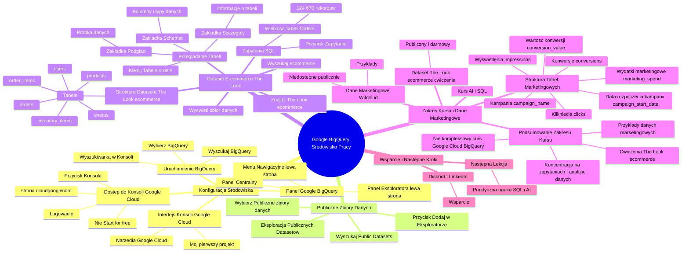

# Lekcje wideo - 3. Przygotowanie środowiska

# 💡 Diagram

___

# 🗒️ Notatka

# Notatki i Podsumowanie Transkrypcji Wideo - Przygotowanie Środowiska Pracy w Google BigQuery

## Wprowadzenie

Ten materiał wideo stanowi wprowadzenie do konfiguracji środowiska pracy, zwanego `piaskownicą (Sandbox)`, w **Google BigQuery**. Celem jest umożliwienie praktycznych ćwiczeń z językiem `SQL` i wykorzystania sztucznej inteligencji (AI) do analizy danych z baz danych. Lekcja ta jest dedykowana osobom, które dopiero zaczynają swoją przygodę z **Google BigQuery**. Jeśli posiadasz już doświadczenie z **Google Cloud** i **BigQuery**, możesz śmiało pominąć ten etap.

## Konfiguracja Środowiska Google BigQuery - Krok po Kroku

### Dostęp do Konsoli Google Cloud

1. **Strona cloud.google.com**: Otwórz przeglądarkę internetową i przejdź na stronę [cloud.google.com](https://cloud.google.com).
2. **Logowanie**: Zaloguj się na swoje konto Google 📧.
3. **Przycisk "Konsola"**: W prawym górnym rogu strony odszukaj i kliknij przycisk **"Konsola"**. **Ważne:** Jeśli Twoim celem jest nauka i testowanie, **nie klikaj przycisku "Start for free"** na tym etapie.

> **Kluczowa informacja:** Przycisk "Start for free" służy do ustawienia profilu płatności, który jest niezbędny do profesjonalnego korzystania z **Google Cloud**. Google oferuje **300 dolarów kredytu na start** na okres 90 dni, co jest wystarczające dla małych i średnich przedsiębiorstw do celów testowych.  Jednak, aby rozpocząć naukę i testy, **konfiguracja profilu płatności nie jest wymagana na samym początku**.

### Interfejs Konsoli Google Cloud

- Po kliknięciu "Konsola" otworzy się **konsola projektu Google Cloud**.
- **"Mój pierwszy projekt (My First Project)"**: Domyślnie, dla nowych kont tworzony jest projekt o nazwie "Mój pierwszy projekt".
- **Dostęp do Narzędzi Google Cloud**: W konsoli uzyskasz dostęp do szerokiego wachlarza narzędzi **Google Cloud**, w tym baz danych 🗄️, serwerów 💻, narzędzi `machine learning` i `AI`, a także **Google BigQuery**.

### Uruchomienie Google BigQuery

1. **Wyszukiwarka w Konsoli**: W górnej części konsoli **Google Cloud** znajduje się pole wyszukiwania.
2. **Wyszukaj "BigQuery"**: Wpisz w wyszukiwarkę frazę "BigQuery" lub "Google BigQuery".
3. **Wybierz BigQuery**: Z wyświetlonych wyników wybierz opcję przejścia do **Google BigQuery** (hurtowni danych 📊).

### Panel Google BigQuery - Przegląd Interfejsu

- **Menu Nawigacyjne (lewa strona)**: Menu po lewej stronie zawiera zaawansowane opcje, które na początku **nie są kluczowe**.
- **Panel Eksploratora (lewa strona)**: Wyświetla listę dostępnych tabel i zbiorów danych. Początkowo może być pusty lub zawierać domyślne elementy, takie jak "Help Tracer", którymi **nie musisz się na razie przejmować**.
- **Panel Centralny**: Główny obszar roboczy, w którym będziesz tworzyć **zapytania SQL**.

### Dostęp do Publicznych Zestawów Danych (`Public Datasets`)

1. **Przycisk "Dodaj" w Eksploratorze**: W panelu Eksploratora kliknij przycisk **"Dodaj"** ➕.
2. **Wyszukaj "Public Datasets"**: W oknie wyszukiwania wpisz frazę **"Public Datasets"**.
3. **Wybierz "Publiczne zbiory danych"**: Kliknij opcję "Publiczne zbiory danych".
4. **Eksploracja Publicznych Datasetów**: Spowoduje to rozwinięcie listy dostępnych publicznych zbiorów danych.

### Wybór Datasetu E-commerce "The Look"

1. **Wyszukaj "e-commerce"**: W wyszukiwarce publicznych datasetów wpisz frazę **"e-commerce"**.
2. **Znajdź "The Look e-commerce"**: Z wyników wyszukiwania wybierz dataset **"The Look e-commerce"**.
3. **"Wyświetl zbiór danych"**: Kliknij "Wyświetl zbiór danych", aby dodać go do Eksploratora.

### Struktura Datasetu "The Look e-commerce"

- Po dodaniu "The Look e-commerce" do Eksploratora, rozwiń go, aby zobaczyć dostępne tabele.
- **Tabele**: Dataset zawiera tabele powiązane z e-commerce, takie jak:
    - `users` (użytkownicy) 🧑‍🤝‍🧑
    - `products` (produkty) 🛍️
    - `orders` (zamówienia) 📦
    - `order_items` (zamówione produkty)
    - `inventory_items` (stan magazynowy)
    - `events` (zdarzenia) 🗓️

### Przeglądanie Tabeli - Schemat, Szczegóły, Podgląd

1. **Kliknij Tabelę**: Wybierz tabelę, na przykład `orders`.
2. **Zakładka "Schemat"**: Wyświetla **kolumny** tabeli oraz ich typy danych. Przykładowe kolumny w tabeli `orders`:
    - `order_id` (numer zamówienia)
    - `user_id` (numer użytkownika)
    - `status` (status zamówienia)
    - `gender` (płeć)
    - `created_at` (data utworzenia zamówienia) 📅
    - `returned_at` (data zwrotu) 📅
    - `shipped_at` (data wysyłki) 📅
    - `num_items_ordered` (liczba zamówionych produktów)
3. **Zakładka "Szczegóły"**: Zawiera szczegółowe informacje o tabeli, na przykład liczbę wierszy.
4. **Zakładka "Podgląd"**: Prezentuje **próbkę danych** z tabeli. Wartości `null` oznaczają brak danych w danym polu.

### Wykonywanie Zapytań SQL

- **Przycisk "Zapytanie"**: Kliknij "Zapytanie", aby otworzyć edytor zapytań `SQL`.
- **Wielkość Tabeli "Orders"**: Tabela `orders` zawiera **124 670 rekordów**. **BigQuery** jest narzędziem stworzonym do pracy z dużymi zbiorami danych, w przeciwieństwie do programów takich jak Excel.

## Zakres Kursu i Dodatkowe Dane Marketingowe

- Kurs skupi się na **wykorzystaniu AI do pozyskiwania informacji z baz danych za pomocą SQL**.
- **Dataset "The Look e-commerce"**: Będzie wykorzystywany do ćwiczeń praktycznych – jest publiczny i darmowy.
- **Dane Marketingowe (Witcloud)**: Kurs zaprezentuje również przykłady z **danymi marketingowymi** (Google Ads, Facebook Ads) dostarczanymi przez narzędzie **Witcloud**. Należy pamiętać, że te dane **nie są publicznie dostępne**.
- **Struktura Tabel Marketingowych**: Tabele marketingowe zawierają informacje dotyczące:
    - Kampanii (`campaign_name`)
    - Konwersji (`conversions`)
    - Wartości konwersji (`conversion_value`)
    - Wydatków marketingowych (`marketing_spend`) 📈
    - Kliknięć (`clicks`)
    - Wyświetleń (`impressions`)
    - Daty rozpoczęcia kampanii (`campaign_start_date`) 📅

## Podsumowanie Zakresu Kursu

- Ćwiczenia praktyczne na **publicznym datasecie "The Look e-commerce"**.
- Przykłady i demonstracje na **danych marketingowych** (niedostępnych publicznie).
- Ten kurs **nie jest kompleksowym szkoleniem z Google Cloud ani Google BigQuery**. Koncentruje się na **zapytaniach i analizie danych**.

## Wsparcie i Następne Kroki

- **Discord i LinkedIn**: W przypadku pytań dotyczących konfiguracji środowiska lub **BigQuery**, zapraszamy na **Discorda** lub do kontaktu przez **LinkedIn**.
- **Następna Lekcja**: Kolejna lekcja poświęcona będzie **praktycznej nauce SQL z wykorzystaniem sztucznej inteligencji**.

## Podsumowanie

Ta lekcja wprowadziła Cię w proces konfiguracji środowiska pracy w **Google BigQuery**, pokazując, jak uzyskać dostęp do konsoli **Google Cloud**, uruchomić **BigQuery**, odnaleźć publiczne datasety, a w szczególności dataset "The Look e-commerce". Kurs skupi się na praktycznym zastosowaniu `SQL` i `AI` do analizy danych, wykorzystując zarówno publicznie dostępne dane, jak i przykłady danych marketingowych. Zachęcamy do dalszej eksploracji **Google Cloud** na własną rękę, korzystając z dostępnych kursów i materiałów edukacyjnych.

___

# 🔉 Transcript
File: Lekcje wideo - 3. Przygotowanie środowiska.mp4 
[00:00:05] Cześć.
[00:00:05] Zanim przejdziemy do praktycznych ćwiczeń i poznawaniu tego jak AI może nam pomóc z językiem SQL i z wyciąganiem danych z naszych baz danych, musimy sobie przygotować nasze środowisko do pracy, czyli naszą piaskownicę, po angielsku Sandbox.
[00:00:19] Jeżeli masz już swoje własne konto Google Cloud, korzystałeś, korzystałaś wcześniej z BigQuery, masz tam swoje dane, to tą lekcję możesz pominąć i przejść od razu dalej.
[00:00:27] Jednak jeżeli dla ciebie Google BigQuery jest zupełną nowością, nigdy wcześniej nie pracowałeś, nie pracowałaś na tym narzędziu, to zapraszam cię w takim razie do lekcji, gdzie właśnie wszystko po kolei sobie skonfigurujemy i opowiem ci z jakich danych będziemy korzystać.
[00:00:40] To co?
[00:00:41] Przejdźmy w takim razie do interfejsu.
[00:00:43] (Ekran pokazuje stronę Google Cloud. Na górze strony widnieje napis: "The new way to cloud starts here". Poniżej znajdują się przyciski "Get started for free" i "Contact sales". Na stronie są również sekcje "What's new in AI", "Developers", "Business leaders" oraz "Build with the cloud platform designed for developers and AI".)
[00:00:44] Jestem w tej chwili na stronie cloud.google.com.
[00:00:47] Jak widzisz, jestem już tutaj zalogowany na moim koncie Google i uwaga, mam taki przycisk Start for free po prawej stronie na górze.
[00:00:54] To jest przycisk, który pozwala mi skonfigurować mój profil płatności, który jest niezbędny do już takiego profesjonalnego działania na swoich danych w Google BigQuery.
[00:01:07] Tutaj dwie ważne informacje.
[00:01:09] Po pierwsze, nie musisz teraz konfigurować profilu płatności.
[00:01:12] Nie jest to potrzebne do tego, żeby pobawić się Google BigQuery i zobaczyć właśnie jak ten SQL tutaj działa.
[00:01:19] Druga informacja jest taka, że przy konfigurowaniu swojej płatności na start dostajemy od Google 300 dolarów do wykorzystania.
[00:01:27] Czy to dużo?
[00:01:28] Zdecydowanie tak.
[00:01:29] Powinno nam to wystarczyć na 90 dni takiej zabawy czy testowania właśnie różnych rozwiązań w Google Cloudzie, zwłaszcza jeżeli jesteśmy małym lub średnim przedsiębiorstwem, to właśnie te 300 dolarów spokojnie wystarczy.
[00:01:42] Ale to jest w momencie, kiedy już chcemy profesjonalnie działać na Google Cloudzie.
[00:01:47] Jednak jeżeli dopiero testujemy to rozwiązanie, chcemy się go nauczyć, to spokojnie możemy skorzystać z tego, co mamy po prostu po założeniu swojego konta.
[00:01:56] Czyli jestem jeszcze raz na cloud.google.com i zamiast przechodzić do Start for free i do konfigurowania tutaj mojego profilu płatności, przechodzę do mojej konsoli.
[00:02:08] Czyli klikam tutaj przycisk konsol po prawej stronie na górze.
[00:02:11] (Ekran pokazuje konsolę Google Cloud. Na górze strony widnieje napis: "Google Cloud". Poniżej znajdują się informacje o projekcie: "Pracujesz w: My First Project". Na stronie są również sekcje "Szybki dostęp" z ikonami do różnych usług Google Cloud, takich jak "Interfejsy API i usługi", "Administracja", "Płatności", "Compute Engine", "Cloud Storage", "BigQuery", "Sieć VPC" i "Kubernetes Engine".)
[00:02:12] I otwiera mi to moją właśnie konsolę projektu na Google Cloud.
[00:02:16] Jeżeli otworzymy mamy nowe konto, to mamy po prostu informacje, że pracujemy na projekcie My First Project, czyli mój pierwszy projekt, który jest zawsze zakładany przy nowym koncie.
[00:02:28] W tym momencie tak naprawdę w Google Cloudzie mamy dostęp do całej masy narzędzi, z których możemy skorzystać.
[00:02:37] Począwszy od baz danych, serwerów, możliwości machine learningowych, AI-owych i między innymi właśnie Google BigQuery, o którym sobie wcześniej wspomnieliśmy.
[00:02:47] Dlatego, żeby dostać się tam, gdzie chcę, przechodzę tutaj do wyszukiwarki i szukam właśnie BigQuery albo Google BigQuery wpisuję, albo być może będę miał to od razu tutaj w podpowiedzi i klikam właśnie, że chcę przejść do mojej hurtowni danych, czyli właśnie Google BigQuery.
[00:03:04] Tak wygląda panel Google BigQuery.
[00:03:07] To co widzimy tutaj po lewej stronie, to jest menu z różnymi takimi zakładkami i powiedzmy zaawansowanymi opcjami, z których możemy korzystać.
[00:03:16] Tak naprawdę w tej chwili to menu nawigacyjne zupełnie mnie tutaj nie interesuje i nie będę tutaj się nim zajmował.
[00:03:25] To co jest ważne, to jest ten panel tutaj eksploratora i ten panel tutaj, który mamy na środku, ponieważ z tych dwóch elementów właśnie będziemy korzystać.
[00:03:34] Po lewej stronie tutaj widzimy spis tabel, do których mamy dostęp, tabel z naszymi danymi, na których możemy pracować.
[00:03:41] W tym momencie nie mam żadnych tabel, bo pierwsze co tutaj widzę, jakaś informacja, to jest jakiś Help Tracer.
[00:03:47] Nie jest to moja tabela, jest to coś tutaj, co zostało mi dodane przy założeniu konta, więc tym się zupełnie nie przejmuję i nie będę się tym zajmował.
[00:03:55] Muszę w pierwszym momencie albo załadować swoje własne dane, albo skorzystać z publicznych dostępnych danych, które są, bo właśnie w BigQuery mamy bardzo dużo publicznych danych, z których możemy korzystać.
[00:04:08] A tutaj na środku będziemy właśnie mogli pisać nasze zapytania SQL i wyciągać dane właśnie z naszych różnych tabel.
[00:04:17] To co?
[00:04:18] Spróbujmy najpierw dostać się do publicznych baz danych.
[00:04:22] W tym celu wchodzę tutaj, klikam przycisk Dodaj w eksploratorze i w wyszukiwarce wyszukuję coś takiego jak Public Datasets.
[00:04:32] Czyli tutaj wpisuję Public Datasets.
[00:04:38] I klikam tutaj w te publiczne zbiory danych.
[00:04:44] W tym momencie rozwija mi się panel różnych dostępnych publicznych zbiorów danych, z których mogę korzystać, na których mógłbym na przykład uczyć się właśnie zarządzania danymi.
[00:04:56] Chciałbym w tym kursie bawić się danymi związanymi z e-commerce, ponieważ większość z was pracuje w różnego rodzaju biznesach internetowych i zazwyczaj ten typ e-commerce najczęściej jest najpopularniejszy, dlatego tutaj się tym pobawimy, dlatego wpisuję sobie tutaj e-commerce.
[00:05:14] Klikam Szukaj i mam taką bazę danych jak The Look e-commerce.
[00:05:19] Klikam to, otwiera mi się panel informacji o tym zbiorze danych i klikam Wyświetl zbiór danych.
[00:05:25] Stworzyło mi to nową kartę właśnie już z moim tym datasetem The Look e-commerce i ten widok.
[00:05:36] dostępy do całej bazy BigQuery Public Dataset.
[00:05:40] Dobra.
[00:05:41] Jak to sobie zwinę, to jak rozwinę, to mam tu bardzo dużo różnych zbiorów danych, z których mógłbym skorzystać na przykład właśnie do trenowania.
[00:05:51] Mam na przykład informacje o zbrodniach w Chicago, tak?
[00:05:57] Chicago Crimes albo na przykład mam informacje o Covidzie albo mam zbiory danych związane z Crypto, tak?
[00:06:04] Albo i wiele, wiele różnych i między innymi The Look e-commerce, czyli ta nasza baza danych sklepu internetowego.
[00:06:12] Jak rozwinę sobie ten panel The Look e-commerce, to widzę, że mam dostęp do różnych tabel, które są w tym projekcie.
[00:06:21] No i mam tabelę użytkownicy, tabele produkty, tabele zamówienia, zamówione produkty, tabele z naszym stanem magazynowym, z jakimiś zdarzeniami i tak dalej i tak dalej.
[00:06:33] I teraz, jeżeli kliknę sobie jakąś tabelę, to już na tym środkowym panelu wyświetla mi się podgląd tej mojej tabeli.
[00:06:41] I co tutaj mogę zobaczyć?
[00:06:42] Mam taką pierwszą zakładkę Schemat i to jest bardzo ważna zakładka, ponieważ tutaj widzę z jakich kolumn moja tabela się składa i widzę, że mam tutaj kilka kolumn.
[00:06:53] Mam między innymi Order ID, czyli numer mojego zamówienia, User ID, numer użytkownika, status, gender, kiedy dane zamówienie zostało stworzone, czy zostało zwrócone, kiedy zostało wysłane i ile produktów zostało zamówionych w danym zamówieniu.
[00:07:09] Jak wejdę sobie w zakładkę szczegóły, to mam szczegółowe informacje o tabeli, a jak wejdę w zakładkę podgląd, to wyświetla mi się właśnie moja cała tabela, mój cały zbiór danych, na którym mam.
[00:07:19] No i tutaj właśnie widzę Order ID, User ID, czyli status na przykład cancel, płeć.
[00:07:24] Kiedy zostało dane zamówienie złożone i kilka jeszcze innych informacji, jeżeli nie ma dane pole jest puste, to właśnie jest informacja null.
[00:07:33] Nie ma żadnych tutaj danych o na przykład zwrocie albo o wysłaniu.
[00:07:39] Jeżeli chciałbym zrobić zapytanie do konkretnej bazy danych, no to właśnie będę tutaj klikał zapytanie i będę na przykład w nowej karcie mógł właśnie przepytać tą bazę danych, żeby dostać jakieś informacje zwrotną z całej tej tabeli, ponieważ jeżeli przejdziemy sobie do mojej tabeli tutaj Orders, wejdę w szczegóły, to liczba wierszy mogę zobaczyć, że ta tabela zawiera 124670 rekordów.
[00:08:04] Tyle zamówień jest w mojej tabeli.
[00:08:06] Bardzo duży byłby to Excel, na pewno ciężko było się w nim odnaleźć, dużo łatwiej wyciągać właśnie takie informacje i korzystać właśnie z tabeli w Google BigQuery.
[00:08:16] Stąd będziemy się właśnie tym tutaj zajmować.
[00:08:18] I na takiej tabeli będziemy się tutaj bawić.
[00:08:21] Właśnie pracować The Look e-commerce.
[00:08:23] Pokażę później w następnych lekcjach jak za pomocą AI wyciągnąć kilka różnych informacji, jak napisać tutaj własne SQL, żeby można było dowiedzieć się czegoś więcej o moich danych, a nie po prostu przeglądać cały zbiór tabelek, ale to nie wszystko, ponieważ będę zajmował się również dodatkowymi tabelami, tabelami, które są bardziej marketingowe i związane też z e-commercem, gdzie na przykład mam informacje o danych z Google Ads i danych z Facebook Ads.
[00:08:54] I na przykład, jak widzimy sobie w schemacie takiej tabeli Facebook Ads, będę miał informacje o kampanii, nazwie kampanii, ilości konwersji, wartości konwersji, wydatku marketingowym, kliknięciach, wyświetleniach i starcie kampanii.
[00:09:07] I akurat te informacje, one nie są publicznie dostępne, to są przygotowane takie gotowe tabele, które pobierają informacje na przykład z Facebooka, z Google czy z innych źródeł, różnych sklepów za pomocą narzędzia polskiego takiego narzędzia Witcloud.
[00:09:21] I to jest narzędzie, które właśnie do Google BigQuery przesyła dane z różnych źródeł, co jest ważne, porządkując je w takie przejrzyste i proste tabele do wykorzystania i na tych tabelach marketingowych też będę różne tutaj przykłady pokazywał.
[00:09:35] Więc przede wszystkim będziesz mógł, mogła wykonywać ćwiczenia na tabeli tej właśnie darmowych z publicznych, z publicznego datasetu, to właśnie tego The Look e-commerce, a przy okazji dodatkowo właśnie chciałem pokazać też kilka przykładów związanych z danymi marketingowymi już na takich tutaj innych tabelach.
[00:10:09] Co istotne, to nie jest kurs z całego Google BigQuery, to nie jest kurs z Google Cloud, dlatego nie będę tutaj w następnych lekcjach omawiał wszystkich tutaj poszczególnych zakładek, wszystkich tych elementów, które tutaj się znajdują.
[00:10:25] Skupię się na tworzeniu zapytań i wyciąganiu informacji z baz danych, a jeżeli temat cię bardziej zainteresuje, będziesz chciał czy chciała bardziej eksplorować środowisko Google Clouda, to oczywiście do tego gorąco cię zachęcam.
[00:10:38] Jest mnóstwo dostępnych kursów, również od Google czy informacji na YouTubie, z których możesz skorzystać, żeby po prostu bardziej tutaj się rozeznać w tym, co się w tym interfejsie dzieje.
[00:10:48] Ja się skupię na tych najważniejszych rzeczach, które są potrzebne do analityki i wyciągania informacji z baz danych.
[00:10:54] No dobra, mam nadzieję, że ten krótki przewodnik o przygotowaniu swojego środowiska pracy był dla ciebie wystarczający, jak nie, to oczywiście na Discordzie możesz zadawać pytania, chętnie pomogę i wytłumaczę jak tutaj w tym BigQuery się poruszać, jak odnaleźć pewne rzeczy, jak możesz zdobyć jakieś tutaj dane, jak przesłać jakieś informacje, jeżeli po prostu masz taką potrzebę, to śmiało pytaj na Discordzie albo pisz do mnie bezpośrednio na LinkedInie, chętnie pomogę, a tymczasem możemy przejść w takim razie do już pierwszej praktycznej lekcji i uczenia się SQL razem ze sztuczną inteligencją.
[00:11:23] Zapraszam.

___
# 🏷️ Tags
#google_bigquery #SQL #AI #sztuczna_inteligencja #analiza_danych #bazy_danych #google_cloud #piaskownica #sandbox #konfiguracja_środowiska #cloud.google.com #konsola_google_cloud #profil_płatności #kredyt_na_start #narzędzia_google_cloud #machine_learning #hurtownia_danych #panel_google_bigquery #menu_nawigacyjne #panel_eksploratora #zapytania_SQL #public_datasets #publiczne_zbiory_danych #e-commerce #the_look_e-commerce #tabele #users #products #orders #order_items #inventory_items #events #schemat #kolumny #typ_danych #order_id #user_id #status #gender #created_at #returned_at #shipped_at #num_items_ordered #szczegóły #podgląd #próbka_danych #rekordy #dane_marketingowe #witcloud #google_ads #facebook_ads #campaign_name #conversions #conversion_value #marketing_spend #clicks #impressions #campaign_start_date #discord #linkedin #kurs #szkolenie #dane
