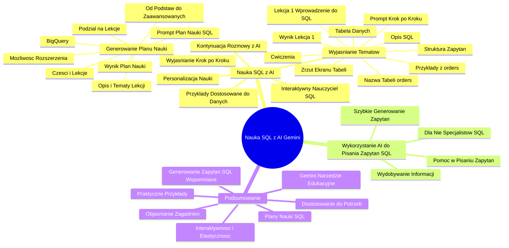

# Lekcje wideo - 4. Pisanie zapytań SQL z AI

# 💡 Diagram

___

# 🗒️ Notatka

# Notatki i Podsumowanie: Nauka SQL z AI (Gemini) 🤖

## Wprowadzenie

Niniejsze notatki podsumowują transkrypcję wideo poświęconą wykorzystaniu sztucznej inteligencji (AI), a konkretnie modelu Gemini, do nauki języka SQL oraz wspomagania pracy z bazami danych, takimi jak Google BigQuery. Krzysztof Modrzewski, prezenter, przedstawia dwa główne zastosowania AI w kontekście SQL:

1.  **Nauka SQL z pomocą AI:** Wykorzystanie AI jako narzędzia edukacyjnego do tworzenia planów nauki, objaśniania zagadnień i poszerzania wiedzy o SQL. 🎓
2.  **Wykorzystanie AI do pisania zapytań SQL:** Użycie AI do generowania zapytań SQL, nawet bez zaawansowanej znajomości języka, w celu szybkiego uzyskania danych z baz danych. 📊

Wideo koncentruje się przede wszystkim na pierwszym aspekcie – nauce SQL z wykorzystaniem Gemini.

## Nauka SQL z AI (Gemini) 🤖🎓

### Generowanie Planu Nauki SQL z Gemini

Prezenter demonstruje, jak za pomocą Gemini stworzyć szczegółowy plan nauki SQL, który można zastosować w Google BigQuery. W tym celu formułuje następujący **prompt (zapytanie)** do Gemini:

> Przygotuj dla mnie szczegółowy plan nauki SQL do wykorzystania w Google BigQuery. Chcę, aby plan był podzielony na konkretne lekcje, zaczynając od podstaw, aż po bardziej zaawansowane zagadnienia. Każda lekcja powinna zawierać krótki opis oraz kluczowe tematy do opanowania. Plan ma obejmować zarówno podstawowe, jak i zaawansowane operacje. Po przygotowaniu planu będę prosił Cię o wyjaśnienie poszczególnych tematów w miarę postępów w nauce.

**Kluczowe elementy promptu:**

*   **Szczegółowy plan nauki SQL:** Jasno określony cel.
*   **Do wykorzystania w Google BigQuery:** Kontekst użycia SQL.
*   **Podział na lekcje:** Struktura planu ułatwiająca naukę krok po kroku. ➡️
*   **Od podstaw do zaawansowanych zagadnień:** Progresja w nauce.
*   **Opis i kluczowe tematy dla każdej lekcji:** Szczegółowość planu.
*   **Podstawowe i zaawansowane operacje:** Zakres tematyczny.
*   **Możliwość dalszych pytań i wyjaśnień:** Interaktywność nauki z AI.

**Wynik Gemini:**

Gemini generuje plan nauki SQL, podzielony na **części** i **lekcje**. Przykład:

*   **Część 1: Podstawy SQL i BigQuery**
    *   **Lekcja 1: Wprowadzenie do SQL**
        *   **Kluczowe tematy:** Co to jest SQL, podstawowe zapytania (`SELECT`, `FROM`, `WHERE`), warunki.
    *   **Lekcja 2: Wprowadzenie do Google BigQuery**
    *   **Lekcja 3:** ...
    *   **Lekcja 4:** ...
*   **Część 2:** ...
*   **Część 3:** ...

Plan składa się z 10 lekcji, ale można poprosić Gemini o rozszerzenie planu lub bardziej szczegółowe rozbicie tematów.

### Wyjaśnianie Tematów i Nauka Krok po Kroku z Gemini ➡️🎓

Prezenter pokazuje, jak wykorzystać Gemini do nauki konkretnej lekcji z wygenerowanego planu. Wybiera **Lekcję 1: Wprowadzenie do SQL** i formułuje kolejny **prompt**:

> Przeprowadź mnie krok po kroku przez lekcję pierwszą, tak abym zrozumiał wszystkie kluczowe tematy. Przykłady ćwiczeń pokaż na mojej tabeli danych, którą przesyłam w załączniku.

Aby Gemini mogło dostosować przykłady do kontekstu użytkownika, prezenter **załącza informacje o swojej tabeli danych** `orders` z Google BigQuery, przekazując je w dwóch formach:

1.  **Zrzut ekranu tabeli:** Zawierający nazwy pól i typy danych. 📊
2.  **Nazwa tabeli:** `orders`.

**Prompt uzupełniony o informacje o tabeli:**

> Przeprowadź mnie krok po kroku przez lekcję pierwszą, tak abym zrozumiał wszystkie kluczowe tematy. Przykłady ćwiczeń pokaż na mojej tabeli danych, którą przesyłam w załączniku. [Zrzut ekranu tabeli `orders`] Nazwa mojej tabeli to `orders`.

**Wynik Gemini - Lekcja Pierwsza:**

Gemini generuje lekcję pierwszą, która zawiera:

*   **Opis:** Co to jest SQL i jego zastosowania.
*   **Struktura zapytań:** Opis podstawowej struktury zapytania SQL.
*   **Przykłady:** **Przykłady zapytań SQL oparte na tabeli `orders` użytkownika.** Przykłady obejmują:
    *   `SELECT` (wybór kolumn)
    *   `FROM` (źródło danych - tabela `orders`)
    *   Operatory porównań
    *   `WHERE` (warunki)
*   **Dodatkowe Ćwiczenia:** Zadania do samodzielnego wykonania, mające na celu utrwalenie wiedzy. 📝

**Podsumowanie Nauki SQL z Gemini:**

*   Gemini może pełnić rolę **interaktywnego nauczyciela SQL**. 🤖🎓
*   Można go wykorzystać do **generowania spersonalizowanych planów nauki SQL**.
*   Gemini potrafi **wyjaśniać poszczególne tematy lekcji krok po kroku**. ➡️
*   **Przykłady i ćwiczenia mogą być dostosowane do danych użytkownika** poprzez udostępnienie informacji o tabelach. 📊
*   Istnieje możliwość **kontynuowania rozmowy z AI** w celu pogłębiania wiedzy i uzyskiwania bardziej szczegółowych wyjaśnień. 💬

## Wykorzystanie AI do Pisania Zapytań SQL (Wspomniane) 🤖

Wideo wspomina również o drugim zastosowaniu AI – **generowaniu zapytań SQL**, przydatnym nawet dla osób bez eksperckiej wiedzy w SQL. Dotyczy to sytuacji, gdy szybkie wydobycie informacji z bazy danych jest kluczowe, a AI może wspomóc w napisaniu odpowiedniego zapytania. Ten aspekt nie jest szczegółowo demonstrowany w tym fragmencie wideo, lecz zapowiedziany jako temat kolejnej lekcji.

## Podsumowanie

Wideo prezentuje praktyczne zastosowanie sztucznej inteligencji Gemini w nauce i pracy z SQL. Koncentruje się na wykorzystaniu Gemini jako narzędzia edukacyjnego, które wspiera tworzenie planów nauki, objaśnianie zagadnień i dostarczanie praktycznych przykładów opartych na danych użytkownika. Prezenter podkreśla interaktywność i elastyczność Gemini, umożliwiające dostosowanie procesu nauki do indywidualnych potrzeb i poziomu zaawansowania. Dodatkowo, wspomniane jest zastosowanie AI do generowania zapytań SQL, stanowiące drugą ścieżkę wykorzystania AI w kontekście baz danych.

___

# 🔉 Transcript
File: Lekcje wideo - 4. Pisanie zapytań SQL z AI.mp4 
[00:00:05] Cześć.
[00:00:05] (Na ekranie pojawia się napis: Krzysztof Modrzewski, Head of education, Marketing Masters)
[00:00:05] Skoro nasze środowisko do pracy mamy przygotowane, to teraz przejdźmy do poznawania SQL-a razem z AI.
[00:00:11] W tej lekcji chciałbym poruszyć dwie takie ścieżki wykorzystania właśnie sztucznej inteligencji z SQL-em.
[00:00:20] Pierwsza z nich, to chciałbym ci pokazać jak możesz wykorzystać chociażby Gemini do nauki SQL-a, do rozwijania się w tym temacie i poznawania kolejnych obszarów właśnie tego języka zapytań do baz danych.
[00:00:33] Z drugiej strony, jeżeli nie chcesz się w tym specjalizować, nie chcesz jakby wchodzić głębiej w te tematy, zostawać Data Scientistem, zostawać specjalistą od SQL-a czy baz danych, ale być może są sytuacje, kiedy musisz wyciągnąć jakieś informacje z bazy danych, czy to z BigQuery, czy jakiejkolwiek innej bazy danych, to chcę ci pokazać jak właśnie możesz skorzystać z pomocy AI do tego, żeby łatwo i szybko napisać całe takie zapytanie i otrzymać informacje jakich potrzebujesz.
[00:01:03] To co?
[00:01:04] Zaczynajmy?
[00:01:05] (Na ekranie pojawia się okno przeglądarki z otwartą stroną Gemini Advanced. Na środku ekranu widnieje napis: Cześć, Krzysztof.)
[00:01:05] Przejdźmy sobie do pierwszej kwestii, czyli właśnie nauki SQL-a razem ze sztuczną inteligencją.
[00:01:11] W tym celu przechodzę do mojego panelu Gemini i wpisuję odpowiedni prompt, który ma dać mi plan nauki.
[00:01:20] Co w tym prompcie tutaj napisałem?
[00:01:22] Przejdźmy sobie, przeanalizujmy to, bo to jest ta główna rzecz na której trzeba się nauczyć.
[00:01:26] Przygotuj dla mnie szczegółowy plan nauki SQL do wykorzystania w Google BigQuery.
[00:01:31] Chcę, aby plan był podzielony na konkretne lekcje, zaczynając od podstaw, aż po bardziej zaawansowane zagadnienia.
[00:01:41] Każda lekcja powinna zawierać krótki opis oraz kluczowe tematy do opanowania.
[00:01:45] Teraz muszę dać znać co będę chciał robić dalej z tym planem.
[00:01:48] Chcę, aby plan obejmował zarówno podstawowe operacje, jak i bardziej zaawansowane i po przygotowaniu planu będę prosił cię o wyjaśnienie poszczególnych tematów w miarę postępów w nauce.
[00:01:57] (Na ekranie pojawia się odpowiedź Gemini na zadany prompt. Lista lekcji i kluczowych tematów do opanowania.)
[00:01:57] Jak widzisz, prompt nie jest taki krótki, szczegółowo wyjaśniłem sztucznej inteligencji, czego oczekuję i co chciałbym otrzymać.
[00:02:06] No i zobaczmy jaki tutaj mamy wynik.
[00:02:08] Jasne, oto szczegółowy plan nauki SQL-a.
[00:02:10] Mamy cały ten plan podzielony na części i każda część jest podzielona jeszcze na lekcje.
[00:02:14] Część pierwsza, podstawy SQL i BigQuery, lekcja pierwsza wprowadzenie do SQL.
[00:02:18] Kluczowe tematy.
[00:02:19] Czyli czego będę się uczył?
[00:02:21] Będę się uczył co to jest SQL, podstawowych zapytań, takich jak SELECT FROM WHERE, być może jakieś kombinowane jeszcze warunki.
[00:02:29] Mam później lekcję drugą, wprowadzenie do Google BigQuery, lekcję trzecią, lekcję czwartą już w części drugiej, lekcję szóstą, siódmą, część trzecią, czyli jak widzisz Gemini podzielił mi mój plan nauki na 10 lekcji.
[00:02:46] Oczywiście, mogłem go poprosić teraz o rozwinięcie każdego tematu.
[00:02:50] Może nie o przygotowanie 10, a podzielenie tego na 20 lub 30 lekcji.
[00:02:55] Albo przerabiając już konkretną lekcję, będę mógł prosić Gemini o to, żeby doprecyzował pewne kwestie i wyjaśniał mi je bardziej dogłębnie.
[00:03:04] Po to mamy generatywną inteligencję, żeby również z nią kontynuować rozmowę i dochodzić do większych szczegółów, jeżeli nas to interesuje.
[00:03:12] W tym momencie najlepiej będzie zapisać sobie ten cały wynik po to, żeby później wykorzystać te poszczególne lekcje tutaj opisane przez Gemini do kolejnej nauki, ale tak naprawdę zależy mi na nauce, więc przejdźmy w takim razie i przeróbmy sobie tą naszą lekcję pierwszą, żeby nauczyć się co to jest SELECT, co to jest FROM i co to jest WHERE.
[00:04:01] Dlatego wpisuję do Gemini.
[00:04:01] Przeprowadź mnie przez lekcję pierwszą krok po kroku, abym zrozumiał wszystkie kluczowe tematy.
[00:04:04] (Na ekranie pojawia się okno Google BigQuery z otwartą tabelą orders. Prezentowane są nazwy pól, typy danych i inne informacje o tabeli.)
[00:04:05] Przykład ćwiczeń pokaż mi na mojej tabeli danych, którą przesyłam w załączniku.
[00:04:05] Do tego zaraz dojdziemy.
[00:04:05] Teraz przeklejam wszystkie rzeczy, które mam tutaj wypisane z lekcji pierwszej.
[00:04:16] I dodatkowo muszę jeszcze przekleić moją tabelę.
[00:04:21] To co robię w tym celu?
[00:04:21] (Na ekranie ponownie pojawia się okno Google BigQuery z otwartą tabelą orders.)
[00:04:21] Przechodzę do Google BigQuery, robię zrzut ekranu wszystkich pól, które tutaj mamy właśnie w mojej tabeli.
[00:04:21] (Na ekranie ponownie pojawia się okno Gemini Advanced.)
[00:04:21] Przechodzę z powrotem do panelu Gemini i wklejam ten zrzut ekranu.
[00:04:21] (Na ekranie pojawia się zrzut ekranu tabeli orders z Google BigQuery.)
[00:04:21] Dzięki temu system, czy AI będzie wiedział jakie mam pola w moich tabelach.
[00:04:21] Ale muszę jeszcze jedną rzecz tutaj dodać.
[00:04:21] Nazwa mojej tabeli to i muszę podać nazwę tabeli.
[00:04:21] Dlaczego?
[00:04:21] Ponieważ zawsze pisząc SQL musimy napisać z jakiej tabeli mają te dane pobrać.
[00:04:21] Jak znaleźć taką nazwę tabeli?
[00:04:21] Nie jest to zbytnio skomplikowane.
[00:04:21] Bardzo łatwo będzie po prostu kliknąć tutaj zapytanie w nowej karcie i to tworzy mi takie podstawowe zapytanie i tutaj po FROM mam na zielono właśnie nazwę tej mojej tabeli orders.
[00:04:21] Więc po prostu kopiuję sobie tą nazwę.
[00:04:21] (Na ekranie ponownie pojawia się okno Gemini Advanced.)
[00:04:21] Przechodzę do Gemini i wklejam nazwę tabeli.
[00:04:21] (W oknie Gemini Advanced pojawia się nazwa tabeli orders.)
[00:04:21] Klikam prześlij i zobaczmy jaką lekcję tą pierwszą przygotuje dla mnie teraz sztuczna inteligencja.
[00:04:21] (Na ekranie pojawia się odpowiedź Gemini na zadany prompt. Lista lekcji i kluczowych tematów do opanowania.)
[00:04:21] Mam się nauczyć podstaw SQL-a.
[00:04:21] Zobaczmy jaki mam wynik.
[00:04:21] Lekcja pierwsza wprowadzenie mam opis co to jest SQL i do czego służy.
[00:04:21] Mam opis jak wygląda struktura zapytań, taka najprostsza.
[00:04:21] I również mam przykłady i uwaga, przykłady są na podstawie właśnie mojej tabeli.
[00:04:21] Czyli na przykład mam SQL tutaj do skopiowania, gdzie mam SELECT różne kolumny, z jakiej tabeli, mam też opisanie operatorów porównań, mam też kolejne przykłady, mam opis warunków i mam konkretne też dodatkowe ćwiczenia dostałem tutaj do wykonania.
[00:04:21] Zatem co?
[00:04:21] Myślę, że już wiesz jak wykorzystać AI do jako takiego profesjonalnego nauczyciela SQL-a, albo jak wykorzystać Gemini do tego, żeby pomagał ci pisać zapytania SQL i wyciągać dane, które potrzebujesz ze swoich tabel.
[00:04:21] Mam nadzieję, że to była dla ciebie pomocna lekcja, ale to nie koniec, jeżeli chodzi o naszą przygodę z SQL-em, ponieważ teraz chcę ci pokazać jak możesz wykorzystać Gemini bezpośrednio w Google BigQuery.
[00:04:21] Jeżeli cię to interesuje, to zapraszam do kolejnej lekcji.

___
# 🏷️ Tags
#SQL #AI #Gemini #Google_BigQuery #nauka_SQL #uczenie_maszynowe #bazy_danych #język_SQL #zapytania_SQL #plan_nauki #lekcje_SQL #podstawy_SQL #zaawansowane_SQL #prompt #generowanie_planu_nauki #struktura_zapytania #SELECT #FROM #WHERE #tabele_danych #orders #interaktywny_nauczyciel #spersonalizowane_plany_nauki #przykłady_SQL #ćwiczenia_SQL #generowanie_zapytań_SQL #Krzysztof_Modrzewski #Data_Scientist #Marketing_Masters #Head_of_education
