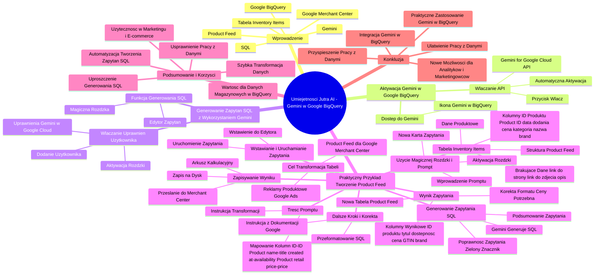

# Lekcje wideo - 5. Gemini w Google BigQuery

# 💡 Diagram

___

# 🗒️ Notatka

# Notatki i Podsumowanie: Umiejętności Jutra AI - Gemini w Google BigQuery 📊

## Wprowadzenie

Niniejsze notatki podsumowują demonstrację wykorzystania sztucznej inteligencji **Gemini** 🤖 w narzędziu **Google BigQuery** 📊. Krzysztof Modrzewski z Marketing Masters prezentuje, w jaki sposób Gemini może wspomóc tworzenie zapytań `SQL` 🗃️, na przykładzie generowania pliku produktowego (**Product Feed** 🛍️) dla **Google Merchant Center** 🏢, bazując na danych z tabeli `Inventory Items`.

## Aktywacja Gemini w Google BigQuery

### Dostęp do Gemini

- W panelu **Google BigQuery** 📊, w prawym górnym rogu, znajduje się ikona Gemini 🤖.
- Kliknięcie ikony otwiera panel Gemini.
- Pierwsze uruchomienie wymaga aktywacji **Gemini for Google Cloud API**.

### Włączanie API ✅

- Po kliknięciu ikony Gemini 🤖, system powiadomi o konieczności włączenia **Gemini for Google Cloud API**.
- Należy wybrać przycisk "Włącz" ✅.
- Proces aktywacji jest automatyczny i może potrwać krótką chwilę 🕰️.
- Po pomyślnym włączeniu, Gemini 🤖 będzie dostępne do interakcji bezpośrednio w panelu Google BigQuery 📊.

## Generowanie Zapytań SQL z Wykorzystaniem Gemini

### Dostęp do Funkcji Generowania SQL

- Krzysztof Modrzewski demonstruje generowanie `SQL` 🗃️ za pomocą funkcji **"magicznej różdżki"** ✨ (rysika) dostępnej w edytorze zapytań, a nie poprzez tradycyjny czat.
- Aby skorzystać z **"różdżki"** ✨, konieczne jest nadanie odpowiednich uprawnień.

### Włączanie Uprawnień Użytkownika ✅

- Należy dodać użytkownika (siebie) do uprawnień Gemini 🤖 w **Google Cloud**.
- Jest to mechanizm bezpieczeństwa, zapewniający dostęp do Gemini 🤖 tylko uprawnionym osobom.
- Dodanie użytkownika jest wymagane, nawet jeśli **Google Cloud** jest już aktywne.
- Po dodaniu użytkownika i aktualizacji uprawnień, **"różdżka"** ✨ stanie się aktywna (podświetli się na niebiesko).

## Praktyczny Przykład: Tworzenie Product Feed 🛍️ z Tabeli `Inventory Items`

### Tabela `Inventory Items`

- Krzysztof Modrzewski otwiera tabelę `Inventory Items` w zakładce "Eksplorator".
- Tabela zawiera dane o produktach w magazynie, strukturą przypominające **Product Feed** 🛍️.
- Zawiera kolumny takie jak: `ID produktu`, `Product ID`, `data dodania`, `cena`, `kategoria`, `nazwa`, `marka` (**brand**) itp.
- Brakuje w niej danych takich jak link do strony produktu, link do zdjęcia, opis produktu – jednak te informacje mogą znajdować się w bazie danych sklepu internetowego.

### Cel: Transformacja Tabeli w Product Feed 🛍️

- Zamierzeniem jest wykorzystanie Gemini 🤖 do wygenerowania zapytania `SQL` 🗃️, które przekształci tabelę `Inventory Items` w plik produktowy (**Product Feed** 🛍️) dla **Google Merchant Center** 🏢.
- **Product Feed** 🛍️ jest niezbędny do wyświetlania reklam produktowych w **Google Ads** 📢 i innych platformach sprzedażowych.

### Użycie "Magicznej Różdżki" ✨ i Prompt

- Otwierana jest nowa karta zapytania.
- Domyślna zawartość edytora zostaje usunięta.
- Aktywowana zostaje **"magiczna różdżka"** ✨.
- Wprowadzany jest **prompt** (polecenie tekstowe) dla Gemini 🤖.

### Treść Promptu

- Prompt zawiera instrukcję dla Gemini 🤖: "Potrzebuję przygotować nową tabelę na podstawie mojej tabeli `Inventory Items`, która posłuży jako **Product Feed** 🛍️ do **Google Merchant Center** 🏢".
- W prompcie zdefiniowano **mapowanie kolumn** i **logikę transformacji**:
    - `ID` -> `ID`
    - `Product name` -> `title`
    - `created at` (rok 2024) -> `availability = 'in stock'`, w przeciwnym razie `availability = 'out of stock'`
    - `Product retail price` -> `price`
    - ... i inne przykładowe instrukcje.

### Generowanie Zapytania SQL przez Gemini 🤖

- Gemini 🤖 generuje zapytanie `SQL` 🗃️ na podstawie wprowadzonego promptu.
- System sygnalizuje poprawność zapytania (zielony znacznik ✅).
- Istnieje możliwość wyświetlenia podsumowania wygenerowanego zapytania (w tym przypadku w języku angielskim, ze względu na ustawienia konta).

### Wstawianie i Uruchamianie Zapytania ▶️

- Wygenerowane zapytanie `SQL` 🗃️ jest wstawiane do edytora.
- Prompt jest dodawany jako zakomentowana linia w kodzie zapytania.
- Zapytanie `SQL` 🗃️ jest uruchamiane ▶️.

### Wynik Zapytania

- Rezultatem jest nowa tabela, prezentująca przekształcone dane w formacie zbliżonym do **Product Feed** 🛍️: `ID produktu`, `tytuł`, `dostępność`, `cena`, `GTIN`, `brand`.
- Zauważono, że format ceny wymaga korekty, aby był zgodny z wymogami **Product Feed** 🛍️.

### Dalsze Kroki i Korekta Zapytania

- Można zlecić Gemini 🤖 **przeformatowanie zapytania SQL** 🗃️, aby cena była prezentowana w odpowiednim formacie dla **Product Feed** 🛍️.
- Możliwe jest wklejenie do promptu instrukcji z dokumentacji Google, dotyczącej formatowania ceny.

### Zapisywanie Wyniku 💾

- Otrzymany wynik (nową tabelę) można zapisać 💾 na dysku lub jako arkusz kalkulacyjny.
- Możliwe jest przesłanie go do **Merchant Center** 🏢 jako dodatkowy feed.

## Podsumowanie i Korzyści z Wykorzystania Gemini 🤖 w BigQuery 📊

- Gemini 🤖 w **Google BigQuery** 📊 upraszcza generowanie zapytań `SQL` 🗃️, nawet dla użytkowników bez zaawansowanej wiedzy w tym zakresie.
- Jest to szczególnie użyteczne w obszarze danych marketingowych i **e-commerce**, na przykład przy tworzeniu **Product Feedów** 🛍️.
- Umożliwia szybką transformację danych z tabel **BigQuery** 📊 do formatów wymaganych w narzędziach reklamowych i sprzedażowych.
- Integracja Gemini 🤖 z **BigQuery** 📊 usprawnia pracę z danymi 🔢 i automatyzuje proces tworzenia zapytań `SQL` 🗃️.
- Jest to szczególnie wartościowe, gdy dane o stanach magazynowych są przechowywane w **Google BigQuery** 📊.

## Konkluzja

Prezentowana demonstracja ukazuje praktyczne zastosowanie Gemini 🤖 w **Google BigQuery** 📊 do generowania zapytań `SQL` 🗃️. Na przykładzie tworzenia **Product Feed** 🛍️, Krzysztof Modrzewski ilustruje, jak AI może znacząco ułatwić i przyspieszyć pracę z danymi 🔢, nawet dla osób niebędących ekspertami `SQL` 🗃️. Integracja Gemini 🤖 bezpośrednio w interfejsie **BigQuery** 📊 otwiera nowe możliwości dla analityków danych i specjalistów marketingu internetowego.

___

# 🔉 Transcript
File: Lekcje wideo - 5. Gemini w Google BigQuery.mp4 
[00:00:00] Ekran: Białe tło.
[00:00:01] Ekran: "Umiejętności Jutra AI". Poniżej "Organizator: Google", "Partner edukacyjny: SGH".
[00:00:05] Krzysztof Modrzewski: Cześć.
[00:00:05] Ekran: Krzysztof Modrzewski, Head of education, Marketing Masters.
[00:00:05] Krzysztof Modrzewski: W poprzedniej lekcji uczyliśmy się jak możemy wykorzystać AI do nauki SQL-a lub do pisania nawet skomplikowanych zapytań SQL do bazy danych.
[00:00:14] Ekran: Google Cloud, My First Project. Ekplorator. Informacje o zbiorze danych. Informacje o replice zbioru danych. Historia zadań.
[00:00:14] Krzysztof Modrzewski: To w tej lekcji teraz sprawdźmy jak działa integracja Gemini bezpośrednio w Google BigQuery, jak możemy skorzystać z pomocy AI właśnie w tym narzędziu.
[00:00:25] Ekran: Google Cloud, My First Project. Ekplorator. Informacje o zbiorze danych. Informacje o replice zbioru danych. Historia zadań.
[00:00:25] Krzysztof Modrzewski: Przejdźmy w takim razie do interfejsu Google BigQuery.
[00:00:29] Ekran: Google Cloud, My First Project. Ekplorator. Informacje o zbiorze danych. Informacje o replice zbioru danych. Historia zadań.
[00:00:29] Krzysztof Modrzewski: I w naszym panelu po prawej stronie na górze mamy znaczek Gemini.
[00:00:33] Ekran: Google Cloud, My First Project. Ekplorator. Informacje o zbiorze danych. Informacje o replice zbioru danych. Historia zadań.
[00:00:33] Krzysztof Modrzewski: Jak go klikniemy, to widzimy, że mamy tutaj informacje witamy Gemini i widzę, żeby skorzystać z Gemini, muszę włączyć coś takiego jak Gemini for Google Cloud API.
[00:00:47] Ekran: Google Cloud, My First Project. Ekplorator. Informacje o zbiorze danych. Informacje o replice zbioru danych. Historia zadań.
[00:00:47] Krzysztof Modrzewski: Widzę, że jest niewłączono, więc klikam przycisk włącz.
[00:00:51] Ekran: Google Cloud, My First Project. Ekplorator. Informacje o zbiorze danych. Informacje o replice zbioru danych. Historia zadań.
[00:00:51] Krzysztof Modrzewski: W tym w tym momencie jest w toku, ponieważ ta opcja aktualnie jest włączana na moim koncie.
[00:00:58] Ekran: Google Cloud, My First Project. Ekplorator. Informacje o zbiorze danych. Informacje o replice zbioru danych. Historia zadań.
[00:00:58] Krzysztof Modrzewski: Widzę, że wszystko się udało.
[00:01:00] Ekran: Google Cloud, My First Project. Ekplorator. Informacje o zbiorze danych. Informacje o replice zbioru danych. Historia zadań.
[00:01:00] Krzysztof Modrzewski: Mogę już z moim czatem tutaj bezpośrednio rozmawiać już w paneli w panelu Google BigQuery.
[00:01:07] Ekran: Google Cloud, My First Project. Ekplorator. Informacje o zbiorze danych. Informacje o replice zbioru danych. Historia zadań.
[00:01:08] Krzysztof Modrzewski: Wykorzystajmy go jednak w inny sposób i poprośmy go o pomoc w pisaniu zapytań SQL bezpośrednio właśnie tutaj w panelu.
[00:01:17] Ekran: Google Cloud, My First Project. Ekplorator. Informacje o zbiorze danych. Informacje o replice zbioru danych. Historia zadań.
[00:01:17] Krzysztof Modrzewski: Dlatego na razie chowam sobie ten panel, przechodzę tutaj do do takiej magicznej różczki, żeby jednak z tej różczki skorzystać, widzę, że potrzebuję włączyć odpowiednie uprawnienia.
[00:01:32] Ekran: Google Cloud, My First Project. Ekplorator. Informacje o zbiorze danych. Informacje o replice zbioru danych. Historia zadań.
[00:01:32] Krzysztof Modrzewski: Dlatego przechodzę tutaj dalej i wpisuję mojego użytkownika, czyli siebie, żeby móc skorzystać z Gemini w Google Cloud.
[00:01:42] Ekran: Google Cloud, My First Project. Ekplorator. Informacje o zbiorze danych. Informacje o replice zbioru danych. Historia zadań.
[00:01:42] Krzysztof Modrzewski: Jest to trochę skomplikowana ścieżka, muszę dodać jeszcze siebie jako użytkownika, mimo że wcześniej włączyłem w ogóle Google Cloud dla bezpieczeństwa, ponieważ my tutaj dajemy konkretne uprawnienia osób, które mogą z Gemini skorzystać.
[00:01:56] Ekran: Google Cloud, My First Project. Ekplorator. Informacje o zbiorze danych. Informacje o replice zbioru danych. Historia zadań.
[00:01:56] Krzysztof Modrzewski: Więc ja teraz podam tutaj nazwę siebie jako swojego użytkownika i kliknę dalej.
[00:02:04] Ekran: Google Cloud, My First Project. Ekplorator. Informacje o zbiorze danych. Informacje o replice zbioru danych. Historia zadań.
[00:02:05] Krzysztof Modrzewski: Moje uprawnienia zostały już zaktualizowane.
[00:02:08] Ekran: Google Cloud, My First Project. Ekplorator. Informacje o zbiorze danych. Informacje o replice zbioru danych. Historia zadań.
[00:02:08] Krzysztof Modrzewski: Klikam zamknij i już w tym momencie ta różczka jest świeci się nazwijmy to na niebiesko i widzę, że mogę generować zapytanie SQL przy pomocy Gemini.
[00:02:17] Ekran: Google Cloud, My First Project. Ekplorator. Informacje o zbiorze danych. Informacje o replice zbioru danych. Historia zadań.
[00:02:17] Krzysztof Modrzewski: To co?
[00:02:18] Ekran: Google Cloud, My First Project. Ekplorator. Informacje o zbiorze danych. Informacje o replice zbioru danych. Historia zadań.
[00:02:18] Krzysztof Modrzewski: Przejdźmy w takim razie do tego.
[00:02:20] Ekran: Google Cloud, My First Project. Ekplorator. Informacje o zbiorze danych. Informacje o replice zbioru danych. Historia zadań.
[00:02:20] Krzysztof Modrzewski: Otwieram sobie w takim razie moją zakładkę z informacjami o sklepie internetowym Deluxe e-commerce, a konkretnie otwieram tabelę Inventory Items.
[00:02:33] Ekran: Google Cloud, My First Project. Ekplorator. Informacje o zbiorze danych. Informacje o replice zbioru danych. Historia zadań.
[00:02:33] Krzysztof Modrzewski: I co mam w tej tabeli?
[00:02:34] Ekran: Google Cloud, My First Project. Ekplorator. Informacje o zbiorze danych. Informacje o replice zbioru danych. Historia zadań.
[00:02:34] Krzysztof Modrzewski: W tej tabeli mam informacje o moich produktach w magazynie.
[00:02:37] Ekran: Google Cloud, My First Project. Ekplorator. Informacje o zbiorze danych. Informacje o replice zbioru danych. Historia zadań.
[00:02:37] Krzysztof Modrzewski: ID produktu, Product ID, kiedy zostało dodany, jaki jest cena tego produktu, jaka jest kategoria, nazwa, brand i tak dalej i tak dalej.
[00:02:48] Ekran: Google Cloud, My First Project. Ekplorator. Informacje o zbiorze danych. Informacje o replice zbioru danych. Historia zadań.
[00:02:48] Krzysztof Modrzewski: Czy coś nam to przypomina?
[00:02:50] Ekran: Google Cloud, My First Project. Ekplorator. Informacje o zbiorze danych. Informacje o replice zbioru danych. Historia zadań.
[00:02:50] Krzysztof Modrzewski: Mi od razu przychodzi do głowy Product Feed, czyli plik produktowy, który jest potrzebny do wyświetlania reklam produktowych chociażby czy w Google Ads czy w innych narzędziach takich jak chociażby jak Facebooka.
[00:03:04] Ekran: Google Cloud, My First Project. Ekplorator. Informacje o zbiorze danych. Informacje o replice zbioru danych. Historia zadań.
[00:03:04] Krzysztof Modrzewski: To co?
[00:03:04] Ekran: Google Cloud, My First Project. Ekplorator. Informacje o zbiorze danych. Informacje o replice zbioru danych. Historia zadań.
[00:03:04] Krzysztof Modrzewski: Może poprosimy Gemini, żeby napisał nam SQL-a, który zmieni nam, przekształci nam tą tabelę w nasz plik produktowy, który będziemy mogli wykorzystać.
[00:03:15] Ekran: Google Cloud, My First Project. Ekplorator. Informacje o zbiorze danych. Informacje o replice zbioru danych. Historia zadań.
[00:03:15] Krzysztof Modrzewski: Tutaj taka mała uwaga, oczywiście brakuje mi tu pewnych informacji, nie mam chociażby linku do strony, nie mam linku do zdjęcia, nie mam opisu, ale jeżeli takie informacje miałbym w mojej bazie danych, a często pobierając informacje z naszego sklepu internetowego bezpośrednio do Google BigQuery, mamy informacje również o opisie, mamy informacje o linku do zdjęcia i linku na stronie i właśnie wtedy będziemy mogli sobie przekształcić taką tabelę od razu w nasz plik produktowy, co więcej, dodając nawet odpowiednie pola z naszymi własnymi etykietami, dlatego żeby lepiej, żebyśmy lepiej mogli później zarządzać tymi produktami, tym plikiem produktowym bezpośrednio w kampaniach czy Merchant Center.
[00:04:01] Ekran: Google Cloud, My First Project. Ekplorator. Informacje o zbiorze danych. Informacje o replice zbioru danych. Historia zadań.
[00:04:01] Krzysztof Modrzewski: Teraz pokażę przykład jak możemy właśnie poprosić Gemini o pomoc w tworzeniu takiej tabeli.
[00:04:07] Ekran: Google Cloud, My First Project. Ekplorator. Informacje o zbiorze danych. Informacje o replice zbioru danych. Historia zadań.
[00:04:07] Krzysztof Modrzewski: W tym celu przechodzę tutaj do zakładki zapytanie.
[00:04:11] Ekran: Google Cloud, My First Project. Ekplorator. Informacje o zbiorze danych. Informacje o replice zbioru danych. Historia zadań.
[00:04:11] Krzysztof Modrzewski: Otwieram sobie zapytanie właśnie w nowej karcie i zobaczcie, tutaj mam taki rysik do pomocy, ale oczywiście najpierw usunę wszystko co jest tutaj, żeby mieć puste pole.
[00:04:21] Ekran: Google Cloud, My First Project. Ekplorator. Informacje o zbiorze danych. Informacje o replice zbioru danych. Historia zadań.
[00:04:21] Krzysztof Modrzewski: Klikam ten rysik, magiczną taką różczkę, która tutaj służy do generowania kodu SQL i muszę wpisać prompt, jaki kod mnie tutaj interesuje.
[00:04:30] Ekran: Google Cloud, My First Project. Ekplorator. Informacje o zbiorze danych. Informacje o replice zbioru danych. Historia zadań.
[00:04:30] Krzysztof Modrzewski: Wklejam więc moje zapytanie i co tutaj mam w tym prompcie?
[00:04:34] Ekran: Google Cloud, My First Project. Ekplorator. Informacje o zbiorze danych. Informacje o replice zbioru danych. Historia zadań.
[00:04:34] Krzysztof Modrzewski: Potrzebuję przygotować nową tabelę na podstawie mojej tabeli, wpadałem nazwę i tej tej tabeli Inventory Items, którą wykorzystam jako Product Feed do Google Merchant Center i tutaj podałem co chcę mieć w tej tabeli.
[00:04:45] Ekran: Google Cloud, My First Project. Ekplorator. Informacje o zbiorze danych. Informacje o replice zbioru danych. Historia zadań.
[00:04:45] Krzysztof Modrzewski: Czyli kolumna ID zamień na ID, kolumnę Product name zamień na title, jeżeli created at, czyli wrzucenie tego produktu na przykład jest w 2024 roku, to w kolumnie dostępność, czyli availability daj wartość in stock, przeciwnym razie out of stock, kolumnę Product retail price zamień na price i tak dalej i tak dalej.
[00:05:07] Ekran: Google Cloud, My First Project. Ekplorator. Informacje o zbiorze danych. Informacje o replice zbioru danych. Historia zadań.
[00:05:07] Krzysztof Modrzewski: Kilka takich przykładowych poleceń tutaj podałem i poproszę teraz Gemini o wygenerowanie mi takiego zapytania SQL.
[00:05:12] Ekran: Google Cloud, My First Project. Ekplorator. Informacje o zbiorze danych. Informacje o replice zbioru danych. Historia zadań.
[00:05:12] Krzysztof Modrzewski: Dostałem tutaj gotowe zapytanie.
[00:05:15] Ekran: Google Cloud, My First Project. Ekplorator. Informacje o zbiorze danych. Informacje o replice zbioru danych. Historia zadań.
[00:05:15] Krzysztof Modrzewski: Widzę, że to zapytanie jest poprawne, widzę zielony tutaj ten ptaszek i teraz mogę wstawić to zapytanie do tutaj mojego pola i je uruchomić.
[00:05:25] Ekran: Google Cloud, My First Project. Ekplorator. Informacje o zbiorze danych. Informacje o replice zbioru danych. Historia zadań.
[00:05:25] Krzysztof Modrzewski: Mogę też kliknąć jako tutaj podsumowanie, żeby dostać informacje o podsumowaniu, czyli co właściwie tutaj wygenerował.
[00:05:32] Ekran: Google Cloud, My First Project. Ekplorator. Informacje o zbiorze danych. Informacje o replice zbioru danych. Historia zadań.
[00:05:32] Krzysztof Modrzewski: Akurat ze względu na to, że konto, na którym teraz z którego teraz korzystam mam po angielsku, to mi wygenerował te informacje po angielsku, być może na tym koncie będzie po polsku.
[00:05:42] Ekran: Google Cloud, My First Project. Ekplorator. Informacje o zbiorze danych. Informacje o replice zbioru danych. Historia zadań.
[00:05:42] Krzysztof Modrzewski: Jak nie, zawsze mogę skorzystać z Gemini, żeby mi to przetłumaczył, jeżeli by mnie to interesowało.
[00:05:48] Ekran: Google Cloud, My First Project. Ekplorator. Informacje o zbiorze danych. Informacje o replice zbioru danych. Historia zadań.
[00:05:48] Krzysztof Modrzewski: No i klikam wstaw.
[00:05:50] Ekran: Google Cloud, My First Project. Ekplorator. Informacje o zbiorze danych. Informacje o replice zbioru danych. Historia zadań.
[00:05:50] Krzysztof Modrzewski: Tutaj dostałem zakomentowane mój prompt z informacją czego oczekiwałem.
[00:05:57] Ekran: Google Cloud, My First Project. Ekplorator. Informacje o zbiorze danych. Informacje o replice zbioru danych. Historia zadań.
[00:05:57] Krzysztof Modrzewski: Prompt przepraszam, zapytanie SQL gotowe do uruchomienia.
[00:06:01] Ekran: Google Cloud, My First Project. Ekplorator. Informacje o zbiorze danych. Informacje o replice zbioru danych. Historia zadań.
[00:06:01] Krzysztof Modrzewski: Klikam więc uruchom i poniżej jako wynik dostałem właśnie nową tabelę, gdzie mam ID produktu, tytuł, dostępność, tak jak poprosiłem go, żeby mi to przygotował, cenę, GTIN, brand.
[00:06:13] Ekran: Google Cloud, My First Project. Ekplorator. Informacje o zbiorze danych. Informacje o replice zbioru danych. Historia zadań.
[00:06:13] Krzysztof Modrzewski: Oczywiście cena w tym momencie w złym formacie, więc powinienem poprosić tutaj Gemini o przeformatowanie tego zapytania SQL po to, żeby cena była w innym formacie, a nie w takim formacie, takim jaki jest potrzebny do mojego Product Feed.
[00:06:27] Ekran: Google Cloud, My First Project. Ekplorator. Informacje o zbiorze danych. Informacje o replice zbioru danych. Historia zadań.
[00:06:27] Krzysztof Modrzewski: Mogę nawet przekleić konkretną instrukcję z dokumentacji Googleowej jak ta cena na przykład ma wyglądać i wtedy będzie to gotowe.
[00:06:36] Ekran: Google Cloud, My First Project. Ekplorator. Informacje o zbiorze danych. Informacje o replice zbioru danych. Historia zadań.
[00:06:36] Krzysztof Modrzewski: No i taki wynik, który otrzymałem, mogę zapisać chociażby na swoim dysku czy jako arkuszy i przesłać później do Merchant Center jako mój dodatkowy feed, z tego sobie skorzystać.
[00:06:50] Ekran: Google Cloud, My First Project. Ekplorator. Informacje o zbiorze danych. Informacje o replice zbioru danych. Historia zadań.
[00:06:50] Krzysztof Modrzewski: Super sprawa, zwłaszcza jeżeli mamy informacje o naszym stanie magazynowym w Google BigQuery, ponieważ został nam jeszcze ostatni temat, który chciałem omówić, więc zapraszam cię do kolejnej lekcji.
[01:21:19] Ekran: "Umiejętności Jutra AI". Poniżej "Organizator: Google", "Partner edukacyjny: SGH".

___
# 🏷️ Tags
#gemini #google_bigquery #ai #sztuczna_inteligencja #sql #zapytania_sql #product_feed #google_merchant_center #marketing_masters #krzysztof_modrzewski #google_cloud_api #aktywacja #uprawnienia #google_cloud #tabela #inventory_items #dane_produktowe #e-commerce #google_ads #magiczna_różdżka #prompt #mapowanie_kolumn #transformacja_danych #id_produktu #tytuł #dostępność #cena #gtin #brand #arkusz_kalkulacyjny #dane_marketingowe #automatyzacja #stan_magazynowy #analityka_danych #specjalista_marketingu #rysyik #umiejętności_jutra_ai #sgh #facebook #baza_danych #sklep_internetowy #opis_produktu #link_do_zdjęcia #link_do_strony #etykiety #kampanie #merchant_center #przeformatowanie_zapytania #dokumentacja_google #zapisywanie_wyniku #dodatkowy_feed
