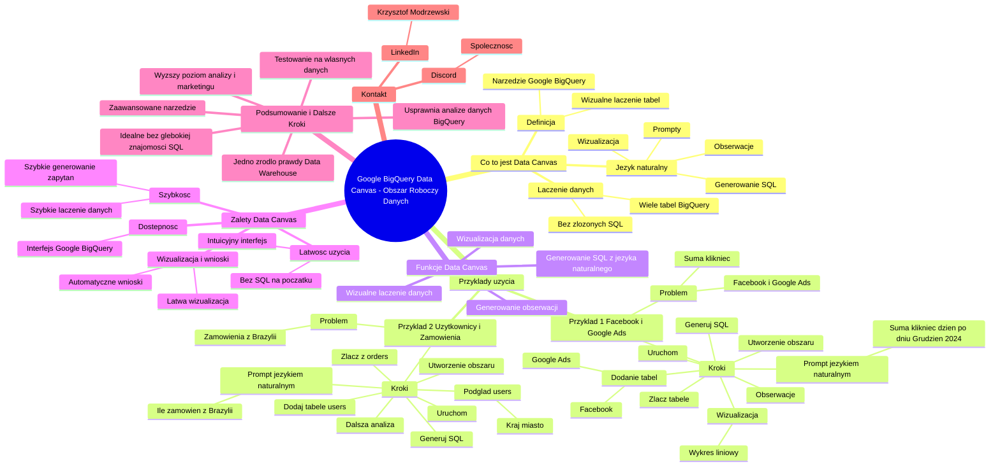

# Lekcje wideo - 6. Google Data Canvas

# 💡 Diagram

___

# 🗒️ Notatka

# Notatki i Podsumowanie: Umiejętności Jutra AI - Google BigQuery Data Canvas

## Wprowadzenie

Niniejszy dokument zawiera szczegółowe notatki i podsumowanie prezentacji "Umiejętności Jutra AI" 🕰️, zorganizowanej przez Google i SGH. Szkolenie poświęcone jest narzędziu **Google BigQuery Data Canvas** (`Obszar roboczy danych` 📊). Krzysztof Modrzewski z Marketing Masters omawia w prezentacji, jak wykorzystać Data Canvas do łączenia danych 📊 z różnych tabel BigQuery, generowania zapytań SQL za pomocą języka naturalnego, wizualizacji danych 📈 i wyciągania wniosków.

## Co to jest Google BigQuery Data Canvas (`Obszar Roboczy Danych`)?

- **BigQuery Data Canvas** (`Obszar roboczy danych`) to narzędzie Google BigQuery, które umożliwia wizualne tworzenie i łączenie tabel danych 📊. (w skrócie: BigQuery Canvas, Canvas)
- Narzędzie to ułatwia łączenie danych 📊 z wielu tabel BigQuery, eliminując potrzebę ręcznego pisania złożonych zapytań SQL.
- Umożliwia generowanie zapytań SQL, wizualizacji danych 📈 i obserwacji za pomocą **języka naturalnego** (promptów).

## Przykład 1: Łączenie danych z Facebooka i Google Ads

### Problem:
- Posiadamy dane 📊 o kampaniach marketingowych w dwóch tabelach:
    - Tabela z danymi z Facebooka (wydatki, kliknięcia, konwersje).
    - Tabela z danymi z Google Ads (kliknięcia).
- Chcemy obliczyć **sumę kliknięć** ze wszystkich działań marketingowych (Google i Facebook) dzień po dniu.

### Rozwiązanie z użyciem Data Canvas:

1. **Utworzenie nowego Obszaru Roboczego Danych:**
    - W panelu Google BigQuery, kliknij strzałkę w dół i wybierz "Nowy obszar roboczy danych" (New Data Canvas).
2. **Zapoznanie się z przykładowym obszarem roboczym:**
    - Opcja "Rozpocznij" (Start) pozwala na przejrzenie przykładowego schematu Data Canvas z tabelami `order_items` i `users`.
    - Przykład demonstruje podstawowe funkcje węzłów, zapytań SQL, zaawansowanych zapytań, wizualizacji danych 📈 i obserwacji.
3. **Stworzenie własnego obszaru roboczego:**
    - Kliknij "Obszar roboczy danych" -> "Nowy".
    - Wybierz "Wyszukaj dane" (Search data).
4. **Dodanie tabel danych:**
    - Można wybrać tabele z:
        - Ostatnio używanych tabel.
        - Ostatnich zapytań.
        - Bezpośrednio z panelu eksploratora (trzy kropki przy tabeli -> "Zapytanie w obecny obszar roboczy danych").
    - Dodano tabelę `ad_system_Facebook`.
5. **Połączenie tabel:**
    - Kliknij "Złącz" (Join).
    - Wybierz drugą tabelę: `Google Ads Systems Campaigns`.
    - Tabele zostaną połączone linią w obszarze roboczym.
6. **Wpisanie promptu:**
    - W polu promptu wpisz zapytanie w języku naturalnym: "Pokaż mi jaka była suma kliknięć działań marketingowych dzień po dniu w grudniu 2024 roku".
7. **Wygenerowanie SQL:**
    - Kliknij "Wygeneruj" (Generate).
    - Data Canvas wygeneruje zapytanie SQL łączące dane 📊 z obu tabel.
8. **Uruchomienie zapytania:**
    - Kliknij "Uruchom" (Run).
    - Wyświetli się tabelka z sumą kliknięć dzień po dniu w grudniu 2024 z Google Ads i Facebooka.
9. **Wizualizacja danych:**
    - Wybierz opcję "Wygeneruj wizualizację" (Generate visualization).
    - Wybierz typ wykresu, np. "wykres liniowy" (line chart).
    - Wykres liniowy przedstawi sumę kliknięć dzień po dniu w grudniu.
10. **Generowanie obserwacji:**
    - Wybierz opcję "Wygeneruj obserwacje" (Generate insights).
    - System wygeneruje wnioski na podstawie danych 📊 (obecnie wnioski mogą być w języku angielskim).

## Przykład 2: Łączenie danych użytkowników i zamówień

### Problem:
- Chcemy dowiedzieć się, ile było zamówień z **Brazylii**.
- Posiadamy dwie tabele:
    - `users` (użytkownicy) - zawiera informacje o kraju/stanie użytkowników.
    - `orders` (zamówienia) - zawiera informacje o zamówieniach.

### Rozwiązanie z użyciem Data Canvas:

1. **Utworzenie nowego Obszaru Roboczego Danych.**
2. **Dodanie tabeli `users`:**
    - Wybierz tabelę `users` z przykładowego zestawu danych e-commerce.
    - Dodaj ją do obszaru roboczego.
3. **Połączenie tabeli `users` z `orders`:**
    - Kliknij "Złącz" (Join).
    - Wybierz tabelę `orders`.
4. **Sprawdzenie danych użytkowników:**
    - Kliknij na węzeł tabeli `users` i wybierz "Podgląd" (Preview).
    - Sprawdź, czy tabela `users` zawiera informacje o kraju/stanie (np. miasto, kraj).
5. **Wpisanie promptu:**
    - W polu promptu wpisz zapytanie: "Ile było w sumie zamówień z Brazylii".
    - Można doprecyzować: "Ile było w sumie zamówień z Brazylii, podaj z Brazylii, żeby wiedział o na pewno co chodzi".
6. **Wygenerowanie SQL:**
    - Kliknij "Wygeneruj" (Generate).
    - Jeśli SQL nie pojawi się za pierwszym razem, kliknij "Wygeneruj" ponownie.
7. **Uruchomienie zapytania:**
    - Kliknij "Uruchom" (Run).
    - Wyświetli się tabelka z liczbą zamówień z Brazylii.
8. **Dalsze kroki:**
    - Możliwość dalszej analizy, wizualizacji 📈 i generowania obserwacji, analogicznie jak w przykładzie 1.

## Funkcje Data Canvas

- **Wizualne łączenie danych 📊:** Łatwe łączenie tabel poprzez interfejs graficzny.
- **Generowanie SQL z języka naturalnego:** Używanie promptów w języku naturalnym do tworzenia zapytań SQL.
- **Wizualizacja danych 📈:** Tworzenie wykresów i wizualizacji bezpośrednio w obszarze roboczym.
- **Generowanie obserwacji:** Automatyczne generowanie wniosków i obserwacji na podstawie danych 📊.

## Zalety Data Canvas

- **Łatwość użycia:** Intuicyjny interfejs, nie wymaga zaawansowanej wiedzy SQL na początku.
- **Szybkość:** Szybkie łączenie danych 📊 i generowanie zapytań.
- **Dostępność:** Dostępne w interfejsie Google BigQuery.
- **Wizualizacja i wnioski:** Umożliwia łatwą wizualizację danych 📈 i uzyskiwanie automatycznych wniosków.

## Podsumowanie i Dalsze Kroki

- **Google BigQuery Data Canvas** (`Obszar roboczy danych`) to zaawansowane narzędzie, które usprawnia analizę danych 📊 w BigQuery.
- Umożliwia łączenie danych 📊 z różnorodnych źródeł, generowanie zapytań SQL za pomocą języka naturalnego, wizualizację 📈 i uzyskiwanie wniosków.
- Jest to idealne rozwiązanie dla osób, które chcą analizować dane 📊 w BigQuery bez dogłębnej znajomości SQL.
- **Zaleca się testowanie Data Canvas na własnych danych 📊 w Google BigQuery** w celu stworzenia **`jednego źródła prawdy`** (`Data Warehouse`) i osiągnięcia wyższego poziomu analizy i marketingu.
- **W razie pytań:**
    - Dołącz do społeczności na **Discordzie**.
    - Skontaktuj się z Krzysztofem Modrzewskim na **LinkedInie**.

**Kurs "Umiejętności Jutra AI" 🕰️ ma na celu nauczenie samodzielnego testowania zapytań SQL i wyciągania potrzebnych danych 📊 w sposób zautomatyzowany.**

Dziękujemy za udział w kursie i życzymy powodzenia w dalszej nauce i praktyce!

___

# 🔉 Transcript
File: Lekcje wideo - 6. Google Data Canvas.mp4 
[00:00:01] Ekran: (Ekran tytułowy z napisem "Umiejętności Jutra AI". Poniżej napisy "Organizator: Google" i "Partner edukacyjny: SGH")
[00:00:05] Krzysztof Modrzewski: Cześć.
[00:00:06] Ekran: (Krzysztof Modrzewski, Head of education, Marketing Masters)
[00:00:06] Mówiliśmy już o tym jak uczyć się SQL-a z AI, pokazałem ci jak wykorzystać pomoc Gemina i bezpośrednio Google BigQuery, to teraz chciałem ci jeszcze pokazać jedną opcję, która może być bardzo pomocna, jeżeli masz wiele tabel w BigQuery zawierających wiele różnych informacji, które jednak warto byłoby ze sobą połączyć i uzyskać dane, wynik właśnie bazujący na wielu różnych tabelach.
[00:00:29] Tym czymś jest Google BigQuery Data Canvas, w skrócie BigQuery Canvas, Canvas, a po polsku w ogóle nazywa się to obszar roboczy danych.
[00:00:42] Tak właśnie należy tego szukać, jeżeli w twoim Google BigQuery, twój interfejs Google BigQuery jest po polsku.
[00:00:48] Ekran: (Ekran Google Cloud z otwartym BigQuery. Widoczny panel eksploratora z listą projektów i tabel. Po prawej stronie okno edytora z zapytaniem bez nazwy.)
[00:00:49] To co?
[00:00:49] Przejdźmy sobie w takim razie do naszego interfejsu i zobaczmy czym właściwie jest ten cały Google BigQuery Data Canvas.
[00:00:59] Jesteśmy w panelu Google BigQuery.
[00:01:02] I teraz zobaczmy taką sytuację.
[00:01:05] Mam kilka, mam dwie tabele.
[00:01:08] Mam tabelę z danymi z Facebooka, gdzie mam informacje na przykład o wydatkach, o kliknięciach, o konwersjach z Facebooka, ale mam też tabelę z Google.
[00:01:20] Chciałbym się teraz dowiedzieć, to jest kampania Google Ads.
[00:01:23] Chciałbym się teraz dowiedzieć ile było w sumie na przykład kliknięć do mojej witryny ze wszystkich moich działań marketingowych, które prowadzę w Google i na Facebooku dzień po dniu.
[00:01:34] Te informacje są w dwóch różnych tabelach.
[00:01:37] Oczywiście, mógłbym teraz poprosić AI o pomoc w napisaniu SQL-a, który będzie mi wyciągał informacje z tych dwóch tabel, łączył je i tworzył mi nową tabelę, ale mogę skorzystać z takiego, nazwijmy to wizualnego tworzenia takich właśnie połączonych tabel.
[00:01:56] W tym celu tutaj w panelu, po prawej stronie na górze, klikam tą strzałeczkę w dół i właśnie tworzę nowy Data Canvas, czyli po polsku nowy obszar roboczy danych.
[00:02:11] Jak otworzyłem sobie taki panel roboczy danych, to zachęcam cię do sprawdzenia, do zapoznania się z przykładowym właśnie takim obszarem roboczych danych.
[00:02:21] Jak klikniemy sobie rozpocznij, to otwiera nam się cały taki schemat, po którym możemy sobie tutaj też chodzić i co ten schemat pokazuje?
[00:02:29] Pierwsza część to oczywiście powitanie w obszarze roboczym danych z wyjaśnieniem czym właśnie Data Canvas jest.
[00:02:37] I możemy sobie tutaj to doczytać, zostawię ci to jako pracę domową.
[00:02:42] W każdym razie to co tutaj widzimy, to są tabele z których korzystamy, czyli tabela order items i tabela users, które są połączone i później w tym połączonych tabelach mogę napisać moje takie prompt, w moim języku naturalnym, w którym będę prosił AI o wyciągnięcie informacji właśnie z tych połączonych danych.
[00:03:04] I to mam wyjaśnione dokładnie właśnie tutaj, czyli podstawy węzłów i zapytań SQL.
[00:03:08] Idąc dalej będę miał informacje jak robić zaawansowane zapytania.
[00:03:13] Idąc dalej, uwaga, mogę wykorzystać ten cały panel do późniejszej wizualizacji danych jakie otrzymam jako wynik i na końcu mogę też prosić tutaj system o różnego rodzaju obserwacje na podstawie tych danych, które zostały tutaj wygenerowane.
[00:03:32] Czyli jak widzisz, mam taki dość wizualny, fajny, łatwy tak naprawdę w użyciu kreator moich danych, jakich potrzebuję.
[00:03:42] Okej, to był przykład, to był taki obszar roboczy.
[00:03:44] Stwórzmy coś takiego samodzielnie.
[00:03:47] Klikam więc jako w zakładkę obszar roboczy danych nowy i pierwsze co, wybieram opcję wyszukaj dane.
[00:03:54] Tu muszę podać z jakich tabel będę chciał skorzystać.
[00:03:57] Mam tutaj informacje o ostatnio używanych tabelach.
[00:04:01] Mam też ostatnie zapytania, więc mogę skorzystać, jeżeli ostatnio otwierałem te tabele, albo mogę też wejść tutaj do moich wpisu moich tabelach po lewej stronie, kliknąć te trzy kropeczki i nacisnąć tutaj zapytanie w obecny obszar roboczy danych.
[00:04:21] Jak to kliknę, to zobacz właśnie ta tabela danych, czyli ad system Facebook została dodana do mojego obszaru roboczego.
[00:04:29] Teraz mogę to złączyć z inną tabelą, więc klikam złącz i wybieram tabelę drugą, czyli informacje z kampanii Google Ads Systems.
[00:04:40] Klikam okej.
[00:04:42] I teraz mam już te dwie tabele obok siebie.
[00:04:46] Widzisz połączone taką taką linią.
[00:04:51] I tutaj mam miejsce do napisania mojego promptu, co ja chcę z tych dwóch tabel uzyskać.
[00:04:57] To teraz wpiszmy sobie prompt, który wyciągnij mi informacje ile mam kliknięć dzień po dniu właśnie z tych dwóch ze wszystkich moich kampanii w Google i Facebooku.
[00:05:09] Wpisuję więc opcję złącz te źródła danych i proszę tutaj AI, pokaż mi jaka była suma kliknięć działań marketingowych dzień po dniu w grudniu 2024 roku.
[00:05:21] Klikam wygeneruj.
[00:05:22] I dostałem gotowy SQL, który właśnie łączy mi te informacje.
[00:05:27] Klikam więc uruchom.
[00:05:31] I w tym obszarze roboczym danych dostałem właśnie tabelkę, która każdy dzień z grudnia 2024 roku pokazuje mi informacje ile było w sumie kliknięć ze wszystkich kampanii Google Ads i wszystkich kampanii Facebooka.
[00:05:45] Co mogę z tym zrobić dalej?
[00:05:47] Mogę oczywiście wykonać kolejne zapytanie, mogę te dane połączyć z inną tabelą z innymi danymi, ale mogę też wygenerować wizualizację, na przykład w wykresie liniowym.
[00:06:00] I tutaj dostałem właśnie od początku całe wszystkie daty w grudniu i widzę ile było wszystkich suma kliknięć właśnie dzień po dniu tutaj dla moich kampanii w Google i na Facebooku.
[00:06:12] No i ostatnią opcją to mogę wygenerować obserwację i dostaję jakieś różne wnioski na podstawie tych danych wygenerowanych przez AI, które tutaj mam.
[00:06:22] Jak widzisz, korzystanie z tego Data Canvas nie jest trudne.
[00:06:25] Wystarczy, że tak naprawdę wiemy jakie dane mamy w poszczególnych tabelach i co chcemy z tych danych uzyskać.
[00:06:31] Dalej korzystając z języka naturalnego, z pisania promptów, możemy połączyć te dane, uzyskać zapytanie SQL, później to jeszcze sobie zwizualizować i dostać konkretne wnioski.
[00:06:40] W tej chwili chyba wnioski wyświetlają się na razie tylko po angielsku, zawsze można to przetłumaczyć, a kto wie, być może na twoim koncie już będą one po polsku.
[00:06:48] To był jeden przykład.
[00:06:49] Przejdźmy sobie teraz do innego przykładu i stwórzmy sobie obszar roboczy danych, w którym podam dane o moich użytkownikach.
[00:06:59] Teraz skorzystam właśnie z tej przykładowej tabeli e-commerceowej.
[00:07:04] O, tutaj jest.
[00:07:04] Czyli mam moją tabelę użytkownicy.
[00:07:07] Dodam ją właśnie do mojego obszaru roboczego.
[00:07:11] Albo dodałem nowy, przepraszam, no wszystko jedno.
[00:07:13] I teraz dodam jeszcze, tutaj złączę to z informacjami o zamówieniach właśnie tych moich użytkowników.
[00:07:22] Ponieważ mam tą drugą tabelę orders, czyli zamówienia.
[00:07:28] No i co chciałbym teraz zrobić?
[00:07:29] Chciałbym dowiedzieć się na przykład ile było zamówień ze stanu Akry, bo powiedzmy w moich danych jest taka informacja i jest taki stan, a mogę na przykład zobaczyć tutaj, w podglądzie nie danych orders, tylko danych użytkowników, ponieważ tutaj w schemacie użytkowników mam właśnie informacje o o kraju czy o stanie.
[00:07:52] I teraz jak kliknę sobie podgląd, to właśnie tutaj mam imię, nazwisko, adres mailowy, mam miasto, kraj.
[00:08:01] No to zobaczmy sobie ile było w takim razie z Brazylii, czy wszystkie są z Brazylii, czy nie, tak?
[00:08:07] No i teraz tutaj piszę w zapytaniu SQL w języku naturalnym ile było w sumie zamówień z Brazylii.
[00:08:21] Podam z Brazylii, żeby wiedział o na pewno co chodzi.
[00:08:24] Klikam wygeneruj.
[00:08:25] I dostałem gotowy SQL, który właśnie łączy mi te informacje.
[00:08:28] Klikam więc uruchom.
[00:08:31] I w tym obszarze roboczym danych dostałem właśnie tabelkę, która każdy dzień z grudnia 2024 roku pokazuje mi informacje ile było w sumie kliknięć ze wszystkich kampanii Google Ads i wszystkich kampanii Facebooka.
[00:08:45] Co mogę z tym zrobić dalej?
[00:08:47] Mogę oczywiście wykonać kolejne zapytanie, mogę te dane połączyć z inną tabelą z innymi danymi, ale mogę też wygenerować wizualizację, na przykład w wykresie liniowym.
[00:09:00] I tutaj dostałem właśnie od początku całe wszystkie daty w grudniu i widzę ile było wszystkich suma kliknięć właśnie dzień po dniu tutaj dla moich kampanii w Google i na Facebooku.
[00:09:11] No i ostatnią opcją to mogę wygenerować obserwację i dostaję jakieś różne wnioski na podstawie tych danych wygenerowanych przez AI, które tutaj mam.
[00:09:22] Jak widzisz, korzystanie z tego Data Canvas nie jest trudne.
[00:09:25] Wystarczy, że tak naprawdę wiemy jakie dane mamy w poszczególnych tabelach i co chcemy z tych danych uzyskać.
[00:09:31] Dalej korzystając z języka naturalnego, z pisania promptów, możemy połączyć te dane, uzyskać zapytanie SQL, później to jeszcze sobie zwizualizować i dostać konkretne wnioski.
[00:09:40] W tej chwili chyba wnioski wyświetlają się na razie tylko po angielsku, zawsze można to przetłumaczyć, a kto wie, być może na twoim koncie już będą one po polsku.
[00:09:48] To był jeden przykład.
[00:09:49] Przejdźmy sobie teraz do innego przykładu i stwórzmy sobie obszar roboczy danych, w którym podam dane o moich użytkownikach.
[00:09:59] Teraz skorzystam właśnie z tej przykładowej tabeli e-commerceowej.
[00:10:04] O, tutaj jest.
[00:10:04] Czyli mam moją tabelę użytkownicy.
[00:10:07] Dodam ją właśnie do mojego obszaru roboczego.
[00:10:11] Albo dodałem nowy, przepraszam, no wszystko jedno.
[00:10:13] I teraz dodam jeszcze, tutaj złączę to z informacjami o zamówieniach właśnie tych moich użytkowników.
[00:10:22] Ponieważ mam tą drugą tabelę orders, czyli zamówienie.
[00:10:28] No i co chciałbym teraz zrobić?
[00:10:29] Chciałbym dowiedzieć się na przykład ile było zamówień ze stanu Akry, bo powiedzmy w moich danych jest taka informacja i jest taki stan, a mogę na przykład zobaczyć tutaj, w podglądzie nie danych orders, tylko danych użytkowników, ponieważ tutaj w schemacie użytkowników mam właśnie informacje o o kraju czy o stanie.
[00:10:53] I teraz jak kliknę sobie podgląd, to właśnie tutaj mam imię, nazwisko, adres mailowy, mam miasto, kraj.
[00:11:00] No to zobaczmy sobie ile było w takim razie z Brazylii, czy wszystkie są z Brazylii, czy nie.
[00:11:06] Tak?
[00:11:07] No i teraz tutaj piszę w zapytaniu SQL w języku naturalnym ile było w sumie zamówień z z Brazylii albo z Brazylii.
[00:11:10] Podam z Brazylii, żeby wiedział o na pewno co chodzi.
[00:11:14] Klikam wygeneruj.
[00:11:15] Jeżeli za pierwszym razem w wygenerowaniu nie widzę zmiany, nie widzę tu zapytania SQL, to należy kliknąć po prostu wygeneruj jeszcze raz, dopóki on mi nie przekształci, nie stworzy mi o właśnie takiego zapytania SQL.
[00:11:21] Widzę, że wszystko jest okej.
[00:11:23] Klikam więc uruchom.
[00:11:30] No i w tym obszarze roboczym danych dostałem właśnie tabelkę, która każdy dzień z grudnia 2024 roku pokazuje mi informacje ile było w sumie kliknięć ze wszystkich kampanii Google Ads i wszystkich kampanii Facebooka.
[00:11:42] Co mogę z tym zrobić dalej?
[00:11:47] Mogę oczywiście wykonać kolejne zapytanie, mogę te dane połączyć z inną tabelą z innymi danymi, ale mogę też wygenerować wizualizację.
[00:11:56] Na przykład w wykresie liniowym.
[00:12:00] I tutaj dostałem właśnie od początku całą wszystkie daty w grudniu i widzę ile było wszystkich suma kliknięć właśnie dzień po dniu tutaj dla moich kampanii w Google i na Facebooku.
[00:12:12] No i ostatnią opcją to mogę wygenerować obserwację i dostaję jakieś różne wnioski na podstawie tych danych wygenerowanych przez AI, które tutaj mam.
[00:12:22] Jak widzisz, korzystanie z tego Data Canvas nie jest trudne.
[00:12:25] Wystarczy, że tak naprawdę wiemy jakie dane mamy w poszczególnych tabelach i co chcemy z tych danych uzyskać.
[00:12:31] Dalej korzystając z języka naturalnego, z pisania promptów, możemy połączyć te dane, uzyskać zapytanie SQL, później to jeszcze sobie zwizualizować i dostać konkretne wnioski.
[00:12:40] W tej chwili chyba wnioski wyświetlają się na razie tylko po angielsku, zawsze można to przetłumaczyć, a kto wie, być może na twoim koncie już będą one po polsku.
[00:12:48] To był jeden przykład.
[00:12:49] Przejdźmy sobie teraz do innego przykładu i przypominam, że możesz testować sobie to wszystko na właśnie tym publicznym zbiorze danych, ale najlepiej, jeżeli będziesz korzystać ze swojego Google BigQuery, swoich tabel danych, gdzie stworzysz swoje to właśnie jedno źródło prawdy, ściągniesz wszystkie dane do Google BigQuery i tam będziesz swoimi danymi zarządzać i wejdziesz na wyższy poziom analizy i wyższy poziom marketingu, bo to jest właśnie cel posiadania tego tak zwanego Data Warehouse, czyli jednego źródła prawdy.
[00:13:01] Dobra.
[00:13:13] Myślę, że to wystarczy.
[00:13:15] To jeszcze słowem na zakończenie.
[00:13:18] Już nie będziemy robić ostatniej lekcji podsumowania.
[00:13:22] Jeżeli masz jakieś pytania a propos tych wszystkich kwestii, które sobie tutaj omawialiśmy, to oczywiście wskakuj na Discorda, gdzie my pomagamy, gdzie budujemy tą naszą społeczność.
[00:13:31] Jak masz do mnie jakieś indywidualne pytania, to zawsze możesz mnie pytać, łapać na LinkedInie.
[00:13:37] Tam staram się odpowiadać, pomagać i udzielać potrzebnych informacji.
[00:13:42] Ja za ten kurs ci bardzo dziękuję, mam nadzieję, że on był dla ciebie ciekawy, interesujący, że czegoś się nauczyłeś, nauczyłaś i cóż, będziesz teraz samodzielnie testować zapytania SQL i wyciągać dane, których potrzebujesz w sposób bardziej zautomatyzowany.
[00:13:57] To co?
[00:13:57] Dziękuję i życzę ci powodzenia, trzymam kciuki za ciebie i już kończymy.
[00:14:01] Cześć.
[00:14:02] Ekran: (Ekran tytułowy z napisem "Umiejętności Jutra AI". Poniżej napisy "Organizator: Google" i "Partner edukacyjny: SGH")

___
# 🏷️ Tags
#Umiejętności_Jutra_AI #Google #SGH #Google_BigQuery #Data_Canvas #Obszar_roboczy_danych #BigQuery_Canvas #Canvas #Krzysztof_Modrzewski #Marketing_Masters #SQL #język_naturalny #prompt #wizualizacja_danych #analiza_danych #Facebook #Google_Ads #kampanie_marketingowe #kliknięcia #konwersje #suma_kliknięć #tabela_danych #węzły #zapytania_SQL #zaawansowane_zapytania #obserwacje #interfejs_Google_BigQuery #tabela_order_items #tabela_users #ad_system_Facebook #Google_Ads_Systems_Campaigns #wykres_liniowy #dane_użytkowników #tabela_orders #zamówienia_z_Brazylii #e-commerce #podgląd_danych #łatwość_użycia #szybkość #dostępność #wnioski #źródła_danych #Discord #LinkedIn #Data_Warehouse #testowanie_zapytań_SQL #automatyzacja #Gemini
