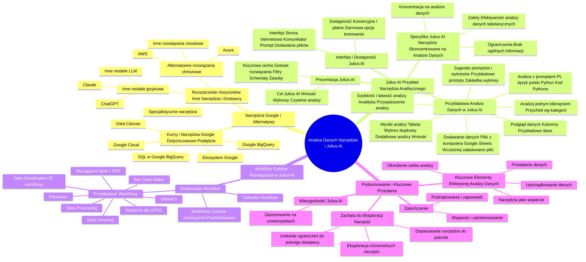

# Lekcje wideo - 7. Julius AI

# 💡 Diagram

___

# 🗒️ Notatka

# Notatki i Podsumowanie Prezentacji Wideo 🎬

## Wprowadzenie

Ten dokument zawiera szczegółowe notatki oraz podsumowanie prezentacji wideo poświęconej analizie danych. Omówiono w niej różne narzędzia analityczne, w tym specjalistyczne narzędzie `Julius AI`. Prezentacja rozszerza perspektywę poza ekosystem Google, prezentując alternatywne rozwiązania dostępne na rynku.

## Narzędzia Google i Alternatywy

### Kursy i Narzędzia Google - Dotychczasowe Podejście

- W dotychczasowych sesjach kursu koncentrowano się na narzędziach oferowanych przez Google.
- Przykłady narzędzi Google omawianych podczas kursu:
    - **Google BigQuery**
    - **Google Cloud** ☁️
    - **SQL w Google BigQuery**
    - **Data Canvas**
- Podkreślenie: dotychczasowe analizy bazowały głównie na ekosystemie Google.

### Rozszerzenie Horyzontów - Inne Narzędzia i Dostawcy

- **Google nie jest jedynym dostawcą** narzędzi do analizy danych. Istnieją alternatywy.
- Możliwość wykorzystania **innych dużych modeli językowych** niż Gemini:
    - **ChatGPT** 🤖
    - **Claude**
    - Inne modele LLM dostępne na rynku.
- Istnienie **alternatywnych rozwiązań chmurowych** poza Google Cloud:
    - **AWS (Amazon Web Services)** ☁️
    - **Azure (Microsoft Azure)** ☁️
    - Inne popularne rozwiązania cloudowe.
- Dostępność **specjalistycznych narzędzi** dedykowanych analizie danych, skoncentrowanych na konkretnych zadaniach analitycznych.

## Julius AI - Przykład Specjalistycznego Narzędzia Analitycznego

### Prezentacja Julius AI

- **Julius AI** (prelegent nazywa go "Juliusz") - przykład narzędzia wyspecjalizowanego w analizie danych.
- **Kluczowa cecha:**  Użytkownik dostarcza dane, a narzędzie oferuje gotowe rozwiązania, filtry, schematy i zasoby do analizy.
- **Cel Julius AI:** Przetwarzanie danych w celu dostarczenia:
    - Wniosków 💡
    - Gotowych wykresów 📊
    - Czytelnych analiz danych 📈

### Interfejs i Dostępność Julius AI

- **Interfejs Julius AI:**  Zaprezentowano stronę internetową narzędzia.
- **Dostępność:**
    - Narzędzie **komercyjne i płatne** w przypadku szerokiego zastosowania. 💰
    - **Darmowa opcja testowania** i eksperymentowania z narzędziem. ✅
- **Interfejs użytkownika:**
    - Wygląd przypominający popularne komunikatory i modele językowe. 💬
    - Pole do wprowadzania **promptu** (zapytania). ✍️
    - Możliwość **dodawania plików** z danymi do analizy. 📁

### Przykładowa Analiza Danych w Julius AI

- **Dodawanie danych:**
    - Możliwość wgrania plików z komputera (przykład: transakcje sklepu internetowego 🛒).
    - Integracja z **Google Sheets** 📊.
    - Możliwość wykorzystania **wcześniej załadowanych plików**.
- **Podgląd danych:**
    - Po załadowaniu pliku wyświetlany jest podgląd danych.
    - Widoczne **kolumny** i **przykładowe dane** z pliku.
- **Sugestie promptów i wykresów:**
    - Narzędzie sugeruje **przykładowe prompty**.
    - Zakładka **"wykresy"** umożliwia ręczne generowanie wykresów.
- **Analiza jednym kliknięciem:**
    - Przykład: Wygenerowanie wykresu **przychodu w podziale na kategorie** za pomocą sugerowanego promptu.
    - Szybkie uzyskanie wykresu prezentującego przychody w poszczególnych kategoriach w ciągu roku. 🚀
- **Analiza z użyciem promptów w języku polskim:**
    - Julius AI **rozumie język polski** 🇵🇱.
    - Przykład promptu: "Ile miałem transakcji w każdym miesiącu?".
    - Narzędzie wykorzystuje **Pythona** 🐍 do analizy danych i generowania wizualizacji.
    - Wyjaśnienie **kodu Pythona** generowanego przez narzędzie (przydatne dla programistów). 👨‍💻
- **Wyniki analizy:**
    - Wyniki prezentowane w formie **tabeli** 🧮 i **wykresu słupkowego** 📊.
    - **Dodatkowe analizy** sugerowane przez system (np. przychód według kategorii).
    - **Najważniejsze wnioski** generowane automatycznie przez narzędzie:
        - Okresy z największą i najmniejszą liczbą transakcji.
        - Kategoria generująca największy przychód.
        - Informacja o zbliżonym poziomie przychodów we wszystkich kategoriach.
- **Szybkość i łatwość analizy:**
    - Narzędzie dostosowane do **analityki**, co znacząco przyspiesza proces analizy danych. ⏱️

### Specyfika Julius AI - Narzędzie Skoncentrowane na Analizie Danych

- **Koncentracja na analizie danych:** Julius AI jest narzędziem wyspecjalizowanym w analizie danych.
- **Ograniczenia:** Narzędzie prawdopodobnie nie dostarczy informacji ogólnych (np. pogoda ☀️, historia Polski 🇵🇱).
- **Zalety:**  Wysoka efektywność w analizie **wgranych danych tabelarycznych** i innych źródeł informacji. 💪

## Workflow - Gotowe Rozwiązania w Julius AI

### Eksploracja Workflow

- Zakładka **"Workflow"** w menu narzędzia. ⚙️
- **Workflowy:** Gotowe, predefiniowane rozwiązania dla różnych zadań związanych z danymi.
- **Przykładowe Workflowy:**
    - **Data Processing** (Przetwarzanie Danych)
    - **Data Visualization** (Wizualizacja Danych)
    - **Data Cleaning** (Czyszczenie Danych)
    - **Statistics** (Statystyki)
    - **Bar Chart Maker** (Kreator Wykresów Słupkowych)
    - **Education** (Edukacja) 📚
    - **Wyciąganie tabel z PDF** 📄
    - **Wsparcie dla SPSS**
- **Kategoria "Data Visualization":** Dostępnych na przykład 32 workflowów w kategorii wizualizacji danych.

## Podsumowanie i Kluczowe Przesłania

### Zachęta do Eksploracji Narzędzi

- **Eksploracja różnorodnych narzędzi:** Ważne jest aktywne poszukiwanie i testowanie różnych rozwiązań dostępnych online. 🌐
- **Dopasowanie narzędzia do potrzeb:** Kluczowe jest znalezienie narzędzia, które najlepiej odpowiada indywidualnym potrzebom i wymaganiom analitycznym. 🎯
- **Unikanie ograniczeń do jednego dostawcy:** Nie należy polegać wyłącznie na jednym dostawcy lub pojedynczym rozwiązaniu. ⚠️

### Kluczowe Elementy Efektywnej Analizy Danych

- **Posiadanie danych:** Dostęp do danych jest fundamentalnym warunkiem analizy. 💾
- **Uporządkowanie danych:** Dane muszą być zorganizowane i przygotowane do analizy. 🗂️
- **Określenie celów analizy:** Należy wiedzieć, jakich informacji się poszukuje i czego oczekuje się od analizy. 🤔
- **Narzędzia jako wsparcie:** Narzędzia (Google BigQuery, Data Canvas, Julius AI) wspomagają analizę, ale nie zastąpią przygotowania danych i zdefiniowania celów. 🛠️

### Wiarygodność Julius AI

- **Zastosowanie na uniwersytetach:** Julius AI jest wykorzystywany na wielu uniwersytetach, co potwierdza jego wiarygodność i jakość. 🎓

### Zakończenie

- Celem kursu jest **wsparcie i zainteresowanie** tematem poszukiwania oraz wykorzystania nowych rozwiązań w analizie danych. 🚀
- Podziękowanie za uwagę i zapowiedź kolejnych spotkań w przyszłości. 👋

## Podsumowanie

Prezentacja wideo zachęca do poszerzenia perspektywy w analizie danych, wykraczając poza ekosystem Google. Julius AI został przedstawiony jako przykład specjalistycznego narzędzia, które usprawnia analizę danych dzięki gotowym rozwiązaniom i intuicyjnemu interfejsowi. Kluczowe przesłanie to podkreślenie znaczenia posiadania i uporządkowania danych oraz jasnego określenia celów analizy, niezależnie od wybranego narzędzia. Eksploracja różnorodnych dostępnych narzędzi jest niezbędna, aby znaleźć rozwiązanie optymalnie dopasowane do indywidualnych potrzeb.

___

# 🔉 Transcript
File: Lekcje wideo - 7. Julius AI.mp4 
[00:00:02] Ekran: Logo "Umiejętności Jutra AI". Poniżej "Organizator: Google", "Partner edukacyjny: SGH".
[00:00:05] Prelegent: Cześć.
[00:00:06] Prelegent: Do tej pory rozmawialiśmy głównie o narzędziach od jednego dostawcy, czyli od Google.
[00:00:09] Prelegent: Pokazywałem ci Google BigQuery, mówiliśmy o Google Cloudzie, o tym jak używać w Google BigQuery SQL-a, o Data Canvas.
[00:00:16] Prelegent: Opieraliśmy się o narzędzia Google.
[00:00:18] Prelegent: Ale Google to nie jedyny dostawca narzędzi, które możemy wykorzystać do analizy danych.
[00:00:23] Prelegent: Oczywiście, tak jak widziałeś, widziałaś w poprzednich kursach, używaliśmy chociażby Gemini do analizy naszych danych, do wrzucania raportów.
[00:00:32] Prelegent: Tak samo możesz wykorzystać inne duże modele językowe, chociażby takie jak ChatGPT czy Cloidy czy inne dostępne na rynku.
[00:00:40] Prelegent: Ale oprócz tego, oprócz takich dużych modeli językowych, oprócz narzędzi cloudowych, no bo są też inne narzędzia cloudowe, tak?
[00:00:48] Prelegent: Jest na przykład AWS i inne popularne rozwiązania, czy Azure na przykład.
[00:00:55] Prelegent: Są też konkretne rozwiązania dostępne na rynku służące do analizy naszych danych, specjalizujące się w analizie naszych danych.
[01:04] Prelegent: I przykładowym takim narzędziem jest na przykład Julius, jak ja go nazywam, czyli Julius AI, narzędzie, które właśnie specjalizuje się w tym, że my będziemy dostarczyć nasze dane i to narzędzie ma już gotowe rozwiązania, gotowe filtry, gotowe różnego rodzaju schematy i zasoby do tego, żeby nasze dane przeanalizować i dostarczyć nam jakieś wnioski, dostarczyć nam gotowe wykresy, przeanalizować nasze dane, żeby one były dla nas bardziej czytelne.
[01:33] Prelegent: To zagłębmy się teraz przykładowo właśnie w naszego Juliusza, Juliusza AI i zobaczmy jakie on ma możliwości, bo chcę ci pokazać, że po prostu warto szukać innych narzędzi i rozwiązań na rynku dopasowanych do twoich potrzeb.
[01:47] Ekran: Strona internetowa Julius AI. Na górze napis: "Analyze your data with computational AI. Chat with your files and get expert-level insights in seconds. Try Julius AI". Poniżej loga Princeton University, BCG, Harvard University.
[01:48] Prelegent: Przejdźmy zatem do interfejsu i zobaczmy jak możemy wykorzystać takiego Juliusa.
[01:54] Prelegent: Przychodząc do do bezpośrednio interfejsu, gdzie możemy przetestować to narzędzie za darmo, bo to jest narzędzie oczywiście komercyjne i jest płatne, jeżeli będziemy chcieli na większą skalę z niego skorzystać, ale jeżeli testujemy, chcemy się pobawić, to nie musimy ponosić tutaj żadnych kosztów.
[02:11] Prelegent: I logując się do tego narzędzia, pierwszy nasz widok to jest widok popularny z innych czatów czy innych modeli językowych, czyli po prostu miejsce, gdzie możemy napisać nasz prompt i dodać pliki, na których będziemy chcieli bazować.
[02:25] Prelegent: Wgram tutaj plik z z mojego komputera, który zawiera transakcje ze sklepu internetowego, ale mogę dodać też pliki z Google Sheetsów czy wykorzystywać pliki, które już tu wcześniej gdzieś załadowałem.
[02:38] Prelegent: Więc dodam teraz właśnie mój plik.
[02:42] Prelegent: Po załadowaniu widzę podgląd tego pliku, widzę jakie on zawiera kolumny, jakie przykładowe informacje, bo oczywiście to nie jest mój cały plik, on zawiera dużo, dużo więcej wierszy i to co widzę tutaj na górze, to od razu takie przykładowe prompty czy zapytania, o które mogę poprosić, żeby z tym mi tutaj wygenerował, albo mogę przejść na zakładki wykresy i tutaj ręcznie wygenerować sobie jakiś wykres.
[03:05] Prelegent: No to spróbujmy na przykład zapytać o pierwszy taki przykładowy tutaj wykres, czyli mój przychód na podstawie kategorii.
[03:16] Prelegent: I dostałem wykres na podstawie moich danych, widzę jakie mam kategorie w moim sklepie i widzę jaki był przychód w ciągu całego roku, bo to jest widok z całego roku dla poszczególnych kategorii i od razu widzę jaka jest różnica.
[03:28] Prelegent: Wystarczyło jedno kliknięcie i od razu otrzymałem oczekiwany wynik.
[03:32] Prelegent: Oprócz tego, mogę też po prostu zadać tutaj prompt, napisać prompt, który mnie interesowało, czyli na przykład wpiszę tutaj ile miałem transakcji w każdym miesiącu.
[03:44] Prelegent: Tak się składa, że Julius, nasz Julius rozumie język polski, więc mogę napisać prompt po polsku i tutaj dokonuje on teraz analizy, jak wszystkie modele używa do tego Pythona, którego uruchamia na podstawie właśnie przesłanej tabeli i tworzy dla mnie odpowiednią wizualizację, też dodaje mi takie krótkie wyjaśnienie tego kodu, który został tu napisany.
[04:06] Prelegent: Dla programisty zawsze można sobie taki kod również wykorzystać i przeanalizować bardziej.
[04:11] Prelegent: No i dostałem tutaj wynik właśnie ilość transakcji w każdym miesiącu, tak?
[04:16] Prelegent: Czyli widzę, że dostałem to w formę takiej tabelki, dostałem też w formie wykresu słupkowego.
[04:23] Prelegent: Dostałem też przychód według od razu kategorii, czyli takie rozwinięcie tematu, tak?
[04:27] Prelegent: Czyli system sam mi zasugerował dodatkowe rzeczy, które tutaj na od które nawet nie prosiłem, ale takie analizy pewnie w przyszłości dalej chciałbym wykonać i dostałem też najważniejsze wnioski, na przykład kiedy dzieje mieliśmy najwięcej, najmniej transakcji, jaka kategoria wygenerowała największy przychód i co ciekawe, wszystkie kategorie mają dość zbliżony poziom przychodów i wahają się pomiędzy tymi wartościami.
[04:50] Prelegent: Od razu dostałem bardzo ciekawą analizę, nie musiałem się namęczyć, więc ponieważ to rozwiązanie jest właśnie dostosowane do robienia analityki, tak?
[05:01] Prelegent: Do robienia analiz, więc ten cały model jest skupiony na tym i prawdopodobnie nie otrzymam tu informacji o tym jaka jest pogoda, czy jakichś danych na przykład o historii Polski, ale jak wgram swoje tabelki czy jakieś swoje inne źródła informacji, to dostanę to czego oczekuję.
[05:18] Prelegent: Oprócz tego, że możemy bazować po prostu na promptach czy na gotowych tutaj przykładowych sugestiach, to w menu mamy jeszcze taką opcję na przykład jak workflow.
[05:28] Ekran: Strona internetowa Julius AI. Na górze napis: "Explore Workflows. Analyze anything with custom AI workflows". Poniżej: Data Processing, Data Visualization, Data Cleaning, Statistics, Bar Chart Maker, Education.
[05:29] Prelegent: I workflowy to tutaj są przygotowane takie różne już gotowe rozwiązania, z których możemy skorzystać właśnie do naszej pracy.
[05:37] Prelegent: To może być szybka wizualizacja, to może być czyszczenie danych, czyli przygotowywanie i obrabianie naszych danych do pracy, mogą być jakieś testowanie, może być jakaś na przykład wyciąganie tabel z naszych plików PDF-ów, nawet pomoc w oczywiście kochanym i uwielbianym przez wszystkich SPSS-ie, to do tej pory mam drgawki jak o tym pomyślę i tak dalej i tak dalej.
[05:59] Prelegent: To są jakieś takie przykładowe, ale jakbyśmy przeszli na przykład do jakiś konkretnych kategorii, to na przykład w Data Visualization widzę, że mam 32 tutaj takie przykładowe workflow, z których mogę skorzystać.
[06:10] Prelegent: No i tak właśnie wygląda takie przykładowe narzędzie do specyficznie do analizy i do analityki internetowej i chciałem tutaj ci pokazać po prostu zachęcić do eksplorowania tego co jest dostępne w internecie, że nie musisz opierać się na jednym dostawcy czy na jednym rozwiązaniu, ale szukaj i znajdź rozwiązanie, które najlepiej będzie odpowiadało na twoje potrzeby.
[06:34] Prelegent: Ale mimo wszystko, nieważne z jakiego narzędzia skorzystasz, to skorzystasz, to pamiętaj, że najważniejsze jest to, żeby mieć swoje dane, mieć te dane uporządkowane i wiedzieć czego oczekujemy od takiego rozwiązania, jakich danych szukamy, jakie informacje chcemy dostać, bo bez tego no żadne narzędzie niestety nam tej pracy nie wykona, ale jak już to wiesz, wiesz czego szukasz, masz swoje dane, to wtedy skorzystaj czy właśnie z Google BigQuery, czy z Data Canvas, czy z gotowych narzędziach takich jak chociażby Julius.
[07:01] Prelegent: Zresztą, ciekawostka, używane na różnych uniwersytetach, więc jest to narzędzie sprawdzone, dlatego chociażby tutaj o nim wspominam.
[07:10] Prelegent: Mam nadzieję, że to też było pomocne i zainteresowałem cię właśnie tym konkretnym temacie poszukiwania nowych rozwiązań.
[07:18] Prelegent: To co?
[07:19] Prelegent: Na dzisiaj ci bardzo dziękuję i do zobaczenia w następnej lekcji czy w następnym kursie, bo myślę, że jeszcze spotkamy się i to nie raz.
[07:26] Prelegent: Dzięki, cześć.
[07:28] Ekran: Logo "Umiejętności Jutra AI". Poniżej "Organizator: Google", "Partner edukacyjny: SGH".

___
# 🏷️ Tags
#analiza_danych #data_analysis #narzędzia_analityczne #analytical_tools #Julius_AI #Google #Google_BigQuery #Google_Cloud #SQL #Data_Canvas #LLM #ChatGPT #Claude #AWS #Amazon_Web_Services #Azure #Microsoft_Azure #modele_językowe #big_data #przetwarzanie_danych #data_processing #wizualizacja_danych #data_visualization #czyszczenie_danych #data_cleaning #statystyki #statistics #wykresy #charts #język_polski #polish_language #Python #programowanie #programming #wnioski #insights #interfejs_użytkownika #user_interface #prompt #dane_tabelaryczne #tabular_data #workflow #edukacja #education #SPSS #komercyjne_narzędzie #commercial_tool #darmowa_opcja #free_option #transakcje_sklepu_internetowego #online_shop_transactions #Google_Sheets #przychód #revenue #kategorie #categories #transakcje #transactions #uniwersytety #universities #wiarygodność #credibility #eksploracja_narzędzi #tool_exploration #dopasowanie_narzędzi #tool_matching #cele_analizy #analysis_goals #alternatywne_rozwiązania #alternative_solutions #duże_modele_językowe #large_language_models #rozwiązania_chmurowe #cloud_solutions #specjalistyczne_narzędzia #specialized_tools #gotowe_rozwiązania #ready_made_solutions #filtry #filters #schematy #schemas #zasoby #resources #czytelne_analizy #clear_analysis #interfejs #interface #dostępność #availability #komunikatory #messengers #dodawanie_plików #file_upload #podgląd_danych #data_preview #kolumny #columns #sugestie_promptów #prompt_suggestions #wykresy #charts #analiza_jednym_kliknięciem #one_click_analysis #szybkość_analizy #analysis_speed #łatwość_analizy #analysis_ease #koncentracja_na_danych #data_concentration #ograniczenia #limitations #efektywność #efficiency #wgrane_dane #uploaded_data #źródła_informacji #information_sources #predefiniowane_rozwiązania #predefined_solutions #kreator_wykresów_słupkowych #bar_chart_maker #wyciąganie_tabel_z_PDF #extracting_tables_from_PDF #wsparcie_dla_SPSS #SPSS_support #kluczowe_przesłania #key_messages #aktywne_poszukiwanie #active_search #testowanie_rozwiązań #solution_testing #indywidualne_potrzeby #individual_needs #wymagania_analityczne #analytical_requirements #unikanie_ograniczeń #avoiding_limitations #posiadanie_danych #data_ownership #uporządkowanie_danych #data_organization #określenie_celów #defining_goals #wsparcie_analizy #analysis_support #zdefiniowanie_celów #defining_goals #wsparcie #support #zainteresowanie #interest #nowe_rozwiązania #new_solutions #podsumowanie #summary #intuicyjny_interfejs #intuitive_interface #usprawnienie_analizy #streamlining_analysis #poszerzenie_perspektywy #broadening_perspective #ekosystem_Google #Google_ecosystem #alternatywy #alternatives
