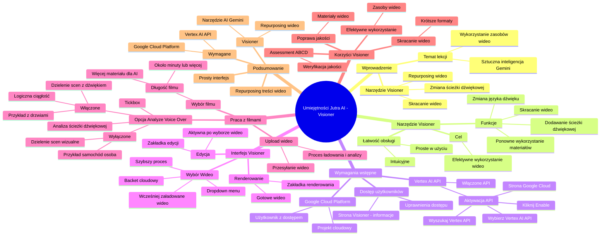

# Lekcje wideo - 3. Narzędzia audio-video ViGenAir

# 💡 Diagram

___

# 🗒️ Notatka

# Notatki i Podsumowanie Transkrypcji Wideo: `Umiejętności Jutra AI`

## Wprowadzenie 🚀

Tematem lekcji jest wykorzystanie istniejących zasobów wideo za pomocą sztucznej inteligencji Gemini. Narzędzie **Visioner** umożliwia ponowne wykorzystanie, skracanie i modyfikację materiałów wideo, w tym dodawanie nowych ścieżek dźwiękowych lub zmianę języka ścieżki dźwiękowej na potrzeby rynków zagranicznych.

## Narzędzie `Visioner` ⚙️

- **Cel:** Efektywne wykorzystanie istniejących zasobów wideo.
- **Funkcje:**
    - Skracanie wideo z zachowaniem logicznej spójności.
    - Ponowne wykorzystanie istniejących materiałów.
    - Dodawanie nowej ścieżki dźwiękowej.
    - Zmiana języka ścieżki dźwiękowej.
- **Łatwość Obsługi:** Narzędzie jest intuicyjne i proste w użyciu.

## Wymagania Wstępne do Korzystania z `Visioner` 🔑

Aby rozpocząć pracę z Visionerem, niezbędne jest posiadanie:

- Użytkownika z dostępem do `Google Cloud Platform`.
- Projektu cloudowego z włączonym `Vertex AI API`.

### Aktywacja `Vertex AI API`

1. Przejdź na stronę `Google Cloud`.
2. W polu wyszukiwania wpisz "`Vertex API`" i naciśnij `Enter`.
3. W wynikach wyszukiwania wybierz "`Vertex AI API`".
4. Kliknij niebieski przycisk "`Enable`" (Włącz), aby aktywować API.

Po wykonaniu tych kroków projekt jest gotowy do pracy z Visionerem.

### Dostęp Użytkowników 👤

- Użytkownicy Visionera muszą posiadać odpowiednie uprawnienia dostępu do projektu cloudowego.
- Szczegółowe informacje na temat dostępu można znaleźć na stronie poświęconej rozwiązaniu Visioner.

## Interfejs `Visioner` 🖥️

Po zainstalowaniu Visionera (instrukcje dostępne na stronie), użytkownik zobaczy interfejs składający się z następujących sekcji:

1. **Wybór Wideo:**
    - Umożliwia wybór filmu wideo do edycji.
    - Dostępne jest rozwijane menu z wcześniej załadowanymi filmami.
    - Wykorzystanie wcześniej załadowanych wideo przyspiesza proces, ponieważ są one już przetworzone i gotowe do edycji w `backecie` cloudowym.

2. **Edycja (początkowo nieaktywna):**
    - Zakładka przeznaczona do edycji wideo.
    - Staje się aktywna po wybraniu i załadowaniu wideo.

3. **Renderowanie:**
    - Zakładka służąca do renderowania gotowego wideo po edycji.

## Praca z Filmami w `Visioner` 🎬

### Wybór Filmu

- Zalecana długość filmów: **około minuty lub więcej**.
    - Dłuższe filmy zapewniają AI wystarczającą ilość materiału do tworzenia lepszych kreacji.

### Opcja "`Analyze Voice Over`" 🎤

- **`Tickbox` "`Analyze Voice Over`" (Analizuj Ścieżkę Dźwiękową):**
    - Określa, czy Visioner ma dzielić sceny w oparciu o ścieżkę dźwiękową.
    - **Włączone:** Sceny dzielone są z uwzględnieniem ścieżki dźwiękowej, co pozwala zachować logiczną ciągłość.
        - Przykład: Scena zamykania drzwi samochodu i odchodzenia osoby zakończy się w momencie dźwięku zamykanych drzwi.
    - **Wyłączone:** Sceny dzielone są na podstawie wizualnych zmian w obrazie.
        - Przykład: Samochód i osoba odchodząca od samochodu będą stanowić oddzielne sceny.

### Przesyłanie Wideo ("`Upload wideo`") 📤

- Po wybraniu opcji analizy ścieżki dźwiękowej (lub pominięciu jej), kliknij "`Upload wideo`" (Prześlij wideo).
- Rozpocznie się proces ładowania i analizy wideo.

## Korzyści z Wykorzystania `Visioner` ✨

- Efektywne wykorzystanie istniejących zasobów wideo.
- Możliwość skracania wideo do krótszych formatów.
- Potencjalna poprawa jakości tworzonych materiałów.
- **`Assessment ABCD`:** Każda kreacja stworzona za pomocą Visionera podlega ocenie w frameworku `ABCD`, co pomaga w weryfikacji spełnienia wymogów jakościowych.

## Podsumowanie 📝

Visioner to narzędzie oparte na sztucznej inteligencji Gemini, które umożliwia efektywne wykorzystanie i modyfikację istniejących zasobów wideo. Pozwala na skracanie filmów, zmianę ścieżek dźwiękowych i potencjalne podniesienie jakości kreacji. Aby korzystać z Visionera, niezbędne jest konto `Google Cloud Platform` z aktywnym `Vertex AI API`. Narzędzie oferuje prosty interfejs i opcje dostosowania analizy wideo do potrzeb użytkownika, co czyni je użytecznym rozwiązaniem do **repurposingu** treści wideo.

___

# 🔉 Transcript
File: Lekcje wideo - 3. Narzędzia audio-video ViGenAir.mp4 
[00:00:00] Ekran: Białe tło z pionową czarną kreską po lewej stronie.
[00:00:01] Ekran: Tekst "Umiejętności Jutra" w kolorze czarnym.
[00:00:02] Ekran: Tekst "Umiejętności Jutra AI" w kolorze czarnym i gradientowym.
[00:00:03] Ekran: Tekst "Umiejętności Jutra AI" w kolorze czarnym i gradientowym. Pod spodem tekst "Organizator Google" i "Partner edukacyjny SGH".
[00:00:05] Jacek Markowski: Na dzisiejszej lekcji porozmawiamy sobie na temat wykorzystywania istniejących assetów wideo i jak za pomocą sztucznej inteligencji Gemini możemy te assety wykorzystać ponownie, skrócić ich długość czy dodać nową ścieżkę dźwiękową, lub jeśli postanowiliście wyjść na rynki zagraniczne, zmienić ścieżkę dźwiękową na inny język, zachowując treść i logikę tego całej kreacji.
[00:00:30] Jacek Markowski: Na początek zwróćmy sobie uwagę na Visioner.
[00:00:32] Jacek Markowski: Narzędzie pozwala nam wykorzystać istniejące assety wideo, pozwala nam skrócić je, ale zachować całą logikę.
[00:00:41] Jacek Markowski: Narzędzie jest bardzo proste w użyciu, żeby rozpocząć pracę z narzędziem, potrzebujemy mieć użytkownika, który ma dostęp do Google Cloud Platform i jednocześnie projekt cloudowy, który wykorzystujemy, posiada włączony Vertex API AI.
[00:00:57] Jacek Markowski: Na początek pokażę wam, jak możemy sobie aktywować Vertex AI na naszym projekcie.
[01:02] Ekran: Strona Google Cloud.
[01:02] Jacek Markowski: Jak jesteśmy na głównej stronie naszego cloudowego projektu, w górnej ramce wyszukiwania wpisujemy sobie Vertex API i wciskamy Enter.
[01:13] Ekran: Strona z wynikami wyszukiwania Google Cloud.
[01:13] Jacek Markowski: Jako pierwszy wynik wyszukiwania będzie Vertex AI API.
[01:16] Ekran: Strona Vertex AI API w Google Cloud.
[01:16] Jacek Markowski: Wchodzimy w to i jednym przyciskiem niebieskim o nazwie Enable klikamy i włączamy nasze API.
[01:25] Jacek Markowski: I już nasz projekt jest gotowy, żebyśmy zaczęli współpracę z Visionerem.
[01:30] Jacek Markowski: Oczywiście należy pamiętać, żeby użytkownicy, którzy będą korzystali z Visionera, mieli wystarczający zakres dostępów do projektu cloudowego, który będziemy wykorzystywać, ale o tym więcej możecie sobie poczytać na naszej stronie poświęconej rozwiązaniu Visioner.
[01:46] Jacek Markowski: Teraz przejdźmy może już do samego rozwiązania.
[01:49] Ekran: Strona Visioner.
[01:49] Jacek Markowski: Po zainstalowaniu rozwiązania Visioner, które też macie na naszej stronie z krok po kroku instrukcje, jak można sobie to zainstalować, będziecie mieli taki interfejs, jak teraz widzicie na moim ekranie.
[02:04] Jacek Markowski: Pierwsza część naszego interfejsu pozwala nam wybrać wideo, na którym będziemy pracować.
[02:10] Jacek Markowski: Tu też mamy dropdown menu, z którego możemy wykorzystać, jeśli chcemy pracować już na wcześniej załadowanych wideo.
[02:16] Jacek Markowski: Dzięki temu nie będziemy musieli oczekiwać, aż to wideo zostanie załadowane i przeprocesowane, to już się znajduje na naszym backecie cloudowym i jest już gotowe do edycji.
[02:27] Jacek Markowski: Kolejne zakładka, która u mnie w tym momencie jest wyszarzona, jest to zakładka poświęcona do edycji.
[02:33] Jacek Markowski: No i ostatnia zakładeczka tutaj, którą widzicie, to jest renderowanie naszego wideo.
[02:38] Jacek Markowski: Więc może przejdźmy do działania z filmem.
[02:41] Ekran: Okno wyboru pliku.
[02:41] Jacek Markowski: Najlepiej byłoby, gdyby filmy, które chcemy wykorzystać, miały długość około minuty lub więcej.
[02:47] Jacek Markowski: Wtedy AI ma wystarczająco dużo materiałów, żeby je wykorzystać i skleić nam bardzo fajne kreacje, które będziemy wykorzystywali w dalszej części.
[02:57] Jacek Markowski: Jak wybierzemy sobie wideo, to mamy tutaj taki tickbox Analyze Voice Over.
[03:03] Jacek Markowski: I tutaj możemy zdecydować, czy chcemy, żeby Visioner podczas analizy naszego wideo dzieliło sceny uwzględniając ścieżkę dźwiękową, lub nie.
[03:13] Jacek Markowski: Jaki to ma wpływ na procesowanie i dzielenie naszego wideo na poszczególne sekcje?
[03:19] Jacek Markowski: Otóż w sekcje będą podzielone z ścieżką dźwiękową, tak żeby miało całą logiczną ciąg.
[03:25] Jacek Markowski: Czyli na przykład, jeśli mamy osobę, która wysiada z samochodu i zamyka te drzwi, ale kamera podąża za osobą, to ścieżka się dopiero utnie w chwili, jak usłyszymy klaps drzwi, zamknięcie drzwi samochodu.
[03:39] Jacek Markowski: Jeśli pominiemy to, to zostaną powydzielane na poszczególne sceny.
[03:42] Jacek Markowski: Będziemy mieli sceny z samochodem, będzie scena podzielona, jak już będzie fokus na osobie, która odchodzi od tego samochodu, będzie to najprawdopodobniej kolejna inna scena.
[03:51] Jacek Markowski: W tym przypadku ja pozostawię, żeby również była analiza voice overu i wciskam sobie Upload wideo.
[04:00] Jacek Markowski: W tym momencie ładujemy nasz film i przystępujemy do analizy naszego wideo.
[04:09] Jacek Markowski: Dzięki wykorzystaniu Visioner, oprócz tego, że możemy wykorzystać nasze assety, istniejące assety i skrócić je do krótszej formy, możemy też osiągnąć nawet poprawę naszego jakości kreacji, ponieważ każdą kreację, którą wykorzystujemy i tworzymy poprzez Visionera, poddajemy assessmentowi ABCD, czyli temu naszemu frameworkowi, który mówi, czy nasza kreacja spełnia wszystkie wymogi.

___
# 🏷️ Tags
#Visioner #AI #sztuczna_inteligencja #Gemini #wideo #edycja_wideo #ścieżka_dźwiękowa #Google_Cloud_Platform #Vertex_AI_API #Google_Cloud #API #Enable #dostęp_użytkowników #interfejs #wybór_wideo #edycja #renderowanie #film #Analyze_Voice_Over #analiza_ścieżki_dźwiękowej #Upload_wideo #przesyłanie_wideo #ABCD #Assessment_ABCD #repurposing #Umiejętności_Jutra #assety_wideo #projekt_cloudowy #backet_cloudowy
