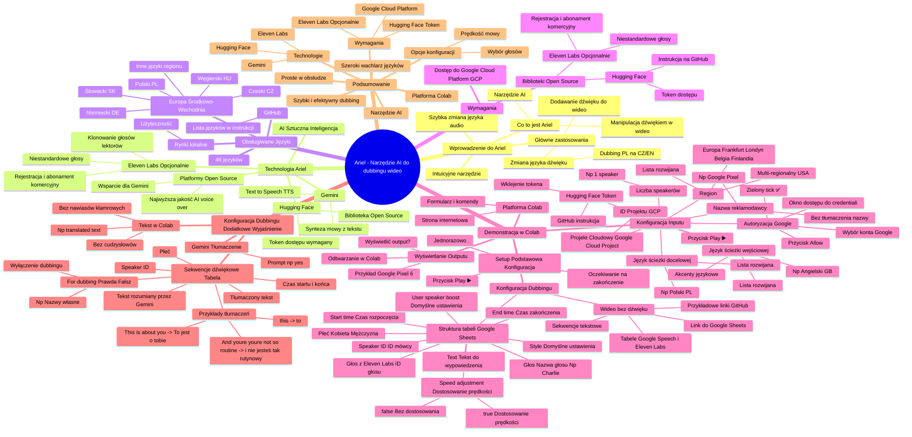

# Lekcje wideo - 4. Narzędzia audio-video Ariel

# 💡 Diagram

___

# 🗒️ Notatka

# Umiejętności Jutra AI - Ariel: Notatki i Podsumowanie

## Wprowadzenie do **Ariel**

- **Ariel** to narzędzie oparte na **sztucznej inteligencji (AI)** 🤖, które umożliwia zaawansowaną manipulację ścieżkami dźwiękowymi w wideo 🎬.
- **Dwa główne zastosowania Ariela:**
    - Dodawanie ścieżki dźwiękowej do wideo, które pierwotnie jej nie zawierało.
    - Zmiana istniejącej ścieżki dźwiękowej w wideo na inny język, na przykład dubbing z polskiego na czeski lub angielski.
- To intuicyjne narzędzie pozwala na szybką i efektywną zmianę języka audio w filmach.

## Technologia **Ariel**

- **Ariel** wykorzystuje zaawansowane technologie **AI** do generowania i modyfikacji ścieżek dźwiękowych:
    - **Gemini:** Wykorzystywany do **Text to Speech (TTS)**, czyli syntezy mowy z tekstu.
    - **Platformy open source:** Dodatkowe platformy open source wspierają **Gemini**, aby zapewnić najwyższą jakość **AI voice over**.
    - **Hugging Face:** Biblioteka open source, z której korzysta **Ariel**. Wymaga tokena dostępu.
    - **Eleven Labs** (opcjonalnie): Platforma umożliwiająca klonowanie głosów lektorów. Opcja dla użytkowników preferujących niestandardowe głosy zamiast domyślnych głosów Google. **Eleven Labs** wymaga rejestracji i abonamentu do użytku komercyjnego 💰.

## Obsługiwane Języki 🌐

- **Ariel** aktualnie obsługuje **46 języków**.
- Pełna lista wspieranych języków jest dostępna na **GitHub** w instrukcji instalacji Ariela.
- **Kluczowe:** **Ariel** wspiera języki Europy Środkowo-Wschodniej, w tym:
    - Polski 🇵🇱
    - Czeski 🇨🇿
    - Słowacki 🇸🇰
    - Węgierski 🇭🇺
    - Niemiecki 🇩🇪
    - oraz inne języki regionu.
- Dzięki temu **Ariel** jest niezwykle użyteczny na rynkach lokalnych.

## Wymagania do Korzystania z **Ariel**

- Aby rozpocząć pracę z Arielem, potrzebne są następujące elementy:
    - **Dostęp do Google Cloud Platform (GCP):** Podobnie jak w przypadku poprzedniego rozwiązania (nie sprecyzowano w tym fragmencie).
    - **Biblioteki open source:**
        - **Hugging Face:** Wymagany token dostępu. Instrukcja uzyskania tokena znajduje się na GitHubie.
        - **Eleven Labs** (opcjonalnie): Dla niestandardowych głosów lektorskich. Wymaga rejestracji i abonamentu komercyjnego.

## Demonstracja **Ariel** w **Colab**

- **Ariel** działa na platformie **Colab**, przypominającej stronę internetową z interaktywnym formularzem i komendami.
- Poniżej przedstawiono proces korzystania z Ariela krok po kroku:

    ### Podstawowa Konfiguracja (**Setup**)

    - Pierwszym krokiem jest **podstawowy setup**.
    - Należy kliknąć przycisk "play" ▶️ i poczekać na zakończenie procesu.
    - **Setup** jest wykonywany jednorazowo, co oszczędza czas podczas demonstracji.

    ### Konfiguracja Inputu

    - Kolejny etap to **konfiguracja inputu**, czyli danych wejściowych.
    - Wymagane pola:
        - **Projekt Cloud'owy (Google Cloud Project):** Należy wprowadzić ID projektu **GCP**.
        - **Region:** Wybór regionu **Google Cloud**.
            - Dostępna rozwijana lista regionów.
            - Dla projektów **multi-regionalnych** zalecane są regiony amerykańskie 🇺🇸.
            - Dla projektów z danymi w **Europie** rekomenduje się wybór europejskich centrów danych: Frankfurt 🇩🇪, Londyn 🇬🇧, Belgia 🇧🇪, Finlandia 🇫🇮.
        - **Nazwa reklamodawcy:** Wpisanie nazwy reklamodawcy (np. Google Pixel).
            - Informuje **Gemini'a**, aby nie tłumaczył tej nazwy.
        - **Język ścieżki dźwiękowej wejściowej:** Wybór języka oryginalnej ścieżki dźwiękowej (np. angielski 🇬🇧).
            - Rozwijana lista języków i akcentów (np. angielski brytyjski).
        - **Język ścieżki dźwiękowej docelowej:** Wybór języka, na który ma zostać przetłumaczona ścieżka (np. polski 🇵🇱).
        - **Liczba speakerów (mówców) w wideo:** Określenie liczby osób mówiących w wideo (np. 1 speaker).
        - **Hugging Face Token:** Wklejenie tokena pobranego z platformy **Hugging Face**. Instrukcja dostępna na GitHubie.
    - Po wypełnieniu wszystkich pól, należy kliknąć "play" ▶️ i poczekać na zakończenie procesu.
    - Pojawi się okno z prośbą o dostęp do credentiali Google'owych – należy kliknąć "Allow" i wybrać konto Google.
    - Po pomyślnej autoryzacji pojawi się zielony "tick" ✅.

    ### Konfiguracja Dubbingu

    - **Dla wideo bez oryginalnej ścieżki dźwiękowej:**
        - Należy podać **link do Google Sheets** zawierającego sekwencje tekstowe do wypowiedzenia.
        - Przykładowe linki i format tabeli są dostępne na GitHubie.
        - Tabele przygotowane dla **Google Speech** (syntezatory mowy Google) i **Eleven Labs**.
    - **Struktura tabeli Google Sheets:**
        - **Start time:** Czas rozpoczęcia sekwencji dźwiękowej.
        - **End time:** Czas zakończenia sekwencji dźwiękowej.
        - **Text:** Tekst do wypowiedzenia.
        - **Speaker ID:** ID mówcy (ważne przy dialogach, mniej istotne przy jednym mówcy, ale wymagane).
        - **Płeć:** Płeć mówcy (kobieta/mężczyzna).
        - **Głos:** Nazwa głosu (np. Charlie). W przypadku własnego głosu z **Eleven Labs**, należy wkleić ID głosu.
        - **Speed adjustment (dostosowanie prędkości):**  `true` lub `false`.
            - `true` - dostosowanie prędkości mowy, aby tekst zmieścił się w danej ramie czasowej (kluczowe przy tłumaczeniach, gdzie długość tekstu może się różnić).
        - **Style:** Ustawienie stylu głosu (zalecane ustawienia domyślne).
        - **User speaker boost:** Wzmocnienie głosu użytkownika (zalecane ustawienia domyślne).

    ### Wyświetlanie Outputu

    - Po wyrenderowaniu wideo, **Ariel** zapyta, czy wyświetlić output.
    - Po potwierdzeniu, wideo zostanie odtworzone bezpośrednio w **Colab**.
    - Umożliwia to natychmiastowe obejrzenie efektów dubbingu.
    - Przykład wideo: reklama Google Pixel 6 z dubbingiem.

## Konfiguracja Dubbingu (Dodatkowe Wyjaśnienie)

- Dodatkowe objaśnienie konfiguracji dubbingu na przykładzie tłumaczenia tekstu.
- Możliwość wpisania tekstu do przetłumaczenia bezpośrednio w **Colab** (bez nawiasów klamrowych i cudzysłowów, np. "translated text").
- Wykorzystanie **Gemini** do tłumaczenia tekstu (np. prompt "yes").
- Prezentacja przetłumaczonego tekstu (np. "make this phone what it is" -> "zrób z tego telefonu to, czym jest").
- Wyświetlenie sekwencji ścieżek dźwiękowych w formie tabeli:
    - **Czas startu i końca:** Moment rozpoczęcia i zakończenia danej frazy.
    - **Tekst (rozumiany przez Gemini):** Tekst oryginalnej ścieżki dźwiękowej rozpoznany przez **AI**.
    - **For dubbing (Prawda/Fałsz):** Flaga określająca, czy dana sekwencja ma być dubbingowana (`true`) czy pominięta (`false`).
        - Umożliwia wyłączenie dubbingu dla konkretnych fraz (np. nazw własnych jak "Google Pixel").
    - **Speaker ID:** ID mówcy.
    - **Płeć:** Płeć mówcy.
    - **Tłumaczony tekst:** Przetłumaczona wersja tekstu.
    - Przykłady tłumaczeń: "this" -> "to", "This is about you" -> "To jest o tobie", "And you're you're not so routine" -> "i nie jesteś tak rutynowy".

## Podsumowanie

- **Ariel** to zaawansowane, a zarazem proste w obsłudze narzędzie **AI** do dodawania i zmiany ścieżek dźwiękowych w wideo 🎬.
- Wykorzystuje najnowocześniejsze technologie, takie jak **Gemini**, **Hugging Face** i **Eleven Labs**, gwarantując wysoką jakość dubbingu.
- Obsługuje **szeroki wachlarz języków** 🌐, w tym języki Europy Środkowo-Wschodniej.
- Wymaga dostępu do **Google Cloud Platform** i tokena **Hugging Face**. Opcjonalnie, dla niestandardowych głosów, można skorzystać z **Eleven Labs**.
- Narzędzie dostępne jest na platformie **Colab**, co znacząco ułatwia jego użycie i konfigurację.
- **Ariel** oferuje **bogaty zestaw opcji konfiguracyjnych**, w tym regulację prędkości mowy i wybór głosów, co pozwala na precyzyjne dostosowanie dubbingu do indywidualnych potrzeb użytkownika.
- Stanowi idealne rozwiązanie dla osób i firm poszukujących **szybkiego i efektywnego dubbingowania wideo** na różnorodne języki.

___

# 🔉 Transcript
File: Lekcje wideo - 4. Narzędzia audio-video Ariel.mp4 
[00:00:00] Ekran: Białe tło z pionową czarną kreską po lewej stronie.
[00:00:01] Ekran: Napis "Umiejętności Jutra" w kolorze czarnym. Po prawej stronie napis "AI" w kolorze niebiesko-różowym.
[00:00:03] Ekran: Pod napisem "Umiejętności Jutra AI" znajdują się loga "Google" i "SGH".
[00:00:05] Jacek Markowski: To teraz przejdźmy sobie do drugiego rozwiązania Ariel.
[00:00:08] Jacek Markowski: Ariel za pomocą sztucznej inteligencji pozwoli nam dodać ścieżkę dźwiękową do wideo, które nie posiada tej ścieżki dźwiękowej, lub zmienić ścieżkę dźwiękową w już istniejącym wideo, które posiada tą ścieżkę na przykład w języku polskim, a chcielibyśmy zrobić to w języku czeskim czy angielskim.
[00:00:24] Jacek Markowski: Bez najmniejszego problemu możemy to wykonać za pomocą rozwiązania Ariel.
[00:00:28] Jacek Markowski: Ariel wykorzystuje Gemini do tak zwanej Text to Speech, ale oprócz tego wykorzystujemy inne open source'owe platformy dające wam możliwość jak najlepszego AI voice over'u.
[00:00:41] Jacek Markowski: Aktualnie Ariel wspiera 46 języków, które na naszej stronie GitHub'owej z instrukcją do instalacji Ariela możecie sobie zobaczyć, podejrzeć, które to języki wspieramy.
[00:00:51] Jacek Markowski: To co jest bardzo ważne języki naszego regionu, czyli polski, czeski, słowacki, węgierski, niemiecki i tak dalej, te tutaj najbliższe nas są wszystkimi językami wspieranymi, więc bez najmniejszego problemu będziecie mogli to wykorzystywać na tych rynkach w swoich działalnościach.
[00:01:06] Jacek Markowski: Żeby korzystać z Ariela, podobnie jak w poprzednim rozwiązaniu, będziecie potrzebowali dostęp do Google Cloud Platform, ale dodatkowo w tym przypadku będziemy chcieli, żebyście korzystali z dwóch innych bibliotek, które są open source'owe.
[00:01:19] Jacek Markowski: Jedną z nich jest Hugging Face.
[00:01:21] Jacek Markowski: Na naszej stronie GitHub'owej możecie zobaczyć jak dostać token tej platformy, żeby można było z tego w pełni korzystać.
[00:01:28] Jacek Markowski: Oraz opcjonalnie, jeśli nie chcecie korzystać z jednych z głosów, które są stokowymi głosowami głosami Google, możecie wykorzystywać platformę Eleven Labs, która zezwoli wam na klonowanie między innymi głosów waszych lektorów, które już posiadacie.
[00:01:44] Jacek Markowski: Ta platforma będzie wymagała również rejestracji oraz wykupienia abonamentu w celach korzystania komercyjnych.
[00:01:52] Jacek Markowski: Dobrze, to przejdźmy teraz może do samego narzędzia Ariel i zobaczmy jak ono wygląda.
[00:01:57] Ekran: Strona internetowa z tekstem "dubbing_workflow.ipynb" i "How to guide".
[00:01:57] Jacek Markowski: Platforma Ariel znajduje się na Colabie i jest to coś bardzo podobnego do strony internetowej, w której wypełniamy formularz i odpalamy poszczególne komendy.
[00:02:10] Jacek Markowski: Na początku będziecie musieli zrobić sobie setup podstawowy, który ja już zrobiłem, żebyśmy nie musieli na to czekać, czyli klikamy tutaj ten mały przycisk play i oczekujemy aż zakończy się procesowanie.
[00:02:23] Jacek Markowski: Kolejnym krokiem w przypadku wykorzystania Ariela to jest konfiguracja naszego inputu.
[00:02:29] Jacek Markowski: Czyli potrzebujemy nasz projekt cloud'owy.
[00:02:31] Jacek Markowski: Ja już tutaj uzupełniłem go.
[00:02:33] Jacek Markowski: Wykorzystujemy również podajemy region, z którego korzystamy.
[00:02:37] Ekran: Rozwijana lista regionów.
[00:02:41] Jacek Markowski: Z naszego drop down menu możemy sobie wybrać, który to będzie region, który korzystamy.
[00:02:42] Jacek Markowski: Jeśli mamy projekt, który jest multi regional, możemy korzystać z platform amerykańskich, jeśli mamy nasz projekt umieszczony tylko i wyłącznie w Europie, powinniśmy wybrać jeden z europejskich data centers, czyli Frankfurt, Londyn, Belgię lub Finlandię.
[00:02:56] Jacek Markowski: Kolejnym polem, które wypełniamy, to jest nazwa naszego reklamodawcy.
[00:03:01] Jacek Markowski: Czyli dajemy do zrozumienia Gemini'owi, że tej nazwy prosimy o nietłumaczenie.
[00:03:07] Jacek Markowski: Ja tutaj mam wideo dotyczące naszego telefonu Google Pixel, więc wpisuję Google Pixel.
[00:03:13] Jacek Markowski: Informujemy Gemini'a, w jakim języku mamy ścieżkę dźwiękową wejściową.
[00:03:18] Jacek Markowski: W moim przypadku jest to ścieżka dźwiękowa angielska.
[00:03:22] Ekran: Rozwijana lista języków.
[00:03:22] Jacek Markowski: Możemy również, jeśli to jest angielski brytyjski zmienić na poszczególne akcenty wersje językowe.
[00:03:28] Jacek Markowski: No i wybieramy sobie naszą ścieżkę docelową.
[00:03:31] Ekran: Rozwijana lista języków.
[00:03:31] Jacek Markowski: Ja postanowiłem wybrać język polski, czyli wybieramy sobie polski i tutaj też informujemy, pomagamy troszeczkę sztucznej inteligencji, informując ją ilu mamy speakerów na naszym wideo.
[00:03:42] Jacek Markowski: W przypadku mojego wideo jest to jeden speaker, więc zostawiamy tutaj jedyneczkę i bardzo ważna rzecz, o której wcześniej wspomniałem Hugging Face token, to jest właśnie ten token, który będziecie pobierali sobie ze strony Hugging Face.
[00:03:55] Jacek Markowski: Na naszej stronie GitHub'owej jest pełna instrukcja jak ten token pobrać i go wklejamy tutaj.
[00:03:59] Jacek Markowski: Jak mamy wszystkie informacje uzupełnione, klikamy przycisk play i czekamy jak to się zakończy.
[00:04:06] Ekran: Okno dialogowe "Allow this notebook to access your Google credentials?".
[00:04:07] Jacek Markowski: Dostaniemy okienko z zapytaniem czy może wykorzystywać nasze credentiale Google'owe.
[00:04:13] Ekran: Strona logowania Google.
[00:04:13] Jacek Markowski: Klikamy allow, wybieramy konto z którego chcemy korzystać.
[00:04:19] Ekran: Powrót do strony "dubbing_workflow.ipynb".
[00:04:21] Jacek Markowski: I zobaczymy tutaj taki zielonego tick, który oznacza, że zakończyło się sukcesem.
[00:04:27] Jacek Markowski: Mamy dodatkową konfigurację zaawansowaną konfigurację naszego inputu.
[00:04:29] Jacek Markowski: Czyli potrzebujemy nasz projekt cloudowy.
[00:04:31] Jacek Markowski: Ja już tutaj uzupełniłem go, wykorzystujemy również podajemy region, z którego korzystamy.
[00:04:37] Ekran: Rozwijana lista regionów.
[00:04:42] Jacek Markowski: Jeśli mamy projekt, który jest multi regional, możemy korzystać z platform amerykańskich, jeśli mamy nasz projekt umieszczony tylko i wyłącznie w Europie, powinniśmy wybrać jeden z europejskich data centers, czyli Frankfurt, Londyn, Belgię lub Finlandię.
[00:04:56] Jacek Markowski: Kolejnym polem, które wypełniamy to jest nazwa naszego reklamodawcy.
[00:05:01] Jacek Markowski: Czyli dajemy do zrozumienia Gemini'owi, że tej nazwy prosimy o nietłumaczenie.
[00:05:07] Jacek Markowski: Ja tutaj mam wideo dotyczące naszego telefonu Google Pixel, więc wpisuję Google Pixel.
[00:05:13] Jacek Markowski: Informujemy Gemini'a, w jakim języku mamy ścieżkę dźwiękową wejściową.
[00:05:18] Jacek Markowski: W moim przypadku jest to ścieżka dźwiękowa angielska.
[00:05:22] Ekran: Rozwijana lista języków.
[00:05:22] Jacek Markowski: Możemy również, jeśli to jest angielski brytyjski zmienić na poszczególne akcenty wersje językowe.
[00:05:28] Jacek Markowski: No i wybieramy sobie naszą ścieżkę docelową.
[00:05:31] Ekran: Rozwijana lista języków.
[00:05:31] Jacek Markowski: Ja postanowiłem wybrać język polski, czyli wybieramy sobie polski i tutaj też informujemy, pomagamy troszeczkę sztucznej inteligencji, informując ją ilu mamy speakerów na naszym wideo.
[00:05:42] Jacek Markowski: W przypadku mojego wideo jest to jeden speaker, więc zostawiamy tutaj jedyneczkę i bardzo ważna rzecz, o której wcześniej wspomniałem Hugging Face token, to jest właśnie ten token, który będziecie pobierali sobie ze strony Hugging Face.
[00:05:55] Jacek Markowski: Na naszej stronie GitHub'owej jest pełna instrukcja jak ten token pobrać i go wklejamy tutaj.
[00:06:00] Jacek Markowski: Jak mamy wszystkie informacje uzupełnione, klikamy przycisk play i czekamy jak to się zakończy.
[00:06:06] Ekran: Okno dialogowe "Allow this notebook to access your Google Drive files?".
[00:06:07] Jacek Markowski: Dostaniemy okienko z zapytaniem czy może wykorzystywać nasze credentiale Google'owe.
[00:06:13] Ekran: Strona logowania Google.
[00:06:13] Jacek Markowski: Klikamy allow, wybieramy konto z którego chcemy korzystać.
[00:06:19] Ekran: Powrót do strony "dubbing_workflow.ipynb".
[00:06:21] Jacek Markowski: I zobaczymy tutaj taki zielonego tick, który oznacza, że zakończyło się sukcesem.
[00:06:25] Ekran: Powrót do strony "dubbing_workflow.ipynb".
[00:06:25] Jacek Markowski: Mamy dodatkową konfigurację zaawansowaną konfigurację naszego wideo i teraz tak, bardzo ważną rzeczą jest jeśli wykorzystujemy nasze wideo bez voice over'u i chcemy dodać voice over, to w tym miejscu będziemy podawać link do Google Sheets'ów, w którym zawieramy poszczególne sekwencje, które chcemy, żeby zostały wypowiedziane.
[00:07:00] Jacek Markowski: Mamy tutaj przykładowe linki, które pokazują nam jak takie taka forma powinna wyglądać.
[00:07:04] Ekran: Strona GitHub z tabelą.
[00:07:10] Jacek Markowski: Mamy zarówno przygotowane to pod Google Speech, czyli pod nasze syntezatory mowy Google'owskie lub mamy też pod Eleven Labs w przypadku wykorzystania Eleven Labs też mamy takie pokazanie takiej tabelki jak to powinno wyglądać.
[00:07:15] Jacek Markowski: Co w takiej tabelce powinno się znajdować?
[00:07:17] Jacek Markowski: Podstawowym informacją to jest start i end time, czyli podajemy kiedy dana sekwencja głosowa ma być wypowiedziana od do.
[00:07:26] Jacek Markowski: Mamy podany tekst, czyli co chcemy dokładnie, żeby zostało powiedziane.
[00:07:29] Jacek Markowski: Mamy ID mówcy.
[00:07:31] Jacek Markowski: W przypadku jednego mówcy jest to mniej istotne, ale na pewno zawsze musi się zawierać, ale jakbyśmy mieli dialogi do wykorzystania, no to na pewno musimy tutaj pamiętać, żeby poszczególne ID.
[00:07:41] Jacek Markowski: Mamy określoną płeć, czyli czy to mówi kobieta czy mężczyzna.
[00:07:45] Jacek Markowski: Mamy przypisany głos.
[00:07:47] Jacek Markowski: Tutaj mamy jakiś głos Charlie.
[00:07:48] Jacek Markowski: Jeśli tworzymy własny głos, będziemy musieli pobrać ID tego głosu tu i tutaj wkleić.
[00:07:52] Jacek Markowski: Kolejnym elementem, który ustawiamy to jest dostosowywanie prędkości.
[00:07:58] Jacek Markowski: Pamiętajmy, że niektóre sekwencje, które wypowiadamy w języku polskim mogą być dłuższe niż sekwencje wypowiadane w języku angielskim.
[00:08:06] Jacek Markowski: Jest to o tyle znaczące ustawienie, jeśli chcemy pokryć się konkretnie z danymi scenami, czyli jeśli tłumaczymy coś z języka angielskiego i chcemy, żeby się zmieścił dokładnie w tej samej ramie czasowej, to musimy sobie ustawić, że ten speed adjustment musi być ustawiony na true.
[00:08:44] Jacek Markowski: No i ostatecznie mamy ustawienie stylu i user speaker boost, co polecam zostawiać w tych domyślnych ustawieniach tak jak widzicie u mnie na ekranie.
[00:09:14] Jacek Markowski: Jak już mamy wyrenderowane nasze wideo, gotowe do obejrzenia.
[00:09:17] Jacek Markowski: Narzędzie Ariel pyta nas czy chcemy zobaczyć nasz output.
[00:09:20] Jacek Markowski: Ja go poproszę o wyświetlenie naszego outputu.
[00:09:21] Ekran: Odtwarzanie wideo.
[00:09:21] Jacek Markowski: Jest to nasze wideo, które otrzymaliśmy i tutaj możemy sobie zobaczyć efekty naszej pracy.
[00:12:41] Ekran: Wideo z reklamą Google Pixel 6.
[00:12:41] Mężczyzna: To jest to to jest o tobie.
[00:12:50] Mężczyzna: I nie jesteś tak rutynowy.
[00:12:51] Mężczyzna: Poranna rutyna.
[00:12:51] Mężczyzna: Tradycje, które są zawsze lepsze.
[00:12:53] Mężczyzna: Twoje wspomnienia.
[00:12:55] Mężczyzna: Jak chcesz je zapamiętać?
[00:12:57] Mężczyzna: Twoje lęki, piegi, styl, ostatnie szlify.
[00:13:00] Mężczyzna: Rzeczy, które czynią cię tym, kim jesteś.
[00:13:04] Mężczyzna: Zrób z tego telefonu coś wyjątkowego.
[00:13:06] Ekran: Napis "Google Pixel 6".
[00:13:08] Ekran: Logo Google Store.
[00:13:50] Ekran: Powrót do strony "dubbing_workflow.ipynb".
[00:22:40] Ekran: Strona internetowa z tekstem "dubbing_workflow.ipynb" i "Dubbing configuration".
[00:22:40] Jacek Markowski: W tym przypadku będziemy wpisywali to bez nawiasów klamrowych i bez cudzysłowów wpiszemy na przykład translated text, tak jak tutaj widzicie na ekranie i później w kolejnym promcie wpiszemy już docelowo, ale mogę wykorzystać Gemini'a, czyli na przykład yes.
[00:23:10] Ekran: Powrót do strony "dubbing_workflow.ipynb".
[00:23:10] Jacek Markowski: I on mi wyświetlił, że make this phone what it is, zrób z tego telefonu to, czym jest.
[00:23:17] Jacek Markowski: I teraz, to co widzimy na ekranie.
[00:23:20] Jacek Markowski: To są sekwencje ścieżek dźwiękowych.
[00:23:23] Jacek Markowski: Mamy czas startu, mamy czas końca, mamy tekst, czyli to co Gemini zrozumiało, co było mówione podczas naszego filmu.
[00:23:30] Jacek Markowski: Mamy określenie na zasadzie prawda lub fałsz, czy dana sekwencja ma być dubbingowana i tak jak wam wcześniej wspomniałem, możemy określić frazy, które miały być nie dubbingowane, czyli na przykład jak na końcu miałbym powiedziane Google Pixel 6 czy Google Pixel, to mógłbym mieć wtedy ustawione nie dubbingu i wtedy for dubbing byłoby false i ta ten fragment by nie był przedubbingowany.
[00:23:50] Jacek Markowski: Później mamy ID speakera.
[00:23:53] Jacek Markowski: Mamy określenie płci, czyli to mówi mężczyzna.
[00:23:56] Jacek Markowski: No i mamy tłumaczony tekst.
[00:24:00] Jacek Markowski: Czyli mamy tutaj this się tłumaczy na to.
[00:24:04] Jacek Markowski: This is about you, to jest o tobie.
[00:24:19] Jacek Markowski: And you're you're not so routine i nie jesteś tak rutynowy.

___
# 🏷️ Tags
#Ariel #AI #sztuczna_inteligencja #ścieżka_dźwiękowa #wideo #dubbing #Text_to_Speech #TTS #Gemini #open_source #AI_voice_over #Hugging_Face #token_dostępu #Eleven_Labs #klonowanie_głosów #lektorzy #abonament #języki #GitHub #języki_Europy_Środkowo-Wschodniej #polski #czeski #słowacki #węgierski #niemiecki #Google_Cloud_Platform #GCP #Colab #setup #konfiguracja_inputu #projekt_Cloud #Google_Cloud #region #multi-regionalne #dane_Europa #Frankfurt #Londyn #Belgia #Finlandia #nazwa_reklamodawcy #Google_Pixel #język_ścieżki_dźwiękowej #język_docelowy #liczba_speakerów #Hugging_Face_Token #credentiale_Google #konfiguracja_dubbingu #Google_Sheets #sekwencje_tekstowe #Google_Speech #struktura_tabeli #start_time #end_time #text #speaker_ID #płeć #głos #speed_adjustment #styl #user_speaker_boost #output #reklama_Google_Pixel_6 #tłumaczenie_tekstu #sekwencje_ścieżek_dźwiękowych #czas_startu #czas_końca #tekst_rozumiany_przez_Gemini #For_dubbing #tłumaczony_tekst #szybkie_dubbingowanie #efektywne_dubbingowanie #szeroki_wachlarz_języków #bogaty_zestaw_opcji_konfiguracyjnych #regulacja_prędkości_mowy #wybór_głosów
