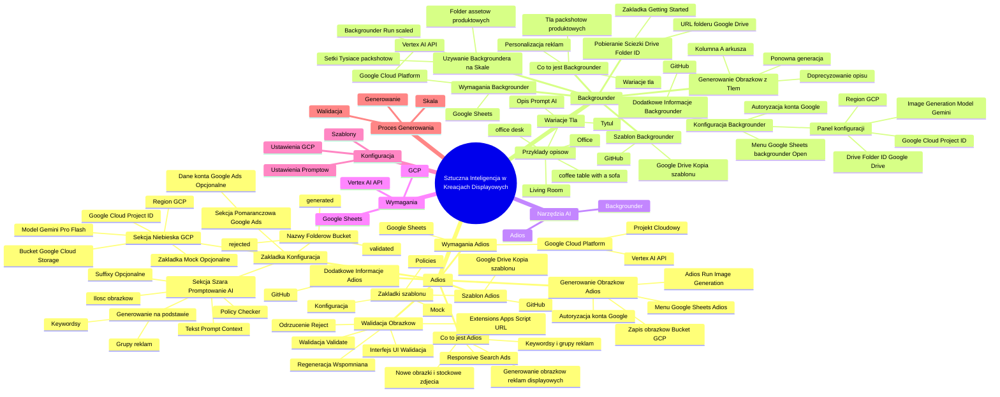

# Lekcje wideo - 5. Narzędzia generowania obrazów Adios BackgroundR

# 💡 Diagram

___

# 🗒️ Notatka

# Umiejętności Jutra: Notatki i Podsumowanie - Sztuczna Inteligencja w Kreacjach Displayowych

## Wprowadzenie

Prezentacja \"Umiejętności Jutra\" omawia wykorzystanie **sztucznej inteligencji (AI)** 🤖 do tworzenia kreacji displayowych, a konkretnie obrazków reklamowych 🖼️. Przedstawiono dwa rozwiązania oparte na **AI**, które wspierają generowanie i personalizację grafik reklamowych: **Adios** i **Backgrounder**. Narzędzia te działają w oparciu o platformę **Google Cloud Platform** i arkusze **Google Sheets**.

## Adios - Generowanie Obrazków do Reklam Displayowych

### Co to jest Adios?

*   **Adios** to narzędzie wspomagane **AI**, które ułatwia tworzenie obrazków do reklam displayowych, szczególnie dla grup reklam w kampaniach **Responsive Search Ads**.
*   Usprawnia generowanie obrazków na podstawie **keywordsów** i grup reklam.
*   Może być wykorzystywane zarówno do tworzenia nowych obrazków, jak i do przypisywania istniejących zdjęć stockowych do grup reklam.

### Wymagania do Używania Adiosa

*   **Google Sheets**: Arkusze Google stanowiące środowisko pracy narzędzia.
*   **Google Cloud Platform (GCP)**: Platforma chmurowa Google.
    *   **Projekt Cloudowy**: Wymagany projekt w **GCP**.
    *   **Vertex AI API**: W projekcie **GCP** musi być włączone **API Vertex AI**.

### Szablon Adiosa

*   Gotowy szablon **Google Sheets** jest dostępny na **GitHubie**.
*   Przed rozpoczęciem pracy należy **skopiować** szablon na swój **Google Drive**.
*   Szablon składa się z trzech zakładek:
    *   **Konfiguracja (Configuration)**: Ustawienia narzędzia.
    *   **Mock**: Zakładka przeznaczona do testowania i przykładów (danych mockowych).
    *   **Policies**: Ustawienia wytycznych dla **AI** podczas generowania obrazków.

### Zakładka Konfiguracja (Configuration)

*   **Sekcja Pomarańczowa (Linie 2-5)**: Dane konta **Google Ads**.
    *   Miejsce na wprowadzenie danych konta **Google Ads** (opcjonalne, dla integracji z kontem reklamowym).
*   **Sekcja Szara**: Ustawienia promptowania **AI**.
    *   **Generowanie na podstawie**: Wybór opcji generowania obrazków na podstawie grupy reklam lub **keywordsów**.
    *   **Tekst Prompt Context**: Szablonowy prompt wysyłany do modelu **Gemini**. Użytkownik ma możliwość modyfikacji promptu.
    *   **Suffixy**: Opcjonalne suffixy dodawane do każdego promptu, np. rozmiar obrazka, brak tła.
    *   **Ilość obrazków**: Ustawienie liczby obrazków generowanych dla każdej grupy reklam.
    *   **Policy Checker**: Ustawienia sprawdzania zgodności wygenerowanych obrazków z wytycznymi z zakładki **Policies**.
*   **Sekcja Niebieska**: Konfiguracja **Google Cloud Platform**.
    *   **Google Cloud Project ID**: ID projektu **GCP**.
    *   **Bucket**: Nazwa `bucketu` w **Google Cloud Storage**, gdzie będą przechowywane obrazki.
    *   **Model**: Wybór modelu **Gemini** do generowania obrazków (Pro lub Flash).
    *   **Region**: Wybór regionu **GCP** (np. US Central 1, Europa).
    *   **Zakładka Mock (Linia 20)**: Opcjonalne użycie zakładki **Mock** do testowania bez podłączania konta **Google Ads**. Wymaga wpisania nazwy zakładki Mock.
*   **Nazwy Folderów**: Ustawienia nazw folderów w `buckecie` **Google Cloud Storage**.
    *   `generated`: Folder na wygenerowane obrazki.
    *   `validated`: Folder na zwalidowane obrazki.
    *   `rejected`: Folder na odrzucone obrazki.

### Generowanie Obrazków za Pomocą Adiosa

1.  Po konfiguracji, w menu **Google Sheets** pojawia się przycisk **Adios**.
2.  Kliknij **Adios** -> **Adios Run** -> **Image Generation**.
3.  Przy pierwszym uruchomieniu skrypt poprosi o autoryzację dostępu do konta Google 🔑.
4.  Po autoryzacji, obrazki zostaną wygenerowane i zapisane w `buckecie` **Google Cloud Storage**.

### Walidacja Obrazków

1.  Aby obejrzeć i zwalidować obrazki, kliknij **Extensions** -> **Apps Script**.
2.  W nowej zakładce **Apps Script** wybierz **Deploy** -> **Test Deployments**.
3.  Kliknij wygenerowany **URL**.
4.  Otworzy się interfejs użytkownika (UI) do walidacji obrazków.
5.  Obrazki są wyświetlane dla każdej grupy reklam.
6.  Można **zwalidować** (Validate) obrazki, które są akceptowalne ✅.
7.  Można **odrzucić** (Reject) obrazki, które nie pasują ❌. Odrzucone obrazki są oznaczone czerwonym krzyżykiem.
8.  Istnieje możliwość poproszenia o **regenerację** odrzuconych obrazków (nie zostało to pokazane w demonstracji, ale wspomniano o tej funkcji).

### Dodatkowe Informacje o Adios

*   Więcej szczegółów dostępnych jest na **GitHubie** (link w materiałach pomocniczych).

## Backgrounder - Dodawanie Tła do Packshotów Produktowych

### Co to jest Backgrounder?

*   **Backgrounder** to narzędzie **AI** przeznaczone do tworzenia teł do `packshotów` produktowych 📦.
*   Umożliwia personalizację reklam poprzez dodawanie kontekstowych teł do zdjęć produktów.
*   Pozwala na generowanie różnorodnych wariacji tła.

### Wymagania do Używania Backgroundera

*   **Google Cloud Platform (GCP)**: Platforma chmurowa Google.
    *   **Vertex AI API**: W projekcie **GCP** musi być włączone **API Vertex AI**.
*   **Google Sheets**: Arkusze Google, w których działa szablon narzędzia.

### Szablon Backgroundera

*   Szablon **Google Sheets** jest dostępny na **GitHubie**.
*   Należy **skopiować** szablon na swój **Google Drive**.

### Konfiguracja Backgroundera

1.  Po skopiowaniu szablonu, w menu **Google Sheets** pojawia się przycisk `backgrounder`.
2.  Kliknij `backgrounder` -> **Open**.
3.  Przy pierwszym uruchomieniu skrypt poprosi o autoryzację 🔑.
4.  Po prawej stronie arkusza pojawi się panel konfiguracji.
5.  Uzupełnij konfigurację:
    *   **Google Cloud Project ID**: ID projektu **GCP**.
    *   **Region**: Wybór regionu **GCP** (np. Europe West 3).
    *   **Image Generation Model**: Wybór modelu (aktualnie dostępny jeden model).
    *   **Drive Folder ID**: Ścieżka do folderu na **Google Drive**, z którego będą pobierane `packshoty`.

### Pobieranie Ścieżki Drive Folder ID

*   Instrukcja pobierania ścieżki **Drive Folder ID** znajduje się w zakładce **Getting Started** w szablonie **Google Sheets**.
*   Ścieżkę można znaleźć w **URL** folderu na **Google Drive**, po ostatnim slaszu `/`.

### Wariacje Tła (Background Variations)

*   Możliwość ustawienia wariacji tła poprzez podanie **tytułu** i **opisu**.
*   Opis stanowi prompt dla **AI** generującego tło. Im bardziej szczegółowy opis, tym lepsze rezultaty.
    *   Przykład: \"Living Room\", \"Office\", \"coffee table with a sofa\", \"office desk\".

### Generowanie Obrazków z Tłem

1.  Po konfiguracji i ustawieniu wariacji tła, obrazki z tłem zostaną wygenerowane w kolumnie A arkusza.
2.  Jeśli wygenerowane tła nie spełniają oczekiwań, można **doprecyzować opis** wariacji tła.
3.  Po doprecyzowaniu opisu, można ponownie wygenerować obrazki.

### Używanie Backgroundera na Skalę (Run Scaled)

*   Do przetwarzania dużej liczby `packshotów` dostępna jest opcja **Run scaled**.
*   **Backgrounder** -> **Run scaled** umożliwia przetworzenie całego folderu z assetami produktowymi.
*   Pozwala na przetworzenie setek, a nawet tysięcy `packshotów`.

### Dodatkowe Informacje o Backgrounder

*   Więcej informacji dostępnych jest na **GitHubie** (link w materiałach pomocniczych).

## Podsumowanie i Zachęta

Narzędzia **Adios** i **Backgrounder** to praktyczne rozwiązania wykorzystujące **sztuczną inteligencję** do generowania i personalizacji obrazków reklamowych 🖼️. Ułatwiają tworzenie kreacji displayowych na dużą skalę, oszczędzając czas ⏱️ i zwiększając efektywność działań marketingowych 🚀. Zachęcamy do korzystania z tych narzędzi i eksplorowania ich możliwości.

___

# 🔉 Transcript
File: Lekcje wideo - 5. Narzędzia generowania obrazów Adios BackgroundR.mp4 
[00:00:00] Ekran: Białe tło.
[00:00:01] Ekran: Tytuł "Umiejętności Jutra" z logo AI. Pod spodem loga Google i SGH.
[00:00:05] Jacek Markowski: Sztuczną inteligencję możemy wykorzystać do tworzenia kreacji w różny sposób.
[00:00:10] Jacek Markowski: Teraz skupimy się jak możemy za pomocą sztucznej inteligencji tworzyć kreacje displayowe, czyli obrazki.
[00:00:16] Jacek Markowski: Pokażę wam dwa rozwiązania.
[00:00:18] Jacek Markowski: Pierwsze to jest Adios, które pomoże nam tworzyć obrazki do całych ad grup, które wykorzystujemy w tak zwanych Responsive Search Ads, a drugie rozwiązanie to jest backgrounder, czyli jak mamy produktowe packshoty, czyli obrazki naszych produktów bez tła, w łatwy i prosty sposób możemy spersonalizować wygląd tych produktów dorabiając tła na nasze potrzeby.
[00:00:40] Jacek Markowski: Więc skupmy się może na początek na rozwiązaniu pierwszym, czyli Adiosie.
[00:00:45] Jacek Markowski: Żeby używać narzędzia Adios, będziemy potrzebowali oprócz Google Sheets rozwiązania Google Cloud Platform.
[00:00:52] Jacek Markowski: Będziemy potrzebowali projekt cloudowy, w którym mamy włączony Vertex AI API i tak jak wcześniej powiedziałem Google Sheets.
[01:01:59] Jacek Markowski: Mamy dla was specjalnie przygotowaną templatkę, szablon rozwiązania, który możecie sobie w bardzo łatwy sposób skonfigurować i później już zacząć używać tego bezpośrednio do generowania obrazków pod wasze search grupy lub keywordsy, a jeśli macie już wygenerowane obrazki lub macie stockowe zdjęcia, w łatwy sposób możecie wykorzystać to narzędzie, aby dopisać istniejące stockowe zdjęcia do poszczególnych ad grup.
[01:28] Jacek Markowski: Ja się skupię tu, żeby wam zademonstrować jak się generuje te obrazki, ad grupy się bardzo przypisuje w bardzo podobny sposób.
[01:36] Jacek Markowski: To co widzicie na ekranie, to jest przygotowany szablon Adiosa, który sobie skopiowałem na swój Drive i żeby używać tego, pamiętajcie, najpierw skopiujcie plik, dopiero później zaczniecie robić jakiekolwiek zmiany.
[01:50] Jacek Markowski: Mamy trzy zakładki w tym pliku.
[01:52] Jacek Markowski: Pierwszy to jest konfiguracja, drugi to jest Mock.
[01:55] Jacek Markowski: Jest to ta zakładka, którą ja w swoim przypadku będę wykorzystywał, ponieważ nie przypiszę tego do żadnego mojego konta reklamowego, tylko będę na podstawie mockowych przykładów wam pokazywał jak to można wykorzystać i trzecia zakładka to jest policies.
[02:10] Jacek Markowski: Zakładka policies jest o tyle przydatna, że możemy tutaj wpisać jakieś zastrzeżenia czy jakieś wytyczne dla sztucznej inteligencji przy tworzeniu obrazków.
[02:19] Jacek Markowski: Tak jak widzicie u mnie na tej zakładce, mam wpisane, żeby nie tworzyło zdeformowane twarze, nie tworzyło zdeformowanych rąk, tudzież, żeby każda ręka, która jest wytworzona przez sztuczną inteligencję zawierała pięć palców.
[02:32] Jacek Markowski: W zakładce Mock ja sobie przygotowałem dwie ad grupy, ad grupy napoje i ad grupa desery i w tych dwóch ad grupach wypisałem sobie poszczególne keywordsy, które będziemy używali.
[02:45] Jacek Markowski: Te keywordsy i te ad grupy zazwyczaj macie skonfigurowane u siebie w koncie Google Ads i to będziecie mogli wykorzystać i przypisywać.
[02:54] Jacek Markowski: Wracając do pierwszej zakładki konfiguracyjnej.
[02:58] Jacek Markowski: Pierwsza część od linii drugiej do piątej oznaczona kolorem pomarańczowym, to są miejsca, gdzie wypisujecie dane dotyczące waszego konta Google Ads.
[03:09] Jacek Markowski: Później część szara, to jest część, w której przygotowujemy ustawienia pod promptowanie sztucznej inteligencji.
[03:17] Jacek Markowski: Takie to na przykład jak czy chcemy to generować na podstawie ad grupy czy poszczególnych keywordsów.
[03:23] Jacek Markowski: Tutaj mamy tekst prompt context, czyli przygotowany znowu szablonowo prompt, który będziemy wysyłali do Gemini.
[03:31] Jacek Markowski: Ten prompt zawsze możecie troszeczkę zmodyfikować na swoje potrzeby.
[03:35] Jacek Markowski: Macie tutaj też dalszą część promptu i możemy suffixy pododawać.
[03:38] Jacek Markowski: Jest to opcjonalnie jakiś suffix, który będzie do każdego promptu na koniec dodawany.
[03:45] Jacek Markowski: Na przykład możemy do obrazka dodać suffix, aby było rozmiaru zawsze 600 na 600 czy żeby nie miało tła lub coś takiego.
[03:54] Jacek Markowski: Również tutaj generujemy sobie ilość, ilość obrazków generowanych do każdej ad grupy.
[04:02] Jacek Markowski: No i mamy nasze policy checker, czyli to co ma sprawdzić czy każdy wygenerowany obrazek spełnia nasze wymogi.
[04:09] Jacek Markowski: Część niebieska, to jest część konfiguracji ustawień naszego Google Cloud Platform, czyli podajemy nasz Google Cloud Project ID tego projektu, podajemy nasz bucket, czyli w Google Cloud Storage tworzymy sobie bucket, w którym będziemy przetrzymywali wszystkie obrazki wytworzone.
[04:27] Jacek Markowski: Wybieramy model, który będziemy używali do generowania obrazków.
[04:33] Jacek Markowski: No i model Gemini.
[04:34] Jacek Markowski: Możemy wybrać Pro lub Flash, który chcemy używać.
[04:37] Jacek Markowski: No i standardowo wybieramy sobie region, w którym działamy.
[04:40] Jacek Markowski: Na przykład US Central 1, tak jak w moim przypadku.
[04:44] Jacek Markowski: Możemy też wykorzystywać Europę.
[04:48] Jacek Markowski: Rzecz w linii 20, jest to wykorzystywana tylko i wyłącznie opcjonalnie i tak jak ja będę wykorzystywał, czyli tworzymy mockowe obrazki tylko i wyłącznie dla przykładu.
[05:00] Jacek Markowski: Jeśli chcecie spróbować używać tego narzędzia nie podpinając się jeszcze pod wasze konto Google Ads, zachęcam was, żebyście właśnie mieli jakąś zakładkę, tak jak ja tutaj mam zakładkę Mock i wpisujemy nazwę tej zakładki, którą będziemy wykorzystywali.
[05:14] Jacek Markowski: Ostatnia rzecz, są to nazwy folderów, które nam się potworzą na naszym buckecie storageowym na Google Cloud Storage i w tych folderach poszczególne obrazki będą wrzucane podczas generacji.
[05:26] Jacek Markowski: Podstawowym folderem jest generated i w tym folderze będą znajdowały się wygenerowane obrazki.
[05:31] Jacek Markowski: Później mamy jeszcze zwalidowane i odrzucone obrazki, ponieważ każdy obrazek możemy zwalidować, odrzucić lub poprosić o regenerację.
[05:40] Jacek Markowski: Jak już mamy to wszystko skonfigurowane, to w górnej części tutaj mojego ekranu widzicie poszczególne opcje menu i na samym końcu za opcją Help znajduje się nowy przycisk Adios i tutaj możemy sobie wejść w Adios Run i wybieramy Image Generation.
[06:00] Jacek Markowski: Ten skrypt przy pierwszym uruchomieniu poprosi was o autoryzację.
[06:05] Jacek Markowski: Jeśli tego nie zrobicie, to oczywiście skrypt nie będzie mógł działać, a jeśli to zrobicie za pierwszym razem, to już przy każdym kolejnym nie będziecie proszeni o to.
[06:14] Jacek Markowski: Jak już widzieliście na moim ekranie, obrazki zostały wygenerowane do moich ad grup.
[06:20] Jacek Markowski: No i teraz co należy zrobić, żeby obejrzeć wyniki tego.
[06:24] Jacek Markowski: A więc klikamy sobie w Extensions i wchodzimy w Apps Script.
[06:28] Jacek Markowski: Otworzy nam się nowa zakładka.
[06:32] Jacek Markowski: I w na tej zakładce jest skrypt, który tak naprawdę jest silnikiem napędzającym całe nasze rozwiązanie Adios i po prawej stronie mamy przycisk Deploy i wybieramy sobie Test Deployments.
[06:44] Jacek Markowski: Jak tu się pojawi nam link, klikamy sobie w ten link URL, odpali nam się kolejna zakładka, która będzie zawierała UI, w którym będziemy mogli sobie walidować nasze poszczególne obrazki.
[06:57] Jacek Markowski: I tak jak widzicie, ja poprosiłem o wygenerowanie pięciu obrazków do każdej z moich ad grup.
[07:03] Jacek Markowski: Mieliśmy ad grupę desery i napoje i tutaj tak jak widzicie, każdy obrazek jest w troszeczkę innej formie, innej postaci zawierający te napoje.
[07:13] Jacek Markowski: Jak ja przejdę teraz na swoją zakładkę, proszę zwrócić uwagę, że na przykład napoje zawierają soda, coffee, ice tea, water, juice.
[07:21] Jacek Markowski: I teraz wracając do do tego, będziemy mieli właśnie obrazki, które będą zawierały te napoje.
[07:27] Jacek Markowski: Obrazki, które nam nie pasują, możemy sobie wybrać, na przykład te dwa i w prawym górnym rogu mogę kliknąć, żeby odrzucić te obrazki, czyli odrzucamy te dwa obrazki, one automatycznie zostaną odrzucone, a my będziemy mogli przejść do dalszej pracy z pozostałymi.
[07:55] Jacek Markowski: Tak jak widzicie te, które odrzuciłem, mają czerwony krzyżyk, a na przykład powiedzmy te trzy obrazki mi pasują, więc klikam sobie na Validate.
[08:23] Jacek Markowski: To by było na tyle, jeśli chodzi o rozwiązanie Adios.
[08:26] Jacek Markowski: Jeśli chcecie wiedzieć więcej o nim, zachęcam was do odwiedzenia naszej strony GitHub.
[08:31] Jacek Markowski: Link znajdziecie w materiałach pomocniczych.
[08:34] Jacek Markowski: A teraz skupmy się na drugim rozwiązaniu, czyli backgrounder.
[08:37] Jacek Markowski: Pozwala ono tworzyć tła do packshotów produktowych i wykorzystywanie ich w waszych spersonalizowanych reklamach.
[08:46] Jacek Markowski: Żeby korzystać z backgroundera, jedyne co potrzebujecie to dostęp do Google Cloud Platform z włączone Vertex AI API oraz dostęp do Google Sheets.
[08:56] Jacek Markowski: Na stronie GitHubowej poświęconej rozwiązaniu backgrounder znajdziecie templatkę Google Sheetsową z tym rozwiązaniem.
[09:04] Jacek Markowski: Proszę skopiujcie ją sobie i już będziecie gotowi, żeby zacząć używać tego rozwiązania.
[09:09] Jacek Markowski: Ja przygotowałem u siebie już taką zakładkę i nawet mam już wgrane obrazki, z których będę korzystał, ale po kolei, jak możemy zacząć korzystać z rozwiązania.
[09:18] Jacek Markowski: Po skopiowaniu zakładki, podobnie jak w przypadku Adiosa, u góry znajdziecie dodatkowy przycisk z menu.
[09:24] Jacek Markowski: Jest to przycisk o nazwie backgrounder i klikamy sobie w backgrounder oraz Open.
[09:31] Jacek Markowski: Skrypt przy pierwszym uruchomieniu również was poprosi o autoryzację i o pozwolenie na korzystanie z pewnych zasobów waszego konta googlowego.
[09:40] Jacek Markowski: Jak na to wydacie zgodę, uruchomi wam się taka konfiguracja, jak widzicie u mnie po prawej stronie ekranu.
[09:45] Jacek Markowski: U mnie już jest ono uzupełniona, ponieważ uzupełniłem i zapisałem sobie tą konfigurację, a wy będziecie musieli ją po kolei uzupełnić, zaczynając od podanie ID swojego projektu cloudowego, ustawienie regionu, z którego chcecie korzystać.
[09:59] Jacek Markowski: W tym przypadku ja wybrałem Europe West 3.
[10:01] Jacek Markowski: Wybranie generatora obrazków, modelu, z którego będziemy korzystać, aktualnie jest tutaj udostępniony jeden jedyny oraz podanie ścieżki do folderu na Google Drive, z którego będziecie korzystać.
[10:13] Jacek Markowski: Informacje dotyczące Google Cloud Project ID oraz regionu wynikają bezpośrednio z ustawień waszego konta Google Cloud Platform, a dokładniej rzecz biorąc samego projektu.
[10:22] Jacek Markowski: Jeśli chodzi o Image Generation Model, jest to drop down menu, więc mamy jedną jedyną opcję do wyboru.
[10:30] Jacek Markowski: Bardzo ważną rzeczą jest, aby podać prawidłową ścieżkę.
[10:33] Jacek Markowski: W zakładce Getting Started znajdziecie informacje jak można taką właśnie ścieżkę pobrać.
[10:40] Jacek Markowski: Czyli jak wejdziemy sobie na nasz Google Drive, to w linku URL na końcu po slaszu będziemy mieli ciąg znaków, tak jak na przykład tutaj w tej komórce i takie coś dokładnie kopiujemy i wgrywamy do naszego do naszego pola poświęconego na Drive Folder ID.
[10:59] Jacek Markowski: Jak już mamy to zrobione, to możemy ustawić wariacje backgroundu, czyli wariacje jakie tworzymy.
[11:04] Jacek Markowski: Wpisujemy tytuł oraz opis.
[11:06] Jacek Markowski: Ja na potrzeby tego ćwiczenia postanowiłem wykorzystać bardzo proste opisy, czyli nazwałem to Living Room oraz Office i nie podałem nic więcej.
[11:13] Jacek Markowski: Oczywiście możemy tutaj w opisie być bardziej szczegółowi i podać, że chcemy mieć kanapę, żeby chcemy mieć biurko i tak dalej i tak dalej.
[11:22] Jacek Markowski: Więc to możemy wszystko mieć uzupełnione.
[11:25] Jacek Markowski: Jak już mamy wszystko skonfigurowane, to pobieramy sobie obrazki i tak jak widzicie u mnie te obrazki za chwilę się załadują od nowa, na chwilę zniknęły i w kolumnie A zostaną wygenerowane te obrazki.
[11:38] Jacek Markowski: Tak jak widzicie po obrazkach, które zostały u mnie wygenerowane, czasami sztuczna inteligencja może spłatać nam figla w postaci wygenerowania czegoś innego.
[11:40] Jacek Markowski: Nie należy się tym zrażać.
[11:43] Jacek Markowski: Wystarczy, że doprecyzujemy nasz opis, który chcemy tutaj osiągnąć albo zapuścimy generację jeszcze raz.
[11:50] Jacek Markowski: Ja w tym przypadku doprecyzuję swój opis, że chciałbym mieć coffee table with a sofa.
[12:28] Jacek Markowski: Office desk.
[12:32] Jacek Markowski: Zapiszę tą konfigurację i poprosimy Gemini o wygenerowanie naszych obrazków ponownie.
[13:01] Jacek Markowski: Tak jak widzicie po doprecyzowaniu mojego opisu, udało nam się wygenerować bardzo fajne obrazki z tłami.
[13:08] Jacek Markowski: Na pierwszym mamy kubek kawy, w tle widzimy troszeczkę kanapy oraz mamy biurko z jakimiś dokumentami, tak samo w przypadku laptopa, zarówno biurko jak i kanapa.
[13:18] Jacek Markowski: Backgroundera możemy wykorzystywać również na skalę.
[13:22] Jacek Markowski: Jeśli chcemy wykorzystywać rozwiązanie na skalę, to mamy tutaj zakładkę Run i wtedy dodajemy cały folder z naszymi assetami packshotami produktowymi do wygenerowania i uruchamiamy całą kolejkę, czyli wygenerujemy, przetworzymy wszystkie nasze asety i mamy tutaj w zakładce backgrounder mamy Run scaled i to rozwiązanie pozwoli nam przetworzyć setki czy nawet tysiące packshotów, które mamy do przeprocesowania.
[13:50] Jacek Markowski: To było na tyle, jeśli chodzi o rozwiązanie backgrounder.
[13:52] Jacek Markowski: Zachęcam was do skorzystania z tych dwóch narzędzi, które wam pokazałem, bo one w łatwy sposób pozwolą wam wygenerować obrazki w skali oraz spersonalizować wasze działania marketingowe.
[14:02] Ekran: Tytuł "Umiejętności Jutra" z logo AI. Pod spodem loga Google i SGH.

___
# 🏷️ Tags
#sztuczna_inteligencja #AI #kreacje_displayowe #obrazki_reklamowe #Adios #Backgrounder #Google_Cloud_Platform #GCP #Google_Sheets #generowanie_obrazków #personalizacja_grafik #reklamy_displayowe #Responsive_Search_Ads #keywords #zdjęcia_stockowe #szablon #GitHub #Google_Drive #Konfiguracja #Configuration #Mock #Policies #promptowanie #Gemini #suffixy #Policy_Checker #Google_Cloud_Project_ID #bucket #Google_Cloud_Storage #model_Gemini #region_GCP #Adios_Run #Image_Generation #autoryzacja #Apps_Script #Test_Deployments #URL #UI #walidacja_obrazków #Validate #Reject #regeneracja_obrazków #packshoty #produkty #Drive_Folder_ID #Getting_Started #Background_Variations #Run_scaled #efektywność_marketingowa
