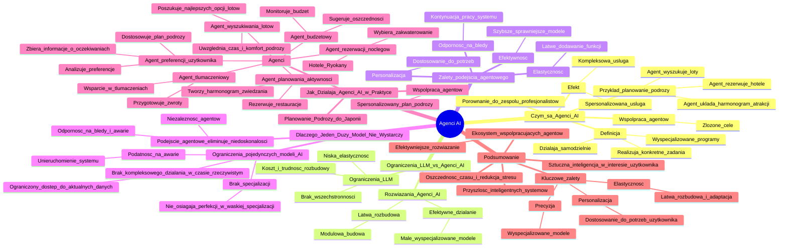

# Lekcje wideo - 2. Wprowadzenie do Agentów AI

# 💡 Diagram

___

# 🗒️ Notatka

# Agenci AI: Przyszłość Inteligentnych Systemów - Szczegółowe Notatki i Podsumowanie 🚀

## Wprowadzenie

* **Problem:** Planowanie wymarzonej podróży 🌍 może być przytłaczające z powodu ogromu szczegółów organizacyjnych, takich jak rezerwacje lotów ✈️, noclegów 🏨 i atrakcji 🏞️.
* **Rozwiązanie:** Agenci AI mogą zautomatyzować i uprościć ten proces, działając jako inteligentne systemy.
* **Wizja:** Wystarczy jedno zdanie opisujące podróż, a agent AI zajmie się całą resztą.

## Czym są Agenci AI? 🤔

* **Definicja:** Agenci AI to **wyspecjalizowane programy**, które działają **samodzielnie** i realizują **konkretne zadania**.
* **Porównanie:** Można ich porównać do **zespołu profesjonalistów**, gdzie każdy agent jest ekspertem w swojej dziedzinie.
* **Współpraca:**  Wspólna praca agentów umożliwia osiągnięcie **złożonych i spersonalizowanych celów**.
* **Przykład w planowaniu podróży:**
    * Agent wyszukuje loty ✈️.
    * Agent rezerwuje hotele 🏨.
    * Agent układa harmonogram atrakcji 🏞️.
* **Efekt:** Kompleksowa i spersonalizowana usługa, idealnie dopasowana do potrzeb użytkownika.

## Ograniczenia Dużych Modeli Językowych (LLM) vs. Rozwiązania Agentów AI 💡

* **Duże modele językowe (LLM) są imponujące, ale posiadają istotne ograniczenia:**
    * **Brak wszechstronności.** Jeden model nie może być ekspertem we wszystkim.
    * **Wysoki koszt i trudność rozbudowy.** Dodawanie nowych funkcji jest skomplikowane i kosztowne.
    * **Niska elastyczność.** Awaria jednego elementu może sparaliżować cały system.

* **Agenci AI stanowią odpowiedź na te problemy:**

| Ograniczenia dużych modeli językowych | Rozwiązania Agenci AI |
|---|---|
| Kosztowne i trudne w rozbudowie | Łatwa rozbudowa dzięki modułowej budowie (dodawanie kolejnych agentów) |
| Mało elastyczne | Efektywne działanie - małe, wyspecjalizowane modele pracują szybciej i precyzyjniej |

## Dlaczego AI Zmierza w Stronę Agentów? - Zalety Podejścia Agentowego ✅

* Podejście oparte na agentach jest innowacyjne i niesie ze sobą szereg korzyści:

| Zalety podejścia agentowego | Opis |
|---|---|
| **Efektywność** | Mniejsze, wyspecjalizowane modele działają szybciej i sprawniej. |
| **Elastyczność** | Proste dodawanie nowych funkcjonalności poprzez implementację kolejnych agentów. |
| **Odporność na błędy** | W przypadku awarii jednego agenta, pozostała część systemu kontynuuje pracę bez zakłóceń. |
| **Personalizacja** | Każdy agent dostosowuje swoje działania do indywidualnych potrzeb użytkownika. |

## Dlaczego Jeden Duży Model Językowy Nie Wystarczy? 🙅‍♂️

* **Ograniczenia pojedynczych modeli AI:**
    * **Brak zdolności do kompleksowego działania w czasie rzeczywistym.** Ograniczony dostęp do aktualnych danych, takich jak ceny lotów ✈️ i dostępność hoteli 🏨.
    * **Brak specjalizacji.** Dobre w wielu dziedzinach, ale nie osiągają perfekcji w konkretnej, wąskiej specjalizacji.
    * **Podatność na awarie.** Awaria pojedynczego modelu może unieruchomić cały system.

* **Podejście agentowe eliminuje te niedoskonałości:**
    * Agenci działają niezależnie, co zwiększa niezawodność systemu.
    * System staje się znacznie bardziej odporny na błędy i awarie.

## Jak Działają Agenci AI w Praktyce - Planowanie Podróży do Japonii 🇯🇵

* **Przykład praktycznego zastosowania agentów AI: planowanie podróży do Japonii:**

| Agent | Rola |
|---|---|
| **Agent preferencji użytkownika** |  Zbiera informacje o oczekiwaniach, analizuje preferencje i na ich podstawie dostosowuje plan podróży. |
| **Agent wyszukiwania lotów** | Poszukuje najlepszych dostępnych opcji lotów ✈️, biorąc pod uwagę preferowany czas i komfort podróży. |
| **Agent rezerwacji noclegów** | Wybiera idealne zakwaterowanie, od nowoczesnych hoteli 🏨 po tradycyjne japońskie `ryokany`. |
| **Agent planowania aktywności** | Tworzy szczegółowy harmonogram zwiedzania i rezerwuje miejsca w restauracjach 🍜. |
| **Agent tłumaczeniowy** | Przygotowuje zestaw podstawowych zwrotów i oferuje wsparcie w tłumaczeniach na miejscu. |
| **Agent budżetowy** | Monitoruje budżet podróży i sugeruje potencjalne oszczędności 💰. |

* **Współpraca agentów:** Każdy agent koncentruje się na swoim zadaniu, a rezultaty ich pracy łączą się w spersonalizowany i kompleksowy plan podróży.

## Podsumowanie 📝

* **Agenci AI to przyszłość inteligentnych systemów.**
* **Ekosystem współpracujących agentów** stanowi bardziej efektywne rozwiązanie niż jeden, monolityczny model.
* **Kluczowe zalety agentów AI:**
    * **Precyzja** (dzięki wyspecjalizowanym modelom)
    * **Elastyczność** (łatwa rozbudowa i adaptacja)
    * **Personalizacja** (dostosowanie do indywidualnych potrzeb użytkownika)
* **Oszczędność czasu ⏱️ i redukcja stresu** to dodatkowe korzyści wynikające z wykorzystania agentów AI.
* **Sztuczna inteligencja działająca w interesie użytkownika.**

---

**Podsumowanie w punktach:**

* Tradycyjne planowanie podróży jest procesem skomplikowanym i czasochłonnym ⏳.
* Agenci AI oferują innowacyjne rozwiązanie poprzez automatyzację i personalizację procesu planowania.
* Agenci AI to wyspecjalizowane programy działające autonomicznie, przypominające zespół ekspertów.
* Duże modele językowe (LLM) napotykają ograniczenia (koszt, elastyczność, brak specjalizacji), które agenci AI skutecznie rozwiązują.
* Podejście agentowe charakteryzuje się większą efektywnością, elastycznością, odpornością na błędy i możliwościami personalizacji.
* W kontekście planowania podróży, agenci AI mogą kompleksowo zarządzać preferencjami użytkownika, wyszukiwaniem lotów ✈️, rezerwacją noclegów 🏨, planowaniem aktywności 🏞️, tłumaczeniami i budżetem 💰.
* Agenci AI reprezentują przyszłość inteligentnych systemów, dostarczając precyzyjne, elastyczne i spersonalizowane rozwiązania.

___

# 🔉 Transcript
File: Lekcje wideo - 2. Wprowadzenie do Agentów AI.mp4 
[00:00:05] Cześć wszystkim.
[00:00:05] Czy zdarzyło wam się kiedyś planować wymarzoną podróż, a potem szybko poczuć się przytłoczonym ogromem szczegółów organizacyjnych?
[00:00:14] (Ekran: Slajd z tytułem "Agenci AI Przyszłość Inteligentnych Systemów")
[00:00:14] Rezerwacja lotów, wybór noclegów, planowanie atrakcji, już samo myślenie o tym bywa męczące, prawda?
[00:00:20] A teraz wyobraźcie sobie coś innego.
[00:00:22] Możecie powiedzieć jedno zdanie.
[00:00:25] Chcę spędzić dwa tygodnie w Japonii, zwiedzając tętniące życiem miasta i spokojne tradycyjne wioski.
[00:00:31] Resztą zajmie się za was inteligentny system.
[00:00:35] Brzmi jak magia?
[00:00:36] Dziś pokażę wam, że to możliwe i to właśnie dzięki agentom AI.
[00:00:40] Zacznijmy od podstaw.
[00:00:41] Czym w ogóle są agenci AI?
[00:00:43] (Ekran: Slajd z pytaniem "Czym są Agenci AI?")
[00:00:44] Agenci AI to wyspecjalizowane programy, które działają samodzielnie i realizują konkretne zadania.
[00:00:50] Można je porównać do zespołu profesjonalistów.
[00:00:53] Każdy agent ma swoją specjalizację, a ich wspólna praca prowadzi do osiągnięcia bardziej złożonych, spersonalizowanych celów.
[01:01] Na przykład, jeden agent wyszukuje loty, drugi zajmuje się rezerwacją hoteli, a jeszcze inny układa harmonogram atrakcji.
[01:10] Dzięki temu wszystkie elementy łączą się w jedną kompleksową usługę, bardziej dopasowaną do naszych potrzeb.
[01:16] Duże modele językowe są imponujące, ale mają swoje ograniczenia.
[01:17] (Ekran: Slajd z tabelą "Ograniczenia dużych modeli językowych" i "Rozwiązania Agenci AI")
[01:21] Nie są mistrzami w każdej dziedzinie.
[01:23] Jeden model nie może przecież znać się na wszystkim równie dobrze.
[01:27] Po pierwsze, są kosztowne i trudne w rozbudowie.
[01:30] Dodawanie nowych funkcji jest skomplikowane.
[01:32] Są też mało elastyczne.
[01:34] Gdy coś pójdzie nie tak, cały system może przestać działać.
[01:37] Agenci AI rozwiązują te problemy.
[01:40] Jak?
[01:41] Każdy agent to ekspert w swojej dziedzinie, robi dokładnie to, do czego został stworzony.
[01:46] Można je też łatwo rozbudowywać, po prostu dodając kolejne moduły.
[01:50] Są też efektywne.
[01:52] Małe wyspecjalizowane modele działają szybciej i precyzyjniej.
[01:55] Dlaczego podejście oparte na agentach jest tak innowacyjne?
[01:58] (Ekran: Slajd z pytaniem "Dlaczego AI zmierza w stronę agentów?")
[01:59] Po pierwsze, efektywność.
[02:00] (Ekran: Slajd z tabelą "Zalety podejścia agentowego" z kolumnami: "Efektywność", "Elastyczność", "Odporność na błędy", "Personalizacja")
[02:00] Mniejsze modele działają po prostu szybciej.
[02:03] Po drugie, elastyczność.
[02:04] Można łatwo dodać nowe funkcje w formie kolejnych agentów.
[02:08] Po trzecie, odporność.
[02:09] Gdy jeden agent przestanie działać, reszta systemu nadal funkcjonuje.
[02:13] I po czwarte, personalizacja.
[02:15] Każdy agent dostosowuje swoje działanie do użytkownika.
[02:19] To teraz zadajemy sobie pytanie.
[02:21] Dlaczego jeden duży model nie wystarczy?
[02:21] (Ekran: Slajd z pytaniem "Dlaczego nie wystarczy jeden duży model językowy?")
[02:24] Choć potężne, pojedyncze modele AI mają swoje ograniczenia.
[02:28] Nie potrafią kompleksowo działać w czasie rzeczywistym.
[02:31] Na przykład, nie znają aktualnych lotów czy dostępności hoteli.
[02:35] Brakuje im też specjalizacji.
[02:37] Mogą być całkiem dobre w wielu rzeczach, ale nie najlepsze w konkretnej dziedzinie.
[02:41] Występuje też ryzyko awarii.
[02:43] Gdy jeden model zawiedzie, cały system może przestać działać.
[02:46] W podejściu agentowym takie problemy nie występują, bo agenci działają niezależnie od siebie, a system jest bardziej odporny na błędy.
[02:54] Wróćmy teraz do naszego przykładu.
[02:56] Spójrzmy jak agenci mogą pomóc w zaplanowaniu naszej podróży do Japonii.
[03:00] (Ekran: Slajd z tytułem "Jak działają Agenci AI w praktyce?")
[03:01] Wyobraźcie sobie następujących pomocników.
[03:01] (Ekran: Slajd z tytułem "Planowanie podróży do Japonii z agentami AI" i trzema kolumnami: "Agent preferencji użytkownika", "Agent wyszukiwania lotów", "Agent rezerwacji noclegów")
[03:04] Agent preferencji użytkownika.
[03:05] Pyta cię o twoje oczekiwania, analizuje co lubisz i dostosowuje plan do twoich potrzeb.
[03:11] Agent wyszukiwania lotów.
[03:13] Szuka najlepszych opcji, biorąc pod uwagę czas i komfort podróży.
[03:17] Agent rezerwacji noclegów.
[03:18] Wybiera dla ciebie idealne zakwaterowanie, od nowoczesnych hoteli po tradycyjne ryokany.
[03:24] Agent planowania aktywności.
[03:25] (Ekran: Slajd z tytułem "Planowanie podróży do Japonii z agentami AI" i trzema kolumnami: "Agent planowania aktywności", "Agent tłumaczeniowy", "Agent budżetowy")
[03:27] Układa harmonogram zwiedzania i rezerwuje miejsca w restauracjach.
[03:31] Agent tłumaczeniowy.
[03:33] Przygotowuje podstawowe zwroty i pomaga tłumaczyć na miejscu.
[03:37] A na koniec agent budżetowy, pilnuje, aby wydatki nie przekroczyły budżetu i sugeruje oszczędności.
[03:43] Każdy z nich pracuje nad swoim zadaniem, a efekty ich pracy łączą się w jeden spersonalizowany plan.
[03:50] Podsumowując, agenci AI to przyszłość inteligentnych systemów.
[03:54] Zamiast jednego ogromnego modelu, mamy ekosystem współpracujących agentów.
[03:59] Precyzyjnych, elastycznych i spersonalizowanych.
[04:02] Wyobraźcie sobie ile czasu i stresu można zaoszczędzić dzięki takiemu systemowi.
[04:07] Sztuczna inteligencja, która naprawdę działa w naszym interesie.
[04:11] Gotowi by zobaczyć to w akcji?
[04:12] Przejdźmy dalej.
[04:14] (Ekran: Logo Umiejętności Jutra AI)

___
# 🏷️ Tags
#agenci_AI #inteligentne_systemy #planowanie_podróży #automatyzacja #personalizacja #rezerwacja_lotów #rezerwacja_noclegów #atrakcje_turystyczne #wyspecjalizowane_programy #samodzielne_działanie #konkretne_zadania #zespół_profesjonalistów #współpraca_agentów #złożone_cele #spersonalizowane_cele #harmonogram_atrakcji #kompleksowa_usługa #duże_modele_językowe #LLM #ograniczenia_LLM #wszechstronność #koszt #trudność_rozbudowy #elastyczność #modułowa_budowa #efektywne_działanie #precyzja #podejście_agentowe #innowacyjność #efektywność #odporność_na_błędy #awaria_systemu #indywidualne_potrzeby #działanie_w_czasie_rzeczywistym #aktualne_dane #ceny_lotów #dostępność_hoteli #specjalizacja #niezawodność_systemu #planowanie_podróży_do_Japonii #agent_preferencji_użytkownika #oczekiwania_użytkownika #analiza_preferencji #dostosowanie_planu_podróży #agent_wyszukiwania_lotów #najlepsze_opcje_lotów #komfort_podróży #agent_rezerwacji_noclegów #nowoczesne_hotele #tradycyjne_ryokany #agent_planowania_aktywności #szczegółowy_harmonogram #rezerwacja_w_restauracjach #agent_tłumaczeniowy #podstawowe_zwroty #wsparcie_w_tłumaczeniach #agent_budżetowy #budżet_podróży #oszczędności #spersonalizowany_plan_podróży #przyszłość_inteligentnych_systemów #ekosystem_współpracujących_agentów #precyzja_działania #łatwa_rozbudowa #adaptacja_systemu #oszczędność_czasu #redukcja_stresu #sztuczna_inteligencja #interes_użytkownika #automatyzacja_procesu_planowania
