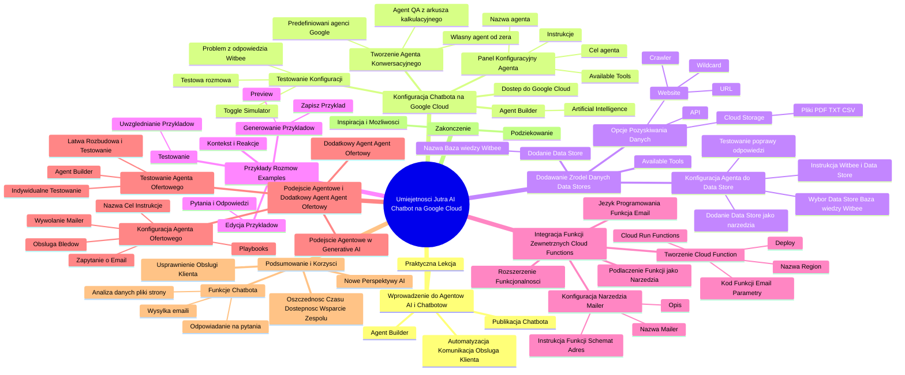

# Lekcje wideo - 3. Tworzymy Agenta AI w praktyce

# 💡 Diagram

___

# 🗒️ Notatka

# Notatki i Podsumowanie Lekcji: "Umiejętności Jutra AI: Budowa Chatbota na Google Cloud" ☁️

## Wprowadzenie do Agentów AI i Chatbotów 🤖

* Lekcja koncentruje się na budowie Chatbota na platformie Google Cloud z wykorzystaniem narzędzia **Agent Builder**.
* Agenci AI otwierają nowe perspektywy w dziedzinie automatyzacji, komunikacji i obsługi klienta.
* Celem lekcji jest praktyczne zademonstrowanie procesu tworzenia własnego Chatbota, jego personalizacji, integracji źródeł danych oraz implementacji specjalistycznych funkcji.
* Chatboty to zaawansowane technologie oferujące znacznie więcej niż tylko proste odpowiadanie na pytania.
* Lekcja ma charakter intensywny i praktyczny.
* Na zakończenie lekcji zostanie przedstawiona procedura publikacji gotowego Chatbota na stronie internetowej 🌐.

## Konfiguracja Chatbota na Google Cloud ☁️

### Dostęp do Google Cloud i Agent Builder

* Konfiguracja Chatbota odbywa się w środowisku Google Cloud (cloud.google.com).
* W menu po lewej stronie należy wybrać opcję "View all products" (Wyświetl wszystkie produkty).
* Następnie, w kategorii "Artificial Intelligence" (Sztuczna Inteligencja), odszukać i wybrać narzędzie **Agent Builder**.
* Aktywować usługę **Agent Builder**.

### Tworzenie Agenta Konwersacyjnego

* W **Agent Builderze** wybrać opcję "Conversational Agent" (Agent Konwersacyjny).
* Dostępne są następujące opcje tworzenia agenta:
    * **Predefiniowani agenci Google:**  Wykorzystanie gotowych, szablonowych agentów.
    * **Własny agent od zera:** Stworzenie agenta całkowicie od podstaw (opcja wybrana w lekcji).
    * **Agent Q&A z arkusza kalkulacyjnego:** Szybkie utworzenie agenta odpowiadającego na pytania w oparciu o dane z arkusza kalkulacyjnego.
* W ramach lekcji wybrano opcję stworzenia własnego agenta od zera.
* Należy wypełnić formularz, podając:
    * Nazwę agenta głównego.
    * Język.
    * Strefę czasową 🕰️.
    * Opcję "Playbook".
    * Zatwierdzić formularz przyciskiem "Create" (Utwórz).

### Panel Konfiguracyjny Agenta (Default Generative Playbook)

* Panel umożliwia zmianę nazwy agenta.
* Można w nim zdefiniować główny cel agenta.
* Ustawia się instrukcje określające zachowanie agenta.
    * Przykład celu: "odpowiadanie na pytania użytkowników".
    * Przykładowa instrukcja: "przywitaj się i zapytaj, w czym mogę pomóc".
* Sekcja "Available Tools" (Dostępne Narzędzia) pozwala na dodanie dodatkowych funkcji dla Chatbota.

### Testowanie Podstawowej Konfiguracji

* Do testowania służy "Toggle Simulator" (Symulator) umieszczony po prawej stronie ekranu.
* Otwiera się okienko do prowadzenia testowych rozmów z agentem.
* W przypadku posiadania wielu agentów i modeli Generative AI, można wybrać konkretny agent i model do testowania.
* Przeprowadzenie testowej rozmowy.
* Przykład testu: pytanie o firmę "Witbee".
* Problem: Chatbot udzielił nieprecyzyjnej odpowiedzi, bazując na ogólnej wiedzy, zamiast na specyficznych informacjach o firmie Witbee.

## Dodawanie Źródeł Danych (`Data Stores`) 🗄️

* Sekcja "Available Tools" (Dostępne Narzędzia) umożliwia konfigurację źródeł danych dla Chatbota.
* Dodanie `Data Store`: należy kliknąć przycisk dodawania i wprowadzić nazwę.
    * Przykład nazwy: "Baza wiedzy Witbee".
    * Zatwierdzić przyciskiem "Create Data Store" (Utwórz Data Store).
    * Uzupełnić nazwę firmy.
* Dostępne opcje pozyskiwania danych:
    * **Website:** Crawler indeksuje dane ze wskazanej strony internetowej (URL).
        * Możliwość określenia podstron do uwzględnienia i wykluczenia za pomocą symbolu wieloznacznego (gwiazdka "*").
        * Przykład: strona `witbee.com`.
    * **Cloud Storage:** Pliki (PDF, tekstowe, CSV z FAQ) dostarczane bezpośrednio do Chatbota.
    * **API:** Programistyczne dostarczanie danych poprzez interfejs API.
* W lekcji wybrano opcję "Website" jako pierwsze źródło danych.
* Podano adres strony `witbee.com` i zatwierdzono przyciskiem "Continue" (Kontynuuj), a następnie "Create" (Utwórz).
* Indeksowanie danych przez Crawlera może potrwać do 24 godzin ⏳.
* Status indeksowania można sprawdzić w ustawieniach zestawu danych (zielony znacznik i status "zaindeksowany").

### Konfiguracja Agenta do Korzystania z `Data Store`

* Należy powrócić do konfiguracji agenta.
* Dodać `Data Store` jako narzędzie (ponownie kliknąć przycisk dodawania i wpisać nazwę).
    * Przykład nazwy: "Baza wiedzy Witbee - narzędzie".
    * Możliwość dodania opisu narzędzia dla lepszego kontekstu.
* W zakładce "Data Stores" (Zestawy Danych), w sekcji "Website", wybrać wcześniej skonfigurowany zestaw danych "Baza wiedzy Witbee".
* Zapisać zmiany przyciskiem "Save" (Zapisz).
* Przetestować poprawę jakości odpowiedzi po dodaniu `Data Store`.
* Dodać instrukcję: "jeżeli użytkownik zapyta o firmę Witbee, agent powinien najpierw przeszukać zestaw danych Baza wiedzy Witbee".
* Zapisać instrukcję przyciskiem "Save" (Zapisz) i ponownie zapytać Chatbota o firmę Witbee.
* Rezultat: Chatbot wykorzystał `Data Store` i udzielił poprawnej odpowiedzi ✅.

## Przykłady Rozmów (`Examples`) 💬

* Przykłady rozmów pomagają Chatbotowi zrozumieć kontekst i właściwie reagować.
* Generowanie przykładów: prowadzenie rozmowy z Chatbotem w okienku "Preview" (Podgląd) i zapisanie satysfakcjonującej konwersacji jako przykład.
* Większa liczba przykładów pozytywnie wpływa na działanie Chatbota.
* Zapisanie przykładu poprzez kliknięcie "Save Example" (Zapisz Przykład) i nadanie mu nazwy.
* Możliwość edycji pytań i odpowiedzi w przykładzie.
* Przykład edycji: modyfikacja wstępu, aby Chatbot witał się z użytkownikiem.
* Zapisanie zmodyfikowanego przykładu rozmowy.
* Testowanie: Chatbot uwzględnia przykłady i przedstawia się na początku konwersacji.

## Integracja Funkcji Zewnętrznych (`Cloud Functions`) ⚙️

* Rozszerzenie funkcjonalności Chatbota poza standardową konwersację.
* Wykorzystanie języka programowania do stworzenia funkcji (przykład: funkcja wysyłająca e-mail 📧 z ofertą).
* Podłączenie funkcji jako narzędzia dla agenta i dodanie instrukcji, jak z niego korzystać.

### Tworzenie `Cloud Function`

* W menu produktów odszukać narzędzie "Cloud Run Functions".
* Kliknąć "Create" (Utwórz).
* Wypełnić podstawowe informacje: nazwę funkcji, region.
* Wkleić przygotowany kod funkcji.
    * Funkcja przyjmuje parametry: adres e-mail odbiorcy, temat, treść wiadomości.
    * Wysyła wiadomość e-mail na wskazany adres po otrzymaniu parametrów.
* Uzupełnić pozostałe informacje i zatwierdzić przyciskiem "Deploy" (Wdróż).
* Po wdrożeniu funkcja jest gotowa do użycia.

### Konfiguracja Narzędzia `Mailer` w Agencie

* Powrót do konfiguracji Chatbota.
* Konfiguracja nowego narzędzia "Mailer" (Wysyłacz Maili).
    * Nazwa: "Mailer".
    * Opis: krótki opis narzędzia (np. "Narzędzie do wysyłania maili z ofertą").
* Wklejenie instrukcji funkcji (schemat funkcji).
* **Ważne:** adres funkcji musi być identyczny z adresem wyświetlonym po publikacji `Cloud Function`.
* Kod funkcji i schemat funkcji dostępne są w materiałach dodatkowych.
* Zapisać konfigurację przyciskiem "Save" (Zapisz).

## Podejście Agentowe i Dodatkowy Agent (Agent Ofertowy) 🤝

* Zastosowanie podejścia agentowego w tworzeniu aplikacji opartych na Generative AI.
* Utworzenie dodatkowego agenta dedykowanego wyłącznie do wysyłki oferty e-mailem - "Agent Ofertowy".
* Konfiguracja nowego agenta w zakładce "Playbooks".
    * Nazwa agenta ofertowego.
    * Główny cel.
    * Szczegółowe instrukcje.
        * Agent ma zapytać użytkownika o adres e-mail.
        * Wywołać narzędzie "Mailer" i przekazać parametry (adres e-mail, temat, treść).
        * Instrukcje dotyczące poprawnego wysłania oferty i obsługi błędów.

### Testowanie Agenta Ofertowego

* Możliwość testowania agentów indywidualnie w **Agent Builderze** (wybór konkretnego agenta).
* Testowanie agenta ofertowego niezależnie od agenta głównego.
* Ułatwia to rozbudowę systemu o nowe funkcje i ich testowanie.
* Testowanie agenta ofertowego w symulatorze.

## Podsumowanie i Korzyści ✅

* Stworzony Chatbot potrafi:
    * Odpowiadać na pytania.
    * Analizować dane z plików i stron internetowych 🌐.
    * Wysyłać oferty e-mailem 📧.
* Imponujący zakres funkcji usprawniających obsługę klienta.
* Chatbot oszczędza czas 🕰️, zwiększa dostępność informacji i wspiera zespół.
* Projekt otwiera nowe perspektywy w zakresie wykorzystania agentów AI.

## Zakończenie 🏁

* Podziękowanie za poświęcony czas.
* Wyrażenie nadziei, że lekcja była inspirująca i otworzyła nowe możliwości.

---

**Podsumowanie Lekcji:**

Lekcja "Umiejętności Jutra AI" prowadzi krok po kroku przez proces budowy zaawansowanego Chatbota na platformie Google Cloud, wykorzystując narzędzie **Agent Builder**. Rozpoczyna się wprowadzeniem do agentów AI i ich potencjału, a następnie przechodzi do praktycznej konfiguracji Chatbota. Uczestnik lekcji dowiaduje się, jak założyć konto Google Cloud, aktywować **Agent Builder**, stworzyć agenta konwersacyjnego od podstaw i skonfigurować jego podstawowe ustawienia.

Kluczowym aspektem lekcji jest dodawanie źródeł danych (`Data Stores`), co umożliwia chatbotowi udzielanie bardziej precyzyjnych i kontekstowych odpowiedzi. Zaprezentowano, jak indeksować dane ze strony internetowej za pomocą Crawlera oraz jak wykorzystać przykłady rozmów do podniesienia jakości interakcji.

Lekcja idzie o krok dalej, demonstrując integrację funkcji zewnętrznych poprzez `Cloud Functions`. Na przykładzie funkcji wysyłającej wiadomości e-mail, pokazano, jak rozszerzyć możliwości chatbota poza standardowe okno czatu. Wprowadzone zostało również podejście agentowe, polegające na tworzeniu wyspecjalizowanych agentów do konkretnych zadań, co ułatwia rozbudowę i testowanie systemu.

Podsumowując, lekcja dostarcza kompleksowej wiedzy i praktycznych umiejętności niezbędnych do stworzenia inteligentnego i funkcjonalnego Chatbota na Google Cloud, otwierając nowe możliwości w automatyzacji procesów biznesowych i obsłudze klienta.

___

# 🔉 Transcript
File: Lekcje wideo - 3. Tworzymy Agenta AI w praktyce.mp4 
[00:00:00] (Biały ekran)
[00:00:01] (Na ekranie pojawia się napis "Umiejętności Jutra AI" oraz logotypy Google i SGH)
[00:00:05] Cześć.
[00:00:06] Cieszę się, że jesteś ze mną na tej lekcji, w której wspólnie zbudujemy Chatbota na platformie Google Cloud.
[00:00:12] Na pewno już wiesz, że agenci AI to technologia, która otwiera przed nami nowe możliwości automatyzacji, komunikacji i obsługi klienta.
[00:00:20] Dziś pokażę ci jak można stworzyć własnego Chatbota, dostosować go do swoich potrzeb, podpiąć różne źródła danych, a nawet nauczyć go specjalnych funkcji, które wykraczają poza standardową konwersację w oknie czatu.
[00:00:33] Jeśli myślałeś, że Chatbot to tylko prosty system odpowiadający na pytania, to przekonasz się jak wiele dodatkowych możliwości tkwi w tej technologii.
[00:00:42] Będzie to intensywna lekcja, pełna praktycznej wiedzy.
[00:00:46] Na koniec pokażę ci jak opublikować gotowego Chatbota na stronie.
[00:00:50] To co, zaczynamy?
[00:00:52] (Na ekranie pojawia się strona Google Cloud z napisem "Welcome")
[00:00:52] Całą konfigurację naszego Chatbota będziemy ustawiać sobie na platformie Google Cloud.
[00:00:57] Na początek musimy wejść na adres cloud.google.com.
[01:02:01] Rozwijamy menu po lewej stronie i naciskamy przycisk View all products.
[01:07:07] Z listy produktów musimy wyszukać narzędzie, które nazywa się Agent Builder.
[01:11:09] Znajduje się ono w kategorii Artificial Intelligence.
[01:22:58] Musimy jeszcze aktywować naszą usługę i gotowe.
[01:36:31] (Na ekranie pojawia się strona "Create App - Agent Builder")
[01:36:36] Z wszystkich usług związanych z budowaniem agentów, wybieramy kafelek Conversational Agent.
[01:42:31] Przed nami pokazują się trzy opcje.
[01:45:07] Za pomocą pierwszej możemy skorzystać ze stworzonych już wcześniej przez Google predefiniowanych agentów.
[01:51:52] Druga opcja to tworzenie własnego agenta od zera.
[01:55:49] Za pomocą trzeciej opcji możemy szybko stworzyć agenta, który odpowie na pytanie na podstawie danych ze spreadsheetu, takie w formie Q&A.
[02:04:37] My wybieramy opcję drugą i pokażę wam jak skonfigurować wszystko od zera.
[02:09:25] W pierwszym formularzu uzupełniamy nazwę naszego głównego agenta oraz język i strefę czasową.
[02:22:59] Następnie wybieramy opcję Playbook i naciskamy przycisk Create.
[02:32:58] (Na ekranie pojawia się strona "Default Generative Playbook")
[02:33:19] Przed nami pojawia się panel konfiguracyjny naszego agenta.
[02:37:27] Możemy tutaj zmieniać jego nazwę, ustawić główny cel oraz ustawić konkretne instrukcje, jak ma się zachowywać.
[02:45:15] Później mamy jeszcze sekcję Available Tools, czyli dodatkowych narzędzi, którymi Chatbot będzie mógł się posługiwać.
[02:51:54] Za chwilę będziemy tutaj dodawać różne rzeczy, ale na razie skupmy się na podstawach i nadajmy naszemu agentowi główne zadania.
[02:59:37] W moim przypadku będzie to po prostu odpowiadanie na pytania użytkowników.
[03:04:27] Jako instrukcję podaję, aby agent przywitał się i zapytał w czym może pomóc.
[03:09:12] Następnie klikamy przycisk Save i nasza podstawowa konfiguracja jest już ukończona i możemy ją sobie przetestować.
[03:15:48] Aby to zrobić, z prawej strony ekranu klikamy przycisk Toggle Simulator, co otwiera przed nami nowe okienko.
[03:22:36] Możemy w nim przeprowadzać testowe rozmowy z naszym agentem, aby sprawdzić czy konfiguracja działa poprawnie.
[03:28:13] Do wyboru mamy tutaj agenta, ponieważ aplikacja Chatbota może się składać z wielu agentów oraz model Generative AI z którego agent ma korzystać.
[03:37:55] Przeprowadzę teraz testową rozmowę i zobaczymy jak aktualna konfiguracja działa.
[03:43:40] Widzę tutaj, że początek jest dobry, ale na pytanie o firmę Witbee, Chatbot udzielił mi odpowiedzi, która nie do końca mnie zadawala, ponieważ moja firma nie zajmuje się takimi rzeczami.
[03:54:10] Mam teraz dostęp tylko do wiedzy, na której został wytrenowany, więc prawdopodobnie udzielił mi informacji na temat jakiejś innej firmy o nazwie Witbee.
[04:03:35] Jak możemy to poprawić?
[04:05:13] Tutaj z pomocą przychodzą nam właśnie narzędzia dodatkowe.
[04:08:05] W nich możemy skonfigurować swoje źródła danych, które Chatbot będzie brał pod uwagę, udzielając odpowiedzi.
[04:14:39] Skonfigurujmy sobie pierwsze źródło danych.
[04:17:07] Klikamy w przycisk dodawania Data Store i wpisujemy nazwę.
[04:21:37] U mnie będzie to baza wiedzy Witbee, a następnie klikamy Create Data Store.
[04:27:53] Uzupełniamy nazwę firmy.
[04:34:46] Klikamy przycisk i pojawiają się przed nami trzy opcje do wyboru.
[04:39:36] Dane możemy pobierać z jakiejś strony internetowej, wtedy Crawler wejdzie na wskazany przez nas adres URL i zaindeksuje w Chatbocie dane, które tam się znajdują.
[04:50:27] Druga opcja to Cloud Storage, czyli są to pliki, które mu dostarczamy.
[04:55:37] Może to być PDF z naszą ofertą, jakiś zwykły plik tekstowy z dodatkowymi uwagami lub na przykład CSV z FAQ o naszej firmie.
[05:04:26] Ostatnia opcja to dostarczanie danych w sposób programistyczny przez interfejs API.
[05:09:48] Jako pierwsze źródło ustawimy sobie stronę internetową.
[05:13:09] Mamy tu do ustawienia pole z podstronami, które Crawler ma brać pod uwagę oraz możemy też jakieś strony wykluczyć.
[05:21:04] Możemy tutaj użyć opcji z gwiazdką, czyli tak zwanym Wildcardem.
[05:24:14] Wtedy Crawler będzie brał pod uwagę wszystkie podstrony, które znajdują się pod danym adresem.
[05:29:15] Ja podaję tutaj całą stronę witbee.com i naciskam przycisk Continue.
[05:32:33] Następnie podajemy nazwę i znowu naciskamy Create.
[05:47:37] Nasz dodatkowy zestaw danych jest już gotowy, ale Chatbot nie może od razu z niego skorzystać.
[05:53:08] Musimy chwilę poczekać, aż Crawler wejdzie i pobierze dane z naszej strony, co może trwać nawet do 24 godzin.
[06:00:24] Aby to sprawdzić, możemy wejść tutaj w ustawienia zestawu danych, gdzie możemy podejrzeć sobie status.
[06:06:16] Jeśli widzimy zielony ptaszek i status zaindeksowany, to narzędzie jest gotowe do użycia.
[06:11:55] Cofamy się teraz do konfiguracji naszego agenta.
[06:16:15] Klikamy przycisk dodawania Data Store i jeszcze raz wpisujemy nazwę.
[06:23:53] Możemy też podać opis narzędzia, aby nadać jeszcze lepszy kontekst.
[06:36:24] W zakładce Data Stores pod typem Website możemy teraz wybrać wcześniej skonfigurowany zestaw danych.
[06:44:42] Resztę opcji zostawiam tak jak jest i klikam przycisk Save.
[07:05:08] Sprawdźmy teraz, czy dodawanie zestawu danych poprawi jakość naszych odpowiedzi.
[07:10:32] Dodaję dodatkową instrukcję, która mówi, że jeżeli użytkownik zada pytanie na temat firmy Witbee, to niech agent najpierw ma zajrzeć do zestawu danych Baza wiedzy Witbee.
[07:15:03] Klikamy przycisk Save i zapytajmy Chatbota o to samo co wcześniej.
[07:17:31] Jak widzicie, w okienku na pytanie o firmę Witbee, Chatbot użył najpierw naszego narzędzia, tak jak podaliśmy mu w instrukcji i odpowiedział poprawnie.
[07:26:51] Kolejną przydatną opcją w Agent Builderze są przykłady.
[07:34:13] Aby nasz Chatbot miał jak najwięcej kontekstu oraz danych jak powinien się zachowywać, możemy mu zapisać przykłady rozmów.
[07:35:36] Najprostszym sposobem, żeby je wygenerować, jest po prostu rozmawianie z nim w okienku Preview.
[07:42:48] Jeżeli przeprowadzimy konwersację, która nas zadawala, możemy ją wtedy zapisać jako przykład.
[07:50:41] Im więcej różnych rozmów i różnych przykładów mu zapiszemy, tym lepiej Chatbot będzie działał w przyszłości.
[07:53:21] Klikamy w przycisk Save Example, gdzie podajemy nazwę przykładu.
[07:58:36] Mamy tu też możliwość edycji pytań oraz odpowiedzi.
[08:01:36] Ja zmienię tutaj wstęp tak, aby Chatbot najpierw się przywitał i zapiszę taki przykład rozmowy.
[08:11:38] (Na ekranie pojawia się strona Google Cloud)
[08:11:49] Jak widzicie, nasz Chatbot bierze pod uwagę również przykłady i od teraz dodatkowo się przedstawia.
[08:14:21] Teraz chciałbym pokazać wam jak nasza aplikacja Chatbota może wejść na jeszcze wyższy level i wykonywać zadania, które wychodzą poza ramy okna naszego czatu.
[08:22:16] Aby to zrobić, użyjemy języka programowania i napiszemy funkcję, która wysyła do użytkownika maila z ofertą.
[08:29:22] Następnie podepniemy ją jako narzędzie dostępne dla agenta i napiszemy mu dokładną instrukcję, jak ma z niego korzystać.
[08:33:19] Rozwijamy okno z produktami i wyszukujemy narzędzie Cloud Run Functions.
[08:39:22] Naciskamy przycisk Create i uzupełniam podstawowe informacje, takie jak nazwa funkcji oraz region.
[09:40:10] Przygotowany wcześniej kod wklejam tutaj.
[09:49:25] Nie będę wchodził w szczegóły, ale jak widzicie, funkcja przyjmuje takie parametry jak do kogo ma być wysłany mail, temat oraz treść maila.
[09:58:48] Jeżeli takie parametry jej przekażemy, to wyśle ona mail na wskazany adres.
[10:05:04] Uzupełniam resztę informacji i klikam przycisk Deploy.
[10:16:04] Po chwili nasza funkcja jest gotowa już do opublikowania i gotowa do użycia.
[10:20:40] Wróćmy teraz do okna konfiguracji Chatbota i skonfigurujmy nowe narzędzie.
[10:23:30] Jako nazwę wpisuję sobie Mailer oraz w opisie dodaję krótki opis narzędzia.
[10:40:14] Dalej wklejam instrukcję mojej funkcji.
[10:43:03] Tutaj trzeba zwrócić uwagę, aby adres zgadzał się z tym adresem funkcji, który wyświetlił nam się po opublikowaniu Cloud Function.
[11:01:25] Jeżeli będziecie chcieli to przetestować na własną rękę, to kod funkcji oraz schemat funkcji, który tutaj wklejam w narzędziu, znajdzie się w materiałach dodatkowych.
[11:06:03] Jak mamy już wszystko gotowe, to klikamy przycisk Save.
[11:11:30] Na wstępie opowiadałem wam trochę o agentach i korzyściach z podejścia agentowego do tworzenia aplikacji opartych o Generative AI.
[11:14:14] Skorzystajmy sobie więc z takiego podejścia i stwórzmy dodatkowego agenta, który będzie odpowiedzialny jedynie za wysyłkę oferty na maila.
[11:22:55] W Agent Builderze klikamy w zakładkę Playbooks i rozpoczynamy konfigurację nowego agenta ofertowego.
[11:29:13] Podajmy mu nazwę, główny cel i podajemy mu też szczegółowe instrukcje.
[11:39:46] Następnie niech agent zapyta użytkownika o adres email, na który ma zostać wysłana oferta.
[11:51:00] Następnie każemy mu wywołać nasze narzędzie Mailer i przekazujemy tam potrzebne do wywołania funkcji parametry.
[11:54:39] Podajmy mu również instrukcję, co ma zrobić w przypadku poprawnego wysłania oferty oraz błędów.
[12:04:17] (Na ekranie pojawia się strona "Create App - Agent Builder")
[12:04:59] Gdy nasz agent ofertowy jest już gotowy, możemy go sobie teraz przetestować.
[12:11:13] Jak wspomniałem na wstępie, w podejściu agentowym do tworzenia aplikacji możemy sobie takie dodatkowe moduły łatwo testować.
[12:17:26] W Agent Builderze wybieramy po prostu konkretnego agenta, odpowiedzialnego za daną część systemu i testujemy ją osobno, niezależnie od reszty.
[12:26:39] Daje nam to system, który możemy łatwo rozbudowywać o nowe kolejne funkcje, no i łatwo je testować.
[12:32:41] Sprawdźmy, czy cokolwiek to zmieniło.
[12:33:41] Standardowo witamy się z czatem.
[12:35:04] Jak widzicie, nasz Chatbot bierze pod uwagę przykłady i od teraz dodatkowo się przedstawia.
[12:50:40] Przygotowany wcześniej kod wklejam tutaj.
[12:50:59] Nie będę wchodził w szczegóły, ale jak widzicie, funkcja przyjmuje takie parametry jak do kogo ma być wysłany mail, temat oraz treść maila.
[13:00:59] Jeżeli takie parametry jej przekażemy, to wyśle ona mail na wskazany adres.
[13:15:59] (Na ekranie pojawia się strona "Cloud Run Functions")
[13:16:36] Po chwili nasza funkcja jest gotowa już do opublikowania i gotowa do użycia.
[13:21:49] Wróćmy teraz do okna konfiguracji Chatbota i skonfigurujmy nowe narzędzie.
[13:29:13] Jako nazwę wpisuję sobie Mailer oraz w opisie dodaję krótki opis narzędzia.
[13:40:03] Dalej wklejam instrukcję mojej funkcji.
[13:43:02] Tutaj trzeba zwrócić uwagę, aby adres zgadzał się z tym adresem funkcji, który wyświetlił nam się po opublikowaniu Cloud Function.
[14:04:54] (Na ekranie pojawia się strona "Default Generative Playbook")
[14:05:17] (Na ekranie pojawia się strona "Default Generative Playbook")
[14:05:47] Świetna robota.
[14:06:18] Właśnie stworzyłeś Chatbota, który potrafi odpowiadać na pytania, analizować dane korzystając z plików, a nawet wysyłać oferty mailowo.
[14:14:14] To imponujący zestaw funkcji, który może znacząco usprawnić obsługę klienta na twojej stronie.
[14:50:38] Tak skonfigurowany Chatbot może oszczędzić czas, zwiększyć dostępność informacji i wesprzeć twój zespół.
[15:01:20] Dzięki za poświęcony czas.
[15:03:50] Mam nadzieję, że ten projekt otworzył przed tobą nowe perspektywy.
[15:07:01] (Na ekranie pojawia się napis "Umiejętności Jutra AI" oraz logotypy Google i SGH)

___
# 🏷️ Tags
#agent_AI #chatbot #google_cloud #agent_builder #automatyzacja #komunikacja #obsluga_klienta #personalizacja #integracja_danych #funkcje_specjalistyczne #publikacja_chatbota #konfiguracja_chatbota #cloud_google #view_all_products #artificial_intelligence #agent_konwersacyjny #predefiniowani_agenci_google #wlasny_agent_od_zera #agent_Q&A #arkusz_kalkulacyjny #formularz #nazwa_agenta #jezyk #strefa_czasowa #playbook #panel_konfiguracyjny_agenta #cel_agenta #instrukcje_agenta #available_tools #toggle_simulator #testowanie_chatbota #model_generative_AI #witbee #data_stores #zrodla_danych #baza_wiedzy_witbee #website #crawler #indeksowanie_danych #url #podstrony #wykluczenia_stron #symbol_wieloznaczny #cloud_storage #pliki #pdf #tekstowe #csv #faq #api #adres_strony #status_indeksowania #ustawienia_zestawu_danych #zielony_znacznik #zaindeksowany #narzedzie_data_store #opis_narzedzia #zakladka_data_stores #zapisz_zmiany #jakosc_odpowiedzi #przykłady_rozmów #kontekst #preview #save_example #edycja_przykladow #integracja_funkcji_zewnetrznych #cloud_functions #jezyk_programowania #funkcja_wysylajaca_email #narzedzie_dla_agenta #instrukcja_uzycia_funkcji #cloud_run_functions #nazwa_funkcji #region #kod_funkcji #parametry_funkcji #adres_email #temat_wiadomosci #tresc_wiadomosci #deploy #mailer #schemat_funkcji #podejscie_agentowe #agent_ofertowy #zakladka_playbooks #szczegolowe_instrukcje #adres_email_uzytkownika #testowanie_agentow #indywidualne_testowanie #rozbudowa_systemu #nowe_funkcje #oszczednosc_czasu #dostepnosc_informacji #wsparcie_zespolu #automatyzacja_procesow_biznesowych #umiejetnosci_jutra_AI
