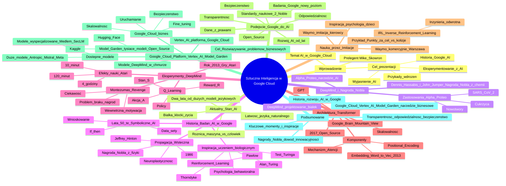

# Lekcje wideo - 2. Podstawowe wykorzystanie AI

# 💡 Diagram

___

# 🗒️ Notatka

# Szczegółowe Notatki i Podsumowanie Transkrypcji Wideo o Sztucznej Inteligencji w Google Cloud ☁️

## Wprowadzenie

* **Prelegent:** Mike Skowron, AI GTM Lead, CEE + Google Cloud ☁️
* **Temat:** Budowanie aplikacji wykorzystujących `sztuczną inteligencję` (AI) 🤖 w chmurze.
* **Cel prezentacji:**
    * Wyjaśnienie, czym jest `AI`.
    * Omówienie historii badań nad `AI` w Google, w tym nagród Nobla 🏆.
    * Prezentacja przykładów wdrożeń `AI`.
    * Przekonanie o wartości eksperymentowania z `AI` 🧪.

## Aktualny Stan Sztucznej Inteligencji

* **Minęły dwa lata od momentu, gdy `duże modele językowe` stały się powszechnie dostępne.**
* **Uderzająca jest łatwość, z jaką `AI` posługuje się językiem naturalnym.**
* **Pytanie:** Czym różni się maszyna ⚙️ od człowieka, skoro rozmawia jak człowiek i myśli w pewnym stopniu podobnie?
* **Odpowiedź:** Maszyna ⚙️ nie jest organizmem żywym, nie jest zbudowana z białek.
* **Białka:**
    * Najmniejsze klocki budulcowe życia.
    * „Robotnicy” realizujący procesy życiowe (mięśnie, kości, odżywianie, walka z chorobami).

## DeepMind i Projektowanie Białek - Nagroda Nobla 🏆

* **DeepMind (Google) stworzył oparty na `AI` system do projektowania wiązań białek.**
* **Alpha Proteo:** Narzędzie `AI` przewidujące kształt wiązań pasujących do białek docelowych (np. białko kolca wirusa SARS-CoV-2, białka nowotworowe, powikłania cukrzycy).
* **Dennis Hassabis (prezes DeepMind) i John Jumper (dyrektor) zostali laureatami Nagrody Nobla 🏆 z chemii.**

## Historia Badań nad Sztuczną Inteligencją w Google

* **Lata 50-te:** Przekonanie, że kluczem do `AI` jest **symboliczne odwzorowanie świata.**
    * Wielkie zbiory danych (data sety) opisujące wszystko.
    * Wnioskowanie oparte na statystyce i regułach logicznych (`if then` - `symbolic AI`).
    * Systemy były użyteczne, ale **nie uczyły się jak ludzie.**

* **Inspiracja uczeniem biologicznym:**
    * **Alan Turing (twórca pierwszego komputera):** Intuicja, że `AI` będzie się uczyć jak organizmy żywe.
    * **Test Turinga:** Odrożnianie treści generowanych przez `AI` od prawdziwych.
    * **Psychologia behawioralna:** Miała wpływ na naukę o `AI`.
        * **Koty Thorndyke, Psy Pawłowa:** Uczenie na bazie prób i błędów, uczenie wzmocnione systemem nagrody (**Reinforcement Learning**).
        * **Iwan Pawłow:** Pierwszy użył terminu "**Reinforcement Learning**".
    * **Pierwszy warunek dla generatywnej `AI`:** Zrozumienie zachowań wzmacniających uczenie w przyrodzie.

* **Propagacja Wsteczna (Backpropagation):**
    * **Drugi warunek dla generatywnej `AI`:** Zrozumienie zmian zachodzących w mózgu 🧠 podczas uczenia.
    * **1986:** Imitacja neuroplastyczności mózgu 🧠 w sztucznych sieciach neuronowych.
    * **Modyfikacja wag połączeń między węzłami (neuronami) podczas treningu.**
    * **Mechanizm propagacji wstecznej:**
        * **Jeffrey Hinton (emerytowany profesor, badacz `AI` w Google):** Współautor mechanizmu.
        * **Nagroda Nobla 🏆 z fizyki w tym roku za dokonania w dziedzinie propagacji wstecznej.**

## Eksperymenty DeepMind z Uzeniem Maszynowym 📚

* **Rok 2013:** DeepMind eksperymentuje z uczeniem maszynowym 📚 inspirowanym biologią.
* **Gry Atari:** Trenowanie sieci neuronowych w grach Atari.
* **Q Learning:**
    * Funkcja Q otrzymuje zadanie (`policy`) - zdobywanie punktów (nagród - `reward R`).
    * System obserwuje stan pikseli (`S`) i losowo dostosowuje akcje kontrolera (`A`).
    * **Efekty nauki:**
        * **10 minut:** Losowe ruchy, pierwsze punkty.
        * **120 minut:** System działa bezbłędnie.
        * **4 godziny:** Opracowanie strategii.
    * **Punkty jako zewnętrzna nagroda.**
    * **Dominacja `AI` w 7 grach Atari w 2013 roku (Pong, Breakout, Space Invaders).**

* **Montezuma's Revenge:**
    * Gra o złożonym środowisku, rzadkie zewnętrzne nagrody (punkty).
    * **Problem:** `Q Learning` z poprzednich gier nie działa z powodu braku zewnętrznych nagród.
    * **Rozwiązanie:** Inspiracja psychologią, **system wewnętrznej motywacji.**
    * **Ciekawość jako wewnętrzna nagroda:**
        * System śledzi nowość środowiska gry.
        * Nagradza agenta `AI` za eksplorację nowych obszarów.

## Architektura Transformer i Nauka Języka Naturalnego 🗣️

* **Google Brain (Mountain View, Kalifornia):** Praca nad architekturą **Transformer**.
* **Transformer:** Pomaga sieciom neuronowym uczyć się języka naturalnego.
* **Komponenty architektury Transformer:**
    * **Embedding (`Word to Vec` - 2013 w Google):** Zamiana słów na wektory w przestrzeniach wielowymiarowych.
    * **Positional Encoding:** Kodowanie kolejności słów w zdaniu.
    * **Mechanizm Atencji:** Wnioskowanie, która część mowy w zdaniu jest ważna.
* **2017:** Transformer na licencji Open Source w Google.
    * **Szturmem zdobywa świat `AI`.**
    * **Skalowalność i radzenie sobie z ogromnymi danymi 📊.**
    * **Startupy `AI` pre-trainują transformery.**
    * **Powstanie GPT (Generative Pre-trained Transformer).**

## Nauka Przez Imitację 🎭

* **Inspiracja z psychologii:** Dzieci uczą się przez obserwację i naśladowanie.
* **Waymo (Google):** Nauczenie `AI` imitować kierowcę auta 🚗.
* **IRL (Inverse Reinforcement Learning):** Sieć neuronowa obserwuje i imituje zachowania.
    * **Forma inżynierii odwrotnej (reverse engineering).**
    * **System obserwuje efekty i zachowanie eksperta.**
    * **Odgaduje funkcję nagrody wyjaśniającą zachowanie eksperta.**
    * **Przykład:** Punkty za dojazd do celu vs. unikanie kolizji, szybka vs. bezpieczna jazda.
* **Waymo (praca naukowa 2022):** Imitacja to za mało, dalszy rozwój technologii.
* **Komercyjne wdrożenia Waymo:** San Francisco, Phoenix, kolejne miasta USA.
* **Zespół Waymo zatrudnia ekspertów `AI` w Warszawie.**

## Podejście Google do Rozwoju AI 🤖

* **Rozwój `AI` od lat w Google.**
* **Badania Google przeniosły rozwój `AI` na nowy poziom.**
* **Transparentność rozwoju `AI`.**
* **Wsparcie dla Open Source community.**
* **Odpowiedzialne budowanie `AI`.**
* **Testowanie bezpieczeństwa `AI` 🛡️.**
* **Trening `AI` tylko na danych 📊, do których Google ma prawo.**
* **Wysokie standardy naukowe (dowód: 2 nagrody Nobla 🏆 w tym roku).**

## Google Cloud Platform - Vertex AI Model Garden 🪴

* **Modele DeepMind dostępne w chmurze Google ☁️ - Model Garden.**
* **Model Garden:** Platforma z tysiącami modeli Open Source (integracja z Hugging Face i Kaggle).
* **Dostępne modele:**
    * Duże modele (Antropic, Mistral, Meta).
    * Modele wyspecjalizowane (Medlem - medyczne, SecLM - Cyber Security 🔒).
* **Vertex AI:** Element platformy Google Cloud ☁️.
* **Google Cloud ☁️:**
    * Platforma do budowania rozwiązań biznesowych (nie konsumenckich jak Gemini, Google AI Studio).
    * Uruchamianie, fine-tuning, ewaluacja, testy AB modeli.
    * Integracja z systemami i aplikacjami.
    * Bezpieczeństwo danych 📊 i skalowalność infrastruktury.
* **Cel:** Rozwiązywanie rzeczywistych problemów za pomocą `AI`.

## Podsumowanie

Prezentacja Mike'a Skowrona z Google Cloud ☁️ przedstawiała historię rozwoju `sztucznej inteligencji` w Google, podkreślając kluczowe momenty i inspiracje z biologii i psychologii. Od `symbolicznego AI`, przez uczenie wzmocnione i propagację wsteczną, aż po architekturę Transformer i uczenie przez imitację 🎭. Google kładzie nacisk na transparentność, odpowiedzialność i bezpieczeństwo 🛡️ w rozwoju `AI`, udostępniając swoje osiągnięcia poprzez platformę Google Cloud Vertex AI Model Garden 🪴. Prezentacja podkreśla, że `AI` w Google Cloud ☁️ jest narzędziem do rozwiązywania rzeczywistych problemów biznesowych, oferując szeroki wybór modeli i infrastrukturę do ich wdrażania i skalowania. Dwie nagrody Nobla 🏆 dla badaczy z Google są dowodem na wysoki poziom naukowy i innowacyjność firmy w dziedzinie `sztucznej inteligencji`.

___

# 🔉 Transcript
File: Lekcje wideo - 2. Podstawowe wykorzystanie AI.mp4 
[00:00:05] Cześć.
[00:00:06] (Na ekranie pojawia się podpis: Mike Skowron, AI GTM Lead, CEE + Google Cloud)
[00:00:06] Na co dzień pomagam firmom budować w chmurze aplikacje wykorzystujące AI.
[00:00:11] Warto zrozumieć czym jest ta technologia.
[00:00:14] Opowiem wam krótko o tym jak badacze sztucznej inteligencji w Google doszli do miejsca w którym dziś jesteśmy i odebrali przy okazji dwie nagrody Nobla.
[00:00:23] Pokażę przykłady wdrożeń i postaram się was przekonać, że warto ze sztuczną inteligencją eksperymentować.
[00:00:30] (Na ekranie pojawia się slajd z napisem Imagen 3, Prompt: Życie zbudowane z białek, oraz wizualizacja białka)
[00:00:30] No dobrze.
[00:00:31] To gdzie jesteśmy, bo mijają dwa lata od pierwszego masowego kontaktu z dużymi modelami językowymi i ta łatwość z jaką posługują się naturalną mową była i wciąż jest uderzająca.
[00:00:43] Nagle maszyna rozmawia ze mną jak człowiek, czym się ode mnie różni?
[00:00:47] Myśli trochę jak ja, ale przecież nie jest organizmem żywym, bo te zbudowane są z białek.
[00:00:53] Białka to z jednej strony najmniejsze klocki z których składa się życie.
[00:00:57] Z drugiej są trochę jak robotnicy, realizują procesy potrzebne do życia, tworzą mięśnie, kości, pomagają się odżywiać i walczyć z chorobami.
[00:01:06] (Na ekranie pojawia się slajd z napisem Jak działa inteligencja? Jak działa wszystko inne? Pod spodem zdjęcie Dennisa Hassabisa, kod QR, oraz wizualizacja białka)
[00:01:07] I mówię o tym, bo kilka tygodni temu Deep Mind pokazał nowy system do projektowania wiązań białek.
[00:01:14] To pierwsze takie narzędzie oparte na sztucznej inteligencji.
[00:01:18] Żółty element to białko kolca wirusa SARS-CoV-2 popularnego koronawirusa.
[00:01:24] Niebieski ruchomy element to AI, które przewiduje jaki kształt wiązania najlepiej do tego białka kolca pasuje.
[00:01:33] Alfa Proteo potrafi projektować wiązania dla różnych białek docelowych, również tych, które występują przy nowotworach i powikłaniach cukrzycy.
[00:01:43] System powstał w Google Deep Mind, którego prezes Dennis Hassabis i dyrektor John Jumper zostali laureatami tegorocznej nagrody Nobla z chemii.
[00:01:53] Słuchajcie, jak do tego miejsca doszliśmy?
[00:01:55] Od lat 50 badacze byli przecież przekonani, że kluczem do sztucznej inteligencji jest symboliczne odwzorowanie świata.
[00:02:03] Wielkie data sety opisujące dosłownie wszystko i wnioskowanie oparte na metodach statystycznych i regułach logicznych.
[00:02:11] Jeśli to if then, taki symbolic AI.
[00:02:15] Te systemy, mimo, że niezwykle użyteczne, nie potrafiły się jednak uczyć tak jak uczą się ludzie.
[00:02:21] (Na ekranie pojawia się slajd z napisem Uczenie biologiczne inspiracją dla AI, oraz zdjęcia kota i psa)
[00:02:22] Koty, psy.
[00:02:24] Twórca pierwszego komputera Alan Turing miał świetną intuicję.
[00:02:27] Już w latach 40 twierdził, że kiedyś zbudujemy AI, które będzie się uczyć podobnie jak organizmy żywe.
[00:02:35] Stworzył nawet test, żebyśmy mogli odróżnić treści generowane przez AI od tych prawdziwych.
[00:02:41] Turing jak wszyscy naukowcy w tamtych czasach był prawdopodobnie pod wpływem nowej dziedziny, psychologii behawioralnej.
[00:02:50] O kotach Thorndyke mogliście nie słyszeć, ale psy Pawłowa raczej kojarzycie.
[00:02:54] To w tych pracach po raz pierwszy pojawia się uczenie na bazie prób i błędów oraz uczenie wzmocnione systemem nagrody.
[00:03:02] Słowa Reinforcement Learning po raz pierwszy pojawiły się w pracy Iwana Pawłowa.
[00:03:07] Pierwszym warunkiem wstępnym dla generatywnej sztucznej inteligencji było zatem zrozumienie jakie zachowania wzmacniają uczenie w przyrodzie.
[00:03:18] (Na ekranie pojawia się slajd z napisem Propagacja wsteczna, oraz wizualizacje neuronów)
[00:03:18] A drugim było zrozumienie jakie zmiany zachodzą podczas procesu uczenia w mózgu.
[00:03:25] W 1986 po raz pierwszy badacze imitują ten neuroplastyczny proces.
[00:03:32] Podobnie jak w mózgu, gdzie połączenia między neuronami wzmacniają się lub osłabiają w trakcie uczenia, tak w sztucznych sieciach wagi połączeń między węzłami są modyfikowane podczas treningu.
[00:03:45] Odpowiada za to mechanizm propagacji wstecznej, którego współautorem był Jeffrey Hinton, emerytowany profesor uniwersytetu w Toronto i wieloletni badacz AI w Google.
[00:03:56] Za swoje dokonania w tej dziedzinie otrzymał w tym roku Nobla z fizyki.
[00:04:02] (Na ekranie pojawia się slajd z grą Atari)
[00:04:03] To już rok 2013.
[00:04:05] Deep Mind Dennisa Hassabisa eksperymentuje z uczeniem maszynowym inspirowanym uczeniem biologicznym.
[00:04:11] Trenuje sieci neuronowe w grach Atari.
[00:04:13] Ich wersja Q Learning polega na tym, że funkcja Q otrzymuje wyrażone gwiazdką policy, zadanie, ma zdobywać jak najwięcej punktów, czyli nagród, po angielsku reward R.
[00:04:25] (Ekran zmienia się na slajd z grą Atari)
[00:04:25] System obserwuje stan pikseli S i losowo dostosowuje akcje kontrolera A.
[00:04:32] Widzimy efekt tej nauki po 10 minutach.
[00:04:35] Losowe ruchy i pierwsze zdobyte punkty.
[00:04:40] (Ekran zmienia się na slajd z grą Atari)
[00:04:40] Po 120 minutach system jest już bezbłędny.
[00:04:47] (Ekran zmienia się na slajd z grą Atari)
[00:04:47] Po czterech godzinach opracowuje strategię.
[00:04:51] (Ekran zmienia się na slajd z grą Atari)
[00:04:51] Punkty jako zewnętrzna nagroda za akcje wykonane w danym środowisku.
[00:04:56] Pong, Breakout, Space Invaders, w sumie siedem gier zdominowanych przez AI w 2013 roku.
[00:05:03] (Na ekranie pojawia się slajd z grą Montezuma's Revenge)
[00:05:03] Montezuma się za to zemścił i zmusił Deep Mind do spędzenia kilku kolejnych lat na pracy nad systemem, w którym nagradzana jest ciekawość.
[00:05:12] Montezuma's Revenge to gra o bardzo złożonym środowisku, w którym te zewnętrzne nagrody, punkty pojawiają się rzadko.
[00:05:20] Zauważcie proszę, zero, brak punktów na górze po prawej.
[00:05:24] W sytuacji ich braku nie da się motywować AI do nauki wykorzystując Q Learning z poprzednich gier.
[00:05:31] Deep Mind ponownie szuka inspiracji w psychologii i tworzy system wewnętrznej motywacji.
[00:05:37] Agent AI musi odnaleźć w sobie wewnętrzną ciekawość.
[00:05:41] System śledzi zatem nowość środowiska gry i nagradza agenta AI za eksplorację nowych obszarów.
[00:05:55] (Na ekranie pojawia się slajd z napisem Transformer)
[00:05:55] Równolegle w Mountain View w Kalifornii Google Brain pracuje nad słynną dziś architekturą Transformer, która pomoże sieciom neuronowym uczyć się języka naturalnego.
[00:06:06] Pierwszy komponent tej architektury embedding, czyli zamiana słów na wektory w wielowymiarowych przestrzeniach powstaje w Google wcześniej w 2013 i otrzymuje nazwę Word to Vec.
[00:06:20] Nowe elementy to kodowanie kolejności słów w zdaniu positional encoding oraz mechanizm atencji odpowiadający za wnioskowanie, która część mowy w zdaniu jest ważna.
[00:06:31] (Na ekranie pojawia się slajd z osią czasu)
[00:06:32] W 2017 w Google na licencji Open Source powstaje Transformer i bierze świat szturmem, bo świetnie się skaluje i radzi sobie z ogromnymi korpusami danych.
[00:06:43] Startupy AI zaczynają pre-trainować transformery i powstają produkty takie jak znany Generative Pre-trained Transformer, czyli GPT.
[00:06:54] (Na ekranie pojawia się slajd z napisem Imitacja)
[00:06:55] Nauka przez imitację to kolejna inspiracja z psychologii.
[06:59] Dzieci się w ten sposób uczą, obserwując i naśladując dorosłych.
[07:03] Należące do Google Waymo nauczyło natomiast AI imitować kierowcę auta.
[07:09] Sieć neuronowa, która obserwuje i imituje określone zachowania to IRL Inverse Reinforcement Learning i jest formą inżynierii odwrotnej, takiego trochę reverse engineeringu.
[07:21] System obserwuje efekty i zachowanie eksperta, po czym odgaduje funkcję nagrody, która wyjaśnia to zachowanie.
[07:28] Dam wam przykład.
[07:30] Przyznajemy więcej punktów za dojechanie do celu czy za unikanie kolizji?
[07:35] Więcej za jazdę szybką czy za bezpieczną?
[07:38] W ogóle czy można jeździć szybko i bezpiecznie?
[07:42] Waymo w pracy naukowej z 2022 roku wskazuje, że sama imitacja to za mało.
[07:48] Dalej rozwija te technologie i dziś te auta wożą już komercyjnie pasażerów w San Francisco i Phoenix, za chwilę będą jeździć w kolejnych miastach w Stanach, a zespół Waymo zatrudnia ekspertów od AI w Warszawie.
[08:03] (Na ekranie pojawia się slajd z osią czasu)
[08:04] Pokazałem tylko subiektywnie wybrany wycinek historii badań AI w Google i chciałbym, żeby kilka rzeczy wybrzmiało.
[08:12] Rozwijamy AI od lat, a nasze badania pomogły przenieść rozwój tej technologii na zupełnie nowy poziom.
[08:20] Tworzymy AI w sposób transparentny, wspierając przy okazji rozwój community Open Source.
[08:26] Budujemy AI odpowiedzialnie i testujemy je pod względem bezpieczeństwa.
[08:31] Trenujemy tylko na danych, którymi mamy prawo dysponować i zachowujemy wysokie standardy naukowe, a dwie nagrody Nobla w tym roku są tego dowodem.
[08:41] (Na ekranie pojawia się slajd z napisem 150+ modeli gotowych do użycia na platformie Vertex AI Model Garden)
[08:41] Tworzone przez Deep Mind modele trafiają w chmurze Google do Model Garden, platformy, która oferuje dostęp do tysięcy modeli Open Source dzięki integracji z Hugging Face i Kaggle.
[08:55] Od dużych modeli od naszych partnerów, czyli Antropic, Mistral, Meta, oraz modeli wyspecjalizowanych takich jak trenowany na danych medycznych Medlem czy na danych z obszaru Cyber Security SecLM.
[09:09] (Na ekranie pojawia się slajd z napisem Google Cloud do bezpiecznego budowania)
[09:09] Model Garden to element platformy Vertex AI, która jest jednym z komponentów chmury Google Cloud.
[09:17] Chmura służy do budowania rozwiązań klasy biznes i możemy oczywiście porozmawiać z Gemini albo sprawdzić możliwości modeli w Google AI Studio, ale są to rozwiązania konsumenckie.
[09:30] Chmura Google Cloud służy do budowania aplikacji biznesowych.
[09:35] Jest miejscem w którym możemy modele uruchomić, zrobić fine tuning, ewaluację, testy AB, zintegrować je z innymi komponentami systemów i aplikacji i zapewnić bezpieczeństwo danych, dbając o skalowalność infrastruktury.
[09:50] Robimy to aby rozwiązywać rzeczywiste problemy za pomocą sztucznej inteligencji.
[09:56] W kolejnej części poznacie konkretne przykłady zastosowania tych rozwiązań.

___
# 🏷️ Tags
#sztuczna_inteligencja #AI #Google_Cloud #Mike_Skowron #modele_językowe #język_naturalny #białka #DeepMind #Alpha_Proteo #SARS-CoV-2 #nowotwory #cukrzyca #Dennis_Hassabis #John_Jumper #Nagroda_Nobla #symboliczne_AI #data_sety #statystyka #reguły_logiczne #uczenie_maszynowe #Alan_Turing #Test_Turinga #psychologia_behawioralna #koty_Thorndyke #psy_Pawłowa #uczenie_wzmocnione #Reinforcement_Learning #Iwan_Pawłow #generatywna_AI #propagacja_wsteczna #Backpropagation #neuroplastyczność #sieci_neuronowe #Jeffrey_Hinton #gry_Atari #Q_Learning #policy #reward_R #Montezuma's_Revenge #motywacja_wewnętrzna #ciekawość #Google_Brain #Transformer #embedding #Word_to_Vec #Positional_Encoding #Mechanizm_Atencji #Open_Source #GPT #Generative_Pre-trained_Transformer #nauka_przez_imitację #Waymo #IRL #Inverse_Reinforcement_Learning #inżynieria_odwrotna #reverse_engineering #bezpieczeństwo_AI #Vertex_AI_Model_Garden #Model_Garden #Hugging_Face #Kaggle #Antropic #Mistral #Meta #Medlem #SecLM #Cyber_Security #Google_AI_Studio #fine_tuning #ewaluacja #testy_AB #skalowalność #aplikacje_biznesowe #Warszawa
