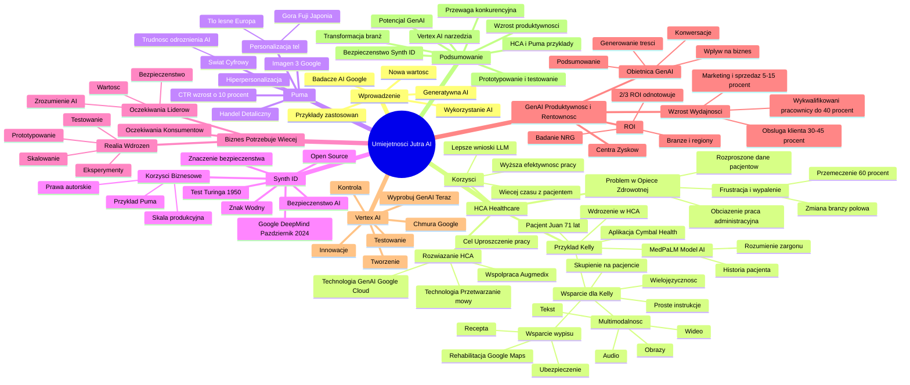

# Lekcje wideo - 3. Zaawansowane wykorzystanie AI

# 💡 Diagram

___

# 🗒️ Notatka

# Umiejętności Jutra AI - Szczegółowe Notatki i Podsumowanie

## Wprowadzenie

Prezentacja omawia wykorzystanie sztucznej inteligencji (AI), a konkretnie generatywnej AI, w celu tworzenia nowej wartości w różnych branżach. Mówca przedstawia przykłady i pomysły na zastosowanie AI, opierając się na osiągnięciach badaczy AI w Google.

## HCA Healthcare - Usprawnienie Opieki Zdrowotnej za Pomocą AI 🏥

### Problem w Sektorze Opieki Zdrowotnej 🚑

* **Rozproszone dane pacjentów:** Informacje o pacjentach są często rozproszone w różnych systemach, a znaczna część danych nadal istnieje w formie papierowej.
* **Obciążenie pracą administracyjną:** Personel medyczny poświęca zbyt dużo czasu na zarządzanie danymi i dokumentacją.
* **Frustracja i wypalenie zawodowe:** Przeciążenie pracą administracyjną prowadzi do frustracji i wypalenia wśród personelu medycznego. Badania wskazują, że:
    * Prawie **60%** personelu medycznego zgłasza przemęczenie.
    * Niemal **połowa** rozważa zmianę branży.

### Rozwiązanie HCA Healthcare z Wykorzystaniem Generatywnej AI 💡

* **Cel:** Uproszczenie pracy administracyjnej, aby personel medyczny mógł poświęcić więcej czasu pacjentom.
* **Technologia:** HCA Healthcare wykorzystuje generatywną AI w Google Cloud oraz technologię przetwarzania mowy na tekst w medycynie, we współpracy z Augmedix.
* **Korzyści:**
    * **Więcej czasu z pacjentem:** Automatyzacja dokumentacji klinicznej pozwala lekarzom i pielęgniarkom poświęcić więcej czasu na bezpośrednią opiekę.
    * **Wyższa efektywność pracy:** Usprawnienie zadań, takich jak sporządzanie notatek i generowanie raportów.
    * **Lepsze wyciąganie wniosków:** Badanie zastosowań medycznych dużych modeli językowych (LLM) do analizy złożonych tekstów medycznych.
* **Cytat Michaela J. Schlossera, SVP, Care Transformation and Innovation, HCA Healthcare:**
    > Generatywna sztuczna inteligencja i inne nowoczesne technologie pomagają nam zmieniać sposób współpracy zespołów, optymalizować procesy oraz zagwarantować, że odpowiedni zespół, w odpowiednim czasie, dysponuje informacjami niezbędnymi do opieki nad pacjentami.

### Przykład Użycia AI w Praktyce - Aplikacja dla Pielęgniarki Kelly 👩‍⚕️

* **Scenariusz:** Pielęgniarka Kelly rozpoczyna dyżur i korzysta z aplikacji na tablecie.
* **Aplikacja "Cymbal Health":**
    * Kelly przegląda listę pacjentów i wybiera kolejnego - 71-letniego Juana po operacji kolana.
    * **AI podsumowuje najważniejsze informacje o pacjencie.**
* **Model "Med-PaLM":**
    * Wyspecjalizowany model AI, wytrenowany na danych medycznych.
    * Potrafi:
        * Ułożyć historię pacjenta chronologicznie.
        * Wnioskować i rozumieć medyczny żargon, nazwy leków i zabiegów.
* **Korzyści dla Kelly i Pacjenta:**
    * AI działa w tle, umożliwiając Kelly skupienie się na rozmowie z pacjentem.
    * AI pomaga przetłumaczyć medyczny żargon na proste instrukcje dla pacjenta.
    * **Wielojęzyczność:** AI tłumaczy informacje na dowolny język (przykład: hiszpański w USA, ukraiński w Polsce).
    * **Multimodalność:** AI potrafi odczytać tekst głośno. Modalności obejmują: tekst, audio 🎧, obrazy 🖼️, wideo 📹.
    * **Wsparcie w procesie wypisu:** AI pomaga w wypisaniu recepty 📝, znalezieniu przychodni na rehabilitację (integracja z Google Maps 🗺️), sprawdzeniu ubezpieczenia.
* **Wdrożenie:** Elementy demonstracyjnej aplikacji są wdrażane w HCA i innych firmach z sektora zdrowia na całym świecie.

## Puma - Hiperpersonalizacja w Handlu Detalicznym 🛍️

### Zwiększenie Współczynnika Klikalności (CTR) w E-commerce 📈

* **Branża:** Handel detaliczny.
* **Firma:** Puma.
* **Wynik:** Zwiększenie CTR o **10%**.
* **Technologia:** Model generowania obrazów **Imagen 3** od Google.
* **Personalizacja Tła Produktów:** Tworzenie spersonalizowanych teł do zdjęć produktów, dostosowanych do lokalizacji i zainteresowań użytkowników.
    * Przykład: Biegacz w Europie zobaczy buty na tle leśnym 🌲, biegacz w Japonii - na tle góry Fuji 🗻.

### Zmiana Świata Cyfrowego 🌐

* Coraz trudniej jest odróżnić treści generowane przez AI od tradycyjnych kreacji.
* Świat cyfrowy zmienia się w bardzo szybkim tempie 🚀.

## Synth ID - Bezpieczeństwo i Znakowanie Treści AI 🛡️

### Test Turinga i Bezpieczeństwo AI 🔒

* **Test Turinga (1950):** Metoda sprawdzania, czy mamy do czynienia z maszyną, czy człowiekiem.
* **Synth ID (Google DeepMind, październik 2024):** System znakowania treści generowanych przez AI.
    * **Otwarta licencja Open Source 🔓.**
    * **Znak wodny:** Umieszczanie znaku wodnego w każdej wygenerowanej treści.
* **Znaczenie Bezpieczeństwa AI:** Kluczowe znaczenie społeczne i biznesowe.
* **Korzyści dla Biznesu (Przykład Puma):**
    * Puma może udowodnić, jakim modelem i kiedy wygenerowano tła dla zdjęć produktów.
    * Kontrola nad prawami autorskimi.
    * Implementacja bezpieczeństwa w skali produkcyjnej.

## Biznes Potrzebuje Więcej - Wykorzystanie Potencjału AI 💼

### Oczekiwania wobec Liderów 🎯

* Zrozumienie i umiejętność wykorzystania AI do wniesienia wymiernej wartości w bezpieczny sposób.

### Oczekiwania Konsumentów 🛍️

* Konsumenci mają wysokie oczekiwania wobec AI.
* Firmy, które potrafią wykorzystać AI, mają większe szanse na zwiększenie udziału w rynku.

### Realia Wdrożeń AI ⚙️

* **Szybkie i bezpieczne prototypowanie.**
* **Testowanie rozwiązań.**
* **Skalowanie rozwiązań przynoszących wartość.**
* **Szybkie zakończenie eksperymentów bez wartości, zmiana założeń i ponowne testowanie.**

## GenAI - Zwiększenie Produktywności i Rentowności 💰

### Obietnica Generatywnej AI ✨

* Wdrożenie generatywnej AI w całym cyklu życia użytkownika ma znaczący wpływ na biznes.
* Potężne możliwości: generowanie treści, podsumowywanie informacji, konwersacyjne wyszukiwanie.

### Przewidywany Wzrost Wydajności 🚀

* **Marketing i sprzedaż:** +5-15%
* **Obsługa klienta:** +30-45%
* **Wydajność wykwalifikowanych pracowników:** do +40%

### Przekształcenie Centrów Kosztów w Centra Zysków 📈

* Automatyzacja rutynowych zadań.
* Uwolnienie czasu na pracę strategiczną.

### Zwrot z Inwestycji (ROI) w GenAI - Badanie National Research Group 📊

* Badanie 2500 liderów z globalnych firm (przychody > 10 mln USD).
* **Wyniki:**
    * **2/3 organizacji, które wdrożyły GenAI, już odnotowuje ROI lub spodziewa się go w najbliższych miesiącach.**
    * Dotyczy wszystkich przypadków użycia, dane dostępne w podziale na branże i regiony.
    * Link do danych za kodem QR.

## Wypróbuj Generatywną AI Teraz - Vertex AI 💻

### Innowacje z Generatywną AI 🌟

* Możliwość tworzenia innowacji, o których świat jeszcze nie słyszał.

### Vertex AI na Chmurze Google ☁️

* Narzędzia dające kontrolę nad całym procesem AI.
* Zachęta do testowania i tworzenia.

## Podsumowanie 📝

Prezentacja podkreśla potencjał generatywnej sztucznej inteligencji w transformacji różnych branż, w szczególności opieki zdrowotnej i handlu detalicznego. Przykłady HCA Healthcare i Puma ilustrują, jak AI może usprawnić procesy, zwiększyć efektywność i personalizację. Ważnym aspektem jest bezpieczeństwo AI, reprezentowane przez system `Synth ID`. Prezentacja zachęca firmy do szybkiego prototypowania, testowania i skalowania rozwiązań AI, podkreślając obietnicę wzrostu produktywności i rentowności. Narzędzia Google Cloud, takie jak `Vertex AI`, są przedstawione jako kluczowe w realizacji tych innowacji. Głównym przesłaniem jest to, że firmy, które skutecznie wdrożą generatywną AI, zyskają znaczącą przewagę konkurencyjną i sprostają rosnącym oczekiwaniom konsumentów.

___

# 🔉 Transcript
File: Lekcje wideo - 3. Zaawansowane wykorzystanie AI.mp4 
[00:00:00] (Biały ekran)
[00:00:01] (Ekran z tekstem "Umiejętności Jutra AI". Poniżej tekst "Organizator Google" i "Partner edukacyjny SGH")
[00:00:05] Cześć.
[00:00:06] Dowiedzieliście się już jak badacze sztucznej inteligencji w Google doszli do miejsca, w którym dziś jesteśmy.
[00:00:12] Natomiast teraz podzielę się z wami przykładami i pomysłami na to jak wykorzystać AI, aby generować nową wartość.
[00:00:19] (Slajd prezentacji z logo HCA Healthcare. Tekst na slajdzie: "HCA Healthcare usprawnia przekazywanie informacji między pielęgniarkami i redukuje obciążenia administracyjne, korzystając z generatywnej AI w Google Cloud oraz przetwarzania mowy na tekst w medycynie, we współpracy z Augmedix. Więcej czasu z pacjentem: Automatyzacja dokumentacji klinicznej umożliwia lekarzom i pielęgniarkom poświęcenie większej ilości czasu bezpośrednio na opiekę nad pacjentem. Większa efektywność pracy: Usprawnienie zadań, takich jak robienie notatek i generowanie raportów, pozwala na bardziej efektywną pracę. Lepsze wyciąganie wniosków: Badanie zastosowania medyczne dopasowanych dużych modeli językowych (LLM) do wyciągania wniosków ze złożonych tekstów medycznych. Cytat: Generatywna sztuczna inteligencja i inne nowoczesne technologie pomagają nam zmieniać sposób, w jaki współpracują zespoły, optymalizować procesy oraz zagwarantować, że odpowiedni zespół, w odpowiednim czasie, dysponuje informacjami niezbędnymi do opieki nad pacjentami. Michael J. Schlosser, SVP, Care Transformation and Innovation, HCA Healthcare")
[00:00:21] Spójrzmy na spółkę HCA.
[00:00:22] To firma, która posiada niemal 200 szpitali i ponad 2000 placówek medycznych w USA i Wielkiej Brytanii.
[00:00:30] Wykorzystuje generatywną sztuczną inteligencję, aby odciążyć personel medyczny.
[00:00:35] Dane pacjentów są zwykle rozproszone w różnych lokalizacjach, a wiele informacji jest drukowanych.
[00:00:41] Ta praca administracyjna zajmuje ogromną ilość czasu.
[00:00:45] To z kolei prowadzi do frustracji i wypalenia zawodowego.
[00:00:50] Badania pokazują, że prawie 60% personelu medycznego zgłasza przemęczenie.
[00:00:56] Prawie połowa twierdzi, że chce zmienić pracę na inną branżę.
[00:01:01] Jeśli uprościmy pracę administracyjną, to personel będzie mógł spędzić więcej czasu z pacjentami.
[00:01:07] (Slajd prezentacji z tekstem "Meet Kelly" i zdjęciem kobiety w stroju pielęgniarskim)
[00:01:08] Skupmy się zatem na użytkownikach naszej aplikacji, na personelu medycznym.
[00:01:14] Kelly zaczyna dyżur w szpitalu, na tablecie sprawdza kto jest jej kolejnym pacjentem.
[00:01:19] (Ekran tabletu z aplikacją "Cymbal Health" z pytaniem "Who's my next patient?" i zdjęciami pacjentów: Juan Acosta, Carla Yang, Susan Coppola, Jamal Harris, Omar Chaibi)
[00:01:20] 71-letni Juan po operacji kolana.
[00:01:24] AI podsumowuje najważniejsze informacje na temat pacjenta.
[00:01:29] (Ekran tabletu z aplikacją "Med-PaLM")
[00:01:31] Medelem to wyspecjalizowany model wytrenowany na olbrzymim korpusie danych medycznych.
[00:01:37] Nie tylko potrafi ułożyć historię pacjenta chronologicznie, ale potrafi też wnioskować, rozumiejąc medyczny żargon, nazwy leków i zabiegów.
[00:01:54] AI wykonuje zatem w tle pracę, a Kelly może porozmawiać z pacjentem.
[00:02:00] Zapytać go jak się czuje, czy dobrze reaguje na leki.
[00:02:08] AI pomoże też zamienić medyczny żargon na proste instrukcje, takie zrozumiałe dla starszej osoby.
[00:02:22] (Ekran tabletu z aplikacją "Cymbal Health" z tekstem "Here's the discharge policy and What Juan should expect next...")
[00:02:23] Demo tworzyliśmy w Stanach, gdzie popularnym językiem jest hiszpański.
[00:02:28] W Polsce personel medyczny często zajmuje się pacjentami z Ukrainy i radzi sobie z tymi samymi wyzwaniami.
[00:02:35] AI nie tylko pomaga tłumaczyć ważne informacje na dowolny język.
[00:02:40] Jest multimodalne i potrafi ten tekst odczytać głośno.
[00:02:45] Modalności to właśnie tekst, audio, obrazy, wideo.
[00:02:48] Duże modele potrafią wnioskować pomiędzy tymi modalnościami.
[00:02:52] AI może pomóc w wypisaniu recepty.
[00:03:06] Skorzystać z integracji z Google Maps, znaleźć przychodnię i umówić wizytę na rehabilitację.
[00:03:19] Pomoże też sprawdzić czy ubezpieczenie pokrywa koszty zabiegów i uprościć mnóstwo innych procesów, które dotychczas były trudne do zautomatyzowania.
[00:03:30] Demo, które pokazujemy jest poglądowe, ale elementy tej aplikacji pomagamy właśnie integrować w HCA i innych firmach z obszaru zdrowia na świecie.
[00:03:41] (Slajd prezentacji z tekstem "Puma Większe portfolio produktów dzięki hiperpersonalizacji" i kodem QR)
[00:03:42] Spójrzmy na przykład z innej branży, handel detaliczny.
[00:03:46] Na YouTube jest film o tym jak Puma zwiększyła współczynnik klikalności w e-commerce o 10%.
[00:03:52] Skorzystali z Imagen 3, naszego modelu do generowania obrazów, aby tworzyć spersonalizowane tła do zdjęć swoich produktów.
[00:04:00] Co to znaczy?
[00:04:01] Osoba biegająca po lasach w Europie czy w Stanach zobaczy na zdjęciu butów inne tło, niż biegacz w Japonii przygotowujący się do maratonu u stóp góry Fuji.
[00:04:11] To pokazuje, że świat cyfrowy zmienia się bardzo szybko i coraz trudniej będzie nam odróżnić treści generowane za pomocą AI od kreacji tworzonych przez ludzi w sposób tradycyjny.
[00:04:23] (Slajd prezentacji z tekstem "Synth ID Znak wodny na treściach AI #bezpiecznaAI" i kodem QR)
[00:04:24] W 1950 roku Alan Turing stworzył test dzięki któremu można sprawdzić czy mamy do czynienia z maszyną czy człowiekiem.
[00:04:33] W październiku 2024 Google Deep Mind opublikował na licencji Open Source badania na temat bezpiecznego znakowania treści generowanych przez AI.
[00:04:44] Nasz system nazywa się Synth ID i umieszcza w każdej wygenerowanej treści swoisty znak wodny.
[00:04:50] Uważamy, że kwestia bezpieczeństwa AI jest bardzo istotna społecznie, ale też biznesowo.
[00:04:55] Puma może udowodnić jakim modelem i kiedy wygenerowała tła dla zdjęć swoich produktów.
[00:05:02] Ma zatem kontrolę nad kwestiami praw autorskich, zaimplementowaną w skali na produkcji.
[00:05:09] (Slajd prezentacji z tekstem "Biznes potrzebuje jeszcze więcej" i kolażem zdjęć)
[00:05:09] Od liderów w dzisiejszych czasach oczekuje się, że będą to rozumieli i potrafili wykorzystać AI, aby bezpiecznie wnieść wymierną wartość.
[00:05:18] Konsumenci mają olbrzymie oczekiwania w stosunku do AI i firmy, które będą potrafiły to wykorzystać mają unikalną szansę, aby zwiększyć swój udział w rynku.
[00:05:29] Realia są zatem takie, że musimy uczyć się szybkiego i bezpiecznego prototypowania.
[00:05:36] Testować zbudowane rozwiązania i skalować je, jeśli widzimy, że wnoszą oczekiwaną wartość.
[00:05:42] A jeśli widzimy, że tej wartości nie ma, to chcemy szybko zakończyć eksperyment, zmienić założenia i testować ponownie.
[00:05:51] (Slajd prezentacji z tekstem "GenAI może jeszcze bardziej zwiększyć produktywność i rentowność")
[00:05:52] Obietnica generatywnej sztucznej inteligencji polega na tym, że jeśli te nowe, potężne możliwości, takie jak generowanie treści, podsumowywanie dużych zbiorów informacji, konwersacyjne wyszukiwanie, jeśli wdrożymy to wszystko w całej ścieżce użytkownika, to wpływ na biznes będzie znaczący.
[00:06:11] Analitycy przewidują wzrost wydajności o 5 do 15% w marketingu i sprzedaży, 30-45% w obsłudze klienta i do 40% w zakresie wydajności wśród wykwalifikowanych pracowników.
[00:06:25] Docelowo chcemy zatem przekształcić te centra kosztów w centra zysków, automatyzując rutynowe zadania i uwalniając czas na pracę strategiczną.
[00:06:35] Efekty tych wdrożeń nie są odległe.
[00:06:37] W badaniu, które przeprowadziliśmy z National Research Group, zapytaliśmy 2500 liderów z globalnych firm o przychodach powyżej 10 milionów dolarów o wykorzystanie generatywnej sztucznej inteligencji.
[00:06:50] Odkryliśmy, że 2/3 organizacji, które wdrożyły generative AI już odnotowuje zwrot z inwestycji lub spodziewa się go w ciągu najbliższych miesięcy.
[00:07:00] Dotyczyło to wszystkich przypadków użycia i mamy te dane w podziale na branżę i regiony, a link do źródłowego pliku ukryty jest za tym kodem QR.
[00:07:09] (Slajd prezentacji z tekstem "Wypróbuj generatywną AI teraz")
[00:07:11] Z generative AI można zatem tworzyć innowacje, o których świat jeszcze nie słyszał.
[00:07:16] Vertex AI na chmurze Google to narzędzia, które dają kontrolę nad całym procesem.
[00:07:21] Przetestuj je i zacznij tworzyć.
[00:07:23] (Ekran z tekstem "Umiejętności Jutra AI". Poniżej tekst "Organizator Google" i "Partner edukacyjny SGH")
[00:07:26]

___
# 🏷️ Tags
#Umiejętności_Jutra_AI #AI #sztuczna_inteligencja #generatywna_AI #Google #HCA_Healthcare #opieka_zdrowotna #dane_pacjentów #praca_administracyjna #wypalenie_zawodowe #Google_Cloud #przetwarzanie_mowy_na_tekst #Augmedix #dokumentacja_kliniczna #efektywność_pracy #modele_językowe #LLM #Michael_J_Schlosser #Care_Transformation_and_Innovation #aplikacja_dla_pielęgniarki #Cymbal_Health #Med-PaLM #historia_pacjenta #żargon_medyczny #wielojęzyczność #multimodalność #recepta #Google_Maps #ubezpieczenie #Puma #handel_detaliczny #e-commerce #CTR #Imagen_3 #personalizacja_tła #świat_cyfrowy #Test_Turinga #Synth_ID #Google_DeepMind #Open_Source #znak_wodny #bezpieczeństwo_AI #prawa_autorskie #biznes #liderzy #konsumenci #wdrożenia_AI #prototypowanie #testowanie_rozwiązań #skalowanie_rozwiązań #GenAI #produktywność #rentowność #wzrost_wydajności #marketing_i_sprzedaż #obsługa_klienta #pracownicy_wykwalifikowani #centra_kosztów #centra_zysków #automatyzacja_zadań #ROI #National_Research_Group #Vertex_AI #chmura_Google #innowacje #przewaga_konkurencyjna #SGH
