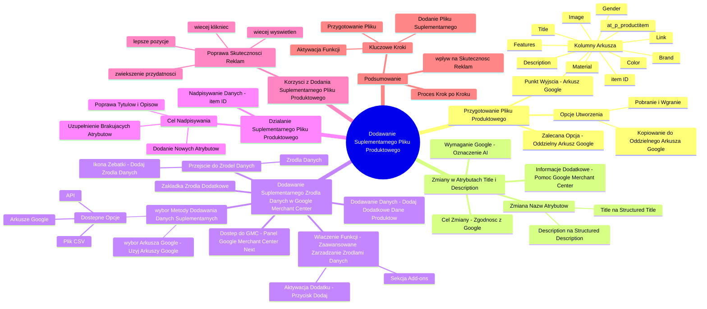

# Lekcje wideo - 10. Dodawanie poprawionych produktów do Merchant Center

# 💡 Diagram

___

# 🗒️ Notatka

# Dodawanie Suplementarnego Pliku Produktowego do Google Merchant Center

## Wprowadzenie

Ten dokument zawiera szczegółowe omówienie procesu dodawania suplementarnego pliku produktowego do konta Google Merchant Center ⚙️. Celem jest wzbogacenie danych produktowych i potencjalna poprawa skuteczności reklam produktowych.

## Szczegółowe Kroki

### 1. Tworzenie Pliku Produktowego 📄

- **Punkt wyjścia:** Arkusz kalkulacyjny Google z danymi produktów.
    - Arkusz zawiera kolumny takie jak: `at_p_productitem`, `item ID`, `Title`, `Description`, `Link`, `Brand`, `Color`, `Gender`, `Material`, `Image`, `Features`.
- **Opcje utworzenia pliku suplementarnego:**
    - **Pobranie i wgranie:** Pobranie zakładki `Output Feed` z arkusza kalkulacyjnego i wgranie do Google Merchant Center.
    - **Kopiowanie do oddzielnego Arkusza Google:** Skopiowanie danych do nowego arkusza Google, co ułatwia zarządzanie i połączenie z Merchant Center bez pobierania plików na komputer.
    - **Zalecana opcja:** Kopiowanie danych do oddzielnego arkusza Google dla wygody i łatwości aktualizacji.

### 2. Zmiany w Atrybutach `Title` i `Description`

- **Wymaganie Google:** Google wymaga oznaczenia atrybutów `Title` i `Description` jako wygenerowanych przez AI 🤖, jeśli zostały stworzone przy pomocy sztucznej inteligencji.
- **Zmiana nazw atrybutów:**
    - Zmiana `Title` na **`Structured Title`**.
    - Zmiana `Description` na **`Structured Description`**.
- **Cel zmiany:** Zgodność z zasadami Google Merchant Center i uniknięcie problemów z plikiem produktowym.
- **Informacje dodatkowe:** Szczegóły dotyczące `Structured Title` i `Structured Description` są dostępne w pomocy Google Merchant Center.

### 3. Dodawanie Suplementarnego Źródła Danych w Google Merchant Center ⚙️

- **Dostęp do Google Merchant Center:** Przejdź do panelu Google Merchant Center Next.
- **Włączenie funkcji "Zaawansowane Zarządzanie Źródłami Danych" ➕:**
    - Przejdź do sekcji **"Dodatki"** (Add-ons).
    - Znajdź opcję **"Zarządzanie zaawansowanymi źródłami danych"** na dole listy dodatków.
    - **Aktywacja dodatku:** Kliknij przycisk "Dodaj" (jeśli opcja nie jest aktywna). Po aktywacji opcja pojawi się w sekcji "Twoje dodatki".
- **Przejście do Źródeł Danych ➡️:**
    - Możesz przejść przez **"Źródła danych"** w menu bocznym lub przez ikonę zębatki **"Dodaj źródła danych"** na stronie głównej.
- **Zakładka "Źródła Dodatkowe":** Po włączeniu dodatku, w sekcji "Źródła danych" pojawi się nowa zakładka **"Źródła dodatkowe"**.
- **Dodawanie dodatkowych danych produktów:** Kliknij **"Dodaj dodatkowe dane produktów"**.

### 4. Wybór Metody Dodawania Danych Suplementarnych

- **Dostępne opcje:**
    - **Dodaj dane produktów z pliku:** Przesyłanie pliku CSV z komputera.
    - **Użyj Arkuszy Google:** Wybór istniejącego arkusza Google.
    - **Dodaj dane produktów za pomocą interfejsu API:** Dodawanie danych poprzez API (opcja nie jest szczegółowo omawiana).
- **Wybór Arkusza Google:** Jeśli korzystasz z arkusza Google, wybierz opcję "Użyj Arkuszy Google" i wskaż odpowiedni arkusz z listy.

### 5. Działanie Suplementarnego Pliku Produktowego 📄

- **Nadpisywanie danych:** System Google Merchant Center, na podstawie **`item ID`**, nadpisuje informacje z suplementarnego pliku produktowego na główny plik produktowy.
- **Cel nadpisywania:**
    - Poprawa tytułów i opisów (dzięki `Structured Title` i `Structured Description`).
    - Uzupełnienie brakujących atrybutów.
    - Dodanie nowych atrybutów zawartych w pliku suplementarnym.

### 6. Korzyści z Dodania Suplementarnego Pliku Produktowego ✅

- **Poprawa skuteczności reklam produktowych:**
    - Więcej wyświetleń reklam.
    - Więcej kliknięć.
    - Wyświetlanie na lepszych pozycjach.
    - Zwiększenie przydatności reklam.

## Podsumowanie

Dodanie suplementarnego pliku produktowego do Google Merchant Center ⚙️ to proces składający się z kilku etapów.  Na początku przygotuj plik, najlepiej w Arkuszach Google, pamiętając o zmianie nazw atrybutów `Title` i `Description` na `Structured Title` i `Structured Description` dla treści generowanych przez AI 🤖. Następnie, w Google Merchant Center, aktywuj funkcję "Zaawansowane zarządzanie źródłami danych" w sekcji "Dodatki" ➕. Po aktywacji, w zakładce "Źródła dodatkowe" dodaj suplementarny plik produktowy, wybierając Arkusze Google jako źródło danych. System, bazując na `item ID`, wykorzysta dane z pliku suplementarnego do aktualizacji i wzbogacenia głównego pliku produktowego, co przełoży się na poprawę skuteczności reklam produktowych. Jest to istotny krok w kontekście zgodności z zasadami Google i optymalizacji kampanii reklamowych.

___

# 🔉 Transcript
File: Lekcje wideo - 10. Dodawanie poprawionych produktów do Merchant Center.mp4 
[00:00:05] I tak, przechodząc już naprawdę do końca, została nam ostatnia rzecz, czyli dodanie tego suplementarnego pliku produktowego do naszego konta Google Merchant Center.
[00:00:14] W tym celu musimy wykonać kilka kroków, niezbyt skomplikowanych, ale obowiązkowych.
[00:00:19] (Ekran: Arkusz kalkulacyjny Google z danymi produktów. Kolumny zawierają takie informacje jak: at_p_productitem, item ID, Title, Description, Link, Brand, Color, Gender, Material, Image, Features.)
[00:00:19] Pierwsza rzecz jest to, że chcemy stworzyć sobie właśnie ten plik produktowy, który będziemy mogli dodać.
[00:00:24] Możemy oczywiście pobrać ten arkusz kalkulacyjny i ten pierwszą zakładkę Output Feed i ją wgrać do konta Google Merchant Center, ale możemy też po prostu sobie skopiować to co tutaj mamy do naszego oddzielnego arkusza, którego po prostu też możemy połączyć z naszym kontem Merchant Center, żeby mieć te wszystkie informacje tutaj, żeby nie pobierać tego na komputer, a później tego nie szukać.
[00:00:48] Zanim jeszcze przejdziemy do Merchant Center, musimy zrobić dwie rzeczy, takie dwie zmiany.
[00:00:53] Mianowicie od jakiegoś czasu Google wymaga, aby atrybuty Title i Description miały informacje, czy zostały wygenerowane za pomocą AI.
[00:01:04] W tym przypadku tak.
[00:01:05] Mieliśmy tu pomoc AI, dlatego powinniśmy zmienić atrybut Title na coś takiego jak Structured Title i tak samo Structured Description.
[00:01:14] (Ekran: Strona pomocy Google Merchant Center Help z informacjami o atrybutach Title i Structured Title.)
[00:01:14] I tu mamy dokładnie w pomocy właśnie Google wszystko to opisane, jak to powinno wyglądać, więc w tym momencie po prostu kopiuję to co jest tutaj i wklejam po prostu zamiast tytułu podaję Structured Title i tak samo tutaj dodam jeszcze to Structured Description.
[00:01:36] (Ekran: Arkusz kalkulacyjny Google. Zmiana nazwy kolumn z Title na Structured Title i z Description na Structured Description.)
[00:01:36] Zrobię tak, żeby system wiedział, że to zostało wygenerowane przez AI i oczywiście to będzie nadrzędnie używane do naszego pliku produktowego, ale jest to niezbędna zmiana, żeby być zgodnym z zasadami tutaj właśnie Google Merchant Center i nie mieć z tym żadnych problemów.
[00:01:51] No i jak już mamy taki plik, to teraz możemy przejść do naszego konta Google Merchant Center.
[00:01:55] (Ekran: Panel Google Merchant Center Next.)
[00:01:55] Jestem teraz na koncie Google Merchant Center i żeby dodać taki dodatkowy plik produktowy, to teoretycznie mógłbym wejść do źródeł danych, ale tam nie znajdę opcji dodaj dodatkowe źródła danych, ponieważ jest to taka specjalna funkcja, którą najpierw muszę włączyć w sekcji dodatki.
[00:02:08] (Ekran: Sekcja Dodatki w Google Merchant Center Next. Lista dostępnych dodatków.)
[00:02:08] Przechodząc tutaj, na samym dole powinienem mieć taką opcję zarządzanie zaawansowanymi źródłami danych.
[00:02:14] W tej chwili tej opcji tutaj nie widzę, dlaczego?
[00:02:16] Bo ja już tą opcję sobie dodałem.
[00:02:18] Jeżeli tego nie zrobiłeś, nie zrobiłaś, to będziesz mieć tą opcję gdzieś tu na samym dole z przyciskiem dodaj i jak to klikniesz, to w sekcji twoje dodatki pojawi się właśnie ta opcja zaawansowane zarządzanie źródłami danych.
[00:02:29] I mając to już tutaj gotowe, możemy przejść właśnie do zarządzania naszymi źródłami danych.
[00:02:36] (Ekran: Lista źródeł danych w Google Merchant Center Next.)
[00:02:36] To samo możemy zrobić już mając będąc na stronie głównej za pomocą tej zębatki dodaj źródła danych i dzięki temu, że włączyliśmy tą opcję, mamy tutaj nową zakładkę źródła dodatkowe.
[00:02:46] Przechodzimy na to źródła dodatkowe, klikamy dodaj dodatkowe dane produktów.
[00:02:48] (Ekran: Opcje dodawania dodatkowych danych produktów: Dodaj dane produktów z pliku, Użyj Arkuszy Google, Dodaj dane produktów za pomocą interfejsu API.)
[00:02:48] Jeżeli pobraliśmy taki arkusz CSV na nasz komputer, to możemy go tutaj przesłać.
[00:02:57] Jeżeli użyliśmy arkuszy Google, to możemy wybrać arkusz Google, wybrać istniejący arkusz, wybrać go z tych co mamy dostępnych i wgrać sobie do systemu i na podstawie właśnie tego dodatkowego źródła danych i po ID produktu system nadpisze informacje z tego suplementarnego dodatkowego pliku produktowego na nasz główny plik produktowy, tak żeby poprawić tytuły i uzupełnić brakujące atrybuty albo dodać nowe te, które mamy właśnie w tym dodatkowym pliku produktowym.
[00:03:20] I wuala, na podstawie tego będziemy mogli ocenić później skuteczność naszych reklam produktowych, sprawdzić czy mamy więcej wyświetleń, czy mamy więcej kliknięć na czy wyświetlamy się po prostu na najlepszych pozycjach i nasza przydatność się zwiększyła.
[00:03:32] To tyle, jeżeli chodzi o te kwestie, możemy przejść do podsumowania.
[00:03:36] (Ekran: Logo Umiejętności Jutra AI.)

___
# 🏷️ Tags
#google_merchant_center
#plik_produktowy
#dane_produktowe
#reklamy_produktowe
#arkusz_kalkulacyjny_google
#at_p_productitem
#item_ID
#title
#description
#link
#brand
#color
#gender
#material
#image
#features
#output_feed
#structured_title
#structured_description
#AI
#sztuczna_inteligencja
#zaawansowane_zarządzanie_źródłami_danych
#dodatki
#źródła_danych
#źródła_dodatkowe
#dodaj_dodatkowe_dane_produktów
#dodaj_dane_produktów_z_pliku
#użyj_arkuszy_google
#dodaj_dane_produktów_za_pomocą_interfejsu_API
#CSV
#nadpisywanie_danych
#skuteczność_reklam
#wyświetlenia
#kliknięcia
#pozycje_reklam
#przydatność_reklam
#optymalizacja_kampanii
