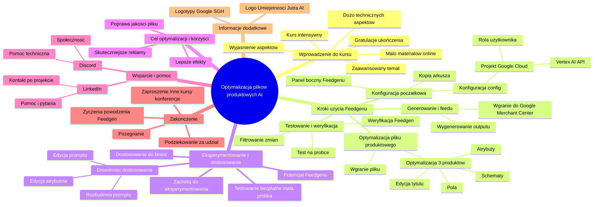

# Lekcje wideo - 11. Podsumowanie

# 💡 Diagram

___

# 🗒️ Notatka

# Notatki z kursu: `Optymalizacja plików produktowych za pomocą AI` 🚀

## Wprowadzenie

Ten dokument zawiera szczegółowe notatki i podsumowanie intensywnego, technicznego kursu poświęconego optymalizacji plików produktowych z wykorzystaniem **sztucznej inteligencji** (AI) i narzędzia **Feedgen**. Celem kursu było umożliwienie uczestnikom efektywnego wykorzystania **AI** do ulepszania ich plików produktowych.

## Podsumowanie kursu i gratulacje 🎉

*   Kurs był **długi** i **intensywny**, obejmując wiele **technicznych aspektów**.
*   Prowadzący **gratuluje** uczestnikom ukończenia kursu.
*   Wyraża **nadzieję**, że zdobyta wiedza umożliwi uczestnikom **optymalizację plików produktowych** za pomocą **AI**.
*   Podkreśla **zaawansowany** charakter tematu i jego **ograniczoną dostępność** w internecie.
*   Prowadzący ma **nadzieję**, że udało mu się **wyjaśnić** kluczowe aspekty.

## Przypomnienie kroków użycia **Feedgenu** ⚙️

Poniżej przypomnienie **kroków** niezbędnych do optymalizacji plików produktowych za pomocą **Feedgenu**:

### Konfiguracja początkowa 🛠️

1.  **Wykonanie kopii arkusza kalkulacyjnego**.
2.  **Inicjalizacja i uruchomienie panelu bocznego Feedgenu** w arkuszu.
3.  **Uzupełnienie pól w konfiguracji (config)**, ze szczególnym uwzględnieniem:
    *   **Pola projektu Google na Google Cloudzie**.
        *   Musi być **włączone Vertex AI API**.
        *   Musi być **dodana rola użytkownika**.

### Optymalizacja pliku produktowego ✨

4.  **Wgranie pliku produktowego** przeznaczonego do optymalizacji.
5.  **Optymalizacja na podstawie trzech pierwszych produktów**:
    *   **Edycja** i zdefiniowanie pożądanego formatu **ulepszonego tytułu**.
    *   Określenie **schematów**, które mają zostać użyte.
    *   Określenie **pól**, które mają być uwzględnione.
    *   Określenie **atrybutów**, które mają się pojawić.

### Testowanie i weryfikacja ✅

6.  **Wykonanie testu na małej próbce** produktów w celu weryfikacji poprawności działania.
7.  **Weryfikacja** w zakładce **Feedgenu**, czy wprowadzone zmiany są satysfakcjonujące.
8.  **Filtrowanie zmian** i wybór tych, które zostaną wykorzystane.

### Generowanie i wykorzystanie feedu 📤

9.  **Wygenerowanie outputu**, czyli **feedu produktowego**.
10. **Wgranie wygenerowanego feedu** do konta **Google Merchant Center**.

## Zachęta do eksperymentowania i dostosowania 🧪

*   Prowadzący **zachęca** do **eksperymentowania** z narzędziem **Feedgen**.
*   Podkreśla, że **testowanie** narzędzia na **małej ilości produktów** jest **bezpłatne**.
*   Im więcej czasu poświęci się na **poznanie Feedgenu**, tym lepiej widać jego **potencjał** i **możliwość dostosowania** do różnorodnych branż.
*   Istnieje **pełna dowolność** w **dostosowaniu** narzędzia do indywidualnych potrzeb poprzez:
    *   **Edycję promptu**.
    *   **Rozbudowę promptu**.
    *   **Edycję poszczególnych atrybutów** i innych elementów.

## Cel optymalizacji i korzyści 🎯

*   Głównym celem jest **poprawa jakości pliku produktowego**.
*   Wyższej jakości plik produktowy przekłada się na **skuteczniejsze reklamy**.
*   Skuteczniejsze reklamy generują **lepsze efekty** i wyniki.

## Wsparcie i pomoc 🤝

*   W przypadku pytań lub problemów, prowadzący zachęca do kontaktu na **Discordzie**.
    *   Na **Discordzie** dostępna jest **społeczność**, oferująca **pomoc**, szczególnie w kwestiach **technicznych**.
*   W razie potrzeby, istnieje możliwość kontaktu z prowadzącym **po zakończeniu projektu** poprzez **LinkedIn**.
    *   Prowadzący deklaruje **chęć pomocy** i **odpowiedzi na pytania**.

## Zakończenie 👋

*   Prowadzący **dziękuje** za udział w kursie.
*   **Życzy powodzenia** w korzystaniu z **Feedgenu** i optymalizacji plików produktowych.
*   Zaprasza do udziału w **innych kursach** lub spotkań na **konferencjach**.
*   **Pożegnanie**: \"Cześć!\"

## Informacje dodatkowe

*   **Logo \"Umiejętności Jutra AI\"**.
*   **Logotypy Google i SGH** (Szkoła Główna Handlowa w Warszawie).

## Podsumowanie 📝

Kurs `Optymalizacja plików produktowych za pomocą AI` koncentrował się na praktycznym zastosowaniu narzędzia **Feedgen** do ulepszania danych produktowych. Prowadzący szczegółowo omówił etapy konfiguracji i użytkowania **Feedgenu**, podkreślając jego elastyczność i możliwości adaptacji do różnych potrzeb. Kluczowym przesłaniem kursu jest zachęta do eksperymentacji z narzędziem, testowania na niewielkich próbkach danych oraz aktywnego korzystania ze wsparcia społeczności i bezpośredniego kontaktu w razie trudności.  Celem kursu jest umożliwienie uczestnikom tworzenia lepszych plików produktowych, co w efekcie ma prowadzić do skuteczniejszych kampanii reklamowych i osiągania lepszych wyników biznesowych.

___

# 🔉 Transcript
File: Lekcje wideo - 11. Podsumowanie.mp4 
[00:00:05] Uf.
[00:00:07] To był długi kurs.
[00:00:08] Dużo się działo, było dużo technicznych rzeczy, ale bardzo się cieszę, że to przeszłeś, przeszłaś.
[00:00:14] Że udało ci się, bo mam nadzieję, że dzięki temu uda ci się wykorzystać to narzędzie do optymalizacji twoich plików produktowych właśnie przy pomocy AI.
[00:00:22] Jest to dość zaawansowana rzecz, nie jest to proste, w internecie nie ma za bardzo o tym materiałów.
[00:00:30] Więc mam nadzieję, że tutaj udało mi się to wyjaśnić.
[00:00:33] Jeszcze raz, dla przypomnienia po kolei kroki.
[00:00:36] Musimy wykonać kopię tego arkusza kalkulacyjnego, musimy zainicjalizować i uruchomić tam ten panel boczny Feedgenu, musimy uzupełnić pola w configu, zwłaszcza pole projektu Google na Google Cloudzie, gdzie musi być włączony Vertex AI API i musi być dodana rola użytkownika.
[00:00:57] Następnie musimy wgrać nasz plik produktowy, który chcemy poprawić i na podstawie trzech pierwszych produktów zrobić tą zmianę i edytować jak ten ulepszony tytuł ma wyglądać, jakie mają być tam schematy, jakie mają być tam pola uwzględnione, jakie atrybuty mają się tam pojawić.
[00:01:16] Wykonać najlepiej na małej próbce test, czy wszystko jest okej.
[00:01:20] Jeżeli tak, to zweryfikować później w zakładce, czy wszystko dobrze zadziałało, czy nam się podobają te zmiany, wyfiltrować te, które chcemy wykorzystać, wygenerować output, feed, który później możemy wgrać sobie do konta Google Merchant Center.
[00:01:34] Zachęcam do tego, żeby najpierw po prostu się tym pobawić.
[00:01:37] Przy małej ilości produktów nie będzie, nie będzie nas to nic kosztowało, więc nie ma tu żadnego problemu.
[00:01:44] A myślę, że im bardziej zagłębiałem się w Feedgena, im bardziej poznawałem to narzędzie i jak ono działa, tym bardziej widziałem jak fajnie można to dostosować do różnych branż.
[00:01:55] No bo wszystkim, my możemy edytować prompt, który tam jest, możemy go rozbudować.
[00:01:59] Możemy też edytować poszczególne te atrybuty i wszystkie rzeczy, które się tam znajdują, więc mamy pełną dowolność dopasowania tego do naszych potrzeb.
[00:02:07] Dlatego zachęcam do zabawy, zachęcam do przetestowania właśnie na małej próbce, zobaczenia, a później być może właśnie na wszystkich naszych produktach po to, żeby wasz plik produktowy działał, był jak najlepszy i dzięki temu wasze reklamy były skuteczniejsze i osiągały lepsze efekty.
[00:02:21] Jeżeli masz jakieś pytania, jeżeli coś zadziałało, nie zadziałało, to oczywiście pamiętaj, że możesz zadawać te pytania na Discordzie, gdzie mamy naszą społeczność, gdzie będziemy pomagać, zwłaszcza w takich trudnych technicznych kwestiach, a w razie czego to nawet po projekcie możesz do mnie pisać na LinkedInie, gdzie chętnie pomagam, chętnie odpowiadam i cóż, będę tam dostępny.
[00:02:42] A ja za dzisiaj ci bardzo dziękuję.
[00:02:45] Życzę powodzenia w korzystaniu z Feedgenu i optymalizacji twoich plików produktowych.
[00:02:50] Dzięki i do zobaczenia na innym kursie czy na konferencji.
[00:02:54] W innej przestrzeni, w innym czasie.
[00:02:56] Cześć.
[00:03:00] (Na ekranie wyświetla się logo "Umiejętności Jutra AI" z logotypami Google i SGH poniżej.)

___
# 🏷️ Tags
#optymalizacja_plików_produktowych #AI #sztuczna_inteligencja #Feedgen #kurs #szkolenie #edukacja #uczenie_maszynowe #machine_learning #pliki_produktowe #dane_produktowe #Google_Merchant_Center #reklamy #skuteczność_reklam #efekty_reklamowe #konfiguracja #inicjalizacja #panel_boczny #arkusz_kalkulacyjny #Google_Cloud #Vertex_AI_API #rola_użytkownika #atrybuty_produktowe #schematy #testowanie #weryfikacja #filtrowanie_danych #generowanie_feedu #output #eksperymentowanie #dostosowanie #edycja_promptu #rozbudowa_promptu #poprawa_jakości #wsparcie #pomoc #Discord #społeczność #LinkedIn #pytania #problemy #rozwiązywanie_problemów #Umiejętności_Jutra_AI #Google #SGH #Szkoła_Główna_Handlowa #kampanie_reklamowe #wyniki_biznesowe #techniczne_aspekty #zaawansowane_zagadnienia #ograniczona_dostępność #ulepszony_tytuł #formatowanie_danych #mała_próbka #bezpłatne_testowanie #potencjał_narzędzia #indywidualne_potrzeby #różnorodne_branże
