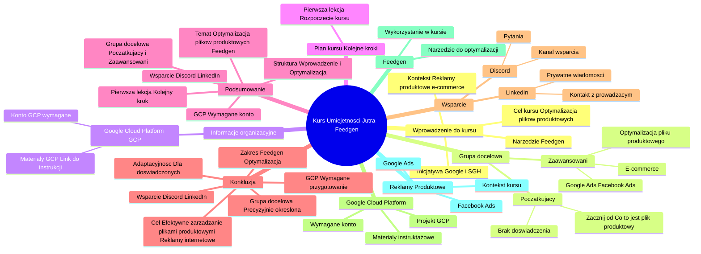

# Lekcje wideo - 2. Wstęp

# 💡 Diagram

___

# 🗒️ Notatka

# Notatki i Podsumowanie Kursu "Umiejętności Jutra" 🚀 - Optymalizacja Plików Produktowych z Feedgen

## Wprowadzenie do Kursu i Omówienie Zawartości

Ten kurs wideo, realizowany przez Google 🔍 i SGH w ramach inicjatywy "Umiejętności Jutra" 🚀, stanowi wprowadzenie do optymalizacji plików produktowych z wykorzystaniem narzędzia **Feedgen**. Jest on dedykowany osobom zainteresowanym reklamami produktowymi i efektywnym zarządzaniem danymi produktowymi w e-commerce 🛒.

### Dla Kogo Jest Ten Kurs?

* **Początkujący 👶:** Osoby, które nie mają doświadczenia z plikami produktowymi i reklamami produktowymi.
    * Zaleca się sekwencyjne przejście wszystkich lekcji, zaczynając od modułu wprowadzającego: "Co to jest plik produktowy?".
* **Zaawansowani 🧑‍💻:** Osoby aktywnie działające w branży e-commerce 🛒, zarządzające kampaniami produktowymi w Google Ads i Facebook Ads, posiadające wiedzę na temat struktury plików produktowych i atrybutów.
    * Mogą rozpocząć kurs od razu od lekcji "Optymalizacja pliku produktowego", pomijając wprowadzenie "Co to jest plik produktowy".

### Ważne Informacje Organizacyjne

* **Wykorzystanie Google Cloud Platform ☁️:** W trakcie kursu będziemy korzystać z konta na Google Cloud Platform.
    * **Dla osób bez konta GCP:**  Dostępny jest link do materiałów wyjaśniających, czym jest Google Cloud Platform i jak założyć projekt. Link ten znajdziesz w materiałach do lekcji.
* **Wsparcie i Pomoc 🤝:**
    * **Discord 💬:**  Udostępniamy kanał na Discordzie, gdzie możesz zadawać pytania i uzyskać wsparcie.
    * **LinkedIn 💼:**  Istnieje możliwość kontaktu z prowadzącym poprzez LinkedIn w wiadomości prywatnej, aby uzyskać pomoc i odpowiedzi na pytania.

### Plan Kursu - Kolejne Kroki 👣

Po tym wprowadzeniu, zapraszamy do przejścia do pierwszej lekcji kursu.

---

## Podsumowanie Kluczowych Punktów 📝

* **Temat kursu:** Optymalizacja plików produktowych za pomocą narzędzia **Feedgen**.
* **Grupa docelowa:** Kurs jest przeznaczony zarówno dla początkujących, jak i zaawansowanych użytkowników e-commerce 🛒 i reklam produktowych.
* **Struktura kursu:**  Rozpoczyna się wprowadzeniem do plików produktowych, a następnie skupia się na optymalizacji z użyciem **Feedgen**.
* **Konto Google Cloud Platform ☁️:** Do praktycznego wykorzystania **Feedgen** w kursie niezbędne jest konto Google Cloud Platform. Materiały instruktażowe dla osób bez konta są dostępne.
* **Wsparcie:** Oferujemy wsparcie poprzez kanał Discord 💬 oraz kontakt z prowadzącym na LinkedIn 💼.
* **Pierwsza lekcja:** Kolejnym krokiem jest rozpoczęcie pierwszej lekcji kursu.

---

## Konkluzja 💡

Wprowadzenie do kursu "Umiejętności Jutra" 🚀 poświęconego **Feedgen** i optymalizacji plików produktowych precyzyjnie określa zakres tematyczny, docelową grupę odbiorców oraz wymagane przygotowanie, w tym dostęp do Google Cloud Platform ☁️. Podkreślono adaptacyjność kursu, umożliwiając doświadczonym uczestnikom pominięcie lekcji o podstawach.  Zapewnienie wsparcia poprzez Discord 💬 i LinkedIn 💼 ma na celu ułatwienie procesu nauki i rozwiązywanie potencjalnych problemów. Kurs stanowi praktyczne wprowadzenie do efektywnego zarządzania plikami produktowymi w kontekście reklam internetowych 🌐.

___

# 🔉 Transcript
File: Lekcje wideo - 2. Wstęp.mp4 
[00:00:00] (Biały ekran)
[00:00:01] (Na ekranie pojawia się napis "Umiejętności Jutra" oraz logo AI. Poniżej napisy "Organizator Google" oraz "Partner edukacyjny SGH")
[00:00:05] Cześć. Witam cię na kursie o wykorzystaniu Feedgena, narzędzia Feedgen do optymalizacji plików produktowych. Wiem, tytuł brzmi skomplikowanie, ale spokojnie, wszystko sobie dokładnie tutaj wyjaśnimy. Zanim jednak przejdziemy do poszczególnych lekcji, małe takie wyjaśnienie. Jeżeli nie masz doświadczenia z plikami produktowymi, nie za bardzo wiesz o co tutaj chodzi, nie wiesz jak działają reklamy produktowe, to zachęcam cię do przejścia wszystkich lekcji po kolei i zaczynania od tego, zaczęcie od tego wstępu właśnie co to jest plik produktowy. Jeżeli jednak działasz aktywnie w sklepach internetowych, zarządzasz kampaniami produktowymi w Google Ads czy Facebook Adsach. No i wiesz jak się tworzy plik produktowy, wiesz jak on wygląda, wiesz o co chodzi z tymi atrybutami i tak dalej i tak dalej, to uwaga, tą pierwszą lekcję, co to jest plik produktowy, możesz spokojnie pominąć, bo tam po prostu skupiamy się na tych podstawach i przejść od razu do filmiku optymalizacja pliku produktowego, czyli tutaj kolejnego nagrania, w którym omawiam właśnie na czym należy się skupić przy optymalizacji pliku produktowego, a to jednak będzie nam potrzebne już kiedy będziemy zajmować się samym Feedgenem.
[00:01:17] Jeszcze jedna ważna kwestia. Podczas tego kursu będziemy wykorzystywać konto na Google Cloud Platform. Jeżeli się tego konta nie masz, jeżeli nie wiesz jak działa Google Cloud, a chcesz jednak wykorzystać Feedgen, to oczywiście w materiałach do tej lekcji daję ci link do kursu, w którym omawiamy co to jest właśnie platforma Google Cloud i jak założyć swój pierwszy projekt na Google Cloud Platform, co będzie nam potrzebne w całym naszym tutaj kursie do zabawy i do optymalizacji plików produktowych. Myślę, że z tych rzeczy organizacyjnych to nam wystarczy. Przypominam, że jeśli, że jeśli podczas w ogóle tutaj przechodzenia tego kursu będziesz mieć jakiekolwiek pytania, to śmiało możesz zadawać je na naszym Discordzie, gdzie będziemy pomagać i wyjaśniać wszelkie wątpliwości, albo w razie czego możesz pisać też do mnie prywatnie na LinkedInie, gdzie jestem dostępny i gdzie też będę starał się odpowiadać i pomagać. No dobra, myślę, że tyle wstępu wystarczy. Przejdźmy w takim razie do pierwszej lekcji.
[00:02:16] (Na ekranie pojawia się napis "Umiejętności Jutra" oraz logo AI. Poniżej napisy "Organizator Google" oraz "Partner edukacyjny SGH")
[00:02:19] (Biały ekran)

___
# 🏷️ Tags
#Umiejętności_Jutra #Feedgen #optymalizacja_plików_produktowych #pliki_produktowe #e-commerce #reklamy_produktowe #Google #SGH #Google_Ads #Facebook_Ads #atrybuty_plików_produktowych #Google_Cloud_Platform #GCP #Discord #LinkedIn #wsparcie #pomoc #kurs_wideo #początkujący #zaawansowani #struktura_plików_produktowych #zarządzanie_danymi_produktowymi #reklamy_internetowe
