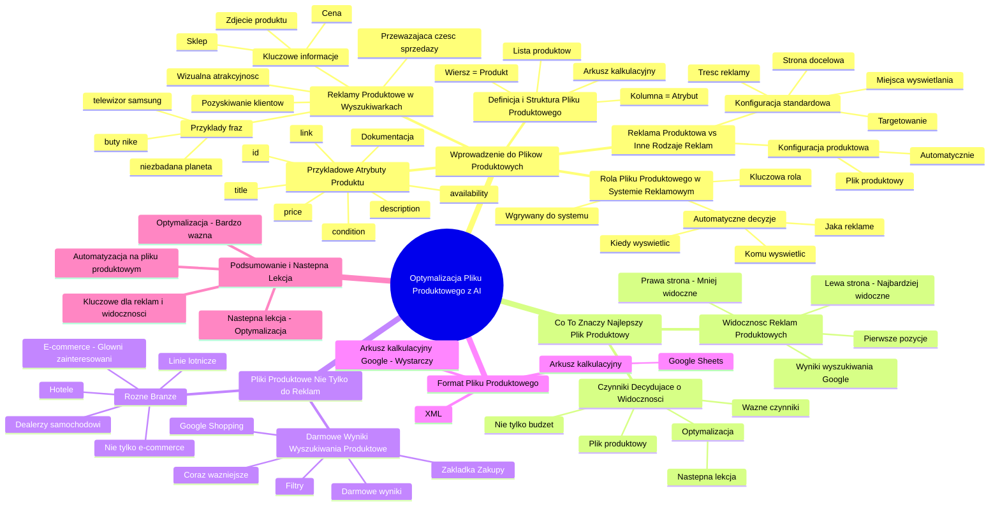

# Lekcje wideo - 3. Co to jest plik produktowy

# 💡 Diagram

___

# 🗒️ Notatka

# Notatki i Podsumowanie Lekcji: Optymalizacja Pliku Produktowego z AI 🤖

## Wprowadzenie do Plików Produktowych

Ten kurs koncentruje się na **plikach produktowych** i ich optymalizacji, szczególnie z wykorzystaniem **AI** (sztucznej inteligencji). Lekcja ma na celu wyjaśnienie, czym są `pliki produktowe` i dlaczego są tak ważne, zwłaszcza w kontekście reklam produktowych i widoczności produktów w internecie 🌐.

## Czym są Pliki Produktowe?

### Reklamy Produktowe w Wyszukiwarkach 🔎

- **Reklamy produktowe** są wizualnie atrakcyjne ✨ i efektywne w przyciąganiu uwagi użytkowników w wynikach wyszukiwania Google.
    - Przykłady fraz w Google: "niezbadana planeta 🪐", "buty nike 👟", "telewizor samsung 📺".
    - Kafelki produktów z obrazami 🖼️, cenami 🏷️ i nazwami sklepów są bardziej angażujące niż standardowe reklamy tekstowe.
- Użytkownicy od razu widzą kluczowe informacje o produkcie:
    - Zdjęcie produktu 🖼️
    - Cena 🏷️
    - Sklep 🏪, od którego można kupić produkt
- Z perspektywy sklepu internetowego 🏪, reklamy produktowe to **prosty sposób na pozyskiwanie klientów** i generowanie sprzedaży 💰.
- Kafelki produktów odpowiadają za **przeważającą część sprzedaży** w większości sklepów internetowych.

### Reklama Produktowa vs. Inne Rodzaje Reklam

- **Różnica w konfiguracji reklam:**
    - **Standardowe reklamy:** Ustawiamy targetowanie, miejsca wyświetlania, treść reklamy (tekst i grafiki), oraz stronę docelową.
    - **Reklamy produktowe:** **Wszystko dzieje się automatycznie** na podstawie **pliku produktowego**. Nie ustawiamy ręcznie targetowania ani treści reklam.

### Definicja i Struktura Pliku Produktowego

- **Plik produktowy** to **lista produktów** oferowanych przez sklep internetowy 🏪, zawierająca **szczegółowe informacje** o każdym produkcie.
- Jest to **arkusz kalkulacyjny** 📊 (np. Google Sheets), gdzie:
    - **Każdy wiersz** reprezentuje **oddzielny produkt**.
    - **Kolumny** reprezentują **atrybuty** (cechy) produktu.

### Przykładowe Atrybuty Produktu

- **Identyfikator produktu** (`id`)
- **Tytuł** (`title`) - nazwa produktu
- **Opis** (`description`)
- **Link do strony produktu** (`link`)
- **Stan** (`condition`) - nowy, używany
- **Cena** (`price`) 🏷️
- **Dostępność** (`availability`)
- ... i wiele innych.
- W `pliku produktowym` można wykorzystać **bardzo dużo atrybutów** (szczegóły w dokumentacji 📚).
- **Dokumentacja** dotycząca atrybutów jest dostępna w materiałach do lekcji 📚.

### Rola Pliku Produktowego w Systemie Reklamowym

- `Plik produktowy` jest **wgrywany do systemu reklamowego**.
- System reklamowy **automatycznie decyduje** na podstawie informacji z pliku:
    - **Komu** wyświetlić reklamę?
    - **Kiedy** wyświetlić reklamę? 🕰️
    - **Jaką** reklamę produktową wyświetlić?
- **Kluczowa rola pliku produktowego** w skuteczności reklam produktowych.

## Co To Znaczy "Najlepszy" Plik Produktowy? 🏆

### Widoczność Reklam Produktowych 👀

- W wynikach wyszukiwania Google, reklamy produktowe wyświetlają się w rzędach.
- **Najbardziej widoczne są reklamy z lewej strony**.
- Reklamy po prawej stronie są mniej widoczne, szczególnie na urządzeniach mobilnych 📱 (wymagają przesunięcia - swipe).
- Każdy reklamodawca chce, aby jego reklama była **na pierwszych pozycjach z lewej strony**.

### Czynniki Decydujące o Widoczności

- Kolejność wyświetlania reklam **nie jest przypadkowa** i **nie zależy tylko od budżetu** (stawek).
- Istnieje **szereg innych ważnych czynników** wpływających na widoczność.
- O te czynniki trzeba zadbać **w pliku produktowym**.
- Szczegóły dotyczące optymalizacji `pliku produktowego` zostaną omówione w **następnej lekcji**.

## Pliki Produktowe Nie Tylko do Reklam

### Darmowe Wyniki Wyszukiwania Produktowe (Google Shopping 🛒)

- `Pliki produktowe` są ważne **nie tylko dla płatnych reklam**.
- W Google, dla zapytań produktowych (np. "bluza termiczna"), pojawia się zakładka **"Zakupy"**.
- Można też wejść bezpośrednio na **Google Shopping**.
- Oprócz reklam na górze, w Google Shopping są **darmowe wyniki wyszukiwania produktów**.
- Po lewej stronie dostępne są **filtry** dopasowane do szukanych produktów.
- **Produkty mogą pojawić się w darmowych wynikach**, jeśli sklep ma **plik produktowy**.
- Zakładka "Zakupy" prawdopodobnie będzie **coraz ważniejsza** w przyszłości.
- To kolejny powód, aby zadbać o `plik produktowy`, nawet bez płatnych reklam.

## Pliki Produktowe dla Różnych Branż 🏢

- `Pliki produktowe` nie dotyczą tylko **sklepów internetowych** z produktami fizycznymi.
- Różne branże korzystają z baz danych ofert w formacie plików produktowych:
    - **Hotele** 🏨
    - **Linie lotnicze** ✈️
    - **Dealerzy samochodowi** 🚗
- **Sklepy internetowe (e-commerce)** są jednak **głównymi zainteresowanymi** i na nich skupi się kurs.

## Format Pliku Produktowego 🗂️

- Przykładowy `plik produktowy` był pokazany jako **arkusz kalkulacyjny**.
- `Pliki produktowe` mogą być też w innych formatach, np. **XML**.
- Na potrzeby kursu **wystarczy arkusz kalkulacyjny Google**. Inne formaty nie będą omawiane.

## Podsumowanie i Następna Lekcja 🚀

- `Pliki produktowe` są **kluczowe dla reklam produktowych i widoczności produktów w Google**.
- Automatyzacja reklam produktowych opiera się na `pliku produktowym`.
- Optymalizacja `pliku produktowego` jest **bardzo ważna** dla skuteczności reklam i widoczności w darmowych wynikach.
- W następnej lekcji zostanie wyjaśnione, **jak system decyduje o wyświetlaniu reklam** i **jak optymalizować plik produktowy**.

---

**Podsumowanie Lekcji:**

Lekcja stanowi wprowadzenie do tematyki `plików produktowych`, objaśniając ich definicję, strukturę i kluczową rolę w reklamach produktowych oraz darmowych wynikach wyszukiwania w Google Shopping 🛒. `Plik produktowy` to arkusz kalkulacyjny 📊 zawierający listę produktów i ich atrybutów, stanowiący podstawę do automatycznego generowania i wyświetlania reklam produktowych.  Optymalizacja `pliku produktowego` jest kluczowa dla osiągnięcia wysokiej widoczności i skuteczności reklam, jak również dla pojawiania się w darmowych wynikach wyszukiwania. Kurs skupi się głównie na zastosowaniu `plików produktowych` w **e-commerce**, wykorzystując arkusz kalkulacyjny Google jako preferowany format pliku. Następna lekcja zostanie poświęcona szczegółowym aspektom optymalizacji `pliku produktowego`.

___

# 🔉 Transcript
File: Lekcje wideo - 3. Co to jest plik produktowy.mp4 
[00:00:00] Ekran: Białe tło.
[00:00:05] Skoro jest to kurs, gdzie głównym bohaterem są pliki produktowe, to zacznijmy od wyjaśnienia czym właściwie są pliki produktowe.
[00:00:08] Ekran: Slajd tytułowy: Optymalizacja pliku produktowego z AI. Pod spodem: Krzysztof Modrzewski, Head of education, Marketing Masters.
[00:00:12] Ekran: Wyniki wyszukiwania Google dla frazy "niezbadana planeta".
[00:00:27] Ekran: Wyniki wyszukiwania Google dla frazy "niezbadana planeta". Na górze wyniki sponsorowane z produktami.
[00:00:49] Wróć uwagę, że tekstowe reklamy płatne, czy w ogóle wyniki wyszukiwania są zdecydowanie niżej i to właśnie te kafelki produktów najbardziej zachęcają do kliknięcia.
[00:00:59] Poza tym, przecież od razu pokazują bardzo wiele ważnych informacji, które mogą nas interesować.
[01:04:04] Ekran: Wyniki wyszukiwania Google dla frazy "buty nike". Na górze wyniki sponsorowane z produktami.
[01:05:05] To spójrzmy teraz na inny przykład, na wyniki wyszukiwania buty Nike.
[01:10:05] Nie doprecyzowaliśmy dokładnie modelu czy koloru jaki nas interesuje, ale po samym zdjęciu wiemy czy to jest to czego szukamy.
[01:17:55] Widzimy też czy cena jest dla nas odpowiednia i jeszcze od kogo będziemy dany produkt kupować.
[01:23:09] Od strony użytkownika super sprawa.
[01:26:17] Z kolei patrząc od strony sklepu internetowego, to pokazując w ten sposób nasz asortyment możemy w najprostszy sposób pozyskiwać klientów.
[01:35:13] Czyli też powiedziałbym super sprawa.
[01:37:17] A i dodam jeszcze do tego, że w większości sklepów internetowych to właśnie te kafelki produktów odpowiadają za przeważającą część sprzedaży.
[01:46:11] Dobra.
[01:47:26] A jak się tam wyświetlać?
[01:50:26] To o czym teraz rozmawiamy, to jest reklama, a konkretnie reklama produktowa, która uwaga bardzo różni się od innych rodzajów reklam i nie mam tu na myśli tylko wyglądu.
[02:01:31] Generalnie, jak chcemy wyświetlać reklamę w internecie, to wybieramy do kogo ona ma być kierowana, gdzie ma się wyświetlać, tworzymy treść tej reklamy, zarówno treści tekstowe jak i grafiki w zależności od formatu jaki wykorzystujemy, oraz to my decydujemy, gdzie użytkownik ma trafić po kliknięciu w naszą reklamę.
[02:19:55] I to wszystko ustawiamy w jakimś narzędziu do zarządzania kampaniami marketingowymi.
[02:24:54] W przypadku reklamy produktowej jest inaczej.
[02:27:36] Tutaj nic takiego nie ustawiamy.
[02:30:48] Tutaj wszystko dzieje się automatycznie, uwaga, na podstawie właśnie pliku produktowego, o którym wspomniałem na samym początku.
[02:39:45] To co to jest w takim razie ten plik, jak wygląda i jak działa?
[02:44:49] Ekran: Arkusz kalkulacyjny Google Merchant Center Feed.
[02:44:54] Plik produktowy to taka lista produktów jakie oferujemy w naszym sklepie internetowym wraz ze szczegółowymi informacjami o tych produktach.
[02:52:22] Ekran: Arkusz kalkulacyjny Google Merchant Center Feed - Floret podstawowy.
[02:52:51] Przykładowy plik właśnie widzisz na ekranie.
[02:55:22] Jak możesz zauważyć, jest to po prostu arkusz kalkulacyjny, gdzie każdy wiersz to oddzielny produkt z naszej oferty, a kolumny z kolei to atrybuty, czyli cechy danego produktu.
[03:07:24] To jakie to mogą być cechy, jakie informacje?
[03:10:28] Idąc po kolei.
[03:12:10] Mamy tutaj identyfikator produktu, mamy tytuł, czyli nazwę produktu, jego opis, link do strony, stan, czyli czy jest nowy czy używany, mamy cenę, dostępność i tak dalej i tak dalej.
[03:24:21] W tym przykładowym pliku są tylko te najważniejsze atrybuty, ale takich cech mamy do wykorzystania bardzo, bardzo, uwaga, bardzo dużo.
[03:32:12] W tym kursie między innymi będziemy omawiać co te pola dokładnie oznaczają, jak te kolumny powinny być nazwane, jak powinny być one uzupełnione, ponieważ co innego jest tutaj tematem naszego spotkania, ale uwaga, wszystko to dokładnie jest opisane w specjalnej dokumentacji, do której link znajdziesz w materiałach do tej lekcji, jeżeli cię to oczywiście interesuje.
[03:54:12] A cały plik produktowy jest potrzebny, ponieważ to właśnie jego wgrywamy do systemu reklamowego i na podstawie zawartych tutaj w tym pliku informacji system będzie decydował komu, kiedy i jaką reklamę produktową wyświetlić.
[04:08:23] Czyli możesz się już domyślać, że skoro reklama produktowa jest tak ważna dla sklepów internetowych, to zdecydowanie powinny one zadbać, żeby te pliki produktowe były jak najlepsze, bo dzięki temu będą lepsze i skuteczniejsze reklamy, prawda?
[04:25:10] Tylko co to znaczy najlepszy plik produktowy?
[04:29:57] Ekran: Wyniki wyszukiwania Google dla frazy "telewizor samsung". Na górze wyniki sponsorowane z produktami.
[04:30:11] Jeżeli wpiszę do wyszukiwarki na przykład telewizor Samsung, to pojawi się tam wiele reklam produktowych różnych modeli telewizorów, jak i również dokładnie tych samych modeli od różnych sprzedawców.
[04:41:12] Ekran: Wyniki wyszukiwania Google dla frazy "telewizor samsung". Na górze wyniki sponsorowane z produktami.
[04:41:58] Jednak jak możesz zauważyć, najbardziej widoczne jest tych kilka reklam od lewej strony.
[04:47:56] A wręcz te po prawej to na komputerze trzeba odkryć kliknięciem, a na urządzeniach mobilnych zrobić taki swipe, tak, żeby je zobaczyć.
[04:55:22] Dlatego każdy by chciał, żeby to jego reklama była na tych pierwszych pozycjach od lewej strony.
[05:00:12] I pewnie się nie zaskoczysz, że ta kolejność nie jest przypadkowa, ale uwaga, nie zależy tylko też od tego ile dany reklamodawca zdecydował się na nią zapłacić.
[05:10:12] Jest szereg innych bardzo ważnych czynników, które o takiej widoczności decydują.
[05:15:30] A skoro wszystko jest tworzone na podstawie pliku produktowego, to właśnie tam trzeba o coś konkretnego zadbać.
[05:23:58] A o co?
[05:24:59] O tym opowiem ci już w następnej lekcji, a teraz chciałbym poruszyć jeszcze kilka ważnych kwestii odnośnie plików i reklamy produktowej.
[05:32:10] Pierwsza kwestia.
[05:33:50] Czy jeżeli nie chcę wyświetlać reklam produktowych z jakichś przyczyn, nie wiem, może dopiero zaczynam swoją przygodę z własnym sklepem i jeszcze nie mam odpowiednich budżetów marketingowych, to czy pliki produktowe nie powinny mnie interesować?
[05:48:24] Powinny cię interesować.
[05:49:32] A to dlatego, że nie służą one wyłącznie do reklam.
[05:52:50] Spójrz.
[05:53:26] Ekran: Wyniki wyszukiwania Google dla frazy "bluza termiczna".
[05:53:31] Jeżeli w przeglądarce zapytasz o coś co wpada do kategorii produkty, na przykład bluza termiczna, to czasami już w wyszukiwarce możemy zauważyć taką dodatkową zakładkę zakupy.
[06:03:34] Ale jak jej nie widzisz to też możemy wejść bezpośrednio na Google Shopping i zobaczyć tam zupełnie inny widok wyników wyszukiwania.
[06:10:25] Oprócz reklam na samej górze, mamy poniżej ogromną listę produktów, a po lewej stronie widzimy szereg dostępnych i dopasowanych filtrów w zależności od tego jakich produktów szukamy.
[06:23:02] I to są darmowe produktowe wyniki wyszukiwania.
[06:26:58] I nasze produkty mogą się tutaj pojawić, jeżeli właśnie mamy plik produktowy.
[06:30:31] A tak of the record, chociaż nie wiem czy to jest dobre sformułowanie, bo nagrywamy kurs.
[06:36:16] W każdym razie, prawdopodobnie ta zakładka zakupy będzie coraz istotniejsza już w niedalekiej przyszłości, więc zdecydowanie jest to jakiś kolejny powód, żeby o to zadbać.
[06:44:16] Od ten swój plik produktowy.
[06:44:55] Ale to jeszcze nie wszystko co chciałem powiedzieć.
[06:47:10] Skoro mówimy o plikach produktowych, to czy cały ten kurs jest interesujący tylko dla sklepów internetowych?
[06:53:35] Nie.
[06:54:11] Pliki produktowe nie muszą dotyczyć tylko produktów w rozumieniu sklepów internetowych.
[06:58:10] Są różne branże, które również korzystają z tego typu baz danych związanych ze swoją ofertą, na przykład hotele, linie lotnicze czy dealerzy samochodowi.
[07:19:05] Jednak oczywiście w zdecydowanej większości głównymi zainteresowanymi są sklepy internetowe, e-commerce, więc to na nich będę się opierał w dalszej części kursu.
[08:01:52] I jeszcze jedna rzecz na koniec.
[08:03:47] Pokazując przykładowy plik produktowy, mogłeś, mogłaś zobaczyć arkusz kalkulacyjny.
[08:10:10] Ale pliki produktowe mogą być też tworzone w innych formatach, na przykład w formacie XML.
[08:14:44] Do naszych jednak potrzeb wystarczy nam standardowy arkusz kalkulacyjny Google, więc tymi innymi nie będziemy się przejmować.
[08:21:39] No dobra, to chyba wszystko.
[08:23:12] Wyszło zdecydowanie dłużej i więcej niż planowałem, ale musiałem wszystko wyjaśnić zanim przejdziemy do następnej lekcji, w której dokładnie wyjaśnię na jakiej podstawie system decyduje o wyświetleniach reklam i jak zabrać się za optymalizację naszego pliku produktowego.
[08:38:53] To co?
[08:40:09] Do zobaczenia w następnym materiale.
[08:41:59] Ekran: Logo Umiejętności Jutra AI.

___
# 🏷️ Tags
#pliki_produktowe #optymalizacja_pliku_produktowego #AI #sztuczna_inteligencja #reklamy_produktowe #google #wyniki_wyszukiwania #sklep_internetowy #e-commerce #pozyskiwanie_klientów #sprzedaż #targetowanie #automatyzacja #atrybuty_produktu #identyfikator_produktu #tytuł #opis #link #stan #cena #dostępność #dokumentacja #google_shopping #darmowe_wyniki_wyszukiwania #branże #hotele #linie_lotnicze #dealerzy_samochodowi #format_pliku #arkusz_kalkulacyjny #XML #widoczność_reklam #google_merchant_center #marketing_masters
