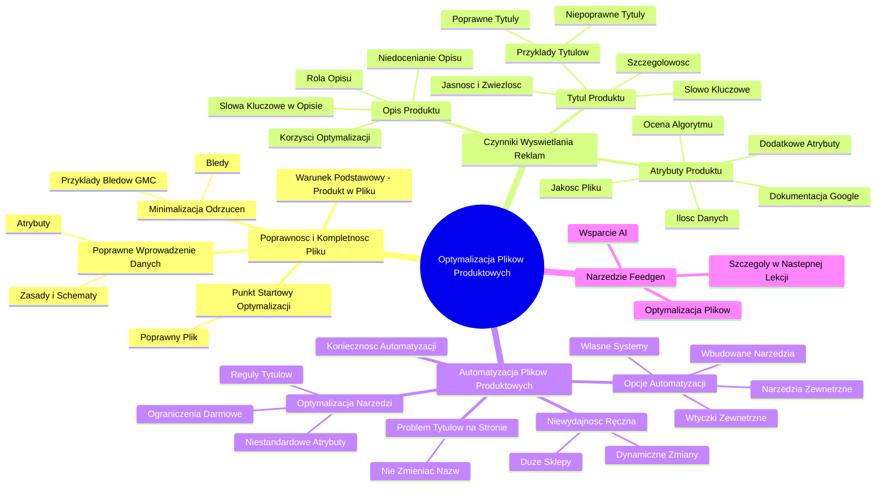

# Lekcje wideo - 4. Optymalizacja pliku produktowego

# 💡 Diagram

___

# 🗒️ Notatka

# Notatki i Podsumowanie Lekcji: Optymalizacja Plików Produktowych

## Wprowadzenie

Ta lekcja z serii "Umiejętności Jutra" 🚀, organizowanej przez Google i SGH, prowadzona przez Krzysztofa Modrzewskiego z Marketing Masters, koncentruje się na optymalizacji plików produktowych w kontekście reklam produktowych. Głównym celem jest zrozumienie, w jaki sposób systemy reklamowe podejmują decyzje o wyświetlaniu reklam oraz jak możemy udoskonalić nasze pliki produktowe, aby zwiększyć ich widoczność i skuteczność.

## Kluczowe Elementy Optymalizacji Plików Produktowych

### 1. Poprawność i Kompletność Pliku Produktowego

- **Warunek podstawowy:** Aby produkt mógł być reklamowany, musi znajdować się w pliku produktowym.
- **Poprawne wprowadzenie danych:** Produkty muszą być wprowadzone zgodnie z obowiązującymi zasadami i schematami, z uwzględnieniem wszystkich wymaganych atrybutów.
- **Minimalizacja odrzuceń:** Kluczowe jest zredukowanie liczby odrzuconych produktów z powodu błędów w pliku.
    - Częstym problemem jest brak produktów w pliku lub ich nieprawidłowe wprowadzenie.
    - Błędy mogą skutkować wyłączeniem produktów z możliwości reklamowania.
- **Punkt startowy optymalizacji:** Zanim przystąpimy do optymalizacji, należy upewnić się, że `plik produktowy` jest poprawny i wolny od błędów. (Przykłady błędów w Google Merchant Center prezentowane na ekranie: "Nie można pobrać Ecofinery sklepu na komputerze", "Niedopasowana wartość: indeksowanie inne (dostępność)", "Tekst na obrazie" 🖼️).
- **Podstawa efektywnych reklam:** Dopiero po zweryfikowaniu poprawności wprowadzonych produktów, system marketingowy może efektywnie generować reklamy na podstawie danych zawartych w pliku.

### 2. Czynniki Decydujące o Wyświetlaniu Reklam: Trzy Kluczowe Elementy 🔑

System reklamowy analizuje informacje z `pliku produktowego`, aby dopasować reklamy do zapytań użytkowników. Trzy najważniejsze elementy, które wpływają na wyświetlanie reklam, to:

#### a) Tytuł (Nazwa Produktu)

- **Główne słowo kluczowe:** `Tytuł produktu` jest traktowany jako podstawowe `słowo kluczowe`.
- **Dopasowanie do intencji użytkownika:** Im lepiej `tytuł` odpowiada potrzebom użytkownika, tym reklama ma większą szansę na wyświetlenie.
- **Wymagania dobrego tytułu:**
    - **Jasność i zwięzłość:**  Powinien być łatwy do zrozumienia.
    - **Szczegółowość:**  Musi zawierać kluczowe informacje.
    - **Niezbędne elementy:** Powinien zawierać:
        - **Słowo kluczowe** (dokładnie opisujące produkt)
        - **Markę**
        - **Model**
        - **Rozmiar**
        - Inne **istotne informacje** (np. cechy, przeznaczenie)
    - **Unikanie nadmiernej długości:**  Należy unikać zbyt długich tytułów.
- **Przykłady tytułów:**
    - **Niepoprawny przykład:** "Okulary Ofelia Navy Gepetto" (brakuje kluczowych informacji o rodzaju okularów).
    - **Poprawny przykład:** "Okulary Przeciwsłoneczne Polaryzacyjne Drewniane Nerdy Kingseven B551G-36" (zawiera rodzaj, cechy, materiał, markę, model).
    - **Niepoprawny przykład:** "Bielizna termoaktywna bluza termiczna na narty Alpinus Pro" (Mimo że lepszy, można dodać płeć, kolor etc.)
    - **Poprawny przykład:** "Crivit Bluza termiczna damska z technologią HeiQ Mint M. 40/42, Szary" (zawiera płeć, technologię, rozmiar, kolor).

#### b) Opis Produktu (`description`)

- **Rola opisu:** `Opis` nie jest wyświetlany bezpośrednio w reklamie dla użytkownika.
- **Przeznaczenie dla systemu:** Służy systemowi reklamowemu do pozyskania dodatkowych informacji o produkcie.
- **Możliwość rozbudowania:** `Opis` może być bardziej obszerny i szczegółowy niż `tytuł`.
- **Wykorzystanie słów kluczowych:** Warto zoptymalizować `opis` i umieścić w nim odpowiednie `słowa kluczowe`, aby algorytm miał więcej danych do dopasowania.
- **Częste niedocenianie:** Wielu reklamodawców pomija wagę `opisu`, mimo że jest to pole obowiązkowe.
- **Korzyści z optymalizacji opisu:** Lepszy `opis` zwiększa szanse na osiągnięcie lepszych wyników algorytmu.

#### c) Atrybuty Produktu (Surowe Dane)

- **Znaczenie ilości danych:** Im więcej `atrybutów` (surowych danych) zawiera `plik produktowy`, tym lepiej.
- **Jakość pliku:** Plik zawierający tylko obowiązkowe pola jest plikiem niższej jakości.
- **Dodatkowe atrybuty:** Uzupełnienie dodatkowych `atrybutów` specyficznych dla kategorii produktu (np. płeć, kolor, rozmiar, materiał dla odzieży) podnosi jakość pliku.
- **Ocena algorytmu:** Produkty z bogatszym zestawem `atrybutów` są lepiej oceniane przez algorytm.
- **Lepsze pozycje i wyświetlenia:** Wyższa ocena algorytmu przekłada się na lepsze pozycje reklam i większą liczbę wyświetleń.
- **Dokumentacja Google:** Dostępna jest obszerna dokumentacja Google z listą dostępnych `atrybutów`. Warto ją sprawdzić i wykorzystać odpowiednie pola dla swoich produktów.

### 3. Automatyzacja Tworzenia Plików Produktowych ⚙️

- **Niewydajność ręcznego tworzenia:** Ręczne tworzenie i aktualizacja `plików produktowych` jest praktycznie niewykonalne dla dużych sklepów z setkami lub tysiącami produktów.
- **Dynamiczne zmiany danych:** Dostępność, ceny, promocje, zdjęcia, a nawet tytuły produktów mogą ulegać zmianom, co wymaga ciągłej aktualizacji pliku.
- **Konieczność automatyzacji:** `Pliki produktowe` powinny być generowane automatycznie.
- **Dostępne opcje automatyzacji:**
    - **Wbudowane narzędzia platform sklepowych:** Darmowe narzędzia oferowane przez platformy e-commerce.
    - **Zewnętrzne wtyczki:** Rozszerzenia do platform sklepowych.
    - **Zewnętrzne narzędzia:** Samodzielne platformy do zarządzania `plikami produktowymi`.
    - **Własne systemy:** Indywidualnie opracowane rozwiązania do generowania plików.
- **Optymalizacja w ramach narzędzi:** Należy zbadać możliwości optymalizacji i konfiguracji w wykorzystywanym narzędziu do generowania plików.
    - Czy istnieje opcja ustawienia reguł tworzenia tytułów?
    - Czy można dodawać niestandardowe atrybuty?
- **Ograniczenia darmowych rozwiązań:** Darmowe narzędzia często oferują ograniczone możliwości optymalizacji.
- **Rozwiązanie problemu tytułów na stronie:** Nie zaleca się zmiany nazw produktów na stronie sklepu wyłącznie na potrzeby reklam, ponieważ może to negatywnie wpłynąć na odbiór przez użytkowników.

### 4. Wprowadzenie do Narzędzia Feedgen (Napięcie)

- **Wsparcie sztucznej inteligencji (AI):** Do optymalizacji `plików produktowych` można wykorzystać narzędzia oparte na `sztucznej inteligencji`.
- **Feedgen:** Narzędzie wspomagające optymalizację `plików produktowych`.
- **Szczegóły w kolejnej lekcji:** Szczegółowe omówienie narzędzia Feedgen zostanie przedstawione w następnej lekcji.

## Podsumowanie 📝

Aby skutecznie reklamować produkty online, kluczowa jest optymalizacja `plików produktowych`. Należy zwrócić szczególną uwagę na:

- **Poprawność i kompletność pliku:** Upewnienie się, że wszystkie produkty znajdują się w pliku i są wprowadzone bez błędów.
- **Optymalizację tytułów:** Tworzenie jasnych, zwięzłych i szczegółowych tytułów, które zawierają `słowa kluczowe`, markę, model oraz inne istotne informacje.
- **Wykorzystanie opisów:** Uzupełnianie opisów produktów o dodatkowe informacje i `słowa kluczowe`, aby system reklamowy dysponował większą ilością danych.
- **Dodawanie atrybutów:** Wykorzystywanie jak największej liczby dostępnych `atrybutów`, aby podnieść jakość `pliku produktowego` w ocenie algorytmu.
- **Automatyzację:** Wdrożenie automatycznych narzędzi do generowania i aktualizacji `plików produktowych`, szczególnie przy dużej liczbie produktów.
- **Wykorzystanie narzędzi AI:** Rozważenie zastosowania narzędzi opartych na `sztucznej inteligencji`, takich jak Feedgen, w celu zaawansowanej optymalizacji.

Optymalizacja `plików produktowych` to proces ciągły. Dbałość o wymienione elementy znacząco wpływa na widoczność i skuteczność reklam produktowych. ✅

___

# 🔉 Transcript
File: Lekcje wideo - 4. Optymalizacja pliku produktowego.mp4 
[00:00:00] (Na ekranie pojawia się napis "Umiejętności Jutra" z logo AI. Poniżej napisy "Organizator: Google" oraz "Partner edukacyjny: SGH".)
[00:00:05] Cześć, miło mi, że widzimy się w kolejnej lekcji, a to znaczy, że naprawdę interesuje cię temat tworzenia najlepszych plików produktowych.
[00:00:10] (Na ekranie pojawia się napis "Krzysztof Modrzewski, Head of education + Marketing Masters".)
[00:00:12] Zajmiemy się więc ich optymalizacją.
[00:00:15] A zaczniemy od wyjaśnienia, na jakiej podstawie system decyduje kiedy i jaką reklamę wyświetlić.
[00:00:21] Pierwsza i w sumie chyba najważniejsza rzecz, to uwaga, bo może kogoś zaskoczę.
[00:00:26] Żeby nasz produkt mógł się pokazać użytkownikowi, to, w ogóle, musi być w naszym pliku produktowym.
[00:00:33] I musi być wprowadzony poprawnie.
[00:00:35] Wydaje się to aż nazbyt oczywiste, prawda?
[00:00:38] Jednak z mojego doświadczenia wiem, że bardzo, bardzo dużo produktów po prostu nie działa.
[00:00:42] To znaczy, albo brakuje ich w pliku produktowym, albo są wprowadzone błędnie.
[00:00:47] Jest bowiem szereg zasad, bo może inaczej, schematów, których trzeba przestrzegać i pewne atrybuty są też wymagane, a ich brak skutkuje wyłączeniem produktów z możliwości reklamowania.
[00:00:57] Dlatego od razu już możesz zapisać sobie pierwszy punkt na takiej liście optymalizacyjnej.
[01:02] Zadać o to, aby jak najmniej produktów było odrzuconych.
[01:06] (Na ekranie pojawia się zrzut ekranu z Google Merchant Center, zatytułowany "Wprowadź te poprawki, aby wyświetlać produkty w Google". Widoczne są trzy kategorie błędów: "Nie można pobrać Ecofinery sklepu na komputerze", "Niedopasowana wartość: indeksowanie inne (dostępność)" oraz "Tekst na obrazie".)
[01:15] Tym jednak nie będziemy zajmować się podczas tego kursu.
[01:18] Zaznaczam jednak, że jest to ta podstawa, od której należy zacząć.
[01:21] Okej.
[01:22] Jak już mamy produkt dobrze wpisany do naszego pliku, to teraz system marketingowy może stworzyć reklamę na podstawie informacji, jakie w tym pliku są zawarte.
[01:30] Ma link do zdjęcia, ma podany tytuł, ma cenę, wie też gdzie przekierować użytkownika po kliknięciu.
[01:36] To są elementy potrzebne do części wizualnej reklamy.
[01:40] (Na ekranie pojawia się napis "Co jest brane pod uwagę do wyświetlania reklam?")
[01:40] A co jest brane pod uwagę do wyświetlania reklam?
[01:43] Tak naprawdę mamy tutaj trzy najważniejsze rzeczy.
[01:47] Jeszcze dodam tylko, że oczywiście w poszczególnych narzędziach reklamowych mogą być jakieś różnice i inne elementy mogą być brane pod uwagę, ale te, o których teraz będę opowiadał, występują praktycznie wszędzie.
[02:01] (Na ekranie pojawia się napis "Tytuł - nazwa produktu". Poniżej wypunktowane informacje: "Słowo kluczowe", "Im bardziej tytuł odpowiada, pasuje do tej potrzeby, tym lepiej jest widoczny", "Tytuł powinien być: jasny, zwięzły", "Powinien zawierać: słowo kluczowe, markę, model, rozmiar, czy inne istotne informacje", "Nie może być też za długi".)
[02:02] Pierwszy z tych elementów to tytuł, czyli nazwa naszego produktu.
[02:06] To jest nasze słowo kluczowe.
[02:07] To stąd system wie, jaki produkt sprzedajemy i dopasowuje to do potrzeb użytkownika.
[02:12] Im bardziej tytuł odpowiada, pasuje do tych potrzeb, tym lepiej jest widoczny.
[02:17] Dlatego tytuł powinien być jasny, zwięzły, ale zarazem szczegółowy i zawierać kluczowe informacje potrzebne użytkownikowi, tak jak na przykład marka, model, rozmiar, czy coś innego, co może być istotne.
[02:31] Z drugiej strony nie może oczywiście być też zbyt długi.
[02:34] To przyjrzyjmy się teraz kilku przykładom dobrych i złych tytułów.
[02:38] (Na ekranie pojawia się zdjęcie okularów z podpisem "Okulary Ofelia Navy Gepetto". Obok pojawia się zdjęcie innych okularów z podpisem "Okulary Przeciwsłoneczne Polaryzacyjne Drewniane Nerdy Kingseven B551G-36".)
[02:38] Wyobraź sobie, że sprzedajesz drewniane okulary i twoje modele mają swoje nazwy własne.
[02:43] Tak jak na przykład widoczne tutaj okulary Ofelia.
[02:46] Jeżeli właśnie tak będzie brzmieć tytuł naszego produktu, czyli okulary Ofelia, czy nawet jeszcze dodając kolor, to będzie to dla systemu zdecydowanie za mało.
[02:55] Brakuje tutaj kilku ważnych informacji, takich jak to, że są to okulary drewniane, przeciwsłoneczne, z polaryzacją i najwyższą ochroną UV400.
[03:04] System, mając te dodatkowe cechy w swoim najważniejszym słowie kluczowym, czyli tytule, będzie mógł znacznie lepiej dopasować to do potrzeb użytkownika i decydować o wyświetleniu tego produktu.
[03:15] Tak jak na przykład dla porównania, w tym drugim produkcie, gdzie w tytule mamy te wszystkie informacje, nawet łącznie z numerem seryjnym, jakby ktoś tak dokładnie szukał.
[03:25] (Na ekranie pojawia się zdjęcie czarnej bluzy termicznej z podpisem "Bielizna termoaktywna bluza termiczna na narty Alpinus Pro" oraz zdjęcie szarej bluzy termicznej z podpisem "Crivit Bluza termiczna damska z technologią HeiQ Mint M. 40/42, Szary".)
[03:25] To popatrzmy i skomentujmy jeszcze kilka przykładów tytułów bluz polarowych.
[03:30] W pierwszym mamy dodaną informację, że jest to również bluza termiczna termoaktywna, ponieważ użytkownicy w ten sposób też mogą tego szukać i mamy doprecyzowany cel, czyli na narty.
[03:40] Drugi produkt jeszcze lepiej jest opisany, ponieważ mamy tutaj płeć, użytą technologię, kolor oraz rozmiar i to nawet w dwóch różnych rozmiarówkach.
[03:49] I to jest zdecydowanie dobry tytuł produktu.
[03:52] Mam nadzieję, że to już jest zrozumiałe.
[03:55] (Na ekranie pojawia się napis "Co jest brane pod uwagę do wyświetlania reklam?". Obok siebie widnieją dwa bloki: "Tytuł - nazwa produktu" oraz "Opis produktu".)
[03:55] Ale nie tylko tytuły decydują o naszych wyświetleniach.
[03:59] Drugą rzeczą, może trochę mniej istotną, ale dalej bardzo ważną jest opis.
[04:05] Ale jak to?
[04:06] Przecież nigdzie w reklamach produktowych nie wyświetla się opis produktu.
[04:10] Nie.
[04:11] Pole opis, czyli description, nie jest dla użytkownika.
[04:13] Nie służy do tworzenia reklamy, ale właśnie służy dla systemu, aby on miał jeszcze więcej informacji o naszej ofercie i mógł ją wyświetlać potencjalnym klientom.
[04:22] Opis może być dłuższy i zawierać dużo więcej informacji.
[04:26] Ale powiem ci, że większość reklamodawców nie przywiązuje do niego szczególnej wagi.
[04:30] Jednak jest to pole obowiązkowe, a skoro już jest, to można zadbać o to, żeby nasz produkt był odpowiednio opisany z odpowiednimi słowami kluczowymi.
[04:40] Dzięki temu mamy szansę na lepszy wynik działania algorytmu, po prostu.
[04:45] Podsumowując, musimy mieć produkt w naszym pliku produktowym i on musi być poprawnie wprowadzony.
[04:50] Tytuły muszą zawierać najważniejsze cechy, a opis mieć dodatkowe informacje.
[04:56] Jak widzisz, jednak nasza lekcja się jeszcze nie kończy, a to dlatego, że jest jeszcze jedna rzecz, o której należy wiedzieć.
[05:03] Uwaga.
[05:03] Im więcej surowych danych zawiera nasz plik produktowy, tym lepiej.
[05:09] Mówiąc surowe dane, mam na myśli uzupełnione atrybuty.
[05:12] Jeżeli nasz plik produktowy zawiera tylko te obowiązkowe pola, to powiedzmy, że jego jakość spada.
[05:20] Ale jeżeli uzupełnimy więcej informacji związanych z tym, co sprzedajemy, na przykład w ubraniach będzie to płeć, kolor, rozmiar, materiał i tak dalej, to nasze produkty w oczach algorytmu będą lepiej oceniane i mamy szansę na lepsze pozycje, no i w związku z tym więcej wyświetleń.
[05:37] I z poprzedniej lekcji wspominałem o bardzo obszernej dokumentacji od Google, gdzie mamy dokładnie wyjaśnione, jakie pola możemy wykorzystać, więc zachęcam, żebyś zajrzał, zajrzała tam i sprawdził, sprawdziła, które z nich możesz uwzględnić i wykorzystać w przypadku twoich produktów.
[05:55] No dobra.
[05:56] Wiesz już, co głównie wpływa na nasze działania marketingowe w reklamie produktowej.
[06:00] Wiesz już, co optymalizować.
[06:02] To teraz zastanówmy się, jak to robić.
[06:04] Jak poprawić te tytuły, opisy, jak dodać dodatkowe atrybuty, aby mieć jak najlepszy plik produktowy.
[06:11] Zaczniemy od tego, że plików produktowych nie tworzy się ręcznie.
[06:15] No dobra.
[06:16] Mając kilka, czy nawet kilkanaście produktów, możemy ręcznie uzupełnić arkusz kalkulacyjny.
[06:20] Nie będzie to jakiś problem, ale w przypadku, kiedy mamy nie kilka, a kilkaset, lub nawet kilka tysięcy produktów, to już to nie będzie wykonalne.
[06:29] Zwłaszcza, że zmienia się przecież dostępność naszych produktów, zmieniają się ceny, promocje, zdjęcia, nawet tytuły.
[06:36] W związku z tym pliki produktowe są tworzone automatycznie przez jakieś narzędzie.
[06:41] Może to być darmowe narzędzie wbudowane w platformę sklepową, z której korzystamy.
[06:45] Może to być jakiś, jakaś zewnętrzna wtyczka, którą sobie zainstalujemy.
[06:50] Może to być też zupełnie zewnętrzne narzędzie.
[06:53] Albo może sami możemy stworzyć system, który dla nas będzie taki plik produktowy tworzył.
[06:57] Opcji jest wiele.
[06:58] Każda oczywiście ma jakieś swoje plusy i minusy, ale dzisiaj nie o tym.
[07:03] Dążę do tego, że powinniśmy sprawdzić, jakie mamy możliwości optymalizacyjne, jakie mamy możliwości ustawień w rozwiązaniu, z którego korzystamy.
[07:12] Czy jest tam opcja ustalenia jakichś reguł tworzenia tytułów?
[07:16] Czy możemy dodać niestandardowe atrybuty na podstawie ustawień produktów w naszym sklepie internetowym?
[07:22] Uwaga, uwaga, zanim zaczniesz to sprawdzać, to już mogę odpowiedzieć, że niestety prawdopodobnie nie.
[07:28] Zwłaszcza, jeżeli korzystasz z darmowego rozwiązania.
[07:32] To co zrobić?
[07:34] Przecież na stronie nie będziemy zmieniać nazw produktów, żeby bardziej pasowały do tych wymogów reklam, bo to już dla użytkowników wyglądałoby bardzo dziwnie.
[07:45] Jest jakiś sposób?
[07:46] Jak możesz się domyślać, wykorzystamy do tego wsparcie sztucznej inteligencji, a konkretnie narzędzia o nazwie Feedgen.
[07:55] Narzędzia, które zdecydowanie pomoże ci w optymalizacji twojego pliku produktowego.
[08:00] Ale o samym narzędziu opowiem ci już w następnej lekcji.
[08:04] W końcu każdy odcinek powinien się kończyć jakimś cliffhangerem.
[08:09] To w takim razie do zobaczenia za chwilę.
[08:12] (Na ekranie pojawia się napis "Umiejętności Jutra" z logo AI. Poniżej napisy "Organizator: Google" oraz "Partner edukacyjny: SGH".)

___
# 🏷️ Tags
#optymalizacja_plików_produktowych #pliki_produktowe #reklamy_produktowe #umiejętności_jutra #google #sgh #krzysztof_modrzewski #marketing_masters #systemy_reklamowe #widoczność #skuteczność #poprawność_pliku #kompletność_pliku #błędy_w_pliku #odrzucenia_produktów #google_merchant_center #ecofinery #dostępność #tekst_na_obrazie #tytuł_produktu #słowo_kluczowe #intencja_użytkownika #jasność #zwięzłość #szczegółowość #marka #model #rozmiar #cechy_produktu #przeznaczenie_produktu #okulary #okulary_przeciwsłoneczne #polaryzacja #drewniane_okulary #nerdy #kingseven #bielizna_termoaktywna #bluza_termiczna #narty #alpinus_pro #crivit #technologia_heiq_mint #opis_produktu #description #algorytm #atrybuty_produktu #surowe_dane #płeć #kolor #materiał #dokumentacja_google #automatyzacja #platformy_sklepowe #wtyczki #narzędzia_zewnętrzne #własne_systemy #reguły_tworzenia_tytułów #niestandardowe_atrybuty #feedgen #sztuczna_inteligencja #ai #cliffhanger
