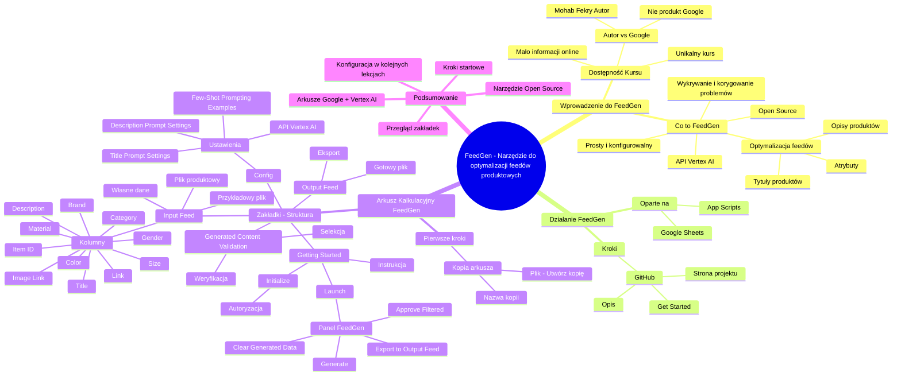

# Lekcje wideo - 5. Omówienie feedgen

# 💡 Diagram

___

# 🗒️ Notatka

# Szczegółowe Notatki i Podsumowanie Lekcji o FeedGen

## Wprowadzenie do FeedGen

Ta lekcja stanowi wprowadzenie do **FeedGen**, czyli narzędzia Open Source, które wspiera optymalizację plików produktowych (feedów) dla reklam produktowych. Krzysztof Modrzewski przedstawia FeedGen jako rozwiązanie problemów związanych z elastycznym zarządzaniem atrybutami plików produktowych, które mogą występować w innych narzędziach.

## Co to jest FeedGen?

- **Narzędzie Open Source 💻:** Dostępne publicznie, co oznacza, że każdy może wnieść swój wkład i uczestniczyć w jego rozwoju.
- **Oparte na API Vertex AI 🤖:** Wykorzystuje API Vertex AI z Google Cloud Platform.
- **Cel 🎯:** Ulepszanie plików produktowych poprzez:
    - Optymalizację tytułów produktów.
    - Generowanie bardziej szczegółowych opisów.
    - Uzupełnianie brakujących atrybutów.
- **Zadanie FeedGen:** Wykrywanie i korygowanie problemów z jakością feedów za pomocą sztucznej inteligencji (AI).
- **Prostota i Konfigurowalność ✨:** Narzędzie zostało zaprojektowane tak, aby było proste w obsłudze i jednocześnie wysoce konfigurowalne.

> \"**FeedGen** pomaga reklamodawcom identyfikować i rozwiązywać problemy z jakością feedów, wykorzystując sztuczną inteligencję w sposób prosty i konfigurowalny.\"

## Dostępność i Unikalność Kursu

- **Ograniczona dostępność informacji w Internecie 🌐:**  Istnieje niewiele materiałów dostępnych online na temat FeedGen.
- **Unikalny Kurs 🌟:** Ten kurs jest wyjątkową okazją do dogłębnego poznania FeedGen, ze względu na bardzo ograniczoną ilość dostępnych materiałów, nawet w języku angielskim.
- **Autor vs. Google 🏢:**  Autorem FeedGen jest Mohab Fekry z Google, jednak **nie jest to oficjalny produkt Google** – warto to podkreślić.

> \"Mimo, że autorem FeedGen jest Mohab Fekry, [...] pracujący w Google, to należy podkreślić, że **nie jest to oficjalny produkt firmy Google**.\"

## Jak Działa FeedGen?

- **Arkusz Kalkulacyjny Google (Google Sheets) i App Scripts ⚙️:** FeedGen funkcjonuje w oparciu o arkusze kalkulacyjne Google, wykorzystując App Scripts.
- **Krok 1: Strona GitHub 🐙:** Pierwszym krokiem jest odwiedzenie strony projektu FeedGen na GitHubie: `github.com/google-marketing-solutions/feedgen`. Link znajduje się również w materiałach do lekcji.
- **Opis na GitHubie 📝:** Na stronie GitHub dostępny jest szczegółowy opis projektu FeedGen.
- **Sekcja \"Get Started\" 🚀:**  Znajdują się tam instrukcje, jak rozpocząć korzystanie z FeedGen.

## Pierwsze Kroki z FeedGen - Arkusz Kalkulacyjny Google

- **Krok 2: Utworzenie Kopii Arkusza Kalkulacyjnego 📄:**
    - W sekcji \"Get Started\" na stronie GitHub znajduje się odnośnik do arkusza kalkulacyjnego.
    - Należy kliknąć ten link i utworzyć kopię arkusza, wybierając opcję: Plik -> Utwórz kopię.
    - Zaleca się nazwanie kopii, na przykład \"FeedGen-kurs-AI\".
    - Oryginalny plik ma charakter tylko do odczytu, natomiast kopia jest przeznaczona do pracy.

> \"Klikamy zatem ten link, co otworzy arkusz kalkulacyjny. Pierwszym krokiem jest wybranie opcji 'Utwórz kopię'. W tym celu należy kliknąć 'Plik' w lewym górnym rogu, a następnie 'Utwórz kopię', aby uzyskać własną, edytowalną wersję pliku.\"

## Zakładki Arkusza Kalkulacyjnego FeedGen

- **Pięć Zakładek 𗁧:** Arkusz kalkulacyjny FeedGen składa się z pięciu zakładek, domyślnie w języku angielskim.
- **Zakładki i ich Funkcje 🗂️:**
    - **Getting Started:** (Ostatnia zakładka po lewej stronie)
        - Zawiera szczegółową instrukcję obsługi FeedGen.
        - Przycisk **Initialize** - służy do uruchomienia FeedGen w arkuszu.
        - Wymaga autoryzacji skryptu (konieczność udzielenia zgody na uruchomienie skryptu i dostęp do konta Google).
        - Uruchamia panel FeedGen po prawej stronie arkusza (przycisk **Launch** w panelu).
        - Panel FeedGen umożliwia:
            - Generowanie ulepszonego pliku produktowego (**Generate**).
            - Akceptację proponowanych zmian (**Approve Filtered**).
            - Eksport gotowego pliku (**Export to Output Feed**).
            - Czyszczenie wygenerowanych danych (**Clear Generated Data**).
    - **Input Feed:** (Druga zakładka)
        - Miejsce na aktualny plik produktowy, który ma zostać zoptymalizowany.
        - Zawiera przykładowy plik produktowy dla branży modowej (odzież).
        - Kolumny przykładowego pliku: `Item ID`, `Title`, `Description`, `Brand`, `Gender`, `Category`, `Size`, `Color`, `Material`, `Link`, `Image Link`.
        - Umożliwia wgranie własnych danych.
    - **Config:** (Trzecia zakładka)
        - Zakładka ustawień FeedGen.
        - Ustawienia API Vertex AI.
        - Konfiguracja parametrów i promptów dla generowania opisów (`Description Prompt Settings / Model Parameters`).
        - Konfiguracja parametrów i promptów dla generowania tytułów (`Title Prompt Settings / Model Parameters`).
        - Przykłady dobrze zoptymalizowanych produktów (`Few-Shot Prompting Examples`).
        - Ustawienia konfigurowane szczegółowo w kolejnej lekcji.
    - **Generated Content Validation:** (Czwarta zakładka)
        - Prezentuje wygenerowane opisy i tytuły.
        - Umożliwia weryfikację i selekcję produktów, które zostały poprawnie poprawione i mają zostać wyeksportowane.
        - Szczegóły zostaną omówione w kolejnych lekcjach.
    - **Output Feed:** (Pierwsza zakładka po lewej stronie)
        - Zawiera gotowy, ulepszony plik produktowy.
        - Plik przygotowany do wgrania do systemu zarządzania plikami produktowymi.

## Podsumowanie

Lekcja wprowadziła **FeedGen** jako narzędzie Open Source do optymalizacji plików produktowych, działające w oparciu o Arkusze Google i API Vertex AI. Omówiono kroki niezbędne do rozpoczęcia pracy z FeedGen, w tym utworzenie kopii arkusza kalkulacyjnego z GitHub i uruchomienie panelu FeedGen. Przedstawiono również przegląd zakładek arkusza i ich funkcji: **Getting Started**, **Input Feed**, **Config**, **Generated Content Validation**, oraz **Output Feed**. Kolejne lekcje skupią się na konfiguracji i szczegółowym wykorzystaniu poszczególnych funkcji FeedGen.

___

# 🔉 Transcript
File: Lekcje wideo - 5. Omówienie feedgen.mp4 
[00:00:05] Krzysztof Modrzewski: Cześć.
[00:00:06] Krzysztof Modrzewski: Miło mi powitać cię w kolejnej lekcji.
[00:00:08] Krzysztof Modrzewski: Do tej pory dowiedziałeś, dowiedziałaś się już jak działa reklama produktowa i co należy optymalizować w pliku produktowym, aby osiągać lepsze efekty marketingowe.
[00:00:17] Krzysztof Modrzewski: Pomyślałem się też, że twoje narzędzie do generowania plików produktowych, nazwanych też po angielsku feedami, co od tej pory będę wykorzystywał zamiennie, nie pozwala na takie swobodne zarządzanie atrybutami.
[00:00:28] Krzysztof Modrzewski: Dlatego tym bardziej cieszę się, że mogę pokazać ci narzędzie FeedGen, które powinno być dobrym rozwiązaniem tego problemu.
[00:00:36] Krzysztof Modrzewski: Zacznijmy jednak od początku.
[00:00:37] Krzysztof Modrzewski: Co to jest FeedGen?
[00:00:39] Krzysztof Modrzewski: Jak możemy przeczytać na stronie projektu, FeedGen to narzędzie Open Source, czyli takie, które jest publicznie dostępne i do którego każdy może kontrybuować, rozwijając je i udostępniając dalej.
[00:00:49] Krzysztof Modrzewski: FeedGen opiera się na API Vertex AI dostępnym w Google Cloud Platform i uwaga, służy do ulepszania tytułów produktów, generowania bardziej szczegółowych opisów oraz uzupełniania brakujących atrybutów w plikach produktowych.
[00:01:01] Krzysztof Modrzewski: Czyli to, czego potrzebujemy.
[00:01:03] Krzysztof Modrzewski: Można powiedzieć, że FeedGen pomaga reklamodawcom wykrywać i naprawiać problemy z jakością feedów za pomocą sztucznej inteligencji w prosty i konfigurowalny sposób.
[00:01:12] Krzysztof Modrzewski: Brzmi zachęcająco, prawda?
[00:01:14] Krzysztof Modrzewski: Ale czy jest to trudne?
[00:01:16] Krzysztof Modrzewski: Jeżeli zrozumiesz mechanizm działania i konfiguracji, to nie, ale ostrzegam, na pierwszy rzut oka może to niektórych przerazić.
[00:01:24] Krzysztof Modrzewski: Ale spokojnie, spokojnie.
[00:01:25] Krzysztof Modrzewski: Wszystko po kolei ci wytłumaczę, więc nie ma się czego bać.
[00:01:28] Krzysztof Modrzewski: Zwrócę jednak uwagę, że w całym internecie nie ma zbyt wielu informacji na ten temat.
[00:01:33] Krzysztof Modrzewski: Nawet jak wpiszemy FeedGen Google, wyszukiwarce YouTube, to wyskakuje tylko jeden materiał po angielsku, więc ten kurs jest unikalną możliwością dokładnego poznania tego bardzo interesującego rozwiązania.
[00:01:45] Krzysztof Modrzewski: Jeszcze muszę zwrócić uwagę na jedną rzecz.
[00:01:47] Krzysztof Modrzewski: Mimo, że autorem FeedGenu jest Mohab Fekry, mam nadzieję, że tutaj nic się nic nie pomyliłem, który pracuje w Google, to jednak nie jest, podkreślam, nie jest to oficjalny produkt firmy Google.
[00:02:00] Krzysztof Modrzewski: No dobra, bo chyba trochę zaczynam przynudzać, więc przejdźmy do rzeczy.
[00:02:03] Krzysztof Modrzewski: FeedGen jako narzędzie działa w arkuszach kalkulacyjnych Google na bazie App Scriptów.
[00:02:09] Krzysztof Modrzewski: I żeby móc z niego skorzystać, musimy najpierw wejść na stronę projektu na GitHubie.
[00:02:15] Krzysztof Modrzewski: To co?
[00:02:16] Krzysztof Modrzewski: Przejdźmy w takim razie do komputera.
[00:02:18] Screen: (Przeglądarka internetowa wyświetla stronę github.com. Adres strony to google-marketing-solutions/feedgen. Na stronie widoczny jest kod źródłowy projektu FeedGen, w tym pliki takie jak bigquery, dbt, src, test, .gitignore, .editorconfig, .gitattributes, .prettierignore, .prettierrc.json, CONTRIBUTING.md, LICENSE, README.md, appsscript.json, prettier.config.js, license-header.txt, package.json, package-lock.json, rollup.config.js. Na stronie widoczny jest również opis projektu: FeedGen: Optimise Shopping feeds with Generative AI. W sekcji Languages widoczne są informacje o językach programowania użytych w projekcie: TypeScript 84.1%, HTML 11.8%, Shell 2.1%, JavaScript 2.0%.)
[00:02:18] Krzysztof Modrzewski: Jak wejdziemy na stronę github.com/google-marketing-solutions/feedgen, link oczywiście znajdziesz w materiałach do tej lekcji, to to jest strona projektu właśnie stworzona przez Mohaba Fekrego i tutaj niżej jak zejdziemy to mamy opis naszego FeedGenu.
[00:02:36] Krzysztof Modrzewski: Oczywiście aktualizację i to co nas powinno najbardziej interesować, to jak zejdziemy niżej, mamy taką sekcję Get Started, czyli zaczynamy i pierwszy punkt, którym powinieneś się zająć, to stworzenie kopii arkusza kalkulacyjnego, do którego mamy tutaj link.
[00:02:53] Krzysztof Modrzewski: Klikamy więc sobie ten link i otwiera nam się właśnie arkusz kalkulacyjny, gdzie pierwszym tutaj elementem, który musimy zrobić to Make a copy of this spreadsheet, czyli musimy kliknąć w plik tutaj na górze po lewej stronie i utwórz kopię, żeby mieć swoją własną kopię, kopię tego pliku.
[00:03:14] Screen: (Pojawia się okno dialogowe "Kopiowanie dokumentu". W polu "Nazwa" widoczny jest tekst "Kopia: [EXTERNAL] FeedGen - Template Sheet - 20240807". Poniżej znajduje się informacja "Załączony plik App Script: FeedGen. Plik App Script sprawdzono i przypisano do tego dokumentu. Zapoznaj się z kodem. Rozpoznajesz ten skrypt?". Na dole okna znajdują się przyciski "Anuluj" i "Utwórz kopię".)
[00:03:14] Krzysztof Modrzewski: Nazywamy oczywiście ten ten plik FeedGen, nazwiemy go kurs AI i klikam utwórz kopię.
[00:03:26] Krzysztof Modrzewski: Tworzy mi się teraz moja kopia tego pliku, na które już będę mógł pracować, ponieważ ten oryginalny plik ma opcję tylko do wyświetlenia i tutaj nic już nie mogę w tym pliku zmienić.
[00:03:39] Screen: (Wyświetla się arkusz kalkulacyjny Google Sheets o nazwie "FeedGen-kurs-AI". Arkusz zawiera dane w wielu kolumnach, w tym Item ID, Title, Description, Brand, Gender, Category, Size, Color, Material, Link, Image Link. Dane są przykładami produktów odzieżowych i akcesoriów. W dolnej części arkusza widoczne są zakładki: Output Feed, Input Feed, Config, Generated Content Validation, Getting Started.)
[00:03:39] Krzysztof Modrzewski: Okej.
[00:03:40] Krzysztof Modrzewski: Jak możesz zobaczyć, na dole mamy pięć arkuszy i generalnie wszystko jest tutaj po angielsku, ale spokojnie, poradzimy sobie z tym, również z tym, że jest to po angielsku, ale najpierw opowiem ci co tutaj mamy.
[00:03:53] Krzysztof Modrzewski: Pierwsza zakładka, od której powinniśmy zacząć, a zarazem ostatnia z tych tutaj, które są, to Getting Started, gdzie mamy właśnie dokładną instrukcję z tego co i jak powinniśmy wykonać, żeby skorzystać z FeedGenu.
[00:04:07] Krzysztof Modrzewski: Oczywiście ty tego wszystkiego dowiesz się podczas trwania tego kursu, więc tutaj za bardzo nie powinno nas to interesować co tu jest napisane.
[00:04:16] Screen: (Zakładka "Getting Started" w arkuszu kalkulacyjnym Google Sheets. Zawiera instrukcje "How to use this spreadsheet", w tym "Make a copy of the Input Feed worksheet". Na dole znajduje się przycisk "Initialize".)
[00:04:16] Krzysztof Modrzewski: W wolnej chwili możesz to sobie przeczytać, ale to co jest dla nas najistotniejsze, to kliknięcie w przycisk Initialize, czyli uruchomienia FeedGenu tutaj w tym spritsheetcie.
[00:04:27] Krzysztof Modrzewski: Klikamy Initialize.
[00:04:29] Screen: (Pojawia się okno dialogowe "Wymagana autoryzacja. Skrypt do tego dokumentu wymaga Twojego zezwolenia na uruchomienie". Na dole okna znajdują się przyciski "Anuluj" i "OK".)
[00:04:29] Krzysztof Modrzewski: Pojawia nam się okno wymogu autoryzacji.
[00:04:32] Krzysztof Modrzewski: Klikamy w tym oknie okej.
[00:04:34] Screen: (Pojawia się okno dialogowe z prośbą o wybranie konta Google do autoryzacji.)
[00:04:34] Krzysztof Modrzewski: Pojawia nam się opcję logowania do naszego konta.
[00:04:38] Krzysztof Modrzewski: Wybieramy nasze konto i później robimy zezwól na to, żeby FeedGen mógł uruchomić się tutaj w tym arkuszu kalkulacyjnym.
[00:05:00] Screen: (Po prawej stronie arkusza kalkulacyjnego pojawia się panel boczny "FeedGen". Zawiera informacje "Optimise Shopping Ads feeds with Generative AI", "Ready" oraz przyciski "Generate", "Approve Filtered", "Export to Output Feed", "Clear Generated Data".)
[00:05:00] Krzysztof Modrzewski: Teraz klikając w tą opcję FeedGen, możemy kliknąć Launch, czyli uruchom i po kliknięciu tego następuje wykonanie skryptu i po prawej stronie pojawia mi się nowy panel właśnie do zarządzania FeedGenem.
[00:05:13] Krzysztof Modrzewski: Ten panel służy do wygenerowania naszego nowego ulepszonego pliku produktowego, do zaakceptowania zmian, które ten plik wprowadził, do wyeksportowania właśnie takiego już gotowego pliku produktowego i do wyczyszczenia wygenerowanych danych.
[00:05:30] Krzysztof Modrzewski: To była zakładka Getting Started i tutaj już więcej nas nie interesuje.
[00:05:35] Krzysztof Modrzewski: Przejdźmy zatem dalej.
[00:05:37] Krzysztof Modrzewski: Jeżeli chodzi o drugą interesującą zakładkę, to mamy tutaj zakładkę Input Feed.
[00:05:42] Krzysztof Modrzewski: To jest nasz aktualny plik produktowy, który chcielibyśmy poprawić.
[00:05:47] Krzysztof Modrzewski: Jak widzisz, jest to wdrożony przykładowy plik produktowy zawierający no dość dużo tutaj 1000 produktów i mamy takie tutaj tytuły jak Item ID, tytuł, czyli nazwa naszego produktu, opis, markę, czyli brand.
[00:06:01] Krzysztof Modrzewski: To jest plik produktowy przygotowany dla ubrań dla branży Fashion, więc mamy również płeć, kategorię, rozmiar, kolor i materiał.
[06:06:13] Krzysztof Modrzewski: Dodatkowo jest jeszcze opcja dodania linku do strony produktu i linku do zdjęcia.
[00:06:19] Krzysztof Modrzewski: W tym przypadku nie za bardzo nas to interesuje, więc wgramy tutaj nasze własne przykłady, ale zanim do tego przejdziemy, zanim wyczyścimy sobie ten plik, przejdźmy do następnych arkuszy i zobaczmy co jeszcze tutaj mamy.
[00:06:34] Screen: (Wyświetla się zakładka "Config" w arkuszu kalkulacyjnym Google Sheets. Zawiera ustawienia Feed Settings, Vertex AI API Settings, Description Prompt Settings / Model Parameters, Title Prompt Settings / Model Parameters, a także przykłady "Few-Shot Prompting Examples".)
[00:06:34] Krzysztof Modrzewski: Mamy zakładkę Config, w której mamy informacje po kolei o tym co i jak powinno być ustawione, żeby nasz FeedGen zadziałał tak jakbyśmy chcieli.
[00:06:45] Krzysztof Modrzewski: Mamy tutaj kilka sekcji.
[00:06:47] Krzysztof Modrzewski: Mamy ustawienia FeedGenu, mamy ustawienia AI, z którego będziemy korzystać, czyli Vertexa, mamy ustawienie odpowiednich parametrów, mamy ustawienie również promptów.
[00:07:00] Krzysztof Modrzewski: Mamy kilka ustawień zaawansowanych oraz takie przykłady dobrych plików czy dobrych produktów, dobrze opisanych.
[00:07:05] Krzysztof Modrzewski: To wszystko będziemy sobie ustawiać w następnej lekcji.
[00:07:09] Krzysztof Modrzewski: Kolejną zakładką jest zakładka Generated Content Validation, gdzie możemy zobaczyć wygenerowane na nowo i stworzone właśnie opisy do naszych produktów przez system, w zależności od tego co ustawimy sobie w zakładce Config i tutaj zaznaczamy, które produkty zostały dobrze skonfigurowane, dobrze poprawione, które chcemy eksportować i po tym jak tutaj już wybierzemy te produkty, co dokładnie tutaj wszystko sobie omówimy w następnych lekcjach, mamy zakładkę Output Feed, czyli już gotowy plik produktowy, który możemy wgrać do naszego systemu do zarządzania plikami produktowymi.
[00:08:07] Krzysztof Modrzewski: To co?
[00:08:08] Krzysztof Modrzewski: Mam nadzieję, że to co ci się tutaj spodobało, że wszystko jest zrozumiałe, że masz już swoją kopię pliku FeedGen i możemy z tego korzystać.

___
# 🏷️ Tags
#FeedGen #open_source #API #Vertex_AI #Google_Cloud_Platform #optymalizacja_plików_produktowych #pliki_produktowe #feed #atrybuty_produktowe #tytuły_produktów #opisy_produktów #jakość_feedów #sztuczna_inteligencja #AI #konfigurowalność #dostępność_informacji #kurs #Mohab_Fekry #Google #produkt_Google #arkusz_kalkulacyjny_Google #Google_Sheets #App_Scripts #GitHub #Get_Started #utworzenie_kopii #zakładki_arkusza #Getting_Started #Initialize #autoryzacja_skryptu #panel_FeedGen #Generate #Approve_Filtered #Export_to_Output_Feed #Clear_Generated_Data #Input_Feed #plik_produktowy #branża_modowa #Config #Description_Prompt_Settings #Model_Parameters #Title_Prompt_Settings #Few-Shot_Prompting_Examples #Generated_Content_Validation #Output_Feed #system_zarządzania_plikami_produktowymi #lekcja #szczegółowe_notatki #podsumowanie_lekcji #Krzysztof_Modrzewski #reklama_produktowa #efekty_marketingowe
