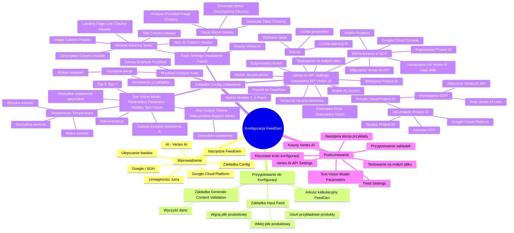

# Lekcje wideo - 6. Konfiguracja feedgen

# 💡 Diagram

___

# 🗒️ Notatka

# Notatki i Podsumowanie Konfiguracji Narzędzia FeedGen ⚙️

## Wprowadzenie

Niniejsze notatki dotyczą konfiguracji narzędzia **FeedGen**. Jest to narzędzie służące do ulepszania plików produktowych (feedów) z wykorzystaniem sztucznej inteligencji (AI), a konkretnie **Vertex AI** na platformie **Google Cloud Platform**. To wideo jest częścią serii "Umiejętności Jutra", organizowanej przez Google i SGH. Prezentujący omawia zakładkę `Config` w arkuszu kalkulacyjnym FeedGen, wyjaśniając, jak skonfigurować narzędzie, aby działało zgodnie z oczekiwaniami użytkownika.

## Przygotowanie do Konfiguracji FeedGen

Przed rozpoczęciem konfiguracji narzędzia **FeedGen**, upewnij się, że masz przygotowane następujące elementy:

* **Arkusz kalkulacyjny FeedGen - kurs AI:** Otwórz arkusz kalkulacyjny FeedGen.
* **Zakładka Input Feed:** Wgraj plik produktowy do zakładki `Input Feed`.
    * **Usuwanie przykładowych produktów:** Usuń domyślne produkty z zakładki `Input Feed`.
    * **Wklejenie pliku produktowego:** Skopiuj i wklej swój plik produktowy. Przykładowy plik produktowy jest dostępny do pobrania (link w opisie wideo).
* **Zakładka Generate Content Validation:** Wyczyść wygenerowane produkty w zakładce `Generate Content Validation` za pomocą przycisku "Clear Generate Data".
    * Przygotuj zakładki `Input Feed` i `Generate Content Validation` przed przejściem do zakładki `Config`.

## Zakładka Config - Ustawienia FeedGen

Zakładka `Config` umożliwia dostosowanie ustawień **FeedGen** do Twoich potrzeb. Poniżej znajdziesz szczegółowy opis dostępnych opcji.

### Feed Settings (Ustawienia Feedu)

W sekcji **Feed Settings** definiuje się główne kolumny feedu, z których **FeedGen** będzie korzystał. Upewnij się, że nazwy kolumn odpowiadają nagłówkom w zakładce `Input Feed`.

* **Główne kolumny feedu:**
    * **Item ID Column Header:** Nazwa kolumny z ID produktu (domyślnie `Item ID`).
    * **Title Column Header:** Nazwa kolumny z tytułem produktu (domyślnie `Title`).
    * **Description Column Header:** Nazwa kolumny z opisem produktu (domyślnie `Description`).
    * **Landing Page Link Column Header:** Nazwa kolumny z linkiem do produktu (domyślnie `Landing Page Link`).
    * **Image Column Header:** Nazwa kolumny z linkiem do zdjęcia produktu (domyślnie `Image`).
    * **Ważne:** Nazwy kolumn muszą dokładnie odpowiadać nagłówkom w zakładce `Input Feed`.
* **Opcje Generowania:** Wybierz, które elementy feedu ma generować **FeedGen**.
    * **Generate Titles:** Generowanie tytułów produktów (domyślnie zaznaczone - **Chcemy**).
    * **Generate Better Descriptions:** Generowanie ulepszonych opisów produktów (domyślnie zaznaczone - **Chcemy**).
    * **Analyze Provided Image:** Analiza dostarczonych zdjęć produktów (domyślnie zaznaczone - **Chcemy**).
    * **Uwaga:** Analiza zdjęć wpływa na koszty korzystania z **Vertex AI**.

### Vertex AI API Settings (Ustawienia API Vertex AI)

Sekcja **Vertex AI API Settings** służy do konfiguracji połączenia z **Vertex AI** w **Google Cloud Platform**. Pamiętaj, że korzystanie z **Vertex AI** wiąże się z opłatami.

* **Vertex AI nie jest darmowy:** **FeedGen** jest narzędziem Open Source i darmowym, ale wykorzystuje **Vertex AI** w **Google Cloud Platform**, co generuje koszty.
* **Koszty:** Wysokość kosztów zależy od liczby operacji AI, np. liczby produktów i wybranych opcji generowania (tytuły, opisy, zdjęcia).
* **Estimated Price (Szacowany Koszt):**  Szacowany koszt wygenerowania feedu jest wyświetlany w polu `Estimated Price`.
    * **Testowanie na małym pliku:** Zaleca się rozpoczęcie testów na małym pliku produktowym, aby zweryfikować poprawność konfiguracji i uniknąć niepotrzebnych kosztów.
* **Ustawienia Vertex AI API:**
    * **Google Cloud Project ID:** Wprowadź `Project ID` projektu **Google Cloud Platform**, z którego będą pobierane środki na **Vertex AI**.
        * **Jak znaleźć Project ID:**
            1. Zaloguj się do **Google Cloud Platform** (cloud.google.com).
            2. Przejdź do konsoli.
            3. Skopiuj `Project ID` ze strony głównej projektu.
        * **Wymagania Google Cloud Platform (punkt 5 w "Getting Started"):** Przed konfiguracją upewnij się, że w Twoim projekcie Google Cloud:
            1. **Włączone Vertex AI API:**  API **Vertex AI** jest aktywne.
            2. **Rola Vertex AI User:** Użytkownik **FeedGen** ma przypisaną rolę **Vertex AI User**.
    * **Demonstracja w Google Cloud Platform:** Poniżej kroki, jak skonfigurować **Vertex AI API** w **Google Cloud Platform**:
        1. **Przejdź do Google Cloud Console:** Otwórz cloud.google.com, zaloguj się i przejdź do konsoli.
        2. **Wybór Projektu:** Wybierz właściwy projekt **Google Cloud**.
        3. **Kopiowanie Project ID:** Skopiuj `Project ID` ze strony głównej.
        4. **Włączanie Vertex AI API:** Wyszukaj "Vertex AI" w wyszukiwarce **Google Cloud** i przejdź do strony **Vertex AI**. Jeśli API nie jest włączone, kliknij "Enable Vertex AI API". Jeśli jest włączone, zobaczysz listę API.
        5. **Nadawanie roli Vertex AI User (IAM):** Wyszukaj "IAM" w wyszukiwarce **Google Cloud** i przejdź do `IAM & Admin`.
            * **Przyznaj dostęp:** Kliknij "Przyznaj dostęp".
            * **Nowe podmioty zabezpieczeń:** Wpisz adres e-mail użytkownika.
            * **Wybór roli:** Wybierz rolę "Użytkownik Vertex AI" (polska wersja) lub "Vertex AI User" (angielska wersja).
            * **Zapisz:** Zapisz ustawienia.
    * **Powrót do FeedGen:** Po konfiguracji w **Google Cloud**, wróć do arkusza FeedGen.
    * **Wklejenie Project ID:** Wklej skopiowany `Project ID` do pola `Google Cloud Project ID` w FeedGen.
    * **Wybór AI:** Wybierz "Gemini" jako silnik AI.
    * **Wybór Modelu:** Wybierz model **Vertex AI** (np. "1.5 Flash", nowszy model 2.0 może być dostępny w przyszłości).
    * **Wybór Języka:** Wybierz język generowanego feedu (np. "polski").
    * **Estymowany Koszt:** Sprawdź ponownie pole `Estimated Price`.

### Text Vision Model Parameters (Parametry Modelu Text Vision)

Sekcja **Text Vision Model Parameters** zawiera zaawansowane ustawienia AI, które kontrolują sposób generowania tekstu. Parametry te wpływają na kreatywność, długość i losowość odpowiedzi.

* **Zaawansowane ustawienia AI:**
    * **Temperature:** Temperatura reguluje losowość i kreatywność generowanych odpowiedzi.
        * **Niska wartość (bliska 0):** Odpowiedzi stają się mniej kreatywne i bardziej deterministyczne.
        * **Wysoka wartość (bliska 1):** Odpowiedzi są bardziej zróżnicowane i kreatywne.
        * **Wartość domyślna:** Umiarkowana kreatywność.
    * **Max Output Tokens:** Maksymalna długość generowanego tekstu (w tokenach).
        * **Rekomendacja:** Na początek zaleca się pozostawienie domyślnych ustawień.
    * **Top K, Top P:** Dodatkowe parametry regulujące losowość.
    * **Dokumentacja:** Szczegółowe informacje o opcjach można znaleźć w dokumentacji.
    * **Domyślne ustawienia:** Domyślne parametry są optymalne na start i generują dobre wyniki.

### Przykład i Dalsze Kroki

* **Sekcja "Example":** Ustawienia przykładu, na podstawie którego **FeedGen** ma działać (omówione w kolejnej lekcji).
* **Następna lekcja:** Szczegółowe omówienie przykładów i wpływu poszczególnych ustawień na działanie **FeedGen**.

## Podsumowanie

Ten materiał instruktażowy prezentuje konfigurację zakładki `Config` narzędzia **FeedGen**. Kluczowe kroki to: przygotowanie zakładek `Input Feed` i `Generate Content Validation`, ustawienie **Feed Settings** definiujących nazwy kolumn i opcje generowania (tytuły, opisy, zdjęcia), konfiguracja **Vertex AI API Settings** poprzez podanie `Project ID` z **Google Cloud Platform**, włączenie **Vertex AI API** i nadanie roli **Vertex AI User**, oraz omówienie parametrów modelu **Text Vision** wpływających na generowanie tekstu. Podkreślono wagę testowania na małym pliku produktowym oraz fakt, że korzystanie z **Vertex AI** generuje koszty, mimo że samo narzędzie **FeedGen** jest bezpłatne. Kolejna lekcja skupi się na ustawieniach przykładów i ich wpływie na działanie **FeedGen**.

___

# 🔉 Transcript
File: Lekcje wideo - 6. Konfiguracja feedgen.mp4 
[00:00:00] Ekran: Białe tło.
[00:00:01] Ekran: Na białym tle pojawia się napis "Umiejętności Jutra" a następnie pojawia się logo "AI". Pod spodem napis "Organizator Google" oraz "Partner edukacyjny SGH".
[00:00:05] Ekran: Mężczyzna siedzi przy biurku, za nim regał z książkami. Na biurku stoi laptop.
[00:00:05] Mężczyzna: Mam nadzieję, że masz już swój arkusz kalkulacyjny do urządzenia FeedGenem, że panel po prawej stronie ci zadziałał, udało się go uruchomić i możemy teraz przejść do omówienia zakładki Config w celu ustawienia FeedGen tak, żeby działał tak jakbyśmy chcieli.
[00:00:23] Ekran: Arkusz kalkulacyjny FeedGen - kurs AI.
[00:00:23] Mężczyzna: Zanim jednak przejdziemy do omówienia tych wszystkich tutaj poszczególnych ustawień, które są, musimy wgrać nasz plik produktowy, nasze produkty, na których będziemy tutaj bazować.
[00:00:34] Mężczyzna: I to robimy w zakładce Input Feed.
[00:00:35] Ekran: Zakładka Input Feed.
[00:00:36] Mężczyzna: W tym momencie możemy sobie te wszystkie produkty, które tutaj są usunąć, więc zaznaczam wszystkie, robię delete, czyli usuwam i chcę skopiować tutaj właśnie mój przykładowy plik produktowy.
[00:00:48] Mężczyzna: Przygotowałem taki nieduży wkład, do którego oczywiście link też zamieszczę w opisie, jeżeli będziesz chciała, chciał się pobawić na moim przykładzie.
[00:00:57] Mężczyzna: Kopiuję więc te wszystkie produkty, które tutaj są i po prostu wklejam je w zakładce Input Feed.
[00:01:04] Mężczyzna: Następnie chciałbym wyczyścić tutaj wygenerowane produkty, dlatego po prawej stronie w panelu klikam przycisk czerwony Clear Generate Data i w tym momencie ten ta zakładka zostanie wyczyszczona.
[00:01:18] Mężczyzna: I będę mógł tutaj generować swoje opisy produktów.
[00:01:21] Mężczyzna: Czyli dwie zakładki mam już przygotowane: Input Feed i Generate Content Validation.
[00:01:26] Mężczyzna: To przejdźmy w takim razie do konfiguruj tego, co tutaj w tym configu nam się znajduje.
[00:01:32] Mężczyzna: Na samej górze mamy Feed Settings, czyli ustawienia naszego feedu, czyli tego inputu i tego co chcemy generować i tutaj po prostu podajemy systemowi jak nazywają się główne kolumny, z których ma korzystać.
[00:01:46] Mężczyzna: Czyli jak nazywa się kolumna Item ID, Item ID, kolumna Title, jaki ma header, czyli Title, jak nazywa się kolumna z opisem, Description.
[00:01:55] Mężczyzna: To wszystko widzimy tak jak tutaj w Input Feedzie jest, tak?
[00:01:57] Mężczyzna: Description, Title, Item ID.
[00:01:59] Mężczyzna: Kolejna rzecz, która jest to Landing Page Link kolumn i Image kolumn header.
[00:02:08] Mężczyzna: Czyli tutaj znajduje się link do produktu i link do zdjęcia, jeżeli byśmy takie podali.
[00:02:14] Mężczyzna: Następnie mamy tutaj trzy opcje do ustawienia.
[00:02:17] Mężczyzna: Czy chcemy, żeby wygenerował tytuły?
[00:02:19] Mężczyzna: Chcemy.
[00:02:19] Mężczyzna: Czy chcemy, żeby wygenerował lepsze opisy?
[00:02:21] Mężczyzna: Chcemy, jest to zaznaczone.
[00:02:23] Mężczyzna: Możemy to oczywiście odznaczyć, jeżeli nie będziemy chcieli tego i czy ma rozumieć, czy ma analizować dostarczone zdjęcie.
[00:02:31] Mężczyzna: Jeżeli tak, to chcemy, to również tą opcję tutaj zaznaczamy.
[00:02:34] Mężczyzna: I tak jak widzisz w inputcie, większość produktów nie ma dostarczonego zdjęcia.
[00:02:39] Mężczyzna: Dla przykładu jedno zdjęcie tutaj dostarczyłem, żeby pokazać jak to zadziała.
[00:02:44] Mężczyzna: Dlaczego tylko jedno?
[00:02:45] Mężczyzna: Bo oczywiście ma to wpływ na koszty korzystania z tego rozwiązania, bo uwaga FeedGen nie do końca jest darmowy, czy mogę powiedzieć w ogóle nie jest darmowym rozwiązaniem, ponieważ w tym momencie nie płacimy może za samo wykorzystanie narzędzia FeedGen, bo jest to narzędzie typu Open Source, jest to narzędzie darmowe.
[00:03:05] Mężczyzna: Jak widzisz, mogę je sobie skonfigurować i skopiować i uruchomić, ale płacę za wykorzystanie rozwiązania Vertex AI w moim Google Cloud Platform.
[00:03:16] Mężczyzna: I to ile zapłacę, będzie zależało oczywiście od kilku rzeczy, między innymi od tego jak wiele operacji ten system AI będzie musiał wykonać.
[00:03:26] Mężczyzna: I to taką estymowaną, estymowany koszt wygenerowania tego pliku produktowego mam podany tutaj w zakładce, w takim polu Estimated Price.
[00:03:38] Mężczyzna: W tym momencie przy takich produktach jest to zero, nic to nie będzie kosztować, więc tym się nie przejmuję, ale jak zobaczymy sobie na tym przykładowym szablonie, przejdziemy sobie do konfiguracji, to poprawa feeda zawierającego 1000 produktów.
[00:03:54] Mężczyzna: Widzę, że będzie kosztowała mnie 36 centów.
[00:03:57] Mężczyzna: Czy to dużo?
[00:03:58] Mężczyzna: Nie sądzę, więc można się tym pobawić, to jest dla 1000 produktów, ale uwaga, zanim przejdziemy do generowania już naszych feedów, dobrze jest przygotować sobie właśnie taki mały plik produktowy, taki podobny do tego co mam tutaj, sprawdzić czy to odpowiednio zadziałało i dopiero jak będziemy pewni, że na takim małym przykładzie, takim samplu wszystko będzie działało poprawnie, to dopiero później wgrać tutaj pełny swój plik produktowy, czy listę produktów, chcemy poprawić i wygenerować, po to, żeby po prostu kilkukrotnie nie ponosić kosztów generowania, jakby coś było nie tak i mielibyśmy zrobić to jeszcze raz.
[00:04:36] Mężczyzna: Okej, myślę, że to już jest jasne, więc możemy sobie przejść teraz do drugiej właśnie opcji, czyli pola Vertex AI API Settings, czyli ustawień.
[00:04:43] Mężczyzna: No i tutaj mamy kilka rzeczy, które trzeba ustawić.
[00:04:46] Mężczyzna: Przede wszystkim tutaj podajemy ID naszego projektu w Google Cloud Platform, na którym to ma się opierać, bo właśnie z tego projektu będzie brana brana informacja o wykorzystaniu Vertex AI.
[00:04:58] Mężczyzna: Żeby tutaj to znaleźć, muszę zalogować się na moje konto Google Cloud Platform.
[00:05:03] Mężczyzna: Oczywiście pobrać i skopiować ID mojego projektu, ale to nie tylko, ponieważ w zakładce Getting Started mam tutaj opisane w punkcie piątym, że musi być uruchomione Vertex AI API oraz uwaga, wszyscy użytkownicy, którzy korzystają z tego FeedGenu na tym moim projekcie, muszą mieć dostęp, który nazywa się Vertex AI User.
[00:05:29] Mężczyzna: Muszą mieć taką udostępnioną rolę.
[00:05:32] Mężczyzna: Jak to zrobić?
[00:05:33] Mężczyzna: Już pokazuję, więc możemy teraz przejść do Google Cloud Platform, gdzie właśnie to wszystko zademonstruję.
[00:05:40] Ekran: Strona Google Cloud.
[00:05:40] Mężczyzna: Okej, jak widzisz, jestem już na stronie cloud.google.com, jestem tutaj już zalogowany, więc mogę przejść do mojej konsoli, tutaj po prawej stronie na górze.
[00:05:50] Mężczyzna: Jeżeli nie masz jeszcze swojego projektu Google Cloud, to w materiałach jest link do kursów, w którym tłumaczymy czym jest Google Cloud i jak założyć swój własny projekt.
[00:05:58] Mężczyzna: W tym momencie zakładam, że już masz projekt, masz, więc możemy przejść do konsoli i po zalogowaniu się trafiamy właśnie na stronę projektu.
[00:06:07] Mężczyzna: Jeżeli masz kilka projektów, to musisz wybrać ten, który ma być wykorzystany do właśnie FeedGenu, z którego mają być pobierane środki do zużycia, jeżeli chodzi o wykorzystanie Vertex AI.
[00:06:18] Mężczyzna: Tutaj w Google Cloudzie mieliśmy do zrobienia trzy rzeczy: znaleźć i skopiować ID naszego projektu, włączyć Vertex AI API oraz nadać odpowiedni dostęp do użytkownika, który będzie korzystał z naszego arkusza kalkulacyjnego, z naszego FeedGenu.
[00:06:34] Mężczyzna: Pierwszą rzeczą, którą powinniśmy zrobić, to skopiować właśnie ID naszego projektu, jest to tutaj na stronie głównej naszego projektu, po prostu wystarczy to skopiuję i przekleję do odpowiedniego pola ustawień właśnie w arkuszu kalkulacyjnym.
[00:06:47] Mężczyzna: Druga rzecz to włączenie Vertex AI API, żeby to zrobić, korzystam z wyszukiwarki tutaj na górze i wpisuję Vertex AI.
[00:06:55] Mężczyzna: Nie warto korzystać gdzieś z panelu bocznego, szukać, to zajmie dużo więcej czasu, dużo lepiej i szybciej i zważnie skorzystanie z wyszukiwarki.
[00:07:02] Mężczyzna: Klikam więc Vertex AI i przechodzę na stronę Vertexa i w tym momencie, jeżeli do tej pory jeszcze nie włączyłeś, nie włączałaś Vertex AI API, to będziesz tutaj mieć taki duży niebieski przycisk Enable Vertex AI API.
[00:07:19] Mężczyzna: Ja już to mam zrobione, dlatego nie widzę tego przycisku, a widzę listę interfejsów dostępnych API.
[00:07:23] Mężczyzna: Być może przechodząc już inne kursy w ramach tego projektu, włączyłeś, włączałaś już Vertex AI, więc masz taki widok jak ja, jeżeli nie, to po prostu należy to włączyć.
[00:07:30] Mężczyzna: I trzecia rzecz to nadanie odpowiedniego dostępu, to robimy w panelu IAM i znowu wpisuję tutaj w wyszukiwarce i wchodzę w pierwszy wynik IAM and Admin.
[00:07:45] Mężczyzna: Tutaj mogę zarządzać rolami w projekcie.
[00:07:47] Mężczyzna: To co muszę zrobić, to dla użytkownika, który będzie korzystał właśnie z tego arkusza, nadać rolę użytkownik Vertex AI w wersji polskiej interfejsu lub Vertex AI User w wersji angielskiej.
[00:07:59] Mężczyzna: Żeby to zrobić, klikam przyznaj dostęp.
[00:08:01] Mężczyzna: Otwiera mi się tutaj panel nadania dostępu.
[00:08:03] Mężczyzna: W polu nowe podmioty zabezpieczeń wpisuję adres mailowy użytkownika, któremu chcę nadać dostęp.
[00:08:13] Mężczyzna: Wpisuję mój adres mailowy i wybieram odpowiednią rolę.
[00:08:15] Mężczyzna: Po polsku jest to użytkownik Vertex AI.
[00:08:21] Mężczyzna: Wybieram użytkownik Vertex AI i klikam zapisz.
[00:08:24] Mężczyzna: W tym momencie mi wyskoczyła informacja, że już taki użytkownik ma taki dostęp, jak widzisz jest już tutaj przyznany.
[00:08:30] Mężczyzna: U ciebie powinno się to właśnie na samym dole pojawić.
[00:08:33] Mężczyzna: I to tyle, jeżeli chodzi o Google Cloud, możemy wrócić do naszego FeedGenu.
[00:08:38] Mężczyzna: Jesteśmy z powrotem w FeedGenie, więc kontynuujemy tutaj ustawienia.
[00:08:42] Mężczyzna: W polu Google Cloud Project ID wklejam właśnie ID mojego produktu.
[00:08:47] Mężczyzna: Następnie wybieram z jakiego AI chciałbym skorzystać.
[00:08:51] Mężczyzna: Oczywiście wybieramy Gemini.
[00:08:52] Mężczyzna: W kolejnym polu wybieram model, z którego chcę skorzystać.
[00:08:57] Mężczyzna: W tym momencie nie mam jeszcze dostępnego najnowszego modelu 2.0, więc korzystam z tego, który jest dostępny, czyli 1,5 Flash.
[00:09:03] Mężczyzna: Wybieram język, w którym ma być wygenerowany nasz feed, czyli w tym momencie nie angielski, a wybieram polski.
[00:09:10] Mężczyzna: Oczywiście wpisując tutaj inne języki, możemy poprawiać sobie feedy w innych językach.
[00:09:14] Mężczyzna: No i tutaj mam tą moje pole właśnie estymowanego kosztu.
[00:09:17] Mężczyzna: No to tyle, co z tych trudnych ustawień Vertexa.
[00:09:20] Mężczyzna: Idziemy dalej.
[00:09:20] Mężczyzna: Tu mamy z kolei całe takie pole do ustawień parametrów właśnie działania AI.
[00:09:27] Mężczyzna: I jak widzisz, mamy tutaj troszeczkę bardziej skomplikowane razem w cudzysłowiu, bo mamy jakąś temperaturę, Max Output Tokens, Top K, Top P i tak dalej i tak dalej.
[00:10:03] Mężczyzna: Więc teraz po prostu kilka słów na ten temat, o co tutaj właściwie chodzi.
[00:10:07] Mężczyzna: Te parametry, które tutaj widzisz, są parametry tak zwane modelu Text Vision i one pozwalają dostosować sposób generowania tekstu przez AI, kontrolując kreatywność tego modelu.
[00:10:20] Mężczyzna: Możemy w ten sposób kontrolować długość odpowiedzi czy losowość tego, jak ten model ma działać.
[00:10:26] Mężczyzna: I tak na przykład tym to pole temperature i Top P, Top K regulują stopień losowości różnorodności naszych odpowiedzi.
[00:10:31] Mężczyzna: I na przykład jeżeli chodzi o tą temperaturę, to niska wartość bliska zero powoduje, że te nasze odpowiedzi będą mniej kreatywne, bardziej deterministyczne.
[00:10:40] Mężczyzna: Wysoka wartość bliska jedynki albo jedynka to jest będą najbardziej zróżnicowane i kreatywne, a dom taka wartość w połowie, no to będzie oczywiście w połowie, tak?
[00:10:49] Mężczyzna: Z kolei Max Output Tokens oznacza długość wygenerowanego tekstu, który tutaj możemy w FeedGenie wygenerować, tak?
[00:10:53] Mężczyzna: Chodzi o ileś tokenów, tak na ten tekst, który można zrobić.
[00:10:56] Mężczyzna: I powiem tak, dobrze jest tego nie zmieniać.
[00:10:58] Mężczyzna: Oczywiście, jeżeli nabierzesz doświadczenia w wykorzystaniu FeedGenu, można tutaj z tym się pobawić, zmieniać temperaturę.
[00:11:03] Mężczyzna: Akurat Max Output Tokens tutaj bym nie zmieniał, zostawił tak jak jest.
[00:11:06] Mężczyzna: Można zmieniać dodatkowe opcje, jak się zagłębisz w dokumentację.
[00:11:11] Mężczyzna: Aczkolwiek ja bym na samym początku teraz to zostawił, bo to odpowiednie generuje dobre wyniki i generalnie nie musimy tu nic zmieniać, co jest akurat dobre.
[00:11:20] Mężczyzna: To co jednak nas interesuje, to ta sekcja, czyli odpowiednie ustawienie przykładu, na podstawie którego FeedGen ma zadziałać.
[00:11:30] Mężczyzna: I tutaj chciałem troszeczkę bardziej się w to zagłębić, więc przejdziemy sobie teraz do kolejnej lekcji, żeby już ten temat sobie zakończyć, gdzie omówiłem dokładnie właśnie te przykłady i na co wpływają poszczególne ustawienia.
[00:11:40] Ekran: Mężczyzna siedzi przy biurku, za nim regał z książkami. Na biurku stoi laptop.
[00:11:40] Ekran: Białe tło.
[00:11:40] Ekran: Na białym tle pojawia się napis "Umiejętności Jutra" a następnie pojawia się logo "AI". Pod spodem napis "Organizator Google" oraz "Partner edukacyjny SGH".

___
# 🏷️ Tags
#FeedGen #AI #Vertex_AI #Google_Cloud_Platform #arkusz_kalkulacyjny #Config #Input_Feed #Generate_Content_Validation #Feed_Settings #Item_ID_Column_Header #Title_Column_Header #Description_Column_Header #Landing_Page_Link_Column_Header #Image_Column_Header #Generate_Titles #Generate_Better_Descriptions #Analyze_Provided_Image #Vertex_AI_API_Settings #Google_Cloud_Project_ID #Vertex_AI_API #Vertex_AI_User #IAM #Gemini #Text_Vision_Model_Parameters #Temperature #Max_Output_Tokens #Top_K #Top_P #Estimated_Price #Open_Source #darmowe_narzędzie #koszty #plik_produktowy #ustawienia_feedu #generowanie_tekstu #kreatywność #losowość #język #polski #przykład #szablon #kurs_AI #SGH #Google #Umiejętności_Jutra #API #Project_ID #Google_Cloud