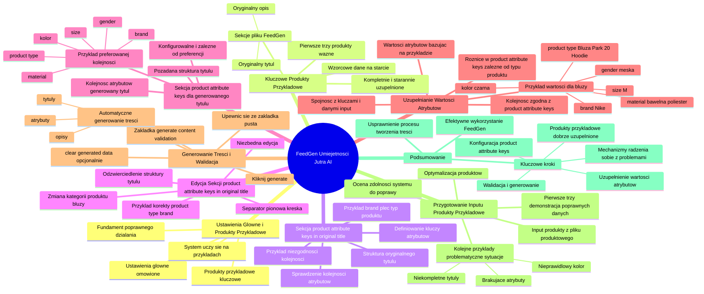

# Lekcje wideo - 7. Opracowanie przykładów

# 💡 Diagram

___

# 🗒️ Notatka

# Notatki i Podsumowanie FeedGen "Umiejętności Jutra AI" 🚀

## Wprowadzenie

Ten dokument zawiera szczegółowe notatki i podsumowanie dotyczące narzędzia `FeedGen`, opracowane w ramach inicjatywy "Umiejętności Jutra AI" organizowanej przez Google i SGH. Materiał skupia się na konfiguracji i praktycznym zastosowaniu `FeedGen` do generowania tytułów i opisów produktów. Szczególny nacisk położono na wykorzystanie **produktów przykładowych** i dostosowanie **ustawień atrybutów**.

## Ustawienia Główne i Rola Produktów Przykładowych

- Zakłada się, że **ustawienia główne** narzędzia `FeedGen` zostały już omówione wcześniej.
- Aktualny nacisk położony jest na **produktach przykładowych**, które mają kluczowe znaczenie dla efektywności systemu.
- System uczy się na podstawie dostarczonych przykładów, aby generować tytuły, opisy i dobierać atrybuty dla nowych produktów.
- Właściwie dobrane **produkty przykładowe** stanowią fundament poprawnego działania `FeedGen`.

## Kluczowe Znaczenie Dobrze Uzupełnionych Produktów Przykładowych ❗

- **Pierwsze trzy produkty** wprowadzone do systemu (w pliku wejściowym) są szczególnie istotne.
- Należy upewnić się, że te trzy produkty są **kompletnie i starannie uzupełnione**, zawierając wszystkie niezbędne informacje.
- Możliwe jest dodanie kolejnych wierszy z przykładami lub ręczna edycja pierwszych trzech produktów bezpośrednio w pliku `FeedGen`.
- Celem jest dostarczenie systemowi **wzorcowych danych** na starcie procesu uczenia.
- Plik `FeedGen` jest logicznie podzielony na sekcje, w tym na **oryginalny tytuł** i **oryginalny opis**.

## Sekcja: `product attribute keys in original title`

- Ta sekcja służy do zdefiniowania **kluczy atrybutów**, które strukturyzują **oryginalny tytuł produktu**.
- Przykład z materiału: `brand`, `płeć`, `typ produktu`.
- **Konieczne jest sprawdzenie**, czy kolejność atrybutów zdefiniowana w ustawieniach odzwierciedla kolejność w **rzeczywistym tytule produktu** w pliku wejściowym.
- W analizowanym przykładzie, w oryginalnym tytule `product type` (typ produktu) pojawia się na początku, podczas gdy `brand` (marka) na końcu, co **nie odpowiada** początkowemu ustawieniu (`brand`, `płeć`, `typ produktu`).

## Edycja Sekcji `product attribute keys in original title`

- Niezbędna jest **edycja** sekcji `product attribute keys in original title`, aby precyzyjnie odzwierciedlała **faktyczną strukturę tytułu produktu**.
- W omawianym przykładzie, ustawienie zostało skorygowane do: `product type | brand`.
- Jako separatora użyto **pionowej kreski** (`|`).
- Kategoria produktu w przykładzie została zmieniona z "active wear" na "bluzy", aby była zgodna z danymi wejściowymi.

## Sekcja: `product attribute keys` (dla generowanego tytułu)

- Ta sekcja definiuje **pożądaną strukturę tytułu**, który zostanie wygenerowany przez system.
- Użytkownik określa **kolejność atrybutów**, które mają zostać uwzględnione w **nowym, generowanym tytule**.
- Przykładowa, preferowana kolejność: `product type`, `brand`, `gender`, `kolor`, `size`, `material`.
- Kolejność i wybór atrybutów są **w pełni konfigurowalne** i zależą od indywidualnych preferencji użytkownika.

## Uzupełnianie Wartości Atrybutów

- Po zdefiniowaniu `product attribute keys`, należy wprowadzić **wartości atrybutów** bazując na **produkcie przykładowym**.
- Wprowadzane wartości muszą odpowiadać **kolejności atrybutów** zdefiniowanej w `product attribute keys`.
- Przykład wartości dla bluzy:
    - `product type`: Bluza Park 20 Hoodie (lub po prostu "bluza")
    - `brand`: Nike
    - `gender`: męska
    - `kolor`: czarna
    - `size`: M
    - `material`: bawełna, poliester
- Kluczowe jest, aby **wartości atrybutów** były spójne z **ustawionymi kluczami** i **danymi w pliku produktowym (input)**.
- Warto pamiętać, że `product attribute keys` mogą się **różnić** w zależności od typu produktu.

## Generowanie Treści i Walidacja ✅

- Po zakończeniu konfiguracji ustawień i przykładów, przechodzimy do zakładki **"generate content validation"**.
- Należy **upewnić się**, że zakładka jest pusta.
    - Jeśli zawiera dane, należy kliknąć **"clear generated data"**.
- Następnie aktywujemy proces generowania, klikając **"generate"**.
- System automatycznie wygeneruje **nowe tytuły, opisy i atrybuty** dla produktów, wykorzystując wprowadzone ustawienia i przykłady.

## Przygotowanie Inputu - Produkty Przykładowe

- **Input** (plik wejściowy) zawiera **produkty pobrane bezpośrednio z pliku produktowego**, które mają zostać zoptymalizowane.
- **Pierwsze trzy produkty** służą jako demonstracja, jak system powinien działać na **poprawnych i kompletnych danych**.
- **Kolejne przykłady** ilustrują różnorodne problematyczne sytuacje:
    - Produkty z **niekompletnymi tytułami** (np. brak nazwy marki).
    - Produkty z **brakującymi atrybutami** (np. brak marki, koloru, płci, materiału).
    - Produkt z **nieprawidłowym kolorem** (opisuje kolor "czarny", podczas gdy zdjęcie prezentuje kolor "zielony").
- Celem tych przykładów jest **ocena zdolności systemu do poprawy i uzupełniania brakujących lub błędnych danych**.

## Podsumowanie

Materiał instruuje, jak efektywnie wykorzystać narzędzie `FeedGen` do automatycznego generowania i optymalizacji tytułów oraz opisów produktów. Kluczowe kroki obejmują:

- **Prawidłową konfigurację `product attribute keys`** zarówno dla oryginalnych, jak i generowanych tytułów.
- **Dostarczenie dobrze uzupełnionych produktów przykładowych**, ze szczególnym uwzględnieniem pierwszych trzech pozycji z inputu.
- **Uzupełnienie wartości atrybutów** zgodnie z wcześniej zdefiniowanymi kluczami.
- **Walidację i generowanie treści** w zakładce "generate content validation".
- **Zrozumienie mechanizmów radzenia sobie systemu z różnymi problemami** w danych wejściowych, takimi jak braki informacyjne czy nieścisłości.

Poprzez właściwą konfigurację i dostarczenie odpowiednich przykładów, `FeedGen` może znacząco usprawnić proces tworzenia i optymalizacji treści produktowych.

___

# 🔉 Transcript
File: Lekcje wideo - 7. Opracowanie przykładów.mp4 
[00:00:01] Ekran: Logo "Umiejętności Jutra AI". Poniżej napisy "Organizator Google" i "Partner edukacyjny SGH".
[00:00:05] Wiesz już, o co chodzi z tymi ustawieniami głównymi, jeżeli chodzi o nasz plik FeedGen.
[00:00:11] Teraz zajmiemy się przykładowymi produktami,
[00:00:15] które są bardzo istotne dla systemu, bo na podstawie tego przykładu system będzie wiedział jak ma kolejne produkty tworzyć tytuły i opisy kolejnych produktów tworzyć i jakie wybierać tutaj atrybuty.
[00:00:28] Więc to co tutaj mamy, to są pierwsze trzy produkty z naszego inputu, więc dobrze zadbać by było, że pierwsze trzy, które tutaj wklejamy, wrzucamy, to są naprawdę dobrze uzupełnione produkty, które mają wszystkie informacje.
[00:00:41] Więc po prostu możemy sobie tutaj stworzyć dodatkowe trzy wiersze i wkleić albo nawet ręcznie poprawić te trzy po prostu tutaj produkty, po to żeby ten przykład dla systemu był dobry.
[00:00:52] No i ten nasz tutaj plik, on został następnie rozdzielony na kolejne sekcje i mamy oryginalny tytuł, i mamy oryginalny opis.
[00:01:02] No i teraz mamy kilka rzeczy, które są brane pod uwagę przed tworzenia tytułu.
[00:01:07] Czyli mamy sekcję product attribute keys in original title.
[00:01:10] I co to znaczy?
[00:01:11] To jest klucz atrybutów na podstawie którego zbudowany jest tytuł.
[00:01:15] No i mamy tutaj, że to jest brand, czyli marka, płeć i typ produktu.
[00:01:19] No i teraz zobaczmy, co my tutaj mamy.
[00:01:20] Czy mamy tutaj na początku brand?
[00:01:22] Nie, brand jest na końcu.
[00:01:23] Czy mamy tutaj płeć?
[00:01:24] Nie, płci w ogóle nie mamy.
[00:01:26] Mamy product type?
[00:01:27] Tak, product type jest na sam, jakby pierwszą częścią całego nazwy produktu, więc musimy po prostu to zmienić, wyedytować, tak jak wygląda to u nas.
[00:01:35] Czyli usuwam to co jest tutaj na początku i zostawiam product type, rozdzielam to taką pionową kreską i wklejam tu słowo brand, żeby on wiedział, że najpierw ma product type, a później ma brand.
[00:01:48] No i teraz piszę jaka to jest kategoria produktu.
[00:01:52] To nie jest active wear, tylko to jest na przykład bluza.
[00:01:55] To jest moja, a konkretnie bluzy, tak, bo tak wygląda ta kategoria w moim feedzie, bluzy.
[00:02:01] No i teraz mam product attribute keys.
[00:02:04] No i teraz jakbym chciał, żeby ten tytuł wyglądał po wygenerowaniu.
[00:02:09] No i tutaj chciałbym, żeby na początku był brand, później płeć, później product type, kolor, size, material.
[00:02:14] Nie, chciałbym, żeby było inaczej.
[00:02:15] Chciałbym, żeby na początku był product type, żeby została ta moja bluza, oddzielam to sobie, później może być faktycznie brand, później może być gender, kolor, size, material.
[00:02:30] No i na końcu, jak już mamy ustawione ten product attribute keys, to tutaj teraz podajemy wartości, które powinny się znaleźć w tych polach, jakie powinny być wartości tych atrybutów na podstawie naszego produktu.
[00:02:43] Czyli najpierw mamy product type, więc tutaj wpisuję tą właśnie męską bluzę Park Hoodie, tak, to sobie weźmiemy tutaj bluza, właśnie jest męska tutaj, tak.
[00:02:59] Bluza męska, ale dobra, bluza, zróbmy, że to jest Park 20 Hoodie.
[00:03:08] Dalej mamy mieliśmy tu brand, przepraszam.
[00:03:16] Brand mieliśmy na drugim miejscu, czyli mieliśmy Nike.
[00:03:20] Dalej mieliśmy męska, tak, płeć.
[00:03:25] Kolor.
[00:03:27] Ta bluza jest koloru, idę sobie w tutaj, sprawdźmy.
[00:03:32] Kolor czarna, tak?
[00:03:35] Rozmiar M.
[00:03:39] No i jeżeli chodzi o materiał, to jest bawełna poliester.
[00:03:44] Bawełna, przecinek poliester.
[03:48] Okej?
[00:03:50] Podobnie uzupełniłem kolejne produkty, zachowując ten sam product attribute keys, aczkolwiek one mogą się zmieniać, bo chodzi o to, żeby jeżeli mamy różne typy, to jakby nie muszą być takie same, możemy sobie to edytować.
[04:02] Najważniejsze jest to, żeby to co tutaj mamy odpowiadało jakby temu samemu schematowi tutaj, czyli wartości, które są tutaj pasowały do tego elementu, który mamy tutaj i również ten atrybuty, które są działały, tak?
[04:15] To jest najistotniejsze i żeby to co mamy tutaj pasowało też do tego, co mamy w naszym pliku produktowym, w tym naszym inputcie.
[04:25] I teraz, jak już mamy to gotowe, mamy to wszystko ustawione, to możemy wygenerować nasze produkty.
[04:33] Wchodzimy na zakładkę generate content validation i sprawdzamy czy jest pusta.
[04:38] Jeżeli nic tutaj nie ma, to jest okej, jeżeli coś tu jest, to klikamy sobie clear generated data, jeżeli jest okej, to klikamy generate i w tym momencie system nam generuje właśnie nowe tytuły, opisy i atrybuty do naszych produktów.
[04:55] W czasie jak on się będzie tu generował, zwróć uwagę na to jak przygotowałem ten input tutaj dla pokazania.
[05:00] To co tutaj mamy, to po prostu kilka produktów bezpośrednio z mojego pliku produktowego, które chciałbym poprawić.
[05:07] Na pierwszych trzech pokazywałem jak to powinno zadziałać, czyli jaki jest jakie elementy tutaj są obecnie w tych tytułach.
[05:13] Kolejne trzy to są produkty, to są dwa, gdzie czegoś brakuje na przykład w tytułach.
[05:14] Tutaj w ogóle brakuje jakichkolwiek informacji, tu z kolei na przykład brakuje marki i zobaczymy sobie jak system sobie z tym poradzi.
[05:30] Tutaj z kolei jest przykład brakujących atrybutów.
[05:33] Nie mamy na przykład podanego brandu, nie mamy koloru.
[05:36] W tym przypadku nie mamy płci i nie mamy materiału, a tutaj chciałem pokazać przykład złego koloru, bo jest na przykład napisane kolor czarny, a zdjęcie będzie prowadziło do tutaj bluzy w kolorze zielonym i zobaczymy sobie właśnie zaraz na naszym przykładzie jak system sobie z tymi zmianami i poprawkami poradził.

___
# 🏷️ Tags
#FeedGen
#Umiejętności_Jutra_AI
#Google
#SGH
#produkty_przykładowe
#ustawienia_atrybutów
#ustawienia_główne
#tytuły_produktów
#opisy_produktów
#klucze_atrybutów
#oryginalny_tytuł
#oryginalny_opis
#edycja
#struktura_tytułu
#kolejność_atrybutów
#generowany_tytuł
#wartości_atrybutów
#walidacja
#generowanie_treści
#input
#plik_produktowy
#dane_wejściowe
#braki_informacyjne
#nieścisłości
#product_attribute_keys_in_original_title
#product_type
#brand
#płeć
#gender
#kolor
#size
#material
#active_wear
#bluzy
#clear_generated_data
#generate_content_validation
