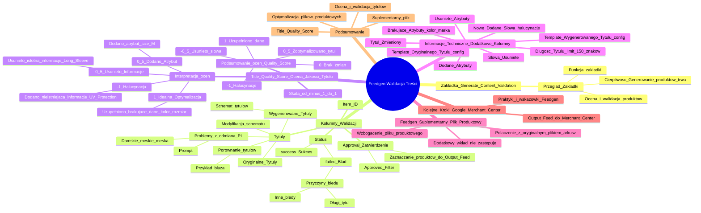

# Lekcje wideo - 8. Ocena-ewaluacja

# 💡 Diagram

___

# 🗒️ Notatka

# Notatki i Podsumowanie: Walidacja Wygenerowanej Treści w Feedgen - Umiejętności Jutra

## Wprowadzenie

Ten dokument dotyczy zakładki **Generate Content Validation** w narzędziu **Feedgen**. Omówiono w nim proces oceny i walidacji wygenerowanych produktów, koncentrując się na kolumnach i funkcjach tej zakładki. Celem jest wyjaśnienie, jak interpretować wyniki walidacji i efektywnie wykorzystać Feedgen do ulepszania plików produktowych.

## Zakładka `Generate Content Validation` w Feedgen

### Przegląd Zakładki

- Zakładka **Generate Content Validation** służy do oceny i walidacji produktów wygenerowanych w Feedgen.
- Generowanie produktów może zająć trochę czasu, dlatego prosimy o cierpliwość. ⏳

### Kolumny w Zakładce Walidacji

1.  **Approval (Zatwierdzenie) ✅**
    -   Ta kolumna umożliwia zaznaczenie produktów, które mają zostać przeniesione do **Output Feed**.
    -   Produkty zatwierdzone za pomocą **Approved Filter** są wykorzystywane do stworzenia pliku produktowego.

2.  **Status**
    -   Informuje o statusie generowania produktu: **success (sukces) 👍** lub **failed (błąd) ❌**.
    -   Status **failed** oznacza, że produkt nie został poprawnie wygenerowany, na przykład z powodu zbyt długiego tytułu lub innych błędów. ⚠️

3.  **Item ID**
    -   Identyfikator produktu.

4.  **Tytuły (Wygenerowane i Oryginalne)**
    -   **Wygenerowane tytuły** są tworzone przez system na podstawie zdefiniowanego schematu.
    -   Można je porównać z **oryginalnymi tytułami**, aby ocenić jakość generacji.
    -   **Przykład porównania tytułów:**
        -   **Oryginalny tytuł:** bluza męska Park 20 Hoodie Nike
        -   **Wygenerowany tytuł:** bluza Park 20 Hoodie Nike, męska czarna, rozmiar L, bawełna, poliester, kaptur, kieszeń kangurka, logo Swoosh
        -   Wygenerowany tytuł jest bardziej rozbudowany i zawiera dodatkowe informacje (kolor, rozmiar, materiał, cechy), bazując na ustalonym schemacie.
    -   Schemat tytułu można modyfikować w ustawieniach Feedgen, dostosowując kolejność i zawartość informacji.
    -   System może napotykać trudności z odmianą słów „damskie”, „męskie”, „męska” w języku polskim. Można to poprawić, modyfikując `prompt`, aby uwzględniał poprawne formy gramatyczne.

5.  **Title Quality Score (Ocena Jakości Tytułu) 🏆**
    -   Ocena jakości wygenerowanego tytułu w skali od -1 do 1 (z krokiem co 0.5).
    -   Ocena pomaga zweryfikować, jak system poradził sobie z optymalizacją tytułu.
    -   **Przykłady ocen i ich interpretacja:**
        -   **-1 (Halucynacja):** System dodał informację, która nie występuje w oryginalnym tytule ani opisie i została wymyślona przez AI (halucynacja).
            -   **Przykład:** Dodanie „UV Protection”, gdy brak takiej informacji w danych produktu.
            -   Mimo że dodana informacja może być sensowna (np. na podstawie UPF 50 plus), jest oznaczona jako halucynacja, aby użytkownik mógł zweryfikować jej poprawność.
        -   **-0.5 (Usunięto Informację):** System usunął istotną informację z tytułu.
            -   **Przykład:** Usunięcie „Long Sleeve” z tytułu „Men Swim Compression Long Sleeve Top”.
            -   Usunięcie informacji może obniżyć jakość tytułu, stąd negatywna ocena. Warto zweryfikować, czy usunięta informacja jest istotna.
        -   **0.5 (Dodano Atrybut):** System dodał dodatkowy atrybut lub słowo do tytułu.
            -   **Przykład:** Dodanie „size M” do tytułu „Men Swim Compression Long Sleeve Top”.
            -   Dodanie atrybutu może ulepszyć tytuł i zwiększyć jego zgodność z wymaganiami Merchant Center, zapobiegając odrzuceniu produktu.
        -   **1 (Idealna Optymalizacja):** Tytuł został zoptymalizowany poprzez uzupełnienie brakujących informacji w feedzie.
            -   **Przykład:** Dodanie koloru i rozmiaru do tytułu „Men Swim Compression Long Sleeve Top”.
            -   Ocena 1 oznacza, że system idealnie zoptymalizował tytuł, dodając brakujące, istotne dane.
    -   **Podsumowanie ocen `Quality Score`:**
        -   **-1:** Halucynacje
        -   **-0.5:** Usunięto słowa
        -   **0:** Brak zmian
        -   **0.5:** Zoptymalizowano tytuł (dodano atrybut)
        -   **1:** Uzupełniono brakujące dane (dodano nowe atrybuty)

6.  **Informacje Techniczne (Dodatkowe Kolumny) ⚙️**
    -   **Tytuł Zmieniony:** Informacja, czy tytuł został zmodyfikowany.
    -   **Długość Tytułu:** Długość wygenerowanego tytułu (system sprawdza limit 150 znaków).
    -   **Nowe Dodane Słowa:** Słowa dodane przez system (w tym „halucynacje”).
    -   **Słowa Usunięte:** Słowa usunięte z oryginalnego tytułu.
    -   **Template Oryginalnego Tytułu:** Szablon oryginalnego tytułu (zgodnie z konfiguracją - `config`).
    -   **Template Wygenerowanego Tytułu:** Szablon wygenerowanego tytułu (zgodnie z konfiguracją - `config`).
    -   **Dodane Atrybuty:** Atrybuty dodane do tytułu.
    -   **Usunięte Atrybuty:** Atrybuty usunięte z tytułu.
    -   **Brakujące Atrybuty:** Atrybuty, których brakowało w oryginalnym tytule (np. kolor, marka).

## Feedgen jako Suplementarny Plik Produktowy

-   Feedgen tworzy **suplementarny**, dodatkowy wkład do oryginalnego pliku produktowego, nie zastępując go.
-   Wygenerowane dane można połączyć z oryginalnym plikiem produktowym, na przykład w arkuszu kalkulacyjnym. 📊
-   Feedgen dostarcza brakujące elementy, które można wykorzystać do wzbogacenia istniejącego pliku produktowego. ℹ️

## Kolejne Kroki - Wykorzystanie w Google Merchant Center ➡️

-   Po walidacji i zatwierdzeniu produktów, plik produktowy (**Output Feed**) można przesłać do **Google Merchant Center**.
-   Przed przesłaniem do Merchant Center, warto zapoznać się z praktykami i wskazówkami dotyczącymi korzystania z Feedgen.

## Podsumowanie 📝

Zakładka **Generate Content Validation** w Feedgen umożliwia ocenę i walidację wygenerowanych tytułów produktów. System ocenia jakość tytułów za pomocą **Title Quality Score**, informując o halucynacjach, usuniętych informacjach, dodanych atrybutach i optymalizacji. Feedgen dostarcza suplementarny plik produktowy, który można wykorzystać do ulepszenia oryginalnych danych i przygotowania ich do **Google Merchant Center**. Zrozumienie kolumn walidacji i ocen jakości tytułów jest kluczowe dla efektywnego wykorzystania Feedgen do optymalizacji plików produktowych.

___

# 🔉 Transcript
File: Lekcje wideo - 8. Ocena-ewaluacja.mp4 
[00:00:00] (Biały ekran)
[00:00:01] (Na białym ekranie pojawia się napis "Umiejętności Jutra" a następnie logo "AI")
[00:00:05] Speaker: Okej.
[00:00:05] Speaker: I tak udało nam się wygenerować nasze produkty w zakładce Generate Content Validation i chciałem trochę teraz o tej zakładce porozmawiać o ocenie i walidacji tego co tutaj mamy.
[00:00:16] Speaker: Być może trochę to trwało, więc nie denerwuj się, nie stresuj się, jeżeli po prostu po chwili tych produktów tutaj nie ma, to zajmuje czasu trochę.
[00:00:26] Speaker: No i co tutaj mamy?
[00:00:27] Speaker: Pierwsza kolumna to jest kolumna Approval, czyli tutaj zaznaczamy, które produkty za pomocą Approved Filter będziemy chcieli przerzucić do naszego output feed, z który później wykorzystamy jako plik produktowy.
[00:00:41] Speaker: Następnie mamy status, czy jest sukces, czy coś nie zadziałało.
[00:00:44] Speaker: Jeżeli coś nie zadziałało, jest jakiś coś się nie udało czegoś wygenerować, albo coś zostało wygenerowane błędnie, przede wszystkim na przykład tytuł zawiera za dużo znaków, albo coś było nie tak, no to wtedy tu będziemy mieli napis failed.
[00:00:57] Speaker: w tym momencie udało się wszystko wygenerować.
[00:01:00] Speaker: Tu mamy Item ID i tu mamy tutaj wygenerowane tytuły i możemy je porównać z oryginalnymi tytułami i sobie teraz tutaj to zróbmy, jak to wyszło.
[00:01:08] Speaker: Oryginalny tytuł to była bluza męska Park 20 Hoodie Nike, a teraz mamy bluza Park 20 Hoodie Nike, męska czarna, rozmiar L, bawełna, poliester, kaptur, kieszeń kangurka, logo Swoosh nawet dorzucił nam dodatkowe informacje, które tutaj po prostu się pojawiają.
[00:01:28] Speaker: Logo Swoosh to jest tak się nazywa logo Nike.
[00:01:31] Speaker: Co my tutaj dalej mamy?
[00:01:32] Speaker: Bluza damska Essentials Linear French Terry Adidas, bluza Essentials Linear Frenach czy Frenacz, nie wiem jak to się czyta, Terry Adidas, damska różowa rozmiar M bawełna.
[00:01:45] Speaker: z kolei tutaj mamy Polar Paganella, Salewa, męskie, czarna, rozmiar M poliester.
[00:01:52] Speaker: No i zwróć uwagę, że dzięki temu ten tytuł jest dużo bardziej rozbudowany, zawiera dużo więcej cech i jest tworzony właśnie na podstawie tego naszego schematu, który ustaliliśmy tutaj.
[00:02:04] Speaker: Więc jeżeli chcemy coś zmienić, zmienić kolejność, inaczej to poukładać, to możemy w ten sposób właśnie tutaj to sobie poustawiać.
[00:02:11] Speaker: Możemy też przeczytać, sprawdzić, czy coś zadziałało.
[00:02:13] Speaker: Na przykład bluza męska została zmieniona w bluza Nike, męskie, zielona, rozmiar M bawełna poliester.
[00:02:20] Speaker: Faktycznie jest taka jedna uwaga, że system ten nie do końca radzi sobie z odmianą damskie, męskie, męska.
[00:02:28] Speaker: Więc dobrze, żeby było być może nad tym jeszcze w języku polskim popracować i na przykład rozbudować ten nasz prompt, żeby uwzględnił, że jeżeli na przykład coś jest męskie to powinno być bluza męska, a nie bluzy męskie.
[00:02:49] Speaker: Można to zmienić, można nad tym popracować.
[00:02:52] Speaker: Tu też teraz nie będę się tym zajmował, teoretycznie może to zostać, nie jest to jakiś jakiś ogromny błąd, bo to jest do tak naprawdę do ustawień naszego po prostu tego, żeby nasz plik dobrze się wyświetlał, ale jak ktoś chce być dokładny, to warto nad tym sobie tutaj popracować.
[00:03:09] Speaker: To przejdźmy sobie teraz do kolejnej kolumny, gdzie mamy Title Quality Score, czyli ocenę tego, jak system dobrze poradził sobie ze stworzeniem tego tytułu i ta ocena może być od minus jedynki do jedynki przez połówki.
[00:03:19] Speaker: No i teraz chciałem omówić taki przykład, jak tutaj to działa na podstawie kilku właśnie tutaj z przykładów podanych przez samego autora tego narzędzia.
[00:03:28] Speaker: No i mamy przykład pierwszy.
[00:03:30] Speaker: Zobaczcie.
[00:03:31] Speaker: Mamy tytuł oryginalny 2XU Men Swim Compressed Long Sleeve Top i mamy oryginalny opis i mamy tytuł wygenerowany Men Suite Compression Long Sleeve Top Black size i mamy na końcu UV Protection i ocena to jest minus 1, ponieważ tego UV Protection nigdzie jakby nie ma, ani w tytule, ani w opisie i zostało to wymyślone przez AI, żeby coś tutaj dodać, że to będzie sensowne.
[00:03:57] Speaker: No bo jak mamy UPF 50 plus to oznacza, że to jest UV Protection, więc dlatego system tutaj to dodał.
[00:04:03] Speaker: W tym przypadku jest to pozytywne, ale jest to pewnego rodzaju halucynacja, więc dlatego system dał tu minus 1, żebyśmy mogli sami zweryfikować i ocenić czy dodane elementy są poprawne, czy na przykład przypadkiem nie system nie zrobił jakiegoś błędu.
[00:04:16] Speaker: Przykład drugi, minus 0,5 oceny.
[00:04:19] Speaker: Mamy tytuł oryginalny 2XU Men Swim Compression Long Sleeve Top i tytuł wygenerowany Men Swim Compression Top size M.
[00:04:27] Speaker: No i usunięto tutaj informacje Long Sleeve, która w zasadzie opisuje ten produkt, dlatego jest tu 0,5, bo jakaś informacja została usunięta i być może jakoś tytuł się pogorszyła, więc stąd system dał negatywną ocenę.
[00:04:42] Speaker: Znowu niekoniecznie w naszym przypadku to musi być złe, ale z minus 0,5 oznacza, że jakaś informacja została usunięta i warto to zweryfikować.
[00:04:49] Speaker: Przykład trzeci, kiedy mamy ocenę 0,5, to oznacza, że nic nie zostało zmienione, nie zostało usunięte, alo, ale dodano jakiś dodatkowy atrybut, jakieś dodatkowe słowo, więc być może to spełnia więcej wymagań związanych z Merchant Center.
[00:05:04] Speaker: i zapobiegnię odrzuceniu na przykład tego produktu.
[00:05:06] Speaker: No i mamy taki tytuł oryginalny Men Swim Compression Long Sleeve Top i tu mamy dodane size M.
[00:05:12] Speaker: Dodane size M, atrybut, dlatego jest 0,5, udało się dodać, czegoś tego nie było.
[00:05:16] Speaker: A jak mamy jedynkę, to jest to idealny scenariusz, tytuł został zoptymalizowany, uzupełnione zostały brakujące informacje w feedzie i ta jedynka to jest w pełni zasłużona.
[00:05:25] Speaker: No i tutaj na przykład właśnie mamy informacje o Men Swim Compression Long Sleeve Top, a tutaj zostało już dodany kolor, no i size, więc mamy dwie dodane informacje, daje nam to jedynkę.
[00:05:37] Speaker: Czyli podsumowując, czy wystąpiły halucynacje?
[00:05:39] Speaker: Jeżeli tak to mamy minus 1.
[00:05:41] Speaker: Czy usunięto jakikolwiek słowa?
[00:05:43] Speaker: Jeżeli tak to mamy minus pół.
[00:05:45] Speaker: jeżeli nie wprowadzono żadnych zmian to mamy zero.
[00:05:47] Speaker: Jeżeli został zoptymalizowany tytuł mamy plus 0,5, a jeżeli uzupełniono brakujące dane, dodano nowe atrybuty to mamy wtedy całą jedynkę.
[00:05:57] Speaker: Więc tak wygląda ten sposób oceniania tego naszego quality score.
[00:06:02] Speaker: Kolejna rzecz to są takie informacje już czysto techniczne, czyli tytuł został zmieniony, prawda, jaka jest długość tego tytułu, to system sprawdzi czy nie przekracza tych 150 znaków.
[00:06:11] Speaker: nowe dodane słowa według systemu, tutaj właśnie te halucynacje według niego.
[00:06:18] Speaker: słowa usunięte, jaki był właśnie template oryginalnego tytułu, jaki jest template wygenerowanego tytułu, to właśnie jest na podstawie tego naszego configu.
[00:06:28] Speaker: jakie zostały dodane atrybuty, jakie zostały usunięte i jakich atrybutów w danym tytule brakowało.
[00:06:36] Speaker: I na przykład tutaj właśnie brakujący był kolor, brakujący tutaj na przykład był brand, tak i tak dalej i tak dalej.
[00:06:48] Speaker: więc to są informacje, których w tym przypadku nam tutaj brakowało.
[00:06:50] Speaker: Oczywiście da się te rzeczy połączyć.
[00:06:52] Speaker: Jeżeli chcielibyśmy, żeby to był z jeden od razu gotowy plik produktowy do wykorzystania, to można wziąć zwykły plik produktowy, dokleić te rzeczy, które tutaj są.
[00:07:36] Speaker: nawet da się to w spreadsheetach tutaj zrobić.
[00:07:38] Speaker: Nie będziemy się tym teraz zajmować, bo to jest troszeczkę już poza naszym Feedgenem.
[00:07:41] Speaker: Feedgen działa w ten sposób, że tworzy nam suplementarny, taki dodatkowy wkład do oryginalnego pliku produktowego.
[00:07:50] Speaker: Czyli tutaj mamy te elementy, których po prostu nam wcześniej gdzieś brakowało.
[00:07:53] Speaker: No i teraz już mamy to gotowe i w takim razie możemy przejść do wrzucenia tego pliku produktowego do naszego Google Merchant Center.
[00:07:58] Speaker: Ale zanim do tego dojdziemy, to jeszcze kilka takich ważnych praktyk i wskazówek odnośnie korzystania z Feedgena.
[01:00:04] (Na białym ekranie pojawia się napis "Umiejętności Jutra" a następnie logo "AI")

___
# 🏷️ Tags
#Feedgen #Generate_Content_Validation #walidacja #produkty #plik_produktowy #Output_Feed #Approval #Approved_Filter #Status #success #failed #Item_ID #tytuły #tytuł_oryginalny #tytuł_wygenerowany #Title_Quality_Score #ocena_jakości_tytułu #halucynacja #usunięto_informacje #dodano_atrybut #optymalizacja #informacje_techniczne #Tytuł_Zmieniony #Długość_Tytułu #Nowe_Dodane_Słowa #Słowa_Usunięte #Template_Oryginalnego_Tytułu #Template_Wygenerowanego_Tytułu #Dodane_Atrybuty #Usunięte_Atrybuty #Brakujące_Atrybuty #suplementarny_plik_produktowy #Google_Merchant_Center #optymalizacja_plików_produktowych #prompt #język_polski #odmiana_słów #błędy #rozmiar #kolor #materiał #cechy #schemat #config
