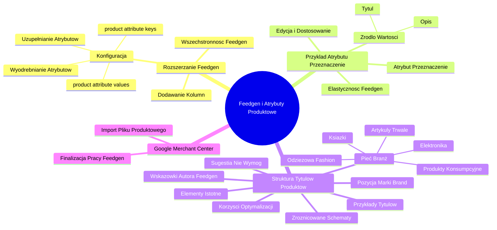

# Lekcje wideo - 9. Najlepsze praktyki

# 💡 Diagram

___

# 🗒️ Notatka

# Notatki i Podsumowanie Transkrypcji Wideo - Feedgen i Atrybuty Produktowe

## Wprowadzenie

Ten dokument zawiera szczegółowe notatki i podsumowanie dotyczące narzędzia **Feedgen** i jego zastosowania w kontekście feedów produktowych, ze szczególnym uwzględnieniem dodawania oraz konfiguracji atrybutów produktowych. Zakres tematyczny wykracza poza standardowe atrybuty związane z modą, obejmując różne typy produktów. Omówione zostaną również rekomendacje dotyczące struktury tytułów produktów w różnych branżach oraz proces przejścia do **Google Merchant Center**.

## Notatki Szczegółowe

### 1. Rozszerzanie Feedgen o Niestandardowe Atrybuty

*   **Wszechstronność Feedgen:** Narzędzie **Feedgen** nie ogranicza się wyłącznie do atrybutów charakterystycznych dla branży modowej. Umożliwia wykorzystanie go dla szerokiego spektrum produktów i dodawanie atrybutów specyficznych dla danego asortymentu.
*   **Dodawanie Kolumn w Arkuszu Kalkulacyjnym:** Aby wprowadzić nowe atrybuty, należy dodać odpowiednie kolumny w arkuszu kalkulacyjnym, który stanowi podstawę feedu produktowego. Kolumny te powinny być precyzyjnie nazwane, odzwierciedlając dodawane atrybuty.
*   **Konfiguracja Kluczy i Wartości Atrybutów:** Kluczowym aspektem prawidłowego funkcjonowania **Feedgen** z niestandardowymi atrybutami jest właściwa konfiguracja pliku konfiguracyjnego, w szczególności pól **`product attribute keys`** i **`product attribute values`**.
    *   Te pola instruują system, jak rozpoznawać i wyodrębniać dodatkowe atrybuty z pierwotnych danych produktowych, takich jak tytuł i opis.
    *   Na podstawie zdefiniowanych przykładów, system uczy się identyfikować i uzupełniać te atrybuty, nawet jeśli początkowo nie są one obecne w danych.

### 2. Praktyczny Przykład Dodawania Atrybutu "Przeznaczenie"

*   **Atrybut "Przeznaczenie" jako przykład:**  Dodanie atrybutu określającego przeznaczenie produktu (np. na narty ⛷️, do pływania 🏊, na snowboard 🏂) jest możliwe poprzez dodanie odpowiedniej kolumny i konfigurację.
*   **Źródło Wartości Atrybutu:** Wartości dla atrybutu "Przeznaczenie" (np. "narty", "pływanie", "snowboard") powinny być pozyskiwane z tytułu lub opisu produktu.
*   **Elastyczność i Adaptacja Feedgen:** Dzięki odpowiedniej konfiguracji, **Feedgen** efektywnie obsługuje nowe atrybuty i ich wartości, umożliwiając użytkownikom edycję i dostosowanie feedu do indywidualnych potrzeb.

### 3. Rekomendacje dotyczące Struktury Tytułów Produktów w Różnych Branżach

*   **Wskazówki Autora Feedgen:** Autor narzędzia **Feedgen** proponuje wytyczne dotyczące struktury tytułów produktów, sugerując zróżnicowane schematy w zależności od specyfiki branży.
*   **Pięć Kluczowych Branż:**  Wyróżniono pięć głównych sektorów, w których struktura tytułów odgrywa istotną rolę:
    *   **Odzieżowa (Fashion)** 👗
    *   **Produkty konsumpcyjne (Consumer Products)** 🛍️
    *   **Artykuły trwałe (Durable Goods)** 🛠️
    *   **Elektronika (Electronics)** 📱
    *   **Książki (Books)** 📚
*   **Zróżnicowane Schematy Tytułów:** Dla każdej z wymienionych branż zalecany jest odmienny schemat tytułu, uwzględniający charakterystykę produktów i oczekiwania klientów.
*   **Inspirujące Przykłady Tytułów:**  Dostępne są przykłady prawidłowo skonstruowanych tytułów dla każdej branży, które mogą służyć jako inspiracja i wzorzec.
*   **Korzyści Optymalizacji Tytułów:**  Zastosowanie się do tych rekomendacji może znacząco usprawnić działanie feedów produktowych i zwiększyć ich skuteczność.
*   **Pozycja Marki (Brand):**  W niektórych branżach zaleca się umieszczanie marki na początku tytułu, co jest kluczowe dla rozpoznawalności i preferencji użytkowników.
*   **Elementy Istotne dla Klientów:**  Struktura tytułu powinna eksponować elementy, które są najbardziej istotne dla potencjalnych klientów w danej branży.
*   **Sugestia, Nie Wymóg:**  Wskazówki dotyczące struktury tytułów mają charakter rekomendacji, pozostawiając użytkownikom swobodę w dostosowaniu tytułów do własnych strategii i przekonań o optymalnych rozwiązaniach.

### 4. Przejście do Google Merchant Center

*   **Finalizacja Pracy z Feedgen:** Po omówieniu funkcjonalności **Feedgen** i konfiguracji atrybutów, kolejnym krokiem jest przeniesienie przygotowanego pliku produktowego do **Google Merchant Center**.
*   **Import Pliku Produktowego do Merchant Center:**  Następnym etapem jest zaimportowanie wygenerowanego pliku produktowego w panelu **Google Merchant Center**, co umożliwi wyświetlanie produktów w reklamach i bezpłatnych wynikach wyszukiwania Google.

## Podsumowanie

Niniejszy dokument omawia zaawansowane aspekty użytkowania **Feedgen**, koncentrując się na rozszerzaniu feedów produktowych o niestandardowe atrybuty, wykraczające poza standardową kategorię "moda". Kluczową rolę odgrywa konfiguracja pól **`product attribute keys`** i **`product attribute values`** w pliku konfiguracyjnym. Umożliwia to systemowi inteligentne wyodrębnianie i uzupełnianie dodatkowych informacji o produktach na podstawie tytułu i opisu.

Dodatkowo, przedstawiono cenne wskazówki dotyczące struktury tytułów produktów w różnych branżach (odzież 👗, produkty konsumpcyjne 🛍️, artykuły trwałe 🛠️, elektronika 📱, książki 📚). Te zalecenia, choć opcjonalne, mogą znacząco wpłynąć na efektywność feedów produktowych i widoczność oferty.

Ostatnim etapem, po konfiguracji i optymalizacji feedu w **Feedgen**, jest przejście do **Google Merchant Center** i załadowanie przygotowanego pliku produktowego, co umożliwia prezentację produktów w ekosystemie Google.

___

# 🔉 Transcript
File: Lekcje wideo - 9. Najlepsze praktyki.mp4 
[00:00:05] No i tak dobrnęliśmy prawie do końca. Wiesz już jak działa Feedgen, wiesz jak tworzyć tutaj swoje własne suplementarne feed produktowy, ale jeszcze kilka wskazówek zanim przejdziemy do wgrywania tego pliku już do do konta Merchant Center.
[00:00:19] A co, jeżeli chcielibyśmy wykorzystać inne atrybuty, niezwiązane z fashion, tak, z modą, z ubraniami. Mamy inne typ produktów, albo mamy jeszcze więcej atrybutów, które chcielibyśmy tutaj dodać związane z tym co sprzedajemy.
[00:00:18] (Ekran: Arkusz kalkulacyjny Google z danymi. W górnej części znajdują się nagłówki kolumn: "Feed Settings", "Vertex AI API Settings", "Description Prompt Settings/Model Parameters", "Title Prompt Settings/Model Parameters", "Free-Shot Prompting Examples". Poniżej znajdują się szczegółowe dane i ustawienia. Na dole arkusza widoczne zakładki: "Output Feed", "Input Feed", "Config", "Generated Content Validation", "Getting Started".)
[00:00:34] (Ekran: Arkusz kalkulacyjny Google z danymi. W górnej części znajdują się nagłówki kolumn: "Item ID", "Title", "Description", "Brand", "Gender", "Category", "Size", "Color", "Material", "Link", "Image Link". Poniżej znajdują się szczegółowe dane produktów.)
[00:00:35] Nie ma takiego problemu. Możemy dodać tu kolejne kolumny, które odpowiednio sobie po prostu ponazywamy i zmienić w pliku konfiguracyjnym ten przykład, a konkretnie pole product attribute keys i pole product attribute values.
[00:00:48] I po prostu na podstawie tych dwóch pól, tego jak pokażemy, jak powinno to być zrobione na podstawie oryginalnego tytułu i oryginalnego opisu, system również powinien wyłapać te dodatkowe atrybuty, a później na przykład jeżeli ich brakuje tutaj, też je uzupełniać.
[01:06] (Ekran: Arkusz kalkulacyjny Google z danymi. W górnej części znajdują się nagłówki kolumn: "Approved", "Status", "Item ID", "Generated Title", "Original Title", "Title Quality Score", "Title Changed", "Gen. Title Length", "New Words". Poniżej znajdują się szczegółowe dane i statusy generowanych tytułów.)
[01:06] (Ekran: Arkusz kalkulacyjny Google z danymi. W górnej części znajdują się nagłówki kolumn: "Feed Settings", "Vertex AI API Settings", "Description Prompt Settings/Model Parameters", "Title Prompt Settings/Model Parameters", "Free-Shot Prompting Examples". Poniżej znajdują się szczegółowe dane i ustawienia. Na dole arkusza widoczne zakładki: "Output Feed", "Input Feed", "Config", "Generated Content Validation", "Getting Started".)
[01:07] Więc tak, te dwa jakby pola są tutaj istotne do tego, jeżeli chcielibyśmy coś tutaj dodatkowego zmienić. Na przykład dodać przeznaczenie i wybrać sobie właśnie na narty, tak? Do pływania, na snowboard, czy do innych rzeczy i wtedy po prostu dodając tutaj ten kolejny atrybut i wartości wyciągnięte z z tytułu czy z opisu, Feedgen nam działały i tak możemy sobie to sami edytować.
[01:35] I jeszcze tutaj taka jedna wskazówka od autora, który pokazuje jak w poszczególnych branżach powinna wyglądać struktura tytułów.
[01:45] Mamy tutaj pięć branż, które wymieniam. Mamy branżę odzieżową, mamy produkty konsumpcyjne, mamy artykuły jak to się nazywa trwałe, elektronikę i książki. No i po prostu inny schemat tutaj tytułów powinien być brany pod uwagę i jest przykład już takich dobrze gotowych tytułów.
[02:05] Może warto z tego skorzystać, może dzięki temu wasze pliki, wasze produkty, wasze feedy produktowe będą działały lepiej, jeżeli zastanawiacie jak ten tytuł powinien być poukładany tutaj w pliku produktowym, to od autora jest taka wskazówka, gdzie powinien na przykład być na początku brand, gdzie powinny być jakie elementy, co jest najistotniejsze dla użytkowników w poszczególnych sekcjach. Oczywiście to jest tylko taka wskazówka, każdy może sobie to zrobić jak on uważa, że będzie najlepiej.
[02:32] No dobra, to tyle jeśli chodzi o Feedgen i teraz już możemy przeskoczyć do Google Merchant Center i tam dodać nasz plik produktowy.
[02:42] (Ekran: Logo "Umiejętności Jutra AI" z logotypami Google i SGH.)

___
# 🏷️ Tags
#Feedgen #atrybuty_produktowe #feed_produktowy #Google_Merchant_Center #niestandardowe_atrybuty #arkusz_kalkulacyjny #konfiguracja #product_attribute_keys #product_attribute_values #tytuł_produktu #opis_produktu #przeznaczenie #branże #odzieżowa #produkty_konsumpcyjne #artykuły_trwałe #elektronika #książki #struktura_tytułów #brand #optymalizacja_tytułów #import_pliku #reklamy_Google #dane_produktowe #AI
