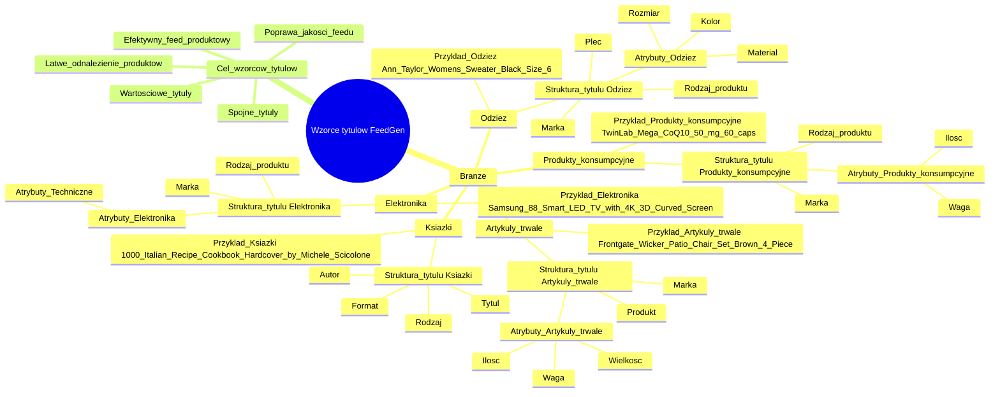

# wzorce_tutułów

# 💡 Diagram

___

# 🗒️ Notatka

# Wzorce tytułów w zależności od branży

Niniejsze notatki przedstawiają zalecane wzorce tytułów dla różnych branż w kontekście konfiguracji `FeedGen`. Stosowanie tych wzorców ma na celu ułatwienie generowania spójnych i wartościowych tytułów produktów, co jest kluczowe dla efektywnego feedu produktowego.

## Zalecane struktury tytułów dla różnych branż

Poniżej przedstawiono tabelę z zalecanymi strukturami tytułów w zależności od branży, które można stosować podczas konfiguracji `FeedGen`. Ułatwi to generowanie spójnych i wartościowych tytułów dla produktów.

### Tabela wzorców tytułów

| Branża                 | Zalecana struktura tytułu                                                                 | Przykład                                                                    |
| ----------------------- | ---------------------------------------------------------------------------------------- | --------------------------------------------------------------------------- |
| **Odzież**              | Marka + Płeć + Rodzaj produktu + Atrybuty (Kolor, Rozmiar, Materiał)                       | Ann Taylor Women's Sweater, Black (Size 6)                                 |
| **Produkty konsumpcyjne** | Marka + Rodzaj produktu + Atrybuty (Waga, Ilość)                                         | TwinLab Mega CoQ10, 50 mg, 60 caps                                          |
| **Artykuły trwałe**     | Marka + Produkt + Atrybuty (Wielkość, Waga, Ilość)                                       | Frontgate Wicker Patio Chair Set, Brown, 4-Piece                              |
| **Elektronika**         | Marka + Atrybuty + Rodzaj produktu                                                          | Samsung 88" Smart LED TV with 4K 3D Curved Screen                           |
| **Książki**             | Tytuł + Rodzaj + Format (W twardej oprawie, eBook) + Autor                               | 1,000 Italian Recipe Cookbook, Hardcover by Michele Scicolone                |

### Szczegółowe omówienie wzorców tytułów dla poszczególnych branż

Poniżej znajduje się bardziej szczegółowe omówienie zalecanych struktur tytułów dla każdej z wymienionych branż.

#### Odzież 👗

- **Zalecana struktura tytułu:** Marka + Płeć + Rodzaj produktu + Atrybuty (Kolor, Rozmiar, Materiał)
    - Ta struktura jest zalecana dla branży odzieżowej, ponieważ pozwala na uwzględnienie kluczowych informacji, które pomagają klientom szybko zidentyfikować i znaleźć poszukiwany produkt.
    - **Elementy składowe:**
        - **Marka:** Nazwa marki produktu (np. Ann Taylor).
        - **Płeć:** Określenie płci, dla której produkt jest przeznaczony (np. Women's - Damski).
        - **Rodzaj produktu:** Kategoria produktu (np. Sweater - Sweter).
        - **Atrybuty:** Dodatkowe cechy produktu, takie jak:
            - **Kolor:** (np. Black - Czarny)
            - **Rozmiar:** (np. Size 6 - Rozmiar 6)
            - **Materiał:** (np. Cotton - Bawełna)
- **Przykład:** Ann Taylor Women's Sweater, Black (Size 6)

#### Produkty konsumpcyjne 🛒

- **Zalecana struktura tytułu:** Marka + Rodzaj produktu + Atrybuty (Waga, Ilość)
    - Ta struktura jest odpowiednia dla produktów konsumpcyjnych, gdzie istotne są informacje o wadze lub ilości produktu w opakowaniu.
    - **Elementy składowe:**
        - **Marka:** Nazwa marki produktu (np. TwinLab).
        - **Rodzaj produktu:** Kategoria produktu (np. Mega CoQ10).
        - **Atrybuty:** Dodatkowe cechy produktu, takie jak:
            - **Waga:** (np. 50 mg)
            - **Ilość:** (np. 60 caps - 60 kapsułek)
- **Przykład:** TwinLab Mega CoQ10, 50 mg, 60 caps

#### Artykuły trwałe 🛋️

- **Zalecana struktura tytułu:** Marka + Produkt + Atrybuty (Wielkość, Waga, Ilość)
    - Struktura ta jest przeznaczona dla artykułów trwałych, gdzie ważne są parametry fizyczne produktu, takie jak wielkość, waga czy ilość elementów w zestawie.
    - **Elementy składowe:**
        - **Marka:** Nazwa marki produktu (np. Frontgate).
        - **Produkt:** Nazwa produktu (np. Wicker Patio Chair Set - Zestaw krzeseł ogrodowych z wikliny).
        - **Atrybuty:** Dodatkowe cechy produktu, takie jak:
            - **Wielkość:** (np. Large - Duży)
            - **Waga:** (np. 10 kg)
            - **Ilość:** (np. 4-Piece - 4-częściowy)
- **Przykład:** Frontgate Wicker Patio Chair Set, Brown, 4-Piece

#### Elektronika 📱

- **Zalecana struktura tytułu:** Marka + Atrybuty + Rodzaj produktu
    - Dla elektroniki kluczowe są atrybuty techniczne i specyfikacje, dlatego umieszcza się je przed rodzajem produktu.
    - **Elementy składowe:**
        - **Marka:** Nazwa marki produktu (np. Samsung).
        - **Atrybuty:** Kluczowe cechy techniczne (np. 88" Smart LED TV with 4K 3D Curved Screen).
        - **Rodzaj produktu:** Kategoria produktu (np. TV - Telewizor).
- **Przykład:** Samsung 88" Smart LED TV with 4K 3D Curved Screen

#### Książki 📚

- **Zalecana struktura tytułu:** Tytuł + Rodzaj + Format (W twardej oprawie, eBook) + Autor
    - Dla książek najważniejszy jest tytuł, format i autor, co pomaga w identyfikacji konkretnego wydania.
    - **Elementy składowe:**
        - **Tytuł:** Tytuł książki (np. 1,000 Italian Recipe Cookbook).
        - **Rodzaj:** Kategoria książki (np. Cookbook - Książka kucharska).
        - **Format:** Forma wydania (np. Hardcover - W twardej oprawie, eBook).
        - **Autor:** Nazwisko autora (np. by Michele Scicolone).
- **Przykład:** 1,000 Italian Recipe Cookbook, Hardcover by Michele Scicolone

## Podsumowanie

Stosowanie zalecanych wzorców tytułów w `FeedGen` w zależności od branży jest kluczowe dla generowania spójnych, informatywnych i wartościowych tytułów produktów. Ułatwia to klientom szybkie odnalezienie poszukiwanych produktów i poprawia ogólną jakość feedu produktowego. Dostosowanie struktury tytułu do specyfiki danej branży pozwala na efektywne wykorzystanie przestrzeni tytułu i umieszczenie w nim najważniejszych informacji.

___

# 🔉 Transcript
File: wzorce_tutułów.png 
**Wzorce tytułów w zależności od branży**

Wzorce tytułów w zależności od branży
Zalecamy stosowanie poniższych wzorców tytułów w zależności od branży podczas konfiguracji FeedGen. Ułatwi to generowanie spójnych i wartościowych tytułów:

| Branża                 | Zalecana struktura tytułu                               | Przykład                                                 |
|-------------------------|---------------------------------------------------------|----------------------------------------------------------|
| Odzież                  | Marka + Płeć + Rodzaj produktu + Atrybuty (Kolor, Rozmiar, Materiał) | Ann Taylor Women's Sweater, Black (Size 6)             |
| Produkty konsumpcyjne   | Marka + Rodzaj produktu + Atrybuty (Waga, Ilość)        | TwinLab Mega CoQ10, 50 mg, 60 caps                      |
| Artykuły trwałe         | Marka + Produkt + Atrybuty (Wielkość, Waga, Ilość)      | Frontgate Wicker Patio Chair Set, Brown, 4-Piece         |
| Elektronika             | Marka + Atrybuty + Rodzaj produktu                      | Samsung 88" Smart LED TV with 4K 3D Curved Screen       |
| Książki                 | Tytuł + Rodzaj + Format (W twardej oprawie, eBook) + Autor | 1,000 Italian Recipe Cookbook, Hardcover by Michele Scicolone |

___
# 🏷️ Tags
#wzorce_tytułów #branża #FeedGen #tytuły_produktów #struktura_tytułu #odzież #produkty_konsumpcyjne #artykuły_trwałe #elektronika #książki #marka #płeć #rodzaj_produktu #atrybuty #kolor #rozmiar #materiał #waga #ilość #wielkość #format #autor #twarda_oprawa #eBook #Ann_Taylor #TwinLab #Frontgate #Samsung #Michele_Scicolone #feed_produktowy
