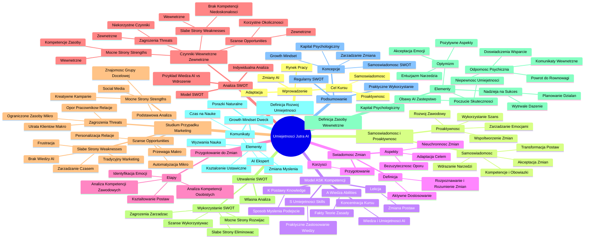

# Lekcje wideo - 1. Samoświadomość

# 💡 Diagram

___

# 🗒️ Notatka

# Umiejętności Jutra AI - Notatki i Podsumowanie

## Wprowadzenie

*   Sztuczna inteligencja (AI) wprowadza znaczące zmiany, które mogą wpłynąć na rynek pracy i charakter zadań wykonywanych przez ludzi.
*   Kurs "Umiejętności Jutra AI" ma na celu przygotowanie uczestników do efektywnego zarządzania sobą w kontekście tych dynamicznych zmian.
*   Program kursu obejmuje kluczowe zagadnienia, takie jak samoświadomość i proaktywność, które są niezbędne w procesie adaptacji do nowych technologii.

## Samoświadomość i Proaktywność

*   **Samoświadomość**:
    *   Rozumienie własnych kompetencji i zakresu obowiązków.
    *   Wspomaga akceptację zmian i ułatwia wdrażanie nowych narzędzi.
    *   Pozwala na transformację nastawienia wobec innowacyjnych technologii.
*   **Proaktywność**:
    *   Aktywne współtworzenie i promowanie pozytywnych zmian w otoczeniu.
    *   Świadome kierowanie własnym rozwojem zawodowym i osobistym.
    *   Wykorzystywanie możliwości i szans wynikających z rozwoju nowych technologii.
    *   Odpowiedzialne zarządzanie emocjami i podejmowanie przemyślanych działań w obliczu zmian.

## Model ASK - Definicja Kompetencji

*   Kompetencje składają się z trzech komplementarnych elementów, opisanych modelem **ASK**:
    *   **A - Abilities (Wiedza)**: Ugruntowana znajomość faktów, teorii i zasad.
    *   **S - Skills (Umiejętności)**: Praktyczna zdolność do zastosowania wiedzy w konkretnych sytuacjach.
    *   **K - Knowledge (Postawy)**: Określony sposób myślenia i podejście do działania, determinujące efektywność.
*   Kurs "Umiejętności Jutra AI" koncentruje się na rozwijaniu wiedzy i umiejętności związanych ze sztuczną inteligencją.
*   Niniejsza lekcja skupia się na kluczowym aspekcie, jakim jest **zmiana postaw** w kontekście dynamicznego rozwoju AI.

## Świadomość Zmian

*   **Definicja Świadomości Zmian**: To zdolność do rozpoznawania i dogłębnego rozumienia zmian zachodzących zarówno w otoczeniu, jak i w nas samych, oraz umiejętność aktywnego dostosowywania się do nich.
*   **Kluczowe aspekty świadomości zmian**:
    *   **Nieuchronność zmian**: Postęp technologiczny jest procesem ciągłym i nieodwracalnym.
    *   **Bezużyteczność oporu**: Przeciwstawianie się postępowi technologicznemu jest działaniem nieskutecznym.
    *   **Adaptacja jako cel**: Kluczową umiejętnością jest sprawne funkcjonowanie w dynamicznie zmieniającym się świecie.
*   Najbardziej korzystne jest aktywne przygotowanie się do nadchodzących zmian i poszukiwanie w nich potencjalnych korzyści.

## Jak Przygotować Się do Zmian

*   Etapy przygotowania do zmian:
    1.  **Analiza kompetencji zawodowych**: Dokładna ocena posiadanej wiedzy i umiejętności w kontekście aktualnych wymagań rynku pracy.
    2.  **Analiza kompetencji osobistych**: Refleksja nad cechami charakteru i postawami, które wpływają na adaptację do zmian.
    3.  **Identyfikacja emocji w kontekście zmian**: Rozpoznawanie i świadome rozumienie emocji wywołanych perspektywą zmian.
    4.  **Kształtowanie postaw**: Praca nad rozwojem pozytywnego i konstruktywnego nastawienia do zmian.

## Indywidualna Analiza SWOT

*   **Model SWOT** to sprawdzone narzędzie analityczne, które można skutecznie wykorzystać do analizy kompetencji w kontekście zmian.
    *   Tradycyjnie stosowany w analizie przedsiębiorstw i projektów, model **SWOT** jest równie wartościowy w analizie indywidualnej.
    *   **Mocne strony (Strengths)** - czynniki wewnętrzne: Twoje unikalne kompetencje i zasoby.
    *   **Słabe strony (Weaknesses)** - czynniki wewnętrzne: Obszary, w których brakuje Ci kompetencji lub występują niedoskonałości.
    *   **Szanse (Opportunities)** - czynniki zewnętrzne: Korzystne okoliczności zewnętrzne, które możesz wykorzystać na swoją korzyść.
    *   **Zagrożenia (Threats)** - czynniki zewnętrzne: Potencjalnie niekorzystne czynniki zewnętrzne, które mogą stanowić przeszkodę.
*   **Przykład**: Wiedza z zakresu AI zdobyta na kursie to mocna strona, natomiast brak praktycznych umiejętności wdrożenia AI to słaba strona. Szansą jest efektywne wykorzystanie AI w pracy, a zagrożeniem może być opór przed zmianami i konkurencyjna przewaga innych specjalistów.

## Analiza SWOT - Studium Przypadku (Specjalista ds. Marketingu w Sklepie Internetowym)

*   **Mocne strony (Strengths)**:
    *   Umiejętność tworzenia kreatywnych i angażujących kampanii marketingowych.
    *   Dogłębna znajomość specyfiki grupy docelowej.
    *   Doświadczenie w skutecznym zarządzaniu reklamami w mediach społecznościowych.
    *   Podstawowa wiedza z zakresu narzędzi analitycznych.
*   **Słabe strony (Weaknesses)**:
    *   Niewystarczająca, zaawansowana wiedza techniczna o narzędziach AI.
    *   Silne przywiązanie do tradycyjnych metod marketingu i niechęć do automatyzacji.
    *   Problemy z zarządzaniem czasem, skutkujące brakiem czasu na naukę nowych rozwiązań.
    *   Frustracja i presja związane z koniecznością adaptacji do nowych technologii.
*   **Szanse (Opportunities)**:
    *   Możliwość wykorzystania AI do automatyzacji powtarzalnych, rutynowych zadań (w kontekście mikro-firmy).
    *   Personalizacja komunikacji z klientami na niespotykaną dotąd skalę dzięki AI (w kontekście relacji zewnętrznych).
    *   Rozwój kompetencji w obszarze AI jako kluczowa przewaga konkurencyjna na lokalnym rynku pracy (w kontekście makro-gospodarki).
*   **Zagrożenia (Threats)**:
    *   Ryzyko utraty klientów na rzecz większych firm, które skutecznie wdrażają rozwiązania AI (w kontekście makro-gospodarki).
    *   Ograniczone zasoby (czasowe i finansowe) na efektywne wdrożenie AI (w kontekście mikro-firmy).
    *   Konieczność przezwyciężenia oporu pracowników negatywnie nastawionych do AI i pracy nad zmianą ich postaw (w kontekście relacji wewnątrz firmy).

## Analiza SWOT - Utrwalenie

*   **Praktyczne wykorzystanie analizy SWOT**:
    *   **Mocne strony**: Utrzymywać i aktywnie rozwijać.
    *   **Słabe strony**: Intensywnie pracować nad eliminacją słabości, które hamują rozwój.
    *   **Szanse**: Aktywnie wykorzystywać do wzmocnienia pozycji i osiągnięcia wzrostu.
    *   **Zagrożenia**: Uważnie obserwować i skutecznie zarządzać potencjalnym ryzykiem.
*   Zachęcamy do sporządzenia własnej, szczegółowej analizy **SWOT**, dostosowanej do indywidualnej sytuacji.

## Kapitał Psychologiczny Pracownika

*   **Kapitał psychologiczny**: Zbiór pozytywnych zasobów wewnętrznych, które wspierają jednostkę w procesie adaptacji do zmiany.
    *   **Poczucie skuteczności**: Silne przekonanie o własnej zdolności do efektywnego wykonywania zadań.
        *   W kontekście AI: naturalne obawy przed potencjalnym zastąpieniem przez AI, niepewność związana z nabywaniem i stosowaniem nowych umiejętności.
    *   **Optymizm**: Pozytywne nastawienie i wiara w pomyślny obrót obecnych i przyszłych wydarzeń.
        *   Akceptacja trudnych emocji (np. strachu przed zmianami).
        *   Aktywne poszukiwanie pozytywnych aspektów i kontekstów (np. szansa na objęcie roli lidera, postrzeganie AI jako narzędzia ułatwiającego rutynowe zadania).
        *   Entuzjazm i ekscytacja związane z możliwością korzystania z innowacyjnych narzędzi.
    *   **Nadzieja na sukces**: Wytrwałe dążenie do wyznaczonego celu, połączone z silną wiarą w jego osiągnięcie.
        *   Planowanie konkretnych, mierzalnych działań, które dają poczucie kontroli i sprawstwa (np. zapisanie się na kursy z zakresu AI, inicjowanie rozmów z zespołem na temat AI, realizacja małych projektów z wykorzystaniem AI).
    *   **Odporność psychiczna**: Zdolność do szybkiego powrotu do stanu równowagi psychicznej po doświadczeniu trudności i niepowodzeń.
        *   Konstruktywne wykorzystywanie zdobytych doświadczeń, aktywne poszukiwanie wsparcia, umiejętność redukcji negatywnych emocji.
        *   Przykłady wzmacniających komunikatów wewnętrznych: "To normalne, że nie wiem wszystkiego od razu", "Już nie raz radziłem sobie ze zmianami, poradzę sobie i tym razem".

## Model Rozwojowy (Growth Mindset) Carol Dweck

*   **Growth Mindset** (Nastawienie na rozwój): Przekonanie, że zdolności i inteligencję można dynamicznie rozwijać poprzez systematyczny wysiłek, proces uczenia się i determinację.
    *   Traktowanie wyzwań i porażek jako cennych okazji do nauki i dalszego rozwoju.
    *   Silna wewnętrzna motywacja do ciągłego doskonalenia swoich umiejętności i wiedzy.
*   **Kluczowe elementy Growth Mindset**:
    *   Aktywna zmiana sposobu myślenia i wewnętrznej komunikacji z samym sobą.
    *   Postrzeganie wyzwań, konstruktywnej krytyki i porażek jako integralnej części procesu uczenia się.
    *   Koncentracja na idei stałego rozwoju i **kształcenia ustawicznego**.
*   **Przykłady zmiany komunikatów wewnętrznych**:
    *   Zamiast: "Nie znam zaawansowanych narzędzi AI" → "Nie muszę być od razu ekspertem AI. Każde nowe narzędzie, którego się nauczę, da mi realną przewagę."
    *   Zamiast: "Nie mam czasu na naukę" → "Inwestycja nawet 15 minut dziennie w naukę AI to cenna inwestycja w moją przyszłość zawodową."
*   **Porażki jako naturalny element procesu**: Akceptacja porażek jako wartościowej informacji zwrotnej i nieodzownej okazji do wprowadzenia ulepszeń.

## Podsumowanie

*   **Kluczowe narzędzia i koncepcje omówione w lekcji**:
    *   **Budowanie samoświadomości** poprzez systematyczną analizę **SWOT**.
    *   **Rozwijanie pozytywnych zasobów wewnętrznych - Kapitał psychologiczny** (Poczucie skuteczności, Optymizm, Nadzieja na sukces, Odporność psychiczna).
    *   **Zmiana podejścia do porażek i transformacja wewnętrznych komunikatów - Growth Mindset**.
    *   **Świadome zarządzanie zmianą**.
*   Podkreślenie wagi regularnego powtarzania analizy **SWOT** w kontekście dynamicznie zmieniającego się otoczenia i rozwoju kompetencji.
*   Silne zachęcenie do praktycznego wykorzystania omówionych narzędzi i koncepcji w codziennej pracy i rozwoju zawodowym.

---

**Podsumowanie lekcji:**

Lekcja koncentruje się na praktycznym przygotowaniu do zmian wywołanych dynamicznym rozwojem sztucznej inteligencji, kładąc nacisk na rozwijanie samoświadomości i proaktywności. Przedstawiono model **ASK** kompetencji, akcentując kluczowe znaczenie postaw. Omówiono koncepcję świadomości zmian i nieodzowność adaptacji. Głównym narzędziem przygotowania do zmian jest indywidualna analiza **SWOT**, umożliwiająca dogłębną ocenę mocnych i słabych stron, szans i zagrożeń w kontekście AI. Zaprezentowano konkretny przykład analizy **SWOT** dla specjalisty ds. marketingu. Wzmocnienie kapitału psychologicznego (poczucie skuteczności, optymizm, nadzieja, odporność) oraz przyjęcie nastawienia na rozwój (**Growth Mindset**) Carol Dweck są kluczowe dla efektywnego zarządzania zmianami i trwałego rozwoju w erze sztucznej inteligencji. Lekcja stanowi silną zachętę do praktycznego zastosowania analizy **SWOT**, systematycznego rozwijania kapitału psychologicznego i transformacji sposobu myślenia w duchu **Growth Mindset**, aby skutecznie funkcjonować w dynamicznie zmieniającym się świecie.

___

# 🔉 Transcript
File: Lekcje wideo - 1. Samoświadomość.mp4 
[00:00:00] Ekran: Białe tło.
[00:00:05] Ekran: Napis "Umiejętności Jutra AI". Poniżej napis "Organizator Google" i "Partner edukacyjny SGH".
[00:00:05] Dr Joanna Tabor-Błażewicz: Z pewnością wielokrotnie zetknęliście się ze stwierdzeniami, że sztuczna inteligencja doprowadzi do wielu zmian.
[00:00:13] Dr Joanna Tabor-Błażewicz: Że część zawodów może zniknąć, że pewne zadania będą za nas wykonywały roboty.
[00:00:19] Dr Joanna Tabor-Błażewicz: Z jednej strony, uczestnicząc w kursie, możecie odczuwać entuzjazm, ale z drugiej strony naturalną reakcją, pojawiającą się przy każdej zmianie, jest niepokój, a nawet opór.
[00:00:32] Dr Joanna Tabor-Błażewicz: Odpowiem wam na pytanie, jak zarządzać sobą w dobie zmian spowodowanych przez sztuczną inteligencję.
[00:00:39] Dr Joanna Tabor-Błażewicz: W kolejnych dwóch lekcjach poruszymy dwie ważne kwestie: samoświadomość i proaktywność.
[00:00:47] Dr Joanna Tabor-Błażewicz: Świadomość swoich kompetencji i zadań wspiera nas w rozumieniu i akceptowaniu zmiany, pozwala na łagodne wdrożenie nowych narzędzi do dotychczasowego działania i na zmianę postawy.
[00:00:59] Dr Joanna Tabor-Błażewicz: Dotychczasowe moduły kursu pozwoliły wam na pozyskanie wiedzy i umiejętności zastosowania sztucznej inteligencji.
[00:01:06] Dr Joanna Tabor-Błażewicz: Kolejnym krokiem jest proaktywność, przejawiająca się we współtworzeniu, a także promowaniu zmiany w swoim otoczeniu.
[00:01:15] Dr Joanna Tabor-Błażewicz: Istotna jest tu zdolność do świadomego kierowania swoim rozwojem, zarówno wykorzystując szansę pojawiające się dzięki nowym technologiom, jak i opiekując się w dojrzały i odpowiedzialny sposób swoimi emocjami i działaniami.
[00:01:32] Dr Joanna Tabor-Błażewicz: Celem dzisiejszej lekcji jest praca nad samoświadomością i zrozumieniem swoich kompetencji, w tym naszego kapitału psychologicznego w kontekście zmian technologicznych.
[00:01:43] Ekran: Napis "Model ASK sposób opisywania kompetencji". Poniżej lista: "A - Abilities (Wiedza)", "S - Skills (Umiejętności)", "K - Knowledge (Postawy)".
[00:01:43] Dr Joanna Tabor-Błażewicz: Kompetencje tworzą model ASK, a więc składają się z trzech części: wiedza, umiejętności, postawy.
[00:01:51] Dr Joanna Tabor-Błażewicz: Pierwszy krok w pozyskaniu nowych kompetencji w obszarze sztucznej inteligencji już za wami.
[00:01:57] Dr Joanna Tabor-Błażewicz: Jesteście uczestnikami kursu, zdobywacie wiedzę i nowe umiejętności w zastosowaniu sztucznej inteligencji w biznesie.
[00:02:05] Dr Joanna Tabor-Błażewicz: Dziś, podczas tej lekcji, będziemy pracować nad trzecią, bardzo istotną częścią, a więc nad zmianą postaw.
[00:02:14] Ekran: Napis "Świadomość zmian". Poniżej definicja: "Świadomość zmian to zdolność do rozpoznawania i rozumienia zachodzących zmian, zarówno w otoczeniu, jak i w sobie samym oraz aktywnego dostosowywania się do nich". Poniżej lista: "Zmiany są nieuchronne", "Nie zatrzymamy postępu technologicznego", "Celem jest umiejętność funkcjonowania w zmiennym świecie".
[00:02:14] Dr Joanna Tabor-Błażewicz: Pierwszym krokiem jest uświadomienie sobie, że zmiany dziejące się wokół nas są nieuchronne, nie mamy na nie wpływu, gdyż nie zatrzymamy postępu technologicznego.
[00:02:25] Dr Joanna Tabor-Błażewicz: Za to one mogą mieć wpływ na naszą działalność i pracę.
[00:02:29] Dr Joanna Tabor-Błażewicz: Mimo tych oczywistych wątpliwości, naszym celem jest efektywne funkcjonowanie w świecie, który jest zmienny i niejednoznaczny.
[00:02:38] Dr Joanna Tabor-Błażewicz: Dochodzimy więc do racjonalnego wniosku, że najkorzystniejsze dla nas jest podjąć się przygotowania do tych zmian i znaleźć w nich korzyści dla naszego działania.
[00:02:48] Ekran: Napis "Jak przygotować się do zmian". Poniżej cztery kropki: "Analiza kompetencji zawodowych", "Analiza kompetencji osobistych", "Identyfikacja emocji w kontekście zmian", "Przygotowanie postaw".
[00:02:48] Dr Joanna Tabor-Błażewicz: Aby móc tego dokonać, zaczynamy od analizy naszych kompetencji zawodowych i osobistych.
[00:02:56] Dr Joanna Tabor-Błażewicz: Następnie identyfikujemy nasze emocje w kontekście zmiany, a na koniec przygotowujemy postawy.
[00:03:04] Dr Joanna Tabor-Błażewicz: Do analizy kompetencji możemy wykorzystać model SWOT, opisujący mocne i słabe strony oraz szansę i zagrożenia.
[00:03:25] Ekran: Napis "Indywidualna analiza SWOT". Poniżej tabela: "Mocne strony (Strengths) - wewnętrzne", "Słabe strony (Weaknesses) - wewnętrzne", "Szanse (Opportunities) - zewnętrzne", "Zagrożenia (Threats) - zewnętrzne".
[00:03:25] Dr Joanna Tabor-Błażewicz: Zazwyczaj SWOT realizujemy dla przedsiębiorstw lub projektów, jednak jest on z powodzeniem wykorzystywany także dla analiz indywidualnych.
[00:03:31] Dr Joanna Tabor-Błażewicz: Mocne i słabe strony opisujemy w kontekście wewnętrznym naszych kompetencji lub ich braku.
[00:03:31] Dr Joanna Tabor-Błażewicz: Na przykład wiedza o sztucznej inteligencji pozyskana z kursu jest moją mocną stroną, a na przykład brak umiejętności wdrożenia jej do moich zadań jest słabą stroną.
[00:03:42] Dr Joanna Tabor-Błażewicz: Z kolei szansę i zagrożenia rozpatrujemy zewnętrznie.
[00:03:46] Dr Joanna Tabor-Błażewicz: Na przykład w jakich obszarach sztuczna inteligencja jest dla mnie szansą, do jakich zagrożeń może doprowadzić opór wobec zmian.
[00:03:54] Dr Joanna Tabor-Błażewicz: Na przykład moi konkurenci wykorzystają to jako szansę, a ja pozostanę w tyle.
[00:04:00] Ekran: Napis "Analiza SWOT - case study". Poniżej tabela: "Mocne strony (Strengths)", "Słabe strony (Weaknesses)", "Szanse (Opportunities)", "Zagrożenia (Threats)".
[00:04:00] Dr Joanna Tabor-Błażewicz: Jak w praktyce stworzyć analizę SWOT?
[00:04:03] Dr Joanna Tabor-Błażewicz: Posłużymy się tu przykładem specjalisty do spraw marketingu w sklepie internetowym.
[00:04:10] Dr Joanna Tabor-Błażewicz: Strengths, czyli mocne strony, analizujemy poprzez takie kategorie kompetencji jak wykształcenie, kwalifikacje, doświadczenie, umiejętności, cechy osobiste.
[00:04:24] Dr Joanna Tabor-Błażewicz: Przykładowe wpisy to: tworzenie kreatywnych kampanii marketingowych - to umiejętność, znajomość grupy docelowej - to wiedza, zarządzanie reklamami w social mediach - to doświadczenie, podstawowa znajomość narzędzi analitycznych poparta certyfikatem - to kwalifikacje.
[00:04:51] Dr Joanna Tabor-Błażewicz: Analizując weaknesses, czyli słabe strony, sprawdzamy jakich kompetencji nam brakuje, w czym nie jesteśmy wystarczająco efektywni, nad jakimi cechami osobistymi, postawami chcielibyśmy pracować.
[00:05:07] Dr Joanna Tabor-Błażewicz: Na przykład brak zaawansowanej wiedzy technicznej o narzędziach AI - to wiedza, silna zależność od tradycyjnych metod marketingu, opór przed automatyzacją - to cechy osobiste, postawy, brak umiejętności zarządzania czasem, brak czasu na naukę nowych rozwiązań - to umiejętności, konieczność dostosowania się do nowych technologii, co może powodować frustrację lub presję - to cechy osobiste, postawy.
[00:05:19] Dr Joanna Tabor-Błażewicz: Wypisując opportunities, czyli szansę, staramy się patrzeć na poziom makro, czyli poziom gospodarki, na poziom mikro, czyli poziom naszej firmy, a także na relacje, gdyż to również są kwestie zewnętrzne.
[00:05:39] Dr Joanna Tabor-Błażewicz: Przykładowo można wpisać wykorzystanie AI do automatyzacji rutynowych zadań, na przykład generowanie treści, analiza danych - to poziom mikro, personalizacja komunikacji z klientami dzięki AI, np. chatboty, rekomendacje produktów - to poziom relacji zewnętrznych, rozwijanie kompetencji AI jako przewaga konkurencyjna na lokalnym rynku - to poziom makro.
[00:06:23] Dr Joanna Tabor-Błażewicz: W zagrożeniach, czyli threats, również staramy się patrzeć z różnych poziomów.
[00:06:30] Dr Joanna Tabor-Błażewicz: I tak poziom makro to na przykład ryzyko utraty klientów na rzecz większych graczy, którzy szybciej wdrożą AI.
[00:06:37] Dr Joanna Tabor-Błażewicz: Ograniczone zasoby, takie jak czas, pieniądze na wdrażanie nowych narzędzi - to zagrożenie z poziomu mikro.
[00:06:45] Dr Joanna Tabor-Błażewicz: Konieczność pracy nad zmianami postaw swoich pracowników, nastawionych negatywnie do sztucznej inteligencji - to poziom relacji.
[00:07:00] Ekran: Napis "Analiza SWOT - utrwalenie". Poniżej cztery kropki: "Mocne strony", "Słabe strony", "Szanse", "Zagrożenia".
[00:07:00] Dr Joanna Tabor-Błażewicz: Pokazany przykład to tylko fragment analizy SWOT.
[00:07:01] Dr Joanna Tabor-Błażewicz: Zachęcam was do spędzenia dłuższej chwili nad sporządzeniem własnej analizy, z uwzględnieniem wielu czynników dotyczących waszej pracy.
[00:07:10] Dr Joanna Tabor-Błażewicz: Patrząc całościowo na wygenerowaną analizę SWOT, pamiętajcie, że należy bazować na naszych mocnych stronach.
[00:07:19] Dr Joanna Tabor-Błażewicz: Staramy się je utrzymać i rozwijać.
[00:07:23] Dr Joanna Tabor-Błażewicz: Jeśli chodzi o słabe strony, zaleca się pracować nad tymi słabymi stronami, które stanowią barierę do naszego rozwoju.
[00:07:32] Dr Joanna Tabor-Błażewicz: Szansę to nasze możliwości wzmocnienia, poprawy, wzrostu.
[00:07:38] Dr Joanna Tabor-Błażewicz: Natomiast zagrożenia obserwujemy i zarządzamy ryzykiem, które jest z nimi związane.
[00:07:45] Dr Joanna Tabor-Błażewicz: W dzisiejszej lekcji poznaliśmy trzy narzędzia, do których wykorzystania bardzo was zachęcam.
[00:07:50] Dr Joanna Tabor-Błażewicz: Po pierwsze, budowanie samoświadomości poprzez wykonywanie analizy SWOT.
[00:07:52] Dr Joanna Tabor-Błażewicz: Warto powtarzać analizę, gdyż nasze otoczenie oraz nasze kompetencje ulegają zmianie.
[00:07:52] Dr Joanna Tabor-Błażewicz: Po drugie, omówiliśmy koncepcję kapitału psychologicznego, który stanowi istotną część naszych kompetencji.
[00:08:15] Dr Joanna Tabor-Błażewicz: Pomaga w budowaniu zestawu pozytywnych zasobów, na których bazujemy przechodząc przez proces zmiany.
[00:08:20] Dr Joanna Tabor-Błażewicz: Po trzecie, wzmocniliśmy proces za pomocą podejścia rozwojowego, w którym zmieniamy komunikaty i podejście do porażek na konkretne działania.
[00:08:20] Ekran: Napis "Kapitał psychologiczny pracownika". Poniżej cztery kropki: "Poczucie skuteczności", "Optymizm", "Nadzieja na sukces", "Odporność psychiczna".
[00:08:20] Ekran: Napis "Podsumowanie". Poniżej schemat kołowy: "Budowanie samoświadomości - analiza SWOT", "Świadome zarządzanie zmianą", "Zmiana podejścia do porażek i zmiana wewnętrznych komunikatów - Growth Mindset", "Budowanie pozytywnych zasobów - Kapitał psychologiczny".
[00:08:30] Dr Joanna Tabor-Błażewicz: Poczucie skuteczności to nasze przekonanie, że potrafimy skutecznie wykonać postawione przed nami zadania.
[00:08:37] Dr Joanna Tabor-Błażewicz: W przypadku sztucznej inteligencji mogą się w tym kontekście pojawić różne obawy, na przykład czuję niepewność, obawę, że AI może mnie zastąpić w pracy, nie wiem jak zastosować w praktyce zdobyte umiejętności, przez co mogę wypaść gorzej niż współpracownik.
[00:08:55] Dr Joanna Tabor-Błażewicz: Element optymizmu odnosi się do teorii psychologii pozytywnej i zakłada umacnianie w sobie pozytywnego postrzegania obecnych i przyszłych wydarzeń, także w kontekście odnoszenia sukcesu.
[00:09:14] Dr Joanna Tabor-Błażewicz: W danym przykładzie akceptujemy nasze emocje, to naturalne, że czuję strach.
[00:09:17] Dr Joanna Tabor-Błażewicz: Zmiany są trudne, wiążą się z wyzwaniami.
[00:09:20] Dr Joanna Tabor-Błażewicz: Poszukujemy kontekstu pozytywnego, na przykład nie wszyscy wdrożyli AI, to moja szansa by być liderem w moim środowisku, albo AI ma pomóc w rutynowych zadaniach, a nie odebrać mi pracę.
[00:09:30] Dr Joanna Tabor-Błażewicz: Czy też czuję ekscytację na myśl o narzędziach, które mogłyby ułatwić mi życie.
[00:09:36] Dr Joanna Tabor-Błażewicz: Trzeci element, czyli nadzieja na sukces rozumiana jest jako wytrwałe dążenie do celu z ufnością na osiągnięcie sukcesu.
[00:09:43] Dr Joanna Tabor-Błażewicz: Względnie stałe przekonanie, że podejmowane przeze mnie teraz działania dadzą pozytywne efekty w przyszłości.
[00:09:52] Dr Joanna Tabor-Błażewicz: Należy więc zaplanować konkretne działania, których wykonywanie będzie dawało nam poczucie sprawstwa, na przykład okej, poszukam darmowych kursów AI dla marketingu, albo porozmawiam z zespołem o tym, jak AI może pomóc w naszych codziennych zadaniach.
[00:10:10] Dr Joanna Tabor-Błażewicz: Wyznaczę sobie jeden mały projekt, w którym użyję AI.
[00:10:13] Dr Joanna Tabor-Błażewicz: Ostatni, ale równie ważny komponent to odporność psychiczna.
[00:10:17] Dr Joanna Tabor-Błażewicz: Jest to nasza umiejętność powrotu do stanu równowagi po różnego rodzaju przejściach, wydarzeniach, zarówno tych negatywnych, jak i tych pozytywnych.
[00:10:27] Dr Joanna Tabor-Błażewicz: Możemy korzystać z poprzednich doświadczeń, wsparcia zewnętrznego, szybkiej redukcji nieprzyjemnych emocji.
[00:10:35] Dr Joanna Tabor-Błażewicz: Przykładowo to w porządku, że nie wiem wszystkiego od razu.
[00:10:40] Dr Joanna Tabor-Błażewicz: Każdy ma swoją drogę.
[00:10:42] Dr Joanna Tabor-Błażewicz: To nie jest moja pierwsza zmiana w życiu, też i tym razem jestem w stanie sobie poradzić.
[00:11:11] Ekran: Napis "Model rozwojowy przez Carol Dweck". Poniżej definicja: "Model rozwojowy, stworzony przez Carol Dweck, to przekonanie, że zdolności i inteligencję można rozwijać poprzez wysiłek, naukę i determinację. Growth Mindset postrzega wyzwania jako szansę do rozwoju, a porażki jako cenne lekcje, co motywuje do ciągłego doskonalenia się". Poniżej lista: "Zmiana myślenia i komunikacji z samym sobą", "Wyzwania, krytyka czy porażki są okazją do nauki", "Nastawienie na możliwość stałego rozwoju (kształcenie ustawiczne)".
[00:11:11] Dr Joanna Tabor-Błażewicz: W pracy nad postawami można skorzystać z modelu podejścia rozwojowego, tak zwanego growth mindset, który jest postulowany przez psycholog Carol Dweck z Uniwersytetu Stanforda.
[00:11:24] Dr Joanna Tabor-Błażewicz: Uważa ona, że dużym wzmocnieniem jest zmiana myślenia i komunikacji z samym sobą.
[00:11:31] Dr Joanna Tabor-Błażewicz: Nastawienie na możliwość stałego rozwoju i traktowanie uczenia jako ciągły proces.
[00:11:38] Dr Joanna Tabor-Błażewicz: Jest to zbieżne z postulowaną obecnie ideą kształcenia ustawicznego, wymaganego przy zmieniającym się otoczeniu.
[00:11:46] Dr Joanna Tabor-Błażewicz: W podejściu rozwojowym wyzwania, krytykę, porażki traktujemy jako okazję do nauki.
[00:11:54] Dr Joanna Tabor-Błażewicz: Staramy się być wytrwałym w naszych wysiłkach.
[00:11:58] Dr Joanna Tabor-Błażewicz: Przykłady zmiany komunikatu do samego siebie są następujące: zamiast mówić nie znam zaawansowanych narzędzi AI.
[00:12:13] Dr Joanna Tabor-Błażewicz: Zmieniamy perspektywę na nie muszę być od razu ekspertem AI.
[00:12:16] Dr Joanna Tabor-Błażewicz: Każde nowe narzędzie, którego się nauczę, da mi przewagę na rynku i zwiększy moją wartość jako specjalisty.
[00:12:28] Dr Joanna Tabor-Błażewicz: Warto stać się i być otwartym na nowe umiejętności.
[00:12:33] Dr Joanna Tabor-Błażewicz: Zamiast powtarzać nie mam czasu na naukę nowych narzędzi.
[00:12:38] Dr Joanna Tabor-Błażewicz: Można podjąć działanie, na przykład ukończenie kursu online, a także zmienić komunikat na pozytywny, na przykład każde 15 minut dziennie poświęcone na naukę AI to inwestycja w moją przyszłość.
[04:05:52] Dr Joanna Tabor-Błażewicz: W podejściu rozwojowym, ale też zawsze w zmianie porażki traktujemy jako naturalną część procesu.
[04:06:00] Dr Joanna Tabor-Błażewicz: Jeśli pierwsza próba wdrożenia AI nie przyniesie wyników, potraktuję to jako informację zwrotną.
[04:06:07] Dr Joanna Tabor-Błażewicz: Dowiem się, co mogę poprawić.
[04:06:10] Ekran: Napis "Umiejętności Jutra AI". Poniżej napis "Organizator Google" i "Partner edukacyjny SGH".

___
# 🏷️ Tags
#sztuczna_inteligencja #AI #umiejętności_jutra_AI #rynek_pracy #zmiany #samoświadomość #proaktywność #adaptacja #nowe_technologie #kompetencje #obowiązki #wdrażanie_narzędzi #transformacja_nastawienia #rozwój_zawodowy #rozwój_osobisty #zarządzanie_emocjami #model_ASK #wiedza #umiejętności #postawy #zmiana_postaw #świadomość_zmian #rozpoznawanie_zmian #rozumienie_zmian #dostosowywanie_się_do_zmian #nieuchronność_zmian #postęp_technologiczny #opór_przed_zmianami #adaptacja #przygotowanie_do_zmian #analiza_kompetencji_zawodowych #analiza_kompetencji_osobistych #identyfikacja_emocji #kształtowanie_postaw #analiza_SWOT #mocne_strony #słabe_strony #szanse #zagrożenia #czynniki_wewnętrzne #czynniki_zewnętrzne #specjalista_ds_marketingu #sklep_internetowy #automatyzacja #personalizacja_komunikacji #przewaga_konkurencyjna #zasoby #opór_pracowników #zarządzanie_ryzykiem #kapitał_psychologiczny #zasoby_wewnętrzne #poczucie_skuteczności #optymizm #nadzieja_na_sukces #odporność_psychiczna #równowaga_psychiczna #model_rozwojowy #growth_mindset #carol_dweck #nastawienie_na_rozwój #wysiłek #nauka #determinacja #wewnętrzna_motywacja #komunikacja_wewnętrzna #kształcenie_ustawiczne #zarządzanie_zmianą #praktyczne_narzędzia #rozwój_kompetencji #google #SGH
