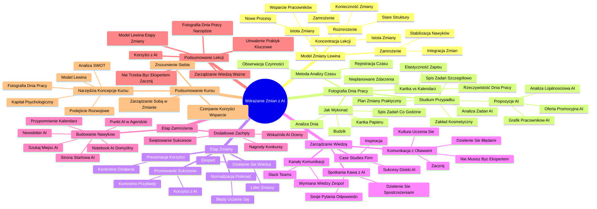

# Lekcje wideo - 2. Proaktywność

# 💡 Diagram

___

# 🗒️ Notatka

# Umiejętności Jutra AI - Wdrażanie Zmian w Organizacji z Wykorzystaniem AI

## Wprowadzenie

Prezentacja dr Joanny Tabor-Błażewicz z SGH, w ramach inicjatywy "Umiejętności Jutra AI" organizowanej przez Google, omawia proces wdrażania zmian w organizacji, ze szczególnym uwzględnieniem wykorzystania sztucznej inteligencji (AI). Lekcja koncentruje się na drugim i trzecim etapie modelu zmiany Kurta Lewina: **istocie zmiany** i **zamrożeniu**, oferując praktyczne narzędzia i strategie.

## Model Zmiany Kurta Lewina

*   **Kurt Lewin**, pionier psychologii społecznej, wyróżnił 3 etapy procesu zmiany:
    1.  **Rozmrożenie (Unfreezing):** Zrozumienie konieczności zmiany, uświadomienie sobie potrzeby odejścia od starych struktur.
    2.  **Istota zmiany (Change):** Wprowadzenie nowych procesów, wspieranie pracowników w adaptacji do zmian.
    3.  **Zamrożenie (Refreezing):** Ustabilizowanie nowych nawyków i procesów, integracja zmian w kulturę organizacyjną.

*   Lekcja koncentruje się na etapach **istoty zmiany** i **zamrożenia**.

## Proaktywne Wprowadzanie Zmian - Fotografia Dnia Pracy 📸

*   **Fotografia dnia pracy:** Metoda analizy wykorzystania czasu pracy.
    *   Szczegółowa obserwacja i rejestracja wszystkich czynności wykonywanych w ciągu dnia pracy wraz z czasem ich trwania.
    *   Narzędzie do przeglądu zadań i identyfikacji obszarów do zmian, szczególnie z wykorzystaniem AI.

*   **Jak wykonać fotografię dnia pracy?**
    1.  Poświęć jeden dzień na analizę i spisanie zadań/czynności wykonywanych co godzinę (lub co 30/15 minut dla zaawansowanych).
    2.  Nastaw budzik ⏰ co godzinę.
    3.  Spisuj czynności na kartce papieru 📝 (lub w notatniku w telefonie 📱).
    4.  Wybierz dzień **standardowy** lub **losowy** w środku sezonu, albo taki, w którym AI może najbardziej wesprzeć.

*   **Dlaczego kartka papieru, a nie kalendarz 📅?**
    *   Rzeczywistość dnia pracy często odbiega od wyobrażeń i planów.
    *   Nieprzewidziane zdarzenia (problemy pracowników, telefony 📞 od klientów) zakłócają harmonogram.
    *   Kartka/notatnik umożliwia elastyczne i szybkie zapisywanie rzeczywistych czynności.

## Studium Przypadku - Fotografia Dnia Pracy w Praktyce

*   **Przykład:** Właścicielka średniego zakładu kosmetycznego.

*   **Krok I - Spisanie zadań (Fotografia Dnia Pracy):**
    *   **Zamiast ogólników, szczegółowe opisy:**
        *   Zamiast: "8:00 - przychodzę do pracy"
        *   Lepiej: "8:00 rozpoczynam pracę, analizuję stan i czystość zakładu, sprawdzam punktualność pracowników."
    *   **Przykładowe zadania:**
        *   9:00 - analiza grafiku na miesiąc, zastępstwa.
        *   10:00 - tworzenie oferty promocyjnej świątecznej (treść, uzgodnienia z pracownikami).
        *   11:00 - tworzenie oferty promocyjnej świątecznej (kontakty z grafikami, opis zamówienia).
        *   12:00 - obiad 🍽️ (często z telefonami/mailami 📧).
        *   13:00 - rozmowy z dostawcami (negocjacje, zamówienia).
        *   14:00 - sprawy finansowe 💰 (faktury, ZUS).
        *   15:00 - spotkanie z pracownikami (grafik, program lojalnościowy - burza mózgów 🧠).
        *   16:00 - podsumowanie dnia, planowanie zadań na jutro.

*   **Krok II - Analiza i Wprowadzenie Zmian z AI:**
    *   Przeanalizuj spisane zadania pod kątem możliwości wykorzystania AI.
    *   **Przykładowe propozycje:**
        1.  **Oferta promocyjna:** Wykorzystanie AI do generowania treści i grafiki.
        2.  **Układanie grafiku pracowników:** Wykorzystanie narzędzi AI do optymalizacji.
        3.  **Analiza programów lojalnościowych konkurencji:** Wykorzystanie AI do analizy i porównania ofert.

*   **Praktyczny plan zmiany:** Wybór konkretnych zadań do optymalizacji z AI.

## Etap Zmiany - Promowanie Sukcesów i Normalizacja Potknięć 👍

*   **Ważne aspekty etapu zmiany:**
    *   **Promuj własne sukcesy:** Pokazuj korzyści z wdrożenia AI na konkretnych przykładach.
    *   **Normalizuj potknięcia:** Błędy są naturalną częścią procesu uczenia się.
    *   **Otwartość na dzielenie się wiedzą:** Buduj pozycję lidera zmiany i eksperta.
    *   **Prezentuj korzyści na konkretnych działaniach:** Udowadniaj wartość AI poprzez wyniki.

*   **Przykłady:**
    *   "Dzięki AI przygotowałem raport w połowie krótszym czasie. Oto jak to zrobiłem."
    *   Organizowanie szkoleń wewnętrznych i dzielenie się wiedzą.

## Zarządzanie Wiedzą w Organizacji w Kontekście Wdrażania AI 💡

*   **Sposoby na zarządzanie wiedzą o AI:**
    1.  **Otwórz spotkania/Kawę ☕ z AI:**
        *   Luźne sesje pytań i odpowiedzi, dzielenie się spostrzeżeniami.
    2.  **Twórz kanały komunikacji (Slack, Teams):**
        *   Wymiana wiedzy o AI w zespole.
    3.  **Informuj o case studies firm, które osiągnęły sukces dzięki AI:**
        *   Inspiracja i pokazanie realnych korzyści.

*   **Komunikacja z osobami z obawami:**
    *   "Nie musisz być ekspertem, wystarczy, że zaczniesz."
    *   Zachęcaj do dzielenia się błędami i wnioskami z eksperymentów.
    *   Buduj kulturę uczenia się i poszukiwania rozwiązań.

## Etap Zamrożenia - Budowanie Nawyków i Utrwalanie Zmian 🧊

*   **Ponowne zamrożenie:** Ustabilizowanie nowych nawyków i procesów w organizacji.
    *   Cel: Utrwalenie nowych praktyk i włączenie ich do codziennej rutyny.
    *   Wprowadzenie zmian na stałe jest trudne, efekt nowości mija.
    *   Powrót do starych nawyków jest kuszący, ale warto wytrwać.

*   **Sposoby na budowanie nawyków:**
    *   Ustaw stronę startową przeglądarki na narzędzie AI.
    *   Ustaw notebook AI jako domyślny notatnik.
    *   Dodaj przypomnienie w kalendarzu 📅: "Sprawdź, czy AI może pomóc w dzisiejszym zadaniu."
    *   Aktywnie szukaj miejsc, gdzie AI może pomóc w codziennych zadaniach.
    *   Regularnie informuj o nowościach ze świata AI (newsletter 📰).
    *   Wprowadź punkt "AI" do agendy cotygodniowych spotkań zespołu.

*   **Dodatkowe zachęty:**
    *   Wskaźniki AI w kryteriach oceniania pracowników.
    *   Nagrody 🏆 i konkursy zespołowe (np. "Najlepszy pomysł na wykorzystanie AI").
    *   Świętowanie małych sukcesów zespołu związanych z AI 🎉.

## Podsumowanie Lekcji

*   Lekcja dotyczyła aktywnego wdrażania zmian w organizacji z wykorzystaniem AI.
*   Przedstawiono narzędzie **fotografii dnia pracy** do analizy zadań i identyfikacji obszarów do optymalizacji z AI.
*   Omówiono **model zmiany Lewina** (`rozmrożenie`, `zmiana`, `zamrożenie`) z naciskiem na etap zmiany i zamrożenia.
*   Kluczowe jest **utrwalenie nowych praktyk** i **budowanie nawyków** związanych z wykorzystaniem AI.
*   Warto skupić się na **korzyściach** z wdrożenia AI (osobistych i firmowych) i **promować sukcesy**.
*   Należy **upewniać siebie i innych**, że zmiana jest trwała i przynosi przewagę konkurencyjną.
*   Ważne jest **zarządzanie wiedzą** o AI w organizacji poprzez otwarte spotkania, kanały komunikacji i dzielenie się case studies.
*   **Nie trzeba być ekspertem, aby zacząć** korzystać z AI i wdrażać zmiany.

## Podsumowanie Całości Kursu (Implikowane z Końcówki Transkryptu)

*   Kurs dotyczył zarządzania sobą w procesie zmiany wynikającej z wdrożenia AI.
*   Przedstawiono narzędzia i koncepcje: analiza SWOT, kapitał psychologiczny, podejście rozwojowe, model Lewina, fotografia dnia pracy.
*   Kluczowe jest zrozumienie siebie, swoich kompetencji, emocji, aby budować odpowiednie postawy w procesie zmian.
*   Celem jest czerpanie korzyści z zmian i wspieranie współpracowników w tym procesie.

___

# 🔉 Transcript
File: Lekcje wideo - 2. Proaktywność.mp4 
[00:00:00] Ekran: Białe tło.
[00:00:05] Ekran: Napis "Umiejętności Jutra AI". Pod spodem napisy "Organizator: Google" i "Partner edukacyjny: SGH".
[00:00:05] Ekran: Kobieta w okularach siedzi za biurkiem. W tle widoczny znak Google. Pod spodem napis "Joanna Tabor-Błażewicz".
[00:00:05] dr Joanna Tabor-Błażewicz. Adiunkt w Zakładzie Strategii Personalnych w Instytucie Zarządzania + Szkoła Główna Handlowa w Warszawie.
[00:00:05] Z daniem Kurta Lewina, jednego z pionierów psychologii społecznej, proces zmiany następuje w trzech etapach.
[00:00:11] Ekran: Slajd prezentacji. Tytuł: "Proces zmiany wg Kurta Lewina".
[00:00:11] 01 Rozmrożenie = zrozumienie konieczności zmiany.
[00:00:11] 02 Istota zmiany = wprowadzenie nowych procesów i wspieranie pracowników.
[00:00:11] 03 Zamrożenie = ustabilizowanie w nowych nawykach i procesach.
[00:00:12] Pierwszy to tak zwane rozmrożenie, w którym w organizacji następuje rozumienie konieczności zmiany.
[00:00:19] Mówiąc kolokwialnie, rozmrażamy stare struktury, aby w ich miejsce zbudować nowe.
[00:00:27] Na tym etapie ważna jest samoświadomość i akceptacja, o której mówiłam w poprzedniej lekcji.
[00:00:34] Drugi etap to sama istota zmiany, a więc wprowadzenie nowych procesów, ale też wspieranie pracowników w tej zmianie.
[00:00:44] Często uczymy się przez naśladowanie, obserwowanie jak robią to inni.
[00:00:49] Trzeci istotny etap to zamrożenie, czyli zintegrowanie zmian, zachowanie ich, ustabilizowanie w nowych nawykach, procesach.
[00:01:00] Celem tej lekcji jest omówienie drugiego i trzeciego etapu, a więc wprowadzenia zmiany i jej ustabilizowania w organizacji.
[00:01:11] Aby wiedzieć od czego zacząć, gdzie wprowadzać zmiany w codziennej aktywności zawodowej, możecie dokonać przeglądu swojego układu zadań w pracy.
[00:01:22] Przeanalizować czas poświęcany na zadania, czyli stworzyć tak zwaną fotografię dnia pracy.
[00:01:25] Ekran: Slajd prezentacji. Tytuł: "Jak proaktywnie wprowadzać zmiany?".
[00:01:25] "Fotografia dnia pracy to metoda badania i analizy wykorzystania czasu pracy. Polega ona na szczegółowej obserwacji i rejestracji wszystkich czynności wykonywanych w ciągu pracy wraz z czasem ich trwania."
[00:01:25] "Poświęć jeden dzień na analizę i spisanie zadań lub czynności, które wykonujesz w każdej godzinie pracy - możesz to robić co godzinę, co 30 lub 15 minut."
[00:01:25] "Nastaw budzik co godzinę."
[00:01:25] "Czynności spisuj na kartce papieru."
[00:01:25] "Nasze wyobrażenie co do harmonogramu są inne niż w rzeczywistości."
[00:01:29] Jest to narzędzie w ramach którego poświęcacie jeden dzień na analizę i spisanie zadań lub czynności, które wykonujecie w każdej godzinie pracy.
[00:01:38] Dla zaawansowanych może to być wersja spisywana co 30 minut, a nawet co 15 minut.
[00:01:46] Narzędzie wymaga nastawienia budzika w odstępach cogodzinnych, przygotowania kartki papieru z zaznaczonymi godzinami i spisania dokładnie co robisz w danej chwili.
[00:01:58] Część z was może pomyśleć, po co kartka papieru?
[00:02:02] Przecież mam to w kalendarzu, mogę to wydrukować.
[00:02:05] Jednak nasze wyobrażenia co do dnia są często inne niż to wygląda w rzeczywistości.
[00:02:11] Wchodzi pracownik z jakimś problemem, dzwoni klient, że faktura nie przeszła i tym podobne.
[00:02:17] Wtedy spisywanie na kartce lub w notatniku w telefonie jest odpowiednie.
[00:02:23] Ekran: Slajd prezentacji. Tytuł: "Case study - krok I".
[00:02:23] 8:00 - przychodzę do pracy.
[00:02:23] Przykład fotografii dnia pracy.
[00:02:25] Właścicielka średniego zakładu kosmetycznego, zatrudniająca dwie kosmetyczki i jedną masażystkę.
[00:02:33] 8:00 przychodzę do pracy.
[00:02:36] Zamiast takiego sformułowania, mogę zapisać 8:00 rozpoczynam pracę, analizuję stan i czystość zakładu, sprawdzam punktualność pracowników.
[00:02:48] 9:00 analiza grafiku na ten miesiąc. Układ zastępstw.
[00:02:53] 10:00 tworzenie oferty promocyjnej świątecznej. Treść, uzgodnienia z pracownikami.
[00:03:00] 11:00 tworzenie oferty promocyjnej świątecznej - kontakty z grafikami, opis zamówienia.
[00:03:07] 12:00 obiad, często może się zdarzyć, że w trakcie dzwonimy do klienta, czy też odpowiadamy na maile.
[00:03:16] 13:00 rozmowy telefoniczne z dostawcami produktów kosmetycznych, negocjacje, zamówienia.
[00:03:22] 14:00 sprawy finansowe, faktury, ZUS itd.
[00:03:27] 15:00 spotkanie z pracownikami w sprawie grafiku oraz programu lojalnościowego dla klientek, burza mózgów.
[00:03:36] 16:00 podsumowanie dnia, zaplanowanie zadań na jutro.
[00:03:42] Być może w głowach pojawia się pytanie, który dzień wybrać?
[00:03:46] Jak do tego podejść praktycznie?
[00:03:48] Wyobrażam sobie, że mogą na kursie być osoby, których każdy dzień wygląda inaczej.
[00:03:53] Jednak zgodnie z zasadami tej metody wybieramy dzień najbardziej standardowy, uśredniony.
[00:04:00] Jeżeli nadal jest to dla was trudne, proponuję wybrać losowy dzień w środku sezonu, albo taki, w którym przeczuwamy, że AI najbardziej może mnie wesprzeć.
[00:04:12] Jakie kroki podejmujemy dalej?
[00:04:14] Ekran: Slajd prezentacji. Tytuł: "Case study - krok II".
[00:04:14] W kolejnym dniu przeanalizuj wypisane zadania na podstawie zdobytej na szkoleniu wiedzy i zdecyduj, które zadania możesz zrobić szybciej lub lepiej z wykorzystaniem poznanych narzędzi np.
[00:04:14] 01 do stworzenie oferty promocyjnej wykorzystaj AI - treść i grafikę wygeneruj z pomocą narzędzi AI.
[00:04:14] 02 do ułożenia grafiku pracowników wykorzystaj narzędzia AI.
[00:04:14] 03 analiza konkurencyjnych programów lojalnościowych oraz porównanie z własną ofertą z wykorzystaniem AI.
[00:04:14] W kolejnym dniu należy przeanalizować wypisane zadania i na tej podstawie zdecydować, które zadania mogę robić szybciej lub lepiej z wykorzystaniem poznanych na kursie narzędzi.
[00:04:31] Propozycja pierwsza, stworzenie oferty promocyjnej, treść i grafika z wykorzystaniem AI.
[00:04:38] Propozycja druga, układanie grafiku z wykorzystaniem dedykowanych programów.
[00:04:45] Propozycja trzecia, analiza i podsumowanie przez AI dostępnych w internecie programów lojalnościowych, aby porównać je z naszą ofertą.
[00:04:54] Dzięki temu możecie stworzyć praktyczny plan dokonania zmiany, czyli wybrać zadania, w których zaczniecie stosować narzędzia poznane na kursie.
[00:05:06] Ekran: Slajd prezentacji.
[00:05:06] Promuj własne sukcesy.
[00:05:06] Normalizuj potknięcia.
[00:05:06] Otwartość na dzielenie się wiedzą.
[00:05:06] Prezentuj korzyści na konkretnych działaniach.
[00:05:06] W etapie zmiany warto promować swoje sukcesy, ale też normalizować ewentualne porażki czy potknięcia.
[00:05:15] Dotyczy to z jednej strony dalszej pracy nad swoimi postawami, ale też działań, które mogą sprawić, że będziecie postrzegani w swoich organizacjach jako liderzy zmiany, osoby posiadające większą wiedzę, eksperci w tym obszarze.
[00:05:32] Zachęcam, żeby prezentować otwartą postawę, nastawioną na dzielenie się wiedzą.
[00:05:39] Jednak należy pamiętać, że możecie spotkać się wielokrotnie z komentarzami, postawami osób negatywnie nastawionych.
[00:05:48] Warto wówczas odwołać się do różnego rodzaju emocji, które omawiałam w poprzedniej lekcji.
[00:05:55] Gdy wdrożycie nowe narzędzia do swoich zadań, możecie pokazać korzyści na konkretnym własnym przykładzie.
[00:06:03] Na przykład, dzięki AI przygotowałam raport w połowie krótszym czasie.
[00:06:09] Oto jak to zrobiłam.
[00:06:11] Możecie również zorganizować szkolenie wewnętrzne, aby dzielić się wiedzą.
[00:06:16] Możecie pokazać otwartość, gdyby ktoś chciał coś dopytać.
[00:06:21] Ekran: Slajd prezentacji. Tytuł: "Zarządzanie wiedzą w organizacji".
[00:06:21] 01 Otwórz spotkania lub kawę z AI - luźne sesje, podczas których można zadawać pytania i dzielić się spostrzeżeniami.
[00:06:21] 02 Twórz kanały komunikacji, gdzie zespół może wymieniać się wiedzą o sztucznej inteligencji.
[00:06:21] 03 Informowanie współpracowników o przypadkach firm, które osiągnęły sukces dzięki AI.
[00:06:21] W kontekście zarządzania wiedzą w organizacji warto zaproponować.
[00:06:27] Zorganizować otwarte spotkanie lub tak zwaną kawę z AI.
[00:06:32] Jakieś luźne sesje, podczas których można zadawać pytania, dzielić się swoimi spostrzeżeniami, komentarzami.
[00:06:40] Można również stworzyć kanały komunikacji, na przykład na Slacku czy Teams, gdzie zespół może wymieniać się wiedzą o AI.
[00:06:50] Można także zamieszczać realne case studies firm, które osiągnęły sukces dzięki zastosowaniu AI.
[06:58] Dla osób, które nadal mają obawy, warto komunikować się otwarcie.
[07:04] Nie musisz być ekspertem.
[07:07] Wystarczy, że zaczniesz.
[07:09] Można wręcz zachęcać do dzielenia się błędami i wnioskami z eksperymentów.
[07:13] Nie udało ci się? Okej.
[07:18] Dopiero zaczynamy.
[07:20] Przynajmniej wiemy czego unikać.
[07:21] Może teraz poszukamy jakiegoś innego rozwiązania?
[07:25] Ekran: Slajd prezentacji. Tytuł: "Budowanie nawyków".
[07:25] Ponowne zamrożenie, czyli ustabilizowanie nowych nawyków w organizacji. Celem jest utrwalenie nowych praktyk, dlatego warto, aby stały się częścią codziennej rutyny.
[07:25] Ustaw stronę startową przeglądarki na narzędzie AI, z którego najczęściej korzystasz.
[07:25] Notebook AI ustaw jako domyślny notatnik.
[07:25] Dodaj stałe przypomnienie do kalendarza w stylu: Sprawdź, czy AI może pomóc w dzisiejszym zadaniu.
[07:25] Szukaj miejsc, gdzie AI może pomóc: Przygotowujemy raport? Czy AI może nam pomóc w analizie danych lub wizualizacji wyników?
[07:25] Regularnie informuj, jakie są nowe i ważne informacje ze świata AI, które mogą wpłynąć na Waszą pracę albo rozsyłaj newsletter.
[07:25] Wprowadź AI jako punkt agendy w cotygodniowych spotkaniach zespołu.
[07:26] Trzeci etap w modelu Lewina to ponowne zamrożenie, czyli ustabilizowanie nowych nawyków w organizacji.
[07:35] Celem jest tu oczywiście utrwalenie nowych praktyk.
[07:40] Wprowadzenie nowego podejścia na stałe nigdy nie jest łatwe.
[07:44] Na początku działa na nas efekt nowości.
[07:48] Chcemy wypróbować jakieś narzędzie, jesteśmy ciekawi co z tego wyniknie.
[07:53] Czy faktycznie odczujemy więcej satysfakcji, albo zaoszczędzimy czas, albo zyskamy jeszcze w jakiś inny sposób?
[00:08:01] Natomiast może się zdarzyć, że po takich próbach wracamy do tego co nam znane.
[08:07] Co wypracowane od dawna, co swojskie i często też łatwiejsze, bo nie wymaga zastosowania nowej wiedzy.
[08:17] W ustabilizowaniu zmian pomaga, gdy stają się częścią codziennej rutyny.
[08:20] Na przykład, możecie ustawić stronę startową przeglądarki na narzędzie AI, z którego najczęściej korzystacie.
[08:22] Musicie ustawić notebook jako swój domyślny notatnik.
[08:24] Możecie dodać stałe przypomnienie do kalendarza.
[08:25] Sprawdź, czy AI może pomóc w dzisiejszym zadaniu.
[08:29] Możecie szukać miejsc, gdzie AI może pomóc.
[08:31] Przygotowujemy raport?
[08:33] Czy AI może nam pomóc w analizie danych lub wizualizacji wyników?
[08:41] Regularnie informujcie jakie są nowe i ważne informacje ze świata AI, które mogą wpłynąć na waszą pracę.
[08:51] A może warto rozsyłać newsletter?
[08:54] Można wprowadzić AI jako punkt agendy w cotygodniowych spotkaniach zespołu.
[01:00:01] Można także dodać nieco mocniejsze zachęty.
[01:00:05] Na przykład pewne wskaźniki do kryteriów oceniania pracowników, albo dawać nagrody.
[01:00:13] Prowadzić konkursy zespołowe.
[01:00:16] Na przykład najlepszy pomysł na wykorzystanie AI w pracy w tym miesiącu wygrywa nagrodę.
[01:00:22] Świętować małe sukcesy zespołu.
[01:00:25] Na przykład dzięki AI nasza prezentacja była gotowa w dwa razy krótszym czasie.
[01:00:31] W dzisiejszej lekcji zajmowaliśmy się kwestią aktywnego wdrożenia zmian w organizacji.
[01:00:38] Poznaliście narzędzie zwane fotografią dnia pracy, która pomaga w analizie konkretnych zadań, w których możecie wykorzystać narzędzia sztucznej inteligencji.
[01:00:48] Taką fotografię dnia pracy mogą również przeprowadzić wasi współpracownicy.
[01:00:53] Dodatkowo przeanalizowaliśmy model wprowadzania zmiany Lewina, który mówi o trzech etapach.
[01:01:00] Rozmrożenia starych zasad i przyzwyczajeń, dokonania zmiany i ponownego zamrożenia, a więc ustabilizowania nowych nawyków.
[01:01:11] Celem jest tu oczywiście utrwalenie nowych praktyk.
[01:01:17] Wprowadzenie nowego podejścia na stałe nigdy nie jest łatwe.
[01:01:24] Na początku działa na nas efekt nowości.
[01:01:29] Chcemy wypróbować jakieś narzędzie, jesteśmy ciekawi co z tego wyniknie.
[01:01:35] Czy faktycznie odczujemy więcej satysfakcji, albo zaoszczędzimy czas, albo zyskamy jeszcze w jakiś inny sposób?
[01:01:45] Natomiast może się zdarzyć, że po takich próbach wracamy do tego co nam znane.
[01:01:51] Co wypracowane od dawna, co swojskie i często też łatwiejsze, bo nie wymaga zastosowania nowej wiedzy.
[01:02:00] Dotyczy to zarówno uczestniczących w kursie, czyli was, jak i waszych współpracowników.
[01:02:10] W tym procesie warto z jednej strony upewniać siebie i innych, że zmiana jest stała.
[01:02:20] Skoro już spróbowaliśmy i wyszliśmy poza sferę komfortu, ale też w kierunku zyskania przewagi konkurencyjnych nad innymi, po co się cofać?
[01:02:30] Z drugiej strony warto skupiać się na korzyściach osobistych i firmowych, które czerpiemy ze zmian.
[01:02:40] Na przykład, dzięki AI dziś zaoszczędziłem 30 minut na pisaniu raportu.
[01:02:47] Możecie zorganizować szkolenie wewnętrzne, aby dzielić się wiedzą.
[01:02:51] Możecie pokazać otwartość, gdyby ktoś chciał coś dopytać.
[01:03:00] W kontekście zarządzania wiedzą w organizacji, możecie na przykład zorganizować otwarte spotkanie lub tak zwaną kawę z AI.
[01:03:20] Jakieś luźne sesje, podczas których można zadawać pytania, dzielić się swoimi spostrzeżeniami, komentarzami.
[01:03:40] Można również stworzyć kanały komunikacji, na przykład na Slacku czy Teams, gdzie zespół może wymieniać się wiedzą o AI.
[01:03:50] Można także zamieszczać realne case studies firm, które osiągnęły sukces dzięki zastosowaniu AI.
[01:04:00] Dla osób, które nadal mają obawy, warto komunikować się otwarcie.
[01:04:06] Nie musisz być ekspertem.
[01:04:10] Wystarczy, że zaczniesz.
[01:04:13] Można wręcz zachęcać do dzielenia się błędami i wnioskami z eksperymentów.
[01:04:17] Nie udało ci się? Okej.
[01:04:20] Dopiero zaczynamy.
[01:04:23] Przynajmniej wiemy czego unikać.
[01:04:25] Może teraz poszukamy jakiegoś innego rozwiązania?
[01:04:54] Ekran: Slajd prezentacji.
[01:04:54] Promuj własne sukcesy.
[01:04:54] Normalizuj potknięcia.
[01:04:54] Otwartość na dzielenie się wiedzą.
[01:04:54] Prezentuj korzyści na konkretnych działaniach.
[01:04:54] W etapie zmiany warto promować swoje sukcesy, ale też normalizować ewentualne porażki czy potknięcia.
[01:05:15] Dotyczy to z jednej strony dalszej pracy nad swoimi postawami, ale też działań, które mogą sprawić, że będziecie postrzegani w swoich organizacjach jako liderzy zmiany, osoby posiadające większą wiedzę, eksperci w tym obszarze.
[01:05:32] Zachęcam, żeby prezentować otwartą postawę, nastawioną na dzielenie się wiedzą.
[01:05:39] Jednak należy pamiętać, że możecie spotkać się wielokrotnie z komentarzami, postawami osób negatywnie nastawionych.
[01:05:48] Warto wówczas odwołać się do różnego rodzaju emocji, które omawiałam w poprzedniej lekcji.
[01:06:21] Ekran: Slajd prezentacji. Tytuł: "Zarządzanie wiedzą w organizacji".
[01:06:21] 01 Otwórz spotkania lub kawę z AI - luźne sesje, podczas których można zadawać pytania i dzielić się spostrzeżeniami.
[01:06:21] 02 Twórz kanały komunikacji, gdzie zespół może wymieniać się wiedzą o sztucznej inteligencji.
[01:06:21] 03 Informowanie współpracowników o przypadkach firm, które osiągnęły sukces dzięki AI.
[01:06:21] W kontekście zarządzania wiedzą w organizacji warto zaproponować.
[01:06:27] Zorganizować otwarte spotkanie lub tak zwaną kawę z AI.
[01:06:32] Jakieś luźne sesje, podczas których można zadawać pytania, dzielić się swoimi spostrzeżeniami, komentarzami.
[01:06:40] Można również stworzyć kanały komunikacji, na przykład na Slacku czy Teams, gdzie zespół może wymieniać się wiedzą o AI.
[01:06:50] Można także zamieszczać realne case studies firm, które osiągnęły sukces dzięki zastosowaniu AI.
[01:06:58] Dla osób, które nadal mają obawy, warto komunikować się otwarcie.
[01:07:04] Nie musisz być ekspertem.
[01:07:07] Wystarczy, że zaczniesz.
[01:07:09] Można wręcz zachęcać do dzielenia się błędami i wnioskami z eksperymentów.
[01:07:13] Nie udało ci się? Okej.
[01:07:17] Dopiero zaczynamy.
[01:07:20] Przynajmniej wiemy czego unikać.
[01:07:21] Może teraz poszukamy jakiegoś innego rozwiązania?
[01:07:25] Ekran: Slajd prezentacji. Tytuł: "Budowanie nawyków".
[07:25] Ponowne zamrożenie, czyli ustabilizowanie nowych nawyków w organizacji. Celem jest utrwalenie nowych praktyk, dlatego warto, aby stały się częścią codziennej rutyny.
[07:25] Ustaw stronę startową przeglądarki na narzędzie AI, z którego najczęściej korzystasz.
[07:25] Notebook AI ustaw jako domyślny notatnik.
[07:25] Dodaj stałe przypomnienie do kalendarza w stylu: Sprawdź, czy AI może pomóc w dzisiejszym zadaniu.
[07:25] Szukaj miejsc, gdzie AI może pomóc: Przygotowujemy raport? Czy AI może nam pomóc w analizie danych lub wizualizacji wyników?
[07:25] Regularnie informuj, jakie są nowe i ważne informacje ze świata AI, które mogą wpłynąć na Waszą pracę albo rozsyłaj newsletter.
[07:25] Wprowadź AI jako punkt agendy w cotygodniowych spotkaniach zespołu.
[07:26] Trzeci etap w modelu Lewina to ponowne zamrożenie, czyli ustabilizowanie nowych nawyków w organizacji.
[07:35] Celem jest tu oczywiście utrwalenie nowych praktyk.
[07:40] Wprowadzenie nowego podejścia na stałe nigdy nie jest łatwe.
[07:44] Na początku działa na nas efekt nowości.
[07:48] Chcemy wypróbować jakieś narzędzie, jesteśmy ciekawi co z tego wyniknie.
[07:53] Czy faktycznie odczujemy więcej satysfakcji, albo zaoszczędzimy czas, albo zyskamy jeszcze w jakiś inny sposób?
[08:01] Natomiast może się zdarzyć, że po takich próbach wracamy do tego co nam znane.
[08:07] Co wypracowane od dawna, co swojskie i często też łatwiejsze, bo nie wymaga zastosowania nowej wiedzy.
[08:17] W ustabilizowaniu zmian pomaga, gdy stają się częścią codziennej rutyny.
[08:20] Na przykład możecie ustawić stronę startową przeglądarki na narzędzie AI, z którego najczęściej korzystacie.
[08:22] Musicie ustawić notebook jako swój domyślny notatnik.
[08:24] Możecie dodać stałe przypomnienie do kalendarza.
[08:25] Sprawdź, czy AI może pomóc w dzisiejszym zadaniu.
[08:29] Możecie szukać miejsc, gdzie AI może pomóc.
[08:31] Przygotowujemy raport?
[08:33] Czy AI może nam pomóc w analizie danych lub wizualizacji wyników?
[08:41] Regularnie informujcie jakie są nowe i ważne informacje ze świata AI, które mogą wpłynąć na waszą pracę.
[08:51] A może warto rozsyłać newsletter?
[08:54] Można wprowadzić AI jako punkt agendy w cotygodniowych spotkaniach zespołu.
[01:00:01] Można także dodać nieco mocniejsze zachęty.
[01:00:05] Na przykład pewne wskaźniki do kryteriów oceniania pracowników, albo dawać nagrody.
[01:00:13] Prowadzić konkursy zespołowe.
[01:00:16] Na przykład najlepszy pomysł na wykorzystanie AI w pracy w tym miesiącu wygrywa nagrodę.
[01:00:22] Świętować małe sukcesy zespołu.
[01:00:25] Na przykład dzięki AI nasza prezentacja była gotowa w dwa razy krótszym czasie.
[01:00:31] W dzisiejszej lekcji zajmowaliśmy się kwestią aktywnego wdrożenia zmian w organizacji.
[01:00:38] Poznaliście narzędzie zwane fotografią dnia pracy, która pomaga w analizie konkretnych zadań, w których możecie wykorzystać narzędzia sztucznej inteligencji.
[01:00:48] Taką fotografię dnia pracy mogą również przeprowadzić wasi współpracownicy.
[01:00:53] Dodatkowo przeanalizowaliśmy model wprowadzania zmiany Lewina, który mówi o trzech etapach.
[01:01:00] Rozmrożenia starych zasad i przyzwyczajeń, dokonania zmiany i ponownego zamrożenia, a więc ustabilizowania nowych nawyków.
[01:01:11] Celem jest tu oczywiście utrwalenie nowych praktyk.
[01:01:17] Wprowadzenie nowego podejścia na stałe nigdy nie jest łatwe.
[01:01:24] Na początku działa na nas efekt nowości.
[01:01:29] Chcemy wypróbować jakieś narzędzie, jesteśmy ciekawi co z tego wyniknie.
[01:01:35] Czy faktycznie odczujemy więcej satysfakcji, albo zaoszczędzimy czas, albo zyskamy jeszcze w jakiś inny sposób?
[01:01:45] Natomiast może się zdarzyć, że po takich próbach wracamy do tego co nam znane.
[01:01:51] Co wypracowane od dawna, co swojskie i często też łatwiejsze, bo nie wymaga zastosowania nowej wiedzy.
[01:02:00] Dotyczy to zarówno uczestniczących w kursie, czyli was, jak i waszych współpracowników.
[01:02:10] W tym procesie warto z jednej strony upewniać siebie i innych, że zmiana jest stała.
[01:02:20] Skoro już spróbowaliśmy i wyszliśmy poza sferę komfortu, ale też w kierunku zyskania przewagi konkurencyjnych nad innymi, po co się cofać?
[01:02:30] Z drugiej strony warto skupiać się na korzyściach osobistych i firmowych, które czerpiemy ze zmian.
[01:02:40] Na przykład, dzięki AI dziś zaoszczędziłem 30 minut na pisaniu raportu.
[01:02:47] Ekran: Kobieta w okularach siedzi za biurkiem. W tle widoczny znak Google.
[01:02:47] W tych lekcjach odpowiedzieliśmy na pytanie jak zarządzać sobą w procesie zmiany, wynikającej z wdrożenia sztucznej inteligencji w organizacji.
[01:03:37] Pokazane zostały nowe narzędzia i koncepcje, które mogą być wykorzystane w procesie zmiany, takie jak analiza SWOT, koncepcja kapitału psychologicznego, podejście rozwojowe, model Lewina czy fotografia dnia pracy.
[01:03:51] Zrozumienie siebie, swoich kompetencji, mocnych i słabych stron.
[01:03:57] Rozpoznanie emocji pozwala na zbudowanie odpowiednich postaw w procesie zmian.
[01:04:11] Aby z jednej strony czerpać korzyści dla siebie, a z drugiej być wsparciem dla swoich współpracowników.
[01:04:54] Ekran: Slajd prezentacji.
[01:04:54] Promuj własne sukcesy.
[01:04:54] Normalizuj potknięcia.
[01:04:54] Otwartość na dzielenie się wiedzą.
[01:04:54] Prezentuj korzyści na konkretnych działaniach.
[01:05:06] W etapie zmiany warto promować swoje sukcesy, ale też normalizować ewentualne porażki czy potknięcia.
[01:05:15] Dotyczy to z jednej strony dalszej pracy nad swoimi postawami, ale też działań, które mogą sprawić, że będziecie postrzegani w swoich organizacjach jako liderzy zmiany, osoby posiadające większą wiedzę, eksperci w tym obszarze.
[01:05:32] Zachęcam, żeby prezentować otwartą postawę, nastawioną na dzielenie się wiedzą.
[01:05:39] Jednak należy pamiętać, że możecie spotkać się wielokrotnie z komentarzami, postawami osób negatywnie nastawionych.
[01:05:48] Warto wówczas odwołać się do różnego rodzaju emocji, które omawiałam w poprzedniej lekcji.
[01:06:21] Ekran: Slajd prezentacji. Tytuł: "Zarządzanie wiedzą w organizacji".
[01:06:21] 01 Otwórz spotkania lub kawę z AI - luźne sesje, podczas których można zadawać pytania i dzielić się spostrzeżeniami.
[01:06:21] 02 Twórz kanały komunikacji, gdzie zespół może wymieniać się wiedzą o sztucznej inteligencji.
[01:06:21] 0

___
# 🏷️ Tags
#Umiejętności_Jutra_AI #wdrażanie_AI #zmiana_w_organizacji #sztuczna_inteligencja #AI #dr_Joanna_Tabor-Błażewicz #SGH #Google #model_zmiany_Lewina #Kurt_Lewin #rozmrożenie #istota_zmiany #zamrożenie #proaktywne_zmiany #fotografia_dnia_pracy #analiza_czasu_pracy #rejestracja_czynności #plan_dnia_pracy #standardowy_dzień_pracy #przypadek_kosmetyczny #analiza_zadań #optymalizacja_AI #oferta_promocyjna #grafik_pracowników #programy_lojalnościowe #promowanie_sukcesów #normalizacja_potknięć #dzielenie_się_wiedzą #lider_zmiany #ekspert_AI #zarządzanie_wiedzą #spotkania_z_AI #kanały_komunikacji #Slack #Teams #case_studies_AI #komunikacja_z_obawami #budowanie_nawyków #utrwalanie_zmian #strona_startowa_AI #notebook_AI #przypomnienie_w_kalendarzu #newsletter_AI #agenda_spotkań #wskaźniki_AI #kryteria_oceniania #nagrody_AI #konkursy_zespołowe #świętowanie_sukcesów #przewaga_konkurencyjna #analiza_SWOT #kapitał_psychologiczny #podejście_rozwojowe #kompetencje #emocje #wsparcie_współpracowników #zarządzanie_sobą #zmiana #adaptacja #efekt_nowości #satysfakcja_z_pracy #oszczędność_czasu #szkolenia_wewnętrzne #otwartość #negatywne_nastawienie #dzielenie_się_błędami #wnioski_z_eksperymentów #rozwiązywanie_problemów #codzienna_rutyna #wizualizacja_wyników #wiedza_o_AI #rozpoznawanie_emocji #budowanie_postaw #korzyści_osobiste #korzyści_firmowe #akceptacja #samoświadomość
