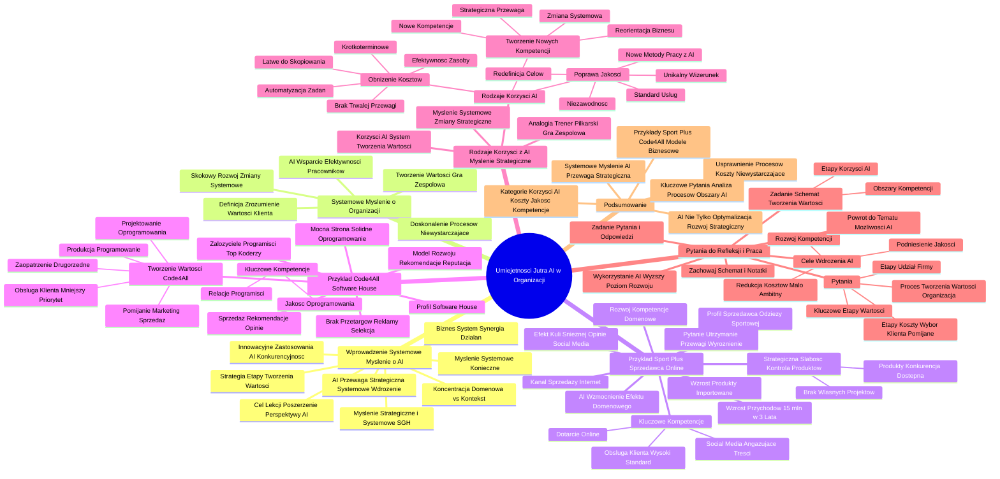

# Lekcje wideo - 1. Tworzenie wartości w firmie

# 💡 Diagram

___

# 🗒️ Notatka

# Umiejętności Jutra: Wykorzystanie AI w Organizacji - Notatki i Podsumowanie

## Wprowadzenie: Systemowe Myślenie o AI w Biznesie

* Celem lekcji jest poszerzenie perspektywy na wykorzystanie **sztucznej inteligencji (AI)** w organizacji.
* Wykładowca SGH uczy strategicznego i systemowego myślenia praktyków biznesu oraz studentów.
* Często obserwuje się tendencję do koncentracji na zadaniach w obrębie własnej domeny, z pominięciem szerszego kontekstu.
* **Biznes to system**: wartość dla klienta jest wynikiem synergii działań zespołów wewnątrz i na zewnątrz organizacji.
* **Kluczowa strategia**:  określenie, które etapy tworzenia wartości realizować samodzielnie, a które zlecić partnerom, aby zmaksymalizować zysk.
* **AI w organizacji wspiera osiągnięcie strategicznej przewagi**, ale kluczowe jest **systemowe wdrożenie**.
* Lekcja koncentruje się na innowacyjnych zastosowaniach **AI**, które mogą uczynić biznes **strategicznie bardziej konkurencyjnym**, wykraczając poza  proste usprawnienia.
* Konieczność przejścia na **myślenie systemowe**.

## Systemowe Myślenie o Organizacji

* **Systemowe myślenie o organizacji**: to zrozumienie procesu tworzenia wartości dla klienta w biznesie i identyfikacja czynników, które na nią wpływają.
* **Tworzenie wartości w przedsiębiorstwie to gra zespołowa (system)**: każdy dział i pracownik przyczynia się do dostarczenia klientowi oczekiwanej wartości.
* AI może wspierać pracowników w efektywniejszym wykonywaniu zadań w ich obszarach.
* **Skokowy rozwój firmy wymaga zmian systemowych**:  restrukturyzacji organizacji i inicjowania nowych przedsięwzięć.
* Samo doskonalenie istniejących procesów jest niewystarczające do osiągnięcia wyższego poziomu rozwoju.

## Przykład Sport Plus: Sprzedawca Odzieży Sportowej Online 🛍️

* **Sport Plus**: internetowy sprzedawca specjalistycznej odzieży sportowej.
    * Kanał sprzedaży: Internet 🌐.
    * Wzrost przychodów: do 15 mln zł w 3 lata.
    * Kluczowe kompetencje:
        * Skuteczne dotarcie do grupy docelowej online.
        * Angażujące treści w mediach społecznościowych 📱.
        * Wysoki standard obsługi klienta 🤝.
* Wzrost napędzany sprzedażą produktów importowanych od zewnętrznych producentów.
* **Efekt kuli śnieżnej**: pozytywne opinie i komunikacja w mediach społecznościowych ułatwiają akwizycję klientów.
* AI może wzmocnić ten efekt w obrębie poszczególnych domen.
* **Strategiczna słabość**: ograniczona kontrola nad oferowanymi produktami.
    * Produkty od zewnętrznych dostawców, dostępne również dla konkurencji.
    * Brak własnych projektów odzieży i umów na wyłączność z dostawcami.
* Dotychczasowy rozwój oparty na **doskonaleniu kompetencji domenowych** (marketing internetowy i sprzedaż).
* **Pytanie**: Czy to wystarczy, aby utrzymać przewagę konkurencyjną wobec firm kopiujących dobre praktyki i dostrzegających potencjał AI? Jak wyróżnić się w dłuższej perspektywie?

## Przykład Code4All: Software House 💻

* **Code4All**: Software house.
    * Model rozwoju odmienny niż Sport Plus.
    * Rozwój oparty na rekomendacjach i pozytywnej reputacji.
    * Kluczowe kompetencje:
        * Budowanie relacji z najlepszymi programistami.
        * Dostarczanie oprogramowania wysokiej jakości.
* Mocna strona: **solidne oprogramowanie**.
* Założyciele: doświadczeni programiści, zatrudniający topowych koderów i budujący trwałe relacje.
* Sprzedaż oparta na **rekomendacjach i opinii**.
* Brak udziału w przetargach i działań reklamowych. Selektywny wybór klientów.
* **Tworzenie wartości w Code4All**:
    * Koncentracja na **projektowaniu** i **produkcji (programowaniu)** oprogramowania.
    * Mniejszy priorytet dla **obsługi klienta**.
    * Zaopatrzenie w licencje traktowane jako element drugorzędny.
    * **Świadome pomijanie marketingu i sprzedaży**.

## Rodzaje Korzyści z Wdrożenia AI i Myślenie Strategiczne 💡

* **Myślenie systemowe** stwarza możliwości **strategicznych zmian** w całej organizacji, a nie tylko w jej wybranych obszarach.
* **Analogia do trenera piłkarskiego ⚽**: doskonalenie indywidualnych umiejętności zawodników to za mało, kluczowa jest gra zespołowa.
* Korzyści z AI należy identyfikować nie tylko na poziomie stanowisk, ale w **całym systemie tworzenia wartości firmy**.
* **Rodzaje korzyści z wdrożenia AI**:
    * **Obniżenie kosztów** 📉:
        * Automatyzacja rutynowych zadań.
        * Zwiększenie efektywności przy mniejszym nakładzie zasobów.
        * **Łatwe do skopiowania przez konkurencję**.
        * **Brak trwałej przewagi konkurencyjnej**.
        * **Korzyści natychmiastowe, lecz krótkoterminowe**.
    * **Poprawa jakości** 📈:
        * Zwiększenie niezawodności.
        * Podniesienie standardu usług.
        * Budowanie unikalnego wizerunku.
        * **Wymaga redefinicji celów organizacji**.
        * **Wymaga wdrożenia nowych metod pracy z AI**.
    * **Tworzenie wartości w nowych obszarach kompetencyjnych** 🚀:
        * **Strategiczna, długotrwała przewaga**.
        * **Wymaga reorientacji biznesu w kontekście procesu tworzenia wartości**.
        * **Zmiana systemowa implikuje konieczność rozwoju nowych kompetencji**.

## Pytania do Refleksji i Dalsza Praca 📝

* **Zadanie**: Zapisz pytania i przygotuj odpowiedzi.
* **Pytania**:\n    1. **Jak zorganizowany jest proces tworzenia wartości w Twojej organizacji?**\n    2. **Które etapy są kluczowe (mają istotny wpływ na wartość)?**\n    3. **W których etapach uczestniczy Twoja firma?**\n    4. **Które etapy:**\n        * **Generują wysokie koszty?**\n        * **Decydują o wyborze Waszej oferty przez klienta?**\n        * **Są pomijane, mimo potencjału do tworzenia wartości?**
* **Zadanie**: Opracuj własny schemat tworzenia wartości dla swojego biznesu.
    * Zaznacz obszary kompetencji.
    * Wskaż etapy, w których AI może przynieść korzyści.
* **Cele wdrożenia AI dla poszczególnych etapów**:
    * Redukcja kosztów.
    * Podniesienie jakości.
    * Rozwój nowych kompetencji.
* **Pamiętaj**: redukcja kosztów to **cel mało ambitny**. Skoncentruj się na **podnoszeniu jakości i rozwijaniu nowych kompetencji**.
* Zachowaj schemat i notatki do dalszej pracy w ramach kursu.
* Powrót do tematu wdrożenia AI po zaznajomieniu się z możliwościami AI w firmie.
* Zastanów się, jak wykorzystać AI do przeniesienia systemu na **wyższy poziom rozwoju**.

## Podsumowanie

Lekcja koncentruje się na **systemowym myśleniu o wykorzystaniu sztucznej inteligencji w organizacjach**, w celu osiągnięcia **strategicznej przewagi konkurencyjnej**. Podkreślono, że samo usprawnienie istniejących procesów za pomocą AI (np. obniżenie kosztów) jest niewystarczające dla trwałego sukcesu. Przedstawiono przykłady firm Sport Plus i Code4All, ilustrujące zróżnicowane modele biznesowe i podejścia do tworzenia wartości. Omówiono **trzy kategorie korzyści z wdrożenia AI**: obniżenie kosztów, poprawę jakości i tworzenie wartości w nowych obszarach kompetencyjnych, akcentując te dwa ostatnie jako źródło trwałej przewagi. Na koniec, sformułowano **kluczowe pytania**, mające wspomóc uczestników w analizie procesów tworzenia wartości w ich firmach i identyfikacji obszarów, w których wdrożenie AI może przynieść strategiczne korzyści, zachęcając do postrzegania AI nie tylko jako narzędzia optymalizacji, lecz przede wszystkim jako **źródła nowych możliwości i strategicznego rozwoju**.

___

# 🔉 Transcript
File: Lekcje wideo - 1. Tworzenie wartości w firmie.mp4 
[00:00:05] Ekran: Białe tło z czarnym napisem "Umiejętności Jutra" i logo "AI" w kolorach niebieskim i fioletowym. Poniżej logotypy "Google" i "SGH".
[00:00:05] W tej lekcji chcę poszerzyć wasz sposób myślenia o wykorzystaniu sztucznej inteligencji w organizacji.
[00:00:12] Jako wykładowca SGH w swojej pracy uczę nie tylko studentów, ale i praktyków biznesu myśleć strategicznie i systemowo.
[00:00:20] Przez lata praktyki zauważyłem, że zarówno przedsiębiorcy, jak i specjaliści mają tendencję do koncentracji na zadaniach ze swojego obszaru domenowego.
[00:00:31] Dominuje podejście, że mam skupić się przede wszystkim na wykonaniu dobrze pracy, którą mam na swoim biurku.
[00:00:38] Sprawy spoza domeny stanowią wyzwania, które najczęściej spychane są na nieokreślone kiedyś.
[00:00:45] Tymczasem biznes jest systemem, w którym na wartość dostarczoną klientowi składa się wiele działań realizowanych przez zespoły, ludzi wewnątrz i spoza organizacji.
[00:00:58] Kluczową sprawą w każdej dobrej strategii jest definiowanie, którymi etapami tworzenia wartości należy się zająć bezpośrednio, a które działania można przekazać innym.
[00:01:09] Gdzie tworzona jest wartość, na której najlepiej można osiągnąć zysk.
[00:01:17] Ekran: Białe tło z napisem "AI w organizacji pomaga osiągać strategiczną przewagę - pod warunkiem, że wdrożenie odbywa się systemowo".
[00:01:18] To dlatego w trakcie tej lekcji nie tylko będziemy zastanawiać się nad tym, co dzięki sztucznej inteligencji możesz usprawnić w działalności swojego biznesu.
[00:01:28] Zastanowimy się przede wszystkim nad tym, co wykorzystując AI nowego możesz robić, aby twój biznes był strategicznie bardziej konkurencyjny.
[00:01:40] Aby to zrozumieć, musimy przestawić się na myślenie systemowe.
[00:01:44] Ekran: Białe tło z napisem "Systemowe myślenie o organizacji to zrozumienie jak w biznesie tworzona jest wartość dla klienta i co na nią się składa".
[00:01:46] To może zabrzmi banalnie, ale tworzenie wartości w przedsiębiorstwie to gra zespołowa, czyli system, w którym każdy człowiek i każdy dział ma swoje zadanie do wykonania po to, aby klient dostał to, za co chce nam zapłacić.
[00:02:04] Już wiesz, że AI może pomóc w tym, aby każdy zawodnik twojej drużyny wykonywał swoje zadania lepiej.
[00:02:13] Ale żeby przejść z firmą na wyższy poziom rozwoju i wejść do wyższej ligi, nie wystarczy, aby wszyscy z twojego zespołu działali sprawniej.
[00:02:24] Skok oznacza zmiany systemowe, czyli przebudowę organizacji, a w szczególności uruchomienie działań, na które do tej pory nie mieliście zasobów.
[00:02:36] Ekran: Białe tło z napisem "Przykład SportPlus. Sprzedawca specjalistycznej odzieży sportowej. Kanał sprzedaży: Internet. Wzrost do 15 mln przychodów w 3 lata. Kluczowe kompetencje: Dotarcie do grupy docelowej przez Internet. Angażujące treści w mediach społecznościowych. Wysoki poziom obsługi klienta".
[00:02:36] Jak ważna to umiejętność, możecie przekonać się na przykładzie firmy Sport Plus, która zajmuje się sprzedażą specjalistycznej odzieży sportowej przez internet.
[00:02:46] Obroty firmy urosły w ciągu trzech lat do poziomu 15 milionów złotych dzięki sprzedaży produktów, które sprowadza z zagranicy od zewnętrznych producentów.
[00:02:57] Ten wzrost był możliwy dzięki kluczowym kompetencjom udoskonalonym w Sport Plus, umiejętności efektywnego dotarcia do grupy docelowej przez internet, budowie angażujących treści w mediach społecznościowych oraz sprawnej logistyce i obsłudze klienta.
[00:03:14] Sprawne działanie w tych obszarach zapewnia im efekt kuli śnieżnej.
[00:03:19] Każdego roku coraz łatwiej im docierać do nowych klientów, bo mają dobrą opinię, co skutecznie komunikują w swoich mediach społecznościowych.
[00:03:30] Sztuczna inteligencja z pewnością ułatwi im pracę nad wzmocnieniem tego efektu.
[00:03:36] To jest niepodważalna korzyść w obszarze domenowym tej organizacji.
[00:03:42] Ale czy to wystarczy, aby bronić się skutecznie przed konkurencją, która już zauważyła sukces Sport Plus i ich dobre praktyki są łatwe do skopiowania, a inne podmioty również zdają sobie sprawę z korzyści, które może przynieść wdrożenie AI.
[00:04:01] Jak długofalowo przedsiębiorstwo może wyróżniać się w tej sytuacji?
[00:04:06] Dziś Sport Plus specjalizuje się w sprzedaży przez internet.
[00:04:10] Strategiczną słabością ich modelu działania jest to, że w niewielkim stopniu kontrolują to co sprzedają.
[00:04:17] Produkty w ich ofercie pochodzą od zewnętrznych dostawców, których na rynku jest wielu i do których konkurenci mają swobodny dostęp.
[00:04:26] Do tej pory Sport Plus nie podejmował żadnych aktywności na polu projektowania odzieży, ani kontraktowania dostawców na wyłączność.
[00:04:36] Dotychczasowy rozwój opierał się wyłącznie na doskonaleniu kompetencji domenowych, czyli widoczności w mediach społecznościowych i sprzedaży w internecie.
[00:04:41] Ekran: Białe tło z napisem "Przykład Code4All. Software house. Rekomendacje i dobre opinie. Kluczowe kompetencje: Relacje z najlepszymi programistami. Wysoka jakość oprogramowania".
[00:04:41] Założyciele tego software house'u postawili na zupełnie inny model rozwoju niż Sport Plus.
[00:04:57] Mocną stroną Code for All jest to, że tworzy solidne oprogramowanie.
[00:05:02] Założyciele są świetnymi programistami i zatrudniają najlepszych dostępnych koderów, z którymi budują długotrwałe relacje.
[00:05:10] Ich sprzedaż bazuje wyłącznie na rekomendacjach i dobrej opinii.
[00:05:15] Code for All nie startuje w przetargach i nie prowadzi żadnych działań reklamowych.
[00:05:20] Nie było im potrzebne, bo do tej pory mogli sami wybierać klientów.
[00:05:27] Ich proces tworzenia wartości wygląda więc tak, jak teraz widzicie na ekranie.
[00:05:30] Ekran: Białe tło z napisem "Tworzenie wartości w Code4All" i schematem procesu: Projektowanie, Zaopatrzenie, Produkcja, Marketing, Logistyka, Obsługa klienta, Podtrzymywanie relacji.
[00:05:30] Code for All skupieni są na dwóch pierwszych etapach.
[00:05:35] Pierwszym z nich jest projektowanie oprogramowania, a drugim jest jego produkcja, czyli programowanie.
[00:05:40] A także w mniejszym zakresie na obsłudze klienta.
[00:05:44] Sami zaopatrują się w to co potrzeba, na przykład licencje w miarę potrzeb, ale w ich przypadku ten etap nie ma znaczenia dla końcowej wartości.
[00:05:51] Z premedytacją nie zajmują się marketingiem i sprzedażą.
[00:05:56] To może zabrzmi banalnie, ale tworzenie wartości w przedsiębiorstwie to gra zespołowa, czyli system, w którym każdy człowiek i każdy dział ma swoje zadanie do wykonania po to, aby klient dostał to, za co chce nam zapłacić.
[00:06:04] Już wiesz, że AI może pomóc w tym, aby każdy zawodnik twojej drużyny wykonywał swoje zadania lepiej.
[00:06:13] Ale żeby przejść z firmą na wyższy poziom rozwoju i wejść do wyższej ligi, nie wystarczy, aby wszyscy z twojego zespołu działali sprawniej.
[00:06:24] Skok oznacza zmiany systemowe, czyli przebudowę organizacji, a w szczególności uruchomienie działań, na które do tej pory nie mieliście zasobów.
[00:06:35] Ekran: Białe tło z napisem "AI w organizacji pomaga osiągać strategiczną przewagę - pod warunkiem, że wdrożenie odbywa się systemowo".
[00:06:35] Jak ważna to umiejętność, możecie przekonać się na przykładzie firmy Sport Plus, która zajmuje się sprzedażą specjalistycznej odzieży sportowej przez internet.
[00:06:45] Obroty firmy urosły w ciągu trzech lat do poziomu 15 milionów złotych dzięki sprzedaży produktów, które sprowadza z zagranicy od zewnętrznych producentów.
[00:06:57] Ten wzrost był możliwy dzięki kluczowym kompetencjom udoskonalonym w Sport Plus, umiejętności efektywnego dotarcia do grupy docelowej przez internet, budowie angażujących treści w mediach społecznościowych oraz sprawnej logistyce i obsłudze klienta.
[00:07:17] Sprawne działanie w tych obszarach zapewnia im efekt kuli śnieżnej.
[00:07:27] Każdego roku coraz łatwiej im docierać do nowych klientów, bo mają dobrą opinię, co skutecznie komunikują w swoich mediach społecznościowych.
[00:07:40] Sztuczna inteligencja z pewnością ułatwi im pracę nad wzmocnieniem tego efektu.
[00:07:47] To jest niepodważalna korzyść w obszarze domenowym tej organizacji.
[00:07:57] Ale czy to wystarczy, aby bronić się skutecznie przed konkurencją, która już zauważyła sukces Sport Plus i ich dobre praktyki są łatwe do skopiowania, a inne podmioty również zdają sobie sprawę z korzyści, które może przynieść wdrożenie AI.
[00:08:13] Aby to zrozumieć, musimy przestawić się na myślenie systemowe.
[00:08:17] Ekran: Białe tło z napisem "Systemowe myślenie o organizacji to zrozumienie jak w biznesie tworzona jest wartość dla klienta i co na nią się składa".
[00:08:17] To może zabrzmi banalnie, ale tworzenie wartości w przedsiębiorstwie to gra zespołowa, czyli system, w którym każdy człowiek i każdy dział ma swoje zadanie do wykonania po to, aby klient dostał to, za co chce nam zapłacić.
[00:08:27] Już wiesz, że AI może pomóc w tym, aby każdy zawodnik twojej drużyny wykonywał swoje zadania lepiej.
[00:08:36] Ale żeby przejść z firmą na wyższy poziom rozwoju i wejść do wyższej ligi, nie wystarczy, aby wszyscy z twojego zespołu działali sprawniej.
[00:08:45] Skok oznacza zmiany systemowe, czyli przebudowę organizacji, a w szczególności uruchomienie działań, na które do tej pory nie mieliście zasobów.
[00:08:58] Ekran: Białe tło z napisem "Przykład SportPlus. Sprzedawca specjalistycznej odzieży sportowej. Kanał sprzedaży: Internet. Wzrost do 15 mln przychodów w 3 lata. Kluczowe kompetencje: Dotarcie do grupy docelowej przez Internet. Angażujące treści w mediach społecznościowych. Wysoki poziom obsługi klienta".
[00:08:58] Jak ważna to umiejętność, możecie przekonać się na przykładzie firmy Sport Plus, która zajmuje się sprzedażą specjalistycznej odzieży sportowej przez internet.
[00:09:17] Obroty firmy urosły w ciągu trzech lat do poziomu 15 milionów złotych dzięki sprzedaży produktów, które sprowadza z zagranicy od zewnętrznych producentów.
[00:09:27] Ten wzrost był możliwy dzięki kluczowym kompetencjom udoskonalonym w Sport Plus, umiejętności efektywnego dotarcia do grupy docelowej przez internet, budowie angażujących treści w mediach społecznościowych oraz sprawnej logistyce i obsłudze klienta.
[00:09:52] Sprawne działanie w tych obszarach zapewnia im efekt kuli śnieżnej.
[01:00:02] Każdego roku coraz łatwiej im docierać do nowych klientów, bo mają dobrą opinię, co skutecznie komunikują w swoich mediach społecznościowych.
[01:00:16] Sztuczna inteligencja z pewnością ułatwi im pracę nad wzmocnieniem tego efektu.
[01:00:24] To jest niepodważalna korzyść w obszarze domenowym tej organizacji.
[01:00:31] Ale czy to wystarczy, aby bronić się skutecznie przed konkurencją, która już zauważyła sukces Sport Plus i ich dobre praktyki są łatwe do skopiowania, a inne podmioty również zdają sobie sprawę z korzyści, które może przynieść wdrożenie AI.
[01:00:51] Ekran: Białe tło z napisem "Przykład Code4All. Software house. Rekomendacje i dobre opinie. Kluczowe kompetencje: Relacje z najlepszymi programistami. Wysoka jakość oprogramowania".
[01:00:51] Założyciele tego software house'u postawili na zupełnie inny model rozwoju niż Sport Plus.
[01:01:07] Mocną stroną Code for All jest to, że tworzy solidne oprogramowanie.
[01:01:13] Założyciele są świetnymi programistami i zatrudniają najlepszych dostępnych koderów, z którymi budują długotrwałe relacje.
[01:01:27] Ich sprzedaż bazuje wyłącznie na rekomendacjach i dobrej opinii.
[01:01:35] Code for All nie startuje w przetargach i nie prowadzi żadnych działań reklamowych.
[01:01:44] Nie ma działu sprzedaży.
[01:01:49] Nie było im potrzebne, bo do tej pory mogli sami wybierać klientów.
[01:01:57] Ich proces tworzenia wartości wygląda więc tak, jak teraz widzicie na ekranie.
[01:02:04] Ekran: Białe tło z napisem "Tworzenie wartości w Code4All" i schematem procesu: Projektowanie, Zaopatrzenie, Produkcja, Marketing, Logistyka, Obsługa klienta, Podtrzymywanie relacji.
[01:02:04] Code for All skupieni są na dwóch pierwszych etapach.
[01:02:13] Pierwszym z nich jest projektowanie oprogramowania, a drugim jest jego produkcja, czyli programowanie.
[01:02:20] A także w mniejszym zakresie na obsłudze klienta.
[01:02:26] Sami zaopatrują się w to co potrzeba, na przykład licencje w miarę potrzeb, ale w ich przypadku ten etap nie ma znaczenia dla końcowej wartości.
[01:02:36] Z premedytacją nie zajmują się marketingiem i sprzedażą.
[01:02:43] Ekran: Białe tło z napisem "Rodzaje korzyści z wdrożenia AI: Obniżenie kosztów, Poprawa jakości, Tworzenie wartości w nowych obszarach".
[01:02:43] Właśnie dowiedzieliście się co oznacza myśleć systemowo o waszych biznesach.
[01:02:55] To otwiera wam szansę do wprowadzenia zmian o charakterze strategicznym.
[01:03:00] Czyli takich, które dotyczą całości organizacji, a nie tylko jej wycinków.
[01:03:06] Każdy trener piłkarski wie, że skupienie na doskonaleniu pojedynczych piłkarzy nie wystarczy do tego, żeby drużyna osiągała lepsze wyniki.
[01:03:18] Dlatego tak bardzo ważne jest to, abyście potrafili zidentyfikować nie tylko korzyści wynikające ze stosowania AI na poszczególnych stanowiskach, ale także zastanowili się jak ono zmienia cały system tworzenia wartości w waszej firmie.
[01:03:30] Ekran: Białe tło z napisem "Obniżanie kosztów z AI: Automatyzacja prostych zadań. Większa efektywność przy mniejszych zasobach. Łatwe do skopiowania przez konkurencję. Brak trwałej przewagi konkurencyjnej".
[01:03:30] Właśnie dowiedzieliście się co oznacza myśleć systemowo o waszych biznesach.
[01:03:42] To otwiera wam szansę do wprowadzenia zmian o charakterze strategicznym.
[01:03:51] Czyli takich, które dotyczą całości organizacji, a nie tylko jej wycinków.
[01:03:58] Każdy trener piłkarski wie, że skupienie na doskonaleniu pojedynczych piłkarzy nie wystarczy do tego, żeby drużyna osiągała lepsze wyniki.
[01:04:06] Dlatego tak bardzo ważne jest to, abyście potrafili zidentyfikować nie tylko korzyści wynikające ze stosowania AI na poszczególnych stanowiskach, ale także zastanowili się jak ono zmienia cały system tworzenia wartości w waszej firmie.
[01:04:20] Ekran: Białe tło z napisem "Rodzaje korzyści z wdrożenia AI: Obniżenie kosztów, Poprawa jakości, Tworzenie wartości w nowych obszarach".
[01:04:20] Popatrzcie na schemat, który wam wyświetlamy.
[01:04:29] Widzicie tabelę, w której zebraliśmy trzy możliwości osiągania korzyści i w tych trzech obszarach pojawiają się kluczowe informacje o tym jakich korzyści możecie się spodziewać i jakie wyzwania wiążą się z tymi ścieżkami rozwoju.
[01:04:52] Pierwszy obszar to jest obniżenie kosztów.
[01:04:58] Tutaj osiągacie natychmiastowe korzyści, ale są one krótkotrwałe.
[01:05:06] Przecież konkurencja zrobi to samo i w efekcie nikt nie uzyska żadnej przewagi.
[01:05:10] Drugi obszar to jest poprawa jakości.
[01:05:19] Na przykład poprzez wyższy poziom niezawodności tego, co dostarczacie klientowi, poprzez wyższą jakość usługi, poprzez unikalny wizerunek.
[01:05:30] To wymaga przedefiniowania celów organizacji.
[01:05:35] To wymaga wypracowania nowych metod pracy z wykorzystaniem AI.
[01:05:41] Trzeci obszar korzyści to tworzenie wartości w nowych obszarach kompetencyjnych.
[01:05:51] To jest strategiczna długotrwała przewaga.
[01:05:58] Wymaga ona przedefiniowania biznesu z perspektywy procesu tworzenia wartości.
[01:06:07] Zmiana systemowa wymaga nowych kompetencji.
[01:06:16] Ekran: Białe tło z tabelą "Etap" i "Twój cel (obniżenie kosztów, wyższa jakość, nowe kompetencje)".
[01:06:16] Teraz zanotujcie sobie pytania i przygotujcie na nie odpowiedzi.
[01:06:20] Ekran: Białe tło z pytaniami "1. Jak zorganizowany jest proces tworzenia wartości w twojej organizacji? 2. Które etapy są kluczowe? 3. W których etapach uczestniczy twoja firma?".
[01:06:20] Jak zorganizowany jest proces tworzenia wartości w kluczowych produktach waszych przedsiębiorstw?
[01:06:29] Które etapy mają istotne znaczenie, bo w dużym stopniu przyczyniają się do tworzenia wartości?
[01:06:37] W których etapach uczestniczy wasza firma?
[01:06:41] Ekran: Białe tło z pytaniami "Które etapy: 1. wykonujecie i prowadzą do wysokich kosztów? 2. decydują, że klient wybiera waszą ofertę? 3. pomijacie, a mają potencjał do tworzenia wartości?".
[01:06:41] Przygotujcie własny schemat tworzenia wartości odpowiadający waszym biznesom.
[01:06:50] Zaznaczcie wyraźnie obszary, które stanowią waszą domenę kompetencyjną.
[01:06:57] Teraz skupmy się na obszarach, w których AI może przynieść waszym firmom korzyści.
[01:07:03] Wynotujcie te etapy, które po pierwsze wykonujecie i prowadzą do wysokich kosztów.
[01:07:10] Po drugie tworzą wartość w waszej firmie, czyli dziś decydują o tym, że klient kieruje się właśnie do was.
[01:07:19] Po trzecie mają potencjał do tworzenia wartości, ale dziś nimi się nie zajmujecie, bo na przykład nie posiadacie odpowiednich kompetencji lub nie mieliście na nie zasobów.
[01:07:30] Ekran: Białe tło z tabelą "Etap" i "Twój cel (obniżenie kosztów, wyższa jakość, nowe kompetencje)".
[01:07:30] Po wynotowaniu etapów w kolejnej komórce dopiszcie cele, które organizacja powinna sobie postawić w tych obszarach w związku z wdrożeniem AI.
[01:07:40] Mówimy o celach takich jak obniżenie kosztów, wyższa jakość i nowe kompetencje.
[01:07:50] Pamiętajcie, że obniżenie kosztów jest stosunkowo mało ambitnym celem.
[01:07:55] Zastanówcie się nad tym jak możecie osiągnąć wyższą jakość i co konkretnie chcielibyście osiągnąć.
[01:08:04] W nowych etapach również konkretnie zapiszcie co chcecie robić i dlaczego.
[01:08:10] Zachowajcie schemat i notatkę do dalszej pracy w kursie.
[01:08:16] Po zapoznaniu się z możliwościami stosowania AI w firmie, powrócimy do tematu omawiając to jak przygotować się do wdrożenia.
[01:08:30] Wtedy poprosimy was o zastanowienie się gdzie będziecie mogli wykorzystać nowe narzędzia tak, aby wprowadzić swój cały system na nowy wyższy poziom rozwoju.
[01:08:52] Właśnie dowiedzieliście się co oznaczamy śleć systemowo o waszych biznesach.
[01:09:00] To otwiera wam szansę do wprowadzenia zmian o charakterze strategicznym.
[01:09:07] Ekran: Białe tło z napisem "Rodzaje korzyści z wdrożenia AI: Obniżenie kosztów, Poprawa jakości, Tworzenie wartości w nowych obszarach".
[01:09:07] Popatrzcie na schemat, który wam wyświetlamy.
[01:09:13] Widzicie tabelę, w której zebraliśmy trzy możliwości osiągania korzyści i w tych trzech obszarach pojawiają się kluczowe informacje o tym jakich korzyści możecie się spodziewać i jakie wyzwania wiążą się z tymi ścieżkami rozwoju.
[01:09:32] Pierwszy obszar to jest obniżenie kosztów.
[01:09:39] Tutaj osiągacie natychmiastowe korzyści, ale są one krótkotrwałe.
[01:09:44] Przecież konkurencja zrobi to samo i w efekcie nikt nie uzyska żadnej przewagi.
[01:09:51] Drugi obszar to jest poprawa jakości.
[01:10:00] Na przykład poprzez wyższy poziom niezawodności tego, co dostarczacie klientowi, poprzez wyższą jakość usługi, poprzez unikalny wizerunek.
[01:10:16] To wymaga przedefiniowania celów organizacji.
[01:10:22] To wymaga wypracowania nowych metod pracy z wykorzystaniem AI.
[01:10:29] Trzeci obszar korzyści to tworzenie wartości w nowych obszarach kompetencyjnych.
[01:10:41] To jest strategiczna długotrwała przewaga.
[01:10:47] Wymaga ona przedefiniowania biznesu z perspektywy procesu tworzenia wartości.
[01:10:57] Ekran: Białe tło z tabelą "Etap" i "Twój cel (obniżenie kosztów, wyższa jakość, nowe kompetencje)".
[01:10:57] Teraz wynotujcie sobie pytania i przygotujcie na nie odpowiedzi.
[01:11:04] Ekran: Białe tło z pytaniami "1. Jak zorganizowany jest proces tworzenia wartości w twojej organizacji? 2. Które etapy są kluczowe? 3. W których etapach uczestniczy twoja firma?".
[01:11:04] Jak zorganizowany jest proces tworzenia wartości w kluczowych produktach waszych przedsiębiorstw?
[01:11:15] Które etapy mają istotne znaczenie, bo w dużym stopniu przyczyniają się do tworzenia wartości?
[01:11:25] W których etapach uczestniczy wasza firma?
[01:11:31] Ekran: Białe tło z napisem "Umiejętności Jutra" i logo "AI" w kolorach niebieskim i fioletowym. Poniżej logotypy "Google" i "SGH".

___
# 🏷️ Tags
#sztuczna_inteligencja #AI #organizacja #strategia #biznes #systemowe_myślenie #wartość_dla_klienta #synergia #zespoły #partnerzy #zysk #przewaga_konkurencyjna #wdrożenie #innowacje #konkurencyjność #rozwój #restrukturyzacja #przedsięwzięcia #Sport_Plus #odzież_sportowa #sprzedaż_online #internet #przychody #kompetencje #grupa_docelowa #media_społecznościowe #obsługa_klienta #produkty_importowane #producenci #efekt_kuli_śnieżnej #akwizycja_klientów #domena #słabość #dostawcy #projekty_odzieży #umowy_na_wyłączność #marketing_internetowy #Code4All #software_house #rekomendacje #reputacja #programiści #oprogramowanie #koderzy #relacje #projektowanie_oprogramowania #produkcja_oprogramowania #zaopatrzenie #licencje #marketing #sprzedaż #korzyści_z_AI #zmiany_strategiczne #trener_piłkarski #gra_zespołowa #obniżenie_kosztów #automatyzacja #efektywność #zasoby #jakość #niezawodność #standard_usług #wizerunek #redefinicja_celów #metody_pracy #nowe_obszary_kompetencyjne #reorientacja_biznesu #rozwój_kompetencji #pytania #proces_tworzenia_wartości #koszty #oferta #potencjał #schemat_tworzenia_wartości #redukcja_kosztów #podnoszenie_jakości #rozwijanie_kompetencji #poziom_rozwoju #myślenie_systemowe #sukces #modele_biznesowe #optymalizacja #możliwości #rozwój_strategiczny #SGH
