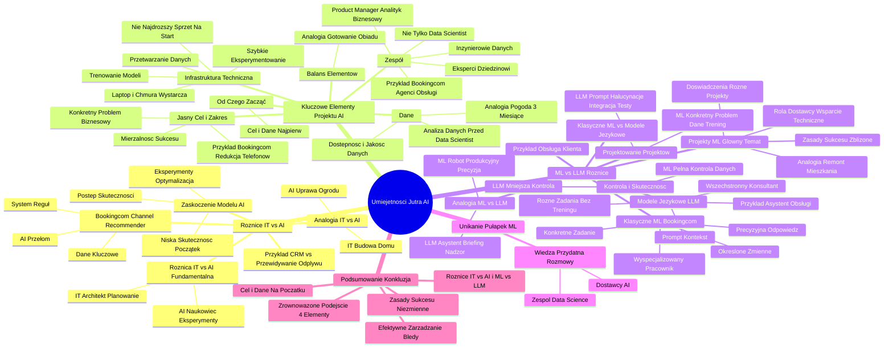

# Lekcje wideo - 1. Wprowadzenie

# 💡 Diagram

___

# 🗒️ Notatka

# Notatki i Podsumowanie Prezentacji Wideo: "Umiejętności Jutra AI"

## Wprowadzenie

Prezentacja Wojciecha Strzałkowskiego pt. "Umiejętności Jutra AI" analizuje różnice pomiędzy tradycyjnymi projektami IT a projektami wykorzystującymi **sztuczną inteligencję** (`AI`), koncentrując się szczególnie na **uczeniu maszynowym** (`Machine Learning` / `ML`). Prelegent, opierając się na swoim doświadczeniu, przedstawia kluczowe aspekty, na które należy zwrócić uwagę podczas wdrażania projektów `AI`, aby uniknąć typowych pułapek i osiągnąć sukces. Podkreśla istotę jasno zdefiniowanego celu, danych, infrastruktury technicznej i zespołu, a także omawia różnice w podejściu do projektów `ML` i `LLM` (`Large Language Models`).

## Projekty IT vs. Projekty AI – Różnice w Podejściu

### Przykład z życia: CRM vs. System Przewidywania Odpływu Klientów

* **Scenariusz:** Prezes firmy przedstawia dwa projekty:
    * Wdrożenie nowego systemu `CRM` (klasyczny projekt IT).
    * System przewidywania odpływu klientów wykorzystujący `AI`.
* **Założenia:** Ten sam budżet i termin realizacji.
* **Kluczowa Różnica:** Sposób realizacji tych projektów jest zasadniczo odmienny.

### Doświadczenie z Booking.com: Channel Recommender

* **Problem:** Jak optymalnie obsłużyć klienta (telefon 📞, e-mail 📧, czat 💬, samoobsługa)?
* **Ryzyko:**
    * Koszty związane z droższymi kanałami obsługi.
    * Potencjalna utrata rezerwacji wartej setki euro w wyniku nieprawidłowego przekierowania.
* **Pierwotne rozwiązanie:** System reguł oparty na logice "if-else" (drzewo decyzyjne).
    * Przykładowe reguły:
        * Rezerwacja > 7 dni: e-mail / czat.
        * Wartość rezerwacji > 1000 euro: telefon.
* **Przełom:** Decyzja o zastosowaniu `AI`.
* **Wyzwanie:** Zamiast reguł, kluczowe stają się dane.
    * Potrzeba tysięcy interakcji z klientami (historia rezerwacji, zapisy czatów, e-maili, rozmów telefonicznych).
    * Potencjalnie istotne zmienne: pora dnia 🕰️, kraj pochodzenia klienta 🌍, historia interakcji.

### Zaskoczenie i Efektywność Modeli AI

* **Pierwszy model AI:** Niska skuteczność (załóżmy 60%).
    * W tradycyjnym IT – katastrofa (np. system księgowy z 60% poprawnością).
    * W `AI` – to dopiero początek.
* **Kolejne miesiące:** Eksperymenty, optymalizacja parametrów.
* **Postęp:** Po kilku miesiącach – 82% skuteczności, ale tylko dla klientów z historią kontaktów.
* **Fundamentalna różnica IT vs. AI:**
    * **IT (Tradycyjne): Architekt 🏗️.** Planowanie, precyzyjne kroki, przewidywalność.
    * **AI (ML): Naukowiec 🔬.** Eksperymenty, hipotezy, testowanie, uczenie się na błędach, brak gwarancji dokładnej skuteczności w określonym czasie.
* **Analogia:**
    * **IT: Budowa domu 🏠.** Projekt, harmonogram, etapy.
    * **AI: Uprawa ogrodu 🌷.** Tworzenie warunków, pielęgnacja, nieprzewidywalność natury (zarówno pozytywne, jak i negatywne niespodzianki).

## Co jest Potrzebne do Wdrożenia Projektu AI? – 4 Kluczowe Elementy (Ważna Kolejność)

1. **Jasny cel i zakres.**
    * Unikaj wdrażania `AI` dla samego faktu wdrożenia.
    * Skoncentruj się na konkretnym problemie biznesowym do rozwiązania.
    * **Przykład Booking.com:** Nie automatyzacja obsługi klienta jako taka, lecz redukcja liczby połączeń telefonicznych przy zachowaniu satysfakcji klientów.
    * **Mierzalność sukcesu:** Zdefiniowanie wskaźników i kryteriów sukcesu projektu.

2. **Dane.**
    * **Częsty błąd:** Poszukiwanie `data scientist` przed dokonaniem analizy danych.
    * **Kluczowe:** Dostępność adekwatnych danych w odpowiedniej ilości i jakości.
    * **Analogia:** Próba przewidywania pogody ☀️ na cały rok na podstawie obserwacji z okna przez 3 miesiące.
    * **Weryfikacja danych:** Upewnij się, że dysponujesz odpowiednimi danymi, zanim pójdziesz dalej.

3. **Infrastruktura techniczna.**
    * **Nie chodzi o:** Inwestycję w najdroższy sprzęt i wszystkie możliwe narzędzia na starcie.
    * **Na początek wystarczy:** Laptop 💻 i dostęp do chmury ☁️.
    * **Istotne:** Infrastruktura umożliwiająca szybkie eksperymentowanie, sprawne trenowanie modeli, przechowywanie i przetwarzanie danych.

4. **Zespół.**
    * **Nie tylko:** `Data scientist`.
    * **Wymagane role:**
        * **Inżynierowie danych:** Przygotowanie i przetwarzanie danych.
        * **Product manager / Analityk biznesowy:** Zrozumienie specyfiki `AI`.
        * **Eksperci dziedzinowi:** Dogłębne zrozumienie biznesu.
            * **Przykład Booking.com:** Agenci obsługi klienta (wiedza o nietypowych i skomplikowanych przypadkach).

### Od Czego Zacząć?

* **Cel i Dane.**
    * Bez nich cała reszta traci sens.
    * Nawet najlepszy zespół i budżet nie przyniosą efektów bez jasno określonego celu i danych.

### Balans Elementów

* Wszystkie 4 elementy muszą być odpowiednio zbalansowane.
    * Doskonałe dane bez odpowiedniej infrastruktury – problem.
    * Wybitny zespół bez konkretnego celu – strata czasu i środków.
* **Analogia: Gotowanie obiadu 🍲.** Składniki, sprzęt kuchenny, przepis, kucharz 👨‍🍳. Brak któregokolwiek elementu skutkuje koniecznością zamówienia pizzy 🍕.

## ML vs. AI (Konkretnie ML vs. LLM) – Różnice w Podejściu

### Klasyczne Uczenie Maszynowe vs. Modele Językowe (np. GPT)

* **Przykład: Obsługa Klienta.**
* **Klasyczne ML (Booking.com):**
    * Uczenie modelu **konkretnego zadania** – przewidywanie preferowanego kanału komunikacji.
    * Określone zmienne wejściowe (czas do przyjazdu, wartość rezerwacji, typ pokoju).
    * Precyzyjna odpowiedź wyjściowa (telefon, e-mail, czat).
    * **Analogia:** Wyspecjalizowany pracownik (jedno zadanie, perfekcyjne wykonanie).

* **Modele Językowe (LLM):**
    * **Wszechstronny konsultant 🧑‍💼.** Różnorodne zadania bez potrzeby dedykowanego trenowania dla każdego z nich.
    * **Przykład: Asystent w obsłudze klienta.**
    * **Podejście:** `Prompt` (kontekst). "Jesteś asystentem firmy X, znasz procedury, zachowujesz określony `tone of voice`...".
    * **Wszechstronność ma swoją cenę:** Mniejsza kontrola i przewidywalność.

### Kontrola, Skuteczność i Projektowanie Projektów

* **Machine Learning:**
    * Pełna kontrola nad danymi treningowymi.
    * Precyzyjny pomiar skuteczności (model poprawnie/niepoprawnie przewidział kanał).
* **Modele Językowe (LLM):**
    * Odpowiedź poprawna merytorycznie, ale niekoniecznie zgodna ze stylem firmy.
    * Odpowiedź poprawna, lecz nieoptymalna.
* **Sposób prowadzenia projektu:**
    * **ML:** Konkretny problem, dane, trening, pomiar wyników.
    * **LLM:** Projektowanie `promptów`, zabezpieczenia przed halucynacjami, integracja z procesami, testowanie scenariuszy.
* **Analogia:**
    * **ML: Robot 🤖 na linii produkcyjnej.** Konkretne zadanie, wysoka precyzja.
    * **LLM: Asystent 🤝.** Wszechstronny, wymaga briefingu i nadzoru.

### Projekty Machine Learningowe – Główny Temat Prezentacji

* Oba podejścia (`ML` i `LLM`) są wartościowe, ale wymagają odmiennego zarządzania projektem.
* Prezentacja koncentruje się na `ML` (ze względu na doświadczenie prelegenta).
* Doświadczenia z dużych (Booking.com – własne modele) i mniejszych projektów (rozwiązania zewnętrzne).
* **Zasady sukcesu są zbliżone:** Niezależnie od tego, czy budujesz własne modele, czy współpracujesz z dostawcą.
* **Rola Dostawcy:** Wsparcie techniczne, ale to firma musi wiedzieć, czego oczekuje i jak to zmierzyć.
* **Analogia: Remont mieszkania 🛠️.** Samodzielnie czy z ekipą – musisz mieć jasną wizję efektu końcowego.

### Unikanie Pułapek w Projektach Machine Learning

* Prezentacja ma na celu pokazanie, jak unikać typowych pułapek i na co zwracać szczególną uwagę.
* Wiedza ta jest przydatna w rozmowach zarówno z zespołami `Data Science`, jak i dostawcami `AI`.

## Podsumowanie / Konkluzja

Sukces projektów `AI`, a w szczególności **uczenia maszynowego** (`Machine Learning`), opiera się na zrównoważonym podejściu do czterech kluczowych elementów: jasno określonego celu i zakresu, danych, infrastruktury technicznej i zespołu. Istotne jest zrozumienie różnic między projektami IT i `AI`, jak również specyfiki projektów `ML` w kontekście `LLM`. Kluczowe znaczenie ma rozpoczęcie od precyzyjnego zdefiniowania celu i dogłębnej analizy dostępnych danych. Niezależnie od tego, czy tworzymy własne modele `ML`, czy korzystamy z zewnętrznych rozwiązań, fundamentalne zasady sukcesu pozostają niezmienne. Świadomość tych aspektów umożliwia efektywne zarządzanie projektami `AI` i unikanie powszechnych błędów.

___

# 🔉 Transcript
File: Lekcje wideo - 1. Wprowadzenie.mp4 
[00:00:00] (Białe tło)
[00:00:01] (Na ekranie pojawia się napis "Umiejętności Jutra AI" oraz loga Google i SGH)
[00:00:05] (Mężczyzna w niebieskiej koszuli stoi na tle drewnianej ściany. Na dole ekranu widnieje napis "Wojciech Strzałkowski Head of Product + GOG.com")
[00:00:05] Wojciech Strzałkowski: Wyobraźmy sobie typową sytuację.
[00:00:07] Wojciech Strzałkowski: Prezes twojej firmy wchodzi do twojego biura i kładzie na biurku dwa projekty.
[00:00:13] Wojciech Strzałkowski: Jeden to wdrożenie nowego systemu CRM, klasyczny projekt IT.
[00:00:18] Wojciech Strzałkowski: Drugi to system przewidywania odpływu klientów wykorzystujący AI.
[00:00:23] Wojciech Strzałkowski: Ten sam budżet, ten sam deadline.
[00:00:26] Wojciech Strzałkowski: Ale sposób realizacji będzie kompletnie inny.
[00:00:31] Wojciech Strzałkowski: W Booking.com stanąłem przed podobnym wyzwaniem.
[00:00:34] Wojciech Strzałkowski: Pracowaliśmy nad Channel Recommenderem.
[00:00:36] Wojciech Strzałkowski: Systemem, który decyduje jak obsłużyć klienta, przez telefon, mail, czat, czy może samoobsługa.
[00:00:43] Wojciech Strzałkowski: Stawka była wysoka.
[00:00:45] Wojciech Strzałkowski: Każde przekierowanie klienta do droższego kanału to konkretne koszty.
[00:00:50] Wojciech Strzałkowski: A każde złe przekierowanie to ryzyko utraty rezerwacji wartej setki euro.
[00:00:55] Wojciech Strzałkowski: Początkowo mieliśmy prosty system reguł if else, jeżeli to.
[01:01:01] Wojciech Strzałkowski: Jeśli klient ma rezerwację za więcej niż siedem dni, rekomendujemy mail albo czat.
[01:07:05] Wojciech Strzałkowski: Jeśli wartość rezerwacji przewyższa 1000 euro, rekomendujemy telefon.
[01:11:09] Wojciech Strzałkowski: Klasyczne drzewo decyzyjne, jak quiz z kilkoma ścieżkami.
[01:17:04] Wojciech Strzałkowski: Działało okej.
[01:19:04] (Na ekranie pojawia się obrazek przedstawiający przerażonego mężczyznę w biurze, otoczonego przez hologramy mózgu, robota i napisów "AI")
[01:19:04] Wojciech Strzałkowski: Przełom nastąpił, gdy zdecydowaliśmy się na AI.
[01:23:07] Wojciech Strzałkowski: I tutaj zaczęły się schody.
[01:25:09] Wojciech Strzałkowski: Zamiast pisania reguł potrzebowaliśmy danych.
[01:28:04] Wojciech Strzałkowski: Tysięcy interakcji z klientami, historii ich rezerwacji, zapisów czatów, maili i połączeń.
[01:34:04] Wojciech Strzałkowski: Każda zmienna mogła być istotna.
[01:36:09] Wojciech Strzałkowski: Może pora dnia wpływa na skuteczność obsługi, może kraj pochodzenia klienta, a może historia jego poprzednich interakcji.
[01:45:02] (Na ekranie pojawia się slajd z napisem "Projekty IT, a ML/AI" oraz dwa okna z interfejsem strony internetowej)
[01:45:02] Wojciech Strzałkowski: Co nas najbardziej zaskoczyło?
[01:47:09] Wojciech Strzałkowski: Nasz pierwszy model AI miał dość niską skuteczność.
[01:51:04] Wojciech Strzałkowski: Na potrzeby naszego spotkania przyjmijmy, że 60%.
[01:56:00] Wojciech Strzałkowski: W tradycyjnym IT projekt z takim wynikiem byłby katastrofą.
[02:00:05] Wojciech Strzałkowski: Wyobraźcie sobie system księgowy, który poprawnie księguje tylko 60% faktur.
[02:06:04] Wojciech Strzałkowski: Ale w świecie AI to był dopiero początek.
[02:09:00] Wojciech Strzałkowski: Kolejne miesiące to była seria eksperymentów.
[02:12:00] Wojciech Strzałkowski: Model świetnie radził sobie z typowymi przypadkami, ale kompletnie gubił się w bardziej złożonych sytuacjach.
[02:19:00] Wojciech Strzałkowski: Dostawaliśmy dane, dostrajaliśmy parametry.
[02:22:09] Wojciech Strzałkowski: Po kilku miesiącach osiągnęliśmy ponownie, przyjmijmy na potrzeby tego wykładu, 82% skuteczności, ale tylko dla klientów, którzy mieli już historię kontaktów z nami.
[02:34:07] Wojciech Strzałkowski: To pokazuje fundamentalną różnicę między IT a AI.
[02:39:00] Wojciech Strzałkowski: W tradycyjnym IT jesteś jak architekt.
[02:41:00] Wojciech Strzałkowski: Masz plan, wiesz co budujesz, możesz precyzyjnie określić kolejne kroki.
[02:47:09] Wojciech Strzałkowski: W AI jesteś jak naukowiec prowadzący eksperymenty.
[02:51:00] Wojciech Strzałkowski: Stawiasz hipotezy, testujesz je, uczysz się na błędach.
[02:56:00] Wojciech Strzałkowski: Nie możesz obiecać, że za trzy miesiące model będzie miał dokładnie 95% skuteczności.
[03:02:00] Wojciech Strzałkowski: Możesz za to określić, kiedy model jest wystarczająco dobry, by przynieść wartość biznesową.
[03:08:00] Wojciech Strzałkowski: To jak różnica między budową domu a uprawą ogrodu.
[03:12:00] Wojciech Strzałkowski: Przy budowie domu wiesz dokładnie co dostaniesz, masz projekt, harmonogram, jasno określone etapy.
[03:18:00] Wojciech Strzałkowski: W ogrodzie tworzysz odpowiednie warunki, dbasz, pielęgnujesz, ale natura może cię zaskoczyć.
[03:26:00] Wojciech Strzałkowski: Czasem pozytywnie, czasem nie.
[03:29:00] (Na ekranie pojawia się napis "Co jest potrzebne do wdrożenia projektu AI?")
[03:30:00] Wojciech Strzałkowski: Zanim rzucimy się w wir projektów AI, zatrzymajmy się na chwilę.
[03:35:00] Wojciech Strzałkowski: Z mojego doświadczenia wynika, że sukces projektu AI zależy od czterech kluczowych elementów i uwaga, kolejność nie jest przypadkowa.
[03:44:00] (Na ekranie pojawia się napis "Jasny cel i zakres" oraz ikona tarczy z strzałą)
[03:44:00] Wojciech Strzałkowski: Pierwszy to jasny cel i zakres.
[03:47:00] Wojciech Strzałkowski: Nie chcemy wdrożyć AI, ale mamy konkretny problem biznesowy do rozwiązania.
[03:53:00] Wojciech Strzałkowski: W Booking.com naszym celem nie było zautomatyzowanie obsługi klienta, było nim znaczące zmniejszenie liczby połączeń telefonicznych bez pogorszenia satysfakcji klientów.
[04:04:00] Wojciech Strzałkowski: Różnica ogromna.
[04:07:00] Wojciech Strzałkowski: Od razu wiedzieliśmy co mierzymy i kiedy odnieśliśmy sukces.
[04:11:00] (Na ekranie pojawia się napis "Dane" oraz ikona kartki z tekstem)
[04:11:00] Wojciech Strzałkowski: Drugi element to dane i tutaj ciekawostka.
[04:15:00] Wojciech Strzałkowski: Często firmy zaczynają od szukania data scientistów, a dopiero potem patrzą na swoje dane.
[04:20:00] Wojciech Strzałkowski: To błąd.
[04:21:00] Wojciech Strzałkowski: Jeśli firma chce przewidywać zachowania klientów, ale ma dane tylko z ostatnich trzech miesięcy, to jak próba przewidzenia pogody na rok patrząc tylko przez okno.
[04:32:00] Wojciech Strzałkowski: Najpierw sprawdźcie, czy macie odpowiednie dane w odpowiedniej ilości i jakości.
[04:37:00] (Na ekranie pojawia się napis "Infrastruktura techniczna" oraz ikona serwera)
[04:37:00] Wojciech Strzałkowski: Trzeci element to infrastruktura techniczna, ale uwaga, nie chodzi o kupienie najdroższego sprzętu, czy wszystkich możliwych narzędzi.
[04:47:00] Wojciech Strzałkowski: W początkowej fazie często wystarczy laptop i dostęp do chmury.
[04:52:00] Wojciech Strzałkowski: Kluczowe jest co innego, czy wasza infrastruktura pozwala na szybkie eksperymenty, czy możecie łatwo trenować nowe modele, czy macie gdzie przechowywać i przetwarzać dane.
[05:03:00] (Na ekranie pojawia się napis "Zespół" oraz ikona grupy ludzi)
[05:03:00] Wojciech Strzałkowski: I wreszcie zespół.
[05:05:00] Wojciech Strzałkowski: Ale nie chodzi tylko o zatrudnienie data scientista.
[05:09:00] Wojciech Strzałkowski: Potrzebujecie też inżynierów danych, którzy przygotują i przetworzą informacje w waszej firmie.
[05:14:00] Wojciech Strzałkowski: Potrzebujecie product managera lub analityka biznesowego, który rozumie specyfikę AI i co najważniejsze, potrzebujecie ekspertów dziedzinowych, którzy rozumieją wasz biznes.
[05:25:00] Wojciech Strzałkowski: W przypadku Booking.com to byli agenci obsługi klienta.
[05:28:00] Wojciech Strzałkowski: To oni wiedzieli dokładnie, które przypadki są najtrudniejsze i dlaczego.
[05:34:00] Wojciech Strzałkowski: Teraz pytanie, które często słyszę, od czego zacząć?
[05:38:00] Wojciech Strzałkowski: Zacznijcie od celu i danych.
[05:40:00] Wojciech Strzałkowski: Bez tego reszta nie ma sensu.
[05:42:00] Wojciech Strzałkowski: Możecie mieć najlepszy zespół na świecie i nieograniczony budżet na infrastrukturę, ale jeśli nie macie jasnego celu lub odpowiednich danych, projekt się nie uda.
[05:51:00] Wojciech Strzałkowski: I jeszcze jedna rzecz.
[05:53:00] Wojciech Strzałkowski: Te elementy muszą być zbalansowane.
[05:56:00] Wojciech Strzałkowski: Świetne dane bez odpowiedniej infrastruktury, problem.
[06:00:00] Wojciech Strzałkowski: Świetny zespół bez jasnego celu, strata czasu i pieniędzy.
[06:04:00] Wojciech Strzałkowski: To jak próba ugotowania obiadu, potrzebujesz składników i sprzętu i przepisu i kucharza.
[06:11:00] Wojciech Strzałkowski: Brak któregokolwiek elementu i zamawiamy pizzę.
[06:16:00] (Na ekranie pojawia się napis "ML vs AI" oraz lista punktów dotyczących Machine Learning i Large Language Models)
[06:16:00] Wojciech Strzałkowski: Często wrzucamy wszystkie projekty związane z AI do jednego worka.
[06:21:00] Wojciech Strzałkowski: Ale jest zasadnicza różnica między klasycznym Machine Learningiem, a tym co robimy z modelami językowymi jak GPT.
[06:29:00] Wojciech Strzałkowski: Pokażę wam to na konkretnym przykładzie.
[06:31:00] Wojciech Strzałkowski: Weźmy obsługę klienta.
[06:33:00] Wojciech Strzałkowski: W klasycznym Machine Learning nad którym pracowałem w Booking.com, uczyliśmy model konkretnego zadania.
[06:38:00] Wojciech Strzałkowski: Przewidywania najlepszego kanału komunikacji.
[06:41:00] Wojciech Strzałkowski: Model dostawał konkretne zmienne, czas do przyjazdu, wartość rezerwacji, typ pokoju.
[06:48:00] Wojciech Strzałkowski: Zwracał konkretną odpowiedź, telefon, mail czy czat.
[06:51:00] Wojciech Strzałkowski: To jak wyspecjalizowany pracownik, który robi jedną rzecz, ale robi ją bardzo dobrze.
[06:57:00] Wojciech Strzałkowski: A modele językowe to zupełnie inna historia.
[07:01:00] Wojciech Strzałkowski: One są jak wszechstronny konsultant.
[07:03:00] Wojciech Strzałkowski: Możesz je wykorzystać do różnych zadań bez trenowania.
[07:07:00] Wojciech Strzałkowski: Weźmy przykład asystenta w obsłudze klienta.
[07:10:00] Wojciech Strzałkowski: Nie uczysz go konkretnie odpowiadania na maile czy kategoryzowania zgłoszeń.
[07:15:00] Wojciech Strzałkowski: Zamiast tego dajesz mu kontekst w postaci promptu.
[07:19:00] Wojciech Strzałkowski: Jesteś asystentem obsługi klienta firmy X, oto nasze procedury, oto nasz tone of voice i tak dalej i tak dalej.
[07:25:00] Wojciech Strzałkowski: Ale ta wszechstronność ma swoją cenę.
[07:28:00] Wojciech Strzałkowski: W Machine Learningu mamy pełną kontrolę nad danymi treningowymi i możemy precyzyjnie zmierzyć skuteczność.
[07:36:00] Wojciech Strzałkowski: Model albo dobrze przewidział kanał komunikacji, albo nie.
[07:39:00] Wojciech Strzałkowski: A z modelami językowymi?
[07:41:00] Wojciech Strzałkowski: Czasem odpowiedź może być technicznie poprawna, ale nie w stylu twojej firmy, albo całkiem poprawna, ale nie optymalna.
[07:48:00] Wojciech Strzałkowski: To przekłada się na sposób prowadzenia projektu.
[07:51:00] Wojciech Strzałkowski: W Machine Learningu skupiasz się na jednym konkretnym problemie.
[07:54:00] Wojciech Strzałkowski: Zbierasz dane, trenujesz model, mierzysz wyniki.
[07:57:00] Wojciech Strzałkowski: Z LLMami kluczowe staje się między innymi projektowanie promptów, budowa zabezpieczeń przed halucynacjami, integracja z istniejącymi procesami, czy testowanie różnych scenariuszy użycia.
[08:11:00] Wojciech Strzałkowski: Myślcie o tym w ten sposób.
[08:13:00] Wojciech Strzałkowski: Machine Learning to jak budowa robota na linii produkcyjnej.
[08:16:00] Wojciech Strzałkowski: Wykonuje konkretne zadanie w konkretny sposób z mierzalną precyzją.
[08:20:00] Wojciech Strzałkowski: LLM to bardziej jak zatrudnienie asystenta, wszechstronnego, ale wymagającego odpowiedniego briefingu i nadzoru.
[08:45:00] Wojciech Strzałkowski: Oba podejścia są wartościowe, ale wymagają zupełnie innego podejścia do zarządzania projektem.
[08:49:00] Wojciech Strzałkowski: Z racji mojego doświadczenia dzisiaj skupimy się na projektach Machine Learningowych.
[08:53:00] Wojciech Strzałkowski: Pracowałem nad nimi zarówno w dużych organizacjach jak Booking.com, gdzie budowaliśmy własne modele od podstaw, jak i przy mniejszych projektach, gdzie korzystaliśmy z zewnętrznych rozwiązań.
[09:03:00] Wojciech Strzałkowski: To co zauważyłem to, że niezależnie czy budujecie własne modele, czy współpracujecie z dostawcami, zasady sukcesu są podobne.
[09:11:00] Wojciech Strzałkowski: Dostawca może wam pomóc z techniczną stroną, ale to wy musicie wiedzieć czego chcecie i jak to zmierzyć.
[09:17:00] Wojciech Strzałkowski: Trochę jak z remontem mieszkania.
[09:19:00] Wojciech Strzałkowski: Możecie wszystko zrobić sami albo wynająć ekipę, ale w obu przypadkach musicie wiedzieć co ma być efektem końcowym.
[09:26:00] Wojciech Strzałkowski: Dlatego dzisiaj pokażę wam jak uniknąć najczęstszych pułapek w projektach Machine Learning i na co zwracać szczególną uwagę.
[09:32:00] Wojciech Strzałkowski: Niezależnie czy jutro będziecie rozmawiać z waszym zespołem Data Science, czy z potencjalnym dostawcą AI.
[09:38:00] (Na ekranie pojawia się logo "Umiejętności Jutra AI")

___
# 🏷️ Tags
#AI #sztuczna_inteligencja #Machine_Learning #ML #uczenie_maszynowe #LLM #Large_Language_Models #projekty_IT #CRM #system_CRM #odpływ_klientów #Booking.com #Channel_Recommender #kanały_obsługi_klienta #telefon #e-mail #czat #samoobsługa #koszty_obsługi #rezerwacje #system_reguł #if-else #drzewo_decyzyjne #dane #interakcje_z_klientami #historia_rezerwacji #zapisy_czatów #zapisy_maili #rozmowy_telefoniczne #pora_dnia #kraj_pochodzenia_klienta #historia_interakcji #skuteczność_modeli_AI #eksperymenty #optymalizacja_parametrów #architekt #naukowiec #eksperymenty #hipotezy #testowanie #uczenie_się_na_błędach #budowa_domu #uprawa_ogrodu #cel_projektu #zakres_projektu #problem_biznesowy #automatyzacja_obsługi_klienta #satysfakcja_klientów #mierzalność_sukcesu #data_scientist #analiza_danych #dostępność_danych #jakość_danych #weryfikacja_danych #infrastruktura_techniczna #laptop #chmura #eksperymentowanie #trenowanie_modeli #przechowywanie_danych #przetwarzanie_danych #zespół #inżynierowie_danych #product_manager #analityk_biznesowy #eksperci_dziedzinowi #agenci_obsługi_klienta #balans_elementów #gotowanie_obiadu #składniki #sprzęt_kuchenny #przepis #kucharz #klasyczne_uczenie_maszynowe #modele_językowe #GPT #obsługa_klienta #zmienne_wejściowe #czas_do_przyjazdu #wartość_rezerwacji #typ_pokoju #odpowiedź_wyjściowa #wszechstronny_konsultant #asystent_obsługi_klienta #prompt #kontekst #tone_of_voice #kontrola_danych #dane_treningowe #pomiar_skuteczności #halucynacje #integracja_z_procesami #testowanie_scenariuszy #robot_na_linii_produkcyjnej #precyzja #briefing #nadzór #własne_modele #rozwiązania_zewnętrzne #rola_dostawcy #wsparcie_techniczne #remont_mieszkania #wizja_efektu_końcowego #unikanie_pułapek #zespoły_Data_Science #dostawcy_AI #zarządzanie_projektem
