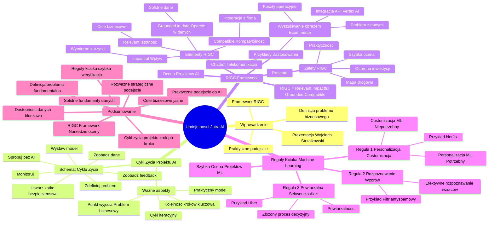

# Lekcje wideo - 2. Cykl życia projektu AI Zdefiniuj problem

# 💡 Diagram

___

# 🗒️ Notatka

# Umiejętności Jutra AI - Notatki i Podsumowanie

## Wprowadzenie

Prezentacja "Umiejętności Jutra AI" prowadzona przez Wojciecha Strzałkowskiego omawia **cykl życia projektu AI** oraz **framework RIGC**, czyli narzędzie do oceny przydatności problemu biznesowego do rozwiązania za pomocą sztucznej inteligencji 🤖. Szkolenie to kładzie nacisk na praktyczne podejście do projektów AI, podkreślając **zdefiniowanie problemu biznesowego** jako fundamentalny pierwszy krok.

## Cykl Życia Projektu AI

Wojciech Strzałkowski prezentuje **praktyczny cykl życia projektu AI**, oparty na doświadczeniach z licznych wdrożeń.  Zaznacza, że **kolejność kroków** ma **kluczowe** znaczenie dla powodzenia projektu.

**Schemat Cyklu Życia Projektu AI (7 kroków):**

1. **Zdefiniuj problem:** Fundamentalny pierwszy krok. Wdrożenie AI samo w sobie nie stanowi problemu. Skoncentruj się na problemach biznesowych, takich jak redukcja zwrotów czy skrócenie czasu obsługi klienta ⏱️.
2. **Zdobądź dane:**  Weryfikacja dostępności i jakości danych. Brak danych może uniemożliwić realizację projektu, dlatego istotne jest sprawdzenie tego na wczesnym etapie.
3. **Spróbuj bez AI:** Rozważenie prostych rozwiązań, na przykład opartych na regułach `if else`. Często proste metody mogą przynieść znaczną część oczekiwanych rezultatów.
4. **Utwórz zatkę bezpieczeństwa:** (Krok wspomniany w cyklu, lecz nie omówiony szczegółowo w tym fragmencie).
5. **Wystaw model:** (Trening i wdrożenie modelu AI).
6. **Zdobądź feedback:**  Zbieranie opinii i danych zwrotnych po wdrożeniu modelu w celu jego ulepszenia.
7. **Monitoruj:**  Ciągłe monitorowanie działania modelu i osiąganych efektów.

**Ważne aspekty cyklu życia projektu AI:**

- **Model praktyczny, nie teoretyczny.** Bazuje na realnych doświadczeniach z wdrożeń.
- **Kolejność kroków jest kluczowa.**  Powszechny błąd to rozpoczęcie od trenowania modelu przed właściwym zdefiniowaniem problemu.
- **Cykl ma charakter iteracyjny.**  Często wymaga powrotu do wcześniejszych etapów i iteracji w celu dopracowania.
- **Punktem wyjścia jest zdefiniowanie problemu biznesowego.**

## RIGC Framework - Ocena Projektów AI

`RIGC Framework` to narzędzie stworzone przez Wojciecha Strzałkowskiego, służące do oceny, czy dany problem kwalifikuje się do rozwiązania z wykorzystaniem AI. Nazwa `RIGC` nawiązuje do memów o "rozum i godność człowieka", analogicznie mając na celu ocenę "rozumu" projektu AI 🤔.

**RIGC = Relevant + Impactful + Grounded in data + Compatible**

**Elementy Frameworku RIGC:**

- **R - Relevant (Istotność):**
    - Czy projekt jest **istotny** z punktu widzenia biznesu?
    - Czy **bezpośrednio przyczynia się** do realizacji kluczowych celów biznesowych firmy?

- **I - Impactful (Wpływ):**
    - Czy projekt przyniesie **znaczący wpływ**?
    - Czy można **wymiernie określić potencjalne korzyści** (np. oszczędności kosztów 💰, wzrost przychodów 📈, poprawa satysfakcji klienta 😊)?

- **G - Grounded in data (Oparcie w danych):**
    - Czy projekt jest **oparty na solidnych danych**?
    - Czy **dysponujemy danymi** niezbędnymi do realizacji projektu i wytrenowania modelu?

- **C - Compatible (Kompatybilność):**
    - Czy rozwiązanie AI będzie **kompatybilne** z istniejącą infrastrukturą i procesami w firmie?
    - Czy **łatwo zintegruje się** z bieżącą działalnością operacyjną?

**Zalety RIGC Framework:**

- **Prostota i praktyczność.**
- Nie wymaga złożonych analiz ani skomplikowanych kalkulacji.
- Umożliwia **szybką ocenę** potencjału projektu AI.
- Chroni przed **inwestycjami w nieefektywne rozwiązania**.
- Pełni rolę **mapy drogowej**, wskazując obszary wymagające dopracowania przed wdrożeniem.

## Przykłady Zastosowania RIGC Framework

### Przykład 1: Chatbot dla Firmy Telekomunikacyjnej

- **Problem:** Firma telekomunikacyjna planuje wdrożenie chatbota do obsługi klienta.

- **Analiza RIGC:**
    - **Relevant:** **Tak**. Poprawa satysfakcji klienta i skrócenie czasu reakcji to kluczowe cele biznesowe. Chatbot bezpośrednio wspiera te założenia.
    - **Impactful:** **Tak**. Analiza wykazuje, że chatbot może odciążyć zespół obsługi klienta i podnieść satysfakcję poprzez natychmiastowe odpowiedzi. Każda zaoszczędzona minuta w czasie odpowiedzi ma realny wpływ.
    - **Grounded in data:** **Tak**. Firma zgromadziła wieloletnią historię interakcji z klientami (czaty, rozmowy), co stanowi solidną bazę danych (wymagającą jednak oczyszczenia).
    - **Compatible:** **Tak**. Istniejąca platforma obsługi klienta może zostać zintegrowana z chatbotem, choć będzie to wymagało pewnych modyfikacji.

- **Wniosek:** Projekt chatbota dla telekomunikacji **pozytywnie przechodzi** ocenę `RIGC`.

### Przykład 2: Wyszukiwanie Produktów Obrazem w E-commerce

- **Problem:** Wdrożenie funkcji wyszukiwania produktów za pomocą obrazów w sklepie internetowym 🛍️.

- **Analiza RIGC:**
    - **Relevant:** **Tak**. Wpisuje się w strategiczny cel firmy – podniesienie satysfakcji i konwersji poprzez personalizację oferty.
    - **Impactful:** **Wątpliwe**. Innowacyjne rozwiązanie, lecz **brak danych**, które potwierdzałyby, że użytkownicy będą z niego korzystać i że przełoży się to na wzrost sprzedaży.
    - **Grounded in data:** **Nie**. Firma posiada zdjęcia produktów, ale **brakuje kluczowych metadanych** niezbędnych do efektywnego trenowania modelu rozpoznawania obrazów.
    - **Compatible:** (Kwestia kompatybilności nie jest szczegółowo omawiana, głównym problemem są dane).

- **Potencjalne rozwiązanie problemu z danymi:** Integracja z zewnętrznym API, np. Vertex AI, w celu automatycznego tagowania produktów. **Wady:** wzrost złożoności projektu i kosztów operacyjnych 💸.

- **Wniosek:** Projekt wyszukiwania obrazem **nie przechodzi pozytywnie** oceny `RIGC` z powodu braku danych.  Wskazane jest skupienie się najpierw na budowie bazy metadanych produktowych, zanim wdroży się tak zaawansowane rozwiązanie.

## Reguły Kciuka - Szybka Ocena Projektów Machine Learning

Trzy proste reguły, które ułatwiają szybką ocenę, czy dany problem nadaje się do rozwiązania za pomocą `machine learning`.

1. **Personalizacja czy Customizacja?**
    - **Customizacja:** Użytkownik samodzielnie dostosowuje ustawienia. `Machine learning` prawdopodobnie **nie jest potrzebny**.
    - **Personalizacja:** System automatycznie dostosowuje się do zachowań użytkownika. Dobry kandydat dla **`machine learning`**.
    - **Przykład:** Netflix - personalizacja rekomendacji filmów (ML) vs. ręczne ustawienia preferencji (brak ML) 🎬.

2. **Rozpoznawanie lub Łączenie Wzorów.**
    - `Machine learning` jest efektywny w **rozpoznawaniu wzorców**, zwłaszcza tych subtelnych i złożonych, trudnych do identyfikacji manualnie.
    - **Przykład:** Filtr antyspamowy - ML rozpoznaje wzorce w treści, nagłówkach i zachowaniu nadawców, aby identyfikować spam 📧.

3. **Powtarzalna Sekwencja Akcji.**
    - Jeśli proces decyzyjny jest **skomplikowany i uwzględnia wiele czynników**, a jednocześnie **powtarza się** na dużą skalę, `machine learning` może okazać się przydatny.
    - **Przykład:** Obsługa klienta w Uberze - decyzja o rekompensacie dla klienta zależy od wielu czynników (historia klienta, rodzaj problemu, lokalizacja 📍, pogoda ☀️, etc.). ML może wspomóc podejmowanie decyzji na podstawie analizy tysięcy podobnych przypadków.

## Podsumowanie

Prezentacja "Umiejętności Jutra AI" koncentruje się na **praktycznym podejściu do projektów AI**, podkreślając **fundamentalną rolę zdefiniowania problemu biznesowego** oraz **dostępności danych**. Przedstawiony **cykl życia projektu AI**  precyzyjnie prowadzi przez proces wdrożenia krok po kroku.  `RIGC Framework` stanowi proste, lecz efektywne narzędzie do **oceny projektów AI**, pomagając uniknąć inwestycji w rozwiązania, które nie przyniosą oczekiwanych korzyści. Dodatkowo, **trzy reguły kciuka** oferują szybką metodę weryfikacji, czy dany problem jest odpowiedni dla `machine learning`.  Całość materiału akcentuje **rozważne i strategiczne podejście do AI**,  zaczynając od **jasno określonych celów biznesowych** i **solidnych fundamentów danych** 📊.

___

# 🔉 Transcript
File: Lekcje wideo - 2. Cykl życia projektu AI Zdefiniuj problem.mp4 
[00:00:00] (Białe tło)
[00:00:01] (Na ekranie pojawia się napis "Umiejętności Jutra AI" pod spodem napisy "Organizator Google" oraz "Partner edukacyjny SGH")
[00:00:05] Wojciech Strzałkowski: Zanim przejdziemy do szczegółów, pokażę wam kompletny cykl życia projektu AI.
[00:00:09] (Na ekranie pojawia się schemat "Cykl życia projektu AI" z siedmioma krokami: 1. Zdefiniuj problem, 2. Zdobądź dane, 3. Spróbuj bez AI, 4. Utwórz zatkę bezpieczeństwa, 5. Wystawmy model, 6. Zdobądź feedback, 7. Monitoruj)
[00:00:10] Wojciech Strzałkowski: To nie jest teoretyczny model.
[00:00:12] Wojciech Strzałkowski: To praktyczne kroki, które wypracowałem przy dziesiątkach projektów.
[00:00:16] Wojciech Strzałkowski: I uwaga, kolejność tych kroków jest kluczowa.
[00:00:20] Wojciech Strzałkowski: Często widzę firmy, które zaczynają od trenowania modelu albo zatrudnianie data scientistów, a potem zastanawiają się nad problemem do rozwiązania.
[00:00:28] Wojciech Strzałkowski: To jak budowanie domu od dachu.
[00:00:32] Wojciech Strzałkowski: Zaczynamy od zdefiniowania problemu i nie, wdrożenie AI to nie jest problem.
[00:00:38] Wojciech Strzałkowski: Problem to na przykład zmniejszenie liczby zwrotów o 30% albo skrócenie czasu obsługi klienta o połowę.
[00:00:45] Wojciech Strzałkowski: Potem szukamy danych i tu ciekawostka.
[00:00:48] Wojciech Strzałkowski: Czasem na tym etapie okazuje się, że projekt nie ma sensu, bo po prostu nie mamy odpowiednich danych.
[00:00:54] Wojciech Strzałkowski: Lepiej wiedzieć to na początku, niż po wydaniu budżetu.
[00:00:58] Wojciech Strzałkowski: Krok trzeci to często pomijany, ale kluczowy element.
[00:01:01] Wojciech Strzałkowski: Próba rozwiązania problemu bez AI.
[00:01:04] Wojciech Strzałkowski: Czasem proste reguły if else dają 80% rezultatu przy 20% wysiłku.
[00:01:12] Wojciech Strzałkowski: Dopiero potem przechodzimy do tworzenia zabezpieczeń, trenowania modelu, zbierania feedbacku i monitorowania wyników.
[00:01:20] Wojciech Strzałkowski: Ten cykl nie jest liniowy.
[00:01:21] Wojciech Strzałkowski: Często wracamy do poprzednich kroków, uczymy się i dostosowujemy podejście.
[00:01:26] Wojciech Strzałkowski: Ale zawsze zaczynamy od jasno zdefiniowanego problemu biznesowego.
[00:01:30] Wojciech Strzałkowski: W kolejnych częściach przejdziemy przez każdy z tych elementów szczegółowo, pokazując konkretne przykłady i narzędzia, które możecie zastosować w swoich projektach.
[00:01:39] Wojciech Strzałkowski: Zacznijmy od zdefiniowania problemu.
[00:01:41] Wojciech Strzałkowski: Jak już pewnie zauważyliście, kładę na to szczególny nacisk.
[00:01:45] Wojciech Strzałkowski: Aby się nie powtarzać i dać wam konkretne narzędzie, omówimy sobie prosty framework RIGC, który stworzyłem, żeby odpowiedzieć sobie na pytanie, czy dany problem nadaje się dla AI.
[00:01:57] (Na ekranie pojawia się napis "RIGC Framework" pod spodem "RIGC = Relevant + Impactful + Grounded in data + Compatible")
[00:01:57] Wojciech Strzałkowski: Nawiązując do popularnych memów o RIGC, czyli rozum i godność człowieka, stworzyłem podobny skrót dla projektów AI.
[00:02:04] Wojciech Strzałkowski: RIGC.
[00:02:05] Wojciech Strzałkowski: Tak jak RIGC określa czy ktoś ma rozum, tak RIGC pomoże nam określić czy nasz projekt AI ma sens.
[00:02:12] Wojciech Strzałkowski: RIGC składa się z czterech kluczowych elementów.
[00:02:14] Wojciech Strzałkowski: R jak relevant, czyli istotność, czyli czy projekt bezpośrednio wpływa na kluczowe cele biznesowe.
[00:02:21] Wojciech Strzałkowski: I jak impactful, czyli wpływ.
[00:02:22] Wojciech Strzałkowski: Czy możemy wymiernie określić potencjalne korzyści z tego projektu.
[00:02:27] Wojciech Strzałkowski: G jak grounded in data, czyli oparcie w danych.
[00:02:30] Wojciech Strzałkowski: Czy mamy dane potrzebne do realizacji i wreszcie C compatible, kompatybilność.
[00:02:37] Wojciech Strzałkowski: Czy rozwiązanie zintegruje się z obecnymi operacjami naszej firmy.
[00:02:41] (Na ekranie pojawia się napis "RIGC Framework: Stworzenie chatbota do obsługi klienta dla Telecomu")
[00:02:42] Wojciech Strzałkowski: Zobaczmy jak to działa w praktyce na przykładzie hipotetycznej firmy telekomunikacyjnej, która chciała wdrożyć chatbota do obsługi klienta.
[00:02:50] Wojciech Strzałkowski: Relevant jak najbardziej.
[00:02:52] Wojciech Strzałkowski: Firma miała problem z poziomem satysfakcji klientów, a czas odpowiedzi był kluczowym czynnikiem.
[00:02:55] Wojciech Strzałkowski: Chatbot bezpośrednio wspierał i strategiczny cel poprawy doświadczenia klienta.
[00:03:03] Wojciech Strzałkowski: Impactful liczby mówiły same za siebie.
[00:03:06] Wojciech Strzałkowski: Analiza pokazała, że natychmiastowe odpowiedzi na częste pytania mogły znacząco odciążyć zespół i poprawić satysfakcję klientów.
[00:03:14] Wojciech Strzałkowski: Pomyślcie, każda minuta zaoszczędzona w trakcie czasie odpowiedzi bezpośrednio przekłada się na doświadczenie klienta.
[00:03:20] Wojciech Strzałkowski: Grounded in data i tu często firmy się potykają, ale ten telekom miał asa w rękawie.
[00:03:26] Wojciech Strzałkowski: Lata szczegółowo zapisanych interakcji z obsługą klienta.
[00:03:30] Wojciech Strzałkowski: Tak, dane wymagały czyszczenia, ale fundamenty były solidne.
[00:03:34] Wojciech Strzałkowski: I wreszcie compatible.
[00:03:36] Wojciech Strzałkowski: Istniejąca platforma obsługi klienta mogłaby być zintegrowana z rozwiązaniem chatbota, choć wymagało to pewnych dostosowań i istniejących procesów pracy.
[00:03:45] Wojciech Strzałkowski: Ta systematyczna analiza dała im pewność by działać, ale jest tu kluczowy wniosek, bez któregokolwiek z tych elementów projekt mógł się nie udać.
[00:03:54] Wojciech Strzałkowski: Gdyby nie mieli historycznych danych z czatów albo gdyby ich systemy nie mogły zintegrować rozwiązania, rozmawialibyśmy o zupełnie innym wyniku.
[00:04:02] Wojciech Strzałkowski: Użyteczność RIGC tkwi w prostocie.
[00:04:05] Wojciech Strzałkowski: Nie potrzebujecie skomplikowanych kalkulacji czy niekończących się spotkań.
[00:04:09] Wojciech Strzałkowski: Tylko cztery proste pytania, które mogą uchronić przed inwestowaniem w niewłaściwe rozwiązanie.
[00:04:15] (Na ekranie pojawia się napis "RIGC Framework: Wyszukiwanie produktów obrazem w ecommerce")
[00:04:16] Wojciech Strzałkowski: Zobaczmy teraz inny przykład zastosowania tego frameworku.
[00:04:19] Wojciech Strzałkowski: Wyszukiwanie produktów za pomocą obrazów w sklepie internetowym.
[00:04:23] Wojciech Strzałkowski: Brzmi świetnie, prawda?
[00:04:25] Wojciech Strzałkowski: Ale diabeł tkwi w szczegółach.
[00:04:27] Wojciech Strzałkowski: Relevant na pierwszy rzut oka wygląda obiecująco.
[00:04:30] Wojciech Strzałkowski: Inicjatywa faktycznie wpisuje się w strategiczny cel firmy.
[00:04:33] Wojciech Strzałkowski: Chcemy zwiększyć satysfakcję i konwersję użytkowników za pomocą personalizacji.
[00:04:39] Wojciech Strzałkowski: Więc ten element możemy zaliczyć na zielono.
[00:04:42] Wojciech Strzałkowski: Impactful tu zaczynają się schody.
[00:04:45] Wojciech Strzałkowski: Owszem, to innowacyjne rozwiązanie, które mogłoby wyróżnić nas na rynku, ale brakuje nam twardych danych wskazujących, że użytkownicy faktycznie chcieliby z tego korzystać i że przełoży się na to na większą sprzedaż.
[00:05:02] Wojciech Strzałkowski: Grounded in data i tu trafiamy na ścianę.
[00:05:05] Wojciech Strzałkowski: Choć mamy zdjęcia produktów, to brakuje nam kluczowych metadanych potrzebnych do skutecznego wytrenowania modelu.
[00:05:12] Wojciech Strzałkowski: To trochę jak próba nauczenia kogoś języka obcego bez słownika.
[00:05:16] Wojciech Strzałkowski: Teoretycznie możliwe, ale praktycznie bardzo trudne i nieefektywne.
[00:05:19] Wojciech Strzałkowski: I jasne, moglibyśmy spróbować obejść ten problem integrując zewnętrzne API jak Vertex AI do automatycznego tagowania produktów, ale to nie tylko dodatkowo komplikuje cały projekt, ale też znacząco podnosi koszty operacyjne.
[00:05:33] Wojciech Strzałkowski: Zamiast rozwiązywać jeden problem, dokładamy sobie kolejne i techniczne i finansowe.
[00:05:39] Wojciech Strzałkowski: To dobry przykład tego jak próba obejścia braku danych może prowadzić do jeszcze większej złożoności projektu.
[00:05:46] Wojciech Strzałkowski: Czasem lepiej przyznać, że nie jesteśmy jeszcze gotowi na dane rozwiązanie niż budować skomplikowaną konstrukcję workaroundów.
[00:06:27] Wojciech Strzałkowski: Pamiętajcie, RIGC to nie tylko narzędzie do oceny projektów, ale też mapa drogowa pokazująca co musimy naprawić zanim ruszymy z implementacją.
[00:06:35] Wojciech Strzałkowski: W tym przypadku zamiast forsować wdrożenie za wszelką cenę, powinniśmy skupić się na budowie solidnej bazy metadanych produktowych.
[00:06:44] Wojciech Strzałkowski: Proponuję trzy proste reguły kciuka, które pomogą szybko ocenić czy dany problem faktycznie nadaje się do rozwiązania przez machine learning.
[00:06:52] (Na ekranie pojawia się napis "Reguła 1: Personalizacja czy customizacja?")
[00:06:53] Wojciech Strzałkowski: Pierwsza reguła, personalizacja czy customizacja.
[00:06:57] (Na ekranie pojawia się zdjęcie z książkami)
[00:06:57] Wojciech Strzałkowski: Jest zasadnicza różnica między pozwalaniem użytkownikom na ręczne dostosowywanie czegoś, czyli customizacja, a automatycznym dostosowywaniem się do ich zachowań, czyli personalizacją.
[00:07:08] Wojciech Strzałkowski: Jeśli użytkownik sam może łatwo ustawić swoje preferencje, machine learning prawdopodobnie nie jest potrzebny.
[00:07:14] Wojciech Strzałkowski: Ale jeśli wzorce są zbyt złożone lub zmieniają się w czasie, to dobry kandydat dla machine learning.
[00:07:20] Wojciech Strzałkowski: Przykład Netflix.
[00:07:22] Wojciech Strzałkowski: Nikt nie chce ręcznie ustawiać swoich preferencji filmowych, ale algorytm może je wywnioskować z historii oglądania.
[00:07:28] (Na ekranie pojawia się napis "Reguła 2: Rozpoznawanie lub łączenie wzorów")
[00:07:29] Wojciech Strzałkowski: Druga reguła, rozpoznawanie lub łączenie wzorów.
[00:07:32] (Na ekranie pojawia się zdjęcie ze spamem)
[00:07:32] Wojciech Strzałkowski: To jak filtr spamu w waszej skrzynce mailowej.
[00:07:35] Wojciech Strzałkowski: Nikt z nas nie chciałby ręcznie przeglądać każdego maila i sprawdzać czy to spam, zwłaszcza, że oszuści ciągle wymyślają nowe sztuczki.
[00:07:43] Wojciech Strzałkowski: Machine learning świetnie sobie z tym radzi, bo potrafi rozpoznawać subtelne wzorce w treści nagłówkach i zachowaniu nadawców, automatycznie dostosowując się do nowych typów spamu.
[00:07:52] (Na ekranie pojawia się napis "Reguła 3: Powtarzalna sekwencja akcji")
[00:07:53] Wojciech Strzałkowski: I wreszcie trzecia reguła, powtarzalna sekwencja akcji.
[00:07:57] (Na ekranie pojawia się zdjęcie z aplikacją Uber)
[00:07:57] Wojciech Strzałkowski: Weźmy obsługę klienta w Uberze, gdy zgłaszacie problem z przejazdem.
[00:08:00] Wojciech Strzałkowski: Gdyby to był prosty powtarzalny proces, na przykład jeśli kierowca się spóźnił zwróć 10%, wystarczyłyby proste reguły if else.
[00:08:10] Wojciech Strzałkowski: Ale rzeczywistość jest bardziej skomplikowana.
[00:08:12] Wojciech Strzałkowski: Trzeba wziąć pod uwagę historię klienta, typ problemu, lokalizację, porę dnia, warunki pogodowe i wiele innych czynników.
[00:08:18] Wojciech Strzałkowski: Tu machine learning może pomóc zadecydować jaką formę rekompensaty zaproponować, bazując na tysiącach podobnych przypadków i ich rozwiązań.
[00:08:27] (Na ekranie pojawia się napis "Umiejętności Jutra AI" pod spodem napisy "Organizator Google" oraz "Partner edukacyjny SGH")

___
# 🏷️ Tags
#Umiejętności_Jutra_AI #cykl_życia_projektu_AI #framework_RIGC #problem_biznesowy #Wojciech_Strzałkowski #praktyczne_podejście #definicja_problemu #kolejność_kroków #dane #dostępność_danych #jakość_danych #rozwiązania_bez_AI #reguły_if_else #zatka_bezpieczeństwa #wystawienie_modelu #trening_modelu #wdrożenie_modelu #feedback #monitorowanie #charakter_iteracyjny #RIGC_Framework #ocena_projektów_AI #Relevant #Impactful #Grounded_in_data #Compatible #istotność #wpływ #oparcie_w_danych #kompatybilność #cele_biznesowe #korzyści #koszty #przychody #satysfakcja_klienta #infrastruktura #procesy_firmowe #integracja #szybka_ocena #inwestycje #nieefektywne_rozwiązania #mapa_drogowa #dopracowanie #chatbot #firma_telekomunikacyjna #obsługa_klienta #analiza_RIGC #historia_interakcji #platforma_obsługi_klienta #wyszukiwanie_produktów_obrazem #e-commerce #sklep_internetowy #metadane #rozpoznawanie_obrazów #API #Vertex_AI #automatyczne_tagowanie #złożoność_projektu #koszty_operacyjne #baza_metadanych #reguły_kciuka #machine_learning #personalizacja #customizacja #rozpoznawanie_wzorów #łączenie_wzorów #filtr_antyspamowy #powtarzalna_sekwencja_akcji #decyzje #rekompensata #Uber #lokalizacja #pogoda #cele_biznesowe #fundamenty_danych
