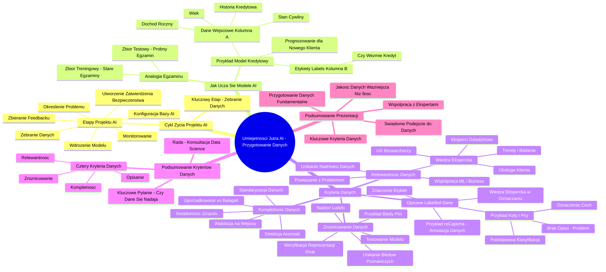

# Lekcje wideo - 3. Cykl życia projektu AI Znajdź dane

# 💡 Diagram

___

# 🗒️ Notatka

# Umiejętności Jutra AI: Przygotowanie Danych - Notatki i Podsumowanie

## Wprowadzenie

Prezentacja "Umiejętności Jutra AI" koncentruje się na kluczowym aspekcie projektów sztucznej inteligencji (AI) – **przygotowaniu danych**. Wojciech Strzałkowski podkreśla, że **przygotowanie danych jest najważniejszym krokiem we wdrażaniu AI**, stanowiącym przejście od teorii do praktycznych zastosowań. Celem prezentacji jest wyjaśnienie, w jaki sposób modele uczenia maszynowego przyswajają wiedzę oraz jakie kryteria muszą spełniać dane, aby były adekwatne dla modeli AI.

## Cykl Życia Projektu AI i Rola Danych

Prezentacja rozpoczyna się od przedstawienia schematu **cyklu życia projektu AI**, składającego się z siedmiu etapów:

1. Określenie problemu
2. **Zebranie danych** (etap kluczowy)
3. Konfiguracja bazy AI
4. Utworzenie zatwierdzenia bezpieczeństwa
5. Wdrożenie modelu
6. Zbieranie informacji zwrotnej (feedback)
7. Monitorowanie

Etap **"Zebranie danych"** został wyróżniony jako fundamentalny, co podkreśla istotną rolę danych w całym procesie.

## Jak Uczą Się Modele Uczenia Maszynowego? - Analogia Egzaminu 📝

Wojciech Strzałkowski, aby objaśnić proces uczenia modeli, posługuje się analogią nauczyciela przygotowującego ucznia do egzaminu:

- **Zbiór Treningowy:**  Przyrównany do **starych egzaminów z poprzednich lat**. Model (uczeń) uczy się na ich podstawie rozpoznawania wzorców i podejmowania decyzji.
- **Zbiór Testowy:** Porównany do **próbnego egzaminu, którego uczeń wcześniej nie widział**. Służy do weryfikacji, czy model (uczeń) rzeczywiście przyswoił wiedzę, a nie tylko zapamiętał odpowiedzi.

## Przykład Praktyczny: Model Kredytowy Banku 🏦

Aby zilustrować znaczenie danych, zaprezentowano przykład banku, który chce stworzyć model prognozujący, czy klient zaciągnie kredyt.

- **Dane Wejściowe (Kolumny A):** Informacje o kliencie: **wiek, dochód roczny, stan cywilny, historia kredytowa**.
- **Etykiety / Labels (Kolumna B):**  To, co model ma przewidywać: **Czy klient wziął kredyt? (1 = Tak, 0 = Nie)**. Są to tak zwane **etykiety (labels)**.

Model uczy się zależności pomiędzy danymi wejściowymi (A) a etykietami (B). Następnie, dla nowego klienta (dysponując jedynie danymi z kolumn A), model ma za zadanie przewidzieć wartość B – prawdopodobieństwo zaciągnięcia kredytu.

**Kluczowe wnioski z przykładu:**

- Jakość i reprezentatywność **danych treningowych** są **fundamentalne**.
- Jeśli dane treningowe są **jednorodne** (np. obejmują tylko młode osoby), model może nauczyć się **błędnych wzorców**.

## Jakie Dane Nadają Się do Modelu AI? - Cztery Kluczowe Kryteria ✅

Podkreślono, że **dane stanowią absolutny fundament każdego projektu AI**.  Nawet najlepszy zespół i budżet nie компенсуют braku odpowiednich danych. Dane muszą spełniać cztery kluczowe kryteria:

1. **Relewantne**
2. **Opisane (Olabelkowane)**
3. **Kompletne**
4. **Zróżnicowane**

### 1. Relewantność Danych 🎯

- Dane muszą być **ściśle powiązane z problemem**, który zamierzamy rozwiązać.
- **Błąd:** Tworzenie systemów rekomendacji w oparciu o logi systemowe zamiast analizy zachowań użytkowników (analogia kliknięć w menu vs. dokonanych zakupów).
- **Wiedza ekspercka jest kluczowa** dla określenia relewantnych danych. Należy korzystać z wiedzy:
    - **Ekspertów dziedzinowych:** Co wpływa na skuteczność sprzedaży? (np. białe tło zdjęć produktów).
    - **UX researcherów i obsługi klienta:** Jakie problemy zgłaszają użytkownicy? (np. szczegóły produktu ważniejsze niż kliknięcia).
    - **Trendów i badań naukowych:** Czy istnieją potwierdzone wzorce?
- **Należy unikać:** Wprowadzania do modelu wszystkich dostępnych danych w nadziei, że AI samo wyciągnie wnioski. **Większa ilość danych nie zawsze przekłada się na lepszą jakość.**  Lepiej skoncentrować się na **mniejszej liczbie istotnych sygnałów**.
- **Praktyka:**  Konieczna jest ścisła współpraca zespołu Machine Learning z ekspertami biznesowymi już na etapie definiowania danych treningowych.

### 2. Opisane (Labelled) Dane 🏷️

- Dane muszą być **opatrzone etykietami (olabelkowane)**, co oznacza, że **musimy wiedzieć, co te dane faktycznie reprezentują**.
- **Przykład reCaptcha:** Rozwiązywanie reCaptcha **trenuje modele AI Google** (digitalizacja Google Books, archiwum New York Times). **Crowdsourcing w oznaczaniu danych**.
- **Istotne:** Oznaczenia muszą mieć **znaczenie z punktu widzenia problemu biznesowego**.
- **Przykład z obrazami kotów i psów:** 🐈 🐕
    - **Podstawowa Klasyfikacja (Mało Użyteczne):**  \"Pies\", \"Kot\" - proste, lecz mało przydatne biznesowo.
    - **Oznaczenie Konkretnych Cech (Użyteczne):** Waga zwierząt (np. 18 funtów, 14 funtów) - dane metryczne, bardziej wartościowe (analogicznie do rozmiaru, materiału, stylu bluzki w e-commerce).
    - **Brak Oznaczeń (Problem):**  Masy nieopisanych danych - realność wielu firm. **Sztuka efektywnego oznaczania** polega na etykietowaniu tylko danych, które mają istotne znaczenie.
- **Ponownie podkreślono:** Wiedza ekspercka (dziedzinowa, UX, trendy) pomaga określić, **które dane są naprawdę istotne** i jak je efektywnie oznaczać.

### 3. Kompletność Danych (i Jakość) 💯

- **Kompletność danych jest kluczowa**.
- **Porównanie:** Zestaw danych \"uporządkowany\" (kompletny, jednolity) kontra \"bałagan\" (braki, niejasne znaki, nieprawidłowe wartości).
- **Oczywiste:** Zestaw \"uporządkowany\" umożliwi modelowi podejmowanie **trafniejszych decyzji**.
- **Analogia:** Niekompletne dane są jak kucharz bez kompletu składników. 🧑‍🍳
- **Skutki:**  Błędne decyzje AI, bazujące na niekompletnych danych, mogą generować **poważne straty finansowe** (przykład banku).
- **Rozwiązania w zakresie kompletności danych:**
    - **Walidacja na wejściu:** Weryfikacja danych już w momencie ich gromadzenia.
    - **Standaryzacja:** Ujednolicenie formatów danych (np. \"kawaler\" vs. \"kaw.\").
    - **Automatyczna detekcja anomalii:** Systemy identyfikujące braki i nieprawidłowe wartości.
    - **Świadomość:** Uświadomienie zespołu, że złe dane = złe decyzje.

### 4. Zróżnicowanie Danych 🌍

- **Zróżnicowanie danych jest kluczowe, aby uniknąć błędów poznawczych i stronniczości.**
- **Przykład błędu poznawczego:** Model rozpoznawania obrazów. Trenowany na zbiorze danych, w którym większość zdjęć osób gotujących przedstawia kobiety. Model błędnie klasyfikuje mężczyzn gotujących również jako kobiety.
- **AI działa w oparciu o wzorce obecne w danych.** Jeśli dane są obciążone stronniczością, AI powieli i wzmocni te błędy.
- **Konsekwencje braku zróżnicowania:** Dyskryminacja, błędne decyzje, potencjalne zagrożenia dla ludzi.
- **Rozwiązania w zakresie zróżnicowania danych:**
    - **Weryfikacja reprezentacji różnych grup użytkowników** w danych przez zespół.
    - **Testowanie modelu na danych, które nie były wykorzystane do treningu**, w celu wykrycia potencjalnych błędów.
    - **Nadzór ludzki:** AI nie może być jedynym decydentem w sytuacjach wysokiego ryzyka. Modele muszą być **nadzorowane i regularnie aktualizowane**.
- **Zróżnicowanie danych to fundament odpowiedzialnych systemów AI.** Brak zróżnicowania może prowadzić do logicznych, lecz katastrofalnie błędnych decyzji.

## Podsumowanie Kryteriów Danych i Kluczowe Pytanie 🤔

Przed rozpoczęciem procesu trenowania modelu, należy zadać sobie **fundamentalne pytanie:** **Czy nasze dane w ogóle nadają się do tego celu?**

**Cztery podstawowe kryteria danych (przypomnienie):**

1. **Relewantność:** Czy dane odnoszą się do rozwiązywanego problemu?
2. **Opisanie:** Czy rozumiemy, co dane oznaczają?
3. **Kompletność:** Czy dane są pełne i pozbawione braków?
4. **Zróżnicowanie:** Czy dane reprezentują różnorodne grupy i scenariusze?

**Rada:** **Skonsultuj się z zespołem Data Science.** Ich wiedza pomoże przeanalizować, zweryfikować jakość i udoskonalić dane.

**Ważne przesłanie końcowe:** **Im wcześniej rozpoczniecie dyskusję o danych, tym lepiej.** Nie czekajcie, aż pojawią się problemy. Złe dane = złe wyniki.

## Podsumowanie Prezentacji 📝

Prezentacja Wojciecha Strzałkowskiego "Umiejętności Jutra AI" skupia się na **przygotowaniu danych jako fundamentalnym etapie w projektach AI**.  Podkreśla, że **jakość danych ma większe znaczenie niż ich ilość**.  Przedstawiono **cztery kluczowe kryteria**, które dane muszą spełniać, aby były odpowiednie dla modeli uczenia maszynowego: **relewantność, opisanie, kompletność i zróżnicowanie**.  Prezentacja zawiera praktyczne przykłady i analogie, ułatwiające zrozumienie omawianych koncepcji, a także akcentuje znaczenie **współpracy z ekspertami dziedzinowymi i zespołem Data Science** w procesie przygotowania danych.  Głównym przesłaniem jest **świadome podejście do danych** i zrozumienie, że **dobre dane stanowią fundament skutecznej i odpowiedzialnej AI**.

___

# 🔉 Transcript
File: Lekcje wideo - 3. Cykl życia projektu AI Znajdź dane.mp4 
[00:00:04] (Na ekranie pojawia się tytuł "Umiejętności Jutra AI". Poniżej widoczne są loga organizatora Google i partnera edukacyjnego SGH.)
[00:00:05] Wojciech Strzałkowski: Zejdźmy z poziomu teorii.
[00:00:07] Wojciech Strzałkowski: Kiedy już potwierdzicie, że wasz projekt spełnia wszystkie te kryteria, co dalej?
[00:00:12] Wojciech Strzałkowski: To prowadzi nas do najważniejszego kroku we wdrażaniu AI.
[00:00:16] Wojciech Strzałkowski: Przygotowania danych.
[00:00:17] (Na ekranie pojawia się schemat cyklu życia projektu AI. Składa się on z siedmiu kroków ułożonych w okrąg: 01 Określ problem, 02 Zbierz dane, 03 Skonfiguruj bazę AI, 04 Utwórz zatwierdzenie bezpieczeństwa, 05 Wystawmy model, 06 Zbieraj feedback, 07 Monitoruj. Krok 02 "Zbierz dane" jest zaznaczony na niebiesko.)
[00:00:19] Wojciech Strzałkowski: Tutaj zatrzymajmy się na chwilę i odpowiedzmy sobie na pytanie.
[00:00:22] Wojciech Strzałkowski: W jaki sposób uczą się modele uczenia maszynowego?
[00:00:26] Wojciech Strzałkowski: Wyobraźcie sobie, że jesteście nauczycielem, który ma przygotować ucznia do egzaminu końcowego.
[00:00:32] Wojciech Strzałkowski: Macie dwa kluczowe narzędzia.
[00:00:34] Wojciech Strzałkowski: Pierwsze to tak zwany zbiór treningowy.
[00:00:37] Wojciech Strzałkowski: To jak stare egzaminy z poprzednich lat, na których uczy się ucznia.
[00:00:41] Wojciech Strzałkowski: Na ich podstawie uczeń, w naszym przypadku model, uczy się rozpoznawać wzorce i podejmować decyzje.
[00:00:48] Wojciech Strzałkowski: A drugi to zbiór testowy.
[00:00:50] Wojciech Strzałkowski: To jak próbny egzamin, którego uczeń wcześniej nie widział.
[00:00:53] Wojciech Strzałkowski: Używacie go, żeby sprawdzić, czy faktycznie się nauczył, czy tylko zapamiętał odpowiedzi.
[00:00:58] (Na ekranie pojawia się tabela z danymi klientów banku. Kolumny to: Wiek, Dochód roczny (tys. zł), Stan cywilny, Historia kredytowa (1 = pozytywna, 0 = negatywna), Czy weźmie kredyt? (1 = Tak, 0 = Nie). Kolumny A (Wiek, Dochód roczny, Stan cywilny, Historia kredytowa) i kolumna B (Czy weźmie kredyt?) są zaznaczone.)
[01:00:00] Wojciech Strzałkowski: Pozwólcie, że pokażę to na konkretnym przykładzie.
[01:00:02] Wojciech Strzałkowski: Załóżmy, że jesteśmy bankiem i chcemy stworzyć model przewidujący, czy klient weźmie kredyt.
[01:00:08] Wojciech Strzałkowski: Spójrzcie na tabelę.
[01:00:10] Wojciech Strzałkowski: W kolumnach A mamy dane wejściowe.
[01:00:12] Wojciech Strzałkowski: To wszystkie informacje o kliencie, jego wiek, dochód roczny, stan cywilny, historia kredytowa.
[01:00:19] Wojciech Strzałkowski: W kolumnie B mamy to, co chcemy przewidzieć, czy klient faktycznie wziął kredyt, jedynka, czy nie, zero.
[01:00:27] Wojciech Strzałkowski: To są nasze etykiety, czyli tak zwane labels.
[01:00:30] Wojciech Strzałkowski: Model uczy się znajdować zależności między danymi w kolumnach A, a wynikiem w kolumnie B.
[01:00:36] Wojciech Strzałkowski: Na przykład może odkryć, że osoby z wysokim dochodem i pozytywną historią kredytową częściej biorą kredyty.
[01:00:42] Wojciech Strzałkowski: Później, gdy przyjdzie nowy klient, model dostanie tylko dane z kolumn A i na ich podstawie będzie musiał przewidzieć wartość B.
[01:00:50] Wojciech Strzałkowski: Czy ten klient prawdopodobnie weźmie kredyt.
[01:00:54] Wojciech Strzałkowski: Na drugim slajdzie widzicie te same dane, ale bez kolumny B.
[01:00:57] Wojciech Strzałkowski: Dokładnie tak, jak model widzi nowego klienta.
[01:01:00] Wojciech Strzałkowski: Bazując na wzorcach, których nauczył się z danych treningowych, musi przewidzieć brakującą wartość.
[01:01:07] Wojciech Strzałkowski: To dlatego jakość i reprezentatywność danych treningowych jest tak kluczowa.
[01:01:11] Wojciech Strzałkowski: Jeśli na przykład w danych treningowych mielibyśmy same młode osoby, model mógłby się nauczyć błędnych wzorców dotyczących starszych klientów.
[01:01:20] (Na ekranie pojawia się slajd z tytułem "Jakie dane nadają się do modelu AI?". Pod spodem znajdują się cztery ikony z podpisami: Relewantne, Opisane, Kompletne, Zróżnicowane.)
[01:01:20] Wojciech Strzałkowski: Dane to absolutna podstawa każdego projektu AI.
[01:01:24] Wojciech Strzałkowski: Możecie mieć najlepszy zespół i nieograniczony budżet, ale bez odpowiednich danych daleko nie zajedziecie.
[01:01:30] Wojciech Strzałkowski: Jest kilka kluczowych kryteriów, które muszą spełniać wasze dane.
[01:01:34] Wojciech Strzałkowski: Muszą być relewantne, czyli faktycznie związane z problemem, który chcecie rozwiązać.
[01:01:39] Wojciech Strzałkowski: Często widzę, jak firmy próbują budować systemy rekomendacji w oparciu o dane z logów systemowych, zamiast faktycznych zachowań użytkowników.
[01:01:47] Wojciech Strzałkowski: To jak próba przewidzenia, co klient kupi na podstawie tego, ile razy kliknął w przycisk menu.
[01:01:53] Wojciech Strzałkowski: Możecie znaleźć jakieś korelacje, ale prawdopodobnie będą bez znaczenia biznesowego.
[01:01:58] Wojciech Strzałkowski: Dane muszą być też opisane, czyli olabelkowane.
[01:02:01] Wojciech Strzałkowski: Czyli wiemy, co te dane właściwie znaczą.
[01:02:04] Wojciech Strzałkowski: Wyobraźcie sobie, że macie milion zdjęć produktów, ale nie macie informacji, które przedstawiają buty, a które kurtki.
[01:02:10] Wojciech Strzałkowski: Model może się nauczyć rozpoznawać wzory, ale bez tych etykiet nie będzie wiedział, co te wzory oznaczają.
[01:02:17] Wojciech Strzałkowski: To jak próba nauczenia się języka obcego tylko słuchając go bez tłumaczenia, co poszczególne słowa znaczą.
[01:02:24] Wojciech Strzałkowski: Dane muszą być kompletne, czyli wszystkie potrzebne informacje muszą być dostępne i spójne.
[01:02:30] Wojciech Strzałkowski: Częsty problem to brakujące wartości lub niespójne formaty.
[01:02:34] Wojciech Strzałkowski: Na przykład część użytkowników ma wpisany wiek, a część nie, albo daty są raz w formacie europejskim, a raz w amerykańskim.
[01:02:40] Wojciech Strzałkowski: Z takimi danymi model albo się nie nauczy, albo nauczy się błędnych wzorców.
[01:02:47] Wojciech Strzałkowski: I wreszcie muszą być zróżnicowane, czyli reprezentujące różne przypadki i scenariusze.
[01:02:52] Wojciech Strzałkowski: Jeśli trenujecie model rozpoznawania spamu tylko na przykładach ze starego typu oszustw, nie poradzi sobie z nowymi technikami.
[01:02:59] Wojciech Strzałkowski: Potrzebujecie danych pokazujących różne sytuacje, edge cases, wyjątki.
[01:03:03] Wojciech Strzałkowski: To jak uczenie się jazdy samochodem.
[01:03:05] Wojciech Strzałkowski: Nie wystarczy poćwiczyć na pustym parkingu.
[01:03:08] Wojciech Strzałkowski: Trzeba też doświadczyć różnych sytuacji drogowych.
[01:03:10] (Na ekranie pojawia się slajd z tytułem "Relewantność danych". Widzimy schemat: kilka prostokątów symbolizujących dane wejściowe, strzałka do mózgu, strzałka do napisu "45% accuracy". Pod spodem znajduje się napis "Czy mamy jakieś przesłanki eksperckie? Co podpowiadają nam UX researcherzy, sprzedaż albo obsługa klienta? Czy są jakieś trendy albo badania naukowe?")
[01:03:11] Wojciech Strzałkowski: Zacznijmy od relewantności.
[01:03:13] Wojciech Strzałkowski: Wyobraźcie sobie, że budujecie model do oceny jakości zdjęć produktowych w e-commerce.
[01:03:18] Wojciech Strzałkowski: Patrząc na surowe dane, możecie osiągnąć dokładność około 45%.
[01:03:22] Wojciech Strzałkowski: Ale gdy skupicie się tylko na kluczowych cechach wskazanych przez ekspertów, na przykład przejrzystość tła i ostrość głównego obiektu, dokładność skacze do 85%.
[01:03:32] Wojciech Strzałkowski: To dlatego, że przy budowaniu zbiorów treningowych kluczowe jest pytanie, jakie dane naprawdę mają znaczenie.
[01:03:40] Wojciech Strzałkowski: I tu warto sięgnąć po wiedzę ekspercką.
[01:03:42] Wojciech Strzałkowski: Po pierwsze, eksperci dziedzinowi.
[01:03:44] Wojciech Strzałkowski: Co według nich wpływa na skuteczność sprzedaży?
[01:03:47] Wojciech Strzałkowski: Na przykład, czy białe tło faktycznie zwiększa konwersję?
[01:03:50] Wojciech Strzałkowski: Po drugie, UX researcherzy i obsługa klienta.
[01:03:53] Wojciech Strzałkowski: Jakie problemy zgłaszają nasi użytkownicy?
[01:03:56] Wojciech Strzałkowski: Może okazać się, że liczba klików w ofertę jest mniej istotna niż to, czy użytkownik widzi wyraźnie detale produktu.
[01:04:03] Wojciech Strzałkowski: I po trzecie, trendy i badania naukowe.
[01:04:06] Wojciech Strzałkowski: Czy są jakieś sprawdzone wzorce, które możemy wykorzystać?
[01:04:10] Wojciech Strzałkowski: Często popełniany błąd to próba wpakowania do modelu wszystkiego, co się da, licząc, że AI samo się nauczy.
[01:04:16] Wojciech Strzałkowski: To jak próba nauczenia kogoś gotowania, dając mu książkę kucharską plus podręcznik do fizyki kwantowej.
[01:04:21] Wojciech Strzałkowski: Więcej danych nie zawsze znaczy lepiej.
[01:04:24] Wojciech Strzałkowski: Lepiej skupić się na mniejszej liczbie naprawdę istotnych sygnałów, niż zbierać setki metryk o małym znaczeniu.
[01:04:29] Wojciech Strzałkowski: To nie tylko oszczędza czas i zasoby, ale często prowadzi do lepszych wyników.
[01:04:33] Wojciech Strzałkowski: W praktyce oznacza to ścisłą współpracę między zespołem Machine Learning a ekspertami biznesowymi już na etapie definiowania danych treningowych.
[01:04:43] (Na ekranie pojawia się slajd z tytułem "reCaptcha to forma annotacji danych". Widzimy przykład reCaptcha z wyborem świateł ulicznych oraz przykład reCaptcha z wpisywaniem tekstu z obrazka.)
[01:04:44] Wojciech Strzałkowski: Pozwólcie, że opowiem wam o jednym z najsprytniejszych rozwiązań w historii oznaczania danych.
[01:04:48] Wojciech Strzałkowski: Pamiętacie kapczę?
[01:04:50] Wojciech Strzałkowski: Te irytujące testy, gdzie klikacie w światła uliczne albo wpisujecie pokręcone teksty?
[01:04:56] Wojciech Strzałkowski: Za każdym razem, gdy je rozwiązujecie, trenujecie modele AI Google.
[01:05:01] Wojciech Strzałkowski: Od 2011 roku wykorzystali to do zdigitalizowania całego archiwum Google Books i 13 milionów artykułów New York Times, sięgających aż do 1851 roku.
[01:05:12] Wojciech Strzałkowski: To jest crowdsourcing na genialnym poziomie.
[01:05:15] Wojciech Strzałkowski: Ale dochodzimy do sedna sprawy.
[01:05:17] Wojciech Strzałkowski: Opisywanie danych to nie jest tylko kwestia tego, żeby ludzie coś oznaczali.
[01:05:21] Wojciech Strzałkowski: Chodzi o to, żeby oznaczenia faktycznie miały znaczenie dla waszego problemu biznesowego.
[01:05:27] (Na ekranie pojawia się slajd z tytułem "Opisane (labelled) dane". Widzimy trzy kolumny: Labelled data, Labelled data, Unlabelled data. W każdej kolumnie znajdują się obrazki psów i kotów. W kolumnie "Labelled data" pod każdym obrazkiem znajduje się podpis "Dog" lub "Cat". W kolumnie "Labelled data" pod każdym obrazkiem znajduje się waga zwierzęcia w funtach. W kolumnie "Unlabelled data" nie ma żadnych podpisów.)
[01:05:28] Wojciech Strzałkowski: Spójrzmy na prosty przykład, który świetnie pokazuje różne podejścia do oznaczania danych.
[01:05:33] Wojciech Strzałkowski: Mamy obrazki kotów i psów.
[01:05:35] Wojciech Strzałkowski: Wydawałoby się prosta sprawa, prawda?
[01:05:38] Wojciech Strzałkowski: Ale zobaczcie, jak różnie możemy to zrobić.
[01:05:41] Wojciech Strzałkowski: Pierwszy sposób to podstawowa klasyfikacja.
[01:05:43] Wojciech Strzałkowski: To jest pies, to jest kot.
[01:05:45] Wojciech Strzałkowski: Proste, prawda?
[01:05:47] Wojciech Strzałkowski: Ale często mało użyteczne biznesowo.
[01:05:50] Wojciech Strzałkowski: To jak mówienie, to jest produkt, a to jest inny produkt.
[01:05:53] Wojciech Strzałkowski: Technicznie prawdziwe, ale co dalej?
[01:05:55] Wojciech Strzałkowski: Drugi sposób to oznaczenie konkretnych cech, 18 funtów, 14 funtów, 12 funtów, 9 funtów.
[01:06:00] Wojciech Strzałkowski: Teraz nasz model nie tylko wie, co widzi, ale ma konkretne dane metryczne.
[01:06:04] Wojciech Strzałkowski: To jak w e-commerce, nie wystarczy wiedzieć, że coś jest bluzką, trzeba znać rozmiar, materiał, styl.
[01:06:10] Wojciech Strzałkowski: A co z trzecią sytuacją, gdy nie mamy żadnych oznaczeń?
[01:06:13] Wojciech Strzałkowski: To jest rzeczywistość większości firm.
[01:06:16] Wojciech Strzałkowski: Masa nieopisanych danych i tu właśnie wchodzi sztuka efektywnego oznaczania.
[01:06:21] Wojciech Strzałkowski: Zamiast próbować oznaczać wszystko, zadajcie sobie pytanie, jakie dane naprawdę mają znaczenie.
[01:06:27] Wojciech Strzałkowski: I tu warto sięgnąć po wiedzę ekspercką.
[01:06:29] Wojciech Strzałkowski: Po pierwsze, eksperci dziedzinowi.
[01:06:31] Wojciech Strzałkowski: Co według nich wpływa na skuteczność sprzedaży?
[01:06:34] Wojciech Strzałkowski: Na przykład, czy białe tło faktycznie zwiększa konwersję?
[01:06:37] Wojciech Strzałkowski: Po drugie, UX researcherzy i obsługa klienta.
[01:06:40] Wojciech Strzałkowski: Jakie problemy zgłaszają nasi użytkownicy?
[01:06:43] Wojciech Strzałkowski: Może okazać się, że liczba klików w ofertę jest mniej istotna niż to, czy użytkownik widzi wyraźnie detale produktu.
[01:06:49] Wojciech Strzałkowski: I po trzecie, trendy i badania naukowe.
[01:06:52] Wojciech Strzałkowski: Czy są jakieś sprawdzone wzorce, które możemy wykorzystać?
[01:06:56] Wojciech Strzałkowski: Często popełniany błąd to próba wpakowania do modelu wszystkiego, co się da, licząc, że AI samo się nauczy.
[01:07:01] Wojciech Strzałkowski: To jak próba nauczenia kogoś gotowania, dając mu książkę kucharską plus podręcznik do fizyki kwantowej.
[01:07:06] Wojciech Strzałkowski: Więcej danych nie zawsze znaczy lepiej.
[01:07:09] Wojciech Strzałkowski: Lepiej skupić się na mniejszej liczbie naprawdę istotnych sygnałów, niż zbierać setki metryk o małym znaczeniu.
[01:07:15] Wojciech Strzałkowski: To nie tylko oszczędza czas i zasoby, ale często prowadzi do lepszych wyników.
[01:07:19] Wojciech Strzałkowski: Oznacza to w praktyce ścisłą współpracę między zespołem Machine Learning a ekspertami biznesowymi już na etapie definiowania danych treningowych.
[01:07:28] (Na ekranie pojawia się slajd z tytułem "Kompletność (i jakość) danych". Widzimy dwie tabele: "A" - uporządkowana i "B" - bałagan. Tabela A zawiera kolumny: Wiek, Dochód roczny (tys. zł), Stan cywilny, Historia kredytowa (1 = pozytywna, 0 = negatywna), Czy weźmie kredyt? (1 = Tak, 0 = Nie). Tabela B zawiera te same kolumny, ale niektóre pola są puste, zawierają dziwne znaki lub niepoprawne wartości.)
[01:07:28] Wojciech Strzałkowski: Kompletność danych.
[01:07:30] Wojciech Strzałkowski: Spójrzmy na dwa zestawy danych.
[01:07:32] Wojciech Strzałkowski: Pierwszy, uporządkowany.
[01:07:34] Wojciech Strzałkowski: Każda kolumna zawiera pełne informacje, wszystko jest jednolite, brak pustych wartości.
[01:07:40] Wojciech Strzałkowski: Drugi, bałagan.
[01:07:42] Wojciech Strzałkowski: Brakuje kluczowych danych, w niektórych miejscach są dziwne znaki, w innych niepoprawne wartości.
[01:07:48] Wojciech Strzałkowski: I teraz kluczowe pytanie, który zestaw sprawi, że model AI podejmie lepsze decyzje?
[01:07:53] Wojciech Strzałkowski: Odpowiedź jest oczywista.
[01:07:55] Wojciech Strzałkowski: Bez kompletnych i poprawnych danych AI jest jak kucharz, który próbuje ugotować obiad bez połowy składników.
[01:08:00] Wojciech Strzałkowski: Może coś z tego wyjdzie, ale na pewno nie to, czego oczekiwaliśmy.
[01:08:04] Wojciech Strzałkowski: Jeśli model AI opiera się na niekompletnych danych, to jego decyzje mogą być po prostu błędne.
[01:08:09] Wojciech Strzałkowski: A błędne decyzje w banku dla firmy może to oznaczać kosztowne straty.
[01:08:15] Wojciech Strzałkowski: Okej, czyli wiemy, że kompletność danych jest kluczowa, ale co z tym możemy zrobić?
[01:08:20] Wojciech Strzałkowski: Po pierwsze, walidacja na wejściu.
[01:08:22] Wojciech Strzałkowski: Sprawdzajmy dane już w momencie ich zbierania.
[01:08:25] Wojciech Strzałkowski: Po drugie, standaryzacja.
[01:08:28] Wojciech Strzałkowski: Nie może być tak, że w jednej kolumnie mamy kawaler, a w drugiej kaw. z kropką.
[01:08:32] Wojciech Strzałkowski: AI nie wie, że to to samo.
[01:08:35] Wojciech Strzałkowski: Po trzecie, automatyczna detekcja anomalii.
[01:08:38] Wojciech Strzałkowski: Systemy powinny wychwytywać brakujące lub dziwne wartości.
[01:08:43] Wojciech Strzałkowski: I wreszcie świadomość.
[01:08:45] Wojciech Strzałkowski: Jeśli ludzie w zespole wiedzą, że złe dane oznaczają złe decyzje, to będą bardziej na nie uważać.
[01:08:51] (Na ekranie pojawia się slajd z tytułem "Zróżnicowanie danych". Widzimy schemat: pięć zdjęć osób gotujących, pod każdym zdjęciem znajduje się opis: COOKING, ROLE, AGENT, FOOD, HEAT, TOOL, PLACE. Pod każdym opisem znajduje się lista słów związanych z gotowaniem, np. WOMAN, MAN, PASTA, FRUIT, STOVE, KNIFE, KITCHEN. Pod spodem znajduje się napis: "In this example of gender bias, adapted from a report published by researchers from the University of Virginia and the University of Washington, a visual semantic role labeling system has learned to identify a person cooking as female, even when the image is male.")
[01:08:52] Wojciech Strzałkowski: Przejdźmy teraz do zróżnicowania danych.
[01:08:55] Wojciech Strzałkowski: Wyobraźcie sobie, że budujemy model AI do rozpoznawania obrazów i chcemy, żeby potrafił identyfikować ludzi w różnych kontekstach.
[01:09:00] Wojciech Strzałkowski: Trenujemy go na dużym zbiorze zdjęć.
[01:09:03] Wojciech Strzałkowski: Po jakimś czasie model zaczyna działać i dostajemy pierwsze wyniki.
[01:09:07] Wojciech Strzałkowski: Patrzymy na klasyfikację i widzimy coś dziwnego.
[01:09:10] Wojciech Strzałkowski: Zdjęcia kobiet w kuchni są oznaczane jako kobieta.
[01:09:14] Wojciech Strzałkowski: Zdjęcia mężczyzn w kuchni również są oznaczane jako kobieta.
[01:09:19] Wojciech Strzałkowski: Co się stało?
[01:09:21] Wojciech Strzałkowski: AI nie myśli tak jak my, nie rozumie kontekstu.
[01:09:25] Wojciech Strzałkowski: Działa na podstawie wzorców w danych, a jeśli w zbiorze treningowym większość zdjęć przedstawia kobiety gotujące, to model uczy się, że osoba gotująca to najprawdopodobniej kobieta.
[01:09:35] Wojciech Strzałkowski: To klasyczny przykład błędu poznawczego w danych, który AI tylko wzmacnia.
[01:09:40] Wojciech Strzałkowski: Dokładnie to widzimy na tym przykładzie.
[01:09:43] Wojciech Strzałkowski: Jeśli w zbiorze treningowym większość przykładów osób kuchni to kobiety, model będzie zawsze przypisywał kobietę, nawet jeśli na zdjęciu ewidentnie gotuje mężczyzna.
[01:09:52] Wojciech Strzałkowski: Model nie ma złych intencji, on tylko powiela to, co zostało mu dostarczone.
[01:09:57] Wojciech Strzałkowski: I to pokazuje, dlaczego zróżnicowanie danych jest kluczowe.
[01:10:00] Wojciech Strzałkowski: Jeśli trenujemy AI na jednostronnych, niepełnych lub stronniczych danych, model nie tylko powieli te błędy, ale wręcz je wzmocni.
[01:10:07] Wojciech Strzałkowski: Może prowadzić do dyskryminacji, błędnych decyzji i w skrajnych przypadkach realnych zagrożeń dla ludzi.
[01:10:15] Wojciech Strzałkowski: Jak temu zapobiegać?
[01:10:17] Wojciech Strzałkowski: Po pierwsze, zespół pracujący nad danymi musi sprawdzać, czy reprezentowane są różne grupy użytkowników.
[01:10:24] Wojciech Strzałkowski: Po drugie, warto testować model na danych, które nie były używane do jego treningu, żeby wykryć potencjalne błędy.
[01:10:31] Wojciech Strzałkowski: Po trzecie, AI nie może być jedynym decydentem w sprawach wysokiego ryzyka.
[01:10:36] Wojciech Strzałkowski: Modele muszą być nadzorowane i stale aktualizowane, bo jeśli raz nauczył się błędnych wzorców, będą je powielać bez końca.
[01:10:45] Wojciech Strzałkowski: Zróżnicowanie danych to nie techniczny szczegół, to fundament tworzenia odpowiedzialnych systemów AI.
[01:10:51] Wojciech Strzałkowski: Jeśli zapomnimy o tej zasadzie, możemy stworzyć model, który będzie podejmować logiczne, ale katastrofalnie błędne decyzje.
[01:10:59] Wojciech Strzałkowski: Zanim zaczniemy trenować model, warto zadać sobie jedno kluczowe pytanie: czy nasze dane w ogóle się do tego nadają?
[01:11:04] Wojciech Strzałkowski: To, że mamy dużą ilość informacji jeszcze nic nie znaczy.
[01:11:07] Wojciech Strzałkowski: Ważne jest, żeby dane spełniały cztery podstawowe kryteria.
[01:11:11] Wojciech Strzałkowski: Po pierwsze, relewantność.
[01:11:13] Wojciech Strzałkowski: Czy te dane rzeczywiście odnoszą się do problemu, który chcemy rozwiązać?
[01:11:17] Wojciech Strzałkowski: Możemy mieć tony informacji, ale jeśli nie są istotne dla naszego modelu, to są po prostu bezużyteczne.
[01:11:23] Wojciech Strzałkowski: Po drugie, opisanie.
[01:11:25] Wojciech Strzałkowski: Jeśli mamy zestaw danych, ale nie wiemy, co oznaczają poszczególne kolumny, to mamy duży problem.
[01:11:30] Wojciech Strzałkowski: AI nie zrozumie kontekstu, jeśli nie dostarczymy mu dobrze opisanych, jasno oznaczonych danych.
[01:11:36] Wojciech Strzałkowski: Po trzecie, kompletność.
[01:11:38] Wojciech Strzałkowski: Braki w danych mogą sprawić, że model będzie zgadywał, a jeśli model zgaduje, to jego decyzje są losowe.
[01:11:45] Wojciech Strzałkowski: A jeśli jego decyzje są losowe, to po co właściwie nam AI?
[01:11:49] Wojciech Strzałkowski: I po czwarte, zróżnicowanie.
[01:11:52] Wojciech Strzałkowski: Jeśli model trenujemy tylko na jednej grupie użytkowników, to nie możemy oczekiwać, że będzie działał dobrze dla wszystkich.
[01:11:58] Wojciech Strzałkowski: Stronnicze dane równa się stronnicze AI.
[01:12:02] Wojciech Strzałkowski: Jeśli nie jesteśmy pewni, czy nasze dane spełniają te kryteria, najlepsza rada jest prosta.
[01:12:07] Wojciech Strzałkowski: Porozmawiajmy z człowiekiem od danych.
[01:12:09] Wojciech Strzałkowski: Zespół Data Science pomoże nam przeanalizować dane, sprawdzić ich jakość i ewentualnie je ulepszyć.
[01:12:15] (Na ekranie pojawia się napis: "Im szybciej zaczniecie rozmawiać o swoich danych, tym lepiej. Zespół Data Science pomoże Wam wybrać lub ulepszyć istniejące dane.")
[01:12:16] Wojciech Strzałkowski: I jeszcze jedno.
[01:12:18] Wojciech Strzałkowski: Im szybciej zaczniemy rozmawiać o danych, tym lepiej.
[01:12:21] Wojciech Strzałkowski: Nie warto czekać do momentu, aż coś pójdzie nie tak.
[01:12:24] Wojciech Strzałkowski: Bo jeśli model dostanie złe dane, to na pewno da nam złe wyniki.
[01:12:28] Wojciech Strzałkowski: A potem zostaje nam tylko pytanie, co poszło nie tak?
[01:12:58] (Na ekranie pojawia się tytuł "Umiejętności Jutra AI". Poniżej widoczne są loga organizatora Google i partnera edukacyjnego SGH.)

___
# 🏷️ Tags
#Umiejętności_Jutra_AI #AI #sztuczna_inteligencja #przygotowanie_danych #dane #uczenie_maszynowe #modele_uczenia_maszynowego #cykl_życia_projektu_AI #zebranie_danych #zbiór_treningowy #zbiór_testowy #analogia_egzaminu #model_kredytowy #dane_wejściowe #etykiety #labels #dane_treningowe #jakość_danych #reprezentatywność_danych #kryteria_danych #relewantność_danych #opisane_dane #olabelkowane_dane #kompletność_danych #zróżnicowanie_danych #wiedza_ekspercka #eksperci_dziedzinowi #UX_research #obsługa_klienta #trendy #badania_naukowe #systemy_rekomendacji #logi_systemowe #zachowania_użytkowników #reCaptcha #Google #digitalizacja #crowdsourcing #klasyfikacja #dane_metryczne #walidacja_danych #standaryzacja_danych #detekcja_anomalii #błędy_poznawcze #stronniczość_danych #dyskryminacja #nadzór_ludzki #Data_Science #zespół_Data_Science #bezpieczeństwo #wdrażanie #monitorowanie #feedback #bezpieczeństwo_AI #bezpieczeństwo_danych #ochrona_danych #prywatność #ryzyko #odpowiedzialność #etyka #etyka_AI #AI_etyczne #AI_odpowiedzialne #AI_bezpieczne #AI_zaufane #zaufanie_do_AI #przyszłość_AI #AI_w_biznesie #AI_w_edukacji #AI_w_nauce #AI_w_medycynie #AI_w_finansach #AI_w_transporcie #AI_w_energetyce #AI_w_rolnictwie #AI_w_administracji #AI_w_kulturze #AI_w_rozrywce #AI_w_sporcie #AI_w_życiu_codziennym #AI_dla_wszystkich #AI_dostępne #AI_otwarte #AI_transparentne #AI_wyjaśnialne #AI_interpretowalne #AI_rozumiane #AI_kontrolowane #AI_regulowane #AI_nadzorowane #AI_monitorowane #AI_oceniane #AI_udoskonalane #AI_rozwijane #AI_uczące_się #AI_adaptacyjne #AI_elastyczne #AI_skalowalne #AI_wydajne #AI_efektywne #AI_innowacyjne #AI_kreatywne #AI_inteligentne #AI_mądre #AI_użyteczne #AI_pomocne #AI_wspierające #AI_ułatwiające #AI_poprawiające #AI_wzbogacające #AI_transformujące #AI_rewolucjonizujące #AI_kształtujące_przyszłość #Wojciech_Strzałkowski #SGH #Google_AI #Umiejętności_Jutra #błędy_w_danych #jakość_zdjęć_produktowych #e-commerce #konwersja #dane_systemowe #dane_użytkowników #detale_produktu #wzorce_w_danych #dane_stronnicze #dane_niepełne #dane_jednostronne #dane_bez_etykiet #dane_z_etykietami #dane_opisane #dane_relewantne #dane_kompletne #dane_zróżnicowane #dane_treningowe_AI #dane_testowe_AI #dane_walidacyjne_AI #dane_rzeczywiste_AI #dane_syntetyczne_AI #dane_anonimizowane_AI #dane_prywatne_AI #dane_publiczne_AI #dane_otwarte_AI #dane_zamknięte_AI #dane_strukturalne_AI #dane_niestrukturalne_AI #dane_tekstowe_AI #dane_obrazowe_AI #dane_dźwiękowe_AI #dane_wideo_AI #dane_czasowe_AI #dane_przestrzenne_AI #dane_geograficzne_AI #dane_społeczne_AI #dane_ekonomiczne_AI #dane_polityczne_AI #dane_kulturowe_AI #dane_naukowe_AI #dane_medyczne_AI #dane_finansowe_AI #dane_transportowe_AI #dane_energetyczne_AI #dane_rolnicze_AI #dane_administracyjne_AI #dane_kulturalne_AI #dane_rozrywkowe_AI #dane_sportowe_AI #dane_codzienne_AI #dane_dla_AI #dane_do_AI #dane_w_AI #dane_z_AI #dane_przez_AI #dane_o_AI #dane_dzięki_AI #dane_z_pomocą_AI #dane_z_wykorzystaniem_AI #dane_z_udziałem_AI #dane_współpracujące_z_AI #dane_i_AI #AI_i_dane #współpraca_danych_i_AI #synergia_danych_i_AI #integracja_danych_i_AI #połączenie_danych_i_AI #związek_danych_i_AI #relacja_danych_i_AI #interakcja_danych_i_AI #wpływ_danych_na_AI #wpływ_AI_na_dane #transformacja_danych_przez_AI #transformacja_AI_przez_dane #przyszłość_danych_i_AI #potencjał_danych_i_AI #możliwości_danych_i_AI #wyzwania_danych_i_AI #zagrożenia_danych_i_AI #szanse_danych_i_AI #korzyści_danych_i_AI #ryzyka_danych_i_AI #bezpieczeństwo_danych_w_AI #etyka_danych_w_AI #odpowiedzialność_za_dane_w_AI #nadzór_nad_danymi_w_AI #regulacje_danych_w_AI #standardy_danych_w_AI #jakość_danych_w_AI #kompletność_danych_w_AI #zróżnicowanie_danych_w_AI #relewantność_danych_w_AI #opisanie_danych_w_AI #olabelkowanie_danych_w_AI #annotacja_danych_w_AI #czyszczenie_danych_w_AI #przetwarzanie_danych_w_AI #analiza_danych_w_AI #wizualizacja_danych_w_AI #interpretacja_danych_w_AI #wykorzystanie_danych_w_AI #zastosowanie_danych_w_AI #wdrażanie_danych_w_AI #monitorowanie_danych_w_AI #udoskonalanie_danych_w_AI #rozwój_danych_w_AI #uczenie_się_danych_w_AI #adaptacja_danych_w_AI #elastyczność_danych_w_AI #skalowalność_danych_w_AI #wydajność_danych_w_AI #efektywność_danych_w_AI #innowacyjność_danych_w_AI #kreatywność_danych_w_AI #inteligencja_danych_w_AI #mądrość_danych_w_AI #użyteczność_danych_w_AI #pomocność_danych_w_AI #wsparcie_danych_w_AI #ułatwienie_danych_w_AI #poprawa_danych_w_AI #wzbogacenie_danych_w_AI #transformacja_danych_przez_AI #rewolucjonizacja_danych_przez_AI #kształtowanie_przyszłości_danych_przez_AI
