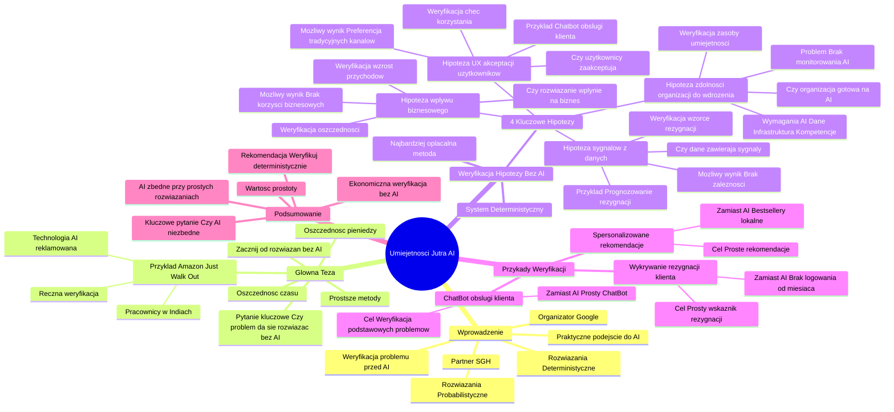

# Lekcje wideo - 4. Cykl życia projektu AI Spróbuj bez AI

# 💡 Diagram

___

# 🗒️ Notatka

# Notatki i Podsumowanie Prezentacji Wideo: "Umiejętności Jutra AI"

## Wprowadzenie

Prezentacja wideo pt. "Umiejętności Jutra AI", zorganizowana przez Google 🔍 i SGH, koncentruje się na praktycznym podejściu do wdrażania sztucznej inteligencji (`AI`) 🤖.  Kluczowym przesłaniem jest **zweryfikowanie, czy dany problem można rozwiązać za pomocą prostszych metod, zanim zainwestuje się w złożone rozwiązania `AI`**.  Podkreśla się, że często najbardziej efektywne i opłacalne jest rozpoczęcie od rozwiązań deterministycznych, opartych na jasnych regułach, a nie probabilistycznych modelach `AI`.

## Główna Teza: Zacznij od Rozwiązań Bez `AI`

*   Często postrzegamy `AI` jako magiczne rozwiązanie, lecz warto rozważyć prostsze metody na początku.
*   **Kluczowe pytanie:** Czy problem da się rozwiązać bez użycia `AI`?
*   **Korzyść:** Oszczędność czasu ⏱️ i pieniędzy 💰.
*   **Zasada:** Przed wdrożeniem `AI`, spróbuj rozwiązać problem prostszymi sposobami.

## Przykład Amazona: Just Walk Out

*   **Technologia Just Walk Out Amazona:**  Miała bazować na zaawansowanej `AI` i umożliwiać zakupy bez kas.
*   **Rzeczywistość:** System był wspierany przez **1000 pracowników w Indiach 🇮🇳**, ręcznie weryfikujących transakcje.
*   **Wniosek:**  Technologia `AI` była reklamowana, ale w praktyce zadanie wykonywali ludzie. To przykład, jak **implementacja `AI` w rzeczywistości odbiega od obietnic marketingowych.**

## Weryfikacja Hipotezy Bez `AI`: System Deterministyczny

*   **Najbardziej kosztowo efektywna metoda pracy z `AI`.**
*   Budowa systemu **deterministycznego** (nie probabilistycznego) umożliwia weryfikację kluczowych hipotez przed inwestycją w `AI`.
*   **System deterministyczny:** Funkcjonuje w oparciu o konkretne, zdefiniowane reguły.

### Cztery Kluczowe Hipotezy do Weryfikacji

1.  **Hipoteza dotycząca sygnałów z danych:**
    *   **Pytanie:** Czy dane w ogóle zawierają użyteczne sygnały?
    *   **Przykład:** Prognozowanie rezygnacji klientów (`churn`).
    *   **Weryfikacja:** Sprawdzenie, czy w danych widoczne są wzorce związane z rezygnacją, zanim zastosuje się `AI`.
    *   **Możliwy wynik:** Może okazać się, że **brak wyraźnych zależności** i `AI` nie przyniesie oczekiwanej wartości.

2.  **Hipoteza dotycząca wpływu biznesowego:**
    *   **Pytanie:** Czy rozwiązanie (nawet z `AI`) realnie wpłynie na działalność biznesową?
    *   **Weryfikacja:** Ustalenie, czy rozwiązanie przełoży się na **oszczędności lub zwiększenie przychodów.**
    *   **Możliwy wynik:** Nawet doskonały model `AI` może okazać się nieprzydatny, jeśli nie generuje korzyści biznesowych.

3.  **Hipoteza dotycząca zdolności organizacji do wdrożenia:**
    *   **Pytanie:** Czy organizacja jest przygotowana na wdrożenie `AI`?
    *   **Wymagania `AI`:** Dostępność danych, odpowiednia infrastruktura, kompetencje zespołu.
    *   **Weryfikacja:** Sprawdzenie, czy organizacja dysponuje zasobami i umiejętnościami potrzebnymi do wdrożenia i **monitorowania `AI`.**
    *   **Możliwy problem:** Brak kompetencji w zakresie monitorowania `AI` może **przynieść więcej szkody niż pożytku.**

4.  **Hipoteza dotycząca `UX` (User Experience) / akceptacji użytkowników:**
    *   **Pytanie:** Czy użytkownicy zaakceptują nowe rozwiązanie?
    *   **Przykład:** Chatbot obsługi klienta.
    *   **Weryfikacja:** Zbadanie, czy użytkownicy będą chętnie korzystać z nowego rozwiązania.
    *   **Możliwy wynik:**  Nawet najlepszy chatbot może ponieść klęskę, jeśli klienci preferują tradycyjne kanały kontaktu (np. infolinia 📞).

## Przykłady Weryfikacji Hipotez Bez `AI`

*   **Spersonalizowane rekomendacje:**
    *   **Zamiast `AI`:** Prezentowanie **bestsellerów, popularnych w lokalizacji danego użytkownika.**
    *   **Cel:** Proste rozwiązanie, które może zaspokoić potrzebę rekomendacji bez angażowania skomplikowanego systemu `AI`.

*   **ChatBot obsługi klienta:**
    *   **Zamiast zaawansowanego ChatBota `AI`:**  Wykorzystanie **prostego chatbota z predefiniowanymi odpowiedziami.**  (Określony jako "Też chatbot, tylko że głupi :)").
    *   **Cel:** Weryfikacja, czy prosty chatbot jest w stanie rozwiązać podstawowe problemy użytkowników.

*   **Wykrywanie rezygnacji klienta (`churn`):**
    *   **Zamiast modelu `AI`:**  **Monitorowanie klientów, którzy nie logowali się od miesiąca.**
    *   **Cel:** Prosty wskaźnik potencjalnej rezygnacji, łatwy we wdrożeniu i monitorowaniu.

## Podsumowanie i Wnioski

*   **Zasada:** Jeżeli problem można rozwiązać prostszą metodą, **`AI` staje się zbędne.**
*   **Weryfikacja bez `AI`:** Najbardziej ekonomiczny i szybki sposób na ocenę, czy warto inwestować w uczenie maszynowe.
*   **Kluczowe pytanie przed wdrożeniem `AI`:** Czy `AI` jest naprawdę niezbędne?
*   **Wartość prostoty:** Niekiedy **najlepsze rozwiązania okazują się prostsze, niż przypuszczamy.**
*   **Rekomendacja:** Przed rozpoczęciem trenowania modelu `AI`, **zweryfikujmy hipotezy za pomocą prostszych, deterministycznych metod.**

## Zakończenie Prezentacji "Umiejętności Jutra AI"

*   Organizator: Google 🔍
*   Partner edukacyjny: SGH

___

# 🔉 Transcript
File: Lekcje wideo - 4. Cykl życia projektu AI Spróbuj bez AI.mp4 
[00:00:00] (Biały ekran)
[00:00:01] (Na ekranie pojawia się napis "Umiejętności Jutra AI". Poniżej napisy "Organizator Google" oraz "Partner edukacyjny SGH")
[00:00:05] Kiedy myślimy o wdrażaniu AI, często mamy w głowie obraz potężnych algorytmów, które w magiczny sposób rozwiązują nasze problemy.
[00:00:13] Ale zanim pójdziemy w stronę skomplikowanych modeli, jest jeden krok, który może zaoszczędzić mnóstwo czasu i pieniędzy.
[00:00:20] Spróbować rozwiązać problem bez AI.
[00:00:24] Brzmi dziwnie?
[00:00:25] Spójrzmy na historię Amazona.
[00:00:27] (Na ekranie pojawia się artykuł zatytułowany "Amazon's AI-based 'just walk out' checkout tech was powered by 1,000 Indian workers manually, say reports". Pod artykułem zdjęcie przedstawiające magazyn Amazona)
[00:00:30] Ich flagowa technologia Just Walk Out, pozwalająca klientom robić zakupy bez kas, miała działać dzięki zaawansowanemu AI.
[00:00:36] W rzeczywistości okazało się, że do obsługi systemu potrzeba było 1000 pracowników w Indiach, którzy ręcznie sprawdzali transakcje.
[00:00:44] Technologia była, ale w praktyce to ludzie zajmowali się zadaniem, które miało być w pełni zautomatyzowane.
[00:00:50] W przeciwieństwie do naszej rodzimej Żabki.
[00:00:53] (Na ekranie pojawia się napis "Weryfikacja hipotezy bez AI". Poniżej wypunktowane informacje: "Najbardziej opłacalna kosztowo metoda pracy z AI", "Budując system deterministyczny (nie probabilistyczny) weryfikujesz:", a następnie cztery punkty: "Hipoteza dotycząca sygnałów z danych", "Hipoteza dotycząca wpływu biznesowego", "Hipoteza dotycząca zdolności Twojej organizacji do wdrożenia", "Hipoteza dotycząca UX")
[00:00:54] Co to pokazuje?
[00:00:55] Że zanim zaczniemy trenować model, warto sprawdzić, czy problem można rozwiązać prostszymi metodami.
[01:02:01] Budując system deterministyczny, czyli taki, który działa na konkretnych regułach, możemy zweryfikować cztery kluczowe rzeczy.
[01:09:00] Po pierwsze, czy dane w ogóle zawierają użyteczne sygnały.
[01:13:00] Jeśli chcemy przewidywać rezygnację klientów, najpierw sprawdźmy, czy w naszych danych widać jakiekolwiek wzorce.
[01:19:00] Może się okazać, że nie ma żadnych mocnych zależności i AI nie wniesie żadnej wartości.
[01:25:00] Po drugie, czy rozwiązanie rzeczywiście wpłynie na biznes.
[01:28:00] Możemy stworzyć świetny model, ale jeśli nie przełoży się on na konkretne oszczędności lub wzrost przychodów, to jego wdrożenie nie ma sensu.
[01:37:00] Po trzecie, czy organizacja jest gotowa na AI.
[01:39:00] Modele potrzebują danych, infrastruktury i kompetencji.
[01:43:00] Jeśli nie mamy kogoś, kto potrafi monitorować ich działanie, AI może bardziej zaszkodzić niż pomóc.
[01:49:00] Po czwarte, czy użytkownicy zaakceptują nowe rozwiązanie.
[01:53:00] Możemy zbudować najlepszy chatbot obsługi klienta, ale jeśli klienci będą woleli dzwonić na infolinię, projekt okaże się porażką.
[02:02:00] (Na ekranie pojawia się napis "Weryfikacja hipotezy bez AI". Poniżej trzy przykłady: "Spersonalizowane rekomendacje" - "Bestsellery, popularne w Twojej lokalizacji", "ChatBot obsługi klienta" - "Też chatbot, tylko że głupi:)", "Wykrywanie rezygnacji klienta" - "Klient nie logował się od miesiąca")
[02:03:00] Przykłady?
[02:03:00] Zamiast od razu tworzyć skomplikowany system rekomendacji, można po prostu pokazać użytkownikom bestsellery z ich lokalizacji.
[02:10:00] Zamiast inwestować w zaawansowanego chatbota, można sprawdzić, czy prosty bot z predefiniowanymi odpowiedziami rozwiązuje problem.
[02:18:00] Zamiast zbudować model do wykrywania klientów, którzy chcą zrezygnować, można po prostu monitorować, kto nie logował się od ostatniego miesiąca.
[02:27:00] Zasada jest prosta.
[02:28:00] Jeśli problem można rozwiązać prostszą metodą, to AI nie jest potrzebne.
[02:33:00] Spróbowanie bez AI to najtańszy i najszybszy sposób na weryfikację, czy w ogóle warto iść w kierunku uczenia maszynowego.
[02:40:00] Zanim więc zaczniemy trenować model, zapytajmy, czy naprawdę potrzebujemy AI, bo czasem najlepsze rozwiązania są prostsze, niż nam się wydaje.
[02:51:00] (Na ekranie pojawia się napis "Umiejętności Jutra AI". Poniżej napisy "Organizator Google" oraz "Partner edukacyjny SGH")
[02:54:00] [muzyka cichnie]

___
# 🏷️ Tags
#AI
#sztuczna_inteligencja
#Google
#SGH
#umiejętności_jutra_AI
#wdrażanie_AI
#rozwiązania_bez_AI
#metody_deterministyczne
#metody_probabilistyczne
#oszczędność_czasu
#oszczędność_pieniędzy
#Amazon
#Just_Walk_Out
#automatyzacja
#weryfikacja_hipotezy
#system_deterministyczny
#system_probabilistyczny
#sygnały_z_danych
#prognozowanie_rezygnacji
#churn
#wpływ_biznesowy
#oszczędności
#zwiększenie_przychodów
#gotowość_organizacji
#infrastruktura
#kompetencje_zespołu
#monitorowanie_AI
#UX
#User_Experience
#akceptacja_użytkowników
#chatbot
#obsługa_klienta
#infolinia
#spersonalizowane_rekomendacje
#bestsellery
#lokalizacja_użytkownika
#predefiniowane_odpowiedzi
#wykrywanie_rezygnacji_klienta
#uczenie_maszynowe
#wartość_prostoty
#model_AI
#weryfikacja_hipotez
#metody_deterministyczne
#Żabka
