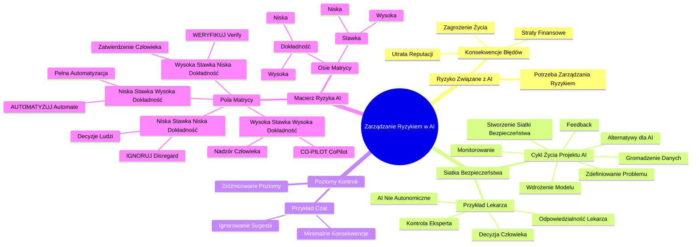

# Lekcje wideo - 5. Cykl życia projektu AI Utwórz siatkę bezpieczeństwa

# 💡 Diagram

___

# 🗒️ Notatka

# Notatki i Podsumowanie: Zarządzanie Ryzykiem w Projektach AI

## Wprowadzenie

Niniejsze notatki dotyczą **zarządzania ryzykiem** w projektach **sztucznej inteligencji (AI)**. Podkreślono, że tworzenie modeli AI to nie tylko kwestia danych i algorytmów, ale przede wszystkim odpowiedzialność za potencjalne konsekwencje ich działania w rzeczywistych warunkach. W materiale omówiono koncepcję `siatki bezpieczeństwa` oraz **macierzy ryzyka AI**, które pomagają kontrolować i minimalizować ryzyko związane z wdrażaniem systemów AI.

## Kluczowe Zagadnienia

### 1. Ryzyko Związane z AI ⚠️

* Tworzenie modeli AI to nie tylko kwestia danych i algorytmów, ale przede wszystkim **zarządzanie ryzykiem**.
* AI, mimo poprawnego działania w środowisku testowym, może generować **błędy w rzeczywistych warunkach**, niosące za sobą konsekwencje, takie jak:
    * **Straty finansowe** 💰
    * **Utrata reputacji** 📉
    * **Zagrożenie życia ludzkiego** 🚑 (w skrajnych przypadkach)
* Przed wdrożeniem modelu AI niezbędne jest stworzenie **`siatki bezpieczeństwa`** – zespołu mechanizmów kontroli i minimalizacji ryzyka błędnych decyzji.

### 2. `Siatka Bezpieczeństwa` w Cyklu Życia Projektu AI 🔄

* **Cykl życia projektu AI** (schemat blokowy):
    1. **Zdefiniowanie problemu** 🎯
    2. **Gromadzenie danych** 📊
    3. **Rozważenie alternatyw dla AI** (analiza rozwiązań innych niż AI) 🤔
    4. **Stworzenie `siatki bezpieczeństwa`** (kluczowy etap przed wdrożeniem) 🛡️
    5. **Wdrożenie modelu** 🚀
    6. **Zbieranie informacji zwrotnej** (feedback po wdrożeniu) 👂
    7. **Monitorowanie** (ciągłe śledzenie działania modelu) 👁️
* **Przykład Lekarza i Diagnozy AI:** 🧑‍⚕️
    * Lekarz korzysta z systemu AI, który sugeruje diagnozy na podstawie milionów przypadków.
    * **AI sugeruje, ale ostateczna decyzja należy do człowieka (lekarza).**
    * Lekarz **ponosi odpowiedzialność** za potwierdzenie diagnozy, konsultację z pacjentem i decyzję o leczeniu.
    * W kwestiach zdrowia i życia **AI nie może działać autonomicznie**.
    * **Kontrola eksperta (człowieka) jest niezbędna.**

### 3. Zróżnicowane Poziomy Kontroli w Zależności od Kontekstu ⚖️

* Nie każdy system AI wymaga tak **rygorystycznej kontroli**, jak w przypadku zastosowań medycznych.
* **Przykład Podpowiedzi w Czacie:** 💬
    * AI proponuje odpowiedzi w oknie czatu, bazując na kontekście rozmowy.
    * Błędy AI w tym scenariuszu mają **minimalne konsekwencje**.
    * Użytkownik ma możliwość **zignorowania sugestii** i wprowadzenia własnej wiadomości.

### 4. **Macierz Ryzyka AI** - Dostosowanie Nadzoru do Znaczenia Decyzji 📐

* **Macierz ryzyka AI** (matryca) pomaga dopasować poziom nadzoru do wagi decyzji podejmowanych przez AI.
* **Osie matrycy:**
    * **Oś pionowa: Stawka (Wysoka/Niska)** - konsekwencje błędnej decyzji.
    * **Oś pozioma: Dokładność (Niska/Wysoka)** - pewność modelu AI.
* **Cztery pola matrycy:**
    * **Wysoka stawka, Niska dokładność: WERYFIKUJ (Verify)** ✅
        * AI sugeruje decyzję, **człowiek musi ją zatwierdzić**.
        * **Przykład:** AI prognozuje reakcje pacjentów na leki, lekarz zatwierdza zmiany w terapii.
    * **Wysoka stawka, Wysoka dokładność: CO-PILOT (CoPilot)** 🧑‍✈️
        * AI działa bardziej autonomicznie, lecz nadal **pod nadzorem człowieka**.
        * **Przykład:** Systemy detekcji oszustw finansowych. AI identyfikuje i blokuje transakcje, analityk weryfikuje przed zamrożeniem konta.
    * **Niska stawka, Niska dokładność: IGNORUJ (Disregard)** ❌
        * **Ignoruj wyniki AI**, polegaj na decyzjach ludzi.
        * **Przykład:** Systemy odpowiadające na komentarze w mediach społecznościowych, które błędnie interpretują ton wypowiedzi.
    * **Niska stawka, Wysoka dokładność: AUTOMATYZUJ (Automate)** 🤖
        * **Pełna automatyzacja procesu.**
        * **Przykład:** AI rekomendujące utwory w serwisach streamingowych. Błąd ma znikome konsekwencje (pominięcie utworu).

## Podsumowanie

Wdrażanie modeli AI wiąże się z ryzykiem, którym należy aktywnie zarządzać. Kluczowym elementem jest **stworzenie `siatki bezpieczeństwa`**, zapewniającej kontrolę nad działaniem AI. Poziom nadzoru nad systemem AI powinien być **dostosowany do wagi podejmowanych decyzji oraz dokładności modelu**. **Macierz ryzyka AI** stanowi narzędzie pomocne w określeniu adekwatnego poziomu kontroli – od weryfikacji decyzji AI przez człowieka, poprzez model działający jako co-pilot, aż po pełną automatyzację w sytuacjach niskiego ryzyka. Zrozumienie i stosowanie zasad **zarządzania ryzykiem** jest fundamentalne dla odpowiedzialnego i bezpiecznego wdrażania technologii AI.

___

# 🔉 Transcript
File: Lekcje wideo - 5. Cykl życia projektu AI Utwórz siatkę bezpieczeństwa.mp4 
[00:00:05] Budowanie modelu AI to nie tylko kwestia danych i algorytmów.
[00:00:10] To również zarządzanie ryzykiem.
[00:00:11] AI może działać dobrze w warunkach testowych, ale co się stanie, gdy zacznie podejmować decyzję w rzeczywistości?
[00:00:18] Błędy w AI mogą kosztować, czasem pieniądze, czasem reputację, a w niektórych przypadkach nawet ludzkie życie.
[00:00:25] (Ekran: Schemat blokowy zatytułowany "Cykl życia projektu AI". Kolejne kroki to: 01. Określ problem, 02. Zbieraj dane, 03. Spróbuj poza AI, 04. Utwórz siatkę bezpieczeństwa, 05. Wystawny model, 06. Zbieraj feedback, 07. Monitoruj.)
[00:00:25] Dlatego zanim wdrożymy model, musimy stworzyć tak zwaną siatkę bezpieczeństwa, która pozwoli nam kontrolować jego działanie i zminimalizować ryzyko błędnych decyzji.
[00:00:35] (Ekran: Zdjęcie lekarza z tabletem rozmawiającego z pacjentką.)
[00:00:35] Wyobraźcie sobie lekarza, który przekazuje pacjentowi diagnozę, ale zamiast samemu analizować wyniki badań, korzysta z systemu AI, który sugeruje możliwe schorzenia.
[00:00:45] Model został wytrenowany na milionach przypadków, a jego skuteczność jest wysoka.
[00:00:50] Czy oznacza to, że lekarz może bezrefleksyjnie przekazać pacjentowi wynik od AI?
[00:00:55] Oczywiście, że nie.
[00:00:56] To właśnie przykład siatki bezpieczeństwa, w której człowiek pozostaje ostatecznym decydentem.
[01:02] AI może sugerować diagnozę, ale to lekarz bierze odpowiedzialność za jej potwierdzenie, konsultuje się z pacjentem i podejmuje decyzję o leczeniu.
[01:10] W sytuacjach, gdzie stawką jest ludzkie zdrowie i życie, AI nie może działać autonomicznie.
[01:14] Potrzebna jest kontrola eksperta.
[01:17] (Ekran: Dwa ekrany smartfonów z konwersacjami tekstowymi.)
[01:18] Nie każdy system AI wymaga tak ścisłej kontroli.
[01:21] Wyobraźmy sobie inny przypadek, automatyczne podpowiedzi w czacie.
[01:25] AI analizuje kontekst rozmowy i sugeruje użytkownikowi gotowe odpowiedzi.
[01:30] Nawet jeśli czasem system się pomyli i nie zrozumie intencji, konsekwencje są niewielkie.
[01:35] Użytkownik po prostu zignoruje sugestię i wpisze własną wiadomość.
[01:40] (Ekran: Macierz ryzyka AI. Oś pionowa: High stakes, Low stakes. Oś pozioma: Low accuracy, High accuracy. Cztery pola: Verify, CoPilot, Disregard, Automate.)
[01:40] Dlatego tak ważne jest dopasowanie poziomu nadzoru do wagi decyzji, jakie podejmuje AI.
[01:46] Wykorzystujemy do tego matrycę ryzyka AI, która pomaga określić, kiedy model może działać samodzielnie, a kiedy konieczna jest interwencja człowieka.
[01:55] Jeśli mamy wysoką stawkę i niską dokładność, model powinien jedynie sugerować decyzję, a człowiek powinien je zatwierdzać.
[02:02] Przykład?
[02:03] AI przewiduje, którzy pacjenci mogą źle zareagować na lek, ale lekarz musi potwierdzić każdą zmianę w terapii.
[02:09] Gdy stawka jest wysoka, ale model jest bardzo dokładny, możemy pozwolić mu działać nieco bardziej autonomicznie, ale nadal pod okiem człowieka.
[02:17] Przykład?
[02:18] Systemy wykrywające oszustwa finansowe w bankach.
[02:21] AI może wskazywać i blokować podejrzane transakcje, ale to analityk nadal weryfikuje je przed zamrożeniem konta.
[02:27] Z kolei, gdy stawka jest niska i dokładność modelu niewielka, najlepiej całkowicie zignorować wyniki AI i polegać na ludziach.
[02:34] Tak dzieje się na przykład w przypadku systemów, które próbują odpowiadać na komentarze w social media, ale często błędnie interpretują ton wypowiedzi.
[02:42] Jeśli jednak stawka jest niska, a dokładność wysoka, możemy w pełni zautomatyzować proces.
[02:47] Przykład?
[02:48] AI, które rekomendują utwory w serwisach streamingowych.
[02:51] Nawet jeśli model się pomyli, użytkownik po prostu pominie dany utwór.
[02:56] [background music ends]

___
# 🏷️ Tags
#zarządzanie_ryzykiem #ryzyko #AI #sztuczna_inteligencja #model_AI #błędy_AI #straty_finansowe #utrata_reputacji #zagrożenie_życia #siatka_bezpieczeństwa #cykl_życia_projektu_AI #definiowanie_problemu #gromadzenie_danych #alternatywy_dla_AI #wdrożenie_modelu #informacja_zwrotna #monitorowanie #lekarz #diagnoza_AI #odpowiedzialność #kontrola_eksperta #czat #podpowiedzi_w_czacie #minimalne_konsekwencje #macierz_ryzyka_AI #stawka #dokładność #WERYFIKUJ #Verify #CO-PILOT #CoPilot #IGNORUJ #Disregard #AUTOMATYZUJ #Automate #nadzór #automatyzacja #bezpieczeństwo #rygorystyczna_kontrola #kontekst #decyzje #oszustwa_finansowe #rekomendacje #streaming #systemy_rekomendacyjne #modele_uczenia_maszynowego #machine_learning
